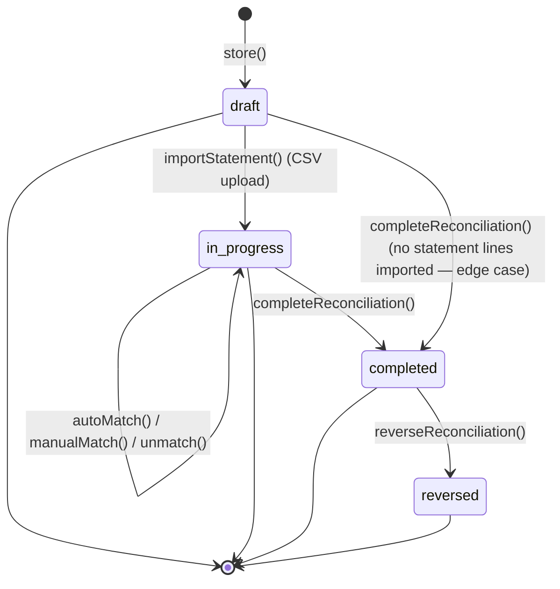
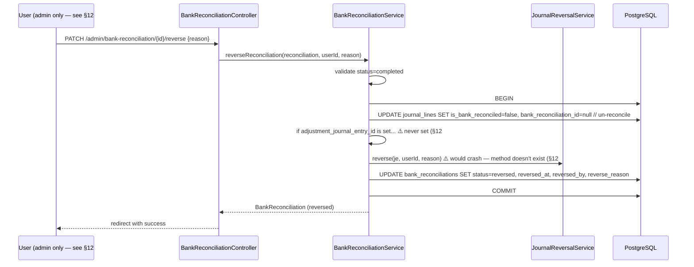

# Bank Reconciliation

> **Module:** Accounting Transactions (SAFETY-CRITICAL)
> **Audience:** Engineers + AI assistants + **accountants** (must review before Canonical)
> **Status:** Draft — pending accountant sign-off
> **Last reviewed:** 2025-08-03
> **Source of truth:** this file + `laravel/app/Services/Accounting/BankReconciliationService.php` + `laravel/database/migrations/2026_08_12_000001_create_bank_reconciliation.php` (DDL for bank_reconciliations, bank_statement_lines, bank_reconciliation_items) + `laravel/app/Models/BankLedgerMapping.php`

## 1. What is it?

**Bank reconciliation** is the periodic matching of the enterprise's bank-ledger GL balance
(the "book" balance) against the bank's statement balance (the "bank" balance) for a specific
bank account and statement period. The goal is to identify and explain the difference — typically
caused by deposits in transit, outstanding checks, bank charges not yet booked, and errors.

This is a **Phase 9.3 feature** — added after the original accounting engine. It is fully
implemented (not aspirational), but has several significant gaps documented in §12. Phase 6's
`subledger-reconciliation.md` correctly deferred bank reconciliation to this Phase 7 file.

The module supports:
- Bank statement import (CSV upload or manual entry).
- Auto-matching of statement lines against system journal lines (multi-criteria scoring).
- Manual matching for items the auto-match missed.
- Reconciliation summary with adjusted book/bank balances and the difference.
- Completion (locks the reconciliation, marks journal lines as reconciled).
- Reversal (un-reconciles all journal lines, reverses any adjustment JE).

## 2. Why does it exist?

- The bank-ledger GL balance drifts from the actual bank balance due to timing (deposits in
  transit, outstanding checks) and to items the bank knows about but the enterprise hasn't booked
  yet (bank charges, interest credits, NSF bounces).
- Without periodic reconciliation, the bank-ledger control account becomes unreliable and the
  trial balance cannot be trusted.
- Regulatory and audit requirements mandate periodic bank reconciliation (typically monthly).
- The auto-match scoring algorithm reduces the accountant's manual effort from "compare every
  statement line to every journal line" to "review the suggested matches and confirm".

## 3. When is it used?

- **Monthly close:** the accountant downloads the bank statement CSV, imports it, runs auto-match,
  manually matches the remaining items, reviews the summary, and completes the reconciliation.
- **Mid-month spot check:** if the bank-ledger balance looks wrong, the accountant can start a
  reconciliation mid-period to identify the discrepancy.
- **Audit response:** the external auditor requests the bank reconciliation for a specific period;
  the accountant can reverse and re-complete if needed (see §11).

## 4. Who uses it?

- ⚠️ **Route middleware allows `role:accountant,manager,admin`** on all bank-reconciliation routes.
- ⚠️ **BUT RLS is admin-only** (see §12 #1) — accountants and managers get **empty result sets**
  when they try to read/write bank reconciliation data. Only admins can actually use the module.
- **Admins** can override branch scope.
- ⚠️ **No Policy class** exists — RBAC is enforced by route middleware + RLS only.
- ⚠️ **No `branch.isolation` middleware** on any bank-reconciliation route (see §12 #2) — relies
  entirely on RLS.

## 5. Related modules

- `subledger-reconciliation.md` — Phase 6 noted "bank recon separate Phase 7". This is the
  deferred Phase 7 documentation. Cross-link back to the `bank_ledger_mappings` table description
  + `cash_bank` nature ledger.
- `journal-posting-rules.md` — the `cash_bank` nature Dr/Cr matrix that this module reconciles.
- `running-balance.md` — the bank-ledger running balance formula.
- `money-transfers.md`, `employee-transactions.md`, `supplier-transactions.md`,
  `customer-payments.md`, `other-income-expense.md` — all post bank-ledger entries that this
  module matches against.
- `financial-audit-log.md` — ⚠️ the bank reconciliation tables are **NOT** in the immutable hash
  chain (see §12 #5).

## 6. Business rules (the Core Rule)

- **MUST** record a `reconciliation_code` (unique, format `BR-YYYY-MM-NNN`) via
  `DocumentSequenceService`.
- **MUST** prevent overlapping active reconciliations for the same bank+period (partial unique
  index `uq_br_bank_period_active` on `(bank_id, period_from, period_to) WHERE deleted_at IS NULL
  AND status IN ('draft', 'in_progress')`).
- **MUST** import bank statement lines (CSV upload or manual entry) before matching.
- **MUST** auto-match statement lines against unreconciled system journal lines using the
  multi-criteria scoring algorithm (§7.4). Auto-confirmed matches (score >= 80) mark the journal
  line as `is_bank_reconciled=true` immediately.
- **MUST** let the user manually match unmatched items (`manualMatch`).
- **MUST** recalculate the adjusted book/bank balances and the difference after every match/unmatch
  operation (`recalculateBalances`).
- **MUST** lock the reconciliation on completion — no further match/unmatch/import allowed.
- **MUST** reverse (not edit) a completed reconciliation by calling `reverseReconciliation`, which
  un-reconciles all matched journal lines and reverses any adjustment JE. See §11 + §12 #3.
- **MUST NOT** allow completion if `isEditable()` returns false (already completed or reversed).
- **MUST NOT** allow auto-match or manual match on a non-editable reconciliation.

> ⚠️ **CRITICAL GAP (§12 #3):** `completeReconciliation` does **NOT** post the adjustment journal
> entry. The `adjustment_journal_entry_id` column exists on `bank_reconciliations` but is NEVER
> written by the service. If `difference != 0` at completion (i.e., bank charges / interest /
> errors need to be booked), the user must manually create a separate manual journal entry — the
> reconciliation doesn't auto-post the adjustment. This is a significant gap from the migration's
> stated workflow.

## 7. Technical implementation

### 7.1 The `bank_reconciliations` table — migration `2026_08_12_000001` L47-98

| Column | Type | Notes |
|---|---|---|
| `id` | PK | |
| `reconciliation_code` | `varchar(30) UNIQUE` | `BR-YYYY-MM-NNN` |
| `bank_id` | FK banks (RESTRICT) | |
| `statement_date` | `date NOT NULL` | |
| `period_from`, `period_to` | `date NOT NULL` | partial unique index |
| `statement_opening_balance`, `statement_closing_balance` | `numeric(15,2)` | from the bank statement |
| `system_opening_balance`, `system_closing_balance` | `numeric(15,2)` | from the GL bank-ledger |
| `adjusted_book_balance`, `adjusted_bank_balance`, `difference` | `numeric(15,2)` | computed by `recalculateBalances` |
| `status` | `varchar(20) CHECK IN (draft,in_progress,completed,reversed)` | |
| `total_statement_lines`, `matched_lines`, `unmatched_statement_lines`, `unmatched_system_entries` | integer | summary counts |
| `adjustment_journal_entry_id` | FK journal_entries (NULL ON DELETE) | ⚠️ NEVER written — see §12 #3 |
| `notes`, `created_by`, `completed_by`, `completed_at`, `reversed_by`, `reversed_at`, `reverse_reason` | | |
| `deleted_at`, timestamps | | soft deletes |

RLS (migration L225-233): **admin-only** — `USING (current_setting('app.is_admin', true) = 'true')`
on all three tables. ⚠️ See §12 #1.

### 7.2 The `bank_statement_lines` table — migration L101-124

| Column | Type | Notes |
|---|---|---|
| `id` | PK | |
| `bank_reconciliation_id` | FK (CASCADE) | |
| `transaction_date`, `description`, `reference` | | `reference` = cheque no, etc. |
| `debit` | `numeric(15,2)` | money out (from bank's perspective) |
| `credit` | `numeric(15,2)` | money in |
| `balance` | `numeric(15,2)` | running balance from the statement |
| `match_status` | `varchar(20) CHECK IN (unmatched,suggested,matched,excluded)` | |
| `line_number` | integer | original CSV row number |
| `raw_data` | JSONB | original CSV row for audit |

### 7.3 The `bank_reconciliation_items` table — migration L128-161

| Column | Type | Notes |
|---|---|---|
| `id` | PK | |
| `bank_reconciliation_id` | FK (CASCADE) | |
| `bank_statement_line_id` | FK (CASCADE) | |
| `journal_line_id` | FK (CASCADE to journal_lines) | the GL line being matched |
| `journal_entry_id` | FK (NULL ON DELETE) | |
| `match_type` | `varchar(20) CHECK IN (auto,manual)` | |
| `matched_amount` | `numeric(15,2)` | |
| `notes`, `matched_by`, `matched_at` | | |

### 7.4 Auto-match scoring algorithm — `autoMatch` (L219-323)

**Multi-criteria scoring:**

| Criterion | Score |
|---|---|
| Exact amount match (within 0.01 tolerance) | +50 base |
| `transaction_date` matches exactly (diffInDays === 0) | +30 |
| Within `DATE_TOLERANCE_DAYS = 5` days | +15 |
| Date diff > 5 days | −10 |
| Reference (cheque no) matches `entry_no` (case-insensitive substring) | +20 |

**Thresholds:**

| Score | Result |
|---|---|
| >= 80 | `match_status='matched'` (auto-confirmed, journal_line marked `is_bank_reconciled=true`) |
| 60-79 | `match_status='suggested'` (awaiting user confirmation) |
| < 60 | remains `unmatched` |

```php
// BankReconciliationService.php:286-318
if ($bestMatch && $bestScore >= 60) {
    $matchStatus = $bestScore >= 80 ? 'matched' : 'suggested';
    BankReconciliationItem::create([
        'bank_reconciliation_id' => $reconciliation->id,
        'bank_statement_line_id' => $statementLine->id,
        'journal_line_id' => $bestMatch->id,
        'journal_entry_id' => $bestMatch->journal_entry_id,
        'match_type' => 'auto',
        'matched_amount' => $stmtAmount,
        'matched_by' => Auth::id(),
        'matched_at' => now(),
    ]);
    $statementLine->update(['match_status' => $matchStatus]);
    if ($matchStatus === 'matched') {
        $bestMatch->update([
            'is_bank_reconciled' => true,
            'bank_reconciliation_id' => $reconciliation->id,
        ]);
    }
    $matchedCount++;
}
```

### 7.5 Balance calculation — `recalculateBalances` (L575-624)

```php
// Deposits in transit: statement deposits NOT matched to system entries
$depositsInTransit = (float) $reconciliation->statementLines()
    ->where('match_status', 'unmatched')
    ->where('credit', '>', 0)
    ->sum('credit');

// Outstanding checks: system withdrawals NOT matched to statement lines
$outstandingChecks = ...;  // sum of debit on unreconciled journal_lines

// Adjusted Book Balance = System Closing + Deposits in Transit - Outstanding Checks
$adjustedBook = $systemClosing + $depositsInTransit - $outstandingChecks;

// Adjusted Bank Balance = Statement Closing
$adjustedBank = $statementClosing;

$difference = $adjustedBook - $adjustedBank;
```

> ⚠️ **GAP (§12 #4):** The formula uses `adjusted_bank_balance = statement_closing_balance`
> directly. The docblock (L34-44) says "Adjusted Bank Balance = Statement Closing Balance +
> Deposits in Transit - Outstanding Checks" but the code doesn't add deposits in transit or
> subtract outstanding checks from the bank side. This appears to be a bug — the formula should
> match the docblock. The `difference` computed by the code is therefore
> `(systemClosing + depositsInTransit - outstandingChecks) - statementClosing`, which is the
> correct reconciliation difference, but the `adjusted_bank_balance` column is misleading.

### 7.6 The `journal_lines` additions — migration L165-172

```sql
ALTER TABLE journal_lines
    ADD COLUMN is_bank_reconciled boolean DEFAULT false,
    ADD COLUMN bank_reconciliation_id integer REFERENCES bank_reconciliations(id) ON DELETE SET NULL;
CREATE INDEX idx_journal_lines_bank_reconciled ON journal_lines (is_bank_reconciled, ledger_id);
```

This lets the `v_unreconciled_bank_entries` view (L185-222) quickly find journal lines that are
not yet reconciled, for a given bank-ledger.

### 7.7 The `v_unreconciled_bank_entries` view — migration L185-222

Joins `journal_lines` → `journal_entries` → `ledgers` → `bank_ledger_mappings` → `banks` →
`branches`. Filters `is_bank_reconciled=false AND is_reversed=false AND bank_id IS NOT NULL`.
Used by the `unreconciled` route to show the accountant what's available for matching.

## 8. Intercompany settlement — N/A

Bank reconciliation is an intra-branch operation. It matches the bank-ledger GL entries (which
already include any intercompany postings from the operational modules) against the bank
statement. There is no separate intercompany settlement at the reconciliation level.

## 9. Workflow / state machine



- **`draft`** — Initial creation, statement lines being imported/matched. `isEditable()` returns
  true.
- **`in_progress`** — User is actively matching items. `isEditable()` returns true. Set
  automatically after CSV import.
- **`completed`** — Reconciliation finalized, adjustment entries posted (⚠️ GAP §12 #3 — not
  actually posted), journal lines locked as reconciled. `isEditable()` returns false.
- **`reversed`** — Reversal of a completed reconciliation. Un-reconciles all journal lines,
  reverses adjustment JE (⚠️ GAP §12 #6 — calls nonexistent `reverse()` method).

## 10. Validation & input rules

⚠️ **No dedicated FormRequest classes** — validation is inline in
`BankReconciliationController`:

```php
// store (L71-78)
$validated = $request->validate([
    'bank_id' => 'required|exists:banks,id',
    'period_from' => 'required|date',
    'period_to' => 'required|date|after_or_equal:period_from',
    'statement_opening_balance' => 'nullable|numeric',
    'statement_closing_balance' => 'nullable|numeric',
    'notes' => 'nullable|string|max:500',
]);

// import-statement (L148-150)
'csv_file' => 'required|file|mimes:csv,txt|max:5120',

// manual-match (L228-231)
'statement_line_id' => 'required|exists:bank_statement_lines,id',
'journal_line_id' => 'required|exists:journal_lines,id',
```

The CSV import parses the file and creates `bank_statement_lines` rows. The CSV format is
expected to have columns: `transaction_date`, `description`, `reference`, `debit`, `credit`,
`balance`. Header row is skipped. There is no CSV schema validation — malformed rows are skipped
with a warning.

## 11. Reversal & correction flow

`reverseReconciliation` (L444-484) — runs in a `DB::transaction`:

```php
public function reverseReconciliation(BankReconciliation $reconciliation, int $userId, string $reason): BankReconciliation
{
    if (!$reconciliation->isCompleted()) {
        throw new \InvalidArgumentException("Only completed reconciliations can be reversed.");
    }
    DB::transaction(function () use ($reconciliation, $userId, $reason) {
        // 1. Un-reconcile all matched journal lines
        $matchedJournalLineIds = $reconciliation->reconciliationItems()
            ->pluck('journal_line_id')->toArray();
        JournalLine::whereIn('id', $matchedJournalLineIds)
            ->where('bank_reconciliation_id', $reconciliation->id)
            ->update([
                'is_bank_reconciled' => false,
                'bank_reconciliation_id' => null,
            ]);
        // 2. Reverse the adjustment journal entry if one exists
        if ($reconciliation->adjustment_journal_entry_id) {
            $je = \App\Models\Accounting\JournalEntry::find($reconciliation->adjustment_journal_entry_id);
            if ($je && !$je->is_reversed) {
                app(JournalReversalService::class)->reverse($je, $userId,
                    "Reversal of bank reconciliation adjustment: {$reason}");
            }
        }
        // 3. Mark the reconciliation as reversed
        $reconciliation->update([
            'status' => 'reversed',
            'reversed_by' => $userId,
            'reversed_at' => now(),
            'reverse_reason' => $reason,
        ]);
    });
    return $reconciliation->fresh();
}
```

> ⚠️ **CRITICAL GAP (§12 #6):** `app(JournalReversalService::class)->reverse($je, $userId, $reason)`
> — `JournalReversalService` has **NO `reverse()` method**. The class only defines
> `reverseByJournalEntry(int $jeId, int $reversedBy, string $reason)` (takes JE **id**, not JE
> model) and `reverseByReference(string, int, string)`. Calling `->reverse($je, ...)` would throw
> `BadMethodCallException` at runtime. Since `adjustment_journal_entry_id` is never populated (§12
> #3), this code path is currently **unreachable** — but if anyone ever wires up adjustment JE
> posting, this reversal will crash.



## 12. Open questions / known gaps

1. **CRITICAL — RLS is admin-only.** All three bank reconciliation tables have admin-only RLS
   policies (`USING (current_setting('app.is_admin', true) = 'true')`). The route middleware
   allows `role:accountant,manager,admin`, but RLS blocks accountants and managers — they get
   **empty result sets**. Only admins can actually use the module. This is a major configuration
   error. **Recommended fix:** either change RLS to allow accountant/manager roles (matching the
   route middleware), or change the route middleware to `role:admin` only. **Accountant must
   decide who should have access.**
2. **CRITICAL — No `branch.isolation` middleware** on any bank-reconciliation route. The
   middleware stack relies entirely on RLS. But RLS is admin-only (§12 #1), so branch isolation
   is effectively bypassed for admins (who can see all banks across all branches). If the access
   is broadened to accountants (§12 #1 fix), `branch.isolation` middleware MUST be added to
   enforce per-branch bank access.
3. **CRITICAL — `completeReconciliation` does NOT post adjustment JE.** The
   `adjustment_journal_entry_id` column exists but is NEVER written. If `difference != 0` at
   completion (bank charges, interest, errors need to be booked), the user must manually create a
   separate manual journal entry — the reconciliation doesn't auto-post the adjustment. This is a
   significant gap from the migration's stated workflow (L25-26: "User completes reconciliation →
   posts adjustment entries (bank charges, interest, errors)"). **Recommended fix:** in
   `completeReconciliation`, if `difference != 0`, post an adjustment JE via
   `JournalPostingService::createJournalEntry` with `reference_type='bank_reconciliation_adjustment'`,
   Dr/Cr the bank-ledger and a configurable `bank_charges` / `bank_interest_income` ledger, and
   store the JE id in `adjustment_journal_entry_id`.
4. **HIGH — `recalculateBalances` formula doesn't match the docblock.** The docblock (L34-44) says
   "Adjusted Bank Balance = Statement Closing Balance + Deposits in Transit - Outstanding Checks"
   but the code sets `adjusted_bank_balance = statement_closing_balance` directly. The
   `difference` is still computed correctly (because `adjusted_book_balance` does include deposits
   in transit and outstanding checks), but the `adjusted_bank_balance` column is misleading.
   **Recommended fix:** either update the code to match the docblock, or update the docblock to
   match the code. **Accountant must confirm the intended formula.**
5. **HIGH — NO `fn_financial_audit_trigger` on the three bank reconciliation tables.** They were
   added later via migration `2026_08_12_000001` and the trigger attachment in
   `02_accounting.sql:446-455` was not updated. Reconciliation changes (create, match, complete,
   reverse) are NOT in the immutable hash chain. Only the standard `user_audit_log` is used (via
   the controller's try/catch Log::error statements). **Recommended fix:** attach
   `fn_financial_audit_trigger` to all three tables in a new migration.
6. **CRITICAL — `reverseReconciliation` calls nonexistent `JournalReversalService::reverse()`
   method** (§11). Would crash if `adjustment_journal_entry_id` is ever populated. Currently
   unreachable (because §12 #3 means it's never set), but a latent bug. **Recommended fix:**
   change the call to `reverseByJournalEntry($je->id, $userId, $reason)`.
7. **MEDIUM — No `BankReconciliationPolicy`.** RBAC is enforced by route middleware + RLS only.
   Compare to Employee/Supplier/Customer/ManualJournal which all have Policy classes. **Recommended:**
   add a Policy class if per-action granularity is needed (e.g. only the creator can reverse
   within 24h).
8. **LOW — `BankStatementLine::isDeposit()` returns true if `credit > 0` (L82).** Doesn't handle
   the case where both debit and credit are 0 (skipped gracefully but technically valid). Not a
   real issue in practice — banks don't issue zero-amount statement lines.
9. **LOW — CSV import has no schema validation.** Malformed rows are skipped with a warning. If
   the CSV has the wrong column order or missing columns, the import silently produces garbage
   `bank_statement_lines` rows. **Recommended:** validate the CSV header row against the expected
   schema before parsing.
10. **No `bank_charges` / `bank_interest_income` ledger natures registered.** If §12 #3 is fixed to
    auto-post adjustment JEs, the offsetting ledger must be configurable. Currently
    `LedgerNatureService` has no `bank_charges` or `bank_interest_income` nature — the accountant
    would need to pick a specific ledger at completion time, or new natures must be registered.

## 13. Accountant review checklist

> **This is a SAFETY-CRITICAL document.** Before marking it Canonical, an accountant with
> production credentials MUST review and sign off on each item below.

- [ ] The RLS admin-only restriction (§12 #1) — who should have access to bank reconciliation?
      Accountants? Managers? Admins only? Confirm the desired access matrix.
- [ ] The lack of `branch.isolation` middleware (§12 #2) — if access is broadened, this MUST be
      added.
- [ ] The adjustment-JE non-posting gap (§12 #3) — should `completeReconciliation` auto-post an
      adjustment JE when `difference != 0`? If yes, confirm the offsetting ledger(s) to use
      (`bank_charges`, `bank_interest_income`, or a user-selected ledger).
- [ ] The `recalculateBalances` formula mismatch (§12 #4) — which formula is correct: the
      docblock version or the code version?
- [ ] The lack of `fn_financial_audit_trigger` (§12 #5) — should bank reconciliation changes be
      in the immutable hash chain? (Recommended: yes, for SOX-style compliance.)
- [ ] The `reverse()` method call bug (§12 #6) — confirm this is a latent bug and should be
      fixed to `reverseByJournalEntry($je->id, ...)`.
- [ ] The auto-match scoring thresholds (§7.4: 80 for auto-confirm, 60 for suggestion) — are
      these appropriate for the production data? Too aggressive? Too conservative?
- [ ] The `DATE_TOLERANCE_DAYS = 5` (§7.4) — is 5 days the right tolerance for matching
      transaction dates? Bank statement dates often lag system posting dates by 1-3 days.
- [ ] The partial unique index on `(bank_id, period_from, period_to)` (§7.1) — does it correctly
      prevent overlapping active reconciliations? Should the period be `[period_from, period_to]`
      (inclusive) or `[period_from, period_to)` (half-open)?
- [ ] The reversal cascade (§11) correctly un-reconciles journal lines and reverses the
      adjustment JE (once §12 #3 and §12 #6 are fixed).
- [ ] The CSV import format (§10) — confirm the expected column order and whether header
      validation should be added.
- [ ] The lack of `bank_charges` / `bank_interest_income` ledger natures (§12 #10) — should these
      be registered in `LedgerNatureService`?
