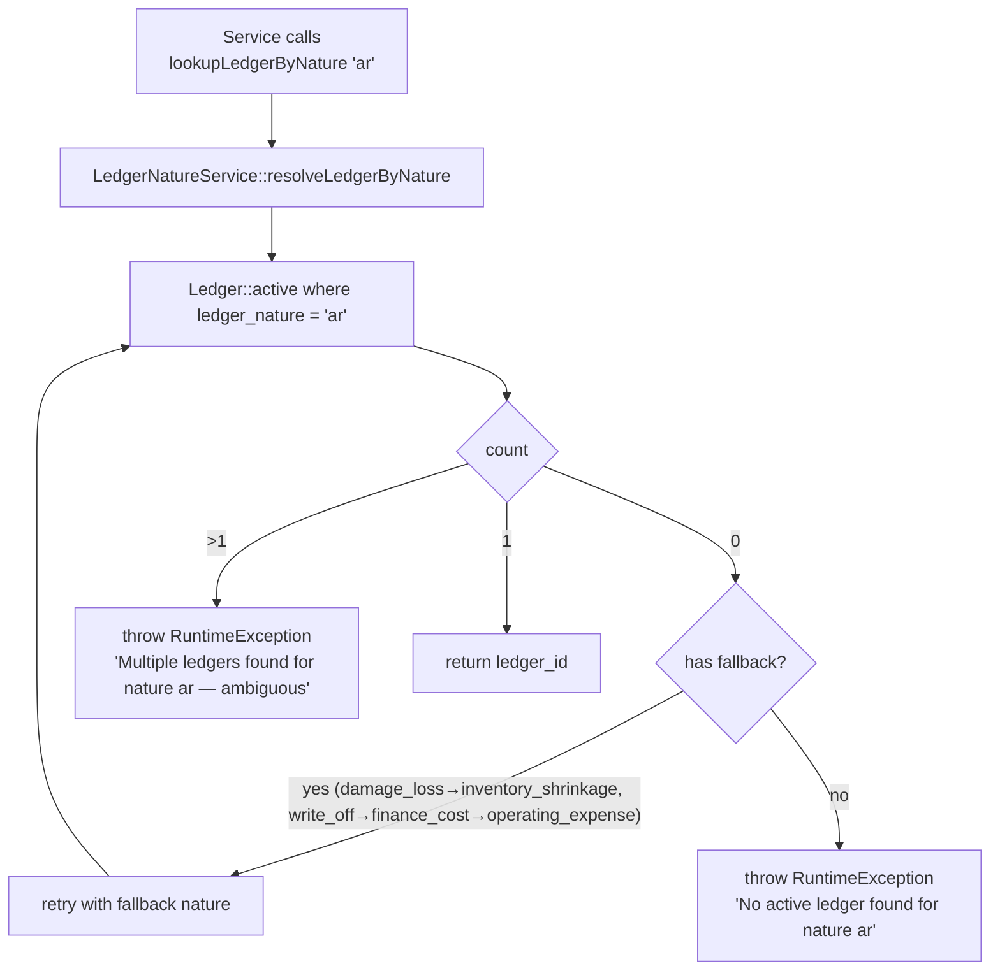
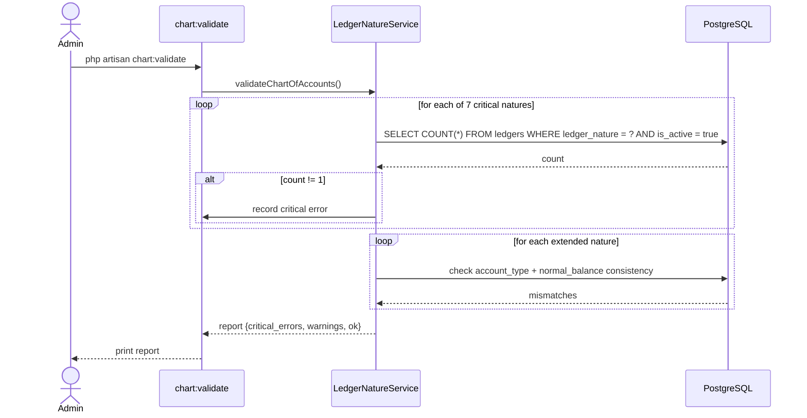

# Chart of Accounts & Ledger Natures

> **Module:** Accounting (SAFETY-CRITICAL)
> **Audience:** Engineers + AI assistants + **accountants** (must review before Canonical)
> **Status:** Draft — pending accountant sign-off
> **Last reviewed:** 2025-08-03
> **Source of truth:** this file + `laravel/database/sql/02_accounting.sql` + `laravel/app/Services/Accounting/LedgerNatureService.php` + `laravel/app/Models/Ledger.php` + `laravel/database/migrations/2025_01_05_000001_seed_default_chart_of_accounts.php`

## 1. What is it?

The **Chart of Accounts (CoA)** is the structured list of GL ledgers that the posting engine writes
to. Each ledger has an `account_type` (one of `Asset, Liability, Equity, Income, Expense`), a
**ledger nature** (a behavior tag like `cash_bank`, `ar`, `inventory` that tells the posting
engine *which* ledger to use for a given business operation), and a `normal_balance` (debit or
credit). The CoA is a 3-level hierarchy seeded at install time. **7 ledger natures are
"critical"** — they MUST each resolve to exactly one active ledger or the posting engine cannot
function.

## 2. Why does it exist?

- The CoA decouples the posting engine from specific ledger IDs: a service posts "to the AR
  ledger" by looking up the `ar` nature, not by hardcoding a ledger ID. This lets a deployment
  rename or re-code ledgers without touching posting code.
- The "critical nature" rule guarantees that there is never ambiguity about where to post cash,
  receivables, payables, inventory, revenue, COGS, or retained earnings — the 7 things every
  double-entry ERP must agree on.
- The `is_control_account` flag marks ledgers that aggregate a sub-ledger (AR ↔ customers, AP ↔
  suppliers, Employee Payable ↔ employees), driving the reconciliation engine.

## 3. When is it used?

- **On every journal post** — `LedgerNatureService::resolveLedgerByNature($nature)` resolves a
  nature string to a ledger ID before inserting journal lines.
- **At install / setup** — the `2025_01_05_000001_seed_default_chart_of_accounts.php` migration
  seeds the default CoA (idempotent — only if `ledgers` is empty).
- **At validation** — `php artisan chart:validate` runs
  `LedgerNatureService::validateChartOfAccounts()` to confirm every critical nature resolves to
  exactly one active ledger.
- **At period close** — the pre-close gate checks that all control accounts reconcile with their
  sub-ledgers (see `subledger-reconciliation.md`).
- **At year-end close** — Income/Expense ledgers are zeroed to `retained_earnings`; BS ledgers
  carry forward (see `fiscal-year-period-close.md`).

## 4. Who uses it?

- **Accountants** configure the CoA (add ledgers, set opening balances).
- **Admins** manage ledgers via `LedgerController` (CRUD, soft-delete).
- **System/automated:** the posting engine resolves natures on every post; the validation command
  runs on demand.
- **AI assistants** MUST consult this file before writing any posting code.

## 5. Related modules

- `journal-posting-rules.md` — how natures map to Dr/Cr entries.
- `subledger-reconciliation.md` — control-account ↔ sub-ledger reconciliation.
- `fiscal-year-period-close.md` — year-end close zeroes Income/Expense to `retained_earnings`.
- `running-balance.md` — how ledger balances are computed.
- `../database/schema-overview.md` — the `ledgers` table in the schema catalog.
- `../database/triggers-views-constraints.md` — the `ledgers` CHECK constraints.

## 6. Business rules

- **MUST** keep exactly **one active ledger per critical nature**. Zero → critical error; more
  than one → critical error ("ambiguous — the posting engine cannot determine which to use").
- **MUST** keep the 5 `account_type` values exactly: `Asset, Liability, Equity, Income, Expense`
  (DB CHECK constraint enforces this).
- **MUST** set `normal_balance` to `debit` for Asset/Expense ledgers and `credit` for
  Liability/Equity/Income ledgers (DB CHECK `IN ('debit','credit')`).
- **MUST** flag the 3 sub-ledger control accounts with `is_control_account = true` and a
  `control_account_type` of `customer` / `supplier` / `employee`.
- **MUST** link banks to ledgers via the `bank_ledger_mappings` table (one row per bank).
- **MUST NOT** delete or rename a `is_system = true` ledger — these are the seeded critical
  ledgers protected from edit/delete (Phase 15 hardening).
- **MUST NOT** persist a ledger with `ledger_nature = 'user'` (the DB CHECK on `employees.role`
  mismatch is documented elsewhere; here, the nature list is open `varchar(50)` but unknown
  natures will fail the critical-nature validation).
- **SHOULD** run `php artisan chart:validate` after any CoA change.

## 7. Technical implementation

### 7.1 The `ledgers` table — `laravel/database/sql/02_accounting.sql:5-29`

Hierarchical via `parent_id` (0 = no parent; self-FK NOT added — commented out at
`07_*.sql:115`). Hardened by migration `2025_01_15_000001_add_missing_columns_to_ledgers.php`
(adds `is_system`, `normal_balance`, `description`, `created_by` + CHECK `normal_balance IN
('debit','credit')`), and `2026_08_09_000001_fix_ledger_normal_balance_values.php` (corrects
seeded values).

| Column | Type | Notes |
|---|---|---|
| `id` | `integer GENERATED ALWAYS AS IDENTITY PK` | |
| `ledger_code` | `varchar(20) NOT NULL UNIQUE` | e.g. `L-0101` |
| `ledger_name` | `varchar(100) NOT NULL` | |
| `parent_id` | `integer DEFAULT 0` | 0 = top-level (legacy sentinel) |
| `account_type` | `varchar(20) NOT NULL CHECK IN ('Asset','Liability','Equity','Income','Expense')` | the 5 main groups |
| `ledger_nature` | `varchar(50)` | behavior tag driving the posting engine |
| `is_control_account` | `boolean NOT NULL DEFAULT false` | true for AR/AP/Employee Payable |
| `control_account_type` | `varchar(30)` | `customer` / `supplier` / `employee` |
| `is_active` | `boolean NOT NULL DEFAULT true` | |
| `is_system` | `boolean NOT NULL DEFAULT false` | seeded critical ledgers — protected |
| `is_elimination` | `boolean NOT NULL DEFAULT false` | consolidation contra-ledgers |
| `normal_balance` | `varchar(10) DEFAULT 'debit' CHECK IN ('debit','credit')` | Dr-increases vs Cr-increases |
| `description` | `text` | |
| `opening_balance` | `numeric(15,2) DEFAULT 0` | fiscal-year-start carry-forward |
| `sort_order` | `integer DEFAULT 0` | |
| `created_by` | `integer` | FK users(id) |
| `created_at`, `updated_at` | `timestamp(0)` | auto-touched by `trg_ledgers_updated_at` |
| `deleted_at`, `deleted_by` | `timestamp(0)`, `integer` | soft-delete + attribution |

Indexes: `idx_ledgers_parent`, `idx_ledgers_account_type`, `idx_ledgers_nature`,
`idx_ledgers_active_by_type` (partial `WHERE is_active = true`).

### 7.2 The 7 critical ledger natures

Source: `laravel/app/Services/Accounting/LedgerNatureService.php:29-72` (`CRITICAL_NATURES`
constant), confirmed by `laravel/app/Models/Ledger.php:126-137` (`criticalNatures()` returns
`['cash_bank', 'ar', 'ap', 'inventory', 'sales_revenue', 'cogs', 'retained_earnings']`).

| # | Nature | Account type | Normal balance | Dr/Cr increases? | Financial statement | Used by |
|---|---|---|---|---|---|---|
| 1 | `cash_bank` | Asset | debit | **Dr increases** | BS | Payments, transfers, money transfers |
| 2 | `ar` | Asset | debit | **Dr increases** | BS | Sales invoices, customer payments, sales returns |
| 3 | `ap` | Liability | credit | **Cr increases** | BS | Purchase receives, supplier payments, purchase returns |
| 4 | `inventory` | Asset | debit | **Dr increases** | BS | All stock movements |
| 5 | `sales_revenue` | Income | credit | **Cr increases** | PL | Sales invoice finalize |
| 6 | `cogs` | Expense | debit | **Dr increases** | PL | Sales challan issue, sales return confirm |
| 7 | `retained_earnings` | Equity | credit | **Cr increases** | BS | Year-end close |

**Criticality rule** (`LedgerNatureService::validateChartOfAccounts`, lines 235-332): each
critical nature MUST resolve to **exactly one** active ledger. Zero → critical error. More than
one → critical error ("ambiguous — the posting engine cannot determine which to use"). The
`chart:validate` artisan command (`app/Console/Commands/ValidateChartOfAccounts.php`) exposes
this.

### 7.3 Extended natures — `LedgerNatureService::EXTENDED_NATURES` (lines 78-219)

| Nature | Account type | Normal balance | Used by |
|---|---|---|---|
| `sales_return` | Income | debit (contra-revenue) | Sales return confirm — revenue reversal |
| `sales_discount` | Expense | debit (contra-revenue) | Sales invoice with discount |
| `transport_revenue` | Income | credit | Sales invoice with transport cost |
| `inventory_shrinkage` | Expense | debit | Stock adjustment decrease, stock take loss, damage |
| `inventory_surplus` | Income | credit | Stock adjustment increase, stock take gain |
| `damage_loss` | Expense | debit | Damage confirm (falls back to `inventory_shrinkage` if missing) |
| `employee_payable` | Liability | credit | Employee transactions |
| `interbranch_receivable` | Asset | debit | Cross-branch transfers (Due-from-Branch) |
| `interbranch_payable` | Liability | credit | Cross-branch transfers (Due-to-Branch) |
| `other_income` | Income | credit | Other income entries |
| `operating_expense` | Expense | debit | Other expense entries |
| `salary_expense` | Expense | debit | Employee salary postings |
| `write_off` | Expense | debit | Bad debt write-off (uncollectable AR) |
| `finance_cost` | Expense | debit | Bank charges, interest |
| `elimination_receivable` | Asset | debit | Consolidation elimination — BS |
| `elimination_payable` | Liability | credit | Consolidation elimination — BS |
| `elimination_revenue` | Equity | credit | Consolidation elimination — income statement |
| `elimination_cogs` | Equity | debit | Consolidation elimination — income statement |
| `elimination_investment` | Equity | credit | Consolidation elimination — investment |
| `accumulated_depreciation` | Asset | credit (contra-asset) | Fixed asset depreciation posting |
| `depreciation_expense` | Expense | debit | Fixed asset depreciation posting |
| `gain_on_disposal` | Income | credit | Asset disposal — sale above book value |
| `loss_on_disposal` | Expense | debit | Asset disposal — sale below book value / write-off |

> **Note on `inventory_revaluation`:** `StockTakeService::postStockTakeGL` (line 2542) references
> an `inventory_revaluation` nature for cost-drift revaluation, but it is **NOT** in the
> `EXTENDED_NATURES` constant. This is a known gap — the lookup will fail unless a ledger with
> that nature exists. See §13.

### 7.4 Nature fallback chains

Two natures have fallback logic in `LedgerNatureService::resolveLedgerByNature()` (lines 351-357):

- **`damage_loss`** → if no ledger with nature `damage_loss` exists, falls back to
  `inventory_shrinkage`.
- **`write_off`** → if no ledger with nature `write_off` exists, falls back to `finance_cost`,
  then to `operating_expense` (chain in `CustomerPaymentService::buildWriteOffGL` lines 510-515).

These fallbacks mean a deployment without a dedicated damage-loss or bad-debt ledger will still
post, but to a less-specific ledger. The fallback is logged.

### 7.5 The default CoA seeder — `2025_01_05_000001_seed_default_chart_of_accounts.php`

Idempotent (only seeds if `ledgers` is empty). 3-level hierarchy:

**Level 1 (Main groups)** — 5 rows, `ledger_nature = NULL`, `parent_id = NULL`:
- `L-0001 ASSETS` (Asset)
- `L-0002 LIABILITIES` (Liability)
- `L-0003 EQUITY` (Equity)
- `L-0004 INCOME` (Income)
- `L-0005 EXPENSES` (Expense)

**Level 2 (Sub-groups)** — 9 rows: Current Assets, Fixed Assets, Current Liabilities, Long Term
Liabilities, Owner's Equity, Sales Revenue, Other Income, Administrative Expenses, Selling &
Distribution Expenses, Financial Expenses.

**Level 3 (Critical + Extended)** — 21 rows including all 7 criticals. The 3 control accounts
flagged `is_control_account=true`:
- `L-0103 Accounts Receivable (Customers)` — nature `ar`, control_type `customer`
- `L-0301 Accounts Payable (Suppliers)` — nature `ap`, control_type `supplier`
- `L-0302 Employee Payable` — nature `employee_payable`, control_type `employee`

> **NOT FOUND:** There is no separate `ledger_groups` table and no separate `account_types`
> table. The hierarchy is self-referential via `parent_id` on `ledgers` itself. The 5
> `account_type` values are hardcoded in the DB CHECK at `02_accounting.sql:10`.

### 7.6 Control accounts → sub-ledger linkage

Linkage is **by `control_account_type` column + `ledger_nature`**, NOT by a foreign key. The
mapping is implicit:

| Control nature | `control_account_type` | Sub-ledger table | Sub-ledger model |
|---|---|---|---|
| `ar` | `customer` | `customer_ledger` | `App\Models\CustomerLedger` |
| `ap` | `supplier` | `supplier_ledger` | `App\Models\SupplierLedger` |
| `employee_payable` | `employee` | `employee_ledger` | `App\Models\EmployeeLedger` |

**Bank → ledger linkage** is explicit via the `bank_ledger_mappings` table
(`laravel/database/sql/01_auth_and_master.sql:258-265`): one row per bank (`bank_id UNIQUE`),
linking `bank_id` → `ledger_id`. The `BankLedgerMapping` model
(`app/Models/BankLedgerMapping.php`) is used by `CustomerPaymentService::resolveDebitLedger()`,
`SupplierTransactionService::resolveCreditLedger()`,
`EmployeeTransactionService::resolveCreditLedger()`,
`OtherIncomeService::resolveDebitLedger()`, `OtherExpenseService::resolveCreditLedger()` — all
via `BankLedgerMapping::where('bank_id', $id)->first()`.

### 7.7 Opening balances

`ledgers.opening_balance numeric(15,2) DEFAULT 0`. The Trial Balance
(`ReportService::trialBalance()`, lines 65-80) **adds** `opening_balance` to either
`opening_debit` or `opening_credit` depending on `normal_balance`:

```sql
COALESCE(SUM(CASE WHEN je.entry_date < ? THEN jl.debit ELSE 0 END), 0)
    + CASE WHEN COALESCE(l.normal_balance, 'debit') = 'debit'
           THEN COALESCE(l.opening_balance, 0) ELSE 0 END AS opening_debit
```

> **NOT FOUND:** There is no dedicated `postOpeningBalance()` service method and no
> `opening_balance_log` table. Opening balances are seeded directly into
> `ledgers.opening_balance` (via the CoA seed or direct SQL). The Year-End Close
> (`AccountingPeriodService::yearEndClose`) does NOT roll BS opening balances forward — it only
> zeroes Income/Expense ledgers and transfers the net to `retained_earnings`.

### 7.8 The `Ledger` model — `laravel/app/Models/Ledger.php`

- Uses `SoftDeletes`, `HasFactory`, `AuditableMasterData`.
- `$fillable` includes `ledger_code, ledger_name, parent_id, account_type, ledger_nature,
  is_control_account, control_account_type, is_active, opening_balance, sort_order, is_system,
  is_elimination, normal_balance, description, created_by, deleted_by`.
- `$casts`: booleans, `opening_balance => decimal:2`, `parent_id => integer`.
- Relationships: `parent()` (BelongsTo self), `children()` (HasMany self), `journalLines()`
  (HasMany `Accounting\JournalLine`).
- Scopes: `active()`, `system()`, `nonSystem()`.
- Helpers: `isSystemLedger()`, `criticalNatures()`, `natureMetadata()`,
  `expectedAccountTypeForNature()`, `expectedNormalBalanceForNature()`.

> **NOT FOUND:** No `isDebitNature()/isCreditNature()/isAsset()/isLiability()/isIncome()/isExpense()`
> helpers exist on the model — the work is done by static `natureMetadata()` +
> `expectedNormalBalanceForNature()`.

## 8. Important database tables

| Table | Purpose | Key columns |
|---|---|---|
| `ledgers` | The CoA — every GL account | `ledger_code, account_type, ledger_nature, normal_balance, is_control_account, control_account_type, is_system, opening_balance` |
| `bank_ledger_mappings` | Bank → ledger explicit link | `bank_id (unique), ledger_id` |

See `../database/er-diagrams.md` for the accounting-domain ER diagram.

## 9. Related services

- `laravel/app/Services/Accounting/LedgerNatureService.php` — `CRITICAL_NATURES`,
  `EXTENDED_NATURES`, `resolveLedgerByNature()`, `validateChartOfAccounts()`.
- `laravel/app/Console/Commands/ValidateChartOfAccounts.php` — `php artisan chart:validate`.

## 10. Related models

- `laravel/app/Models/Ledger.php`
- `laravel/app/Models/BankLedgerMapping.php`

## 11. Important workflows

### 11.1 Resolve a nature to a ledger ID (on every post)



### 11.2 Chart-of-accounts validation (`chart:validate`)



## 12. Known edge cases

- **`inventory_revaluation` nature is referenced but not registered.**
  `StockTakeService::postStockTakeGL` (line 2542) looks up `inventory_revaluation` for cost-drift
  revaluation, but it is not in `EXTENDED_NATURES`. The lookup will fail unless a ledger with
  that nature exists. (Gap — §13.)
- **`is_system` ledgers cannot be edited or deleted** (Phase 15 hardening). The seeded critical
  ledgers are `is_system = true`. A deployment that wants to rename e.g. "Accounts Receivable"
  must add a new ledger and deactivate the system one, or change the seeder.
- **Self-FK on `parent_id` is NOT enforced** (commented out at `07_*.sql:115` because of
  partitioned-parent limitations). Orphan parent_id values are possible if a parent ledger is
  deleted without re-parenting children. Soft-deletes mitigate this.
- **`opening_balance` is not versioned.** There is no `opening_balance_log` — changing it
  silently shifts the Trial Balance. The `AuditableMasterData` trait logs the change to
  `user_audit_log`, but there's no dedicated opening-balance audit.
- **Bank → ledger mapping is 1:1.** A bank has exactly one ledger. If a bank account serves
  multiple purposes (e.g. operating + payroll), they must be separate bank rows.
- **`account_type` consistency is validated but not DB-enforced per nature.**
  `LedgerNatureService::expectedAccountTypeForNature()` returns the expected type, and
  `validateChartOfAccounts()` warns on mismatch, but the DB does not CHECK that a ledger with
  nature `ar` has `account_type = 'Asset'`. A misconfigured ledger could post to the wrong
  financial statement.
- **`normal_balance` correction was applied late** (migration `2026_08_09_000001`). Older
  deployments may have seeded values that don't match the nature's expected normal balance. Run
  `chart:validate` after upgrading.

## 13. Future improvements

- **Register `inventory_revaluation` in `EXTENDED_NATURES`** (or change `StockTakeService` to use
  a different nature) so cost-drift revaluation doesn't fail.
- **Add a DB CHECK that `account_type` is consistent with `ledger_nature`** (e.g. a trigger that
  rejects a ledger with nature `ar` and `account_type != 'Asset'`).
- **Add an `opening_balance_log` table** to audit opening-balance changes with date, old/new
  value, and actor.
- **Expose `chart:validate` in the admin UI** with a "Validate CoA" button and a health-badge.
- **Document the fallback chains** (`damage_loss → inventory_shrinkage`, `write_off →
  finance_cost → operating_expense`) in the admin UI so accountants know where posts will land
  if a dedicated ledger is missing.
- **Consider a CoA versioning mechanism** so structural changes (adding ledgers, renaming) can
  be tracked over time — useful for audit and for multi-deployment consistency.

---

> **⚠️ Accountant review required:** The 7 critical-nature → normal-balance mappings in §7.2
> MUST be verified by a qualified accountant before this file is marked Canonical. See the
> accountant review checklist in the Phase 6 research digest.
