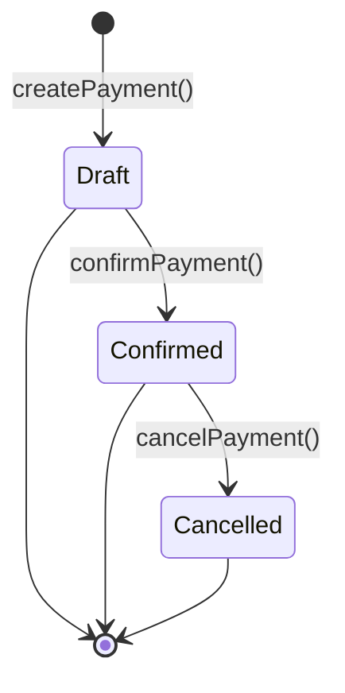

# Customer Payments

> **Module:** Accounting Transactions (SAFETY-CRITICAL)
> **Audience:** Engineers + AI assistants + **accountants** (must review before Canonical)
> **Status:** Draft — pending accountant sign-off
> **Last reviewed:** 2025-08-03
> **Source of truth:** this file + `laravel/app/Services/Sales/CustomerPaymentService.php` (note: lives in `Services/Sales/`, NOT `Services/Accounting/`) + `laravel/database/sql/06_payment_and_misc.sql` (customer_payments DDL) + `laravel/database/sql/05_purchase.sql` (invoice_payment_allocations DDL — located here for migration ordering)

## 1. What is it?

A **customer payment** records any money received from (or refunded to) a customer against one or
more sales invoices, or as an on-account credit. The CustomerPaymentService is the most complex of
the 7 transaction modules: it supports 4 transaction types, multi-invoice allocation, an explicit
draft → confirm → cancel lifecycle (the only module with a draft phase), idempotency tokens, and
salesman-level role access (front-line sales staff collect cash).

Four transaction types (migration `2025_01_09_000005`, CHECK constraint):

| Type | Direction | Code prefix | Description |
|---|---|---|---|
| `receive` | AR↓ | `PAY` | customer pays against one or more invoices |
| `discount` | AR↓ | `DISC` | invoice settled by discount (no cash) |
| `write_off` | AR↓ | `WOFF` | invoice written off as bad debt (no cash) |
| `payment` (refund) | AR↑ | `RFND` | refund TO the customer (cash out) |

Each type posts to both the General Ledger (via `JournalPostingService::createJournalEntry`) and
the customer sub-ledger (`customer_ledger` via `SubLedgerService::postCustomerLedgerEntry`).

## 2. Why does it exist?

- The enterprise sells on credit and must track per-customer outstanding balances.
- Multi-invoice allocation (`invoice_payment_allocations`) lets the salesman or accountant split a
  single payment across multiple invoices — needed for the AR aging report.
- The `discount` type handles negotiated early-payment discounts without a cash movement.
- The `write_off` type books bad-debt expense when an invoice is deemed uncollectible.
- The `payment` (refund) type handles return refunds or over-payment returns.
- The two-phase draft → confirm lifecycle exists for future async approval workflows (currently
  auto-confirmed in the controller).

## 3. When is it used?

- Customer pays cash or bank for one or more invoices (`receive`).
- Customer settles an invoice by negotiated discount (`discount`).
- Bad debt is written off (`write_off`).
- Refund issued to the customer for a return or over-payment (`payment`).
- On-account payment (no invoice allocation) — the unallocated balance sits in AR with no invoice
  link (mentioned in service docblock L126-127).

## 4. Who uses it?

- **Salesmen** can create customer payments (route middleware
  `role:salesman,accountant,manager,admin` — the only module that includes `salesman` because
  front-line sales staff collect cash).
- **Accountants** and **managers** can additionally cancel (reverse) payments
  (`role:accountant,manager,admin` on the cancel route — salesmen cannot cancel).
- **Admins** can override branch scope.
- The `CustomerPaymentPolicy` (registered in AppServiceProvider) gates per-action.

## 5. Related modules

- `journal-posting-rules.md` — the `createJournalEntry` gateway and Dr=Cr trigger. This file
  documents only the per-type Dr/Cr matrix.
- `reversal-vs-cancellation.md` — the reversal principle. Customer payments reverse via
  `cancelPayment`, which calls `JournalReversalService::reverseByJournalEntry`.
- `subledger-reconciliation.md` — the AR control-account reconciliation formula and AR aging.
- `chart-of-accounts.md` — `ar`, `sales_discount`, `write_off` / `finance_cost` / `operating_expense`
  fallback chain.
- `supplier-transactions.md` — the AP-side mirror (uses `supplier_payment_settlements` instead of
  `invoice_payment_allocations`).
- `../sales/sales-invoice.md` — the invoice lifecycle that this module settles (Phase 10).

## 6. Business rules (the Core Rule)

- **MUST** record a `payment_code` (unique, prefix `PAY`/`DISC`/`WOFF`/`RFND` + `YYYY-NNNNNN`) via
  `DocumentSequenceService`.
- **MUST** post a balanced GL entry via `JournalPostingService::createJournalEntry` for every
  confirmed payment. `reference_type='customer_payment'` is set on the main JE.
- **MUST** write the customer sub-ledger via `SubLedgerService::postCustomerLedgerEntry` so the
  per-customer running balance (`balance = prev + debit − credit`, where debit = customer owes
  more) is updated.
- **MUST** sync `banks.balance` for `receive` and `payment` (refund) types. `discount` and
  `write_off` do **not** touch the bank — they have no bank line in the GL.
- **MUST** allocate the payment to one or more invoices via `invoice_payment_allocations` for
  `receive`, `discount`, and `write_off` types. For `payment` (refund), the allocation direction
  is reversed (decreases the invoice `paid_amount`).
- **MUST** enforce idempotency: the `idempotency_token` (UUID) is required and cached for 10
  minutes (`payment:{uuid}` key) to prevent duplicate payments on double-submit.
- **MUST NOT** allow an allocation to exceed the invoice's outstanding balance
  (`validateCreateInput` L692-697).
- **MUST** reverse (not edit) by calling `cancelPayment`, which cascades to GL, sub-ledger,
  intercompany JEs, invoice paid_amount restoration, allocation row deletion, and bank balance
  undo.
- **MUST** enforce branch scope via `BranchScope` + `branch.isolation` middleware.

## 7. Technical implementation

### 7.1 The `customer_payments` table — `06_payment_and_misc.sql:6-32`

Base DDL plus migrations add `transaction_type` (CHECK 4 types), `reference_no`, `collected_by`,
`intercompany_journal_entry_id`.

| Column | Type | Notes |
|---|---|---|
| `id` | PK | |
| `payment_code` | `varchar(30) UNIQUE` | prefix + `YYYY-NNNNNN` |
| `payment_date` | `date NOT NULL` | |
| `customer_id` | integer (no FK!) | ⚠️ see §12 #1 — orphan risk |
| `branch_id` | FK branches | RLS key |
| `bank_id` | FK banks (nullable) | required if payment_mode='bank' |
| `payment_mode` | `varchar(20) CHECK IN (cash,bank,mobile_banking,cheque,adjustment)` | |
| `transaction_type` | `varchar(20) CHECK IN (receive,discount,write_off,payment)` | added by migration |
| `amount` | `numeric(14,2)` | |
| `discount_amount` | `numeric(14,2)` | for `receive` type, posts to `sales_discount` |
| `journal_entry_id` | FK journal_entries | main GL entry |
| `intercompany_journal_entry_id` | FK journal_entries | cross-branch — ⚠️ DEAD CODE, see §8 |
| `is_reversed`, `reversed_at`, `reversed_by`, `reverse_reason` | | |
| `reference_no`, `collected_by`, `created_by`, timestamps | | |

RLS: `07_views_triggers_constraints.sql:781-787`. Financial-audit trigger at L449
(`trg_audit_customer_payments`).

### 7.2 The `invoice_payment_allocations` linkage — `05_purchase.sql:145-162`

```sql
CREATE TABLE invoice_payment_allocations (
    id integer GENERATED ALWAYS AS IDENTITY PRIMARY KEY,
    invoice_id integer NOT NULL,
    payment_id integer NOT NULL,
    allocated_amount numeric(14,2) NOT NULL DEFAULT 0 CHECK (allocated_amount > 0),
    created_at timestamp(0) DEFAULT CURRENT_TIMESTAMP
    -- EXCLUDE constraint (ipa_unique_invoice_payment) — one row per invoice+payment pair
    -- trg_ipa_no_overallocation trigger — prevents SUM(allocated_amount) > invoice total_amount
);
```

Located in `05_purchase.sql` (not `06_payment_and_misc.sql`) for migration ordering reasons — see
comment L151-153. Note: `customer_payment_settlements` (defined in `06_payment_and_misc.sql:34-47`)
was **dropped** by migration `2025_01_09_000001` — use `invoice_payment_allocations` instead.

### 7.3 The `customer_ledger` sub-ledger

`balance = prev + debit − credit` (debit = customer owes more). Mirrors `supplier_ledger` with
the debit/credit convention reversed (customer is a debtor of the enterprise).

### 7.4 The Dr/Cr matrix — `CustomerPaymentService::postPaymentGL` (L368-423)

```php
$arLedgerId = $this->journalPosting->lookupLedgerByNature('ar');
// ...null guard...
$transactionType = $payment->transaction_type ?? 'receive';
switch ($transactionType) {
    case 'receive':
        $lines = $this->buildReceiveGL($payment, $arLedgerId, $amount, $discountAmount);
        break;
    case 'discount':
        $lines = $this->buildDiscountGL($payment, $arLedgerId, $amount, $discountAmount);
        break;
    case 'write_off':
        $lines = $this->buildWriteOffGL($payment, $arLedgerId, $amount);
        break;
    case 'payment':
        $lines = $this->buildRefundGL($payment, $arLedgerId, $amount);
        break;
}
return $this->journalPosting->createJournalEntry([
    'entry_date'     => $payment->payment_date->format('Y-m-d'),
    'reference_type' => 'customer_payment',
    'reference_id'   => $payment->id,
    'branch_id'      => $payment->branch_id,
    'description'    => $label . ' ' . $payment->payment_code . ...,
    'source'         => 'customer_payment_' . $transactionType,
    'created_by'     => $createdBy,
], $lines);
```

| Type | Dr | Cr | Bank sync? |
|---|---|---|---|
| `receive` (no discount) | bank-ledger or `cash_bank` | `ar` | increase |
| `receive` (with discount) | bank-ledger + `sales_discount` (split) | `ar` (full amount + discount) | increase |
| `discount` | `sales_discount` | `ar` | none |
| `write_off` | `write_off` (fallback `finance_cost` → `operating_expense`) | `ar` | none |
| `payment` (refund) | `ar` | bank-ledger or `cash_bank` | decrease |

### 7.5 `buildReceiveGL` with discount split (L430-470)

```php
private function buildReceiveGL(CustomerPayment $payment, int $arLedgerId, float $amount, float $discountAmount): array
{
    $lines = [];
    $debitLedgerId = $this->resolveDebitLedger($payment);  // bank-ledger or cash_bank
    $lines[] = [
        'ledger_id' => $debitLedgerId, 'debit' => $amount, 'credit' => 0,
        'entity_type' => $payment->isBankMode() ? 'bank' : 'customer_payment',
        'entity_id' => $payment->isBankMode() ? $payment->bank_id : $payment->id,
        'memo' => 'Customer payment received — ' . $payment->payment_code,
    ];
    // Credit side: AR (full amount including discount portion).
    $totalARCredit = $amount + $discountAmount;
    $lines[] = [
        'ledger_id' => $arLedgerId, 'debit' => 0, 'credit' => $totalARCredit,
        'entity_type' => 'customer', 'entity_id' => $payment->customer_id,
        'memo' => 'Payment ' . $payment->payment_code . ' — AR cleared',
    ];
    if ($discountAmount > 0.001) {
        $discountLedgerId = $this->journalPosting->lookupLedgerByNature('sales_discount');
        // ...null guard...
        $lines[] = [
            'ledger_id' => $discountLedgerId, 'debit' => $discountAmount, 'credit' => 0,
            'entity_type' => 'customer', 'entity_id' => $payment->customer_id,
            'memo' => 'Discount on payment ' . $payment->payment_code,
        ];
    }
    return $lines;
}
```

Note the discount split: Dr bank `amount`, Dr `sales_discount` `discountAmount`, Cr `ar`
`amount + discountAmount`. The AR credit includes the discount portion so the invoice is fully
cleared. Compare to `supplier-transactions.md` §12 #1 where the supplier-side discount is NOT
posted (asymmetry to flag to the accountant).

### 7.6 Invoice allocation — `allocateToInvoice` (L648-715)

Type-aware:
- For `payment` (refund): reduces invoice `paid_amount` (debits the paid-down amount off the
  invoice), increases `due_amount` (auto-updated by PostgreSQL GENERATED column).
- For receive/discount/write_off: increases invoice `paid_amount` (credits the paid-down amount),
  decreases `due_amount` (GENERATED). Validates `allocation ≤ outstanding balance` (L692-697).

Inserts `invoice_payment_allocations` row. EXCLUDE constraint
(`ipa_unique_invoice_payment`) prevents duplicate invoice+payment pairs. The
`trg_ipa_no_overallocation` trigger prevents `SUM(allocated_amount) > invoice total_amount`.

## 8. Intercompany settlement — DEAD CODE

`postIntercompanySettlement` (L772-835) contains stale code:

```php
private function postIntercompanySettlement(CustomerPayment $payment, int $createdBy): ?int
{
    $amount = (float) $payment->amount;
    if ($amount < 0.01 || !$payment->bank_id) return null;
    // NOTE: The `banks` table does NOT have a `branch_id` column — banks
    // are not branch-scoped in the current schema. Intercompany settlement
    // requires bank→branch mapping which doesn't exist yet. Skip entirely.
    return null;
    // ...dead code below never executes...
}
```

> ⚠️ **CRITICAL GAP:** Migration `2026_08_06_000001_add_branch_id_to_banks.php` **DID** add a
> `branch_id` column to `banks` (used by EmployeeTransactionService L648 and
> SupplierTransactionService L625). The CustomerPaymentService intercompany path was **never
> updated** and silently returns `null`. Cross-branch customer payments (customer pays at Branch A
> using Branch B's bank) do **NOT** post intercompany settlement — the bank-ledger reconciliation
> will break, and the interbranch obligation is invisible on the trial balance.
>
> There is **no `customer_payment_intercompany` reference_type** anywhere in the codebase because
> this code path never fires. Compare to Employee/Supplier which both use
> `*_intercompany` reference_types.

**Recommended fix:** update `postIntercompanySettlement` to mirror the Employee/Supplier pattern
(check `bank.branch_id !== payment.branch_id`, post two JEs with
`interbranch_receivable` / `interbranch_payable`, insert `branch_ledger` obligation row, set
`reference_type='customer_payment_intercompany'`).

## 9. Workflow / state machine — two-phase draft → confirm → cancel



Unlike Money/Employee/Supplier modules, CustomerPayment has an explicit draft phase:

1. **`createPayment($data)` (L85-119)** — inserts `customer_payments` row with `is_reversed=false`,
   **no** GL posting, **no** ledger, **no** allocation. Returns draft.
2. **`confirmPayment($paymentId, $confirmedBy, $allocations=[])` (L140-248)** — posts GL +
   customer_ledger + multi-invoice allocation + intercompany (dead code, §8) + bank sync + audit
   log + notification dispatch.
3. **`cancelPayment($paymentId, $cancelledBy, $reason)` (L260-349)** — full reversal cascade.

In practice, `CustomerPaymentController::store` (L189-219) calls `createPayment` then immediately
calls `confirmPayment` ("auto-confirm") — the draft state is ephemeral. The two-phase design
exists for **future async approval workflows** (e.g. large-payment manager approval) but is not
currently exercised.

## 10. Validation & input rules

⚠️ **No dedicated FormRequest class** — validation is inline at `CustomerPaymentController::store`
(L135-154):

```php
$validated = $request->validate([
    'customer_id' => 'required|integer|exists:customers,id',
    'branch_id' => 'required|integer|exists:branches,id',
    'bank_id' => 'nullable|integer|exists:banks,id',
    'collected_by' => 'nullable|integer|exists:employees,id',
    'payment_mode' => 'required|in:cash,bank,mobile_banking,cheque,adjustment',
    'transaction_type' => 'required|in:receive,discount,write_off,payment',
    'amount' => 'required|numeric|min:0.01',
    'discount_amount' => 'nullable|numeric|min:0',
    'payment_date' => 'required|date',
    'reference_no' => 'nullable|string|max:100',
    'notes' => 'nullable|string|max:500',
    'alloc_invoice_id' => 'nullable|array',
    'alloc_invoice_id.*' => 'integer|exists:sales_invoices,id',
    'alloc_amount' => 'nullable|array',
    'alloc_amount.*' => 'numeric|min:0',
    'idempotency_token' => 'required|string|uuid',  // R2: idempotency
]);
```

Idempotency: the `idempotency_token` is required (UUID). Submitting without a UUID returns 422.
The token is cached for 10 minutes on the `payment:{uuid}` key; a repeat submission within the
window returns the original payment result instead of creating a duplicate.

## 11. Reversal (cancel) & correction flow

`cancelPayment` (L260-349) — runs in a `DB::transaction`:

1. `lockForUpdate()` the payment row.
2. Reject if `is_reversed=true`.
3. `JournalReversalService::reverseByJournalEntry` on `journal_entry_id` (cascades to GL +
   customer_ledger).
4. `JournalReversalService::reverseByJournalEntry` on `intercompany_journal_entry_id` (if set —
   currently always null due to §8 dead code).
5. For each `invoice_payment_allocations` row:
   - Refund (`payment` type): increment invoice `paid_amount` by `allocated_amount` (restore).
   - Other types: decrement invoice `paid_amount` by `GREATEST(0, paid_amount - allocated_amount)`.
6. Hard-DELETE `invoice_payment_allocations` rows for this payment (L317).
7. Mark `customer_payments.is_reversed=true`.
8. Undo bank balance sync (only for `receive` and `payment` types).

```mermaid
sequenceDiagram
    participant U as User (accountant/manager)
    participant C as CustomerPaymentController
    participant S as CustomerPaymentService
    participant JR as JournalReversalService
    participant JP as JournalPostingService
    participant SL as SubLedgerService
    participant DB as PostgreSQL

    U->>C: POST /admin/customer-payments/{id}/cancel {reason}
    C->>S: cancelPayment(id, userId, reason)
    S->>DB: BEGIN; SELECT ... FOR UPDATE
    S->>JR: reverseByJournalEntry(journal_entry_id)
    JR->>JP: reverseJournalEntry (swap Dr/Cr)
    JP->>DB: INSERT reversal journal_entries + lines
    JP->>DB: UPDATE original journal_entries SET is_reversed=true
    JR->>DB: UPDATE customer_ledger SET is_reversed=true WHERE journal_entry_id=original
    S->>DB: UPDATE sales_invoices SET paid_amount = paid_amount ∓ allocated_amount  // per allocation
    S->>DB: DELETE FROM invoice_payment_allocations WHERE payment_id=id  ⚠️ hard-DELETE
    S->>DB: UPDATE banks SET balance = balance ∓ amount (undo)
    S->>DB: UPDATE customer_payments SET is_reversed=true
    S->>DB: COMMIT
    S-->>C: CustomerPayment (cancelled)
    C-->>U: redirect with success
```

## 12. Open questions / known gaps

1. **`customer_payments.customer_id` has NO FK constraint** at DB level (raw integer — see
   `06_payment_and_misc.sql:11`). Customers can be deleted leaving orphaned payments.
   Application-level enforcement only. **Recommended fix:** add `REFERENCES customers(id)` after
   confirming no orphans exist (data migration may be needed).
2. **Intercompany dead code** (§8) — cross-branch customer payments do not post intercompany
   settlement. The bank-ledger reconciles to the bank book but the interbranch obligation is NOT
   tracked. This is a regression from the Employee/Supplier pattern. **High-priority fix.**
3. **No `customer_payment_intercompany` reference_type** — because the intercompany path never
   fires, this reference_type doesn't appear anywhere. If §8 is fixed, add this reference_type to
   the app-enforced enum (no DB CHECK to update — see `journal-posting-rules.md` §reference_type
   matrix).
4. **`write_off` type uses fallback chain** `write_off` → `finance_cost` → `operating_expense`
   (L510-518). If none configured, throws RuntimeException. Per `chart-of-accounts.md` the
   `write_off` nature IS registered — but the fallback chain suggests it wasn't always seeded.
   Accountant should confirm the canonical `write_off` ledger is configured in production.
5. **Idempotency token is required.** Submitting without a UUID returns 422. The frontend MUST
   generate a UUID per payment attempt (not per form load — a retry must use the same UUID to
   prevent duplicates). Document this in the API contract.
6. **Over-payment / on-account credit not explicitly handled.** `allocateToInvoice` validates
   `amount ≤ outstanding` per invoice (L692-697), but if the user submits allocations totaling
   LESS than the payment amount, the unallocated balance becomes an "on-account credit" (mentioned
   in service docblock L126-127). No `customer_deposit` ledger is used — the unallocated amount
   sits in AR with no invoice link. The AR aging report will show it as an unallocated customer
   credit. **Accountant should confirm this is the desired treatment.**
7. **Hard-DELETE of `invoice_payment_allocations` on cancellation** (L317). Same pattern as
   Supplier — the linkage table is purged on reversal. The audit trail is preserved in
   `financial_audit_log` (the trigger fires on `customer_payments`, not on allocations — see
   `journal-posting-rules.md` §financial_audit_log scope). **Accountant must confirm whether
   allocation history is needed for audit.**
8. **No `CustomerPaymentPolicy` action for `cancel`.** The route middleware restricts cancel to
   `role:accountant,manager,admin` (salesmen excluded), but there is no per-record policy check
   (e.g. "only the creator's branch manager can cancel"). Any accountant can cancel any
   customer payment in their branch.
9. **Salesman role access.** Customer Payment is the only one of the 7 transaction modules that
   allows `salesman` role (front-line sales staff collect cash). The cancel route correctly
   excludes salesmen. But the `store` route allows salesmen to post `payment` (refund) type —
   a salesman could issue a refund. **Recommended:** restrict `transaction_type='payment'` to
   `accountant,manager,admin` only.

## 13. Accountant review checklist

> **This is a SAFETY-CRITICAL document.** Before marking it Canonical, an accountant with
> production credentials MUST review and sign off on each item below.

- [ ] The Dr/Cr matrix in §7.4 matches the actual treatment for each of the 4 types.
- [ ] The `receive` with discount split (§7.5) — Dr bank + Dr `sales_discount` / Cr `ar` (full) —
      is correct. Compare to the supplier-side asymmetry (`supplier-transactions.md` §12 #1).
- [ ] The `write_off` fallback chain `write_off` → `finance_cost` → `operating_expense` (§12 #4) —
      which ledger is canonical in production?
- [ ] The intercompany dead code (§8) — confirm this is a regression and should be fixed to mirror
      the Employee/Supplier pattern.
- [ ] The two-phase draft → confirm lifecycle (§9) — is the auto-confirm in the controller
      acceptable, or should large payments require explicit manager approval before confirm?
- [ ] The idempotency token requirement (§12 #5) — confirm the frontend generates UUIDs correctly.
- [ ] The on-account credit treatment (§12 #6) — should a `customer_deposit` liability ledger be
      used for unallocated payments, instead of leaving them in AR?
- [ ] The hard-DELETE of allocations on cancellation (§12 #7) — is the allocation history needed
      for audit?
- [ ] The salesman refund access (§12 #9) — should `transaction_type='payment'` (refund) be
      restricted to `accountant,manager,admin`?
- [ ] The `customer_ledger.balance` formula `prev + debit − credit` correctly reflects "debit =
      customer owes more" (customer is a debtor of the enterprise).
- [ ] The reversal cascade (§11) correctly undoes the GL, sub-ledger, invoice paid_amount,
      allocations, and bank balance in the right order.
