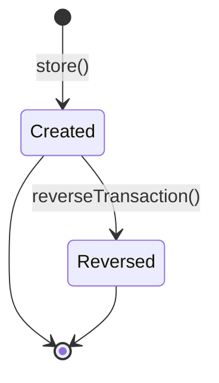

# Employee Transactions

> **Module:** Accounting Transactions (SAFETY-CRITICAL)
> **Audience:** Engineers + AI assistants + **accountants** (must review before Canonical)
> **Status:** Draft — pending accountant sign-off
> **Last reviewed:** 2025-08-03
> **Source of truth:** this file + `laravel/app/Services/Accounting/EmployeeTransactionService.php` + `laravel/database/sql/06_payment_and_misc.sql` (employee_transactions DDL) + `laravel/database/sql/02_accounting.sql` (employee_ledger DDL)

## 1. What is it?

An **employee transaction** records any money movement between the enterprise and an employee:
salary advance, staff loan, repayment, salary payment, payroll deduction, or manual adjustment.
Each transaction posts to both the General Ledger (via `JournalPostingService`) and the
employee sub-ledger (`employee_ledger` via `SubLedgerService::postEmployeeLedgerEntry`).

Six transaction types (DB CHECK constraint `06_payment_and_misc.sql:165`):

| Type | Direction | Description |
|---|---|---|
| `advance` | outflow | short-term cash advance against future salary |
| `loan` | outflow | longer-term staff loan |
| `repayment` | inflow | employee repays an advance/loan |
| `salary` | outflow | net salary disbursement |
| `deduction` | no cash movement | payroll deduction recorded against the employee |
| `adjustment` | outflow (default) | catch-all for corrections |

## 2. Why does it exist?

- Staff routinely take salary advances and loans; the ERP must track who owes what.
- Net salary payments need an explicit GL posting (Dr `salary_expense`, Cr bank/cash).
- Payroll deductions (provident fund, tax, etc.) reduce the net cash outflow but must still
  hit the GL — the `deduction` type posts Dr `salary_expense` / Cr `employee_payable` with **no
  bank line**.
- The `employee_ledger` sub-ledger gives per-employee running balances that feed the "due list"
  used by the HR dashboard (`get-due` route).

## 3. When is it used?

- End-of-month salary disbursement (`salary`).
- Mid-month cash advance (`advance`).
- Long-term staff loan (`loan`).
- Employee repayment of a prior advance/loan (`repayment`).
- Payroll deduction booking (`deduction`).
- Manual correction (`adjustment`).

## 4. Who uses it?

- **Accountants** and **managers** create and reverse employee transactions (route middleware
  `role:accountant,manager,admin`).
- **Admins** can override branch scope.
- HR/supervisors consume the `get-due` report (read-only, same role middleware).

## 5. Related modules

- `journal-posting-rules.md` — the `createJournalEntry` / `postJournalEntry` gateway and Dr=Cr
  trigger. This file documents only the per-type Dr/Cr matrix.
- `reversal-vs-cancellation.md` — the reversal principle. Employee transactions reverse via
  `JournalReversalService::reverseByJournalEntry`, which cascades to the `employee_ledger`.
- `subledger-reconciliation.md` — the Employee sub-ledger control-account reconciliation formula
  (`SUM(employee_ledger.balance) by branch` must equal the GL `employee_payable` balance).
- `chart-of-accounts.md` — `employee_payable`, `salary_expense` ledger natures.
- `money-transfers.md` — the intercompany pattern divergence (Employee uses two JEs vs Money
  Transfer's one).
- `supplier-transactions.md` — same intercompany two-JE pattern, for comparison.

## 6. Business rules (the Core Rule)

- **MUST** record a `transaction_code` (unique, format `ET-YYYY-NNNNNN`) via
  `DocumentSequenceService`.
- **MUST** post a balanced GL entry via `JournalPostingService::postJournalEntry` for every
  transaction with `amount >= 0.01`.
- **MUST** write the employee sub-ledger via `SubLedgerService::postEmployeeLedgerEntry` so the
  per-employee running balance (`balance = prev + credit − debit`, where credit = we owe more)
  is updated.
- **MUST** sync `banks.balance` for any `BANK_INVOLVED_TYPES` transaction
  (`advance`, `loan`, `salary`, `repayment`, `adjustment`). `deduction` does **not** touch the
  bank — it has no bank line in the GL.
- **MUST** post intercompany settlement (two JEs + `branch_ledger` obligation row) when the
  employee's branch differs from the bank's branch. See §8.
- **MUST NOT** allow an inactive employee to receive a transaction (validated in
  `validateCreateInput` L841-867).
- **MUST NOT** allow `payment_mode='bank'` without a `bank_id` (validated in
  `validateCreateInput`).
- **MUST** reverse (not edit) by calling `reverseTransaction`, which cascades to GL, sub-ledger,
  intercompany JEs, branch_ledger obligation, and bank balance undo.
- **MUST** enforce branch scope via `BranchScope` + `branch.isolation` middleware.

## 7. Technical implementation

### 7.1 The `employee_transactions` table — `06_payment_and_misc.sql:158-178`

Base DDL plus migration `2026_08_01_000002_add_payment_fields_to_employee_transactions.php` adds:
`payment_mode`, `bank_id`, `collected_by`, `intercompany_journal_entry_id`.

| Column | Type | Notes |
|---|---|---|
| `id` | PK | |
| `transaction_code` | `varchar(30) UNIQUE` | `ET-YYYY-NNNNNN` |
| `transaction_date` | `date NOT NULL` | nullable in request; defaults to today |
| `employee_id` | FK employees | |
| `branch_id` | FK branches | RLS key |
| `transaction_type` | `varchar(20) CHECK IN (6 types)` | |
| `amount` | `numeric(14,2)` | |
| `payment_mode` | `varchar(20)` | cash/bank/mobile_banking/cheque/adjustment |
| `bank_id` | FK banks (nullable) | required if payment_mode='bank' |
| `journal_entry_id` | FK journal_entries | main GL entry |
| `intercompany_journal_entry_id` | FK journal_entries | cross-branch debtor JE |
| `is_reversed`, `reversed_at`, `reversed_by`, `reverse_reason` | | reversal marker |
| `collected_by` | FK employees | who collected the cash |
| `created_by`, timestamps | | |

RLS: `07_views_triggers_constraints.sql:813-819`. Financial-audit trigger at L453
(`trg_audit_employee_transactions`).

### 7.2 The `employee_ledger` sub-ledger — `02_accounting.sql:185-201`

| Column | Notes |
|---|---|
| `employee_id`, `branch_id`, `transaction_date` | |
| `transaction_type` | CHECK (6 types) — same enum as the parent |
| `reference_type`, `reference_id` | links back to the originating employee_transaction |
| `debit`, `credit`, `balance` | `balance = prev + credit − debit` |
| `journal_entry_id` | FK to the GL journal entry |
| `is_reversed` | (none — reversal is via the GL cascade + a new counter row) |

> Note: `employee_ledger` rows are NOT independently reversible. `JournalReversalService` reverses
> them by setting `is_reversed=true` when it processes the linked `journal_entry_id`. The sub-ledger
> row is preserved; its `balance` contribution is excluded from running sums by filtering
> `is_reversed=false`.

### 7.3 The Dr/Cr matrix — `EmployeeTransactionService::postTransactionGL` (L391-446)

```php
$transactionType = $transaction->transaction_type ?? 'advance';
switch ($transactionType) {
    case 'advance':
    case 'loan':
        $lines = $this->buildOutflowGL($transaction, $amount, 'employee_payable');
        break;
    case 'salary':
        $lines = $this->buildSalaryGL($transaction, $amount);
        break;
    case 'repayment':
        $lines = $this->buildInflowGL($transaction, $amount, 'employee_payable');
        break;
    case 'deduction':
        $lines = $this->buildDeductionGL($transaction, $amount);
        break;
    case 'adjustment':
    default:
        $lines = $this->buildOutflowGL($transaction, $amount, 'employee_payable');
        break;
}
return $this->journalPosting->postJournalEntry([
    'entry_date'  => $transaction->transaction_date ?? now()->format('Y-m-d'),
    'description' => $description,
    'source'      => 'employee_transaction',
    'branch_id'   => $transaction->branch_id,
    'lines'       => $lines,
    'created_by'  => $createdBy,
]);
```

| Type | Dr | Cr | Bank sync? |
|---|---|---|---|
| `advance` | `employee_payable` | bank-ledger or `cash_bank` | decrease |
| `loan` | `employee_payable` | bank-ledger or `cash_bank` | decrease |
| `salary` | `salary_expense` | bank-ledger or `cash_bank` | decrease |
| `repayment` | bank-ledger or `cash_bank` | `employee_payable` | increase |
| `deduction` | `salary_expense` | `employee_payable` | **none** |
| `adjustment` (default) | `employee_payable` | bank-ledger or `cash_bank` | decrease |

- **`buildOutflowGL`** (L452-468) — Dr `employee_payable` (entity_type=`employee`, entity_id=employee_id),
  Cr bank-ledger (entity_type=`bank`) or `cash_bank` nature (entity_type=`employee_payment`).
- **`buildSalaryGL`** (L474-490) — Dr `salary_expense`, Cr bank-ledger or `cash_bank`.
- **`buildInflowGL`** (L496-512) — Dr bank-ledger or `cash_bank`, Cr `employee_payable`.
- **`buildDeductionGL`** (L518-534) — Dr `salary_expense`, Cr `employee_payable` — **no bank line**
  (this is why `deduction` is excluded from `BANK_INVOLVED_TYPES` at L68).

### 7.4 Sub-ledger posting

`SubLedgerService::postEmployeeLedgerEntry` (L48-74 of SubLedgerService):

```php
// balance = prev + credit − debit (credit = we owe the employee more)
$prev = (float) static::where('employee_id', $data['employee_id'])
    ->where('is_reversed', false)
    ->orderByDesc('id')->value('balance') ?? 0;
$balance = $prev + (float)($data['credit'] ?? 0) - (float)($data['debit'] ?? 0);
return static::insertGetId([... , 'balance' => $balance]);
```

The Dr/Cr direction on the sub-ledger mirrors the GL:
- `advance` / `loan` / `salary` / `adjustment` → debit (employee owes more, or salary expense
  recognized; for advance/loan the employee owes more; for salary the debit offsets the credit
  bank payment so the net employee balance change is zero — debited then credited out).
- `repayment` → credit (we owe less, employee repays).
- `deduction` → credit (deduction reduces the cash salary; the employee_payable credit builds up
  the obligation to be netted at payroll time).

## 8. Intercompany settlement

When `bank_id` is set AND `bank.branch_id !== transaction.branch_id`, `postIntercompanySettlement`
(L639-784) posts **two** balanced JEs:

**For OUTFLOW (advance/loan/salary/adjustment) — bank decreases:**

| JE | Branch | Dr | Cr |
|---|---|---|---|
| Creditor JE (at bank's branch) | `bank.branch_id` | `interbranch_receivable` | bank-ledger |
| Debtor JE (at transaction's branch) | `transaction.branch_id` | bank-ledger | `interbranch_payable` |

**For INFLOW (repayment) — bank increases:** the Dr/Cr swap so the bank-ledger is debited.

Both JEs use `reference_type='employee_transaction_intercompany'` + `reference_id=transaction.id`.
A `branch_ledger` row is also inserted (L756-769) tracking the interbranch obligation.

The **debtor JE id** is stored in `employee_transactions.intercompany_journal_entry_id`. The
creditor JE id is **not** stored on the transaction row — it is recovered on reversal by querying
`journal_entries WHERE reference_type='employee_transaction_intercompany' AND reference_id=$id AND
is_reversed=false` (L224-228).

Skip conditions (returns null): amount < 0.01, no `bank_id`, `bank.branch_id` is null (shared/head
office bank), `bank.branch_id === transaction.branch_id`, or `interbranch_receivable` /
`interbranch_payable` ledgers not configured (logs warning L670-676).

## 9. Workflow / state machine



No draft / approval workflow. The transaction posts immediately on `store()`. State is tracked
only by `is_reversed` boolean (no `status` enum column — confirmed in `EmployeeTransaction.php:29`
docblock).

## 10. Validation & input rules

`StoreEmployeeTransactionRequest.php:38-50`:

```php
return [
    'employee_id'      => ['required', 'integer', 'exists:employees,id'],
    'branch_id'        => ['required', 'integer', 'exists:branches,id'],
    'bank_id'          => ['nullable', 'integer', 'exists:banks,id'],
    'payment_mode'     => ['required', 'in:cash,bank,mobile_banking,cheque,adjustment'],
    'transaction_type' => ['required', 'in:advance,loan,repayment,salary,deduction,adjustment'],
    'amount'           => ['required', 'numeric', 'min:0.01'],
    'transaction_date' => ['nullable', 'date'],
    'description'      => ['nullable', 'string', 'max:500'],
    'collected_by'     => ['nullable', 'integer', 'exists:employees,id'],
];
```

Service `validateCreateInput` (L841-867) additionally:
- Employee exists and `is_active=true`.
- `amount >= 0.01`.
- `bank_id` required when `payment_mode='bank'`.

`EmployeeTransactionPolicy` (78 lines, registered in AppServiceProvider) gates per-action; details
deferred to `../security/rbac-roles-permissions.md`.

## 11. Reversal & correction flow

`reverseTransaction` (L193-281) — runs in a `DB::transaction`:

1. `lockForUpdate()` the transaction row.
2. Reject if `is_reversed=true`.
3. `JournalReversalService::reverseByJournalEntry(journal_entry_id)` — cascades to GL lines +
   the linked `employee_ledger` row (set `is_reversed=true` on the sub-ledger).
4. Find ALL non-reversed JEs with `reference_type='employee_transaction_intercompany'` and
   `reference_id=$transactionId` — reverse each (catches both creditor + debtor JEs).
5. Reverse the `branch_ledger` obligation row (`is_reversed=true`, L241-247).
6. Mark `employee_transactions.is_reversed=true`.
7. Undo bank balance sync (only for `BANK_INVOLVED_TYPES` — deduction never touched the bank).
8. Audit log.

```mermaid
sequenceDiagram
    participant U as User (accountant)
    participant C as EmployeeTransactionController
    participant S as EmployeeTransactionService
    participant JR as JournalReversalService
    participant JP as JournalPostingService
    participant SL as SubLedgerService
    participant DB as PostgreSQL

    U->>C: POST /admin/employee-transactions/{id}/reverse {reason}
    C->>S: reverseTransaction(id, userId, reason)
    S->>DB: BEGIN; SELECT ... FOR UPDATE
    S->>JR: reverseByJournalEntry(journal_entry_id)
    JR->>JP: reverseJournalEntry (swap Dr/Cr)
    JP->>DB: INSERT reversal journal_entries + lines
    JP->>DB: UPDATE original journal_entries SET is_reversed=true
    JR->>DB: UPDATE employee_ledger SET is_reversed=true WHERE journal_entry_id=original
    S->>JR: reverseByReference('employee_transaction_intercompany', id)  // both creditor + debtor
    S->>DB: UPDATE branch_ledger SET is_reversed=true
    S->>DB: UPDATE banks SET balance = balance ± amount (undo, only if bank involved)
    S->>DB: UPDATE employee_transactions SET is_reversed=true
    S->>DB: COMMIT
    S-->>C: EmployeeTransaction (reversed)
    C-->>U: redirect with success
```

## 12. Open questions / known gaps

1. **GL `reference_type` is NULL on the main JE.** `postTransactionGL` calls `postJournalEntry`
   without setting `reference_type` / `reference_id` (see §7.3 — the array passed has `source` but
   no `reference_type`). The journal entry will have `reference_type=NULL`,
   `reference_id=NULL`. Auditors can only trace from `employee_transactions.journal_entry_id`
   (reverse lookup), not from the GL side. Compare to Customer/Supplier/Other Income/Expense which
   all set `reference_type` explicitly. **Recommended fix:** add
   `'reference_type' => 'employee_transaction', 'reference_id' => $transaction->id` to the call.
2. **`transaction_date` is nullable in the request.** Service falls back to today. A back-dated
   entry requires the user to explicitly set the date. The GL `entry_date` IS propagated correctly
   (unlike Money Transfer — §7.3 here passes `entry_date`), so back-dated employee transactions
   DO post to the correct GL period.
3. **`adjustment` type defaults to outflow.** If an accountant needs an inflow adjustment (e.g.
   correct a prior over-payment), they must use `repayment` instead. The `adjustment` type is a
   catch-all that always posts Dr `employee_payable` / Cr bank — it cannot be used for inflow
   corrections. Document this in the user-facing help text.
4. **No transaction_type → employee_role guard.** A manager can post a `salary` transaction for
   any employee, including themselves. There is no segregation-of-duties rule preventing
   self-payment. Compare to Manual Journal which has maker-checker (§6 of `manual-journals.md`).
5. **`deduction` has no bank line but still posts to GL.** This is correct (payroll deductions
   reduce the cash outflow but increase the employee_payable obligation), but the user-facing UI
   should make this clear — the `payment_mode` field is misleading for deductions since no payment
   occurs. Recommended: hide `payment_mode` + `bank_id` fields when `transaction_type='deduction'`.

## 13. Accountant review checklist

> **This is a SAFETY-CRITICAL document.** Before marking it Canonical, an accountant with
> production credentials MUST review and sign off on each item below.

- [ ] The Dr/Cr matrix in §7.3 matches the actual treatment for each of the 6 types.
- [ ] The `deduction` no-bank-line rule (§7.3) is correct — payroll deductions increase the
      employee_payable obligation without touching cash.
- [ ] The `adjustment` default-outflow behaviour (§12 #3) is acceptable, or should a separate
      `adjustment_inflow` type be added?
- [ ] The intercompany two-JE pattern (§8) matches the actual cross-branch salary payment flow.
- [ ] The `branch_ledger` obligation row (§8) is the correct way to track interbranch debt.
- [ ] The GL `reference_type=NULL` gap (§12 #1) — should it be set to `'employee_transaction'`?
- [ ] The `employee_ledger.balance` formula `prev + credit − debit` (§7.4) correctly reflects
      "credit = we owe more" (employee is a creditor of the enterprise).
- [ ] The reversal cascade (§11) correctly undoes the GL, sub-ledger, intercompany, branch_ledger,
      and bank balance in the right order.
- [ ] The lack of maker-checker for self-payment (§12 #4) — is the segregation-of-duties risk
      acceptable, or should a manager-approval gate be added for `salary` type?
