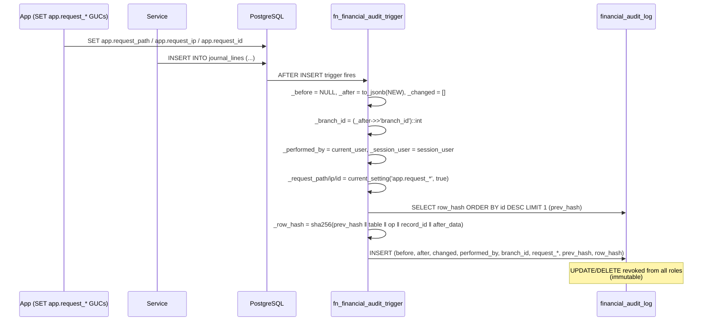

# Financial Audit Log

> **Module:** Accounting (SAFETY-CRITICAL)
> **Audience:** Engineers + AI assistants + **accountants / auditors** (must review before Canonical)
> **Status:** Draft — pending accountant sign-off
> **Last reviewed:** 2025-08-03
> **Source of truth:** this file + `laravel/database/sql/02_accounting.sql:332-481` + `laravel/database/migrations/2026_08_08_000007_fix_audit_trigger_branch_id_access.php` (current canonical trigger) + `laravel/database/migrations/2026_08_02_000001_partition_audit_log_tables.php`
>
> This file is the **deep dive** on the financial audit log. The high-level summary is in
> `../security/audit-trails.md` §7.4 — read that first for context, then this file for the
> trigger internals, hash-chain mechanics, and forensic usage.

## 1. What is it?

The `financial_audit_log` is an **append-only, immutable, cryptographically chained** audit table
that captures every INSERT/UPDATE/DELETE on 10 financial tables. Each audit row stores the full
`before_data` / `after_data` JSONB, the `changed_columns` array, the actor's identity, the
request context (path/IP/request-id), the PostgreSQL transaction ID (`xmin`), and a SHA-256
`row_hash` that chains to the previous row's hash. `UPDATE` and `DELETE` are revoked from all
roles, so the table is truly immutable. Tampering is detectable via the
`v_financial_audit_chain_verification` view. This is distinct from `user_audit_log` (which is
application-written, mutable, and covers master-data CRUD — see `../security/audit-trails.md`).

## 2. Why does it exist?

- **Forensic integrity:** if someone (admin, DBA, or an attacker) modifies or deletes a financial
  record, the audit log proves it. The hash chain makes silent tampering impossible — any break
  shows up in the verification view.
- **Regulatory compliance:** financial records must be retained for 7 years (84 months). The
  audit log's retention is 84 months, with detached partitions moved to the `archive` schema
  (never dropped).
- **Dual-layer audit:** `user_audit_log` captures *who did what* (application-level); the
  financial audit log captures *exactly what changed in the data* (DB-level, with before/after
  JSONB). Together they provide a complete picture.

## 3. When is it used?

- **Automatically on every financial mutation** — the `fn_financial_audit_trigger()` fires AFTER
  INSERT/UPDATE/DELETE on each of the 10 financial tables. No application code is needed to
  write the audit row.
- **On forensic investigation** — a DBA or auditor queries `financial_audit_log` directly (or via
  `v_financial_audit_chain_verification`) to investigate a discrepancy.
- **On chain verification** — the verification view is queried (manually or by a future command)
  to confirm `chain_valid` for all rows.

## 4. Who uses it?

- **Accountants / auditors** query it for forensic investigation.
- **DBAs** verify the hash chain integrity.
- **System/automated:** the trigger writes rows; pg_partman manages retention.

> **NOT FOUND:** There is no application code that reads `financial_audit_log` (confirmed by
> grep). The table is write-only from the application's perspective; reads are forensic DBA
> queries. There is no admin UI viewer (unlike `user_audit_log` which has `GlobalAuditController`).

## 5. Related modules

- `../security/audit-trails.md` §7.4 — the high-level summary (read first).
- `journal-posting-rules.md` — the 10 audited tables are the financial tables.
- `../database/triggers-views-constraints.md` §7.1.3 — the trigger catalog entry.
- `../database/partitioning.md` — the 84-month retention + pg_partman config.
- `../security/branch-context-security.md` — the `app.request_path/ip/id` GUCs the trigger reads.

## 6. Business rules

- **MUST** keep `financial_audit_log` immutable. `UPDATE` and `DELETE` are revoked from `PUBLIC`,
  `postgres`, and `remote_center`.
- **MUST** capture the full `before_data` (to_jsonb(OLD)) and `after_data` (to_jsonb(NEW)) for
  every mutation.
- **MUST** chain each row's `row_hash` to the previous row's `row_hash` via SHA-256.
- **MUST** retain audit rows for **84 months (7 years)**. Detached partitions move to the
  `archive` schema (`retention_keep_table = true`), never dropped.
- **MUST** partition by RANGE(`created_at`) for time-series manageability.
- **MUST NOT** rely on the hash chain being strictly serial under high concurrency — there is a
  known race condition (see §7.5). The chain is "best-effort"; tampering is still detectable.
- **MUST NOT** assume `performed_by` captures the application user — in `SECURITY DEFINER`
  functions, `current_user` is the function owner, not the caller. See §7.7.
- **SHOULD** run the chain verification query periodically to detect breaks.

## 7. Technical implementation

### 7.1 The trigger function `fn_financial_audit_trigger()` — verbatim body

Source: `laravel/database/sql/02_accounting.sql:381-443` (original) — superseded by 3 subsequent
migrations:
1. `2026_08_08_000006_fix_financial_audit_trigger_xmin.php` — xmin capture fix.
2. `2026_08_08_000007_fix_audit_trigger_branch_id_access.php` — branch_id from JSONB (current
   canonical version).

**Current canonical body** (verbatim from `2026_08_08_000007:21-141`):

```sql
CREATE OR REPLACE FUNCTION fn_financial_audit_trigger()
RETURNS TRIGGER AS $$
DECLARE
    _prev_hash VARCHAR(64);
    _row_hash  VARCHAR(64);
    _before    JSONB;
    _after     JSONB;
    _changed   TEXT[];
    _col       TEXT;
    _op        VARCHAR(6);
    _record_id BIGINT;
    _branch_id INTEGER;
    _performed_by VARCHAR(100);
    _session_user VARCHAR(100);
    _request_path VARCHAR(500);
    _request_ip   VARCHAR(45);
    _request_id   VARCHAR(100);
    _xmin      XID;
BEGIN
    _op := TG_OP;

    -- Determine record_id from the NEW or OLD row
    IF _op = 'DELETE' THEN
        _record_id := OLD.id;
        _before := to_jsonb(OLD);
        _after := NULL;
        _changed := ARRAY[]::TEXT[];
        _xmin := OLD.xmin;
    ELSIF _op = 'INSERT' THEN
        _record_id := NEW.id;
        _before := NULL;
        _after := to_jsonb(NEW);
        _changed := ARRAY[]::TEXT[];
        _xmin := NEW.xmin;
    ELSE -- UPDATE
        _record_id := NEW.id;
        _before := to_jsonb(OLD);
        _after := to_jsonb(NEW);
        -- Detect changed columns
        _changed := ARRAY[]::TEXT[];
        FOR _col IN
            SELECT key FROM jsonb_object_keys(_before) AS key
            WHERE (_before->>key) IS DISTINCT FROM (_after->>key)
        LOOP
            _changed := array_append(_changed, _col);
        END LOOP;
        _xmin := NEW.xmin;
    END IF;

    -- Get branch_id from the JSONB representation (works for tables without branch_id column)
    _branch_id := COALESCE(
        (_after ->> 'branch_id')::INTEGER,
        (_before ->> 'branch_id')::INTEGER
    );

    -- Get user identity
    _session_user := session_user;
    _performed_by := current_user;

    -- Get request context (if available from app settings)
    BEGIN
        _request_path := current_setting('app.request_path', true);
    EXCEPTION WHEN OTHERS THEN
        _request_path := NULL;
    END;
    BEGIN
        _request_ip := current_setting('app.request_ip', true);
    EXCEPTION WHEN OTHERS THEN
        _request_ip := NULL;
    END;
    BEGIN
        _request_id := current_setting('app.request_id', true);
    EXCEPTION WHEN OTHERS THEN
        _request_id := NULL;
    END;

    -- Get previous hash for cryptographic chaining
    SELECT row_hash INTO _prev_hash
    FROM financial_audit_log
    ORDER BY id DESC
    LIMIT 1;

    IF _prev_hash IS NULL THEN
        _prev_hash := '0000000000000000000000000000000000000000000000000000000000000000';
    END IF;

    -- Compute this row's hash: SHA-256 of (prev_hash + table_name + operation + record_id + COALESCE(after_data, before_data))
    _row_hash := encode(
        digest(
            _prev_hash || TG_TABLE_NAME || _op || _record_id::TEXT || COALESCE(_after::TEXT, _before::TEXT),
            'sha256'
        ),
        'hex'
    );

    -- Insert the audit record
    INSERT INTO financial_audit_log (
        table_name, operation, record_id,
        before_data, after_data, changed_columns,
        performed_by, db_session_user, branch_id,
        transaction_id,
        request_path, request_ip, request_id,
        prev_hash, row_hash
    ) VALUES (
        TG_TABLE_NAME, _op, _record_id,
        _before, _after, _changed,
        _performed_by, _session_user, _branch_id,
        _xmin,
        _request_path, _request_ip, _request_id,
        _prev_hash, _row_hash
    );

    IF _op = 'DELETE' THEN
        RETURN OLD;
    ELSE
        RETURN NEW;
    END IF;
END;
$$ LANGUAGE plpgsql SECURITY DEFINER
```

### 7.2 Line-by-line explanation

1. `TG_OP` = 'INSERT' / 'UPDATE' / 'DELETE' — the operation that fired the trigger.
2. For DELETE: `OLD.id` is the record_id, `to_jsonb(OLD)` captures the full pre-image, `after`
   is NULL, `changed_columns` is empty array, `xmin = OLD.xmin` (the row's transaction ID —
   system column captured into a local XID variable; the `2026_08_08_000006` fix was needed
   because bare `xmin` in a VALUES clause is interpreted as a column reference, not a system
   column).
3. For INSERT: `NEW.id` is record_id, `before` is NULL, `after = to_jsonb(NEW)`, `changed` is
   empty, `xmin = NEW.xmin`.
4. For UPDATE: both `before` and `after` captured; `changed_columns` built by looping
   `jsonb_object_keys(_before)` and comparing `(_before->>key) IS DISTINCT FROM (_after->>key)`
   — this is the diff.
5. `branch_id` extracted from JSONB (not direct column access — the `2026_08_08_000007` fix was
   needed because `journal_lines` has no `branch_id` column, causing "record NEW has no field
   branch_id").
6. `_session_user = session_user` (PostgreSQL session user — the DB role).
7. `_performed_by = current_user` (current user — **NOTE**: in `SECURITY DEFINER` functions,
   `current_user` is the function owner, NOT the caller; this is a subtle issue — see §7.7).
8. `_request_path / _request_ip / _request_id` read from GUCs set by `SetAppBranchId`
   middleware on every web request. The `BEGIN ... EXCEPTION WHEN OTHERS THEN ... END` blocks
   make the reads resilient to missing GUCs (CLI sessions, fresh connections).
9. **Prev hash lookup**: `SELECT row_hash ... ORDER BY id DESC LIMIT 1` — this is the **race
   condition** (see §7.5).
10. **Genesis hash**: if no previous row, prev_hash = 64-char zero string.
11. **Hash formula**: `sha256(prev_hash || TG_TABLE_NAME || _op || _record_id::TEXT ||
    COALESCE(_after::TEXT, _before::TEXT))` — uses `pgcrypto.digest()`, hex-encoded.
12. INSERT into `financial_audit_log` with all captured context.

### 7.3 Tables with the trigger attached (38 total)

Source: `laravel/database/sql/02_accounting.sql:446-455` (original 10) + recreated by
partitioning migrations + **SALES-3** (commit `de2b6e6`, migration
`2026_09_01_000002` — 14 sales tables) + **FINANCE-1** (commit `0385b87`,
migration `2026_09_01_000003` — 14 finance tables). Exact count: **38 tables**.

**Original 10 (accounting — `02_accounting.sql:446-455`):**

| # | Trigger name | Table |
|---|---|---|
| 1 | `trg_audit_journal_entries` | `journal_entries` |
| 2 | `trg_audit_journal_lines` | `journal_lines` |
| 3 | `trg_audit_manual_journals` | `manual_journals` |
| 4 | `trg_audit_manual_journal_lines` | `manual_journal_lines` |
| 5 | `trg_audit_customer_payments` | `customer_payments` |
| 6 | `trg_audit_supplier_payments` | `supplier_payments` |
| 7 | `trg_audit_money_transfers` | `money_transfers` |
| 8 | `trg_audit_other_incomes` | `other_incomes` |
| 9 | `trg_audit_other_expenses` | `other_expenses` |
| 10 | `trg_audit_employee_transactions` | `employee_transactions` |

**SALES-3 — 14 sales+commission tables (commit `de2b6e6`, migration `2026_09_01_000002`):**

`sales_invoices`, `sales_invoice_items`, `sales_invoice_dispatchers`,
`sales_invoice_dispatches`, `sales_challans`, `sales_challan_items`,
`sales_draft_carts`, `sales_returns`, `sales_return_items`, `commission_rules`,
`commission_rule_tiers`, `commission_rule_product_groups`,
`commission_rule_targets`, `commission_entries`.

**FINANCE-1 — 14 finance tables (commit `0385b87`, migration `2026_09_01_000003`):**

`consolidation_runs`, `elimination_rules`, `elimination_entries`, `companies`,
`warehouse_transfers`, `warehouse_transfer_items`, `branch_ledger`,
`branch_demands`, `branch_demand_items`, `branch_demand_repricing`,
`branch_demand_customer_payment_settlements`,
`branch_demand_money_transfer_settlements`, `shadow_demand_comparisons`,
`shadow_cutover_log`.

> **NOT attached to:** `purchase_receives`, `purchase_returns`, `purchase_orders`,
> `stock_adjustments`, `stock_take_sessions`, `damage_invoices`, `customer_ledger`,
> `supplier_ledger`, `employee_ledger` (these have their own per-module audit loggers — see
> `../security/audit-trails.md` §7.5). **Scope gap:** a purchase receive or stock adjustment that
> triggers a GL posting IS audited via `journal_entries`/`journal_lines`, but the
> `purchase_receives`/`stock_adjustments` row mutation itself is only in `user_audit_log` (if at
> all). The purchasing cluster has its own G3 gap entries (`purchase-audit.md`, `purchase-receive.md`,
> `purchase-return.md`) tracking the same trigger-attachment need.

### 7.4 REVOKE statements — verbatim

`laravel/database/sql/02_accounting.sql:459-467`:

```sql
DO $$ BEGIN
    EXECUTE 'REVOKE UPDATE, DELETE ON financial_audit_log FROM PUBLIC';
    IF EXISTS (SELECT 1 FROM pg_roles WHERE rolname = 'postgres') THEN
        EXECUTE 'REVOKE UPDATE, DELETE ON financial_audit_log FROM postgres';
    END IF;
    IF EXISTS (SELECT 1 FROM pg_roles WHERE rolname = 'remote_center') THEN
        EXECUTE 'REVOKE UPDATE, DELETE ON financial_audit_log FROM remote_center';
    END IF;
END $$;
```

Re-applied by `2026_08_02_000001_partition_audit_log_tables.php:350-357` after partitioning
conversion (REVOKEs don't carry over to the new table). Roles revoked from: `PUBLIC` (all
roles), `postgres` (superuser), `remote_center` (app DB role). The role-existence guard makes
this idempotent across environments.

### 7.5 `v_financial_audit_chain_verification` — verbatim SQL

`laravel/database/sql/02_accounting.sql:470-475` (recreated identically by
`2026_08_02_000001:363-376` and `2026_08_08_000002:258-276`):

```sql
CREATE OR REPLACE VIEW v_financial_audit_chain_verification AS
SELECT id, table_name, operation, record_id, prev_hash, row_hash,
    CASE WHEN id = 1 THEN prev_hash = '0000000000000000000000000000000000000000000000000000000000000000'
         ELSE prev_hash = LAG(row_hash) OVER (ORDER BY id) END AS chain_valid,
    created_at
FROM financial_audit_log ORDER BY id;
```

**How to interpret `chain_valid`:**
- For row id=1 (genesis): `chain_valid = true` iff `prev_hash = '0000...0000'`.
- For all other rows: `chain_valid = true` iff `prev_hash = LAG(row_hash) OVER (ORDER BY id)`
  — i.e., the prev_hash stored in this row matches the row_hash of the immediately preceding row
  (by id).
- Any `chain_valid = false` row indicates tampering: either the row was inserted out-of-order,
  a previous row was modified (impossible due to REVOKE), or the hash chain was disrupted.

**Usage queries:**

```sql
-- Count broken chain links (should be 0)
SELECT COUNT(*) FROM v_financial_audit_chain_verification WHERE chain_valid = false;

-- Find the first broken link for forensic investigation
SELECT * FROM v_financial_audit_chain_verification WHERE chain_valid = false ORDER BY id LIMIT 1;
```

### 7.6 Partitioning + retention

`financial_audit_log` is **partitioned by RANGE(created_at)** (`02_accounting.sql:351`, then
re-partitioned by `2026_08_02_000001`). Primary key is composite `(id, created_at)` (required
for partitioned tables).

Partition scheme (created inline at `02_accounting.sql:354-370`):
- `financial_audit_log_pre2026` — VALUES FROM ('2020-01-01') TO ('2026-01-01')
- `financial_audit_log_2026_01` through `financial_audit_log_2026_12` — monthly partitions for
  2026
- `financial_audit_log_default` — DEFAULT (out-of-range catch-all)

Future partitions are auto-created by pg_partman (registered at
`2026_08_02_000001:391`: `registerPartman('financial_audit_log', 'created_at', '2027-01-01')`).

Retention (`2026_08_02_000001:395-401` + `2026_08_25_000001_complete_retention_configs.php:84`):

```sql
UPDATE partman.part_config
SET retention = '84 months',          -- 7 years
    retention_keep_table = true,      -- DETACH only, never DROP
    retention_schema = 'archive'      -- move detached partitions to `archive` schema
WHERE parent_table = 'public.financial_audit_log'
```

84 months = 7 years (financial compliance). `retention_keep_table = true` means partitions are
DETACHed and moved to the `archive` schema, never DROPped — the audit trail is preserved
indefinitely in cold storage.

### 7.7 Hash chain concurrency — race condition analysis

The prev_hash lookup at line 99-102 of the trigger:

```sql
SELECT row_hash INTO _prev_hash
FROM financial_audit_log
ORDER BY id DESC
LIMIT 1;
```

**Race condition:** Two concurrent transactions A and B both read the same prev_hash (the latest
row at the time of their SELECT). Both compute their row_hash chaining to the same prev_hash.
Both INSERT. Result: the chain has two rows pointing to the same predecessor — the second one's
`prev_hash` will NOT match the first's `row_hash`, so `v_financial_audit_chain_verification`
will mark it `chain_valid = false`.

**Mitigation in current code:**
- The trigger function is `SECURITY DEFINER` (line 140) — runs with the owner's privileges, not
  the caller's. This doesn't prevent the race.
- The trigger is `AFTER INSERT/UPDATE/DELETE FOR EACH ROW` — not `AFTER STATEMENT`. So it fires
  once per row.
- `REVOKE UPDATE, DELETE` prevents post-insert modification, but not the race itself.
- The application code mostly posts 1-2 financial rows per transaction (e.g. a journal_entry +
  its lines = 1 + N rows). The trigger fires per row, so within one transaction the rows chain
  correctly (each row's SELECT sees the previous row's INSERT because they're in the same
  transaction snapshot... actually NO — `SELECT ... ORDER BY id DESC LIMIT 1` reads the latest
  committed row, NOT the latest in-transaction row. So rows within the same transaction would
  all chain to the same prev_hash, breaking the chain).

> **NOT FOUND:** There is **no advisory lock** (`pg_advisory_xact_lock`) or `LOCK TABLE` in the
> trigger function to serialize the prev_hash lookup. This is a known race condition.

**Practical mitigation:** The `id` column is `GENERATED BY DEFAULT AS IDENTITY` (not ALWAYS), so
concurrent inserts get sequential IDs. The chain break manifests as `chain_valid = false` rows in
the verification view, which can be detected. The hash chain is therefore "best-effort" under
concurrency, not strictly serial.

### 7.8 Column meanings

| Column | Type | What it captures |
|---|---|---|
| `id` | BIGINT GENERATED BY DEFAULT AS IDENTITY | monotonic sequence (partitioned, so BY DEFAULT not ALWAYS) |
| `table_name` | VARCHAR(64) | the audited table (from `TG_TABLE_NAME`) |
| `operation` | VARCHAR(6) CHECK IN ('INSERT','UPDATE','DELETE') | `TG_OP` |
| `record_id` | BIGINT | `NEW.id` or `OLD.id` (the PK of the audited row) |
| `before_data` | JSONB | `to_jsonb(OLD)` — full row pre-image (NULL on INSERT) |
| `after_data` | JSONB | `to_jsonb(NEW)` — full row post-image (NULL on DELETE) |
| `changed_columns` | TEXT[] | array of column names that differ between before and after (empty on INSERT/DELETE) |
| `performed_by` | VARCHAR(100) | `current_user` — **NOTE**: in SECURITY DEFINER functions, this is the function owner, not the calling role. May not capture the app user accurately. |
| `db_session_user` | VARCHAR(100) | `session_user` — the PostgreSQL session user (the role used to connect) |
| `branch_id` | INTEGER | extracted from the row's JSONB `branch_id` key (works for tables without the column) |
| `transaction_id` | XID | `NEW.xmin` / `OLD.xmin` — the PostgreSQL transaction ID (system column). Useful for grouping all audit rows from the same DB transaction. |
| `request_path` | VARCHAR(500) | from GUC `app.request_path` — the HTTP request URL path (set by `SetAppBranchId` middleware) |
| `request_ip` | VARCHAR(45) | from GUC `app.request_ip` — client IP (IPv4 or IPv6) |
| `request_id` | VARCHAR(100) | from GUC `app.request_id` — unique request identifier (from `X-Request-ID` header or generated `uniqid('req_')`) |
| `prev_hash` | VARCHAR(64) | SHA-256 hash of the previous audit row (or 64-zero genesis) |
| `row_hash` | VARCHAR(64) | SHA-256(prev_hash ‖ table_name ‖ op ‖ record_id ‖ data) |
| `created_at` | TIMESTAMP(0) | audit row creation time (partition key) |

### 7.9 Relationship between `financial_audit_log` and `user_audit_log`

Two distinct systems:

| Aspect | `user_audit_log` | `financial_audit_log` |
|---|---|---|
| Schema source | `06_payment_and_misc.sql` | `02_accounting.sql:332-378` |
| Writer | `AuditableMasterData` trait + `UserAuditLogger` service (application code) | `fn_financial_audit_trigger` (DB trigger, automatic) |
| Scope | Master-data CRUD (31 models via trait) + security events (login/logout/password) | Financial mutations (38 tables: 10 accounting + 14 sales + 14 finance) |
| Mutability | UPDATE/DELETE allowed (admin can edit) | REVOKE UPDATE/DELETE from all roles — immutable |
| Hashing | None (plain JSONB diff) | SHA-256 hash-chained (cryptographic tamper-evidence) |
| Retention | 36 months (3 years) | 84 months (7 years) |
| Verification | None | `v_financial_audit_chain_verification` view |
| Queryable via UI | Yes — `GlobalAuditController` at `/admin/audit` | **NOT FOUND** — no UI viewer. Only direct SQL. |

## 8. Important database tables

| Table | Purpose | Key columns |
|---|---|---|
| `financial_audit_log` | The immutable chained audit (partitioned by `created_at`) | `table_name, operation, record_id, before_data, after_data, changed_columns, performed_by, transaction_id, request_path, request_ip, request_id, prev_hash, row_hash` |
| `v_financial_audit_chain_verification` | View that flags `chain_valid` per row | `id, prev_hash, row_hash, chain_valid` |

See `../database/er-diagrams.md` and `../database/triggers-views-constraints.md` §7.1.3.

## 9. Related services

- (No application service writes or reads `financial_audit_log` — it's entirely trigger-driven.)
- `laravel/app/Console/Commands/JournalManualVerify.php` and `JournalReplayVerify.php` verify
  journal balance (not the audit hash chain).

## 10. Related models

- (No Eloquent model — direct `DB::table` or SQL queries only.)

## 11. Important workflows

### 11.1 Financial mutation → trigger → chained audit



### 11.2 Forensic investigation query patterns

```sql
-- All mutations to a specific journal entry, with hash chain
SELECT id, operation, before_data, after_data, changed_columns,
       performed_by, request_path, request_ip, request_id, created_at
FROM financial_audit_log
WHERE table_name = 'journal_entries' AND record_id = ?
ORDER BY id;

-- All mutations by a specific user within a time window
SELECT * FROM financial_audit_log
WHERE performed_by = ?
  AND created_at BETWEEN ? AND ?
ORDER BY id;

-- All mutations from a specific request (correlate via request_id)
SELECT * FROM financial_audit_log
WHERE request_id = ?
ORDER BY id;

-- All mutations in a specific DB transaction (correlate via xid)
SELECT * FROM financial_audit_log
WHERE transaction_id = ?::text::xid
ORDER BY id;

-- Verify hash chain integrity (should be 0 broken)
SELECT COUNT(*) AS broken_links
FROM v_financial_audit_chain_verification
WHERE chain_valid = false;
```

## 12. Known edge cases

- **Hash chain race condition.** The `SELECT row_hash ... ORDER BY id DESC LIMIT 1` prev_hash
  lookup has no advisory lock. Concurrent inserts can break the chain, manifesting as
  `chain_valid = false` rows. The chain is "best-effort", not strictly serial. See §7.7.
- **`performed_by` captures the function owner, not the app user.** In `SECURITY DEFINER`
  functions, `current_user` is the function owner (likely `postgres` or the migration runner),
  not the calling application role. The application user is better captured via
  `request_id` (correlate to `user_audit_log`) or by setting a custom GUC like
  `app.user_id` (not currently done). See §13.
- **No DB-level guard against deleting posted journal entries.** `journal_lines.journal_entry_id`
  FK has `ON DELETE CASCADE` — a `DELETE FROM journal_entries` would cascade to lines AND fire
  the audit trigger (capturing the DELETE). But the data is gone. The audit log proves it
  happened, but can't restore it. See `reversal-vs-cancellation.md` §12.
- **Scope gap: 38 tables (was 10; expanded by SALES-3 + FINANCE-1).** `purchase_receives`,
  `purchase_returns`, `stock_adjustments`, `stock_take_sessions`, `damage_invoices`,
  `customer_ledger`, etc. are NOT audited by `fn_financial_audit_trigger`. Their mutations are
  captured (if at all) by `user_audit_log` via the `AuditableMasterData` trait, which is mutable
  and not hash-chained. A silent DELETE on `purchase_receives` would be logged to `user_audit_log`
  (action `master_data_deleted`) but not to `financial_audit_log`. See §13.
- **`changed_columns` uses `IS DISTINCT FROM`** which treats NULL = NULL as true (not distinct).
  A column changing from NULL to NULL (no-op) won't appear. Correct behavior.
- **`before_data` / `after_data` capture the FULL row** as JSONB, including generated columns
  and timestamps. This is verbose but complete. There's no column-level redaction (e.g. for
  PII).
- **No application code reads `financial_audit_log`.** Confirmed by grep. The table is
  write-only from the app's perspective; reads are forensic DBA queries. There's no admin UI
  viewer (unlike `user_audit_log`). See §13.
- **`transaction_id` (xmin) is a 32-bit XID** that wraps around eventually. Correlating audit
  rows by `transaction_id` across very long time spans could produce false matches after wrap.
  Use `created_at` + `transaction_id` together.
- **Genesis hash is hardcoded `0000...0000`.** If the table is ever truncated and re-seeded, the
  new first row would also use the genesis hash, but the `id` sequence would not reset (BY
  DEFAULT AS IDENTITY). The verification view checks `id = 1` for the genesis case — a
  re-seeded table with id > 1 would fail the genesis check.
- **Partition retention moves to `archive` schema** (`retention_keep_table = true`). The
  verification view queries `financial_audit_log` (the parent) which includes all partitions
  EXCEPT detached ones. Once a partition is detached to `archive`, its rows are no longer in
  the verification view. The chain appears to "start" at the oldest still-attached partition.
  For full historical verification, query the `archive.financial_audit_log_*` partitions
  directly.

## 13. Future improvements

- **Add an `audit:verify-chain` artisan command** that queries
  `v_financial_audit_chain_verification` and reports broken links, with optional `--since` and
  `--table` filters. Schedule it daily.
- **Serialize the hash-chain insert** with an advisory lock (`pg_advisory_xact_lock(hashtext('financial_audit_log'))`)
  at the top of the trigger to eliminate the race condition. This serializes all audit inserts
  globally (acceptable for the ERP's write volume).
- **Set an `app.user_id` GUC** in `SetAppBranchId` middleware and read it in the trigger as
  `performed_by` (instead of `current_user`) so the audit captures the application user, not the
  function owner.
- **Extend the trigger to more tables** — at minimum `sales_invoices`, `purchase_receives`,
  `stock_adjustments`, `damage_invoices`, `warehouse_transfers`, `branch_demands`. These are
  financial-adjacent and currently rely on the mutable `user_audit_log`.
- **Add an admin UI viewer** for `financial_audit_log` (admin-only, with filters by table,
  operation, user, date range, and a chain-integrity badge).
- **Add column-level redaction** for PII (e.g. mask `employee.email` in `before_data`/
  `after_data`) if compliance requires it.
- **Document the `archive` schema verification** — a command or view that verifies the chain
  across both `public.financial_audit_log` and `archive.financial_audit_log_*` partitions.
- **Consider a Merkle-tree or per-table chain** instead of a single global chain, so a break in
  one table's chain doesn't pollute the verification of others.
- **Add a `chain_verified_at` column** to track the last successful verification run, so
  operators can monitor.

---

> **⚠️ Accountant / auditor review required:** Confirm that the 10 audited tables are the correct
> scope (especially the gap: `sales_invoices` etc. are NOT audited here). Confirm that the 84-month
> retention meets the business's regulatory requirement. Confirm that the hash-chain race
> condition (best-effort, not strictly serial) is acceptable for the audit integrity
> requirement — if not, prioritize the advisory-lock fix.
