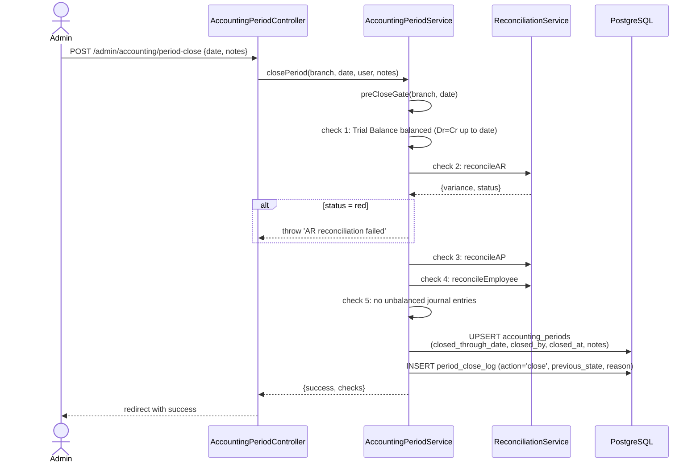
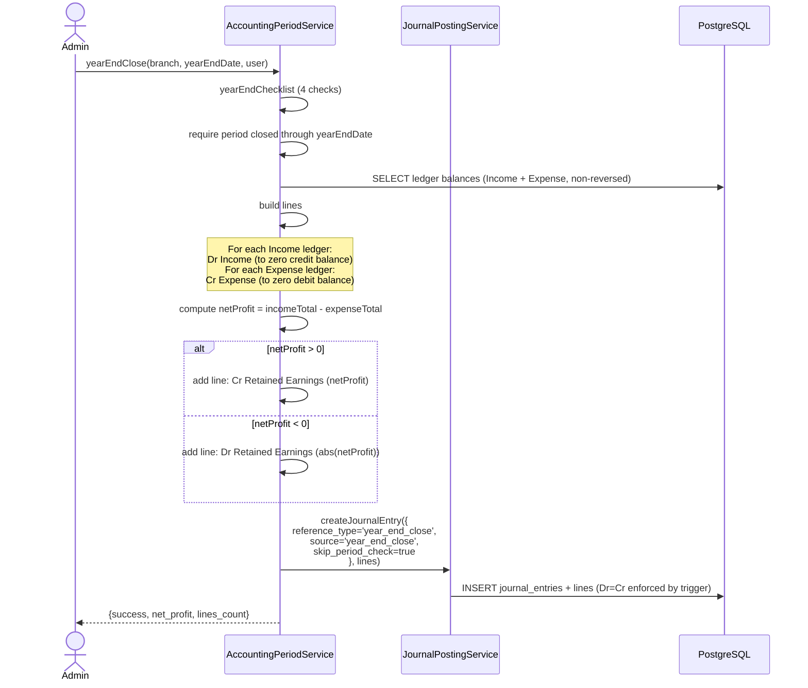

# Fiscal Year & Period Close

> **Module:** Accounting (SAFETY-CRITICAL)
> **Audience:** Engineers + AI assistants + **accountants** (must review before Canonical)
> **Status:** Draft — pending accountant sign-off
> **Last reviewed:** 2025-08-03
> **Source of truth:** this file + `laravel/app/Services/Accounting/AccountingPeriodService.php` + `laravel/app/Services/Accounting/FiscalYearService.php` + `laravel/database/sql/02_accounting.sql` (accounting_periods) + `laravel/database/migrations/2026_08_10_000004_create_enhanced_period_and_fiscal_year_controls.php`

## 1. What is it?

The fiscal year / period close framework controls **when the books can be edited**. An accounting
period (a month within a fiscal year) has a status (`open → closed → locked`). Once a period is
closed, no new journal entries can post to it — the books are frozen. RC_ERP_v2 has a **legacy
"soft close"** (`accounting_periods.closed_through_date`, one row per branch) and a **Phase-7
enhanced** system (`fiscal_years` + `fiscal_periods` + `period_close_log` tables) that wraps the
legacy table. The Bangladesh fiscal year (July 1 – June 30) is the default, configurable via
`system_policies.metadata`. The **pre-close gate** runs 5 checks (Trial Balance balanced, AR/AP/
Employee reconciliation green, no unbalanced JEs) before allowing a close. The **year-end close**
zeroes all Income/Expense ledgers to `retained_earnings`; Balance Sheet ledgers carry forward.

## 2. Why does it exist?

- To freeze historical periods so that reported financials cannot be silently altered after the
  fact. This is a core accounting control.
- To enforce the pre-close gate — you can't close a period with unreconciled sub-ledgers or an
  unbalanced Trial Balance.
- To automate the year-end Income/Expense → Retained Earnings transfer, which is a tedious,
  error-prone manual process.

## 3. When is it used?

- **On every journal post** — `JournalPostingService::validatePeriod()` checks
  `closed_through_date` for the branch; throws if the posting date is within a closed period
  (unless admin override is enabled + the user is admin, or `skip_period_check` is true for
  reversals/year-end close).
- **On period close** — admin runs `AccountingPeriodService::closePeriod()` (or the enhanced
  `FiscalYearService::closePeriod()` for an individual fiscal period).
- **On period reopen** — superadmin runs `AccountingPeriodService::reopenPeriod()` (or
  `FiscalYearService::reopenPeriod()`).
- **On year-end close** — admin runs `AccountingPeriodService::yearEndClose()`.
- **On every web request** — `CheckSystemPolicy` middleware loads the system policy (which may
  carry `fiscal_year_start` / `fiscal_year_end` metadata overrides).

## 4. Who uses it?

- **Admins** close periods and run year-end close (via `AccountingPeriodController`).
- **Superadmins** reopen closed periods and lock fiscal years.
- **Accountants** review the pre-close gate results before close.
- **System/automated:** `validatePeriod()` runs on every post attempt.

## 5. Related modules

- `journal-posting-rules.md` — `validatePeriod()` is called from `createJournalEntry()`.
- `subledger-reconciliation.md` — the pre-close gate runs the 3 sub-ledger reconciliations.
- `chart-of-accounts.md` — `retained_earnings` nature for year-end close.
- `reversal-vs-cancellation.md` — reversals bypass the period-close check.
- `../security/system-policy-compliance.md` — `PERIOD_CLOSE_ADMIN_OVERRIDE` flag.

## 6. Business rules

- **MUST** block journal posts to closed periods (posting_date <= closed_through_date), unless
  `PERIOD_CLOSE_ADMIN_OVERRIDE = true` AND the user is admin/superadmin (the override is
  audit-logged to `user_audit_log` action `period_close_override`).
- **MUST** run the 5-check pre-close gate before allowing a period close: (1) Trial Balance
  balanced, (2) AR recon green, (3) AP recon green, (4) Employee recon green, (5) no unbalanced
  journal entries.
- **MUST** allow only **superadmin** to reopen a closed period (the controller checks
  `auth()->user()?->isSuperadmin()`). Reopening is audit-logged to `user_audit_log` action
  `period_reopened`.
- **MUST** zero all Income/Expense ledgers to `retained_earnings` at year-end close. BS ledgers
  carry forward (not zeroed).
- **MUST** bypass the period-close check for reversals and year-end close entries
  (`skip_period_check = true`).
- **MUST** log every close/reopen/lock action to `period_close_log` (the enhanced system) with
  previous-state snapshot, reason, IP, actor.
- **MUST NOT** close a period that fails the pre-close gate.
- **MUST NOT** reopen a **locked** fiscal period (locked is a stronger state than closed —
  requires superadmin to unlock first).
- **SHOULD** run year-end close only once per fiscal year (it's not idempotent — running it twice
  would double-zero the Income/Expense ledgers, though by then they'd be zero anyway).

## 7. Technical implementation

### 7.1 The legacy `accounting_periods` table — `02_accounting.sql:271-281`

"Soft close" table. One row per branch (`UNIQUE (branch_id)`).

| Column | Type | Notes |
|---|---|---|
| `id` | `integer GENERATED ALWAYS AS IDENTITY PK` | |
| `branch_id` | `integer NOT NULL` | UNIQUE — one close-state per branch |
| `closed_through_date` | `date NOT NULL` | postings with `entry_date <= this` are blocked |
| `closed_by` | `integer` | user id |
| `closed_at` | `timestamp(0)` | |
| `notes` | `text` | |
| `created_at`, `updated_at` | `timestamp(0)` | |

> **Note:** Migration `2026_08_10_000004_create_enhanced_period_and_fiscal_year_controls.php:18`
> claims to add a `period_status` column to `accounting_periods`, but the migration body does NOT
> actually add it (only the comment mentions it). **GAP.**

### 7.2 The enhanced `fiscal_years` + `fiscal_periods` + `period_close_log` tables

Created by `2026_08_10_000004_create_enhanced_period_and_fiscal_year_controls.php` (248 lines).

**`fiscal_years`** (Phase 7 enhanced):

| Column | Type | Notes |
|---|---|---|
| `id` | bigint PK | |
| `name` | varchar(100) | e.g. "FY 2026-27" |
| `fiscal_year_code` | varchar(20) UNIQUE | e.g. "FY2026-27" |
| `start_date` | date | |
| `end_date` | date | |
| `branch_id` | bigint nullable FK branches | NULL = all branches |
| `period_type` | varchar(10) CHECK IN (`'monthly','quarterly','yearly'`) | default `'monthly'` |
| `status` | varchar(20) CHECK IN (`'draft','active','closed','locked'`) | default `'draft'` |
| `is_current` | boolean | default false (only one current per branch scope) |
| `description`, `created_by`, `closed_by`, `closed_at` | | |
| `timestamps`, `softDeletes` | | |

RLS enabled + forced (line 113-114).

**`fiscal_periods`**:

| Column | Type | Notes |
|---|---|---|
| `id` | bigint PK | |
| `fiscal_year_id` | bigint FK cascade | |
| `period_number` | smallint | 1-12 (monthly), 1-4 (quarterly), 1 (yearly) |
| `period_name` | varchar(30) | "January 2026", "Q1 2026-27" |
| `start_date`, `end_date` | date | |
| `status` | varchar(20) CHECK IN (`'open','closed','locked'`) | default `'open'` |
| `closed_by`, `closed_at`, `close_notes` | | |
| `timestamps` | | |
| UNIQUE (`fiscal_year_id`, `period_number`) | | |

**`period_close_log`** (full audit trail):

| Column | Type | Notes |
|---|---|---|
| `id` | bigint PK | |
| `fiscal_period_id` | bigint nullable FK nullOnDelete | |
| `fiscal_year_id` | bigint nullable FK nullOnDelete | |
| `branch_id` | bigint nullable FK | |
| `action` | varchar(20) CHECK IN (`'close','reopen','lock'`) | |
| `period_start_date`, `period_end_date` | date | |
| `performed_by` | bigint | |
| `reason` | text | |
| `previous_state` | json | snapshot of status before action |
| `ip_address` | varchar(45) | |
| `timestamps` | | |

### 7.3 Models

- `App\Models\FiscalYear` (`app/Models/FiscalYear.php`, 173 lines): SoftDeletes, BranchScope
  global scope. Helpers: `isEditable()` (draft only), `isActive()`, `isClosed()`, `isLocked()`.
  `maxPeriodNumber()` returns 12/4/1 by period_type. `getProgressPercent()`.
- `App\Models\FiscalPeriod` (`app/Models/FiscalPeriod.php`, 126 lines): `isOpen()`, `isClosed()`,
  `isLocked()`, `containsDate($date)`.
- `App\Models\PeriodCloseLog`.

### 7.4 `AccountingPeriodService` (legacy) — `app/Services/Accounting/AccountingPeriodService.php` (475 lines)

Constructor: `private JournalPostingService $postingService, private SubLedgerService
$subLedgerService`.

| Method | Signature | Purpose |
|---|---|---|
| `getClosedThroughDate` | `(int $branchId): ?string` | Reads `accounting_periods.closed_through_date` |
| `earliestOpenDate` | `(int $branchId): ?string` | `closed_through + 1 day` |
| `preCloseGate` | `(int $branchId, string $closeThroughDate): array{can_close, checks}` | **5 checks:** (1) Trial Balance balanced, (2) AR sub-ledger = GL AR control, (3) AP sub-ledger = GL AP control, (4) Employee sub-ledger = GL Employee control, (5) No unbalanced journal entries. |
| `closePeriod` | `(int $branchId, string $closeThroughDate, int $closedBy, string $notes = ''): array` | Runs preCloseGate; if all pass, UPSERTs `accounting_periods` row. Returns status + checks. |
| `reopenPeriod` | `(int $branchId, int $reopenedBy, string $reason): array` | Sets `closed_through_date = NULL`. Logs to `user_audit_log` action `period_reopened`. **Note:** No role check in service — the controller checks `auth()->user()?->isSuperadmin()`. |
| `yearEndClose` | `(int $branchId, string $yearEndDate, int $closedBy): array` | See §7.7. Requires period closed through yearEndDate. |
| `yearEndChecklist` | `(int $branchId, string $yearEndDate): array` | 4 checks: period closed through year-end, preCloseGate passes, Retained Earnings ledger configured, no pending reversal entries. |

### 7.5 `FiscalYearService` (enhanced) — `app/Services/Accounting/FiscalYearService.php` (450 lines)

Constructor: `private AccountingPeriodService $legacyPeriodService, private SubLedgerService
$subLedgerService`.

The Phase-7 "enhanced" service that wraps the legacy `AccountingPeriodService`. Methods:

- `createFiscalYear(array $data): FiscalYear` — creates FY with status=draft, is_current=false,
  then calls `generatePeriods()` (monthly/quarterly/yearly).
- `activateFiscalYear(FiscalYear $fy): FiscalYear` — only draft → active. Deactivates other
  current FYs in same branch scope.
- `closeFiscalYear(FiscalYear $fy, int $closedBy): array` — only active → closed. Requires all
  periods closed. Calls `legacyPeriodService->yearEndClose()`. Locks all periods.
- `lockFiscalYear(FiscalYear $fy, int $lockedBy, string $reason): FiscalYear` — active/closed →
  locked. Prevents any changes; superadmin can unlock.
- `closePeriod(FiscalPeriod $period, int $closedBy, string $notes): array` — closes individual
  period. Runs `preCloseGate`. Also updates legacy `accounting_periods` table for backward
  compat.
- `reopenPeriod(FiscalPeriod $period, int $reopenedBy, string $reason): array` — closed → open
  (NOT locked → open). Updates legacy `accounting_periods.closed_through_date` to the latest
  still-closed period's end_date.
- `getCurrentFiscalYear(?int $branchId): ?FiscalYear`
- `getPeriodForDate(string $date, ?int $branchId): ?FiscalPeriod`
- `isDateInOpenPeriod(string $date, ?int $branchId): bool`
- `getCloseLogHistory(int $fiscalYearId, int $limit = 50): array`

### 7.6 `PERIOD_CLOSE_ADMIN_OVERRIDE` flag — usage sites

| File:line | Code | Effect |
|---|---|---|
| `config/accounting.php:28` | `'period_close_admin_override' => (bool) env('PERIOD_CLOSE_ADMIN_OVERRIDE', false)` | Default false |
| `JournalPostingService.php:313` | `if (config('accounting.period_close_admin_override', false))` | When true + user is admin → bypass + log to `user_audit_log` action `period_close_override` |
| `ManualJournalService.php:472` (`assertPeriodOpen`) | Does NOT read the override — uses `periodService->earliestOpenDate()` directly. **GAP:** manual journals CANNOT use the admin override. |

Verbatim `validatePeriod` code (`JournalPostingService.php:302-345`):

```php
public function validatePeriod(string $postingDate, int $branchId): void
{
    $closedThrough = DB::table('accounting_periods')
        ->where('branch_id', $branchId)
        ->value('closed_through_date');

    if (!$closedThrough || $postingDate > $closedThrough) {
        return; // Period is open for this date.
    }

    if (config('accounting.period_close_admin_override', false)) {
        $user = \Illuminate\Support\Facades\Auth::user();
        if ($user && $user->isAdmin()) {
            DB::table('user_audit_log')->insert([
                'user_id' => $user->id,
                'action' => 'period_close_override',
                'target_user_id' => null,
                'branch_id' => $branchId,
                'details' => json_encode([
                    'posting_date' => $postingDate,
                    'closed_through' => $closedThrough,
                    'branch_id' => $branchId,
                    'reason' => 'Admin override: posting to closed period',
                ]),
                'ip_address' => request()?->ip(),
                'user_agent' => request()?->userAgent() ? mb_substr(request()->userAgent(), 0, 255) : null,
                'created_at' => now(),
            ]);
            return; // Bypass — admin allowed to post.
        }
    }

    throw new \RuntimeException(
        "Posting date {$postingDate} falls within a closed accounting period "
        . "(closed through {$closedThrough} for branch {$branchId}). "
        . "Reopen the period or use a later date."
        . (config('accounting.period_close_admin_override', false)
            ? ' (Admin override is enabled — contact an admin.)' : '')
    );
}
```

### 7.7 Year-end close — Dr/Cr pattern (verbatim)

`AccountingPeriodService::yearEndClose` lines 322-388:

```php
foreach ($ledgerBalances as $ledger) {
    $netBalance = (float) $ledger->net_balance;

    if ($ledger->account_type === 'Income') {
        // Income has credit balance (net_balance is negative for income).
        // To zero it: Dr Income (the credit balance amount)
        $amount = abs($netBalance);
        $incomeTotal += $amount;
        $lines[] = [
            'ledger_id' => $ledger->id,
            'debit' => $amount, 'credit' => 0,
            'entity_type' => 'year_end_close',
            'entity_id' => $ledger->id,
            'memo' => "Year-end close — zero {$ledger->ledger_name}",
        ];
    } elseif ($ledger->account_type === 'Expense') {
        // Expense has debit balance (net_balance is positive).
        // To zero it: Cr Expense (the debit balance amount)
        $amount = abs($netBalance);
        $expenseTotal += $amount;
        $lines[] = [
            'ledger_id' => $ledger->id,
            'debit' => 0, 'credit' => $amount,
            'entity_type' => 'year_end_close',
            'entity_id' => $ledger->id,
            'memo' => "Year-end close — zero {$ledger->ledger_name}",
        ];
    }
}

$netProfit = $incomeTotal - $expenseTotal;

if ($netProfit > 0) {
    // Profit: Cr Retained Earnings.
    $lines[] = ['ledger_id' => $reLedgerId, 'debit' => 0, 'credit' => round($netProfit, 2), ...];
} elseif ($netProfit < 0) {
    // Loss: Dr Retained Earnings.
    $lines[] = ['ledger_id' => $reLedgerId, 'debit' => round(abs($netProfit), 2), 'credit' => 0, ...];
}
```

**BS ledgers are NOT zeroed** — they carry forward. This is the only automated year-end operation.

### 7.8 Bangladesh fiscal year (July 1 – June 30)

Hardcoded fallback in `2026_08_10_000004:148-153`:

```php
// Fallback: Bangladesh fiscal year (July 1 → June 30)
if (!$startDate || !$endDate) {
    $now = now();
    $year = $now->month >= 7 ? $now->year : $now->year - 1;
    $startDate = "{$year}-07-01";
    $endDate = ($year + 1) . "-06-30";
}
```

But it's **configurable** via `system_policies.metadata.fiscal_year_start` /
`fiscal_year_end` (lines 141-145). If SystemPolicy has these metadata keys, they override the BD
fallback.

### 7.9 Scheduled jobs for period close

**None of the scheduled jobs are for period close** — period close is a manual admin action via
the `admin.accounting.period-close` route. The pg_cron jobs in
`2025_01_20_000009_add_pg_cron_scheduled_jobs.php` (lines 213-262):
1. `cancel-stale-drafts` — daily 02:00
2. `refresh-report-views` — every 5 min
3. `refresh-rb-checks` — hourly (running balance MVs)
4. `purge-old-notifications` — daily 03:00
5. `analyze-high-write-tables` — daily 04:00

Laravel scheduler (`routes/console.php`):
1. `reports:refresh` — every 5 min
2. `sales:cancel-stale-drafts` — daily 02:00
3. `stock:reconcile-drift` — daily 03:00
4. `partition:export-parquet` — quarterly 04:30
5. `partition:verify-join` — weekly Mon 05:00
6. `partition:measure-perf` — weekly Mon 05:30

### 7.10 posting_date validation flow

When a user posts an entry with `posting_date` in a closed period:
1. `JournalPostingService::createJournalEntry()` calls `validatePeriod($entry['entry_date'],
   $branchId)` (line 78) — UNLESS `skip_period_check` is true (used for reversals + year-end
   close).
2. `validatePeriod()` queries `accounting_periods.closed_through_date` for the branch.
3. If `postingDate <= closedThrough`: checks
   `config('accounting.period_close_admin_override')` + user isAdmin(). If both true → log to
   `user_audit_log` and bypass. Otherwise throw `RuntimeException`.
4. The exception bubbles up to the controller, which returns it as a 422 or 500 response.

## 8. Important database tables

| Table | Purpose | Key columns |
|---|---|---|
| `accounting_periods` | Legacy soft-close (one row per branch) | `branch_id (unique), closed_through_date, closed_by, closed_at` |
| `fiscal_years` | Enhanced FY (draft/active/closed/locked) | `fiscal_year_code, start_date, end_date, period_type, status, is_current` |
| `fiscal_periods` | Enhanced periods (open/closed/locked) | `fiscal_year_id, period_number, start_date, end_date, status` |
| `period_close_log` | Full audit trail of close/reopen/lock | `action, performed_by, reason, previous_state, ip_address` |

See `../database/er-diagrams.md`.

## 9. Related services

- `laravel/app/Services/Accounting/AccountingPeriodService.php` (legacy, 475 lines).
- `laravel/app/Services/Accounting/FiscalYearService.php` (enhanced, 450 lines).
- `laravel/app/Services/Accounting/SubLedgerService.php` — for the pre-close gate recon checks.
- `laravel/app/Http/Controllers/Admin/AccountingPeriodController.php`.

## 10. Related models

- `laravel/app/Models/FiscalYear.php`
- `laravel/app/Models/FiscalPeriod.php`
- `laravel/app/Models/PeriodCloseLog.php`
- `laravel/app/Models/AccountingPeriod.php` (legacy, if present; otherwise `DB::table`).

## 11. Important workflows

### 11.1 Period close (the pre-close gate)



### 11.2 Year-end close



## 12. Known edge cases

- **`period_status` column claimed but not added.** Migration
  `2026_08_10_000004:18` mentions adding `period_status` to `accounting_periods`, but the body
  doesn't add it. The legacy table has no status column — `closed_through_date` is the only
  state. (Gap — the enhanced system carries status on `fiscal_periods` instead.)
- **Manual journals cannot use the admin override.** `ManualJournalService::assertPeriodOpen`
  (L472) uses `periodService->earliestOpenDate()` directly — does NOT check
  `config('accounting.period_close_admin_override')`. Inconsistent with
  `JournalPostingService::validatePeriod`. (Gap — §13.)
- **Two parallel systems (legacy + enhanced).** `FiscalYearService` wraps
  `AccountingPeriodService` and updates both tables for backward compat. Code that reads
  `accounting_periods.closed_through_date` directly (like `validatePeriod`) bypasses the enhanced
  system's `status` (open/closed/locked). A locked fiscal period in the enhanced system does NOT
  block posts via the legacy `validatePeriod` check. (Gap — §13.)
- **Year-end close is not idempotent.** Running it twice on the same fiscal year would attempt to
  zero Income/Expense ledgers that are already zero (no effect on the books, but it creates a
  second `year_end_close` journal entry with all-zero lines — which the Dr=Cr trigger allows
  because 0=0, but it's noise). (Gap — §13.)
- **Reopening a period is superadmin-only at the controller level**, but the service method
  `AccountingPeriodService::reopenPeriod` has no role check. A direct call to the service (e.g.
  from a console command) would bypass the superadmin gate. (Gap — §13.)
- **`reopenPeriod` sets `closed_through_date = NULL`** (full reopen), not "reopen to the previous
  month". If a branch had closed through December and wants to reopen just November, they must
  reopen fully then re-close through November. The enhanced `FiscalYearService::reopenPeriod` is
  more granular (reopens a single fiscal period and updates `closed_through_date` to the latest
  still-closed period's end_date).
- **BS ledgers are NOT rolled forward** by year-end close. They carry forward implicitly because
  their balances are never zeroed. The `opening_balance` column on `ledgers` is a separate
  fiscal-year-start carry-forward that is NOT updated by year-end close (it's seeded manually or
  via the CoA seed). (Gap — see `chart-of-accounts.md` §7.7.)
- **`yearEndChecklist` requires "no pending reversal entries"** — but there's no definition of
  "pending reversal". This check may always pass or may look for entries with `is_reversed = true`
  but no corresponding reversal entry (an interrupted reversal). Confirm from code.
- **Bangladesh fiscal year is a hardcoded fallback.** If a deployment operates on a calendar year
  (Jan–Dec), they must set `system_policies.metadata.fiscal_year_start` / `fiscal_year_end`
  explicitly.

## 13. Future improvements

- **Add `period_status` to `accounting_periods`** (or migrate all reads to `fiscal_periods.status`)
  to close the legacy/enhanced gap.
- **Make `ManualJournalService::assertPeriodOpen` honor `PERIOD_CLOSE_ADMIN_OVERRIDE`** for
  consistency with `JournalPostingService::validatePeriod`.
- **Make year-end close idempotent** — check if a `year_end_close` entry already exists for the
  fiscal year and skip (or warn) if so.
- **Add a role check inside `AccountingPeriodService::reopenPeriod`** so direct service calls
  can't bypass the superadmin gate.
- **Make `reopenPeriod` granular** in the legacy service too (reopen to a specific date, not
  full NULL).
- **Roll BS `opening_balance` forward** at year-end close (or document that it's a manual step).
- **Add a scheduled job that warns when a fiscal year is approaching its end date without a
  year-end close** — nudges admins to run it.
- **Surface the pre-close gate results in the UI** before the admin confirms the close, so they
  can see which checks pass/fail and fix issues first.

---

> **⚠️ Accountant review required:** Confirm the year-end close Dr/Cr pattern (Dr Income / Cr
> Retained Earnings for profit; Dr Retained Earnings / Cr Expense for loss; BS ledgers carry
> forward) matches the business's accounting practice. Confirm that the Bangladesh fiscal year
> (July 1 – June 30) is correct. Confirm that reversals bypassing the period-close check is
> acceptable.
