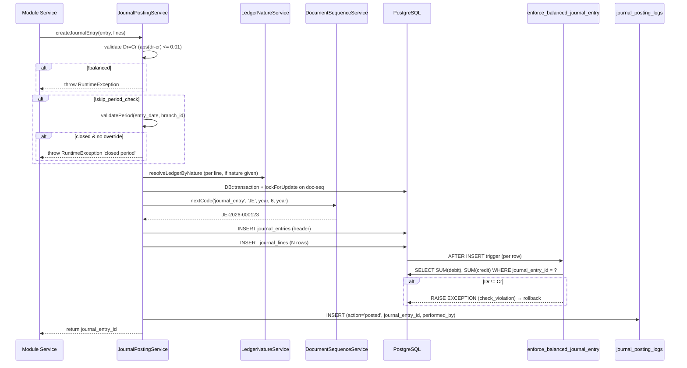
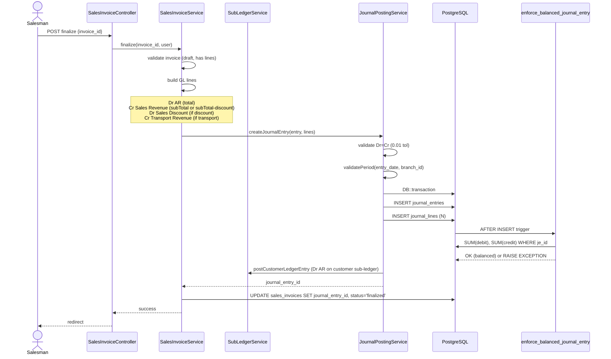
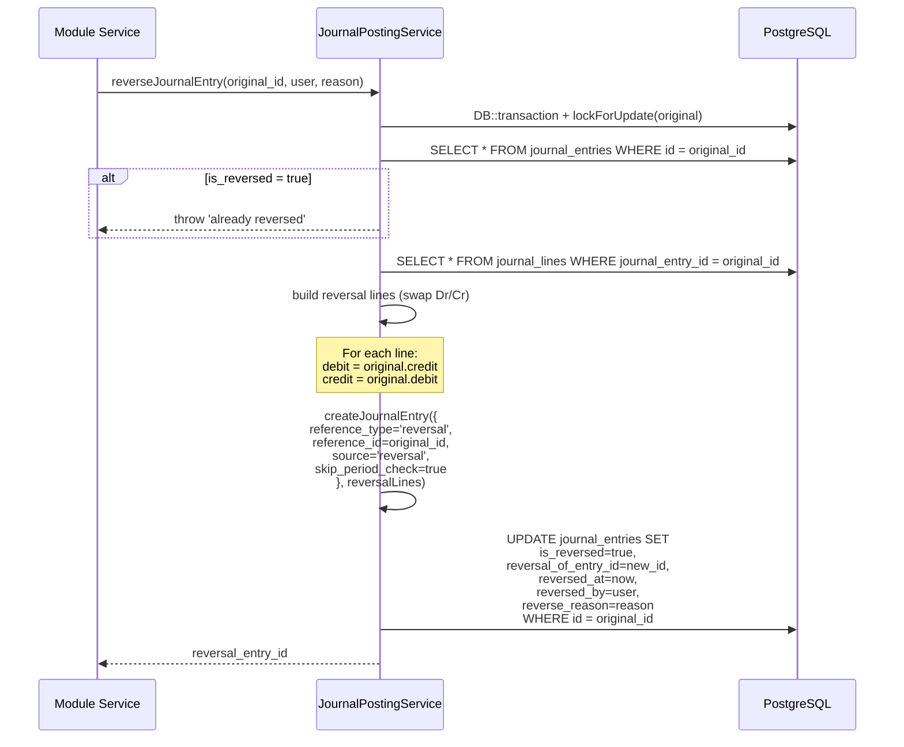

# Journal Posting Rules

> **Module:** Accounting (SAFETY-CRITICAL)
> **Audience:** Engineers + AI assistants + **accountants** (must review before Canonical)
> **Status:** Draft — pending accountant sign-off
> **Last reviewed:** 2025-08-03
> **Source of truth:** this file + `laravel/app/Services/Accounting/JournalPostingService.php` + `laravel/database/sql/02_accounting.sql` (Dr=Cr trigger) + per-module services cited inline
>
> **This document supersedes `docs/migration/journal_posting_rules.md`.** The migration doc is
> preserved for historical context; this file is the new canonical reference, grounded in the
> actual Laravel source code.

## 1. What is it?

The **journal posting rules** are the canonical Dr/Cr matrix that defines exactly which ledger is
debited and which is credited for every business operation in the ERP. The core invariant is
**Dr = Cr** (double-entry balance), enforced at three layers: an application pre-check (0.01
tolerance), a PostgreSQL per-row AFTER trigger (`enforce_balanced_journal_entry()`) that re-sums
the entire journal entry after every line change, and the reversal principle (a posted entry is
never mutated — it is reversed by a new entry with swapped Dr/Cr).

There are **28 posting methods** distributed across 8 modules (plus 16 type-aware sub-variants),
giving **~44 distinct Dr/Cr patterns** — the "~40" referenced informally.

## 2. Why does it exist?

- Double-entry accounting is the non-negotiable foundation. An ERP that loses Dr=Cr loses
  financial integrity. The DB trigger is the crown-jewel invariant: even a bug in the application
  cannot create an unbalanced entry.
- The reversal principle (never mutate a posted entry) preserves the audit trail — every financial
  movement is visible forever, and corrections are explicit new entries.
- Centralizing the rules here means an AI assistant (or a new accountant) can answer "what does
  the sales invoice finalize post?" without reading 6 service files.

## 3. When is it used?

- **On every financial mutation** — each module service calls
  `JournalPostingService::createJournalEntry()` (or `postJournalEntry()`) with pre-built lines.
- **On every reversal** — `JournalPostingService::reverseJournalEntry()` swaps Dr/Cr and creates a
  new entry.
- **At year-end close** — `AccountingPeriodService::yearEndClose()` zeroes Income/Expense to
  Retained Earnings.
- **At validation** — `php artisan journal:manual-verify` and `journal:replay-verify` confirm all
  entries balance.

## 4. Who uses it?

- **Accountants** review the Trial Balance and reconciliations that these postings produce.
- **Engineers / AI assistants** consult this matrix before writing or modifying any posting code.
- **System/automated:** the posting engine runs on every transaction.

## 5. Related modules

- `chart-of-accounts.md` — the ledger natures referenced throughout.
- `reversal-vs-cancellation.md` — the reversal method in detail.
- `subledger-reconciliation.md` — how control-account postings reconcile with sub-ledgers.
- `fiscal-year-period-close.md` — the period-close guard + year-end close.
- `financial-audit-log.md` — the immutable audit of every post.
- `../database/triggers-views-constraints.md` — the `enforce_balanced_journal_entry()` trigger.

## 6. Business rules (the Core Rule)

- **MUST** keep Debits = Credits for every journal entry. The DB trigger
  `enforce_balanced_journal_entry()` raises `check_violation` if they differ.
- **MUST** post to an **active** ledger. `createJournalEntry()` validates all `ledger_id`s are
  active before inserting.
- **MUST** post to an **open** period, unless `skip_period_check = true` (used for reversals and
  year-end close) or `PERIOD_CLOSE_ADMIN_OVERRIDE = true` AND the user is admin/superadmin (the
  override is audit-logged).
- **MUST** create a **new entry with swapped Dr/Cr** to reverse a posting — never mutate the
  original lines. The original is marked `is_reversed = true`.
- **MUST** link every journal entry to its source via `reference_type` + `reference_id`.
- **MUST NOT** delete a posted journal entry. There is no `delete()` path; the only mutation
  allowed is the reversal marker columns. (Note: this is by application convention — see §12 for
  the DB-enforcement gap.)
- **MUST NOT** post a journal line with both `debit > 0` AND `credit > 0` (DB CHECK
  `jl_not_both_zero_check` + the convention that exactly one side is populated).
- **MUST** generate `entry_no` via `DocumentSequenceService` with an advisory lock to avoid
  duplicate numbers under concurrency. Format: `JE-YYYY-NNNNNN`.
- **SHOULD** use `LedgerNatureService::resolveLedgerByNature()` to look up ledger IDs by nature,
  never hardcode ledger IDs.

## 7. Technical implementation

### 7.1 The `journal_entries` table — `laravel/database/sql/02_accounting.sql:31-53`

| Column | Type | Notes |
|---|---|---|
| `id` | `integer GENERATED ALWAYS AS IDENTITY PK` | (partition key as of 2026_08_22_000002) |
| `entry_no` | `varchar(30) NOT NULL UNIQUE` | format `JE-YYYY-NNNNNN` |
| `entry_date` | `date NOT NULL` | (partition key) |
| `reference_type` | `varchar(30)` | links to source transaction |
| `reference_id` | `integer` | source transaction id |
| `branch_id` | `integer` | |
| `description` | `text` | |
| `source` | `varchar(30) DEFAULT 'manual'` | `manual`, `sales_invoice`, `sales_challan`, `customer_payment_*`, `supplier_payment_*`, `money_transfer`, `reversal`, `year_end_close`, `elimination`, etc. |
| `is_reversed` | `boolean NOT NULL DEFAULT false` | **the immutable reversal flag** |
| `reversal_of_entry_id` | `integer` | **set on the ORIGINAL after reversal** — points to the new reversal entry |
| `reversed_at` | `timestamp(0)` | |
| `reversed_by` | `integer` | |
| `reverse_reason` | `text` | |
| `created_by` | `integer` | |
| `created_at`, `updated_at` | `timestamp(0)` | |

> **IMPORTANT naming gotcha:** `reversal_of_entry_id` lives on the **ORIGINAL** entry (set after
> reversal), pointing forward to the **new** reversal entry. The new reversal entry has
> `reference_type='reversal'` and `reference_id=original_id`. There is NO column on the reversal
> entry pointing back — the back-link is via `reversal_of_entry_id` (reverse lookup). See
> `reversal-vs-cancellation.md`.

### 7.2 The `journal_lines` table — `02_accounting.sql:55-70`

| Column | Type | Notes |
|---|---|---|
| `id` | `integer GENERATED ALWAYS AS IDENTITY PK` | |
| `journal_entry_id` | `integer NOT NULL REFERENCES journal_entries(id) ON DELETE CASCADE` | (composite FK as of 2026_08_22) |
| `entry_date` | `date` | denormalized partition key (HOTFIX-9 `trg_jl_sync_entry_date` syncs from parent) |
| `ledger_id` | `integer NOT NULL` | (no DB FK to ledgers — partitioned-parent limitation; soft reference) |
| `debit` | `numeric(15,2) NOT NULL DEFAULT 0` | |
| `credit` | `numeric(15,2) NOT NULL DEFAULT 0` | |
| `entity_type` | `varchar(30)` | `customer`, `supplier`, `employee`, `bank`, `sales_invoice`, `purchase_receive`, etc. |
| `entity_id` | `integer` | |
| `memo` | `text` | |
| `dimension_value_id` | `integer` | FK to `dimension_values` (budgeting) |
| `is_bank_reconciled` | `boolean` | bank reconciliation flag |
| `bank_reconciliation_id` | `integer` | FK to `bank_reconciliations` |
| `created_at` | `timestamp(0)` | |

CHECK constraints:

```sql
CONSTRAINT jl_balanced_check CHECK (debit >= 0 AND credit >= 0),
CONSTRAINT jl_not_both_zero_check CHECK (debit > 0 OR credit > 0)
```

### 7.3 The Dr=Cr trigger — `enforce_balanced_journal_entry()` (verbatim, the crown jewel)

`laravel/database/sql/02_accounting.sql:74-96`:

```sql
CREATE OR REPLACE FUNCTION enforce_balanced_journal_entry()
RETURNS TRIGGER AS $$
DECLARE
    total_debit numeric(15,2);
    total_credit numeric(15,2);
BEGIN
    SELECT COALESCE(SUM(debit), 0), COALESCE(SUM(credit), 0)
    INTO total_debit, total_credit
    FROM journal_lines
    WHERE journal_entry_id = COALESCE(NEW.journal_entry_id, OLD.journal_entry_id);

    IF total_debit <> total_credit THEN
        RAISE EXCEPTION 'Journal entry % is not balanced: debits (%) do not equal credits (%)',
            COALESCE(NEW.journal_entry_id, OLD.journal_entry_id), total_debit, total_credit
            USING ERRCODE = 'check_violation';
    END IF;
    RETURN COALESCE(NEW, OLD);
END;
$$ LANGUAGE plpgsql;

CREATE TRIGGER trg_journal_balanced
AFTER INSERT OR UPDATE OR DELETE ON journal_lines
FOR EACH ROW EXECUTE FUNCTION enforce_balanced_journal_entry();
```

This is the **source of truth** for Dr=Cr. A per-row AFTER trigger re-sums the entire journal
entry's Dr/Cr after every line change. The application-level 0.01 tolerance
(`JournalPostingService:70`) is a pre-check; this DB trigger is the invariant.

### 7.4 `JournalPostingService` — `laravel/app/Services/Accounting/JournalPostingService.php` (480 lines)

Constructor: `private LedgerNatureService $natureService`.

| # | Method | Signature | Purpose |
|---|---|---|---|
| 1 | `createJournalEntry` | `(array $entry, array $lines): int` | Atomic create: validates Dr=Cr (0.01 tol), validates period, validates all ledgers active, generates `JE-YYYY-NNNNNN` via `DocumentSequenceService` advisory lock, inserts header + lines, logs to `journal_posting_logs` (action='posted'). Returns `journal_entry_id`. |
| 2 | `reverseJournalEntry` | `(int $journalEntryId, int $reversedBy, string $reason = '', ?string $entryDate = null): int` | Append-only reversal. Builds new lines with Dr/Cr swapped, calls `createJournalEntry` with `skip_period_check=true` and `reference_type='reversal'`. Then UPDATEs original: `is_reversed=true`, `reversal_of_entry_id=$reversalId`, `reversed_at`, `reversed_by`, `reverse_reason`. Wraps in `DB::transaction` + `lockForUpdate` on the original. Logs `action='reversed'`. |
| 3 | `lookupLedgerByNature` | `(string $nature): ?int` | Delegates to `LedgerNatureService::resolveLedgerByNature()` (with `damage_loss`→`inventory_shrinkage` fallback). |
| 4 | `postJournalEntry` | `(array $data): int` | Convenience wrapper: pulls `lines` out of `$data` and calls `createJournalEntry($data, $lines)`. |
| 5 | `validatePeriod` | `(string $postingDate, int $branchId): void` | Reads `accounting_periods.closed_through_date`; throws `RuntimeException` if closed. Honors `PERIOD_CLOSE_ADMIN_OVERRIDE` for admin+superadmin (logs to `user_audit_log`). |
| 6 | `findJournalEntryByReference` | `(string $referenceType, int $referenceId): ?object` | First non-reversed entry by reference. |
| 7 | `getEntryWithLines` | `(int $journalEntryId): array{entry, lines}` | For display. |
| 8 | `generateEntryNo` | `(private): string` | `JE-YYYY-NNNNNN` via `DocumentSequenceService`. |
| 9 | `verifyAllEntriesBalanced` | `(): array{total_entries, unbalanced_count, unbalanced_ids}` | Batch verification SQL. |
| 10 | `getEntryCountsByReferenceType` | `(): array` | For replay command. |
| 11 | `getTotalDebitsCredits` | `(): array{total_debit, total_credit, balanced}` | Trial Balance top-line check. |

> **IMPORTANT:** `JournalPostingService` itself has only **11 methods** (not ~40). The ~40
> "posting methods" are distributed across **per-module services** that call
> `createJournalEntry`/`postJournalEntry` with pre-built lines. See §7.6 for the full inventory.

### 7.5 The `createJournalEntry` atomic flow



### 7.6 The ~40 posting methods — full Dr/Cr matrix

#### 7.6.1 Sales module (6 methods)

| # | Method | File:line | Dr / Cr |
|---|---|---|---|
| 1 | `postInvoiceGL` | `SalesInvoiceService.php:989` | Dr **AR** (`ar`) total · Cr **Sales Revenue** (`sales_revenue`) subTotal or (subTotal−discount) · Dr **Sales Discount** (`sales_discount`) if discount>0 · Cr **Transport Revenue** (`transport_revenue`) if transport>0 |
| 2 | `postCogsGL` | `SalesChallanService.php:703` | Dr **COGS** (`cogs`) Σ(qty×avg_cost) · Cr **Inventory** (`inventory`) same amount |
| 3 | `postTransportAdjustmentGL` | `SalesChallanService.php:801` | If transport ↑: Dr AR / Cr Transport Revenue (or sales_revenue fallback). If ↓: Dr Transport Revenue / Cr AR. |
| 4 | `postRevenueReversalGL` | `SalesReturnService.php:415` | Dr **Sales Return** (`sales_return`) Σ(qty×sales_rate) · Cr **AR** (`ar`) |
| 5 | `postCogsReversalGL` | `SalesReturnService.php:459` | Dr **Inventory** (`inventory`) Σ(qty×ORIGINAL avg_cost) · Cr **COGS** (`cogs`) |
| 6 | `postPaymentGL` (customer) | `CustomerPaymentService.php:368` | Type-aware — see below. |

**Customer payment type-aware variants** (`CustomerPaymentService::postPaymentGL`):

| Variant | Method:line | Dr / Cr |
|---|---|---|
| `receive` | `buildReceiveGL` L430 | Dr **Bank/Cash** (`cash_bank` or bank_ledger_mappings) amount · Cr **AR** amount+discount_amount · Dr **Sales Discount** (`sales_discount`) discount_amount (if > 0) |
| `discount` | `buildDiscountGL` L477 | Dr **Sales Discount** (`sales_discount`) (amount+discount_amount) · Cr **AR** (amount+discount_amount) |
| `write_off` | `buildWriteOffGL` L508 | Dr **Bad Debt** (`write_off` → falls back to `finance_cost` → `operating_expense`) amount · Cr **AR** amount |
| `payment` (refund) | `buildRefundGL` L543 | Dr **AR** amount · Cr **Bank/Cash** amount |

> **Note:** `CustomerPaymentService::postIntercompanySettlement` (L772) is **currently DISABLED**
> — `return null;` at line 780 because the `banks` table didn't have `branch_id` when written.
> Code exists but is unreachable. (`banks.branch_id` was later added by
> `2026_08_06_000001_add_branch_id_to_banks.php`.)

#### 7.6.2 Purchase module (2 methods)

| # | Method | File:line | Dr / Cr |
|---|---|---|---|
| 7 | `postReceiveGL` | `PurchaseReceiveService.php:371` | Dr **Inventory** (`inventory`) total_amount · Cr **AP** (`ap`) total_amount |
| 8 | `postReturnGL` | `PurchaseReturnService.php:360` | Dr **AP** (`ap`) total_amount · Cr **Inventory** (`inventory`) total_amount |

#### 7.6.3 Stock module (4 methods)

| # | Method | File:line | Dr / Cr |
|---|---|---|---|
| 9 | `postAdjustmentGL` | `StockAdjustmentService.php:836` | If increase: Dr **Inventory** (`inventory`) total_amount · Cr **Inventory Surplus** (`inventory_surplus`) total_amount. If decrease: Dr **Inventory Shrinkage** (`inventory_shrinkage`) · Cr **Inventory**. Returns null if total_amount<0.01. |
| 10 | `postStockTakeGL` | `StockTakeService.php:2483` | Gain: Dr Inventory / Cr Inventory Surplus. Loss: Dr Inventory Shrinkage / Cr Inventory. Revaluation: Dr/Cr Inventory / Cr/Dr `inventory_revaluation` (Phase 9 cost-drift). |
| 11 | `postDamageGL` | `DamageService.php:841` | Dr **Damage Loss** (`damage_loss`, falls back to `inventory_shrinkage`) · Cr **Inventory**. Type-aware (`resolveLossLedgerId` L921): `missing`/`theft` → `inventory_shrinkage`; `real_damage`/`quality_reject`/`customer_return`/`other` → `damage_loss`. |
| 12 | `postEmployeeRecovery` | `DamageService.php:1114` | Dr **Employee Payable** (`employee_payable`) · Cr **Damage Loss** (`damage_loss`). |

#### 7.6.4 Accounting module — employee transactions (2 methods + 5 variants)

| # | Method | File:line | Dr / Cr |
|---|---|---|---|
| 13 | `postTransactionGL` (employee) | `EmployeeTransactionService.php:391` | Type-aware — see below. |
| 14 | `postIntercompanySettlement` | `EmployeeTransactionService.php:639` | Two-JE intercompany — see §7.6.7. |

**Employee transaction type-aware variants** (`EmployeeTransactionService::postTransactionGL`):

| Variant | Method:line | Dr / Cr |
|---|---|---|
| `advance` / `loan` | `buildOutflowGL` L452 | Dr **Employee Payable** (`employee_payable`) · Cr **Bank/Cash** |
| `salary` | `buildSalaryGL` L474 | Dr **Salary Expense** (`salary_expense`) · Cr **Bank/Cash** |
| `repayment` | `buildInflowGL` L496 | Dr **Bank/Cash** · Cr **Employee Payable** (`employee_payable`) |
| `deduction` | `buildDeductionGL` L518 | Dr **Salary Expense** (`salary_expense`) · Cr **Employee Payable** (`employee_payable`) |
| `adjustment` (default) | — | Dr **Employee Payable** · Cr **Bank/Cash** |

#### 7.6.5 Accounting module — supplier transactions (2 methods + 3 variants)

| # | Method | File:line | Dr / Cr |
|---|---|---|---|
| 15 | `postPaymentGL` (supplier) | `SupplierTransactionService.php:405` | Type-aware — see below. |
| 16 | `postIntercompanySettlement` | `SupplierTransactionService.php:616` | Two-JE intercompany. |

**Supplier transaction type-aware variants** (`SupplierTransactionService::postPaymentGL`):

| Variant | Method:line | Dr / Cr |
|---|---|---|
| `payment` / `advance` | `buildPaymentGL` L457 | Dr **AP** (`ap`) · Cr **Bank/Cash** |
| `receive` | `buildReceiveGL` L486 | Dr **Inventory** (`inventory`) · Cr **AP** (`ap`) — "supplier credit receive" |

#### 7.6.6 Accounting module — money transfers (2 methods + 4 variants)

| # | Method | File:line | Dr / Cr |
|---|---|---|---|
| 17 | `postTransferGL` | `MoneyTransferService.php:239` | Type-aware — see below. |
| 18 | `postIntercompanySettlement` | `MoneyTransferService.php:439` | Cross-branch — **GAP**: uses `'intercompany'` nature which is not registered (see §12). |

**Money transfer type-aware variants** (`MoneyTransferService::postTransferGL`):

| Variant | Dr / Cr |
|---|---|
| `cash_to_bank` | Dr bank-ledger (via `bank_ledger_mappings`) / Cr **Cash/Bank** (`cash_bank`) |
| `bank_to_cash` | Dr **Cash/Bank** (`cash_bank`) / Cr bank-ledger |
| `bank_to_bank` | Dr dest-bank-ledger / Cr src-bank-ledger |
| `cash_to_cash` | **NOT FOUND in `postTransferGL`** (switch throws RuntimeException for unknown type — `recordCashLedger` L387 handles cash_to_cash with no bank balance change, so no GL post). |

#### 7.6.7 Inter-branch / consolidation (4 methods)

| # | Method | File:line | Dr / Cr |
|---|---|---|---|
| 24 | `postDemandFulfillmentJournals` | `BranchIntercompanyService.php:76` | **Two JEs.** Creditor (supplier branch): Dr **interbranch_receivable** / Cr **Inventory**. Debtor (requester branch): Dr **Inventory** / Cr **interbranch_payable**. |
| 25 | `postIntercompanyGL` | `WarehouseTransferService.php:531` | **Two JEs.** From-branch: Dr **interbranch_payable** / Cr **Inventory**. To-branch: Dr **Inventory** / Cr **interbranch_receivable**. |
| 26 | `postEliminationEntry` | `ConsolidationService.php:339` | Dr debit_ledger (or `elimination_debit_ledger_id`) / Cr credit_ledger (or `elimination_credit_ledger_id`). reference_type=`consolidation_elimination`. **Bypasses `createJournalEntry`** — uses `JournalEntry::create()` + `JournalLine::create()` directly. |
| 27 | `postConsolidation` | `ConsolidationService.php:292` | Wrapper that loops elimination entries and calls `postEliminationEntry` for each. |

#### 7.6.8 Other income/expense + manual journal + fixed assets (5 methods)

| # | Method | File:line | Dr / Cr |
|---|---|---|---|
| 19 | `postIncomeGL` | `OtherIncomeService.php:257` | Dr Cash/Bank (or user-selected ledger) · Cr **Other Income** (or user-selected, fallback `other_income` nature) |
| 20 | `postExpenseGL` | `OtherExpenseService.php:257` | Dr **Operating Expense** (user-selected or `operating_expense` nature) · Cr Cash/Bank |
| 21 | `postToGL` (manual journal) | `ManualJournalService.php:319` | User-defined lines (no nature lookup). reference_type=`manual_journal`. |
| 22 | `postDepreciation` | `DepreciationService.php:262` | Dr **Depreciation Expense** (`depreciation_expense`, fallback to `asset.dep_expense_ledger_id`) · Cr **Accumulated Depreciation** (`asset.dep_ledger_id`) |
| 23 | `disposeAsset` | `AssetDisposalService.php:58` | Dr **Accumulated Depreciation** · Dr Cash/Bank (if proceeds) · Dr **Loss on Disposal** (if loss) · Cr **Fixed Asset** (acquisition_cost) · Cr **Gain on Disposal** (if gain) |

#### 7.6.9 Period close (1 method)

| # | Method | File:line | Dr / Cr |
|---|---|---|---|
| 28 | `yearEndClose` | `AccountingPeriodService.php:274` | For each Income ledger with balance: Dr Income ledger (to zero credit balance) · (deferred) Cr Retained Earnings. For each Expense ledger: Dr Retained Earnings · (deferred) Cr Expense ledger. Final balancing line: if netProfit>0 Cr Retained Earnings; if netProfit<0 Dr Retained Earnings. reference_type=`year_end_close`, source=`year_end_close`, skip_period_check=true. See `fiscal-year-period-close.md`. |

**Totals:** 28 methods + 16 type-aware sub-variants = **44 distinct Dr/Cr patterns**.

### 7.7 The `reference_type` matrix

Collected from all `createJournalEntry`/`postJournalEntry` call sites:

| reference_type | Posted by | Source module |
|---|---|---|
| `sales_invoice` | `postInvoiceGL`, `postTransportAdjustmentGL` | Sales |
| `sales_challan` | `postCogsGL` | Sales |
| `sales_return` | `postRevenueReversalGL`, `postCogsReversalGL` | Sales |
| `customer_payment` | `postPaymentGL`, `postIntercompanySettlement` | Sales |
| `supplier_payment` | `postPaymentGL`, `postSupplierLedgerForType`, `postIntercompanySettlement` | Accounting |
| `supplier_payment_intercompany` | `postIntercompanySettlement` (creditor + debtor JEs) | Accounting |
| `employee_transaction` | `postTransactionGL`, `postEmployeeLedgerForType` | Accounting |
| `employee_transaction_intercompany` | `postIntercompanySettlement` (creditor + debtor JEs) | Accounting |
| `money_transfer` | `postTransferGL`, `recordCashLedger` | Accounting |
| `money_transfer_intercompany` | `postIntercompanySettlement` | Accounting |
| `other_income` | `postIncomeGL` | Accounting |
| `other_expense` | `postExpenseGL` | Accounting |
| `manual_journal` | `postToGL` | Accounting |
| `purchase_receive` | `postReceiveGL` | Purchase |
| `purchase_return` | `postReturnGL` | Purchase |
| `stock_adjustment` | `postAdjustmentGL` | Stock |
| `stock_take` | `postStockTakeGL` | Stock |
| `damage` | `postDamageGL` | Stock |
| `warehouse_transfer` | `postIntercompanyGL` | Stock |
| `branch_demand_fulfillment` | `postDemandFulfillmentJournals` | BranchDemand |
| `branch_demand_repricing` | `postRepricingAdjustmentJournals` | BranchDemand |
| `demand_send` / `demand_receive` / `demand_transfer` / `demand_reversal` | BranchDemand settlement | BranchDemand |
| `fixed_asset_depreciation` | `postDepreciation` | Accounting |
| `asset_disposal` | `disposeAsset` | Accounting |
| `consolidation_elimination` | `postEliminationEntry` | Consolidation |
| `consolidation_reversal` | reverseConsolidation | Consolidation |
| `year_end_close` | `yearEndClose` | Accounting |
| `reversal` | `reverseJournalEntry` (the reversal entry itself) | Accounting (core) |

> **Note:** `reference_type` is `varchar(30)` with **no DB CHECK constraint** — the list above is
> the de-facto enum enforced by application code only.

### 7.8 The `journal_posting_logs` table — `02_accounting.sql:101-131`

Partitioned by RANGE(performed_at). Columns: `id, journal_entry_id FK, action CHECK IN
('posted','reversed','edited'), performed_by, performed_at, remarks, PRIMARY KEY (id,
performed_at)`. Retention 84 months. Written by `createJournalEntry` (action='posted') and
`reverseJournalEntry` (action='reversed').

### 7.9 GL reconciliation tolerance — usage sites (inconsistency gap)

| File:line | Code | Tolerance source |
|---|---|---|
| `ReconciliationService.php:41` | `$this->tolerance = (float) config('app.gl_reconciliation_tolerance', 0.02);` | `config/app.php` |
| `SubLedgerService.php:325` | `$tolerance = 0.02;` (literal) | **hard-coded** — does NOT read config |
| `RunningBalanceReconcile.php:49` | `$this->tolerance = (float) config('app.gl_reconciliation_tolerance', 0.02);` | `config/app.php` |
| `JournalPostingService.php:70` | `abs($totalDebit - $totalCredit) > 0.01` (Dr=Cr check) | **hard-coded 0.01** — different threshold |
| `ManualJournalService.php:461` | `abs($totalDebit - $totalCredit) > 0.01` | hard-coded 0.01 |

> **GAP:** Three different tolerance values / sources. The Dr=Cr check uses 0.01 (a cent); the
> reconciliation uses 0.02 (two cents). These should be unified or the difference should be
> documented as intentional.

## 8. Important database tables

| Table | Purpose | Key columns |
|---|---|---|
| `journal_entries` | JE header | `entry_no, entry_date, reference_type, reference_id, branch_id, is_reversed, reversal_of_entry_id` |
| `journal_lines` | JE legs | `journal_entry_id, ledger_id, debit, credit, entity_type, entity_id` |
| `journal_posting_logs` | Posting audit (posted/reversed/edited) | `journal_entry_id, action, performed_by, performed_at` |

See `../database/er-diagrams.md` for the accounting-domain ER diagram.

## 9. Related services

- `laravel/app/Services/Accounting/JournalPostingService.php` — the core (11 methods).
- `laravel/app/Services/Accounting/LedgerNatureService.php` — nature → ledger resolution.
- `laravel/app/Services/Accounting/JournalReversalService.php` — reversal verification.
- `laravel/app/Services/Accounting/DocumentSequenceService.php` — `entry_no` generation (advisory lock).
- Per-module posting services (Sales, Purchase, Stock, Accounting) cited in §7.6.

## 10. Related models

- `laravel/app/Models/JournalEntry.php`
- `laravel/app/Models/JournalLine.php`
- `laravel/app/Models/Ledger.php`

## 11. Important workflows

### 11.1 Sales invoice finalize (the canonical example)



### 11.2 The reversal (never mutate)



## 12. Known edge cases

- **`cash_to_cash` money transfer has no GL post.** The `postTransferGL` switch throws
  RuntimeException for unknown types, but `recordCashLedger` (L387) handles cash_to_cash with no
  bank balance change, so the GL post is skipped. A cash-to-cash transfer within a branch is a
  no-op at the GL level (cash ledger gets two rows: OUT and IN).
- **`MoneyTransferService::postIntercompanySettlement` uses an unregistered `'intercompany'`
  nature.** The lookup always fails and logs a warning, returning null. Cross-branch money
  transfer intercompany settlement is therefore not posted. (Gap — §13.)
- **`ConsolidationService::postEliminationEntry` bypasses `createJournalEntry`.** It uses
  `JournalEntry::create()` + `JournalLine::create()` directly, so it skips the Dr=Cr pre-check
  and the period validation. The DB trigger still enforces Dr=Cr. (Gap — the consolidation
  entries could post to a closed period.)
- **`inventory_revaluation` nature is not registered** in `EXTENDED_NATURES` —
  `StockTakeService::postStockTakeGL` references it for cost-drift revaluation. See
  `chart-of-accounts.md` §12.
- **Tolerance inconsistency** — three different thresholds (0.01 for Dr=Cr, 0.02 for recon,
  hard-coded 0.02 in SubLedgerService). See §7.9.
- **Manual journals cannot use the admin override.** `ManualJournalService::assertPeriodOpen`
  (L472) uses `periodService->earliestOpenDate()` directly — does NOT read
  `config('accounting.period_close_admin_override')`. Inconsistent with
  `JournalPostingService::validatePeriod`. See `fiscal-year-period-close.md` §12.
- **No DB-level guard against deleting posted journal entries.** `journal_lines.journal_entry_id`
  FK has `ON DELETE CASCADE`, so deleting a JE cascades to its lines. RLS restricts DELETE to
  same-branch but doesn't block posted-row deletion. Immutability is by application convention
  only. (Contrast with `financial_audit_log` which has `REVOKE UPDATE, DELETE`.) See
  `reversal-vs-cancellation.md` §12.
- **`reference_type` is not DB-enforced.** A typo in a new posting method would create an
  untraceable entry. The `journal:replay-verify` command catches unknown reference types.

## 13. Future improvements

- **Register `inventory_revaluation` in `EXTENDED_NATURES`** or change `StockTakeService` to use a
  registered nature.
- **Fix `MoneyTransferService::postIntercompanySettlement`** to use the registered
  `interbranch_receivable` / `interbranch_payable` natures (or register `intercompany`).
- **Route `ConsolidationService::postEliminationEntry` through `createJournalEntry`** so it gets
  the Dr=Cr pre-check + period validation + posting log.
- **Unify the tolerance config** — read `config('accounting.gl_reconciliation_tolerance')`
  everywhere; either align the Dr=Cr check to 0.02 or document why it's stricter (0.01).
- **Add a DB CHECK or trigger on `reference_type`** to enforce the enum at the DB level (or
  document why it's open `varchar(30)`).
- **Add a `journal:verify-references` command** that flags entries with unknown reference_types.
- **Re-enable `CustomerPaymentService::postIntercompanySettlement`** now that `banks.branch_id`
  exists, or remove the dead code.

---

> **⚠️ Accountant review required:** The 12 posting-method Dr/Cr assertions in the Phase 6
> research digest's accountant review checklist MUST be verified by a qualified accountant before
> this file is marked Canonical. Pay special attention to:
> - Sales invoice finalize (Dr AR / Cr Sales Revenue / Dr Sales Discount / Cr Transport Revenue)
> - Sales return COGS reversal (Dr Inventory / Cr COGS at **ORIGINAL** avg_cost, not current)
> - Year-end close (Dr Income / Cr Retained Earnings for profit; Dr Retained Earnings / Cr
>   Expense for loss)
