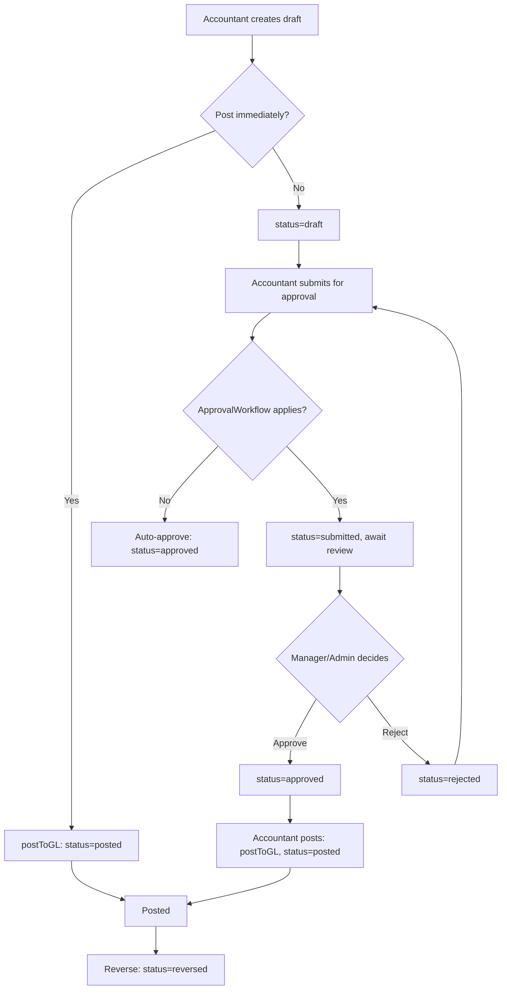
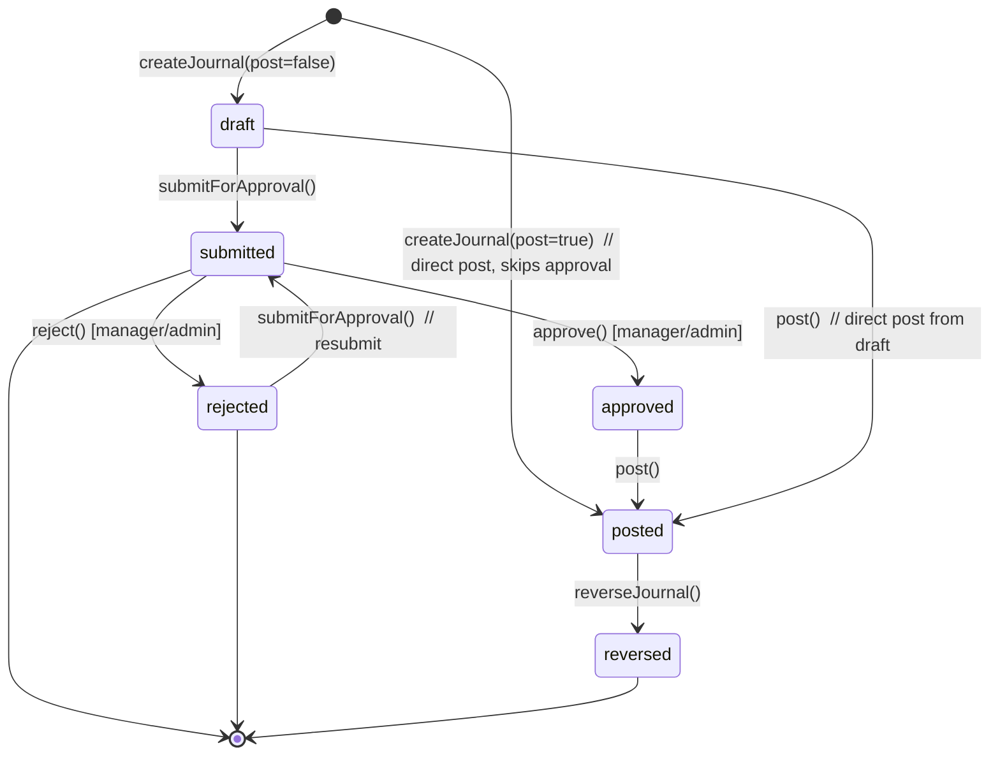

# Manual Journals

> **Module:** Accounting Transactions (SAFETY-CRITICAL)
> **Audience:** Engineers + AI assistants + **accountants** (must review before Canonical)
> **Status:** Draft — pending accountant sign-off
> **Last reviewed:** 2025-08-03
> **Source of truth:** this file + `laravel/app/Services/Accounting/ManualJournalService.php` + `laravel/database/sql/02_accounting.sql` (manual_journals + manual_journal_lines DDL) + `laravel/app/Services/Approval/ApprovalService.php`

## 1. What is it?

A **manual journal** is the accountant's escape hatch — a free-form double-entry posting that
doesn't fit any of the operational flows (sales, purchase, money transfer, employee, supplier,
customer, other income/expense). The accountant picks any combination of ledgers, specifies Dr/Cr
per line, and posts. It is the most flexible and therefore the most dangerous transaction type:
a wrong manual journal can corrupt the trial balance silently if the Dr/Cr is technically balanced
but semantically wrong.

Manual Journal is the **only one of the 7 transaction modules** with a multi-step lifecycle
(draft → submitted → approved → posted → reversed) and the only one with maker-checker
segregation of duties (accountant drafts/submits, manager/admin approves).

## 2. Why does it exist?

- Year-end adjustments (depreciation, accruals, prepayments, provisions).
- Correction of mis-posted operational transactions (when reversal alone is insufficient — e.g.
  the original was posted to the wrong ledger).
- Composite entries that span multiple ledgers and don't fit the single-ledger-per-side pattern
  of the other modules.
- Tax adjustments, audit adjustments, prior-period corrections (with accountant sign-off).

## 3. When is it used?

- Month-end / year-end accruals and prepayments.
- Depreciation posting (though `DepreciationService` posts directly — see
  `../finance/fixed-assets.md`).
- Reclassification entries (Dr one ledger, Cr another, to fix a prior mis-posting).
- Audit adjustments after external auditor review.
- Period-close adjusting entries (e.g. inventory shrinkage booking if not auto-posted by
  `StockAdjustmentService`).

## 4. Who uses it?

- **Accountants** create drafts, submit for approval, and post approved journals (route middleware
  `role:accountant,manager,admin`).
- **Managers / admins** approve or reject submitted journals (route middleware
  `role:manager,admin` — accountants cannot approve their own submissions; this is the
  segregation-of-duties gate).
- **Admins** can override branch scope.
- The `ManualJournalPolicy` (registered in AppServiceProvider) gates per-action.

## 5. Related modules

- `journal-posting-rules.md` — the `createJournalEntry` gateway and Dr=Cr trigger. This file
  documents only the manual-journal-specific lifecycle + approval flow.
- `reversal-vs-cancellation.md` — the reversal principle. Manual journals reverse via
  `JournalReversalService::reverseByJournalEntry`.
- `fiscal-year-period-close.md` — the period-close guard. ⚠️ ManualJournalService uses a
  **different path** (`AccountingPeriodService::earliestOpenDate`) that does NOT honor
  `PERIOD_CLOSE_ADMIN_OVERRIDE` — see §12 #2.
- `chart-of-accounts.md` — any ledger can be referenced on a manual journal line.
- `other-income-expense.md` — the simpler single-ledger-per-side alternative for routine
  income/expense bookings.

## 6. Business rules (the Core Rule)

- **MUST** record a `journal_code` (unique, format `MJ-YYYY-NNNNNN`) via `DocumentSequenceService`.
- **MUST** enforce Dr = Cr at posting time (`assertBalanced` with 0.01 tolerance). Drafts may be
  unbalanced (intentional — SAP B1 "park document" pattern).
- **MUST** enforce at least 2 journal lines (`validateAndNormalizeLines` throws if < 2).
- **MUST** reject a line with both `debit > 0` AND `credit > 0`.
- **MUST** post to an open period via `assertPeriodOpen` (different path — see §12 #2).
- **MUST** follow the maker-checker lifecycle for non-trivial journals:
  - Accountant creates draft.
  - Accountant submits for approval (or auto-approves if no workflow applies).
  - Manager/admin approves or rejects.
  - Accountant posts the approved journal.
  - Direct draft → post is also allowed (skips approval) — see §9.
- **MUST** reverse (not edit) by calling `reverseJournal`, which cascades to the GL.
- **MUST** enforce branch scope via `BranchScope` + `branch.isolation` middleware.
- **MUST NOT** allow editing of a posted manual journal's lines. The lines are immutable
  post-posting.
- **MUST NOT** allow reversal of a draft (only posted journals can be reversed).
- **MUST NOT** allow posting of a draft with Dr ≠ Cr (the DB trigger
  `enforce_balanced_journal_entry` is the final safety net — even if service validation is
  bypassed, the DB rejects unbalanced entries).

## 7. Technical implementation

### 7.1 The `manual_journals` table — `02_accounting.sql:283-303`

| Column | Type | Notes |
|---|---|---|
| `id` | PK | |
| `journal_code` | `varchar(30) UNIQUE` | `MJ-YYYY-NNNNNN` |
| `journal_date` | `date NOT NULL` | |
| `branch_id` | FK branches | RLS key |
| `description` | text | |
| `total_debit` | `numeric(15,2)` | sum of line debits |
| `total_credit` | `numeric(15,2)` | sum of line credits |
| `status` | `varchar(20) CHECK IN (draft,posted,reversed)` | ⚠️ DDL only allows 3 — see §12 #1 |
| `journal_entry_id` | FK journal_entries | the GL entry (null until posted) |
| `created_by`, `reversed_by`, `reversed_at`, `reverse_reason` | | |
| `deleted_at` | timestamp | soft deletes (added by migration) |
| timestamps | | |

RLS: `07_views_triggers_constraints.sql:624-630`. Financial-audit trigger at L447
(`trg_audit_manual_journals`) + L448 (`trg_audit_manual_journal_lines`).

### 7.2 The `manual_journal_lines` table — `02_accounting.sql:305-323`

```sql
CREATE TABLE manual_journal_lines (
    id integer GENERATED ALWAYS AS IDENTITY PRIMARY KEY,
    manual_journal_id integer NOT NULL REFERENCES manual_journals(id) ON DELETE CASCADE,
    ledger_id integer NOT NULL,
    debit numeric(15,2) NOT NULL DEFAULT 0,
    credit numeric(15,2) NOT NULL DEFAULT 0,
    description varchar(500),
    status varchar(20) NOT NULL DEFAULT 'draft' CHECK (status IN ('draft','posted')),
    journal_line_id integer,  -- FK to journal_lines (set when posted)
    created_at, updated_at,
    CONSTRAINT mjl_debit_non_negative CHECK (debit >= 0),
    CONSTRAINT mjl_credit_non_negative CHECK (credit >= 0),
    CONSTRAINT mjl_not_both_zero CHECK (debit > 0 OR credit > 0)
);
```

Lines are persisted for BOTH draft and posted journals (the draft lines are kept even after
posting, linked to the GL `journal_lines` via `journal_line_id`). The `ON DELETE CASCADE` on
`manual_journal_id` means deleting a manual journal (hard delete, not soft) also deletes its lines
— but soft deletes (`deleted_at`) preserve both.

### 7.3 The Dr/Cr matrix — user-defined

There is no fixed Dr/Cr matrix. The user picks any combination of ledgers and amounts, subject to:

- At least 2 lines.
- No line has both debit and credit > 0.
- Sum of debits = sum of credits (at posting time, 0.01 tolerance).

The GL entry is posted via `JournalPostingService::createJournalEntry` with
`reference_type='manual_journal'`, `reference_id=$journal->id`, `source='manual_journal'`. Each
`manual_journal_line` is linked to its corresponding `journal_line` via `journal_line_id` (set in
`linkDraftLinesToGL` L383-409).

### 7.4 The `createJournal` method — `ManualJournalService.php:62-126`

```php
public function createJournal(array $data): ManualJournal
{
    $lines = $this->validateAndNormalizeLines($data['lines'] ?? []);
    $branchId = (int) $data['branch_id'];
    $journalDate = $data['journal_date'] ?? now()->format('Y-m-d');
    $post = (bool) ($data['post'] ?? false);
    $totalDebit = round(array_sum(array_column($lines, 'debit')), 2);
    $totalCredit = round(array_sum(array_column($lines, 'credit')), 2);
    // Enforce Dr = Cr (only required when posting; drafts can be unbalanced).
    if ($post) {
        $this->assertBalanced($totalDebit, $totalCredit);
        $this->assertPeriodOpen($branchId, $journalDate);
    }
    $journalCode = $this->generateJournalCode();
    return DB::transaction(function () use (...) {
        $journalId = DB::table('manual_journals')->insertGetId([
            'journal_code' => $journalCode,
            'journal_date' => $journalDate,
            'branch_id' => $branchId,
            'description' => $data['description'] ?? null,
            'total_debit' => $totalDebit,
            'total_credit' => $totalCredit,
            'status' => $post ? 'posted' : 'draft',
            'journal_entry_id' => null,
            'created_by' => $data['created_by'] ?? null,
            'created_at' => now(),
            'updated_at' => now(),
        ]);
        $this->persistLines($journalId, $lines, $post ? 'posted' : 'draft');
        if ($post) {
            $journal = ManualJournal::find($journalId);
            $journalEntryId = $this->postToGL($journal, $lines, (int) ($data['created_by'] ?? 0));
            DB::table('manual_journals')->where('id', $journalId)->update([
                'journal_entry_id' => $journalEntryId,
                'updated_at' => now(),
            ]);
            $this->linkDraftLinesToGL($journalId, $journalEntryId);
        }
        $this->logAudit('manual_journal_created', ..., $journalId, [...]);
        return ManualJournal::with(['branch', 'journalEntry.lines.ledger', 'createdBy', 'lines.ledger'])->find($journalId);
    });
}
```

The `$post` flag (true when `status='post'` in the request) controls whether the journal is
posted immediately or saved as a draft. The `status` field in `StoreManualJournalRequest` accepts
`'draft'` or `'post'` (NOT the model's 6-state enum — the request only supports the two creation
paths).

### 7.5 Period-close guard — `assertPeriodOpen` (L472-482)

```php
private function assertPeriodOpen(int $branchId, string $date): void
{
    $earliestOpen = $this->periodService->earliestOpenDate($branchId);
    if ($earliestOpen !== null && $date < $earliestOpen) {
        $closedThrough = \Carbon\Carbon::parse($earliestOpen)->subDay()->format('Y-m-d');
        throw new \RuntimeException(
            "Cannot post to {$date} — the accounting period is closed through {$closedThrough}. "
            . "Earliest open date is {$earliestOpen}."
        );
    }
}
```

⚠️ **Different path from `JournalPostingService::validatePeriod`.** This method calls
`AccountingPeriodService::earliestOpenDate` directly, which reads
`accounting_periods.closed_through_date + 1 day`. It does **NOT** honor
`config('accounting.period_close_admin_override')` — admins are blocked from posting manual
journals to closed periods just like everyone else. The error message also does not mention admin
override as an option.

Compare to `JournalPostingService::validatePeriod` (L302-345) which DOES honor the override flag
for admin/superadmin users (with audit logging on bypass). This is an inconsistency — see §12 #2.

### 7.6 Line validation — `validateAndNormalizeLines` (L421-454)

```php
private function validateAndNormalizeLines(array $lines): array
{
    $normalized = [];
    foreach ($lines as $line) {
        $ledgerId = (int) ($line['ledger_id'] ?? 0);
        $debit = (float) ($line['debit'] ?? 0);
        $credit = (float) ($line['credit'] ?? 0);
        if ($ledgerId <= 0 || ($debit <= 0 && $credit <= 0)) {
            continue;  // skip empty lines
        }
        if ($debit > 0 && $credit > 0) {
            throw new \RuntimeException(
                "A journal line cannot have both debit and credit > 0 (ledger_id: {$ledgerId})."
            );
        }
        $normalized[] = [
            'ledger_id' => $ledgerId,
            'debit' => round($debit, 2),
            'credit' => round($credit, 2),
            'description' => (string) ($line['description'] ?? ''),
        ];
    }
    if (count($normalized) < 2) {
        throw new \RuntimeException('At least 2 journal lines are required.');
    }
    return $normalized;
}
```

## 8. Approval workflow — maker-checker

The `submitted → approved → posted` flow is implemented in the **Controller** (not the Service),
via `ApprovalService::submitForApproval`:



- **Maker (accountant):** create draft → submit for approval (POST `{id}/submit`,
  `role:accountant,manager,admin`).
- **Checker (manager/admin):** approve (POST `{id}/approve`, `role:manager,admin`) OR reject
  (POST `{id}/reject`, `role:manager,admin`).
- **Auto-approval:** if no `ApprovalWorkflow` applies (based on amount + branch), the journal is
  auto-approved and can be posted immediately (`ManualJournalController::submitForApproval` L237-265).
- **After approval**, the maker calls `post` (POST `{id}/post`, `role:accountant,manager,admin`)
  to push to GL.
- **Direct post:** the `create` request with `status='post'` skips the approval flow entirely and
  posts immediately. This is the equivalent of the auto-approve path but without the audit trail
  of a submission. **Use with caution** — the accountant is self-approving.

## 9. Workflow / state machine — 6 states (model) vs 3 states (DDL)



> ⚠️ **GAP (§12 #1):** The DB CHECK constraint on `manual_journals.status` only allows
> `draft|posted|reversed` (3 states). The Model declares 6 states
> (`draft|submitted|approved|posted|reversed|rejected`). If the DB CHECK is enforced, the
> `submitted`/`approved`/`rejected` statuses would FAIL at the DB level. Migration
> `2026_08_08_000004_add_soft_deletes_and_reverse_to_manual_journals.php` added soft deletes +
> reversal columns but did NOT update the CHECK constraint. **Schema migration incomplete.**

The Model's state helpers (L140-168):
- `isDraft()`, `isSubmitted()`, `isApproved()`, `isPosted()`, `isReversed()`, `isRejected()`.
- `canBeSubmitted()` returns true for draft OR rejected (L196-199).
- `canBePosted()` returns true for approved OR draft (L206-209) — allows direct post from draft.

## 10. Validation & input rules

`StoreManualJournalRequest.php:30-39`:

```php
return [
    'journal_date' => ['required', 'date'],
    'branch_id'    => ['required', 'integer', 'exists:branches,id'],
    'description'  => ['nullable', 'string', 'max:1000'],
    'status'       => ['required', 'in:draft,post'],
    'lines'        => ['required', 'string'], // JSON string — decoded + validated in service
];
```

The `status` field accepts `'draft'` or `'post'` (NOT the model's 6-state enum — the request only
supports the two creation paths). The `lines` field is a JSON string (decoded in
`toServicePayload` L68). Line-level validation is deferred to the service's
`validateAndNormalizeLines` (§7.6).

`ManualJournalPolicy` (43 lines, registered in AppServiceProvider) gates per-action; details in
`../security/rbac-roles-permissions.md`.

## 11. Reversal & correction flow

`reverseJournal` (L219-260) — runs in a `DB::transaction`:

1. `lockForUpdate()` the manual journal row.
2. Reject if `status !== 'posted'` (only posted journals can be reversed).
3. Reject if `status === 'reversed'` (already reversed).
4. Require `reverse_reason` with minimum 3 characters.
5. `JournalReversalService::reverseByJournalEntry(journal_entry_id)` — cascades to GL lines.
6. Update `manual_journals.status='reversed'`, `reversed_at`, `reversed_by`, `reverse_reason`.
7. Audit log.

⚠️ **`manual_journal_lines` rows are NOT marked as reversed** — they retain `status='posted'` and
`journal_line_id` pointing to the now-reversed GL journal_line. The lines themselves are immutable
post-posting (no update path), so this is consistent with the reversal-not-mutation principle, but
the lack of an explicit `is_reversed` flag on `manual_journal_lines` makes query-time filtering
rely on joining to `manual_journals.status='reversed'`.

```mermaid
sequenceDiagram
    participant U as User (accountant)
    participant C as ManualJournalController
    participant S as ManualJournalService
    participant JR as JournalReversalService
    participant JP as JournalPostingService
    participant DB as PostgreSQL

    U->>C: POST /admin/manual-journals/{id}/reverse {reason}
    C->>S: reverseJournal(id, userId, reason)
    S->>DB: BEGIN; SELECT ... FOR UPDATE
    S->>S: validate status=posted, reason length >= 3
    S->>JR: reverseByJournalEntry(journal_entry_id)
    JR->>JP: reverseJournalEntry (swap Dr/Cr)
    JP->>DB: INSERT reversal journal_entries + lines
    JP->>DB: UPDATE original journal_entries SET is_reversed=true
    S->>DB: UPDATE manual_journals SET status=reversed, reversed_at, reversed_by, reverse_reason
    S->>DB: COMMIT
    S-->>C: ManualJournal (reversed)
    C-->>U: redirect with success
```

## 12. Open questions / known gaps

1. **DDL/Model mismatch on `status`.** DB CHECK only allows `draft|posted|reversed` (3 states).
   Model declares 6 states (`draft|submitted|approved|posted|reversed|rejected`). Migration
   incomplete — the CHECK was never updated when the approval workflow was added. If the CHECK is
   enforced (PostgreSQL enforces CHECK constraints by default), `submitted`/`approved`/`rejected`
   statuses would FAIL at the DB level. **Recommended fix:** ALTER the CHECK to include all 6
   states, OR drop the CHECK and rely on app-level validation. **Accountant must confirm which
   states are actually used in production.**
2. **Period guard uses a different path** (§7.5). `assertPeriodOpen` calls
   `AccountingPeriodService::earliestOpenDate` directly, which does NOT honor
   `config('accounting.period_close_admin_override')`. Admins are blocked from posting manual
   journals to closed periods. Compare to `JournalPostingService::validatePeriod` which DOES honor
   the override. This is an inconsistency — either manual journals should also honor the override
   (with audit logging), or the override flag should be documented as not applying to manual
   journals. **Accountant must decide.**
3. **`manual_journal_lines` no `is_reversed` flag** (§11). Line-level reversal state must be
   inferred from the parent `manual_journals.status='reversed'`. Querying "show me all reversed
   lines" requires a JOIN. **Recommended:** add an `is_reversed` boolean column, set via the
   reversal cascade, for query convenience.
4. **Line-to-GL linking is positional.** `linkDraftLinesToGL` (L383-409) matches
   `manual_journal_lines` to `journal_lines` by ORDER OF INSERTION (`orderBy('id')` on both
   sides). If a future code change reorders either set, the link will be wrong. **Recommended:**
   match by `ledger_id + debit + credit` (with a tiebreaker on `description`) instead of position.
5. **Drafts can be unbalanced.** `validateAndNormalizeLines` doesn't enforce Dr=Cr; `assertBalanced`
   is only called when `$post=true`. Drafts with Dr≠Cr can be saved (intentional — SAP B1 "park
   document" pattern). The UI should warn the user that an unbalanced draft cannot be posted.
6. **Direct post from draft skips approval.** `canBePosted()` returns true for draft (L206-209),
   so an accountant can create a draft and immediately post it without submitting for approval.
   This bypasses the maker-checker gate. **Recommended:** if approval workflows are configured for
   the branch, require `status='approved'` before allowing `post()`.
7. **No multi-currency.** Manual journals use BDT only (consistent with the rest of the system).
   No FX gain/loss booking is supported.
8. **`reverse_reason` minimum length is 3 characters.** This is the only module with a reason
   length requirement (others have none). Compare to Money Transfer (none), Employee (none),
   Supplier (none), Customer (none), Other Income/Expense (none). **Recommended:** standardize
   across all 7 modules — either require a reason everywhere (recommended for audit) or nowhere.
9. **`AdjustmentService` not used.** The `AdjustmentService` class exists in
   `app/Services/Accounting/` but is not referenced by ManualJournalService. It may be dead code
   or used by a different flow. **Recommended:** audit and either wire it in or remove it.

## 13. Accountant review checklist

> **This is a SAFETY-CRITICAL document.** Before marking it Canonical, an accountant with
> production credentials MUST review and sign off on each item below.

- [ ] The 6-state lifecycle (§9) matches the actual approval workflow in production.
- [ ] The DDL/Model status mismatch (§12 #1) — which states are actually used? Should the CHECK be
      updated to all 6, or dropped?
- [ ] The period-guard divergence (§12 #2) — should manual journals honor
      `PERIOD_CLOSE_ADMIN_OVERRIDE`, or is the stricter behaviour (no admin override for manual
      journals) intentional?
- [ ] The direct-post-from-draft path (§12 #6) — should it be prohibited when approval workflows
      are configured?
- [ ] The maker-checker segregation (accountant submits, manager/admin approves) is correctly
      enforced by the route middleware (`role:manager,admin` on approve/reject).
- [ ] The line validation rules (§7.6) — at least 2 lines, no line with both Dr and Cr > 0, Dr=Cr
      at posting time — are sufficient.
- [ ] The `reverse_reason` minimum length of 3 (§12 #8) — should this be standardized across all
      7 modules?
- [ ] The positional line-to-GL linking (§12 #4) — is this a real risk, or theoretical only?
- [ ] The `manual_journal_lines` lack of `is_reversed` flag (§12 #3) — is the JOIN-based query
      acceptable, or should the flag be added?
- [ ] The reversal cascade (§11) correctly reverses the GL and marks the manual journal as
      reversed.
- [ ] The approval workflow (`ApprovalService::submitForApproval`) auto-approves when no workflow
      applies — is this the desired behaviour, or should manual journals always require explicit
      approval?
