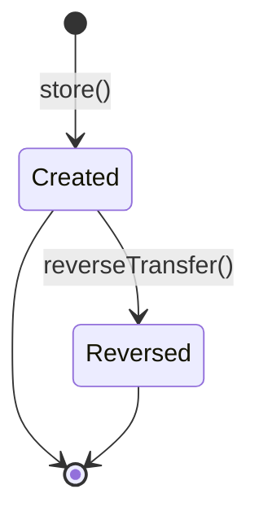

# Money Transfers

> **Module:** Accounting Transactions (SAFETY-CRITICAL)
> **Audience:** Engineers + AI assistants + **accountants** (must review before Canonical)
> **Status:** Draft — pending accountant sign-off
> **Last reviewed:** 2025-08-03
> **Source of truth:** this file + `laravel/app/Services/Accounting/MoneyTransferService.php` + `laravel/database/sql/06_payment_and_misc.sql` (money_transfers DDL) + `laravel/app/Models/Scopes/MoneyTransferBranchScope.php`

## 1. What is it?

A **money transfer** is the movement of cash between two stores of value inside the same
enterprise: cash drawer ↔ bank account, or bank account ↔ bank account. It is **not** a payment
to a third party — there is no customer, supplier, or employee counter-party. The transfer is
internal liquidity management.

Four transfer types are supported (DB CHECK constraint `06_payment_and_misc.sql:99`):

| Type | From | To | GL posted? |
|---|---|---|---|
| `cash_to_bank` | cash drawer (from_branch) | bank account (to_bank_id) | ✅ |
| `bank_to_cash` | bank account (from_bank_id) | cash drawer (from_branch) | ✅ |
| `bank_to_bank` | bank account (from_bank_id) | bank account (to_bank_id) | ✅ |
| `cash_to_cash` | cash drawer (from_branch) | cash drawer (to_branch) | ❌ — no GL, cash-ledger only |

The transfer is **single-step**: created → posted immediately. There is no draft / approval
workflow. Reversal (not edit) is the only correction path.

## 2. Why does it exist?

- Branch accountants routinely deposit yesterday's cash into the company bank, withdraw cash from
  the bank for petty-cash replenishment, or move funds between operating accounts. This module
  gives that operation a coded, audit-logged, GL-posted record.
- The `cash_to_cash` type exists for inter-branch cash movement (e.g. cashier at Branch A hands
  cash to Branch B's cashier) — the GL is unaffected because cash is the same asset class on both
  sides, but the per-branch cash ledger records the in/out for branch-level accountability.

## 3. When is it used?

- End-of-day cash deposit at the bank.
- Petty-cash top-up by bank withdrawal.
- Inter-bank fund sweep (operating account → payroll account).
- Inter-branch cash movement (`cash_to_cash`).

## 4. Who uses it?

- **Accountants** and **managers** create and reverse transfers (route middleware
  `role:accountant,manager,admin`).
- **Admins** can override branch scope (see §6 branch isolation).
- The system posts the GL automatically; the user never touches a journal line.

## 5. Related modules

- `journal-posting-rules.md` — the canonical `createJournalEntry` / `postJournalEntry` gateway and
  the Dr=Cr trigger. This file documents only the money-transfer-specific Dr/Cr matrix.
- `reversal-vs-cancellation.md` — the reversal principle. Money Transfer reverses via
  `JournalReversalService::reverseByJournalEntry`; the cash-ledger hard-DELETE divergence is
  documented in §12.
- `subledger-reconciliation.md` — the `cash_ledger` vs `bank_ledger` reconciliation that this module
  feeds.
- `chart-of-accounts.md` — the `cash_bank` ledger nature used as the generic fallback.
- `../security/branch-context-security.md` — `MoneyTransferBranchScope` (dual-branch pattern).

## 6. Business rules (the Core Rule)

- **MUST** record a `transfer_code` (unique, format `MT-YYYY-NNNNNN`) generated by
  `DocumentSequenceService`.
- **MUST** post a balanced GL entry for `cash_to_bank`, `bank_to_cash`, and `bank_to_bank` types
  via `JournalPostingService::postJournalEntry` with `reference_type='money_transfer'`.
- **MUST NOT** post a GL entry for `cash_to_cash` — the asset class is unchanged. Only the
  per-branch cash ledger is updated.
- **MUST** sync the `banks.balance` column on every bank-touching transfer (and undo it on
  reversal). The bank balance is the source of truth for the bank reconciliation.
- **MUST** write `cash_ledger` rows for cash-touching transfers (in/out per branch) so the cash
  reconciliation report can show every cash movement.
- **MUST** post an intercompany settlement entry (Dr `interbranch_receivable` at the receiving
  branch, Cr `interbranch_payable` at the sending branch) when `from_branch_id !== to_branch_id`.
  See §8.
- **MUST NOT** allow `bank_to_bank` with `from_bank_id === to_bank_id` (validated in
  `MoneyTransferService::validateCreateInput` L539-546).
- **MUST** reverse a transfer (not edit it) by calling `reverseTransfer`, which:
  1. Reverses the GL journal entry.
  2. Reverses the intercompany journal entry (if cross-branch).
  3. Undoes the bank balance sync.
  4. Removes the cash-ledger rows (see §12 GAP — currently a hard DELETE, not a soft reversal).
  5. Marks `money_transfers.is_reversed=true`.
- **MUST** enforce branch scope via `MoneyTransferBranchScope` — a user can see any transfer where
  their branch is the `from_branch_id` OR the `to_branch_id`. Admins bypass.

## 7. Technical implementation

### 7.1 The `money_transfers` table — `06_payment_and_misc.sql:89-112`

| Column | Type | Notes |
|---|---|---|
| `id` | `integer GENERATED ALWAYS AS IDENTITY PK` | |
| `transfer_code` | `varchar(30) NOT NULL UNIQUE` | `MT-YYYY-NNNNNN` |
| `transfer_date` | `date NOT NULL` | user-supplied (may be back-dated) |
| `from_branch_id` | `integer NOT NULL REFERENCES branches(id)` | RLS key |
| `to_branch_id` | `integer NOT NULL REFERENCES branches(id)` | RLS key |
| `transfer_type` | `varchar(20) NOT NULL CHECK IN (4 types)` | |
| `from_bank_id` | `integer REFERENCES banks(id)` | nullable for cash-to-X |
| `to_bank_id` | `integer REFERENCES banks(id)` | nullable for X-to-cash |
| `amount` | `numeric(14,2) NOT NULL DEFAULT 0` | |
| `journal_entry_id` | `integer REFERENCES journal_entries(id)` | the main GL entry |
| `intercompany_journal_entry_id` | `integer REFERENCES journal_entries(id)` | cross-branch only |
| `is_reversed`, `reversed_at`, `reversed_by`, `reverse_reason` | | reversal marker |
| `notes`, `created_by`, timestamps | | |

RLS: `07_views_triggers_constraints.sql:842-848` — `USING (from_branch_id = current_setting('app.branch_id')::int OR to_branch_id = current_setting('app.branch_id')::int)`. Admin policy bypasses. Financial-audit trigger attached at L452 (`trg_audit_money_transfers`).

### 7.2 The Dr/Cr matrix — `MoneyTransferService::postTransferGL` (L239-286)

```php
$cashBankLedgerId = $this->journalPosting->lookupLedgerByNature('cash_bank');
// ...null guard...
switch ($type) {
    case 'cash_to_bank':
        $destBankLedgerId = $this->resolveBankLedger((int)($data['to_bank_id'] ?? 0));
        $lines = [
            ['ledger_id' => $destBankLedgerId, 'debit' => $amount, 'credit' => 0],
            ['ledger_id' => $cashBankLedgerId,  'debit' => 0, 'credit' => $amount],
        ];
        break;
    case 'bank_to_cash':
        $srcBankLedgerId = $this->resolveBankLedger((int)($data['from_bank_id'] ?? 0));
        $lines = [
            ['ledger_id' => $cashBankLedgerId, 'debit' => $amount, 'credit' => 0],
            ['ledger_id' => $srcBankLedgerId,  'debit' => 0, 'credit' => $amount],
        ];
        break;
    case 'bank_to_bank':
        $destBankLedgerId = $this->resolveBankLedger((int)($data['to_bank_id'] ?? 0));
        $srcBankLedgerId  = $this->resolveBankLedger((int)($data['from_bank_id'] ?? 0));
        $lines = [
            ['ledger_id' => $destBankLedgerId, 'debit' => $amount, 'credit' => 0],
            ['ledger_id' => $srcBankLedgerId,  'debit' => 0, 'credit' => $amount],
        ];
        break;
}
return $this->journalPosting->postJournalEntry([
    'reference_type' => 'money_transfer',
    'reference_id'   => $transferId,
    'branch_id'      => $branchId,
    'description'    => "Money Transfer — " . str_replace('_', ' ', ucfirst($type)),
    'lines'          => $lines,
    'created_by'     => $data['created_by'] ?? null,
]);
```

| Type | Dr | Cr |
|---|---|---|
| `cash_to_bank` | destination bank ledger | `cash_bank` nature |
| `bank_to_cash` | `cash_bank` nature | source bank ledger |
| `bank_to_bank` | destination bank ledger | source bank ledger |
| `cash_to_cash` | — | — (no GL) |

### 7.3 Bank ledger resolution — `resolveBankLedger` (L484-498)

Resolves the GL ledger for a `bank_id` via the `bank_ledger_mappings` table. **Falls back
silently to the `cash_bank` nature ledger** if no mapping exists. This means an unconfigured bank
collides with the generic cash pool — bank reconciliation will not be able to separate the two.
**MUST** configure `bank_ledger_mappings` for every operating bank before relying on per-bank
reconciliation.

### 7.4 Cash-ledger rows — direct `DB::table('cash_ledger')->insert(...)`

MoneyTransfer writes cash-ledger rows directly (L359, 374, 389, 401) — it does **not** use
`SubLedgerService::postCashLedgerEntry()`. The `balance` column is hardcoded to `0` (no running
balance maintained). The cash-ledger is a movement log, not a balance register; running balances
are derived (see `running-balance.md`).

`reference_type` on cash-ledger rows = `'money_transfer'`, `reference_id` = the transfer id.
Direction: `money_transfer_out` on the from-branch, `money_transfer_in` on the to-branch.

## 8. Intercompany settlement — canonical two-JE pattern

> ✅ **G-012 + G-344 RESOLVED in commit `5905123` (FINANCE-3)** — `postIntercompanySettlement`
> rewritten to mirror the canonical Employee/Supplier/CustomerPayment intercompany pattern (two-JE
> pair using `interbranch_receivable` + `interbranch_payable` natures + a `branch_ledger`
> obligation row). The previous single-JE `'intercompany'` ledger nature (two lines on one JE,
> unregistered nature, parallel GL system with no reconciliation) is gone.

For `from_branch_id !== to_branch_id`, `postIntercompanySettlement` (L470-589) now posts **two**
balanced JEs + a `branch_ledger` row:

**Creditor journal** (at `to_branch_id` — the branch receiving money):
```
Dr interbranch_receivable (L-0105)  = amount
Cr cash_bank                        = amount
```

**Debtor journal** (at `from_branch_id` — the branch sending money):
```
Dr cash_bank                        = amount
Cr interbranch_payable (L-0303)     = amount
```

**Branch ledger obligation row**:
```
from_branch_id = debtor (sender), to_branch_id = creditor (receiver),
debit = amount, credit = 0, reference_type = 'money_transfer',
reference_id = transferId, journal_entry_id = debtorJeId
```

Returns the debtor JE id (stored on `money_transfers.intercompany_journal_entry_id`).

Reference type preserved as `money_transfer_intercompany` for audit-trail continuity. Direction:
`from_branch_id` = debtor (sender), `to_branch_id` = creditor (receiver). The two parallel
intercompany GL systems are consolidated into one — the `branch_ledger` running balance now
reconciles with the GL intercompany postings because both write to the same ledger pair.

> ✅ **G-013 (money-transfer side) RESOLVED in commit `5905123` (FINANCE-3)** —
> `createTransfer` now calls `BranchIntercompanyService::settleFromMoneyTransfer` AFTER the parent
> commit (non-blocking try/catch + Log::warning). FIFO-settles open branch demands from the
> transfer amount. `reverseTransfer` calls `reverseMoneyTransferSettlements` after commit
> (non-blocking). The `branch_demand_money_transfer_settlements` table + the `fifoSettleDemands`
> method are no longer dead code.

## 9. Workflow / state machine



There is **no** draft / pending / approved state. The transfer posts to GL immediately on `store()`.
Reversal is the only post-creation mutation; the reversal marker columns
(`is_reversed`, `reversed_at`, `reversed_by`, `reverse_reason`) are the only fields that change
after creation.

## 10. Validation & input rules

`StoreMoneyTransferRequest.php:38-50`:

```php
return [
    'transfer_type'  => ['required', 'in:cash_to_bank,bank_to_cash,cash_to_cash,bank_to_bank'],
    'from_branch_id' => ['required', 'integer', 'exists:branches,id'],
    'to_branch_id'   => ['required', 'integer', 'exists:branches,id'],
    'from_bank_id'   => ['nullable', 'integer', 'exists:banks,id'],
    'to_bank_id'     => ['nullable', 'integer', 'exists:banks,id'],
    'amount'         => ['required', 'numeric', 'min:0.01'],
    'transfer_date'  => ['required', 'date'],
    'notes'          => ['nullable', 'string', 'max:500'],
];
```

Service-level `validateCreateInput` (L539-546) additionally:
- Rejects `bank_to_bank` with `from_bank_id === to_bank_id`.
- Throws if `amount < 0.01`.
- Requires `from_bank_id` for `bank_to_*` and `to_bank_id` for `*_to_bank` (implicit, via
  `resolveBankLedger` returning null and the subsequent RuntimeException).

`authorize()` returns `true` — RBAC is enforced by the route middleware (`role:accountant,manager,admin`
+ `branch.isolation`).

## 11. Reversal & correction flow

`reverseTransfer` (L123-181) — runs in a `DB::transaction`:

1. `lockForUpdate()` the transfer row.
2. Reject if `is_reversed=true` already.
3. `JournalReversalService::reverseByJournalEntry` on `journal_entry_id` — cascades to GL lines
   (swap Dr/Cr) + marks original `is_reversed=true`.
4. If `intercompany_journal_entry_id` is set, reverse it the same way.
5. `syncBankBalances(..., undo: true)` — undoes the `banks.balance` increment/decrement.
6. `reverseCashLedger($transferId)` — see §12 GAP: hard-DELETEs the cash-ledger rows instead of
   marking them reversed.
7. Update `money_transfers` row: `is_reversed=true`, `reversed_at=now()`, `reversed_by`,
   `reverse_reason`.
8. Audit log (`money_transfer_reversed` action via `UserAuditLogger`).

```mermaid
sequenceDiagram
    participant U as User (accountant)
    participant C as MoneyTransferController
    participant S as MoneyTransferService
    participant JR as JournalReversalService
    participant JP as JournalPostingService
    participant DB as PostgreSQL

    U->>C: POST /admin/money-transfers/{id}/reverse {reason}
    C->>S: reverseTransfer(id, userId, reason)
    S->>DB: BEGIN; SELECT ... FOR UPDATE
    S->>JR: reverseByJournalEntry(journal_entry_id, userId, reason)
    JR->>JP: reverseJournalEntry(jeId, userId, reason)
    JP->>DB: INSERT journal_entries (reversal, Dr/Cr swapped)
    JP->>DB: UPDATE journal_entries SET is_reversed=true WHERE id=original
    JR->>DB: reverse sub-ledger rows (none for money_transfer — cash_ledger is direct)
    S->>DB: UPDATE banks SET balance = balance ± amount (undo)
    S->>DB: DELETE FROM cash_ledger WHERE reference_id=transferId  ⚠️ GAP
    S->>DB: UPDATE money_transfers SET is_reversed=true, reversed_at, reversed_by, reverse_reason
    S->>DB: COMMIT
    S-->>C: MoneyTransfer (reversed)
    C-->>U: redirect with success
```

## 12. Open questions / known gaps

1. **`cash_ledger` hard-DELETE on reversal** (L423-430, `reverseCashLedger`). The cash-ledger rows
   are physically deleted when the transfer is reversed. This violates the reversal-not-mutation
   principle (`reversal-vs-cancellation.md`). The `cash_ledger` table also has **no** `is_reversed`
   column (deliberate, per `07_views_triggers_constraints.sql:468-471` comment). Recommended fix:
   add an `is_reversed` column and UPDATE it, or post a counter-entry. **Accountant must confirm
   whether the cash-ledger history is needed for audit.**
2. **`'intercompany'` nature not registered** — ✅ RESOLVED in `5905123`/FINANCE-3. The
   `postIntercompanySettlement` method no longer references the `'intercompany'` nature at all.
   It now uses the registered `interbranch_receivable` (L-0105) + `interbranch_payable` (L-0303)
   pair, matching Employee/Supplier/CustomerPayment. Cross-branch money transfers now post the
   full two-JE intercompany pair + a `branch_ledger` obligation row. The interbranch obligation
   is visible on the trial balance and reconciles with `branch_ledger`. See §8.
3. **`entry_date` not propagated to GL.** `postTransferGL` calls `postJournalEntry` **without**
   setting `entry_date`. `createJournalEntry` defaults it to `now()->format('Y-m-d')`
   (JournalPostingService.php:104). A back-dated `transfer_date` on `money_transfers` does **not**
   propagate to `journal_entries.entry_date`. The GL shows the transfer in today's period; the
   transfer record shows it in the back-dated period. **Period reconciliation will be off.**
4. **Bank balance has no audit trigger.** `banks.balance` is updated by raw
   `increment('balance', $amount)` / `DB::raw("GREATEST(0, balance + {$delta})")`. The `banks` table
   is **not** in the `financial_audit_log` hash chain. Bank-book changes are auditable only via the
   money-transfer row that caused them, not directly. See `financial-audit-log.md` §13.
5. **No `MoneyTransferPolicy`.** RBAC is enforced by route middleware only. There is no per-action
   policy class — compare to `EmployeeTransactionPolicy`, `SupplierTransactionPolicy`,
   `CustomerPaymentPolicy`, `ManualJournalPolicy` which all exist.

## 13. Accountant review checklist

> **This is a SAFETY-CRITICAL document.** Before marking it Canonical, an accountant with
> production credentials MUST review and sign off on each item below.

- [ ] The Dr/Cr matrix in §7.2 matches the actual movement of cash for each of the 4 types.
- [ ] The `cash_to_cash` no-GL rule is acceptable (cash asset class unchanged).
- [ ] The intercompany two-JE pattern in §8 — ✅ RESOLVED in `5905123`/FINANCE-3 (now uses the canonical two-JE `interbranch_receivable` + `interbranch_payable` pair + `branch_ledger` row, matching Employee/Supplier/CustomerPayment). Confirm the pattern matches the org's intercompany accounting policy.
- [ ] The `'intercompany'` ledger nature gap (§12 #2) — ✅ RESOLVED in `5905123`/FINANCE-3. The service now uses `interbranch_receivable` / `interbranch_payable` (registered natures, seeded L-0105 / L-0303). The unregistered `'intercompany'` nature is no longer referenced.
- [ ] The `entry_date` non-propagation gap (§12 #3) — is the historical GL distortion material?
- [ ] The `cash_ledger` hard-DELETE on reversal (§12 #1) — is the cash-ledger history needed for
      audit? If yes, recommend the fix.
- [ ] The bank-balance audit gap (§12 #4) — is the indirect audit (via the money_transfer row)
      sufficient, or should `banks` join the hash chain?
- [ ] The reversal reason minimum length (currently none) — should a minimum be enforced?
