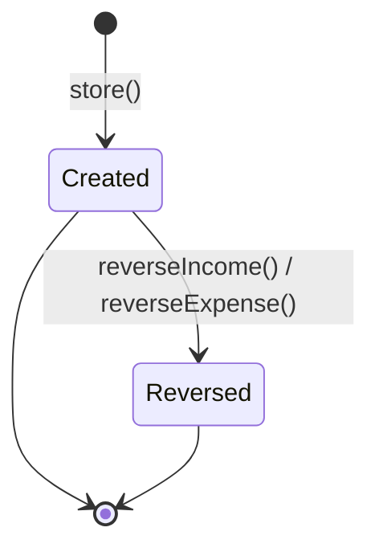

# Other Income / Expense

> **Module:** Accounting Transactions (SAFETY-CRITICAL)
> **Audience:** Engineers + AI assistants + **accountants** (must review before Canonical)
> **Status:** Draft — pending accountant sign-off
> **Last reviewed:** 2025-08-03
> **Source of truth:** this file + `laravel/app/Services/Accounting/OtherIncomeService.php` + `laravel/app/Services/Accounting/OtherExpenseService.php` + `laravel/database/sql/06_payment_and_misc.sql` (other_incomes + other_expenses DDL)

## 1. What is it?

**Other Income** and **Other Expense** are the catch-all modules for non-operational cash
movements that don't fit the customer-payment / supplier-payment / employee-transaction / payroll
flows: rent received, interest earned, utility bills paid, office supplies purchased, repairs,
donations, bank charges, etc.

The two modules are near-perfect mirrors — same schema, same service shape, same lifecycle, with
Dr/Cr swapped. They are documented together in this file because the patterns are identical and
the divergences are minimal.

Neither module has a sub-ledger (there is no per-entity "other income ledger" — the GL ledger
itself is the only record). Neither module posts intercompany settlement.

## 2. Why does it exist?

- The operational modules (Sales, Purchase, Employee, Money Transfer) cover the high-volume flows.
  Accountants need a low-friction way to book the long tail of miscellaneous cash movements
  without fabricating a fake customer/supplier/employee.
- Letting the accountant pick any GL ledger (Income or Expense `account_type`) per transaction
  gives full chart-of-accounts flexibility — no rigid category enum to maintain.
- The `income_type` / `expense_type` free-text column lets the user tag a human-readable category
  (e.g. "Rent", "Electricity") for filtering and reporting, without coupling it to a GL account.

## 3. When is it used?

- **Other Income:** rent received, interest credited by bank, commission earned from a third
  party, scrap sale, insurance claim received.
- **Other Expense:** utility bills, office supplies, repairs & maintenance, professional fees,
  bank charges, donations, fines, travel expenses.

## 4. Who uses it?

- **Accountants** and **managers** create and reverse (route middleware
  `role:accountant,manager,admin`). Salesmen are excluded (unlike Customer Payment).
- **Admins** can override branch scope.
- ⚠️ **No Policy class** exists for either module — RBAC is enforced by route middleware only.
  Compare to Employee/Supplier/Customer/ManualJournal which all have Policy classes.

## 5. Related modules

- `journal-posting-rules.md` — the `postJournalEntry` gateway and Dr=Cr trigger. This file
  documents only the income/expense-specific Dr/Cr matrix.
- `reversal-vs-cancellation.md` — the reversal principle. Both modules reverse via
  `JournalReversalService::reverseByJournalEntry`.
- `chart-of-accounts.md` — the Income and Expense `account_type` ledgers the user picks from.
- `money-transfers.md` — same direct-write to `banks.balance` (no audit trigger on `banks`).
- `manual-journals.md` — for complex multi-line income/expense bookings that don't fit the
  single-ledger-per-side pattern here.

## 6. Business rules (the Core Rule)

- **MUST** record a unique code (`income_code` / `expense_code`, format `OI-YYYY-NNNNNN` /
  `OE-YYYY-NNNNNN`) via `DocumentSequenceService`.
- **MUST** post a balanced GL entry via `JournalPostingService::postJournalEntry` for every
  transaction with `amount >= 0.01`. `reference_type='other_income'` or `'other_expense'`.
- **MUST** sync `banks.balance` for bank-mode transactions. Cash-mode transactions do not touch
  the bank.
- **MUST** let the user pick any Income `account_type` ledger (for income) or Expense
  `account_type` ledger (for expense) as the offsetting side. If no `ledger_id` is provided, fall
  back to the `other_income` nature (income) or `operating_expense` nature (expense).
- **MUST** reverse (not edit) by calling `reverseIncome` / `reverseExpense`, which cascades to GL
  and bank balance undo.
- **MUST** enforce branch scope via `BranchScope` + `branch.isolation` middleware.
- **MUST NOT** require a sub-ledger — there is no "other income ledger" sub-ledger. The GL ledger
  is the only record.
- **MUST NOT** post intercompany settlement. If an accountant at Branch A uses Branch B's bank to
  record other income/expense, the bank-ledger control account reconciles to the bank book but
  the interbranch obligation is NOT tracked. See §12 #4.

## 7. Technical implementation

### 7.1 The `other_incomes` table — `06_payment_and_misc.sql:115-133`

| Column | Type | Notes |
|---|---|---|
| `id` | PK | |
| `income_code` | `varchar(30) UNIQUE` | `OI-YYYY-NNNNNN` |
| `income_date` | `date NOT NULL` | |
| `branch_id` | FK branches | RLS key |
| `bank_id` | FK banks (nullable) | required if payment_mode='bank' |
| `payment_mode` | `varchar(20)` | added by migration `2026_08_05_000001` — ⚠️ NO CHECK |
| `income_type` | `varchar(50)` | free text — ⚠️ NO CHECK / NO enum |
| `amount` | `numeric(14,2)` | |
| `description` | text | |
| `journal_entry_id` | FK journal_entries | |
| `is_reversed`, `reversed_at`, `reversed_by`, `reverse_reason` | | |
| `created_by`, timestamps | | |

RLS: `07_views_triggers_constraints.sql:797-803`. Financial-audit trigger at L454
(`trg_audit_other_incomes`).

### 7.2 The `other_expenses` table — `06_payment_and_misc.sql:136-155`

Mirror of `other_incomes` with `expense_code` / `expense_date` / `expense_type`. RLS at L805-811.
Audit trigger at L455 (`trg_audit_other_expenses`).

### 7.3 The Dr/Cr matrix

**Other Income** — `OtherIncomeService::postIncomeGL` (L257-294):

```php
return $this->journalPosting->postJournalEntry([
    'entry_date'     => $income->income_date ?? now()->format('Y-m-d'),
    'description'    => $description,
    'source'         => 'other_income',
    'reference_type' => 'other_income',
    'reference_id'   => $income->id,
    'branch_id'      => $income->branch_id,
    'lines'          => [
        ['ledger_id' => $debitLedgerId,  'debit' => $amount, 'credit' => 0, 'memo' => 'Cash/Bank received'],
        ['ledger_id' => $creditLedgerId, 'debit' => 0, 'credit' => $amount, 'memo' => $incomeType],
    ],
    'created_by'     => $createdBy,
]);
```

| Module | Dr | Cr |
|---|---|---|
| Other Income | bank-ledger or `cash_bank` | user-selected Income ledger (or `other_income` fallback) |
| Other Expense | user-selected Expense ledger (or `operating_expense` fallback) | bank-ledger or `cash_bank` |

- **`$debitLedgerId` (income) / `$creditLedgerId` (expense)** — resolved via
  `resolveBankLedger` (bank-ledger mapping → `cash_bank` nature fallback).
- **`$creditLedgerId` (income) / `$debitLedgerId` (expense)** — the user-selected GL ledger. If
  not provided, falls back to `other_income` nature (income) or `operating_expense` nature
  (expense).

### 7.4 Bank ledger resolution — `resolveBankLedger`

Same as Money Transfer §7.3: resolves the GL ledger for a `bank_id` via the
`bank_ledger_mappings` table, falls back silently to `cash_bank` nature if no mapping exists.

## 8. Intercompany settlement — NONE

⚠️ Other Income / Other Expense **never** post intercompany settlement. If an accountant at
Branch A uses Branch B's bank to record other income/expense, the bank-ledger control account
reconciles to the bank book but the interbranch obligation is NOT tracked. The trial balance will
show the income/expense at Branch A and the bank movement at Branch B's bank-ledger, with no
clearing entry.

**Recommended fix:** add `postIntercompanySettlement` mirroring the Employee/Supplier pattern
(two JEs with `interbranch_receivable` / `interbranch_payable`, `branch_ledger` obligation row,
`reference_type='other_income_intercompany'` / `'other_expense_intercompany'`). Or document that
cross-branch bank usage is prohibited for other income/expense (enforce in the request
validation).

## 9. Workflow / state machine



No draft / approval workflow. Single-step create → reverse. State tracked by `is_reversed`
boolean only.

## 10. Validation & input rules

⚠️ **No dedicated FormRequest classes** — validation is inline in the controllers
(`OtherIncomeController::store`, `OtherExpenseController::store`).

Service-level `validateCreateInput` (OtherIncomeService L362-382 / OtherExpenseService L362-382):

- `amount >= 0.01`.
- `bank_id` required if `payment_mode='bank'`.
- `ledger_id` recommended (or fallback to `other_income` / `operating_expense` nature if not
  configured).

The `payment_mode` column (added by migration `2026_08_05_000001`) has **NO CHECK constraint** —
any string is accepted. The migration comment says "cash, bank, mobile_banking, cheque" but the
database does not enforce it. **Recommended:** add a CHECK constraint matching the other modules.

The `income_type` / `expense_type` column is free-text `varchar(50)` — no enum, no CHECK. The
index page filters by exact-match `where('income_type', $t)` (L185), so typos create phantom
categories that don't aggregate. **Recommended:** either add a CHECK / enum, or use a separate
`income_categories` lookup table.

## 11. Reversal & correction flow

`OtherIncomeService::reverseIncome` (L117-170) and `OtherExpenseService::reverseExpense`
(L117-170) — identical pattern, runs in a `DB::transaction`:

1. `lockForUpdate()` the row.
2. Reject if `is_reversed=true`.
3. `JournalReversalService::reverseByJournalEntry(journal_entry_id)` — cascades to GL lines.
4. Undo bank balance sync (only if `isBankMode()`).
5. Mark `is_reversed=true`, `reversed_at`, `reversed_by`, `reverse_reason`.
6. Audit log.

There is no sub-ledger to reverse. There are no allocations to restore. The reversal is the
simplest of the 7 modules.

```mermaid
sequenceDiagram
    participant U as User (accountant)
    participant C as OtherIncomeController
    participant S as OtherIncomeService
    participant JR as JournalReversalService
    participant JP as JournalPostingService
    participant DB as PostgreSQL

    U->>C: POST /admin/other-incomes/{id}/reverse {reason}
    C->>S: reverseIncome(id, userId, reason)
    S->>DB: BEGIN; SELECT ... FOR UPDATE
    S->>JR: reverseByJournalEntry(journal_entry_id)
    JR->>JP: reverseJournalEntry (swap Dr/Cr)
    JP->>DB: INSERT reversal journal_entries + lines
    JP->>DB: UPDATE original journal_entries SET is_reversed=true
    S->>DB: UPDATE banks SET balance = balance ± amount (undo, if bank mode)
    S->>DB: UPDATE other_incomes SET is_reversed=true
    S->>DB: COMMIT
    S-->>C: OtherIncome (reversed)
    C-->>U: redirect with success
```

## 12. Open questions / known gaps

1. **No transaction_type enum / CHECK on `income_type` / `expense_type`.** The columns are free
   text. No category-based GL routing. The user manually picks the GL ledger each time. The
   `income_type` / `expense_type` is purely descriptive. **Recommended:** either add a CHECK / enum
   for the common categories, or use a `income_categories` / `expense_categories` lookup table
   with FK.
2. **No approval threshold.** Any accountant can post any amount with no manager approval. No
   `approval_required_above` config flag. Compare to Manual Journal which has maker-checker
   (accountant submits → manager/admin approves). **Recommended:** add an approval threshold for
   large other-income/expense bookings (configurable in `config/accounting.php`).
3. **No voucher / attachment required.** `description` is nullable, no file upload. For audit
   compliance (especially for tax-deductible expenses), a voucher or invoice attachment is usually
   required. **Recommended:** add an `attachments` polymorphic relation or a dedicated
   `other_expense_attachments` table.
4. **No intercompany settlement** (§8). Cross-branch bank usage breaks the trial balance. Either
   implement the two-JE pattern or prohibit cross-branch bank usage in validation.
5. **`payment_mode` has no CHECK constraint** (§10). Any string is accepted. **Recommended:** add
   `CHECK (payment_mode IN ('cash','bank','mobile_banking','cheque','adjustment'))` matching the
   other modules.
6. **No Policy class** (§4). RBAC is enforced by route middleware only. Compare to
   Employee/Supplier/Customer/ManualJournal which all have Policy classes. **Recommended:** add
   `OtherIncomePolicy` / `OtherExpensePolicy` for per-action granularity (e.g.Only the creator
   can reverse within 24h; after that, manager only).
7. **Bank balance has no audit trigger** (same as all 7 modules — see `money-transfers.md` §12
   #4). The `banks.balance` column is updated by raw `increment` / `DB::raw("GREATEST(0, balance +
   {$delta})")`. The `banks` table is not in the `financial_audit_log` hash chain.
8. **No sub-ledger.** This is by design (there is no per-entity "other income ledger"), but it
   means the only reconciliation is the GL bank-ledger control account vs the bank book. There is
   no per-category income/expense sub-ledger to reconcile against.
9. **`income_date` / `expense_date` may be null in the request** (nullable validation). Service
   falls back to today. The GL `entry_date` IS propagated correctly (unlike Money Transfer — §7.3
   here passes `entry_date`).

## 13. Accountant review checklist

> **This is a SAFETY-CRITICAL document.** Before marking it Canonical, an accountant with
> production credentials MUST review and sign off on each item below.

- [ ] The Dr/Cr matrix in §7.3 matches the actual treatment for income and expense.
- [ ] The fallback chain (income → `other_income` nature; expense → `operating_expense` nature)
      is acceptable when the user doesn't pick a specific ledger.
- [ ] The lack of category enum (§12 #1) — is the free-text `income_type` / `expense_type`
      acceptable, or should a lookup table be added?
- [ ] The lack of approval threshold (§12 #2) — should large other-income/expense bookings
      require manager approval?
- [ ] The lack of voucher / attachment (§12 #3) — is this acceptable for tax compliance?
- [ ] The lack of intercompany settlement (§8) — should cross-branch bank usage be prohibited, or
      should the two-JE pattern be implemented?
- [ ] The lack of Policy class (§12 #6) — is route-middleware-only RBAC acceptable, or should
      per-action policies be added?
- [ ] The bank-balance audit gap (§12 #7) — is the indirect audit (via the other_income /
      other_expense row that caused the bank movement) sufficient?
- [ ] The reversal cascade (§11) correctly undoes the GL and bank balance in the right order.
- [ ] The `income_date` / `expense_date` nullable default (§12 #9) — should it be required?
