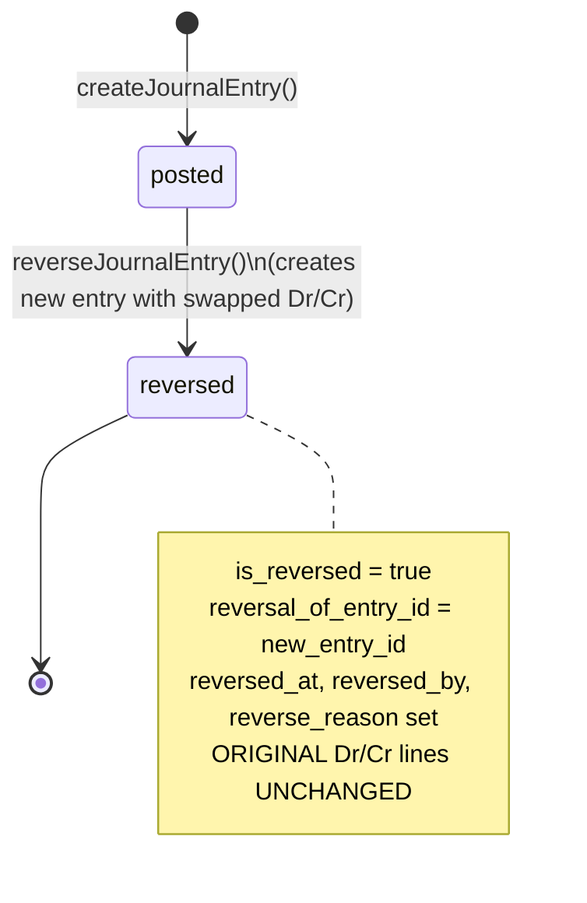
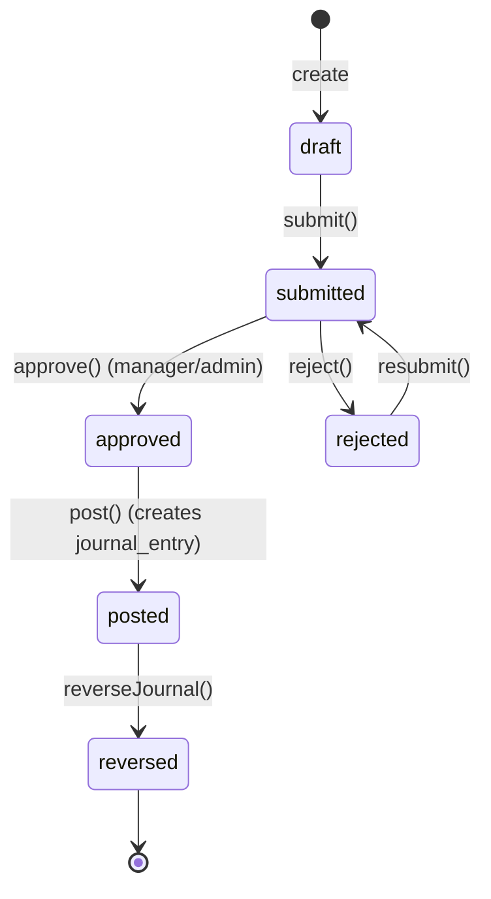
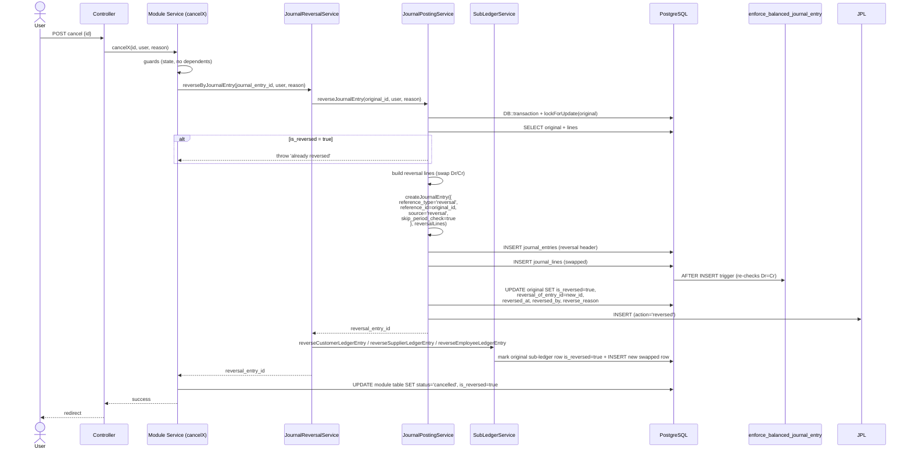
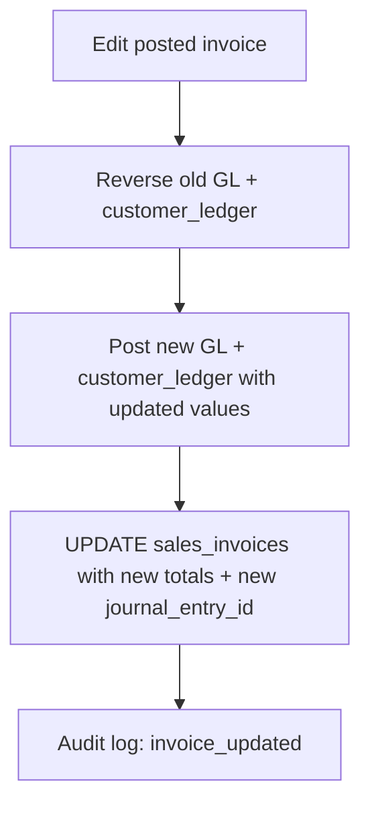

# Reversal vs Cancellation

> **Module:** Accounting (SAFETY-CRITICAL)
> **Audience:** Engineers + AI assistants + **accountants** (must review before Canonical)
> **Status:** Draft — pending accountant sign-off
> **Last reviewed:** 2025-08-03
> **Source of truth:** this file + `laravel/app/Services/Accounting/JournalPostingService.php` (`reverseJournalEntry`) + `laravel/app/Services/Accounting/JournalReversalService.php`

## 1. What is it?

The **reversal principle**: once a journal entry is posted, it is **never mutated and never
deleted**. To undo a posting, the system creates a **new journal entry with swapped Dr/Cr** that
exactly cancels the original's financial effect. The original is marked `is_reversed = true` and
linked to the new reversal entry via `reversal_of_entry_id`. The original Dr/Cr lines stay intact
forever, preserving the complete audit trail. "Cancellation" in the UI is a higher-level concept
(e.g. cancelling a sales invoice) that **triggers** a reversal under the hood — there is no
separate hard-delete path.

## 2. Why does it exist?

- **Audit integrity:** if posted entries could be edited or deleted, the financial history would
  be unreliable. Reversals keep every movement visible — you can always see "we posted X, then
  reversed it because Y".
- **Dr=Cr preservation:** the balanced-journal trigger (`enforce_balanced_journal_entry()`)
  enforces Dr=Cr on every insert/update. Mutating an existing entry's lines would require
  re-balancing in place, which is error-prone. A reversal entry is a fresh balanced entry.
- **Sub-ledger consistency:** each sub-ledger row is linked to a `journal_entry_id`. Reversing
  via a new entry means a new sub-ledger row (with swapped Dr/Cr), keeping the per-entity running
  balance correct without rewriting history.
- **Period integrity:** a reversal can post to a *different* date than the original (e.g. reverse
  a January invoice in March), and it bypasses the period-close check (`skip_period_check = true`)
  because it's corrective, not a new business posting.

## 3. When is it used?

- **On every "cancel" action** in the UI — cancelling a sales invoice, customer payment, money
  transfer, stock adjustment, damage, GRN, purchase return, manual journal, etc. Each calls
  `reverseJournalEntry` under the hood.
- **On "edit" of a posted transaction** — some modules (e.g. `SalesInvoiceService::updateInvoice`)
  reverse the old GL + sub-ledger and post the new. (Reversal-as-edit pattern.)
- **On year-end close** — Income/Expense ledgers are zeroed via reversal-style entries (though
  these use a dedicated `year_end_close` reference_type, not the generic reversal path).
- **On consolidation reversal** — `reverseConsolidation` reverses each elimination entry.

## 4. Who uses it?

- **All operational roles** trigger reversals via cancel/edit actions (the reversal itself is
  invisible to them).
- **Accountants** review reversal entries in the journal and audit logs.
- **System/automated:** the `reversal:verify` command confirms reversals net to zero.

## 5. Related modules

- `journal-posting-rules.md` — the `reverseJournalEntry` method + Dr=Cr trigger.
- `subledger-reconciliation.md` — reversed sub-ledger rows are excluded from balances.
- `financial-audit-log.md` — every reversal is captured by the immutable audit trigger.
- `fiscal-year-period-close.md` — reversals bypass the period-close check.
- `../business/business-rules-catalog.md` — Rule 2 (Reversal, never mutation).

## 6. Business rules

- **MUST** create a **new journal entry with swapped Dr/Cr** to reverse a posting. Never UPDATE
  the original lines' debit/credit values.
- **MUST** mark the original `is_reversed = true` and set `reversal_of_entry_id`,
  `reversed_at`, `reversed_by`, `reverse_reason`.
- **MUST** set `skip_period_check = true` on the reversal entry (reversals can post to closed
  periods — they're corrective).
- **MUST** set `reference_type = 'reversal'` and `reference_id = original_id` on the reversal
  entry.
- **MUST** reverse the corresponding **sub-ledger row** too (dual-write): call
  `SubLedgerService::reverseCustomerLedgerEntry` etc. alongside the GL reversal.
- **MUST** throw if the original is already reversed (`is_reversed = true`).
- **MUST NOT** hard-DELETE journal entries or journal lines. (Exception: `cash_ledger` — see §12.)
- **MUST NOT** support partial reversals. `reverseJournalEntry` swaps ALL lines of the original.
- **SHOULD NOT** reverse a reversal entry (reversal-of-reversal). Technically possible but
  semantically confusing — see §12.

## 7. Technical implementation

### 7.1 The reversal principle — confirmed from code

`JournalPostingService::reverseJournalEntry()` (lines 169-246): the original is **NEVER mutated**
except for the `is_reversed / reversal_of_entry_id / reversed_at / reversed_by / reverse_reason`
columns. The original Dr/Cr lines stay intact. A NEW journal entry is created with swapped Dr/Cr
via `createJournalEntry(['skip_period_check' => true, 'reference_type' => 'reversal',
'reference_id' => $original->id, 'source' => 'reversal'], $reversalLines)`.

Verbatim swap code (lines 193-202):

```php
$reversalLines = $originalLines->map(function ($line) {
    return [
        'ledger_id' => $line->ledger_id,
        'debit' => (float) $line->credit,    // SWAPPED
        'credit' => (float) $line->debit,    // SWAPPED
        'entity_type' => $line->entity_type,
        'entity_id' => $line->entity_id,
        'memo' => 'Reversal: ' . ($line->memo ?? ''),
    ];
})->toArray();
```

### 7.2 Reversal state machine — `journal_entries.is_reversed` boolean

There is **no separate `status` column on `journal_entries`** — the state is the `is_reversed
boolean` (default `false`).



**Cannot** cancel/delete a posted JE — there is no `cancel()` or `delete()` method. The only
mutation allowed on a posted JE's lines is the reversal marker columns.

### 7.3 Manual journal lifecycle (wider state machine)

For `manual_journals` (separate `status` column), the lifecycle is wider
(`app/Models/ManualJournal.php:52`):



States: `draft, submitted, approved, posted, reversed, rejected` — DB CHECK at
`02_accounting.sql:291` only lists `draft, posted, rejected`; the wider 6-state enum is enforced
by application code + later migration `2026_08_10_000001_create_approval_workflow_engine.php`.

### 7.4 Reversal linking

Linkage column: `journal_entries.reversal_of_entry_id` (integer, nullable). Set on the
**ORIGINAL** entry after reversal, pointing to the **NEW** reversal entry. The reversal entry has
`reference_type='reversal'`, `reference_id=original_id`, `source='reversal'`.

> **Naming gotcha:** `reversal_of_entry_id` lives on the ORIGINAL (not the reversal). The
> reversal entry has no column pointing back — the back-link is via `reference_id` (which equals
> the original's id) or by querying "which entry has `reversal_of_entry_id = my_id`".

Verification via `v_journal_entry_summary` MV (which exposes `is_reversed`) or
`JournalReversalService::verifyReversalNetsToZero($originalEntryId)` which JOINs on
`reversal_of_entry_id`.

### 7.5 Per-module reversal rules

| Module | Cancel/reverse method | File:line | Reversal mechanism |
|---|---|---|---|
| Sales Invoice | `cancelInvoice` | `SalesInvoiceService.php:370` | Only draft invoices. Calls `JournalReversalService::reverseByJournalEntry()` on `journal_entry_id`. Sets `sales_invoices.status='cancelled'`, `is_reversed=true`. Guards: no active challan, no payments. |
| Sales Invoice (edit) | `updateInvoice` | `SalesInvoiceService.php:458` | Reverses old GL + customer_ledger, posts new. (Reversal-as-edit pattern.) |
| Customer Payment | `cancelPayment` | `CustomerPaymentService.php:260` | Calls `JournalReversalService::reverseByJournalEntry()` on both `journal_entry_id` AND `intercompany_journal_entry_id`. Reverses invoice allocations. Undoes bank balance sync. |
| Sales Return | `reverseReturn` | `SalesReturnService.php:298` | Reverses both revenue-reversal JE and COGS-reversal JE via `JournalReversalService`. |
| Sales Challan | (cancel Challan) | `SalesChallanService.php` | Reverses COGS JE + reverses stock_transactions. |
| Stock Adjustment | `cancelAdjustment` | `StockAdjustmentService.php:691` | If `wasConfirmed`: calls `JournalPostingService::reverseJournalEntry($jeId, $by, $reason, $reversalDate)` (passes `adjustment_date` as `$entryDate` for back-dated reversal — Phase 6.3 G10 fix). Also reverses each `stock_transaction` via `StockService::reverseTransaction`. |
| Damage | `cancelDamage` | `DamageService.php:407` | Reverses GL + stock. |
| Stock Take | `cancelSession` | `StockTakeService.php:2109` | **Draft/counting only — NO GL reversal** (nothing was applied). Sets `status='cancelled'`. Throws if posted. |
| Stock Take | `reverseSession` | `StockTakeService.php:2193` | **For posted sessions only.** Reverses GL via `reverseJournalEntry` + reverses each stock_transaction. Sets `status='reversed'` + `is_reversed=true` + `reversal_of_entry_id` on the session row. |
| Purchase Receive (GRN) | `cancelReceive` | `PurchaseReceiveService.php:269` | Reverses GL + stock + supplier_ledger. |
| Purchase Return | `cancelReturn` | `PurchaseReturnService.php:273` | Reverses GL + stock + supplier_ledger. |
| Money Transfer | `reverseTransfer` | `MoneyTransferService.php:123` | Reverses GL + bank balance sync + cash_ledger (**HARD DELETE** — inconsistent with append-only pattern; see §12). |
| Manual Journal | `reverseJournal` | `ManualJournalService.php:219` | Calls `JournalReversalService::reverseByJournalEntry()`. Sets `manual_journals.status='reversed'`, `reversed_at`, `reversed_by`, `reverse_reason`. Requires reason min 3 chars. |
| Fixed Asset Depreciation | `reverseDepreciation` | `DepreciationService.php:421` | Calls `journalService::reverseJournalEntry()`. Restores asset's `accumulated_depreciation` and `net_book_value`. |
| Branch Demand | `reverseDemandFulfillment` | `BranchIntercompanyService.php:340-355` | Reverses BOTH creditor JE and debtor JE via `reverseJournalEntry`. |
| Consolidation | `reverseConsolidation` | `ConsolidationService.php:408` | Reverses each elimination JE. |

### 7.6 The "reversal-not-cancellation" guard (gap)

**NOT FOUND:** There is no DB-level trigger or CHECK constraint that prevents `DELETE` on
`journal_entries` or `journal_lines`. The immutability is enforced by:

1. **Application convention** — no `delete()` calls in `JournalPostingService` or
   `JournalReversalService`.
2. **`financial_audit_log` trigger** (`fn_financial_audit_trigger`) — captures the DELETE event
   with hash chain, so any delete is **logged** (but not prevented).
3. **`journal_lines.journal_entry_id` FK has `ON DELETE CASCADE`** (line 57 of
   `02_accounting.sql`) — so deleting a JE cascades to its lines.
4. **RLS policies** — restrict DELETE to rows in the user's branch (or admin bypass), but don't
   block posted-row deletion.

> **GAP:** A hard "posted rows cannot be deleted" guard does NOT exist at the DB layer. The new
> doc should flag this as a risk. (See §13.)

### 7.7 `JournalReversalService` — verification

`laravel/app/Services/Accounting/JournalReversalService.php`:

- `reverseByJournalEntry(int $journalEntryId, int $reversedBy, string $reason): int` — wrapper
  that calls `JournalPostingService::reverseJournalEntry` + handles sub-ledger reversals.
- `verifyReversalNetsToZero(int $originalEntryId): bool` — JOINs the original + reversal entries
  and confirms `SUM(original.debit + reversal.debit) = SUM(original.credit + reversal.credit)`
  per ledger. Used by the `reversal:verify` artisan command.

## 8. Important database tables

| Table | Purpose | Key columns |
|---|---|---|
| `journal_entries` | Holds `is_reversed`, `reversal_of_entry_id`, `reversed_at`, `reversed_by`, `reverse_reason` | see `journal-posting-rules.md` §7.1 |
| `journal_lines` | The Dr/Cr lines (never mutated; reversal creates new rows) | |
| `journal_posting_logs` | Logs `action='reversed'` | |
| Sub-ledger tables | Each has `is_reversed` (except `cash_ledger`) | see `subledger-reconciliation.md` §7.8 |

## 9. Related services

- `laravel/app/Services/Accounting/JournalPostingService.php` — `reverseJournalEntry()`.
- `laravel/app/Services/Accounting/JournalReversalService.php` — `reverseByJournalEntry()`,
  `verifyReversalNetsToZero()`.
- `laravel/app/Services/Accounting/SubLedgerService.php` — `reverseCustomerLedgerEntry()`,
  `reverseSupplierLedgerEntry()`, `reverseEmployeeLedgerEntry()`.
- Per-module cancel/reverse methods cited in §7.5.
- `laravel/app/Console/Commands/ReversalVerify.php` — `php artisan reversal:verify`.

## 10. Related models

- `laravel/app/Models/JournalEntry.php` — `is_reversed` cast, `reversalOf()` relationship.
- `laravel/app/Models/ManualJournal.php` — `status` state machine.

## 11. Important workflows

### 11.1 The reversal (full sequence)



### 11.2 Reversal-as-edit (e.g. updateInvoice)



## 12. Known edge cases

- **Reversal-of-reversal is not explicitly blocked.** `reverseJournalEntry` throws only if
  `original->is_reversed` is true. A reversal entry itself has `is_reversed = false`, so it can
  be passed to `reverseJournalEntry` — technically valid but semantically confusing (creates a
  3rd entry referencing the 2nd). Recommend against it. (See §13.)
- **Partial reversal is NOT supported.** `reverseJournalEntry` always swaps ALL lines of the
  original. To partially reverse (e.g. reverse 3 of 5 invoice lines), you must post a manual
  journal with the specific lines.
- **Multi-line entry reversal IS supported.** The `originalLines->map()` at line 193 handles N
  lines; the reversal entry has the same N lines with swapped Dr/Cr.
- **`cash_ledger` reversals are hard-DELETEs.** `MoneyTransferService::reverseCashLedger` (line
  423) DELETEs cash_ledger rows, breaking the append-only pattern used everywhere else.
  `cash_ledger` has no `is_reversed` column. This can cause `mv_cash_ledger_balance_check` drift.
  (Gap — §13.)
- **No DB-level guard against deleting posted journal entries.** `ON DELETE CASCADE` on
  `journal_lines.journal_entry_id` means a `DELETE FROM journal_entries` would cascade. RLS
  restricts to same-branch but doesn't block posted-row deletion. Immutability is by application
  convention only. (Gap — §13.)
- **Reversals bypass the period-close check.** A reversal can post to a closed period
  (`skip_period_check = true`). This is intentional (corrective, not new business), but an
  accountant should confirm the reversal's `entry_date` is appropriate (defaults to today, or the
  module may pass a back-dated date like `adjustment_date` for stock adjustments).
- **`reverseDepreciation` restores asset `accumulated_depreciation` and `net_book_value`.** This
  is a non-journal side effect — the asset model is mutated alongside the GL reversal. If the GL
  reversal succeeds but the asset update fails (partial transaction), the books would be
  inconsistent. The service wraps both in a `DB::transaction`.
- **Manual journal reversal requires a reason (min 3 chars).** Other module reversals don't
  enforce a reason length — `reverseJournalEntry` accepts an empty string.

## 13. Future improvements

- **Add a DB-level guard against deleting posted journal entries.** A trigger that raises an
  exception on `DELETE FROM journal_entries WHERE is_reversed IS NOT NULL` (or on any DELETE
  after the row is committed) would close the immutability gap. Alternatively, `REVOKE DELETE`
  on `journal_entries` and `journal_lines` from the app role (like `financial_audit_log`).
- **Fix `cash_ledger` reversal inconsistency** — append an opposite-sign row instead of
  hard-DELETEing, or add an `is_reversed` column.
- **Add an explicit "reversal-of-reversal" guard** — throw if the entry being reversed has
  `reference_type = 'reversal'` (unless an `--allow-rereversal` flag is passed).
- **Standardize the reason requirement** — require a non-empty reason (min N chars) for ALL
  reversals, not just manual journals.
- **Add a "reversal preview"** in the UI that shows the swapped Dr/Cr lines before confirming,
  so accountants can verify the reversal is correct.
- **Document the reversal-as-edit pattern** as an anti-pattern to avoid — prefer cancel + re-create
  over edit-in-place, because edit-in-place loses the "what changed" audit story (the old entry
  is reversed but the new entry doesn't link to it beyond the same `reference_id`).

---

> **⚠️ Accountant review required:** Confirm that the reversal principle (never mutate, always
> create a swapped entry) matches the business's accounting practice, and that the
> `skip_period_check = true` behavior for reversals is acceptable (reversals can post to closed
> periods).
