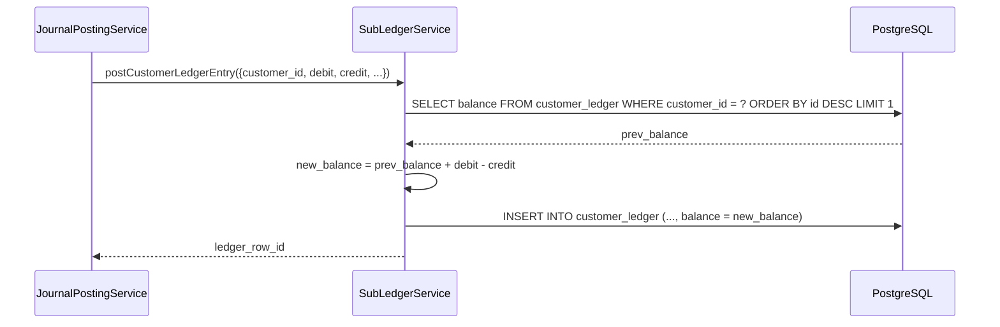

# Running Balance

> **Module:** Accounting (SAFETY-CRITICAL)
> **Audience:** Engineers + AI assistants + **accountants** (must review before Canonical)
> **Status:** Draft — pending accountant sign-off
> **Last reviewed:** 2025-08-03
> **Source of truth:** this file + `laravel/app/Services/Accounting/SubLedgerService.php` + `laravel/app/Services/ReportService.php` + `laravel/database/migrations/2025_01_20_000006_add_running_balance_reconciliation.php` + `laravel/database/migrations/2025_01_03_000001_create_report_materialized_views.php`

## 1. What is it?

"Running balance" in RC_ERP_v2 has two meanings:

1. **GL running balance** — the current balance of a ledger, computed on-the-fly as
   `SUM(debit) - SUM(credit)` from `journal_lines` joined to non-reversed `journal_entries`.
   There is **no `running_balance` column on `ledgers`** — the GL balance is always derived. The
   `mv_ledger_balances` materialized view caches this per-ledger for reporting.
2. **Sub-ledger running balance** — the denormalized `balance` column on each sub-ledger row
   (`customer_ledger`, `supplier_ledger`, `employee_ledger`, `cash_ledger`, `branch_ledger`),
   updated on every insert as `prev_balance + (debit - credit)` or `+ (credit - debit)` depending
   on the ledger's normal balance. This is verified by 4 window-function materialized views that
   flag drift.

The Trial Balance, Balance Sheet, and P&L are all computed from the GL running balance +
`ledgers.opening_balance` + `ledgers.normal_balance`.

## 2. Why does it exist?

- The GL running balance is derived (not stored) because storing it would create a
  consistency risk (a missed update would silently corrupt the balance). Deriving it from
  immutable journal lines is always correct.
- The sub-ledger running balance IS stored (denormalized) because per-entity balance queries
  (e.g. "customer X's current balance") are high-frequency and would be expensive to recompute
  from all rows. The MVs catch drift.
- `ledgers.opening_balance` carries the fiscal-year-start balance forward (seeded manually or via
  the CoA seed), so the Trial Balance opening column reflects the carry-forward.

## 3. When is it used?

- **On every sub-ledger insert** — `SubLedgerService::postCustomerLedgerEntry()` etc. compute and
  store the new `balance`.
- **On every Trial Balance / Balance Sheet / P&L report** — `ReportService` queries
  `journal_lines` joined to non-reversed `journal_entries`, grouped by ledger.
- **Hourly** — pg_cron `refresh-rb-checks` refreshes the 4 `*_ledger_balance_check` MVs.
- **Every 5 min** — pg_cron `refresh_all_report_views()` refreshes `mv_ledger_balances`.
- **On demand** — `php artisan reconcile:running-balance` checks for drift and can `--fix` it.

## 4. Who uses it?

- **Accountants** review the Trial Balance and reconciliations.
- **Admins** run the `reconcile:running-balance` command.
- **System/automated:** the MV refresh jobs run continuously.

## 5. Related modules

- `journal-posting-rules.md` — every post updates sub-ledger running balances.
- `subledger-reconciliation.md` — the recon verifies stored vs computed balances.
- `chart-of-accounts.md` — `ledgers.opening_balance` + `normal_balance`.
- `../database/schema-overview.md` — the sub-ledger tables.

## 6. Business rules

- **MUST** compute the GL balance as `SUM(jl.debit) - SUM(jl.credit)` from non-reversed journal
  entries (exclude `je.is_reversed = true`).
- **MUST** compute the sub-ledger `balance` on insert using the correct formula per ledger:
  - `customer_ledger`: `balance = prev + debit - credit` (debit = customer owes more; AR is
    debit-normal).
  - `supplier_ledger`: `balance = prev + credit - debit` (credit = we owe more; AP is
    credit-normal).
  - `employee_ledger`: `balance = prev + credit - debit` (credit = we owe employee more;
    Employee Payable is credit-normal).
  - `cash_ledger`: `balance = prev + amount` (positive = IN, negative = OUT).
- **MUST** add `ledgers.opening_balance` to the Trial Balance opening column on the correct side
  based on `normal_balance` (debit → opening_debit, credit → opening_credit).
- **MUST** refresh the running-balance-check MVs hourly to catch drift.
- **MUST NOT** `--fix` running-balance drift without first understanding the root cause (the fix
  UPDATEs stored balances to match computed balances, masking bugs).
- **SHOULD** use `REFRESH MATERIALIZED VIEW CONCURRENTLY` for all balance MVs (requires UNIQUE
  index).

## 7. Technical implementation

### 7.1 No `running_balance` column on `ledgers`

`ledgers` has `opening_balance` (fiscal-year carry-forward) but **NO `running_balance` column**.
The current GL balance is always computed on-the-fly:

```sql
SELECT COALESCE(SUM(jl.debit), 0) - COALESCE(SUM(jl.credit), 0) AS balance
FROM journal_lines jl
JOIN journal_entries je ON je.id = jl.journal_entry_id AND je.is_reversed = false
WHERE jl.ledger_id = ?
```

### 7.2 Sub-ledger running balances (denormalized, updated on insert)

| Table | Formula | Source |
|---|---|---|
| `customer_ledger` | `balance = prev + debit - credit` | `SubLedgerService::postCustomerLedgerEntry` L57 |
| `supplier_ledger` | `balance = prev + credit - debit` | `SubLedgerService::postSupplierLedgerEntry` L101 |
| `employee_ledger` | `balance = prev + credit - debit` | `SubLedgerService::postEmployeeLedgerEntry` L146 |
| `cash_ledger` | `balance = prev + amount` (positive=IN, negative=OUT) | (not centralized — written directly by `MoneyTransferService`) |
| `branch_ledger` | `running_balance` column (nullable) | `02_accounting.sql:213` |

These are verified by 4 MVs (`mv_*_ledger_balance_check`) that compute the window-function
running balance and flag drift (see `subledger-reconciliation.md` §7.3).

### 7.3 `mv_ledger_balances` — the GL running balance MV

Source: `2025_01_03_000001_create_report_materialized_views.php:30-51` (recreated by
`2026_08_22_000002_partition_journal_entries.php:697-722` after `journal_entries` was partitioned).

```sql
CREATE MATERIALIZED VIEW mv_ledger_balances AS
SELECT
    l.id AS ledger_id, l.ledger_code, l.ledger_name, l.account_type,
    l.ledger_nature, l.is_control_account, l.is_active, l.parent_id,
    COALESCE(SUM(jl.debit), 0) AS total_debit,
    COALESCE(SUM(jl.credit), 0) AS total_credit,
    COALESCE(SUM(jl.debit), 0) - COALESCE(SUM(jl.credit), 0) AS net_debit,
    COUNT(jl.id) AS line_count,
    MAX(je.entry_date) AS last_entry_date
FROM ledgers l
LEFT JOIN journal_lines jl ON jl.ledger_id = l.id
LEFT JOIN journal_entries je ON je.id = jl.journal_entry_id AND COALESCE(je.is_reversed, false) = false
GROUP BY l.id, l.ledger_code, l.ledger_name, l.account_type, l.ledger_nature,
         l.is_control_account, l.is_active, l.parent_id;
```

Refreshed every 5 min by `refresh_all_report_views()` pg_cron job + on-demand via
`reports:refresh` artisan command.

### 7.4 Trial Balance — `ReportService::trialBalance()` (lines 37-203)

Computes opening/period/closing per ledger, including `opening_balance` on the correct side
based on `normal_balance`:

```sql
COALESCE(SUM(CASE WHEN je.entry_date < ? THEN jl.debit ELSE 0 END), 0)
    + CASE WHEN COALESCE(l.normal_balance, 'debit') = 'debit'
           THEN COALESCE(l.opening_balance, 0) ELSE 0 END AS opening_debit
```

Returns totals + integrity checks:

```php
$checks = [
    'opening_balanced' => abs($totals['opening_debit'] - $totals['opening_credit']) < 0.01,
    'period_balanced'  => abs($totals['period_debit'] - $totals['period_credit']) < 0.01,
    'closing_balanced' => abs($totals['closing_debit'] - $totals['closing_credit']) < 0.01,
    'opening_diff', 'period_diff', 'closing_diff',
    'all_accounts_balance' => ... (opening + period_debit - period_credit = closing per account),
    'subledger_reconciliation' => [ar, ap, employee],
    'orphaned_journal_lines' => COUNT(jl where ledger_id NOT IN active ledgers),
];
```

Filters out group-header ledgers (those with children) — only posting accounts appear in totals.

### 7.5 Balance Sheet — `ReportService::balanceSheet()` (lines 497-558)

Assets = Σ(net_debit) where `account_type='Asset'`. Liabilities = Σ(net_credit) where
`'Liability'`. Equity = Σ(net_credit) where `'Equity'` + current-period net income
(Income.net_credit − Expense.net_debit).

`checks.balanced` = `abs(total_assets − (total_liabilities + total_equity)) < 0.01`.

### 7.6 Date-bounded balance queries

`ReportService::trialBalance` uses `je.entry_date < ?` (opening), `BETWEEN ? AND ?` (period),
`<= ?` (closing) with bound parameters. `ReconciliationService` accepts optional `$asOfDate`
parameter for historical reconciliation (all queries use `<= ?` filters on `transaction_date` /
`entry_date`).

### 7.7 Sub-ledger tables — full schemas

`customer_ledger` (`02_accounting.sql:144-159`): `id, customer_id, branch_id, transaction_date,
transaction_type, reference_type, reference_id, debit numeric(14,2), credit numeric(14,2),
balance numeric(14,2), description, journal_entry_id FK, created_by, created_at` + Phase-9.3
columns `is_reversed, reversed_at, reversed_by` (added by
`2025_01_02_000002_add_is_reversed_to_sub_ledgers.php`). Indexes: `(customer_id,
transaction_date)`, `(reference_type, reference_id)`, `branch_id`, `journal_entry_id`,
`(customer_id, is_reversed)` covering, `transaction_date BRIN`, `created_at BRIN`,
`(customer_id, transaction_date, balance) WHERE balance > 0` partial, `(reference_type,
reference_id) INCLUDE (...)` covering.

`supplier_ledger` (`02_accounting.sql:165-180`): same shape as customer_ledger but with
`supplier_id`.

`employee_ledger` (`02_accounting.sql:185-200`): same shape with `employee_id`.
`transaction_type` CHECK IN (`'advance','loan','repayment','salary','deduction','adjustment'`).

`cash_ledger` (`02_accounting.sql:255-269`): `branch_id FK, transaction_date, transaction_type,
reference_type, reference_id, amount numeric(15,2), balance numeric(15,2), description,
journal_entry_id FK, created_by FK users, created_at`. **No `is_reversed` column** (see §12).

`branch_ledger` (`02_accounting.sql:203-222`): `transaction_date, from_branch_id FK,
to_branch_id FK, reference_type, reference_id, journal_entry_id FK, debit numeric(12,2), credit
numeric(12,2), running_balance numeric(12,2), remarks, is_reversed boolean DEFAULT false,
created_by, created_at`. RLS = DUAL branch_id (sees rows where user is from OR to branch).
Indexes include `idx_bl_active WHERE is_reversed = false` partial.

### 7.8 Other supporting tables

- `branch_cash` (`02_accounting.sql:224-231`): per-branch per-cash-point balance.
  UNIQUE(branch_id, cash_point).
- `branch_expenses` (L233-244): branch-level expense tracking.
- `branch_product_cost` (L246-253): per-branch product avg_cost (separate from warehouse
  avg_cost).

### 7.9 The `reconciliation_snapshots` table

`2025_01_20_000006_add_running_balance_reconciliation.php:39-57`. Stores a structured audit
trail of each `reconcile:running-balance` run: timestamp, ledger_type (customer/supplier/
employee/cash), entity_id, stored_balance, computed_balance, drift, action (reported/fixed).

## 8. Important database tables

| Table | Purpose | Key columns |
|---|---|---|
| `ledgers` | `opening_balance`, `normal_balance` (no `running_balance`) | see `chart-of-accounts.md` |
| `customer_ledger`, `supplier_ledger`, `employee_ledger` | Sub-ledger running balances | `balance, is_reversed, journal_entry_id` |
| `cash_ledger` | Cash running balance (no `is_reversed`) | `amount, balance` |
| `branch_ledger` | Inter-branch running balance | `debit, credit, running_balance, is_reversed` |
| `reconciliation_snapshots` | Audit trail of recon runs | `stored_balance, computed_balance, drift, action` |

Materialized views: `mv_ledger_balances`, `mv_customer_ledger_balance_check`,
`mv_supplier_ledger_balance_check`, `mv_employee_ledger_balance_check`,
`mv_cash_ledger_balance_check`. See `../database/schema-overview.md` Appendix B.

## 9. Related services

- `laravel/app/Services/Accounting/SubLedgerService.php` — sub-ledger balance computation.
- `laravel/app/Services/ReportService.php` — Trial Balance, Balance Sheet, P&L.
- `laravel/app/Services/Accounting/ReconciliationService.php` — recon (see
  `subledger-reconciliation.md`).
- `laravel/app/Console/Commands/RunningBalanceReconcile.php`.

## 10. Related models

- `laravel/app/Models/CustomerLedger.php`, `SupplierLedger.php`, `EmployeeLedger.php`,
  `CashLedger.php`, `BranchLedger.php`.
- `laravel/app/Models/Ledger.php` — `opening_balance`, `normal_balance`.

## 11. Important workflows

### 11.1 Sub-ledger balance update on insert



### 11.2 Trial Balance computation

```mermaid
flowchart TD
    R[ReportService::trialBalance] --> Q1[SELECT ledgers + JOIN journal_lines + journal_entries WHERE is_reversed = false]
    Q1 --> G[GROUP BY ledger]
    G --> O[opening = SUM if entry_date < from_date + opening_balance on correct side]
    G --> P[period = SUM if entry_date BETWEEN from AND to]
    G --> C[closing = SUM if entry_date <= to_date + opening_balance]
    O --> T[totals: opening_debit/credit, period_debit/credit, closing_debit/credit]
    P --> T
    C --> T
    T --> CK[checks: opening_balanced, period_balanced, closing_balanced, all_accounts_balance]
    CK --> F[filter out group-header ledgers with children]
    F --> OUT[return {ledgers, totals, checks}]
```

## 12. Known edge cases

- **`cash_ledger` has no `is_reversed` column.** The MV `mv_cash_ledger_balance_check` has no
  `WHERE is_reversed = false` filter. Reversals are appended as new rows with opposite-sign
  `amount` (per the migration comment) — BUT `MoneyTransferService::reverseCashLedger` (L423)
  HARD-DELETEs rows instead, breaking the append-only pattern. This can cause MV drift. See
  `reversal-vs-cancellation.md` §12.
- **`branch_ledger.running_balance` is nullable.** Some rows may not have it populated. Queries
  that read `running_balance` directly should COALESCE.
- **`opening_balance` is not versioned.** Changing it shifts the Trial Balance opening column
  silently (the `AuditableMasterData` trait logs the change, but there's no dedicated
  opening-balance audit). See `chart-of-accounts.md` §12.
- **`mv_ledger_balances` excludes reversed entries** (`COALESCE(je.is_reversed, false) = false`)
  — correct, but means a reversal entry's lines are also excluded (they're in a separate JE with
  `is_reversed = false`). The net effect on the ledger balance is zero (original + reversal =
  net zero), which is correct.
- **Trial Balance filters out group-header ledgers** (those with children). If a posting
  accidentally lands on a group-header ledger (e.g. `L-0001 ASSETS` instead of a child), it
  won't appear in the TB totals — a silent error. The `chart:validate` command should catch
  this (natures resolve to leaf ledgers, not groups).
- **`all_accounts_balance` check** verifies `opening + period_debit - period_credit = closing`
  per account. A failure here indicates a data integrity bug (e.g. a journal line with a
  non-existent ledger_id, or an `opening_balance` change mid-period).
- **`orphaned_journal_lines` check** counts lines where `ledger_id` is not in active ledgers.
  This can happen if a ledger is deactivated after posts. The lines still affect balances
  (they're not excluded by the `is_active` filter on the JOIN — only the `is_reversed` filter
  applies). Confirm from code.
- **`mv_ledger_balances` refresh is every 5 min.** Reports read the MV, so they can be up to 5
  min stale. For real-time balances, query `journal_lines` directly (slower but current).
- **`cash_ledger` amount sign convention:** positive = IN (cash received), negative = OUT (cash
  paid). This differs from the debit/credit convention on other sub-ledgers. Code that reads
  `cash_ledger` must handle the signed `amount`, not assume debit/credit columns.

## 13. Future improvements

- **Fix `cash_ledger` reversal inconsistency** — append opposite-sign rows instead of
  hard-DELETEing, or add an `is_reversed` column.
- **Add an `opening_balance_log` table** to audit opening-balance changes with date, old/new
  value, actor.
- **Add a `ledger_balance_history` MV or table** that snapshots per-ledger balances daily, so
  historical balance queries (e.g. "what was AR on March 15?") don't require re-summing all
  journal lines.
- **Make the Trial Balance `orphaned_journal_lines` check block the report** (or warn loudly)
  instead of just returning a count.
- **Add a real-time balance endpoint** for the API that queries `journal_lines` directly (for
  cases where 5-min MV staleness is unacceptable).
- **Document the `cash_ledger` sign convention** prominently — it's the one sub-ledger that
  doesn't use debit/credit.
- **Consider computing `branch_ledger.running_balance` consistently** — it's nullable and may
  not be populated by all code paths.

---

> **⚠️ Accountant review required:** Confirm the sub-ledger balance formulas (§7.2) match the
> business's accounting practice, especially the sign conventions (debit-credit for AR,
> credit-debit for AP/Employee). Confirm that `opening_balance` is added to the correct Trial
> Balance side based on `normal_balance`.
