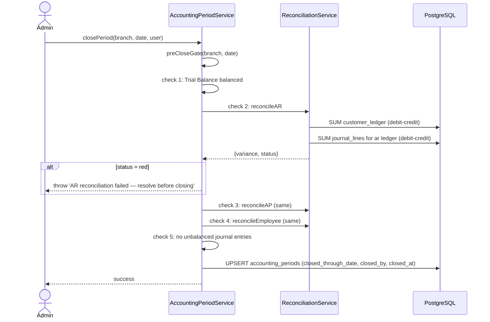

# Sub-Ledger Reconciliation

> **Module:** Accounting (SAFETY-CRITICAL)
> **Audience:** Engineers + AI assistants + **accountants** (must review before Canonical)
> **Status:** Draft — pending accountant sign-off
> **Last reviewed:** 2025-08-03
> **Source of truth:** this file + `laravel/app/Services/Accounting/SubLedgerService.php` + `laravel/app/Services/Accounting/ReconciliationService.php` + `laravel/app/Console/Commands/SubLedgerReconcile.php`

## 1. What is it?

Sub-ledger reconciliation is the process of confirming that the **GL control account** (e.g. the
"Accounts Receivable" ledger) agrees with the **sub-ledger** (e.g. the sum of all
`customer_ledger` rows). RC_ERP_v2 has 5 control-account ↔ sub-ledger pairs: AR ↔ customer_ledger,
AP ↔ supplier_ledger, Employee Payable ↔ employee_ledger, Cash/Bank ↔ banks.balance, and Inventory
↔ warehouse_stock. A 6th reconciliation (COGS ↔ stock_transactions) verifies that cost-of-goods
posted to the GL matches the stock movements. Differences are flagged as `green` (within tolerance)
or `red` (drift). There is **no automated rounding write-off** — drift above tolerance is surfaced
for manual resolution.

## 2. Why does it exist?

- A control account that doesn't match its sub-ledger means the books are wrong. Catching drift
  early (every reconciliation run) prevents it from compounding across periods.
- It is a **pre-close gate**: the period cannot be closed until AR, AP, and Employee
  reconciliations are green (see `fiscal-year-period-close.md`).
- The dual-write pattern (every GL post to a control account also writes a sub-ledger row) means
  drift should never happen — but bugs, manual SQL, or partial rollbacks can cause it. The
  reconciliation engine detects these.

## 3. When is it used?

- **On every financial post** — `SubLedgerService::postCustomerLedgerEntry()` etc. write the
  sub-ledger row alongside the GL post (dual-write).
- **On the pre-close gate** — `AccountingPeriodService::preCloseGate()` runs AR/AP/Employee recon
  before allowing a period close.
- **On demand** — `php artisan subledger:reconcile` runs the full reconciliation.
- **Hourly (running-balance check)** — pg_cron `refresh-rb-checks` refreshes the 4
  `*_ledger_balance_check` MVs that detect per-row running-balance drift.
- **On the reconciliation dashboard** — admins view the 6-section reconciliation report.

## 4. Who uses it?

- **Accountants** review the reconciliation report and investigate `red` sections.
- **Admins** run `subledger:reconcile` and `reconcile:running-balance` commands.
- **System/automated:** the pre-close gate blocks period close on red recon.

## 5. Related modules

- `journal-posting-rules.md` — the dual-write pattern (GL post + sub-ledger row).
- `chart-of-accounts.md` — control accounts (`is_control_account`, `control_account_type`).
- `fiscal-year-period-close.md` — the pre-close gate that consumes recon results.
- `running-balance.md` — the denormalized `balance` column that the recon verifies.
- `financial-audit-log.md` — reconciliation runs are audit-logged.

## 6. Business rules

- **MUST** keep each control account's GL balance equal to its sub-ledger sum, within the
  reconciliation tolerance (`GL_RECONCILIATION_TOLERANCE`, default 0.02 BDT).
- **MUST** dual-write: every GL post to a control account ALSO writes a sub-ledger row linked by
  `journal_entry_id`.
- **MUST** block period close if AR, AP, or Employee reconciliation is `red` (drift > tolerance).
- **MUST** exclude reversed entries from both sides: GL posts where `is_reversed = false`, and
  sub-ledger rows where `is_reversed = false` (except `cash_ledger`, which has no `is_reversed`
  column — see §12).
- **MUST** log every reconciliation run to `user_audit_log` (action `reconciliation_run`).
- **MUST NOT** auto-write-off drift. Differences above tolerance are reported; resolution is
  manual (either fix the bug, or post a manual journal).
- **SHOULD** refresh the running-balance MVs hourly to catch per-row drift early.

## 7. Technical implementation

### 7.1 `SubLedgerService` — `laravel/app/Services/Accounting/SubLedgerService.php` (372 lines)

No constructor deps. Methods:

| Method | Signature | Dr/Cr formula |
|---|---|---|
| `postCustomerLedgerEntry` | `(array $data): int` | `balance = prev + debit - credit` (debit = customer owes more) |
| `postSupplierLedgerEntry` | `(array $data): int` | `balance = prev + credit - debit` (credit = we owe more) |
| `postEmployeeLedgerEntry` | `(array $data): int` | `balance = prev + credit - debit` (credit = we owe employee more) |
| `reverseCustomerLedgerEntry` | `(int $ledgerId, int $reversedBy, string $reason = ''): int` | Marks original `is_reversed=true`, posts new entry with swapped Dr/Cr |
| `reverseSupplierLedgerEntry` | (same signature) | Same pattern |
| `reverseEmployeeLedgerEntry` | (same signature) | Same pattern (uses `transaction_type='adjustment'` to satisfy CHECK constraint) |
| `getTotalARBalance` | `(): float` | `SUM(debit) - SUM(credit)` from non-reversed customer_ledger |
| `getTotalAPBalance` | `(): float` | `SUM(credit) - SUM(debit)` from non-reversed supplier_ledger |
| `getTotalEmployeePayableBalance` | `(): float` | `SUM(credit) - SUM(debit)` from non-reversed employee_ledger |
| `reconcileAll` | `(): array{ar, ap, employee, all_match}` | Compares sub-ledger totals vs GL control (Dr-Cr for Asset natures, Cr-Dr for Liability natures). Hard-coded tolerance `0.02` (line 325). |
| `getGLControlBalance` | `(private, string $nature): ?float` | For `ap`/`employee_payable` returns `-(debit-credit)` to flip sign. |

### 7.2 `ReconciliationService` — `laravel/app/Services/Accounting/ReconciliationService.php` (565 lines)

Constructor: `$this->tolerance = (float) config('app.gl_reconciliation_tolerance', 0.02);` (line
41). Note: reads from `config('app....')` not `config('accounting....')` — see §7.5.

Six reconciliation sections (`reconcileAll()`):

| # | Method | Sub-ledger source | GL control nature | Formula |
|---|---|---|---|---|
| 1 | `reconcileAR` | `customer_ledger` Σ(debit−credit) | `ar` | GL = Σ(jl.debit − jl.credit) |
| 2 | `reconcileAP` | `supplier_ledger` Σ(credit−debit) | `ap` | GL = Σ(jl.credit − jl.debit) |
| 3 | `reconcileEmployee` | `employee_ledger` Σ(credit−debit) | `employee_payable` | GL = Σ(jl.credit − jl.debit) |
| 4 | `reconcileCashBank` | `banks.balance` (SUM) | `cash_bank` | GL = Σ(jl.debit − jl.credit) |
| 5 | `reconcileInventory` | `warehouse_stock.stock_value` (qty × avg_cost, qty > 0) | `inventory` | GL = Σ(jl.debit − jl.credit) |
| 6 | `reconcileCOGS` | `stock_transactions` where reference_type='sales_challan' (qty×rate) MINUS reference_type='sales_return' | `cogs` | GL = Σ(jl.debit − jl.credit) |

Each section: `status` = `green` if `variance ≤ tolerance`, else `red`. Drill-down: top 10
entities by outstanding balance when variance exceeds tolerance. Optional `as_of_date` filter
(parameterized SQL — G-4 fix). Logs run to `user_audit_log` action `reconciliation_run`.

### 7.3 Materialized views supporting reconciliation

Source: `laravel/database/migrations/2025_01_20_000006_add_running_balance_reconciliation.php`
(229 lines) + `2025_01_03_000001_create_report_materialized_views.php` (282 lines).

| MV | Formula | Refresh | Purpose |
|---|---|---|---|
| `mv_customer_ledger_balance_check` | `SUM(debit - credit) OVER (PARTITION BY customer_id ORDER BY id)` | hourly pg_cron `refresh-rb-checks` + `reconcile:running-balance` command | Detects drift between stored `balance` and window-computed balance |
| `mv_supplier_ledger_balance_check` | `SUM(credit - debit) OVER (PARTITION BY supplier_id ORDER BY id)` | same | Same for AP |
| `mv_employee_ledger_balance_check` | `SUM(credit - debit) OVER (PARTITION BY employee_id ORDER BY id)` | same | Same for Employee Payable |
| `mv_cash_ledger_balance_check` | `SUM(amount) OVER (PARTITION BY branch_id ORDER BY id)` | same | Same for cash_ledger (no `is_reversed` column — see §12) |
| `mv_ledger_balances` | per-ledger `SUM(debit), SUM(credit), net_debit` | every 5 min `refresh_all_report_views()` pg_cron + on-demand | Foundation for Trial Balance, P&L, BS |
| `mv_ar_aging` | per-customer aging buckets 0-30/31-60/61-90/90+ | same | AR aging report |
| `mv_ap_aging` | per-supplier aging buckets | same | AP aging report |
| `mv_stock_valuation` | per-warehouse qty × avg_cost | same | Inventory valuation |

All MVs use `REFRESH MATERIALIZED VIEW CONCURRENTLY` (requires UNIQUE index — created alongside
each MV).

### 7.4 Reconciliation commands

| Command | File | Purpose |
|---|---|---|
| `subledger:reconcile` | `app/Console/Commands/SubLedgerReconcile.php` | CLI for `SubLedgerService::reconcileAll()` + checks orphan sub-ledger rows + cash/bank/inventory/COGS sections |
| `reconcile:running-balance` | `app/Console/Commands/RunningBalanceReconcile.php` | Refreshes 4 `*_ledger_balance_check` MVs, reports drift, optional `--fix` to UPDATE stored balance = computed balance. Snapshots to `reconciliation_snapshots` table. |
| `journal:manual-verify` | `app/Console/Commands/JournalManualVerify.php` | Verifies all JEs balanced |
| `journal:replay-verify` | `app/Console/Commands/JournalReplayVerify.php` | Replays all JEs and compares |
| `reversal:verify` | `app/Console/Commands/ReversalVerify.php` | Verifies reversals net to zero |

### 7.5 The tolerance inconsistency (gap)

| File:line | Code | Tolerance source |
|---|---|---|
| `ReconciliationService.php:41` | `$this->tolerance = (float) config('app.gl_reconciliation_tolerance', 0.02);` | `config/app.php` |
| `SubLedgerService.php:325` | `$tolerance = 0.02;` (literal) | **hard-coded** — does NOT read config |
| `RunningBalanceReconcile.php:49` | `$this->tolerance = (float) config('app.gl_reconciliation_tolerance', 0.02);` | `config/app.php` |
| `JournalPostingService.php:70` | `abs($totalDebit - $totalCredit) > 0.01` (Dr=Cr check) | **hard-coded 0.01** — different threshold |

> **GAP:** Three different tolerance values / sources. The same `gl_reconciliation_tolerance`
> key exists in BOTH `config/accounting.php` and `config/app.php` (duplicated). Code that reads
> `config('accounting.gl_reconciliation_tolerance')` and code that reads
> `config('app.gl_reconciliation_tolerance')` get the same value, but `SubLedgerService` ignores
> config entirely. See `journal-posting-rules.md` §7.9.

### 7.6 Reconciliation differences / rounding write-off

**NOT FOUND:** There is **no automated rounding write-off** mechanism. Drift above the 0.02
tolerance is reported as `red` status and surfaced to the UI; resolution is manual. The
`reconcile:running-balance --fix` command does UPDATE stored balances to match window-computed
balances (a destructive fix, not a write-off journal entry). The `reconciliation_snapshots` table
(`2025_01_20_000006_add_running_balance_reconciliation.php:39-57`) stores structured audit trail
of each reconciliation run.

### 7.7 Bank reconciliation (Phase 7 — noted but not detailed here)

- `BankReconciliationService` (`app/Services/Accounting/BankReconciliationService.php`, 709 lines)
  — full lifecycle: create → import statement lines → auto-match → manual match → complete →
  reverse.
- Date tolerance: `const DATE_TOLERANCE_DAYS = 5;` (line 52).
- Matching algorithm: exact amount + date proximity + reference match, score-based.
- Balance formula: `Adjusted Book = System Closing + Deposits in Transit − Outstanding Checks +
  Bank Charges/Interest`. `Adjusted Bank = Statement Closing + Deposits in Transit − Outstanding
  Checks`. Difference must = 0.
- Tables: `bank_reconciliations`, `bank_statement_lines`, `bank_reconciliation_items`.
- Schema source: `2026_08_12_000001_create_bank_reconciliation.php`.

### 7.8 The sub-ledger tables — full schemas

`customer_ledger` (`02_accounting.sql:144-159`): `id, customer_id, branch_id, transaction_date,
transaction_type, reference_type, reference_id, debit numeric(14,2), credit numeric(14,2),
balance numeric(14,2), description, journal_entry_id FK, created_by, created_at` + Phase-9.3
columns `is_reversed, reversed_at, reversed_by` (added by
`2025_01_02_000002_add_is_reversed_to_sub_ledgers.php`).

`supplier_ledger` (`02_accounting.sql:165-180`): same shape as customer_ledger but with
`supplier_id`.

`employee_ledger` (`02_accounting.sql:185-200`): same shape with `employee_id`.
`transaction_type` CHECK IN (`'advance','loan','repayment','salary','deduction','adjustment'`).

`cash_ledger` (`02_accounting.sql:255-269`): `branch_id FK, transaction_date, transaction_type,
reference_type, reference_id, amount numeric(15,2), balance numeric(15,2), description,
journal_entry_id FK, created_by FK users, created_at`. **No `is_reversed` column** (see §12).

`branch_ledger` (`02_accounting.sql:203-222`): `transaction_date, from_branch_id FK,
to_branch_id FK, reference_type, reference_id, journal_entry_id FK, debit numeric(12,2), credit
numeric(12,2), running_balance numeric(12,2), remarks, is_reversed boolean DEFAULT false,
created_by, created_at`. RLS = DUAL branch_id (sees rows where user is from OR to branch).

## 8. Important database tables

| Table | Purpose | Key columns |
|---|---|---|
| `customer_ledger` | AR sub-ledger (per-customer running balance) | `customer_id, debit, credit, balance, journal_entry_id, is_reversed` |
| `supplier_ledger` | AP sub-ledger | `supplier_id, debit, credit, balance, journal_entry_id, is_reversed` |
| `employee_ledger` | Employee payable sub-ledger | `employee_id, debit, credit, balance, journal_entry_id, is_reversed, transaction_type` |
| `cash_ledger` | Cash sub-ledger (per-branch) | `branch_id, amount, balance, journal_entry_id` (no `is_reversed`) |
| `branch_ledger` | Inter-branch Due-from/Due-to | `from_branch_id, to_branch_id, debit, credit, running_balance, is_reversed` |
| `reconciliation_snapshots` | Audit trail of reconciliation runs | structured snapshot per run |

See `../database/er-diagrams.md`.

## 9. Related services

- `laravel/app/Services/Accounting/SubLedgerService.php` — dual-write + reconcile.
- `laravel/app/Services/Accounting/ReconciliationService.php` — 6-section recon.
- `laravel/app/Services/Accounting/BankReconciliationService.php` — bank recon (Phase 7).
- `laravel/app/Console/Commands/SubLedgerReconcile.php`, `RunningBalanceReconcile.php`.

## 10. Related models

- `laravel/app/Models/CustomerLedger.php`
- `laravel/app/Models/SupplierLedger.php`
- `laravel/app/Models/EmployeeLedger.php`
- `laravel/app/Models/CashLedger.php` (if present; otherwise `DB::table`)
- `laravel/app/Models/BranchLedger.php`

## 11. Important workflows

### 11.1 AR reconciliation

```mermaid
flowchart TD
    R[reconcileAll] --> AR[reconcileAR]
    AR --> SL[Sub-ledger:<br/>SELECT SUM(debit-credit) FROM customer_ledger<br/>WHERE is_reversed = false]
    AR --> GL[GL control:<br/>SELECT SUM(jl.debit - jl.credit)<br/>FROM journal_lines jl<br/>JOIN journal_entries je ON je.id = jl.journal_entry_id<br/>WHERE jl.ledger_id = ar_ledger_id<br/>AND je.is_reversed = false]
    SL --> D[variance = abs(GL - SL)]
    GL --> D
    D --> S{variance <= 0.02?}
    S -- yes --> G[status = green]
    S -- no --> R2[status = red<br/>drill-down: top 10 customers by balance]
    G --> L[log to user_audit_log action=reconciliation_run]
    R2 --> L
```

### 11.2 The pre-close gate (recon blocking period close)



## 12. Known edge cases

- **`cash_ledger` has no `is_reversed` column.** Reversals are appended as new rows with
  opposite-sign `amount` (per the migration comment at
  `2025_01_20_000006:177-183`). BUT `MoneyTransferService::reverseCashLedger` (line 423)
  HARD-DELETEs cash_ledger rows on reversal — **inconsistent** with the append-only pattern used
  elsewhere. This can cause the `mv_cash_ledger_balance_check` MV to drift from the stored
  balances. (Gap — §13.)
- **`SubLedgerService::reconcileAll` hard-codes tolerance 0.02** (line 325) instead of reading
  config. If `GL_RECONCILIATION_TOLERANCE` is changed in `.env`, this service won't pick it up.
  (Gap — §7.5.)
- **COGS reconciliation compares against `stock_transactions`**, not the sub-ledger. This is a
  derived recon (no `cogs_ledger` sub-ledger table exists). The formula excludes sales returns
  (which reverse COGS). If a stock_transaction's `reference_type` is mistyped, the COGS recon
  will drift silently.
- **No automated rounding write-off.** A 0.03 BDT drift (above the 0.02 tolerance) blocks the
  period close until a manual journal is posted or the bug is fixed. There is no "write off the
  rounding" automation.
- **`reconcile:running-balance --fix` is destructive.** It UPDATEs stored balances to match
  window-computed balances. This should only be run after the root cause of the drift is
  understood — otherwise it masks the bug.
- **Bank reconciliation is a separate system** (`BankReconciliationService`) with its own tables
  and matching algorithm. The `reconcileCashBank` section in `ReconciliationService` only checks
  that the SUM of `banks.balance` matches the GL `cash_bank` ledger — it does NOT do statement-
  level matching. See Phase 7.
- **Intercompany (branch_ledger) is not in the 6-section recon.** The Due-from/Due-to balances
  between branches are reconciled via the `mv_branch_intercompany` MV and the consolidation
  elimination process, not the `reconcileAll` flow.
- **`as_of_date` filter is optional.** Without it, recon uses all non-reversed rows. A historical
  recon (as of a past date) may include rows that didn't exist then if `is_reversed` was set
  later.

## 13. Future improvements

- **Fix `cash_ledger` reversal inconsistency** — make `MoneyTransferService::reverseCashLedger`
  append an opposite-sign row instead of hard-DELETEing, OR add an `is_reversed` column and use
  the append-only pattern.
- **Unify the tolerance config** — `SubLedgerService::reconcileAll` should read
  `config('accounting.gl_reconciliation_tolerance')` like `ReconciliationService` does.
- **Add an automated rounding write-off option** — if variance is below a (configurable) small
  threshold (e.g. 0.05), auto-post a manual journal to a `rounding_gain` / `rounding_loss` ledger
  and mark the recon green. Requires accountant sign-off.
- **Add a `cogs_ledger` sub-ledger** or document why COGS recon is derived from
  `stock_transactions` instead.
- **Add intercompany reconciliation** to the `reconcileAll` flow (Due-from = Due-to across
  branches).
- **Surface the reconciliation dashboard in the admin UI** with drill-down from red sections to
  the offending entities.
- **Add a recon-history view** that shows the `reconciliation_snapshots` over time, so drift
  trends are visible.

---

> **⚠️ Accountant review required:** The 3 sub-ledger reconciliation formulas in §7.2 (AR, AP,
> Employee) MUST be verified by a qualified accountant before this file is marked Canonical.
> Confirm the sign conventions (debit-credit for Asset natures, credit-debit for Liability
> natures) match the business's accounting practice.
