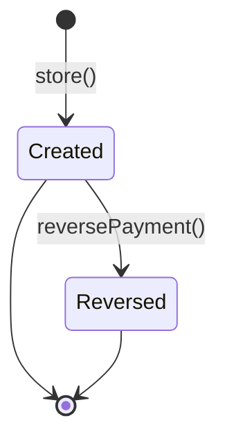

# Supplier Transactions

> **Module:** Accounting Transactions (SAFETY-CRITICAL)
> **Audience:** Engineers + AI assistants + **accountants** (must review before Canonical)
> **Status:** Draft — pending accountant sign-off
> **Last reviewed:** 2025-08-03
> **Source of truth:** this file + `laravel/app/Services/Accounting/SupplierTransactionService.php` + `laravel/database/sql/06_payment_and_misc.sql` (supplier_payments + supplier_payment_settlements DDL) + `laravel/database/sql/02_accounting.sql` (supplier_ledger DDL)

## 1. What is it?

A **supplier transaction** records any money movement or obligation change between the enterprise
and a supplier: payment against a GRN (goods-received note), advance payment before delivery,
receipt of goods on credit, or settlement of a supplier credit note. The model class is
`SupplierPayment` (table `supplier_payments`) — "supplier transaction" is the user-facing name
that covers both cash and non-cash movements.

Three transaction types (migration `2026_08_01_000001_add_transaction_type_to_supplier_payments.php`,
CHECK constraint):

| Type | Direction | Description |
|---|---|---|
| `payment` | AP↓ | pay against one or more GRNs (cash out) |
| `advance` | AP↓ | advance payment before the GRN is received (cash out) |
| `receive` | AP↑ | goods received on credit (no cash movement) |

Each type posts to both the General Ledger (via `JournalPostingService`) and the supplier
sub-ledger (`supplier_ledger` via `SubLedgerService::postSupplierLedgerEntry`).

## 2. Why does it exist?

- The enterprise buys stock on credit and must track per-supplier outstanding balances.
- GRN-based allocation (`supplier_payment_settlements`) lets the accountant specify which GRN a
  payment settles — needed for the AP aging report.
- The `receive` type is a shortcut for "goods received on credit" without going through the full
  PurchaseReceiveService flow — useful for quick bookings or corrections.
- The `advance` type records pre-payment and is settled against a future GRN via the same
  `supplier_payment_settlements` linkage.

## 3. When is it used?

- Pay a supplier against one or more GRNs (`payment`).
- Pre-pay a supplier before delivery (`advance`).
- Book a credit GRN without the full purchase receive flow (`receive`).
- Settle a supplier credit note (use `receive` with a negative-effect, or reverse the original
  payment — see §11).

## 4. Who uses it?

- **Accountants** and **managers** create and reverse supplier transactions (route middleware
  `role:accountant,manager,admin`).
- **Admins** can override branch scope.
- The `SupplierTransactionPolicy` (registered in AppServiceProvider) gates per-action; details in
  `../security/rbac-roles-permissions.md`.

## 5. Related modules

- `journal-posting-rules.md` — the `createJournalEntry` / `postJournalEntry` gateway and Dr=Cr
  trigger. This file documents only the per-type Dr/Cr matrix.
- `reversal-vs-cancellation.md` — the reversal principle.
- `subledger-reconciliation.md` — the AP control-account reconciliation formula
  (`SUM(supplier_ledger.balance) by branch` must equal the GL `ap` balance).
- `chart-of-accounts.md` — `ap`, `inventory` ledger natures.
- `customer-payments.md` — the AR-side mirror (CustomerPayment uses the same dual-write +
  settlement pattern, but with `invoice_payment_allocations` instead of
  `supplier_payment_settlements`).
- `../purchasing/purchase-receive.md` — the canonical GRN flow that `receive` type shortcuts.

## 6. Business rules (the Core Rule)

- **MUST** record a `payment_code` (unique, format `SP-YYYY-NNNNNN`) via `DocumentSequenceService`.
- **MUST** post a balanced GL entry via `JournalPostingService::createJournalEntry` for every
  transaction with `amount >= 0.01`. `reference_type='supplier_payment'` is set on the main JE.
- **MUST** write the supplier sub-ledger via `SubLedgerService::postSupplierLedgerEntry` so the
  per-supplier running balance (`balance = prev + credit − debit`, where credit = we owe more)
  is updated.
- **MUST** sync `banks.balance` for `payment` and `advance` types (cash out → bank decreases).
  `receive` does **not** touch the bank — it has no bank line in the GL.
- **MUST** allocate the payment to one or more GRNs via `supplier_payment_settlements` for
  `payment` and `advance` types. Total allocations must not exceed the payment amount (validated
  in `validateCreateInput` L146-150).
- **MUST** post intercompany settlement (two JEs + `branch_ledger` obligation) when the supplier's
  branch differs from the bank's branch, for `AP_REDUCTION_TYPES` (`payment`, `advance`). See §8.
- **MUST NOT** allow a `receive` type with a bank line — it is a non-cash transaction.
- **MUST** reverse (not edit) by calling `reversePayment`, which cascades to GL, sub-ledger,
  intercompany JEs, branch_ledger obligation, GRN paid_amount restoration, settlement row
  deletion, and bank balance undo.
- **MUST** enforce branch scope via `BranchScope` + `branch.isolation` middleware.

## 7. Technical implementation

### 7.1 The `supplier_payments` table — `06_payment_and_misc.sql:50-76`

Base DDL plus migration `2026_08_01_000001` adds `transaction_type` (CHECK 3 types), `reference_no`,
`intercompany_journal_entry_id`, `deleted_at` (soft deletes).

| Column | Type | Notes |
|---|---|---|
| `id` | PK | |
| `payment_code` | `varchar(30) UNIQUE` | `SP-YYYY-NNNNNN` |
| `payment_date` | `date NOT NULL` | |
| `supplier_id` | FK suppliers | |
| `branch_id` | FK branches | RLS key |
| `bank_id` | FK banks (nullable) | required if payment_mode='bank' |
| `payment_mode` | `varchar(20) CHECK IN (cash,bank,mobile_banking,cheque,adjustment)` | |
| `transaction_type` | `varchar(20) CHECK IN (payment,advance,receive)` | added by migration |
| `amount` | `numeric(14,2)` | |
| `discount_amount` | `numeric(14,2)` | captured but NOT posted to GL — see §12 |
| `journal_entry_id` | FK journal_entries | main GL entry |
| `intercompany_journal_entry_id` | FK journal_entries | cross-branch debtor JE |
| `is_reversed`, `reversed_at`, `reversed_by`, `reverse_reason` | | |
| `reference_no` | `varchar(100)` | supplier's invoice/challan reference |
| `collected_by` | FK employees | |
| `deleted_at`, `created_by`, timestamps | | |

RLS: `07_views_triggers_constraints.sql:789-795`. Financial-audit trigger at L450
(`trg_audit_supplier_payments`).

### 7.2 The `supplier_payment_settlements` linkage — `06_payment_and_misc.sql:78-86`

```sql
CREATE TABLE supplier_payment_settlements (
    id integer GENERATED ALWAYS AS IDENTITY PRIMARY KEY,
    payment_id integer NOT NULL REFERENCES supplier_payments(id) ON DELETE CASCADE,
    purchase_receive_id integer NOT NULL REFERENCES purchase_receives(id),
    settled_amount numeric(14,2) NOT NULL DEFAULT 0,
    created_at timestamp(0) DEFAULT CURRENT_TIMESTAMP
);
```

Each row links one payment to one GRN with the settled amount. A payment can settle multiple GRNs
(multiple rows). On payment creation, the service also increments
`purchase_receives.paid_amount` by the settled amount per GRN (`allocateToGRN` L560-576).

### 7.3 The `supplier_ledger` sub-ledger — `02_accounting.sql:165-183`

Same schema as `employee_ledger` except **no CHECK** on `transaction_type` (free text).
`balance = prev + credit − debit` (credit = we owe more).

### 7.4 The Dr/Cr matrix — `SupplierTransactionService::postPaymentGL` (L405-451)

```php
$apLedgerId = $this->journalPosting->lookupLedgerByNature('ap');
// ...null guard...
$transactionType = $payment->transaction_type ?? 'payment';
switch ($transactionType) {
    case 'payment':
    case 'advance':
        $lines = $this->buildPaymentGL($payment, $apLedgerId, $amount, $transactionType);
        break;
    case 'receive':
        $lines = $this->buildReceiveGL($payment, $apLedgerId, $amount);
        break;
}
return $this->journalPosting->createJournalEntry([
    'entry_date'     => $payment->payment_date->format('Y-m-d'),
    'reference_type' => 'supplier_payment',
    'reference_id'   => $payment->id,
    'branch_id'      => $payment->branch_id,
    'description'    => $label . ' ' . $payment->payment_code . ...,
    'source'         => 'supplier_payment_' . $transactionType,
    'created_by'     => $createdBy,
], $lines);
```

| Type | Dr | Cr | Bank sync? | GRN allocation? |
|---|---|---|---|---|
| `payment` | `ap` | bank-ledger or `cash_bank` | decrease | yes |
| `advance` | `ap` | bank-ledger or `cash_bank` | decrease | yes (against a future GRN) |
| `receive` | `inventory` | `ap` | **none** | no |

- **`buildPaymentGL`** (L457-480) — Dr `ap` (entity_type=`supplier`, entity_id=supplier_id),
  Cr bank-ledger (entity_type=`bank`) or `cash_bank` nature (entity_type=`supplier_payment`).
- **`buildReceiveGL`** (L486-512) — Dr `inventory` (entity_type=`supplier`), Cr `ap`
  (entity_type=`supplier`). **No bank line** — this is a non-cash credit GRN shortcut.

### 7.5 GRN allocation — `allocateToGRN` (L560-576)

```php
DB::table('supplier_payment_settlements')->insert([
    'payment_id'          => $paymentId,
    'purchase_receive_id' => $purchaseReceiveId,
    'settled_amount'      => round($allocatedAmount, 2),
    'created_at'          => now(),
]);
DB::table('purchase_receives')
    ->where('id', $purchaseReceiveId)
    ->update([
        'paid_amount' => DB::raw('paid_amount + ' . round($allocatedAmount, 2)),
        'updated_at'  => now(),
    ]);
```

Total allocations validated to not exceed the payment amount (L146-150). There is no per-GRN
outstanding-balance check at the service level — the user can over-allocate to a single GRN
(allocation > outstanding), which would drive `paid_amount > total_amount`. The database trigger
on `purchase_receives` (if any) is the safety net; otherwise the AP aging report will show a
negative outstanding balance.

## 8. Intercompany settlement

Same pattern as EmployeeTransactionService. When `isBankMode()` AND
`bank.branch_id !== payment.branch_id` AND `transaction_type ∈ AP_REDUCTION_TYPES` (`payment`,
`advance`):

| JE | Branch | Dr | Cr |
|---|---|---|---|
| Creditor JE (at bank's branch) | `bank.branch_id` | `interbranch_receivable` | bank-ledger |
| Debtor JE (at payment's branch) | `payment.branch_id` | bank-ledger | `interbranch_payable` |

Both JEs use `reference_type='supplier_payment_intercompany'` + `reference_id=payment.id`. A
`branch_ledger` obligation row is inserted. The debtor JE id is stored in
`supplier_payments.intercompany_journal_entry_id`; the creditor JE id is recovered on reversal via
the `reference_type` + `reference_id` query.

`receive` type never triggers intercompany (no bank line).

## 9. Workflow / state machine



No draft / approval workflow. State tracked by `is_reversed` boolean only (no `status` enum
column). Soft deletes (`deleted_at`) exist but are not used by the service — only by the model's
`SoftDeletes` trait for admin hard-delete recovery.

## 10. Validation & input rules

`StoreSupplierTransactionRequest.php:40-54`:

```php
return [
    'supplier_id'      => ['required', 'integer', 'exists:suppliers,id'],
    'branch_id'        => ['required', 'integer', 'exists:branches,id'],
    'bank_id'          => ['nullable', 'integer', 'exists:banks,id'],
    'payment_mode'     => ['required', 'in:cash,bank,mobile_banking,cheque,adjustment'],
    'transaction_type' => ['required', 'in:payment,advance,receive'],
    'amount'           => ['required', 'numeric', 'min:0.01'],
    'discount_amount'  => ['nullable', 'numeric', 'min:0'],
    'payment_date'     => ['required', 'date'],
    'reference_no'     => ['nullable', 'string', 'max:100'],
    'collected_by'     => ['nullable', 'integer', 'exists:employees,id'],
    'notes'            => ['nullable', 'string', 'max:500'],
];
```

Service `validateCreateInput` additionally:
- Supplier exists and `is_active=true`.
- `amount >= 0.01`.
- `bank_id` required when `payment_mode='bank'`.
- Total GRN allocations <= `amount` (L146-150).
- `receive` type requires `payment_mode='adjustment'` (no bank).

## 11. Reversal & correction flow

`reversePayment` (L201-305) — runs in a `DB::transaction`:

1. `lockForUpdate()` the payment row.
2. Reject if `is_reversed=true`.
3. `JournalReversalService::reverseByJournalEntry(journal_entry_id)` — cascades to GL lines + the
   linked `supplier_ledger` row.
4. Find ALL non-reversed JEs with `reference_type='supplier_payment_intercompany'` and
   `reference_id=$paymentId` — reverse each (catches creditor + debtor).
5. Reverse the `branch_ledger` obligation row (`is_reversed=true`).
6. **Restore GRN paid_amount** — for each `supplier_payment_settlements` row, decrement
   `purchase_receives.paid_amount` by `GREATEST(0, paid_amount - settled_amount)` (L263-271).
7. **Hard-DELETE** the `supplier_payment_settlements` rows for this payment (L274).
8. Mark `supplier_payments.is_reversed=true`.
9. Undo bank balance sync (only if `isBankMode()`).
10. Audit log.

```mermaid
sequenceDiagram
    participant U as User (accountant)
    participant C as SupplierTransactionController
    participant S as SupplierTransactionService
    participant JR as JournalReversalService
    participant JP as JournalPostingService
    participant SL as SubLedgerService
    participant DB as PostgreSQL

    U->>C: POST /admin/supplier-transactions/{id}/reverse {reason}
    C->>S: reversePayment(id, userId, reason)
    S->>DB: BEGIN; SELECT ... FOR UPDATE
    S->>JR: reverseByJournalEntry(journal_entry_id)
    JR->>JP: reverseJournalEntry (swap Dr/Cr)
    JP->>DB: INSERT reversal journal_entries + lines
    JP->>DB: UPDATE original journal_entries SET is_reversed=true
    JR->>DB: UPDATE supplier_ledger SET is_reversed=true WHERE journal_entry_id=original
    S->>JR: reverseByReference('supplier_payment_intercompany', id)
    S->>DB: UPDATE branch_ledger SET is_reversed=true
    S->>DB: UPDATE purchase_receives SET paid_amount = GREATEST(0, paid_amount - settled_amount)  // per settlement
    S->>DB: DELETE FROM supplier_payment_settlements WHERE payment_id=id  ⚠️ hard-DELETE
    S->>DB: UPDATE banks SET balance = balance + amount (undo)
    S->>DB: UPDATE supplier_payments SET is_reversed=true
    S->>DB: COMMIT
    S-->>C: SupplierPayment (reversed)
    C-->>U: redirect with success
```

## 12. Open questions / known gaps

1. **`discount_amount` is captured but NOT posted to GL.** `buildPaymentGL` (L457-480) only uses
   `$amount` for both Dr AP and Cr bank. The `discount_amount` column is persisted to
   `supplier_payments` but never hits the GL — supplier early-payment discounts are silently lost
   in the trial balance. **Recommended fix:** add a third line Dr `sales_discount` (or a supplier
   discount contra account) for the discount portion, and reduce the AP Dr by the discount. Compare
   to `CustomerPaymentService::buildReceiveGL` which DOES post the discount split.
2. **`receive` type bypasses PurchaseReceiveService.** This is a shortcut for "goods received on
   credit" that posts Dr `inventory` / Cr `ap` directly, without creating a `purchase_receives`
   row, updating stock, or computing moving-average cost. The inventory balance increases but the
   stock ledger does not reflect a GRN. **Use with caution** — the inventory reconciliation
   (`subledger-reconciliation.md` Inventory section) will diverge from the stock ledger if `receive`
   is used instead of the canonical GRN flow. Recommended: deprecate `receive` and require GRN for
   all credit purchases.
3. **Hard-DELETE of `supplier_payment_settlements` on reversal** (L274). The settlement table is a
   pure linkage (no financial impact beyond the `paid_amount` decrement which IS reversed in step
   6). Deletion is arguably acceptable since the audit trail is preserved in
   `financial_audit_log` (the trigger fires on `supplier_payments`, not on settlements — see §12 #5
   below). **Accountant must confirm whether settlement history is needed for audit.**
4. **No per-GRN outstanding balance check at allocation.** The user can allocate more than the
   outstanding balance to a single GRN, driving `paid_amount > total_amount`. There is no DB
   CHECK enforcing `paid_amount <= total_amount` on `purchase_receives`. Compare to
   `invoice_payment_allocations` which has a `trg_ipa_no_overallocation` trigger.
5. **`supplier_payment_settlements` has no `fn_financial_audit_trigger`.** Only the parent
   `supplier_payments` table is in the immutable hash chain. Settlement rows can be inserted /
   deleted without an immutable audit record. The application-level `UserAuditLogger` writes to
   `user_audit_log` (mutable), but the SHA-256 chain does not cover settlement changes.
6. **`reference_no` is free-text, not unique.** A supplier's invoice/challan number can be reused
   across multiple payments. There is no deduplication check — duplicate supplier invoice booking
   is possible if the accountant is not careful.

## 13. Accountant review checklist

> **This is a SAFETY-CRITICAL document.** Before marking it Canonical, an accountant with
> production credentials MUST review and sign off on each item below.

- [ ] The Dr/Cr matrix in §7.4 matches the actual treatment for each of the 3 types.
- [ ] The `receive` type's Dr `inventory` / Cr `ap` shortcut (§12 #2) — is it acceptable, or should
      it be deprecated in favor of the canonical GRN flow?
- [ ] The `discount_amount` non-posting gap (§12 #1) — should supplier discounts be posted to a
      dedicated contra account? Compare to customer-side `sales_discount` posting.
- [ ] The intercompany two-JE pattern (§8) matches the actual cross-branch supplier payment flow.
- [ ] The `branch_ledger` obligation row (§8) is the correct way to track interbranch debt.
- [ ] The GRN paid_amount restoration on reversal (§11 step 6) correctly undoes the allocation.
- [ ] The hard-DELETE of settlements on reversal (§12 #3) — is the linkage history needed for
      audit?
- [ ] The lack of per-GRN over-allocation guard (§12 #4) — should a DB CHECK or trigger be added?
- [ ] The `supplier_ledger.balance` formula `prev + credit − debit` correctly reflects "credit = we
      owe more" (supplier is a creditor of the enterprise).
- [ ] The `receive` type requires `payment_mode='adjustment'` — confirm this is enforced in the
      UI and the service.
