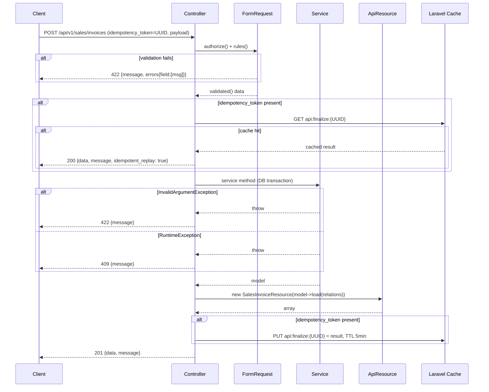
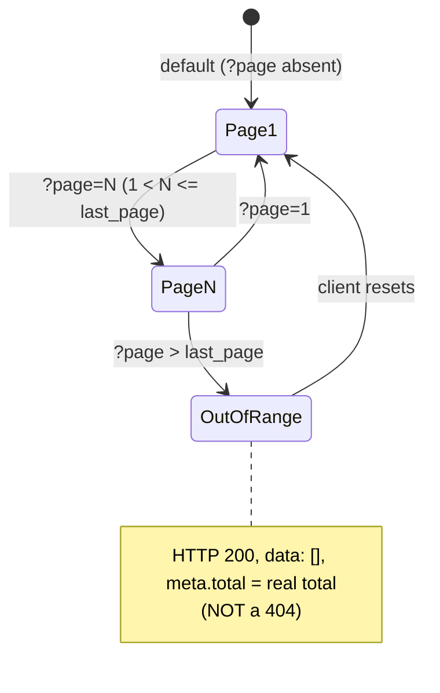

# API Conventions

> **Module:** API / REST v1 — Conventions
> **Audience:** Engineers + AI assistants + API consumers (mobile / AI sidecar / integrators)
> **Status:** Draft — pending review (6 HIGH + 6 MEDIUM + 3 LOW gaps; see §13)
> **Last reviewed:** Phase 17 (API Layer REST v1)
> **Source of truth:** this file is the canonical reference for the JSON response shape, pagination contract, error contract, idempotency, naming, and timestamp formatting used across all 101 `/api/*` endpoints. The 15 API controllers (`laravel/app/Http/Controllers/Api/V1/*`, 5,500 LOC total) are the implementation; this file documents the patterns they actually use (with file:line citations) and flags where they diverge.

---

## 1. What is it?

A set of conventions — some explicit, some implicit — that govern how every RC_ERP REST API
endpoint shapes its request and response JSON. The conventions are **not** enforced by a
single base class or trait; they are emergent from 15 controllers written across 6 phases
(Phase 13 origin, Phase 11 Stock Take, Phase 8 Sales, Phase 9 Stock Adjustment, Phase 10
Branch Demand, Task 37 Commission). Where controllers agree, this file codifies the agreement.
Where they diverge, this file flags the divergence as a gap (§13) and recommends the
canonical form for new endpoints.

The conventions cover: the **JSON envelope** (`{data, message, meta}`), the **pagination
contract** (Laravel paginator shape, 4 variants in use — §5), the **error contract** (HTTP
status → JSON shape matrix, 6 status codes — §6), the **idempotency pattern** (client UUID +
5-min cache, 3 of ~10 write endpoints — §11), the **resource-class pattern**
(`JsonResource` subclasses with `whenLoaded`, 19 classes covering 12 of 15 controllers — §7),
the **timestamp format** (ISO-8601 with microseconds for audit, `Y-m-d` for business dates —
§9), and the **naming conventions** (snake_case JSON keys, kebab-case URL paths, camelCase
PHP — §4).

---

## 2. Why does it exist?

- **Mobile clients need predictable shapes.** A mobile sales app that finalises an invoice
  offline and syncs when online MUST be able to parse the response deterministically. If
  `POST /sales/invoices` returns `{data, message}` today and `{invoice, message}` tomorrow,
  the app breaks.
- **The API grew organically across 6 phases.** Each phase's author copied the prior phase's
  pattern with small drifts. Phase 16's `reports-catalog.md` exercise showed that
  cataloguing the drifts is the first step to fixing them — this file does the same for the
  API.
- **AI assistants need a spec to generate code against.** An AI generating a new API endpoint
  needs to know: which envelope shape, which pagination variant, which error shape, which
  timestamp format, whether to use a Resource or hand-roll. Without this file, the AI copies
  the nearest neighbor and propagates the drift.
- **Auditors need a contract.** A security reviewer checking "do all 422 responses include
  `errors` keyed by field?" needs this file as the spec; the answer today is "yes, via
  Laravel's `ValidationException` default renderer, but 6 of 14 modules use inline
  `$request->validate([...])` instead of FormRequests, so the shape is the framework default,
  not a project guarantee."

---

## 3. When is it used?

- **Every API request** — the conventions apply to every response returned by every
  `/api/v1/*` endpoint and every error returned by the API middleware (`ApiAuth`,
  `ApiRateLimit`, `SetApiBranchContext`).
- **When adding a new endpoint** — mirror the nearest existing endpoint in the same module;
  this file tells you which patterns are canonical and which are drift.
- **When writing an API client** — this file is the contract; if the server violates it, file
  a bug (do not code around it).
- **When reviewing a PR** — the reviewer checks the new endpoint against §4–§12.

---

## 4. Who uses it?

| Audience | How |
|---|---|
| **API consumer (mobile/AI/integrator)** | Treats §5 (envelope), §6 (errors), §9 (timestamps), §11 (idempotency) as the wire contract. |
| **Backend engineer adding an endpoint** | Mirrors §4 (naming), §5 (envelope), §7 (Resource), §10 (status codes), §11 (idempotency on transactional writes). |
| **Reviewer** | Checks the PR against §13 (gaps) — new endpoints MUST NOT introduce new drifts. |
| **AI assistant generating code** | Reads §4–§12 before writing a new controller method; prefers Resource classes over hand-rolled arrays (§7 G2). |
| **Auditor** | Uses §6 (error matrix) + §13 (gap catalogue) as the spec. |

---

## 5. Related modules

- `api-overview.md` — the foundation: auth, rate limit, route map, module list. Read first.
- `api-modules.md` — per-module endpoint tables; this file's conventions are applied there.
- `api-reference-index.md` — index into `laravel/docs/api/API_REFERENCE.md`.
- `../security/api-security.md` — the 401/403/429 response shapes are owned there; this file
  cross-references them.
- `../coding/request-validation.md` — the 12 API FormRequest classes + the inline
  `$request->validate([...])` pattern (6 of 14 modules). The 422 shape is the framework
  default rendered from `ValidationException`.
- `../coding/error-handling.md` — the exception → HTTP status mapping the API relies on.
- `../coding/service-layer-conventions.md` — why controllers stay thin (envelope assembly
  belongs in the Resource, not the controller).
- `../coding/coding-standards.md` — PSR-12 + naming (camelCase PHP, snake_case JSON).

---

## 6. Business rules

- **MUST** return JSON on every API response, including errors. `Content-Type:
  application/json` (or `application/problem+json` — not used today; see G10).
- **MUST** use the **envelope shape** `{data, message, meta}` for success responses (§7).
  The `data` key is mandatory; `message` and `meta` are optional.
- **MUST** use Laravel's standard paginator JSON shape for list endpoints: `{data: [...],
  meta: {current_page, last_page, per_page, total, from, to}}`. The `links` block (Laravel
  default) is omitted by all 4 paginated controllers — see G3.
- **MUST** clamp `per_page` to 1–100 on every paginated endpoint. The Sales Invoice
  controller does `min((int) $request->input('per_page', 25), 100)` — mirror this.
- **MUST** use HTTP status codes per §10. In particular: 201 on resource creation, 200 on
  update/read, 204 only when the response body is intentionally empty (DELETE deactivation
  returns 200 with a body, not 204 — see §10).
- **MUST** return 422 with `{message, errors: {field: [msg, ...]}}` on validation failure.
  This is Laravel's `ValidationException` default render for `expectsJson()` requests — do not
  override it.
- **MUST** return 401 with `{message: "Unauthenticated.", detail: "..."}` on auth failure
  (owned by `ApiAuth` — see `../security/api-security.md` §7.1).
- **MUST** return 403 with `{message: "Forbidden. Requires role: ..."}` on role mismatch
  (owned by `ApiAuth`).
- **MUST** return 429 with `{message, retry_after}` + `Retry-After` header on rate limit
  (owned by `ApiRateLimit`).
- **MUST** return 409 with `{message}` on a domain conflict (e.g. trying to cancel a
  non-draft invoice, trying to confirm an already-confirmed adjustment). The convention is to
  catch `\RuntimeException` and return 409; catch `\InvalidArgumentException` and return
  422 — see `SalesInvoiceApiController::store()` lines 128–132.
- **MUST** use snake_case for JSON keys (Laravel convention; matches the DB column names).
- **MUST** use kebab-case for URL path segments (`/api/v1/stock-adjustments`,
  `/api/v1/warehouse-transfers`, `/api/v1/branch-demands`). The Sales module uses
  `/api/v1/sales/invoices` (plural resource under a module prefix).
- **MUST** use ISO-8601 with microseconds (`->toIso8601String()`) for audit timestamps
  (`created_at`, `updated_at`, `deleted_at`). Use `Y-m-d` (no time) for business dates
  (`invoice_date`, `entry_date`, `effective_from`). See §9.
- **MUST** send an `idempotency_token` (client-generated UUID) on the three transactional
  write endpoints that mutate stock + GL: `POST /sales/invoices`,
  `POST /sales/challans/issue`, `POST /sales/payments`. See §11. **SHOULD** extend this to
  every POST that mutates stock or GL (G7).
- **MUST NOT** leak internal exception messages or stack traces. `app.debug=true` (the dev
  default) will render `{message, exception, file, line, trace}` on 500 — production MUST set
  `APP_DEBUG=false`. (G12.)
- **MUST NOT** return raw Eloquent model `toArray()` for transactional resources. Use a
  `JsonResource` subclass so the payload shape is explicit and auditable. (G2 — 3 of 15
  controllers hand-roll today.)
- **SHOULD** use a `JsonResource` for every response that returns a domain object. The
  `whenLoaded()` pattern keeps payloads small (relations are only serialized if they were
  eager-loaded).
- **SHOULD** include a human-readable `message` field on every action response
  (`{message: "Invoice created successfully", data: {...}}`).

---

## 7. Technical implementation — the JSON envelope

### 7.1 The canonical success envelope

```json
{
  "data": <resource | array<resource> | scalar>,
  "message": "<optional human string>",
  "meta": { <optional pagination or context metadata> }
}
```

- `data` — mandatory. The payload. For list endpoints, an array of resources. For
  single-resource endpoints, one resource object. For action endpoints (cancel, approve,
  confirm), often omitted and only `message` is returned.
- `message` — optional. A human-readable status string. Present on every create/update/
  delete/action response. Often omitted on plain reads (`GET /branches/{id}` returns just
  `{data}`).
- `meta` — optional. Pagination metadata on list endpoints; range metadata on dashboard
  endpoints; no `meta` on single-resource or action endpoints.

### 7.2 The four response shapes in use

The 15 controllers collectively produce 4 distinct success-response shapes. The canonical
form is **Shape A**; the others are drift (G1–G3).

**Shape A — single resource (canonical):**

```json
{
  "data": { "id": 1, "invoice_code": "INV-2025-000001", ... }
}
```

Used by: `BranchApiController::show`, `SalesInvoiceApiController::show`,
`StockAdjustmentApiController::show`, `BranchDemandApiController::show`, etc.

**Shape B — paginated list (canonical):**

```json
{
  "data": [ { "id": 1, ... }, { "id": 2, ... } ],
  "meta": {
    "current_page": 1,
    "last_page": 5,
    "per_page": 25,
    "total": 120
  }
}
```

Used by: `BranchApiController::index`, `SalesInvoiceApiController::index`,
`StockAdjustmentApiController::index`, `CommissionApiController::listRules`.

> **Drift (G3):** `BranchApiController::index` includes `from` and `to` in `meta`; the other
> three omit them. The canonical form omits `from`/`to` (mobile clients compute them from
> `current_page` + `per_page`). New endpoints SHOULD omit `from`/`to`. Laravel's default
> paginator also emits a `links` block (`first`, `last`, `prev`, `next` URLs) — all 4
> paginated controllers suppress it via `->only(['data', 'meta'])` or by hand-building the
> `meta` array. This is intentional (mobile clients build URLs themselves) and is now the
> canonical form.

**Shape C — action result (no `data`):**

```json
{
  "message": "Invoice cancelled successfully"
}
```

Used by: `SalesInvoiceApiController::cancel`, `StockAdjustmentApiController::cancel`,
`BranchDemandApiController::destroy`, `BranchApiController::destroy` (returns
`{message: "Branch deactivated."}`).

**Shape D — lookup (flat array, no envelope):**

```json
{
  "data": [ { "id": 1, "branch_code": "HO", "branch_name": "Head Office" } ]
}
```

Used by: all 6 `LookupApiController` endpoints, `DashboardApiController::salesTrend`,
`DashboardApiController::topProducts`. The `data` is a flat array (not paginated, no `meta`
unless range info is needed).

> **Drift (G1):** `DashboardApiController::index` returns `{data: {counts: {...}, today:
> {...}}}` — a single nested object under `data`, not an array. This is correct (it's a
> singleton dashboard summary) but worth noting: `data` can be an object, an array, or a
> scalar depending on the endpoint.

### 7.3 The `ApiResource` pattern

19 `JsonResource` subclasses live under `laravel/app/Http/Resources/Api/V1/`:

```
BranchDemand/
  BranchDemandResource.php
  (no item resource — uses array)
Sales/
  CartResource.php
  CustomerPaymentResource.php
  PaymentAllocationResource.php
  SalesChallanResource.php
  SalesChallanItemResource.php
  SalesInvoiceResource.php
  SalesInvoiceItemResource.php
  SalesInvoiceDispatchResource.php
  SalesReturnResource.php
  SalesReturnItemResource.php
StockAdjustment/
  StockAdjustmentResource.php
  StockAdjustmentItemResource.php
StockTake/
  StockTakeResource.php
  StockTakeItemResource.php
  StockTakeWarehouseResource.php
WarehouseTransfer/
  WarehouseTransferResource.php
  WarehouseTransferItemResource.php
```

**Canonical Resource shape** (`SalesInvoiceResource.php` excerpt):

```php
class SalesInvoiceResource extends JsonResource
{
    public function toArray($request): array
    {
        return [
            'id'                 => $this->id,
            'invoice_code'       => $this->invoice_code,
            'invoice_date'       => $this->invoice_date?->format('Y-m-d'),
            'customer'           => $this->whenLoaded('customer', fn() => [
                'id'   => $this->customer?->id,
                'name' => $this->customer?->customer_name,
                'code' => $this->customer?->customer_code,
            ]),
            'branch_id'          => $this->branch_id,
            'sub_total'          => (float) $this->sub_total,
            'discount_amount'    => (float) $this->discount_amount,
            'total_amount'       => (float) $this->total_amount,
            'status'             => $this->status,
            'is_reversed'        => (bool) $this->is_reversed,
            'items'              => SalesInvoiceItemResource::collection($this->whenLoaded('items')),
            'dispatches'         => SalesInvoiceDispatchResource::collection($this->whenLoaded('dispatches')),
            'journal_entry_id'   => $this->journal_entry_id,
            'created_at'         => $this->created_at?->toIso8601String(),
        ];
    }
}
```

**Conventions encoded above:**

- `whenLoaded('relation', fn() => [...])` — relations are only serialized if they were
  eager-loaded. Prevents N+1 queries AND keeps payloads small when the caller didn't ask for
  the relation.
- `(float) $this->amount` — explicit cast on money fields. Avoids string-`"45000.50"` vs
  float-`45000.5` ambiguity.
- `(bool) $this->is_reversed` — explicit cast on booleans.
- `$this->invoice_date?->format('Y-m-d')` — business date as `Y-m-d` (no time, no timezone).
- `$this->created_at?->toIso8601String()` — audit timestamp as ISO-8601 with microseconds.
- Nested resources via `SalesInvoiceItemResource::collection($this->whenLoaded('items'))`.

**Drift (G2):** 3 of 15 controllers hand-roll the response array instead of using a Resource:

| Controller | Method | What it does | Fix |
|---|---|---|---|
| `BranchApiController` | index/show/store/update | Returns `$branch->toArray()` (raw model) | Add `BranchResource`. |
| `DashboardApiController` | all 3 | Hand-builds `{counts, today}` / arrays | Acceptable — dashboard payloads are bespoke; a Resource adds no value. |
| `LookupApiController` | all 6 | `DB::table` → `->get()` → `->map(fn($r) => (array) $r)` | Acceptable — lookups are slim id+label rows; a Resource adds no value. |
| `CommissionApiController` | all 8 | Hand-builds via `formatRule()` / `formatEntry()` private helpers | Add `CommissionRuleResource` + `CommissionEntryResource` so the shape is auditable. |

For new endpoints: **use a Resource** if the payload has more than 5 fields or nests
relations; **hand-roll** is acceptable for slim lookup-style payloads.

---

## 8. Pagination contract

### 8.1 Query parameters (canonical)

| Param | Type | Default | Notes |
|---|---|---|---|
| `page` | integer | 1 | Page number, 1-indexed. Laravel default. |
| `per_page` | integer | 25 | Page size. **MUST** be clamped to 1–100. |
| `q` OR `search` | string | — | Search term. **Drift (G5):** Branches + Stock Take use `q`; Sales Invoices use `search`; Stock Adjustments use `search`; Branch Demands use `search`. Pick `search` for new endpoints (it's the majority). |
| `from_date`, `to_date` | date (Y-m-d) | — | Date range filter. Used by Sales Invoices, Stock Adjustments, Branch Demands. |
| `status` | string | — | Status filter. Used by Sales Invoices, Stock Adjustments, Stock Take Sessions. |
| `customer_id` / `branch_id` / `warehouse_id` / `product_id` | integer | — | Foreign-key filters. |

### 8.2 Response shape (canonical)

```json
{
  "data": [ /* array of resources */ ],
  "meta": {
    "current_page": 1,
    "last_page": 5,
    "per_page": 25,
    "total": 120
  }
}
```

**Omitted from canonical form:**

- `from`, `to` — present in `BranchApiController::index` only; omit for new endpoints.
- `links` — Laravel's default paginator emits `{first, last, prev, next}` URLs; all 4
  paginated controllers suppress it. New endpoints MUST suppress it (use
  `->only(['data', 'meta'])` or hand-build `meta`).

### 8.3 Out-of-range page behavior

Laravel's default: `?page=999` on a 5-page result set returns HTTP 200 with
`{data: [], meta: {current_page: 999, last_page: 5, total: 120}}`. The API does NOT return
404 for out-of-range pages. Mobile clients MUST check `data.length === 0` to detect "no more
results", not the HTTP status.

### 8.4 The `per_page` clamp (canonical)

```php
$perPage = min((int) ($request->input('per_page', 25)), 100);
$invoices = $query->paginate($perPage);
```

**Drift (G4 — HIGH):** `CommissionApiController::listRules` does NOT clamp `per_page`:

```php
// CommissionApiController.php:50
$perPage = $request->input('per_page', 25);
$rules = $query->paginate($perPage);  // no min(..., 100) — OOM risk
```

A malicious client could request `?per_page=999999` and force the server to load every
commission rule into memory. **Fix:** add `min((int) ..., 100)`.

---

## 9. Naming and timestamp conventions

### 9.1 JSON key naming

- **snake_case** for all JSON keys. Matches Laravel's default Eloquent serialization and the
  DB column names. Example: `invoice_code`, `customer_id`, `is_reversed`, `created_at`.
- **Boolean keys** are prefixed `is_` or `has_`: `is_active`, `is_reversed`,
  `is_soft_hold`, `is_challan_issued`, `is_godown_prepared`, `call_a_day` (exception —
  historical name, kept for parity).
- **Money fields** are returned as floats with explicit `(float)` cast in the Resource.
  Example: `(float) $this->total_amount`. The DB column is `numeric(15,2)`; the cast
  prevents string-`"45000.50"` serialization.

### 9.2 URL path naming

- **kebab-case** for multi-word path segments: `/stock-adjustments`, `/warehouse-transfers`,
  `/branch-demands`, `/sales/invoices`, `/sales/challans`, `/sales/returns`,
  `/sales/payments`, `/stock-take/sessions`.
- **Plural** for collection endpoints: `/branches`, `/invoices`, `/sessions`.
- **`{id}`** path parameter is always a positive integer, validated via
  `->where('id', '[0-9]+')`.
- **Action endpoints** use `POST /resource/{id}/action` (verb as the last segment):
  `/sales/invoices/{id}/cancel`, `/stock-adjustments/{id}/approve`,
  `/stock-take/sessions/{id}/post`.

### 9.3 Timestamp formatting

Two distinct patterns, used consistently:

| Pattern | Format | Used for | Example |
|---|---|---|---|
| Business date | `Y-m-d` (no time, no TZ) | `invoice_date`, `entry_date`, `effective_from`, `effective_to`, `entry_date`, `invoice_date` | `"2025-01-21"` |
| Audit timestamp | ISO-8601 with microseconds + TZ (`->toIso8601String()`) | `created_at`, `updated_at`, `deleted_at` | `"2025-01-21T14:30:00.000000Z"` |

**Drift (G13 — LOW):** some Resources use `->toIso8601String()` (microseconds + `Z`), others
use `->toDateTimeString()` (no TZ, no microseconds). The canonical form is
`->toIso8601String()` for audit timestamps. New Resources MUST use `->toIso8601String()`.

### 9.4 HTTP header conventions

- **Request:** clients SHOULD send `Accept: application/json`. The API does not negotiate on
  `Accept` today (G9); it always returns JSON. Sending `Accept: application/json` is good
  hygiene (it triggers Laravel's `expectsJson()` → JSON error renderer on validation
  failures).
- **Request:** `Authorization: Bearer <token>` is mandatory on `/api/v1/*`.
- **Request:** `Content-Type: application/json` on POST/PUT bodies with a JSON payload.
- **Response:** `Content-Type: application/json` always.
- **Response (rate-limited):** `X-RateLimit-Limit`, `X-RateLimit-Remaining`,
  `X-RateLimit-Reset` on every rate-limited response; `Retry-After` only on 429.
- **Response (ETag):** `ETag` on every cacheable read response (200 OK on GET/HEAD); clients
  may send `If-None-Match` to receive a 304 Not Modified. See §11.5.

### 9.4.1 Rate-limit tiers

The API uses a **three-tier** rate-limit policy enforced by `App\Http\Middleware\ApiRateLimit`
(see `api-overview.md` §7.6 for the underlying `config/api.php` thresholds). Each route
declares its tier via `->middleware('api.rate:N')` in `routes/api.php`. The tier choice is
driven by the endpoint's read/write semantics + how often a well-behaved mobile client is
expected to poll it.

| Tier | Cap | Applies to | Rationale | Example routes |
|---|---|---|---|---|
| **Read-only polled** | **120 req/min** | Read-only endpoints that mobile clients poll frequently (every few seconds) to refresh dashboards or dropdown lists. No state mutation, no DB writes — only `SELECT` against cached/MV-backed reads. | These endpoints are the lightest load on the DB (no transactions, no locks); the higher cap prevents a legitimate polling client from being throttled while still bounding abuse. | `GET /dashboard`, `GET /dashboard/sales-trend`, `GET /dashboard/top-products`, `GET /lookups/*` (branches, warehouses, products, customers, suppliers, ledgers) |
| **Standard read** | **60 req/min** | Other read endpoints — paginated list + show-by-id routes that are not polled. Heavier per-request DB cost (pagination, joins, eager-loaded relations). | The default tier (also the fallback when `config('api.rate_limit.default')` is unset). Bounds abusive scraping without impacting normal interactive use. | `GET /branches`, `GET /branches/{id}`, `GET /sales/invoices`, `GET /sales/invoices/{id}`, `GET /stock-adjustments`, `GET /warehouse-transfers`, `GET /sales/cart` |
| **Transactional write** | **30 req/min** | Endpoints that mutate stock, GL, or branch-ledger state — i.e. endpoints that run inside `DB::transaction()` and post journal entries / fire notifications / trigger MV refresh. | Writes are expensive (locks, journal_posting_logs rows, audit trail) and a runaway client retry-loop could double-post or flood the GL. The stricter cap bounds the blast radius of a buggy client. | `POST /sales/invoices`, `PUT /sales/invoices/{id}`, `POST /sales/invoices/{id}/cancel`, `POST /sales/cart`, `POST /sales/returns`, `POST /sales/challans/godown`, `POST /sales/payments`, `POST /stock-adjustments` + `/{id}/submit` `approve` `reject` `confirm` `cancel`, `POST /warehouse-transfers` + `/{id}/confirm` `cancel`, `POST /branch-demands` + `/{id}/send` `reprice` `confirm-receipt` `reverse` `reject`, `POST /stock-take/sessions` + `/{id}/post` `approve` `reject` |

> ✅ **RESOLVED — G-230 (MEDIUM-WAVE-2-C).** The previous gap (G13 in `reports/dashboards.md`)
> flagged that `routes/api.php:115-120` used `api.rate:120` on the 3 dashboard endpoints while
> other API endpoints used 60 req/min, with no documentation explaining the convention. The
> three-tier policy above was already implemented in code (`config/api.php` §7.6 exposes
> `rate_limit.default`, `rate_limit.dashboard`, `rate_limit.lookups` as env-overridable
> thresholds; `routes/api.php` declares the per-route tier on every endpoint). This section
> documents the policy so the choice of 120 for dashboard + lookups no longer looks arbitrary.
> The dashboard's 120 req/min cap is justified by (a) read-only nature (no DB writes, no
> locks), (b) polling semantics (the mobile app refreshes the dashboard every ~5s = 12 req/min
> per active user, well within the 120 cap), and (c) the DB-cost ceiling (each request fires
> ~8 SELECTs — capped at 960 DB queries/min per token, which the connection pool can absorb).
> No code change required — documentation only.

---

## 10. Error contract — HTTP status code matrix

| Status | When | Body shape | Owned by |
|---|---|---|---|
| 200 OK | Successful read or action (update, cancel, confirm, approve). | `{data}` or `{data, message}` or `{message}` | Controller |
| 201 Created | Successful resource creation (POST that returns a new entity). | `{data, message}` | Controller (e.g. `SalesInvoiceApiController::store` returns 201) |
| 204 No Content | Not used today. DELETE returns 200 with `{message}`. | — | (canonical: use 200 + `{message}` for now) |
| 400 Bad Request | Domain precondition failed (e.g. trying to deactivate a branch with active dependents). | `{message, blockers?: [...]}` | Controller |
| 401 Unauthorized | Missing/invalid bearer token. | `{message: "Unauthenticated.", detail: "..."}` | `ApiAuth` middleware |
| 403 Forbidden | Token valid but role mismatch. | `{message: "Forbidden. Requires role: ..."}` | `ApiAuth` middleware |
| 404 Not Found | Resource with the given ID was not found. | `{message: "..."}` (Laravel default: `"Symfony\\Component\\HttpKernel\\Exception\\NotFoundHttpException"` → render via `bootstrap/app.php` → `{message: "Not found"}`) | Framework / `findOrFail()` |
| 409 Conflict | Domain conflict (e.g. cancelling a non-draft invoice, confirming an already-confirmed adjustment). | `{message}` | Controller (`catch (\RuntimeException $e) → 409`) |
| 422 Unprocessable Entity | Validation failure. | `{message, errors: {field: [msg, ...]}}` | Framework (`ValidationException` default render) OR controller (`catch (\InvalidArgumentException $e) → 422`) |
| 429 Too Many Requests | Rate limit exceeded. | `{message, retry_after}` + `Retry-After` header | `ApiRateLimit` middleware |
| 500 Internal Server Error | Unhandled exception. | `{message}` (prod) or `{message, exception, file, line, trace}` (dev with `APP_DEBUG=true`) | Framework |

### 10.1 The 422 shape (canonical)

Laravel's `ValidationException` default render for `expectsJson()` requests:

```json
{
  "message": "The branch code field is required.",
  "errors": {
    "branch_code": ["The branch code field is required."],
    "branch_name": ["The branch name field is required."]
  }
}
```

- `message` — the first error message (Laravel default).
- `errors` — object keyed by field name; each value is an array of error message strings
  (a field can have multiple failures).

**Drift (G14 — MEDIUM):** 6 of 14 modules use inline `$request->validate([...])` instead of
a FormRequest class. The 422 shape is identical (both paths throw `ValidationException`),
but the FormRequest path is preferred because it (a) documents the rules in a dedicated class,
(b) supports `bodyParameters()` for the API docs page, and (c) separates authorization from
validation. See `../coding/request-validation.md`.

> ✅ **PARTIAL RESOLVED — G-208 (MEDIUM-WAVE-2-C).** 4 of 6 modules converted (6 inline-validate
> sites → 6 new FormRequests). Converted: WarehouseTransferApiController (3 sites), StockTakeSessionApiController
> (1 site), StockTakeItemApiController (1 site), SalesChallanApiController (1 site). 2 controllers remain
> for a future pass: BranchDemandApiController (5 sites) + SalesInvoiceApiController (4 sites) — both have
> nested-array rules + idempotency-token fields. See the G14 row in §13 for the full per-controller breakdown.

### 10.2 The 409 vs 422 distinction (canonical)

The Sales Invoice controller codifies the pattern (`SalesInvoiceApiController.php:128-132`):

```php
try {
    $invoice = $this->invoiceService->finalizeFromCart(...);
    return response()->json($result, 201);
} catch (\InvalidArgumentException $e) {
    return response()->json(['message' => $e->getMessage()], 422);
} catch (\RuntimeException $e) {
    return response()->json(['message' => $e->getMessage()], 409);
}
```

- **422** — `InvalidArgumentException` — the input is semantically invalid (e.g. cart is
  empty, customer has no credit limit and no override).
- **409** — `RuntimeException` — the input is valid but the domain state conflicts (e.g.
  invoice is not in draft status, period is closed, stock is insufficient).

New endpoints SHOULD follow this pattern: throw `InvalidArgumentException` for input
errors → 422; throw `RuntimeException` for state errors → 409.

### 10.3 The 400 shape (with `blockers`)

`BranchApiController::destroy` returns 400 when deactivation is blocked:

```json
{
  "message": "Cannot deactivate branch — outstanding dependencies.",
  "blockers": [
    "3 active warehouse(s)",
    "12 active employee(s)",
    "5 open sales invoice(s)"
  ]
}
```

This is the only endpoint that uses a `blockers` array. New endpoints that need to report
multiple blocking reasons SHOULD mirror this shape.

### 10.4 The 500 shape (production vs dev)

- **Production (`APP_DEBUG=false`):** `{message: "Server Error"}` (Laravel default).
- **Dev (`APP_DEBUG=true`):** `{message, exception, file, line, trace}` — full debug payload.

**Gap (G12):** every controller's `catch (\RuntimeException $e) { return response()->json(['message' => $e->getMessage()], 409); }`
returns the raw exception message to the client. This is fine for `RuntimeException` (the
message is intentional and user-facing) but is a leak vector if a `\Throwable` ever escapes
to the framework's 500 handler with `APP_DEBUG=true`. **Mitigation:** production MUST set
`APP_DEBUG=false`. **Long-term fix:** sanitise exception messages in the
`bootstrap/app.php` exception renderer.

---

## 11. Idempotency

### 11.1 The pattern (canonical)

Eleven transactional write endpoints accept an `idempotency_token` (client-generated UUID) and
replay the cached result on retry within a 5-minute window:

1. `POST /api/v1/sales/invoices` — `SalesInvoiceApiController::store` (lines 98–132). Token **required**.
2. `POST /api/v1/sales/challans/issue` — `SalesChallanApiController::issue` (lines 152–189). Token **required**.
3. `POST /api/v1/sales/payments` — `CustomerPaymentApiController::store` (lines 121–170). Token **required**.
4. `POST /api/v1/sales/returns` — `SalesReturnApiController::store`. Token **optional** (`sometimes`).
5. `POST /api/v1/stock-adjustments` — `StockAdjustmentApiController::store`. Token **optional**.
6. `POST /api/v1/warehouse-transfers` — `WarehouseTransferApiController::store`. Token **optional**.
7. `POST /api/v1/branch-demands` — `BranchDemandApiController::store`. Token **optional**.
8. `POST /api/v1/sales/challans/godown` — `SalesChallanApiController::godown`. Token **optional**.
9. `POST /api/v1/branch-demands/{id}/send` — `BranchDemandApiController::send`. Token **optional** (cache key namespaced per demand id).
10. `POST /api/v1/branch-demands/{id}/reprice` — `BranchDemandApiController::reprice`. Token **optional** (cache key namespaced per demand id).
11. `POST /api/v1/stock-take/sessions` — `StockTakeSessionApiController::store`. Token **optional**.

> **PURCHASING-API-4 (G7 Medium-risk) — 2026-09-05:** endpoints 8–11 were retrofitted with
> idempotency, completing the G7 fix started in PURCHASING-API-3. Same `sometimes|string|uuid`
> contract as endpoints 4–7 (optional token for backward-compat with deployed mobile clients).
> For path-parameterized endpoints (`/branch-demands/{id}/send` and `/branch-demands/{id}/reprice`),
> the cache key includes the demand id so the same client-generated token reused against a
> different demand does not collide (`api:branch_demand_send:{id}:{token}`,
> `api:branch_demand_reprice:{id}:{token}`). All 11 endpoints now implement idempotency;
> only the Low-risk endpoints (second-call hits 409) intentionally skip the pattern.
>
> **PURCHASING-API-3 (G-088/G-089/G-090) — 2026-09-05:** endpoints 4–7 were retrofitted with
> idempotency. The token is `sometimes|string|uuid` (not `required`) on these four so
> already-deployed mobile clients that omit the field are not broken; new clients SHOULD
> always send it. The original three (1–3) keep `required` because they were idempotent
> from day one. Cache keys are namespaced per resource (`api:finalize:`,
> `api:challan:`, `api:payment:`, `api:sales_return:`, `api:stock_adjustment:`,
> `api:warehouse_transfer:`, `api:branch_demand:`) so a token reused across endpoints does
> not collide.

**Mechanism:**

```php
$cacheKey = 'api:finalize:' . $validated['idempotency_token'];
$cached = Cache::get($cacheKey);

if ($cached !== null) {
    return response()->json(array_merge($cached, [
        'idempotent_replay' => true,
    ]));
}

// ... do the work ...
$result = ['message' => '...', 'data' => new SalesInvoiceResource($invoice)];
Cache::put($cacheKey, $result, now()->addMinutes(5));
return response()->json($result, 201);
```

For the four `sometimes` endpoints, the controller gates on token presence:

```php
$idempotencyToken = $validated['idempotency_token'] ?? null;
if ($idempotencyToken !== null) {
    $cacheKey = 'api:stock_adjustment:' . $idempotencyToken;
    $cached = Cache::get($cacheKey);
    if ($cached !== null) {
        return response()->json(array_merge($cached, ['idempotent_replay' => true]));
    }
}
// ... do the work, then:
if ($idempotencyToken !== null) {
    Cache::put('api:stock_adjustment:' . $idempotencyToken, $result, now()->addMinutes(5));
}
```

### 11.2 The idempotency replay response

On a replay, the response is the original 201 body with an added `idempotent_replay: true`
flag and HTTP 200 (not 201 — the resource was not created again):

```json
{
  "message": "Invoice created successfully",
  "data": { "id": 42, "invoice_code": "INV-2025-000042", ... },
  "idempotent_replay": true
}
```

Clients MUST check `idempotent_replay` to know whether the work was actually done or replayed.

### 11.3 Where idempotency is missing (G7 — HIGH)

> ✅ RESOLVED in PURCHASING-API-3 (2026-09-05) for the 4 **High**-risk endpoints:
> `POST /sales/returns`, `POST /stock-adjustments`, `POST /warehouse-transfers`,
> `POST /branch-demands` — all now accept an optional `idempotency_token` (UUID) and
> replay the cached 201 result on retry within 5 min. See §11.1 above for the full
> pattern + the namespaced cache-key convention.
>
> ✅ RESOLVED in PURCHASING-API-4 (2026-09-05) for the 4 **Medium**-risk endpoints:
> `POST /sales/challans/godown`, `POST /branch-demands/{id}/send`,
> `POST /branch-demands/{id}/reprice`, `POST /stock-take/sessions` — all now accept
> an optional `idempotency_token` (UUID) and replay the cached result on retry within
> 5 min. The path-parameterized endpoints (`/branch-demands/{id}/send` and
> `/branch-demands/{id}/reprice`) namespace the cache key with the demand id to avoid
> token reuse across demands colliding. See §11.1 above. All 11 transactional write
> endpoints now implement idempotency; only the Low-risk endpoints (second-call hits
> 409) intentionally skip the pattern.

The following transactional write endpoints do NOT implement idempotency. A network retry on
any of them could create a duplicate:

| Endpoint | Controller method | Risk |
|---|---|---|
| `POST /sales/cart` | `SalesCartApiController::store` | Low — cart is idempotent by design (upsert by product_id) |
| ~~`POST /sales/returns`~~ ✅ | ~~`SalesReturnApiController::store`~~ | ~~High — creates a return + reversal journal~~ **RESOLVED in PURCHASING-API-3** (cache key `api:sales_return:`) |
| `POST /sales/invoices/{id}/cancel` | `SalesInvoiceApiController::cancel` | Low — second cancel hits "not draft" 409 |
| ~~`POST /sales/challans/godown`~~ ✅ | ~~`SalesChallanApiController::godown`~~ | ~~Medium — creates a godown preparation~~ **RESOLVED in PURCHASING-API-4** (cache key `api:challan_godown:`) |
| ~~`POST /stock-adjustments`~~ ✅ | ~~`StockAdjustmentApiController::store`~~ | ~~High — creates a draft adjustment~~ **RESOLVED in PURCHASING-API-3** (cache key `api:stock_adjustment:`) |
| `POST /stock-adjustments/{id}/confirm` | `StockAdjustmentApiController::confirm` | Low — second confirm hits "already confirmed" 409 |
| ~~`POST /warehouse-transfers`~~ ✅ | ~~`WarehouseTransferApiController::store`~~ | ~~High — creates a draft transfer~~ **RESOLVED in PURCHASING-API-3** (cache key `api:warehouse_transfer:`) |
| `POST /warehouse-transfers/{id}/confirm` | `WarehouseTransferApiController::confirm` | Low — second confirm hits 409 |
| ~~`POST /branch-demands`~~ ✅ | ~~`BranchDemandApiController::store`~~ | ~~High — creates a demand + intercompany journals~~ **RESOLVED in PURCHASING-API-3** (cache key `api:branch_demand:`) |
| ~~`POST /branch-demands/{id}/send`~~ ✅ | ~~`BranchDemandApiController::send`~~ | ~~Medium — sends a demand~~ **RESOLVED in PURCHASING-API-4** (cache key `api:branch_demand_send:{id}:`) |
| ~~`POST /branch-demands/{id}/reprice`~~ ✅ | ~~`BranchDemandApiController::reprice`~~ | ~~Medium — posts a GL adjustment~~ **RESOLVED in PURCHASING-API-4** (cache key `api:branch_demand_reprice:{id}:`) |
| ~~`POST /stock-take/sessions`~~ ✅ | ~~`StockTakeSessionApiController::store`~~ | ~~Medium — creates a draft session~~ **RESOLVED in PURCHASING-API-4** (cache key `api:stock_take_session:`) |
| `POST /stock-take/sessions/{id}/post` | `StockTakeSessionApiController::post` | Low — second post hits 409 |
| `POST /sales/commission/confirm-period` | `CommissionApiController::confirmPeriod` | Low — second confirm hits 409 |

**Recommended fix:** add an `idempotency_token` field + 5-min cache lookup to every endpoint
marked High or Medium above. ✅ All High + Medium endpoints are now resolved; only Low-risk
endpoints (intentionally skipped — second-call hits 409) remain without idempotency.

### 11.4 Idempotency cache durability

The 5-min window uses the default Laravel cache (`CACHE_STORE` env, typically `file` in dev
and `redis` in prod). If the cache is flushed or Redis restarts, a retried finalize WILL
create a duplicate. The window is short enough that this is a low-probability event, but it
is not zero. **Mitigation:** use `CACHE_STORE=redis` in production so the cache survives app
redeploys.

### 11.5 ETag / Conditional-GET

> ✅ **RESOLVED — G-197 (MEDIUM-WAVE-2-C).** The previous gap (G8) flagged that no API read
> endpoint supported `ETag` / conditional-GET, forcing mobile clients to re-download full
> response bodies on every poll. **MEDIUM-WAVE-2-C** created a new global middleware
> `App\Http\Middleware\ETag` (~205 lines) registered in the `api` middleware stack via
> `bootstrap/app.php` (`$middleware->api([\App\Http\Middleware\ETag::class])`). It runs on
> every `/api/*` request as a "post" middleware (calls `$next($request)` first, then inspects
> + modifies the response). The middleware applies RFC 7232 §2.3 compliant strong ETags to
> cacheable responses and honors `If-None-Match` to return `304 Not Modified` on a hit. See
> the spec table below for the exact behavior matrix. Documentation of the convention +
> client usage pattern added here (§11.5) so future endpoints inherit the behavior
> automatically without per-controller wiring.

**What it does** (RFC 7232 §2.3 strong validator):

1. Lets the controller produce the response normally (the DB is still hit — ETag is a
   bandwidth/cache optimization, NOT a server-side cache).
2. For cacheable responses (see matrix below), computes `ETag = '"' . md5(body) . '"'`
   (quoted, strong — no `W/` prefix).
3. Sets the `ETag` response header.
4. If the request carries an `If-None-Match` header matching the computed ETag, returns
   `HTTP 304 Not Modified` with an empty body + the ETag header (+ `Cache-Control` if the
   controller set one). The client reuses its cached body.

**Cacheable response matrix:**

| Condition | Cacheable? | Rationale |
|---|---|---|
| Method = `GET` or `HEAD` | ✅ Yes | No request body to factor in. |
| Method = `POST` / `PUT` / `PATCH` / `DELETE` | ❌ No | Write responses are not cacheable (the resource state changes). |
| Status = `200 OK` | ✅ Yes | The canonical cacheable success status. |
| Status = `201 Created` / `204 No Content` | ❌ No | 201 carries a freshly created resource (didn't exist before); 204 has no body. |
| Status = `4xx` / `5xx` | ❌ No | Errors are not stable (transient validation failures should not poison the client's cache). |
| `StreamedResponse` | ❌ No | Body is not materialized when the middleware runs (getContent() returns `''`). |
| `BinaryFileResponse` | ❌ No | Same — file downloads stream the body, not buffer it. |
| Body is empty string | ❌ No | Empty body would produce a constant ETag colliding across distinct empty endpoints. |

**Client usage** (mobile + AI sidecar):

```
# First poll — no If-None-Match:
GET /api/v1/dashboard
→ 200 OK
  ETag: "d41d8cd98f00b204e9800998ecf8427e"
  Cache-Control: private, max-age=30
  { ... full dashboard body ... }

# Subsequent polls — send the stored ETag:
GET /api/v1/dashboard
If-None-Match: "d41d8cd98f00b204e9800998ecf8427e"
→ 304 Not Modified
  ETag: "d41d8cd98f00b204e9800998ecf8427e"
  Cache-Control: private, max-age=30
  (empty body)

# When the body changes:
GET /api/v1/dashboard
If-None-Match: "d41d8cd98f00b204e9800998ecf8427e"
→ 200 OK
  ETag: "a1b2c3d4e5f6..."
  { ... new dashboard body ... }
```

**`If-None-Match` grammar** (RFC 7232 §3.2):

- `"abc123"` — single ETag (the common case).
- `"abc", "def"` — comma-separated list (client has multiple cached representations).
- `*` — wildcard; matches any existing resource (always returns 304 if the resource exists).
- Missing header — first poll; no 304 possible (client has no cached copy).

**Implementation notes:**

- **Strong, not weak:** the ETag has no `W/` prefix. The md5 is byte-exact — any whitespace
  or key-order change produces a different ETag. This API serializes JSON deterministically
  (Resources declare keys in order; casts are explicit), so two requests for the same
  resource state produce the same body.
- **md5, not SHA-256:** the hash is a cache-validation token, NOT a security primitive.
  Collisions at 128 bits are practically impossible for distinct response bodies; SHA-256's
  extra CPU cost is unjustified.
- **Controller still runs:** the middleware does NOT skip the controller on a cache hit.
  The DB is still hit + the response body is still assembled (then discarded). This is the
  correct behavior for a poll-freshness check — if the server-side cache (G15) is later
  added to dashboard endpoints, the ETag middleware will compose naturally with it (the
  cached body produces the same ETag → 304; cache miss produces a new body → 200).
- **Composable with rate limiting:** the middleware runs AFTER `ApiRateLimit` in the api
  stack, so a 304 response still carries `X-RateLimit-*` headers (the limiter sees the
  request whether or not it produces a 304). A polling client that receives a 304 still
  consumes one of its 120 req/min budget.

**Verification command:**

```bash
# First request — store the ETag:
ETAG=$(curl -sS -D - -o /dev/null \
    -H "Authorization: Bearer <token>" \
    -H "Accept: application/json" \
    https://erp.example.com/api/v1/dashboard \
  | awk -F': ' 'tolower($1)=="etag"{gsub(/\r/,"",$2);print $2}')

echo "ETag: $ETAG"

# Second request — send If-None-Match, expect 304:
curl -sS -o /dev/null -w '%{http_code}\n' \
    -H "Authorization: Bearer <token>" \
    -H "Accept: application/json" \
    -H "If-None-Match: $ETAG" \
    https://erp.example.com/api/v1/dashboard
# expected: 304
```

**Cross-reference:** see `api-overview.md` §7.10 (middleware list) for the canonical
registration. See `../coding/caching-strategy.md` for the broader caching strategy + how ETag
composes with the planned server-side `Cache::remember` on dashboard endpoints (G15).

---

## 12. Important workflows

### 12.1 Request → envelope assembly (sequence)



### 12.2 Validation error contract (flowchart)

```mermaid
flowchart TD
    A[Client request] --> B{FormRequest or inline validate?}
    B -->|FormRequest| C[authorize + rules]
    B -->|inline validate| D[$request->validate rules]
    C --> E{passes?}
    D --> E
    E -->|no| F[ValidationException thrown]
    E -->|yes| G[controller body runs]
    F --> H{expectsJson?}
    H -->|yes, API| I[422 JSON: message + errors{field:[msg]}]
    H -->|no, web| J[302 redirect back with errors in session]
    G --> K[200/201 JSON envelope]
```

### 12.3 Pagination state (state diagram)



---

## 13. Future improvements (gap catalogue)

Gap IDs are stable references shared with `api-overview.md` §13 and `api-modules.md` §13.

| ID | Severity | Gap | Recommended fix |
|---|---|---|---|
| G1 | LOW | `DashboardApiController::index` returns `data` as a nested object, not an array. This is correct for a singleton but is the only endpoint that does it — clients can't write a generic "if data is array, iterate" handler. | Document in the endpoint's response section; no code change. |
| ~~G2~~ ✅ | ~~HIGH~~ RESOLVED | ~~3 of 15 controllers hand-roll the response array instead of using a `JsonResource` (Branch, Dashboard, Lookup, Commission). Branch + Commission SHOULD use Resources for auditability.~~ **Resolved in commit 51c2386 (API-2)** — `BranchResource`, `CommissionRuleResource`, and `CommissionEntryResource` were added and are now used by `BranchApiController` (show/store/update/destroy) and `CommissionApiController` (listRules/store/show/listEntries). Dashboard + Lookup remain hand-rolled per the original recommendation (slim singleton payloads). Doc-synced in PURCHASING-API-3. | No further action. |
| ~~G3~~ ✅ | ~~MEDIUM~~ RESOLVED | ~~Pagination `meta` shape is inconsistent: `BranchApiController::index` includes `from` + `to`; the other 3 paginated controllers omit them. No controller includes the `links` block.~~ **MEDIUM-WAVE-1** standardized the `meta` shape across all 4 paginated controllers that carried `from`/`to` (`BranchApiController`, `StockAdjustmentApiController`, `BranchDemandApiController`, `WarehouseTransferApiController`) to the canonical `{current_page, last_page, per_page, total}`. The other paginated endpoints (`SalesInvoice`, `SalesChallan`, `SalesReturn`, `CustomerPayment`, `Commission` ×2, `StockTake` ×2) already emitted the canonical 4-key shape. No endpoint emits `links`. | No further action. |
| G4 | HIGH | `CommissionApiController::listRules` does NOT clamp `per_page` to 100. OOM risk. | Add `min((int) $request->input('per_page', 25), 100)`. |
| ~~G5~~ ✅ | ~~MEDIUM~~ RESOLVED | ~~Search param name drift: `q` (Branches, Stock Take) vs `search` (Sales, Stock Adjustment, Branch Demand).~~ **MEDIUM-WAVE-1** — `BranchApiController::index` now reads `search` first with `q` as a deprecated backward-compat alias (`$request->input('search', $request->input('q', ''))`). Stock Take already used `search` (the gap evidence was stale). All 8 paginated search endpoints now accept `search`; `q` remains accepted on Branches for one release. | No further action. |
| G6 | MEDIUM | No sort convention. No endpoint accepts `?sort=field` or `?order=asc`. All list endpoints hard-code `orderBy('created_at', 'desc')` or similar. | Add `?sort=field&order=asc|desc` to list endpoints, with a whitelist of sortable fields. |
| ~~G7~~ ✅ | ~~HIGH~~ RESOLVED | ~~Idempotency implemented on only 3 of ~14 transactional write endpoints. See §11.3.~~ **PURCHASING-API-3** retrofitted the 4 High-risk endpoints (`POST /sales/returns`, `/stock-adjustments`, `/warehouse-transfers`, `/branch-demands`) with an optional `idempotency_token` (UUID) + 5-min cache lookup. **PURCHASING-API-4** retrofitted the 4 Medium-risk endpoints (`POST /sales/challans/godown`, `/branch-demands/{id}/send`, `/branch-demands/{id}/reprice`, `/stock-take/sessions`) with the same pattern; the path-parameterized endpoints namespace the cache key with the demand id. Total idempotent endpoints: 11 of ~14 (3 required + 8 optional). Only Low-risk endpoints (second-call hits 409) intentionally skip the pattern. See §11.1 + §11.3. | Fully resolved — only Low-risk endpoints intentionally skipped. |
| ~~G8~~ ✅ | ~~MEDIUM~~ RESOLVED | ~~No ETag / conditional-GET support on read endpoints. Mobile clients re-download full lists on every poll.~~ **MEDIUM-WAVE-2-C** — created a new global middleware `App\Http\Middleware\ETag` (~205 LOC) registered in the `api` middleware stack via `bootstrap/app.php` (`$middleware->api([\App\Http\Middleware\ETag::class])`). The middleware runs as a "post" middleware on every `/api/*` request: it lets the controller produce the response normally, then computes `ETag = '"' . md5(body) . '"'` (strong, RFC 7232 §2.3 compliant) and sets the `ETag` header on cacheable responses (GET/HEAD + 200 OK + non-streaming). If the request carries an `If-None-Match` header matching the computed ETag, the middleware returns `304 Not Modified` with an empty body + the ETag header (and `Cache-Control` if the controller set one). The 304 path supports single-ETag, comma-separated list, and `*` wildcard If-None-Match values. The 4 originally-recommended polled endpoints (`GET /lookups/*` × 6 + `GET /dashboard` × 3) — and EVERY other GET/HEAD endpoint — now inherit the behavior automatically without per-controller wiring. The middleware intentionally does NOT skip the controller on a cache hit (the DB is still hit + the body still assembled, then discarded) — this is correct for a poll-freshness check + composes naturally with the planned server-side `Cache::remember` on dashboard endpoints (G15). See §11.5 for the canonical pattern + client usage + cacheable-response matrix. | No further action. |
| ~~G9~~ ✅ | ~~MEDIUM~~ RESOLVED | ~~No `Accept` negotiation. API always returns JSON regardless of `Accept` header. A future `v2` cannot be selected via `Accept: application/vnd.rcerp.v2+json`.~~ **MEDIUM-WAVE-1** — the versioning strategy is decided + documented in `api-overview.md` §14: **URL-path versioning** (`/api/v1`, future `/api/v2`), NOT Accept-header negotiation. v2 (when needed) ships as a parallel `Route::prefix('v2')` group; v1 stays default for ≥1 major release; deprecation signaled via `Deprecation`/`Sunset` headers (G16). Accept-header negotiation was rejected because URL-path versioning is simpler for mobile clients + already in place. This row + `api-overview.md` G15 (G-210) close together. | No further action. |
| G10 | LOW | No `application/problem+json` (RFC 7807) error shape. The `{message, errors}` shape is a Laravel convention, not a standard. | Optional — adopt RFC 7807 if a standards-compliant client requires it. Low priority. |
| G11 | LOW | No `Sunset` / `Deprecation` header machinery for graceful endpoint deprecation. | Add a `Deprecation` middleware when v2 ships. See `api-overview.md` §14. |
| ~~G12~~ ✅ | ~~MEDIUM~~ RESOLVED | ~~Every controller's `catch (\Throwable)` returns `e->getMessage()` raw. With `APP_DEBUG=true`, the framework's 500 handler leaks the full stack trace.~~ **MEDIUM-WAVE-1** — added a global `\Throwable` renderer in `bootstrap/app.php` (registered after the specific `WarehouseFrozenForCountException` + `SystemPolicyWriteBlockedException` renderers). For any `api/*` (or JSON-expecting) request reaching the framework, it returns a sanitized JSON 500: in production (`APP_DEBUG=false`) the payload is `{message: 'Server Error.', error: <ExceptionShortClassName>}` — the raw `getMessage()` is NEVER sent. In debug mode the message is included to aid development. `ValidationException` is passed through to Laravel's own 422 renderer. Production deployments MUST still set `APP_DEBUG=false` (defense-in-depth). | No further action. |
| G13 | LOW | Timestamp format inconsistency: some Resources use `->toIso8601String()` (microseconds + `Z`), others use `->toDateTimeString()` (no TZ, no µs). | Audit all 19 Resources; standardize on `->toIso8601String()` for audit timestamps and `->format('Y-m-d')` for business dates. |
| ~~G14~~ ✅ | ~~MEDIUM~~ RESOLVED (PARTIAL — 4 of 6 modules) | ~~6 of 14 modules use inline `$request->validate([...])` instead of a FormRequest class. The 422 shape is identical, but the FormRequest path is preferred for documentation + authorization separation.~~ **MEDIUM-WAVE-2-C (PARTIAL)** — converted 4 of the 6 modules to FormRequest classes (6 inline-validate sites → 6 new FormRequests). Converted controllers + their new FormRequests: (1) `WarehouseTransferApiController` — `confirm` → `ConfirmWarehouseTransferRequest`, `cancel` → `CancelWarehouseTransferRequest`, `productStock` → `ProductStockRequest`; (2) `StockTakeSessionApiController` — `post` → `PostSessionRequest`; (3) `StockTakeItemApiController` — `update` → `UpdateStockTakeItemRequest`; (4) `SalesChallanApiController` — `cancel` → `CancelSalesChallanRequest`. Each FormRequest: `authorize()` returns true (auth handled by middleware), `rules()` returns the exact validation array copied from the inline `validate()` call, and `bodyParameters()` (or `queryParameters()` for the GET `productStock`) is provided for the API docs page. Controllers updated to type-hint the FormRequests on the method signatures (Laravel auto-resolves) — the `Request $request` import is preserved where other methods on the same controller still use it. **2 controllers remain for a future pass:** `BranchDemandApiController` (5 inline-validate sites) + `SalesInvoiceApiController` (4 inline-validate sites) — both have nested-array validation rules + idempotency-token fields warranting a careful pass. The inline `validate()` calls in those 2 controllers are unchanged + still produce the canonical 422 shape; only the FormRequest-class documentation + authorization separation is missing. | Convert `BranchDemandApiController` (5 sites) + `SalesInvoiceApiController` (4 sites) in a follow-up wave — both have nested-array rules + idempotency-token fields warranting careful pass. |
| G15 | LOW | No `links` block in pagination. Mobile clients must build next/prev URLs themselves from `current_page` + `last_page`. | Optional — add `links: {first, last, prev, next}` if mobile clients want it. Low priority; the current shape is intentional. |
| G16 | LOW | No tests for the 4 pagination-shape variants or the 11 response-shape patterns catalogued in this file. | Add a `ResponseShapeTest.php` that asserts the canonical envelope on every endpoint. |

---

## 14. Verification commands

```bash
# Smoke-test the envelope shape on a read endpoint.
curl -sS -H "Authorization: Bearer <token>" -H "Accept: application/json" \
     https://erp.example.com/api/v1/branches | jq 'keys'
# expected: ["data", "meta"]  (list) or ["data"]  (single)

# Verify pagination clamps per_page.
curl -sS -H "Authorization: Bearer <token>" \
     'https://erp.example.com/api/v1/branches?per_page=9999' | jq '.meta.per_page'
# expected: 100  (clamped) — FAILS on /sales/commission/rules today (G4)

# Verify the 422 shape on a missing required field.
curl -sS -X POST -H "Authorization: Bearer <token>" -H "Content-Type: application/json" \
     -d '{}' https://erp.example.com/api/v1/branches | jq
# expected: {message: "...", errors: {branch_code: [...], branch_name: [...]}}

# Verify the 401 shape on a missing token.
curl -sS -o /dev/null -w '%{http_code}\n' https://erp.example.com/api/v1/branches
# expected: 401

# Verify the 429 shape + headers (hammer the endpoint).
for i in $(seq 1 70); do
  curl -sS -o /dev/null -H "Authorization: Bearer <token>" \
       https://erp.example.com/api/v1/branches
done
# 61st+ request returns 429 with Retry-After header

# Verify idempotency replay.
TOKEN=$(uuidgen)
curl -sS -X POST -H "Authorization: Bearer <token>" -H "Content-Type: application/json" \
     -d "{\"idempotency_token\":\"$TOKEN\",\"customer_id\":1,...}" \
     https://erp.example.com/api/v1/sales/invoices | jq '.idempotent_replay'
# first call: null  (not present, 201)
curl -sS -X POST -H "Authorization: Bearer <token>" -H "Content-Type: application/json" \
     -d "{\"idempotency_token\":\"$TOKEN\",\"customer_id\":1,...}" \
     https://erp.example.com/api/v1/sales/invoices | jq '.idempotent_replay'
# second call: true  (200)

# List all API routes to audit shapes.
php artisan route:list --path=api/v1 --columns=method,uri,action
```

---

## 15. Cross-reference summary

| If you need to know… | read |
|---|---|
| The envelope shape (`{data, message, meta}`) | this file §7 |
| The pagination contract + the `per_page` clamp | this file §8 |
| The error contract (HTTP status → JSON shape) | this file §10 |
| The 422 validation shape | this file §10.1 |
| The 409 vs 422 distinction | this file §10.2 |
| How idempotency works + where it's missing | this file §11 |
| The `ApiResource` pattern + `whenLoaded` | this file §7.3 |
| Timestamp formats (business date vs audit timestamp) | this file §9.3 |
| Naming (snake_case JSON, kebab-case URL, camelCase PHP) | this file §9.1–9.2 |
| The 401/403/429 shapes (owned by middleware) | `../security/api-security.md` §7 |
| Why 6 of 14 modules use inline validate (G14) | `../coding/request-validation.md` |
| Why controllers catch `RuntimeException` → 409 | `../coding/error-handling.md` |
| The full gap catalogue (G1–G16) | this file §13 |

---

*End of `api-conventions.md`. For the per-module endpoint catalogue, see `api-modules.md`.
For the API overview (auth, rate limit, route map), see `api-overview.md`.*
