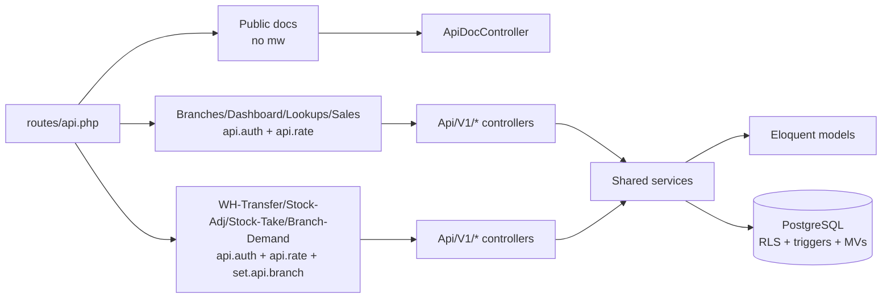
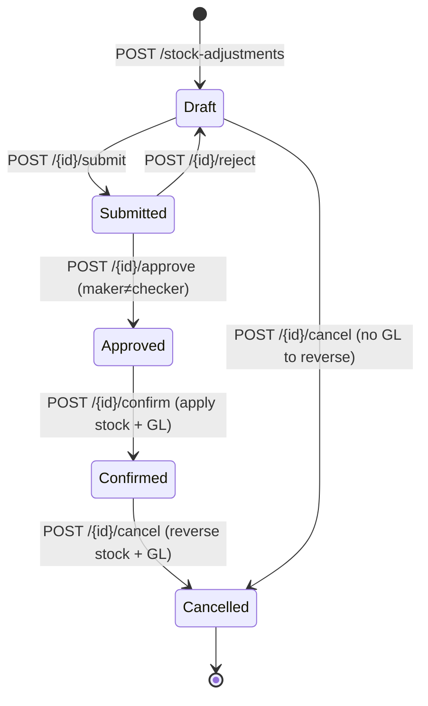

# API Modules — Per-Module Endpoint Catalogue

> **Module:** API / REST v1 — Module Map
> **Audience:** Engineers + AI assistants + API consumers
> **Status:** Draft — pending review (3 CRITICAL + 4 HIGH + 4 MEDIUM + 2 LOW gaps; see §13)
> **Last reviewed:** Phase 17 (API Layer REST v1)
> **Source of truth:** this file is the canonical inventory of every `/api/*` endpoint. `laravel/routes/api.php` (554L) is the route map; the 15 API controllers (`laravel/app/Http/Controllers/Api/V1/*`, 5,500 LOC) are the implementation. Each endpoint row below is traceable to a route declaration line + a controller method + a service dependency.

---

## 1. What is it?

A complete, per-module catalogue of all **101 REST API endpoints** RC_ERP exposes: 1 public
docs page (`GET /api/docs`) + 100 authenticated `/api/v1/*` routes across **14 module
groups**. For each endpoint, this file records: HTTP method, URL pattern, controller method,
required role(s), rate limit (req/min), service dependencies, FormRequest (if any),
ApiResource (if any), and a one-line description.

The 14 module groups are:

1. **Public docs** — 1 endpoint, no auth.
2. **Branches** — 5 endpoints (full CRUD).
3. **Dashboard** — 3 endpoints (read-only summaries).
4. **Lookups** — 6 endpoints (slim dropdown data).
5. **Sales Cart** — 8 endpoints (draft cart management).
6. **Sales Invoices** — 7 endpoints (finalize, update, cancel, credit-check, call-it-a-day).
7. **Sales Challans** — 5 endpoints (godown, issue, cancel).
8. **Sales Returns** — 6 endpoints (create, confirm, reverse, invoice-details).
9. **Customer Payments** — 6 endpoints (create, confirm, cancel, outstanding-invoices).
10. **Commission** — 8 endpoints (rules CRUD + entries + summaries + confirm-period). API-only module (no web mirror).
11. **Warehouse Transfers** — 6 endpoints (CRUD + product-stock).
12. **Stock Adjustments** — 8 endpoints (draft → submit → approve → confirm → cancel lifecycle).
13. **Stock Take** — 17 endpoints (13 session + 4 item; full count-session lifecycle).
14. **Branch Demands** — 15 endpoints (inter-branch demand + settlement + repricing + audit).

---

## 2. Why does it exist?

- **Mobile/AI clients need a complete map.** The interactive docs page (`/api/docs`) and the
  static `API_REFERENCE.md` together document only 23 of 100 `/v1` endpoints (see
  `api-reference-index.md` §4 coverage map). This file is the authoritative source the
  `API_REFERENCE.md` rewrite will draw from.
- **Reviewers need a per-endpoint role + rate matrix.** "Which endpoints can a salesman
  call?" "Which endpoints are capped at 30 req/min?" "Which endpoints require
  `set.api.branch`?" — all answerable from the tables in §7.
- **AI assistants need a service-dependency graph.** "Which service does
  `POST /branch-demands/{id}/reprice` call?" — answerable from the per-module controller
  map.
- **The gap catalogue (§13) needs a stable inventory.** "35 of 101 endpoints have tests"
  (`api-overview.md` §13 G3) is only computable from this file.

---

## 3. When is it used?

- **Adding a new endpoint** — mirror the nearest existing endpoint in the same module group;
  this file's per-module sections show the canonical pattern.
- **Auditing RBAC** — the per-module role column answers "can a salesman do X?".
- **Auditing rate limits** — the per-module rate column answers "is X capped at 30/60/120?".
- **Auditing test coverage** — cross-reference this file's 101 endpoints against the test
  files (see `../coding/testing-standards.md`).
- **Rewriting `API_REFERENCE.md`** — this file is the source of truth; see
  `api-reference-index.md` §6 for the update procedure.

---

## 4. Who uses it?

| Audience | How |
|---|---|
| **API consumer** | Treats §7 as the endpoint discovery index. |
| **Backend engineer** | Mirrors the nearest endpoint when adding a new one; checks §13 for gaps to avoid. |
| **Reviewer** | Checks new endpoints against §7 to confirm role + rate + service + Resource match the module's pattern. |
| **AI assistant** | Reads §7 before generating a new controller method; uses the controller→service→table call-graph (§7.X.9) to trace dependencies. |
| **Auditor** | Uses §7 + §13 (gaps) as the spec for RBAC + rate-limit + test-coverage audits. |

---

## 5. Related modules

- `api-overview.md` — auth, rate limit, route registration, middleware order. Read first.
- `api-conventions.md` — JSON envelope, pagination, error contract, idempotency.
- `api-reference-index.md` — index into `laravel/docs/api/API_REFERENCE.md` + the coverage map.
- `../security/api-security.md` — the 401/403/429 response shapes + the 10-role matrix.
- `../security/branch-context-security.md` — the `set.api.branch` middleware (used by
  Warehouse Transfers, Stock Adjustments, Stock Take, Branch Demands).
- `../coding/request-validation.md` — the 12 API FormRequest classes (Sales × 7 + Stock Take × 5).
- `../coding/service-layer-conventions.md` — why every controller delegates to a service.
- The per-domain module docs:
  - `../sales/sales-cart.md`, `../sales/sales-invoice.md`, `../sales/sales-challan.md`,
    `../sales/sales-return.md`, `../sales/commission.md`
  - `../inventory/stock-adjustment.md`, `../inventory/stock-take.md`,
    `../inventory/warehouse-transfer.md`
  - `../finance/branch-demand.md`
  - `../accounting/customer-payments.md`

---

## 6. Business rules

- **MUST** register every API route in `laravel/routes/api.php` under the `v1` prefix
  (except `GET /api/docs`, which is public).
- **MUST** apply `api.auth` to every `/v1` route (group-level middleware).
- **MUST** apply `api.rate:N` to every `/v1` route, where N is 30 (transactional writes),
  60 (default reads/writes), or 120 (polled reads: dashboard, lookups).
- **MUST** apply `api.auth:role,...` to every destructive endpoint (cancel, reverse, post,
  approve, destroy, reprice). Read endpoints and draft-creation endpoints allow any
  authenticated user.
- **MUST** apply `set.api.branch` to the four RLS-protected module groups (Warehouse
  Transfers, Stock Adjustments, Stock Take, Branch Demands). The other groups enforce branch
  isolation explicitly via `SalesAccess::assertBranchAccessible()` or are intentionally
  cross-branch (Branches master data, Dashboard, Lookups).
- **MUST** delegate to the same service the web controller uses. No service is API-only.
- **MUST** validate input via a FormRequest (preferred) or inline `$request->validate([...])`.
  7 of 14 module groups use FormRequests (Sales × 7 form requests, Stock Take × 5); the other
  7 use inline validation (G6 — `api-conventions.md` §13).
- **MUST** wrap the response in an `ApiResource` (preferred) or hand-roll a slim array
  (acceptable for lookup-style payloads). 19 Resources cover 12 of 15 controllers (G2 —
  `api-conventions.md` §13).
- **MUST** send an `idempotency_token` on the 3 transactional write endpoints that mutate
  stock + GL (G7 — `api-conventions.md` §13).
- **MUST NOT** put business logic in controllers. Controllers do: validate → call service →
  wrap in Resource → return JSON.
- **MUST NOT** write to the DB directly from a controller. Always go through the service,
  which wraps the work in a DB transaction and writes the audit row.

---

## 7. Technical implementation — per-module endpoint tables

### 7.0 Module group middleware summary

| # | Module group | Auth | Rate | RLS GUC | Role gate (writes) |
|---|---|---|---|---|---|
| 1 | Public docs | none | none | no | n/a |
| 2 | Branches | `api.auth` | 60 | no | `admin` (POST/PUT/DELETE) |
| 3 | Dashboard | `api.auth` | 120 | no | any authenticated |
| 4 | Lookups | `api.auth` | 120 | no | any authenticated |
| 5 | Sales Cart | `api.auth` | 30 (writes), 60 (reads) | no | any authenticated (drift G6) |
| 6 | Sales Invoices | `api.auth` | 30 (writes), 60 (reads) | no | any authenticated (drift G6) |
| 7 | Sales Challans | `api.auth` | 30 (writes), 60 (reads) | no | `warehouse_manager,dispatcher,manager,admin` (godown/issue); `manager,admin` (cancel) |
| 8 | Sales Returns | `api.auth` | 30 (writes), 60 (reads) | no | any authenticated (drift G6) |
| 9 | Customer Payments | `api.auth` | 30 (writes), 60 (reads) | no | any authenticated (drift G6) |
| 10 | Commission | `api.auth` | 30 (writes), 60 (reads) | no | `admin` (rule writes + confirm-period) |
| 11 | Warehouse Transfers | `api.auth` + `set.api.branch` | 30 (writes), 60 (reads) | yes | `manager,admin` (confirm/cancel) |
| 12 | Stock Adjustments | `api.auth` + `set.api.branch` | 30 (writes), 60 (reads) | yes | `admin,manager,accountant` (store/submit); `admin,manager` (approve/reject); `admin,accountant` (confirm/cancel) |
| 13 | Stock Take | `api.auth` + `set.api.branch` | 30 (writes), 60 (reads) | yes | `admin,manager` (approve/reject/post/cancel/reverse/re-open) |
| 14 | Branch Demands | `api.auth` + `set.api.branch` | 30 (writes), 60 (reads) | yes | `admin,manager,warehouse_manager` (store/send/confirm-receipt/reject); `admin,manager` (reverse/destroy/reprice) |

---

### 7.1 Public docs (1 endpoint)

**Controller:** `laravel/app/Http/Controllers/Api/ApiDocController.php` (859L).
**Service deps:** none. **Resource:** none (HTML response).
**Coverage gap (G2 — `api-overview.md` §13):** the `endpoints()` method (lines 62–480)
hardcodes 23 endpoint cards; 77 of 100 `/v1` endpoints are NOT on the docs page.

| Method | URL | Controller@method | Role | Rate | Description |
|---|---|---|---|---|---|
| GET | `/api/docs` | `ApiDocController@index` | public | none | Self-contained HTML page with a "Try it" panel. CSS + JS inlined. |

---

### 7.2 Branches (5 endpoints)

**Controller:** `laravel/app/Http/Controllers/Api/V1/BranchApiController.php` (241L).
**Service deps:** none — uses `Branch` model directly.
**FormRequest:** none (inline `$request->validate([...])`).
**Resource:** none — hand-rolls `$branch->toArray()` (G2).
**Routes:** `laravel/routes/api.php:100-112`.

| Method | URL | Controller@method | Role | Rate | Description |
|---|---|---|---|---|---|
| GET | `/api/v1/branches` | `index` | any auth | 60 | List branches (paginated + search `?q=`). |
| GET | `/api/v1/branches/{id}` | `show` | any auth | 60 | Show one branch (includes soft-deleted). |
| POST | `/api/v1/branches` | `store` | `admin` | 60 | Create a branch. |
| PUT | `/api/v1/branches/{id}` | `update` | `admin` | 60 | Update a branch (partial). |
| DELETE | `/api/v1/branches/{id}` | `destroy` | `admin` | 60 | Deactivate (soft-delete). Blocked if active warehouses/employees/open invoices. Returns 400 with `blockers` array. |

**Notes:**
- `destroy` (line 175) calls private `collectDeactivationBlockers()` (line 214) which queries
  `warehouses`, `employees`, `sales_invoices` for active dependents. Returns 400 with
  `{message, blockers: [...]}` if any are found.
- The `Branch` model is NOT RLS-protected (branches are master data; admin-only writes).
- `index` includes `from` + `to` in `meta` — the only paginated controller that does (G3).

---

### 7.3 Dashboard (3 endpoints)

**Controller:** `laravel/app/Http/Controllers/Api/V1/DashboardApiController.php` (167L).
**Service deps:** none — uses raw `DB::table()` queries.
**FormRequest:** none. **Resource:** none (hand-rolled arrays — acceptable, payloads are bespoke).
**Routes:** `laravel/routes/api.php:115-120`.

| Method | URL | Controller@method | Role | Rate | Description |
|---|---|---|---|---|---|
| GET | `/api/v1/dashboard` | `index` | any auth | 120 | Summary: active master-data counts + today's sales + today's collection. |
| GET | `/api/v1/dashboard/sales-trend` | `salesTrend` | any auth | 120 | Last 7 days of sales totals (zero-filled for charting). |
| GET | `/api/v1/dashboard/top-products` | `topProducts` | any auth | 120 | Top 10 products by revenue, last 30 days. |

**Notes:**
- All three use `DB::table()` (not Eloquent) — they aggregate, not load models.
- 120 req/min because the mobile home screen polls them every few seconds.
- `salesTrend` zero-fills missing days so chart libraries draw a continuous line.
- `topProducts` joins `sales_invoice_items` with non-reversed, non-cancelled `sales_invoices`.

---

### 7.4 Lookups (6 endpoints)

**Controller:** `laravel/app/Http/Controllers/Api/V1/LookupApiController.php` (92L).
**Service deps:** none — uses raw `DB::table()` queries.
**FormRequest:** none. **Resource:** none (slim `id + code + name` arrays — acceptable).
**Routes:** `laravel/routes/api.php:123-134`.

| Method | URL | Controller@method | Role | Rate | Description |
|---|---|---|---|---|---|
| GET | `/api/v1/lookups/branches` | `branches` | any auth | 120 | Active branches: `{id, branch_code, branch_name}`. |
| GET | `/api/v1/lookups/warehouses` | `warehouses` | any auth | 120 | Warehouses, optional `?branch_id=X` filter: `{id, warehouse_code, warehouse_name, branch_id}`. |
| GET | `/api/v1/lookups/products` | `products` | any auth | 120 | Active products: `{id, product_code, product_name, unit, sales_rate}`. |
| GET | `/api/v1/lookups/customers` | `customers` | any auth | 120 | Active customers: `{id, customer_code, customer_name, mobile}`. |
| GET | `/api/v1/lookups/suppliers` | `suppliers` | any auth | 120 | Active suppliers: `{id, supplier_code, supplier_name, mobile}`. |
| GET | `/api/v1/lookups/ledgers` | `ledgers` | any auth | 120 | Active ledgers: `{id, ledger_code, ledger_name, account_type, ledger_nature}`. |

**Notes:**
- All return `{data: [...]}` (flat array, no pagination, no `meta`).
- 120 req/min because mobile clients use these to populate every picker.
- These are intentionally NOT RLS-protected — lookups need cross-branch visibility (e.g. a
  salesman creating an invoice needs to see all customers, not just their branch's). Branch
  isolation is enforced later at the transaction boundary.

---

### 7.5 Sales Cart (8 endpoints)

**Controller:** `laravel/app/Http/Controllers/Api/V1/Sales/SalesCartApiController.php` (250L).
**Service deps:** `SalesCartService`, `StockAvailabilityService`.
**FormRequest:** `StoreCartRequest`, `UpdateCartRequest` (under `app/Http/Requests/Api/V1/Sales/`).
**Resource:** `CartResource`.
**Routes:** `laravel/routes/api.php:145-161`.

| Method | URL | Controller@method | Role | Rate | Description |
|---|---|---|---|---|---|
| GET | `/api/v1/sales/cart` | `show` | any auth | 60 | Show the current user's draft cart. |
| POST | `/api/v1/sales/cart` | `store` | any auth | 30 | Add an item to the cart (upsert by product_id). |
| PUT | `/api/v1/sales/cart` | `update` | any auth | 30 | Update cart item qty/discount. |
| DELETE | `/api/v1/sales/cart/{productId}` | `destroy` | any auth | 30 | Remove an item from the cart. |
| POST | `/api/v1/sales/cart/clear` | `clear` | any auth | 30 | Clear all cart items. |
| POST | `/api/v1/sales/cart/validate` | `validateCart` | any auth | 30 | Dry-run validation (no save). Returns availability + price check. |
| POST | `/api/v1/sales/cart/soft-hold` | `softHold` | any auth | 30 | Mark cart as soft-held (draft dispatch hold). |
| GET | `/api/v1/sales/cart/availability` | `availability` | any auth | 60 | Check pipeline-aware stock availability for cart items. |

**Notes:**
- The cart is per-user (one draft per salesman). The service scopes by `Auth::id()`.
- `validateCart` is a dry-run — it does NOT save; it returns the same shape as `show` plus
  per-item availability flags.
- `availability` calls `StockAvailabilityService::checkPipeline()` — the same service the web
  cart uses. See `../sales/sales-cart.md`.
- **Drift (G6):** no route-level `api.auth:salesman,manager,admin` role gate. Branch
  isolation is enforced via `SalesAccess::assertBranchAccessible()` inside the service.

---

### 7.6 Sales Invoices (7 endpoints)

**Controller:** `laravel/app/Http/Controllers/Api/V1/Sales/SalesInvoiceApiController.php` (283L).
**Service deps:** `SalesInvoiceService`, `SalesAccess`.
**FormRequest:** `FinalizeInvoiceRequest` (with `bodyParameters()` for docs).
**Resource:** `SalesInvoiceResource` (+ `SalesInvoiceItemResource`, `SalesInvoiceDispatchResource`).
**Routes:** `laravel/routes/api.php:164-180`.

| Method | URL | Controller@method | Role | Rate | Description |
|---|---|---|---|---|---|
| GET | `/api/v1/sales/invoices` | `index` | any auth | 60 | List invoices (paginated, filters: from_date/to_date/customer_id/branch_id/status/search). |
| GET | `/api/v1/sales/invoices/credit-check` | `creditCheck` | any auth | 60 | Check customer credit limit: `?customer_id=X&amount=Y`. Returns `{data: {customer_id, credit_limit, current_due, would_exceed, can_override}}`. |
| POST | `/api/v1/sales/invoices/call-it-a-day` | `callItADay` | any auth | 30 | Batch mark invoices as "called" (end-of-day). Body: `{invoice_ids: [...]}`. Returns `{message, updated_count}`. |
| GET | `/api/v1/sales/invoices/{id}` | `show` | any auth | 60 | Show one invoice with items, dispatches, customer. |
| POST | `/api/v1/sales/invoices` | `store` | any auth | 30 | **Idempotent** (requires `idempotency_token` UUID). Finalize cart → draft invoice + GL (Dr-AR/Cr-Revenue/Cr-COGS) + stock decrement. Returns 201. |
| PUT | `/api/v1/sales/invoices/{id}` | `update` | any auth | 30 | Update a draft invoice (discount/transport/notes/soft-hold). 409 if not draft. |
| POST | `/api/v1/sales/invoices/{id}/cancel` | `cancel` | any auth | 30 | Cancel/reverse an invoice. Body: `{reason: "..."}` (min 10 chars). Posts reversal journal. |

**Notes:**
- `store` is the crown-jewel endpoint — full idempotency flow (lines 98–132). See
  `api-conventions.md` §11.1 + `api-overview.md` §11.3.
- `store` catches `InvalidArgumentException` → 422; `RuntimeException` → 409 (lines 128–132).
  This is the canonical error-handling pattern — see `api-conventions.md` §10.2.
- `creditCheck` is a dry-run — does NOT save; lets the client pre-validate before finalize.
- `callItADay` resolves the branch from the request (admin can pass `?branch_id=X`; non-admin
  uses their own).
- See `../sales/sales-invoice.md` for the full business workflow.

---

### 7.7 Sales Challans (5 endpoints)

**Controller:** `laravel/app/Http/Controllers/Api/V1/Sales/SalesChallanApiController.php` (221L).
**Service deps:** `SalesChallanService`, `SalesAccess`.
**FormRequest:** `PrepareGodownRequest`, `IssueChallanRequest`.
**Resource:** `SalesChallanResource` (+ `SalesChallanItemResource`).
**Routes:** `laravel/routes/api.php:183-198`.

| Method | URL | Controller@method | Role | Rate | Description |
|---|---|---|---|---|---|
| GET | `/api/v1/sales/challans` | `index` | any auth | 60 | List challans (paginated, filtered). |
| POST | `/api/v1/sales/challans/godown` | `godown` | `warehouse_manager,dispatcher,manager,admin` | 30 | Prepare a godown copy (pre-dispatch). Posts no GL. |
| POST | `/api/v1/sales/challans/issue` | `issue` | `warehouse_manager,dispatcher,manager,admin` | 30 | **Idempotent** (requires `idempotency_token`). Issue a challan (dispatch). Posts COGS journal + stock decrement. |
| GET | `/api/v1/sales/challans/{id}` | `show` | any auth | 60 | Show one challan with items. |
| POST | `/api/v1/sales/challans/{id}/cancel` | `cancel` | `manager,admin` | 30 | Cancel a challan (reversal). Posts reversal journal. |

**Notes:**
- BUG-52 fix (noted in route file comment): godown/issue/cancel previously had no role
  enforcement — any authenticated API user (incl. salesman) could issue a challan. Now
  restricted to `warehouse_manager,dispatcher,manager,admin` (mirrors web routes).
- `issue` is idempotent (lines 152–189) — same pattern as invoice finalize.
- See `../sales/sales-challan.md` for the full business workflow.

---

### 7.8 Sales Returns (6 endpoints)

**Controller:** `laravel/app/Http/Controllers/Api/V1/Sales/SalesReturnApiController.php` (229L).
**Service deps:** `SalesReturnService`, `SalesAccess`.
**FormRequest:** `StoreReturnRequest`.
**Resource:** `SalesReturnResource` (+ `SalesReturnItemResource`).
**Routes:** `laravel/routes/api.php:201-215`.

| Method | URL | Controller@method | Role | Rate | Description |
|---|---|---|---|---|---|
| GET | `/api/v1/sales/returns` | `index` | any auth | 60 | List returns (paginated, filtered). |
| GET | `/api/v1/sales/returns/invoice-details` | `invoiceDetails` | any auth | 60 | Get invoice + challan + stock-transaction details for a return. Query: `?invoice_id=X`. Returns `{data: {invoice_id, invoice_code, customer, challan_id, items: [...]}}`. |
| GET | `/api/v1/sales/returns/{id}` | `show` | any auth | 60 | Show one return with items. |
| POST | `/api/v1/sales/returns` | `store` | any auth | 30 | Create a return (draft). **No idempotency** (G7). |
| POST | `/api/v1/sales/returns/{id}/confirm` | `confirm` | any auth | 30 | Confirm a return — posts reversal journal + restocks at ORIGINAL cost (not moving-average). |
| POST | `/api/v1/sales/returns/{id}/reverse` | `reverse` | any auth | 30 | Reverse a confirmed return. |

**Notes:**
- `confirm` restocks at the **original cost** (not the current moving-average) — this is a
  deliberate business rule. See `../sales/sales-return.md`.
- `invoiceDetails` is a read helper that joins `sales_invoices` + `sales_challans` +
  `stock_transactions` to give the mobile client everything it needs to build a return form.
- **Drift (G6):** no route-level role gate on writes.

---

### 7.9 Customer Payments (6 endpoints)

**Controller:** `laravel/app/Http/Controllers/Api/V1/Sales/CustomerPaymentApiController.php` (279L).
**Service deps:** `CustomerPaymentService`, `SalesAccess`.
**FormRequest:** `StorePaymentRequest`.
**Resource:** `CustomerPaymentResource` (+ `PaymentAllocationResource`).
**Routes:** `laravel/routes/api.php:218-232`.

| Method | URL | Controller@method | Role | Rate | Description |
|---|---|---|---|---|---|
| GET | `/api/v1/sales/payments` | `index` | any auth | 60 | List payments (paginated, filtered). |
| GET | `/api/v1/sales/payments/outstanding-invoices` | `outstandingInvoices` | any auth | 60 | List outstanding invoices for a customer. Query: `?customer_id=X`. Returns `{data: [...]}`. |
| GET | `/api/v1/sales/payments/{id}` | `show` | any auth | 60 | Show one payment with allocations. |
| POST | `/api/v1/sales/payments` | `store` | any auth | 30 | **Idempotent** (requires `idempotency_token`). Create a payment + allocate to invoices. Posts Dr-Cash/Cr-AR. Optional `auto_confirm` flag (lines 146–156). |
| POST | `/api/v1/sales/payments/{id}/confirm` | `confirm` | any auth | 30 | Confirm a draft payment — posts the GL. |
| POST | `/api/v1/sales/payments/{id}/cancel` | `cancel` | any auth | 30 | Cancel a payment — posts reversal. |

**Notes:**
- `store` is idempotent (lines 121–170) — same pattern as invoice finalize.
- `auto_confirm` flag: if true, the payment is confirmed immediately (skips the draft →
  confirm two-step). Default false.
- Web flow auto-confirms on store (no separate confirm route on web); API exposes both.
- See `../accounting/customer-payments.md` for the GL workflow.

---

### 7.10 Commission (8 endpoints) — API-only module

**Controller:** `laravel/app/Http/Controllers/Api/V1/Sales/CommissionApiController.php` (339L).
**Service deps:** `CommissionService`, `SalesAccess`.
**FormRequest:** none (inline `$request->validate([...])` — G6).
**Resource:** none — hand-rolls via `formatRule()` / `formatEntry()` private helpers (G2).
**Routes:** `laravel/routes/api.php:242-265`.

| Method | URL | Controller@method | Role | Rate | Description |
|---|---|---|---|---|---|
| GET | `/api/v1/sales/commission/rules` | `listRules` | any auth | 60 | List rules (paginated). **`per_page` NOT clamped (G4 — OOM risk).** |
| GET | `/api/v1/sales/commission/rules/{id}` | `showRule` | any auth | 60 | Show one rule with tiers, product groups, targets. |
| POST | `/api/v1/sales/commission/rules` | `storeRule` | `admin` | 30 | Create a rule. Body: `{rule_type: flat|tiered|product_group|target_bonus, ...}`. Returns 201. |
| POST | `/api/v1/sales/commission/rules/{id}/deactivate` | `deactivateRule` | `admin` | 30 | Deactivate a rule (sets `effective_to=today`, `is_active=false`). |
| GET | `/api/v1/sales/commission/entries` | `listEntries` | any auth | 60 | List commission entries (paginated). |
| GET | `/api/v1/sales/commission/salesman-summary` | `salesmanSummary` | any auth | 60 | Per-salesman commission summary. Query: `?from_date=&to_date=&salesman_id=`. |
| GET | `/api/v1/sales/commission/branch-summary` | `branchSummary` | any auth | 60 | Per-branch commission summary. Query: `?from_date=&to_date=&branch_id=`. |
| POST | `/api/v1/sales/commission/confirm-period` | `confirmPeriod` | `admin` | 30 | Confirm a commission period (locks entries). Body: `{from_date, to_date, branch_id}`. |

**Notes:**
- **This is the ONLY API-only module** — there is NO web mirror (`routes/web.php` has zero
  commission routes). All commission management is via the API.
- **Zero tests** (G3 + G13) — 8 endpoints completely untested on both surfaces.
- Date format in `formatRule()` / `formatEntry()`: `?->toDateString()` for
  `effective_from`/`effective_to`/`entry_date`; `?->toIso8601String()` for `created_at`.
- See `../sales/commission.md` for the business rules.

---

### 7.11 Warehouse Transfers (6 endpoints)

**Controller:** `laravel/app/Http/Controllers/Api/V1/WarehouseTransfer/WarehouseTransferApiController.php` (394L).
**Service deps:** `WarehouseTransferService`, `StockService`, `StockAvailabilityService`.
**FormRequest:** none (inline validate — G6). **Resource:** `WarehouseTransferResource` (+ `WarehouseTransferItemResource`).
**Routes:** `laravel/routes/api.php:309-325`. **Middleware:** `api.auth` + `set.api.branch`.

| Method | URL | Controller@method | Role | Rate | Description |
|---|---|---|---|---|---|
| GET | `/api/v1/warehouse-transfers` | `index` | any auth | 60 | List transfers (paginated, filtered). |
| GET | `/api/v1/warehouse-transfers/product-stock` | `productStock` | any auth | 60 | Pipeline-aware availability for a product. Query: `?product_id=X&warehouse_id=Y`. |
| GET | `/api/v1/warehouse-transfers/{id}` | `show` | any auth | 60 | Show one transfer with items. |
| POST | `/api/v1/warehouse-transfers` | `store` | any auth | 30 | Create a draft transfer. **No idempotency (G7).** Controller-level same-branch guard (lines 152–165). |
| POST | `/api/v1/warehouse-transfers/{id}/confirm` | `confirm` | `manager,admin` | 30 | Confirm a transfer — moves stock + posts GL (Dr-new-warehouse/Cr-old-warehouse). Confirm-time same-branch guard (lines 271–282). |
| POST | `/api/v1/warehouse-transfers/{id}/cancel` | `cancel` | `manager,admin` | 30 | Cancel a transfer — reverses stock + GL if confirmed. |

**Notes:**
- Same-branch enforcement is at THREE levels: (1) controller (lines 152–165 + 271–282),
  (2) service, (3) DB trigger. See `../inventory/warehouse-transfer.md`.
- `set.api.branch` sets the GUC so RLS on `warehouse_transfers` filters by the user's branch.
- `productStock` calls `StockAvailabilityService::checkPipeline()` — same as the sales cart.
- See `../inventory/warehouse-transfer.md` for the full business workflow.

---

### 7.12 Stock Adjustments (8 endpoints)

**Controller:** `laravel/app/Http/Controllers/Api/V1/StockAdjustment/StockAdjustmentApiController.php` (695L — the largest API controller).
**Service deps:** `StockAdjustmentService`, `StockAdjustmentPolicyService`.
**FormRequest:** none (inline validate — G6). **Resource:** `StockAdjustmentResource` (+ `StockAdjustmentItemResource`).
**Routes:** `laravel/routes/api.php:360-400`. **Middleware:** `api.auth` + `set.api.branch`.

| Method | URL | Controller@method | Role | Rate | Description |
|---|---|---|---|---|---|
| GET | `/api/v1/stock-adjustments` | `index` | any auth | 60 | List adjustments (paginated, filtered: from_date/to_date/status/category/branch_id/search). |
| GET | `/api/v1/stock-adjustments/{id}` | `show` | any auth | 60 | Show one adjustment with items + stock_movements + GL + audit. |
| POST | `/api/v1/stock-adjustments` | `store` | `admin,manager,accountant` | 30 | Create a draft adjustment. Body: `{adjustment_category, branch_id, warehouse_id, items: [...], notes, reason}`. **No idempotency (G7).** |
| POST | `/api/v1/stock-adjustments/{id}/submit` | `submit` | `admin,manager,accountant` | 30 | Submit draft for approval. Maker-checker: approver ≠ submitter. |
| POST | `/api/v1/stock-adjustments/{id}/approve` | `approve` | `admin,manager` | 30 | Approve (maker-checker). Auto-approve below threshold (Phase 3). |
| POST | `/api/v1/stock-adjustments/{id}/reject` | `reject` | `admin,manager` | 30 | Reject → back to draft. |
| POST | `/api/v1/stock-adjustments/{id}/confirm` | `confirm` | `admin,accountant` | 30 | Confirm — apply stock + post GL. Force-confirm (admin only) via `Policy::canForceConfirm` (line 552–557). |
| POST | `/api/v1/stock-adjustments/{id}/cancel` | `cancel` | `admin,accountant` | 30 | Cancel — reverse stock + GL if confirmed (reversal by exact `stock_transaction_id`). |

**Notes:**
- Reuses the SAME `StockAdjustmentService` + `StockAdjustmentPolicyService` as the web
  controller — every Phase 1–7 protection is in force (role gating, category routing,
  maker-checker, audit log, UOM conversion, pipeline-aware availability, reversal safety).
- `serviceError()` helper (line 675–694) maps service exceptions to HTTP status codes.
- This is the model module for defense-in-depth: route-level role gate + controller
  `Policy::canSubmit/Approve/Confirm` re-check + service-level re-check. Other modules
  should match this pattern (G6).
- See `../inventory/stock-adjustment.md` for the full lifecycle.

---

### 7.13 Stock Take (17 endpoints — 13 session + 4 item)

**Controllers:**
- `laravel/app/Http/Controllers/Api/V1/StockTake/StockTakeSessionApiController.php` (423L) — 13 endpoints.
- `laravel/app/Http/Controllers/Api/V1/StockTake/StockTakeItemApiController.php` (283L) — 4 endpoints.

**Service deps:** `StockTakeService`, `StockTakePolicyService`.
**FormRequests:** `StoreSessionRequest`, `SaveCountsRequest`, `ImportCountsRequest`,
`ApproveSessionRequest`, `ReasonRequest` (under `app/Http/Requests/Api/V1/StockTake/`).
**Resources:** `StockTakeResource`, `StockTakeItemResource`, `StockTakeWarehouseResource`.
**Routes:** `laravel/routes/api.php:406-467`. **Middleware:** `api.auth` + `set.api.branch`.

#### 7.13.1 Session endpoints (13)

| Method | URL | Controller@method | Role | Rate | Description |
|---|---|---|---|---|---|
| GET | `/api/v1/stock-take/sessions` | `index` | any auth | 60 | List sessions (paginated, filtered: status/warehouse_id/branch_id). |
| GET | `/api/v1/stock-take/sessions/{id}` | `show` | any auth | 60 | Show one session with warehouses + items. |
| POST | `/api/v1/stock-take/sessions` | `store` | any auth | 30 | Create a draft session. Body: `{branch_id, warehouse_ids: [...], session_date, notes}`. **No idempotency (G7).** |
| POST | `/api/v1/stock-take/sessions/{id}/setup/{warehouseId}` | `setup` | any auth | 30 | Set up counts for a warehouse (loads products for counting). Heavier query — 30/min. |
| PUT | `/api/v1/stock-take/sessions/{id}/counts/{warehouseId}` | `saveCounts` | any auth | 30 | Save physical counts for a warehouse. Body: `{counts: [{product_id, physical_qty, ...}]}`. |
| POST | `/api/v1/stock-take/sessions/{id}/import/{warehouseId}` | `importCounts` | any auth | 30 | CSV import (multipart). Parses via private `parseCsv()` (line 385–422). |
| POST | `/api/v1/stock-take/sessions/{id}/submit` | `submit` | any auth | 30 | Submit for approval (counter → approver). |
| POST | `/api/v1/stock-take/sessions/{id}/approve` | `approve` | `admin,manager` | 30 | Approve the count. |
| POST | `/api/v1/stock-take/sessions/{id}/reject` | `reject` | `admin,manager` | 30 | Reject → back to counting. |
| POST | `/api/v1/stock-take/sessions/{id}/post` | `post` | `admin,manager` | 30 | Post — apply variances + GL (Dr/Cr-Inventory vs Stock-Take-Variance). Destructive. |
| POST | `/api/v1/stock-take/sessions/{id}/cancel` | `cancel` | `admin,manager` | 30 | Cancel (draft/counting only). |
| POST | `/api/v1/stock-take/sessions/{id}/reverse` | `reverse` | `admin,manager` | 30 | Reverse a posted session → reversed. Posts reversal journals. |
| POST | `/api/v1/stock-take/sessions/{id}/re-open` | `reOpen` | `admin,manager` | 30 | Re-open a reversed session → counting. |

#### 7.13.2 Item endpoints (4)

| Method | URL | Controller@method | Role | Rate | Description |
|---|---|---|---|---|---|
| GET | `/api/v1/stock-take/sessions/{id}/items` | `index` (item controller) | any auth | 60 | List items. Query: `?warehouse_id=X&variance_only=true`. Uses `DB::table` (not Eloquent) — line 53–57. |
| GET | `/api/v1/stock-take/sessions/{id}/items/{itemId}` | `show` (item controller) | any auth | 60 | Show one item. |
| PUT | `/api/v1/stock-take/sessions/{id}/items/{itemId}` | `update` (item controller) | any auth | 30 | Autosave one count. |
| GET | `/api/v1/stock-take/sessions/{id}/variance` | `variance` (item controller) | any auth | 60 | Variance report + summary. |

**Notes:**
- The full count-session lifecycle: `draft → counting → submitted → approved → posted →
  reversed → (re-open → counting)`. See `../inventory/stock-take.md` for the state machine.
- `post` is destructive — it applies variances and posts GL. Cannot be undone except via
  `reverse`.
- `importCounts` parses CSV via `parseCsv()` (lines 385–422) — handles BOM, header row,
  quoted fields. Mobile clients can also use `saveCounts` for inline entry.
- Items controller uses `DB::table` (not Eloquent) for the list query (line 53–57) —
  performance optimisation for large count sessions.

---

### 7.14 Branch Demands (15 endpoints)

**Controller:** `laravel/app/Http/Controllers/Api/V1/BranchDemand/BranchDemandApiController.php` (745L).
**Service deps:** `BranchDemandService`, `BranchIntercompanyService`, `BranchDemandRepricingService`, `BranchDemandAuditService`, `StockService`, `StockAvailabilityService`.
**FormRequest:** none (inline validate — G6). **Resource:** `BranchDemandResource`.
**Routes:** `laravel/routes/api.php:505-552`. **Middleware:** `api.auth` + `set.api.branch`.

| Method | URL | Controller@method | Role | Rate | Description |
|---|---|---|---|---|---|
| GET | `/api/v1/branch-demands` | `index` | any auth | 60 | List demands (paginated, filtered). Non-admins see only their branch's demands. |
| GET | `/api/v1/branch-demands/{id}` | `show` | any auth | 60 | Show one demand with items + audit. |
| GET | `/api/v1/branch-demands/outstanding` | `outstanding` | any auth | 60 | Outstanding demands (un-settled). |
| GET | `/api/v1/branch-demands/ledger-history` | `ledgerHistory` | any auth | 60 | Intercompany ledger history. |
| GET | `/api/v1/branch-demands/settlement-preview` | `settlementPreview` | any auth | 60 | Dry-run settlement preview (FIFO). |
| GET | `/api/v1/branch-demands/{id}/audit` | `audit` | any auth | 60 | Audit trail for one demand. |
| GET | `/api/v1/branch-demands/warehouses/{branchId}` | `warehouses` | any auth | 60 | Warehouses for a branch (helper for the create form). |
| GET | `/api/v1/branch-demands/product-stock/{productId}/{branchId}` | `productStock` | any auth | 60 | Pipeline-aware availability for a product at a branch. |
| POST | `/api/v1/branch-demands` | `store` | `admin,manager,warehouse_manager` | 30 | Create a demand. **No idempotency (G7).** Branch isolation check (line 184–188). |
| POST | `/api/v1/branch-demands/{id}/send` | `send` | `admin,manager,warehouse_manager` | 30 | Send a demand (draft → sent). Posts intercompany journals (dual creditor + debtor). |
| POST | `/api/v1/branch-demands/{id}/confirm-receipt` | `confirmReceipt` | `admin,manager,warehouse_manager` | 30 | Confirm receipt (sent → received). Required before reversal (Phase 5). |
| POST | `/api/v1/branch-demands/{id}/reverse` | `reverse` | `admin,manager` | 30 | Reverse a demand. Posts reversal. Blocked if receipt not confirmed. |
| POST | `/api/v1/branch-demands/{id}/reject` | `reject` | `admin,manager,warehouse_manager` | 30 | Reject a demand. |
| DELETE | `/api/v1/branch-demands/{id}` | `destroy` | `admin,manager` | 30 | Delete a demand (draft only). |
| POST | `/api/v1/branch-demands/{id}/reprice` | `reprice` | `admin,manager` | 30 | Reprice a demand. Body: `{new_total, reason}`. Posts GL adjustment. Returns full repricing sub-object (line 547–557). |

**Notes:**
- This is the most complex API module — 6 service dependencies, 15 endpoints, full
  intercompany + FIFO settlement + repricing + audit.
- `currentBranchId()` helper (line 81–96) resolves the user's branch (admin can pass
  `?branch_id=X`; non-admin uses their own).
- `settlementPreview` is a dry-run — does NOT save; lets the client preview the FIFO
  settlement before executing.
- Reuses the SAME services as the web controller — every Phase 1–8 protection is in force
  (cross-branch demand creation, warehouse selection, dual journals, FIFO settlement,
  receipt-confirmation-before-reversal, weekly audit, price range + repricing, anti-gaming).
- See `../finance/branch-demand.md` for the full business workflow.

---

## 8. Important database tables

The API reads/writes the same 66 tables the web UI does. No API-specific tables exist. The
per-module table map:

| Module | Primary tables |
|---|---|
| Branches | `branches` |
| Dashboard | `branches, warehouses, products, customers, suppliers, employees, sales_invoices, customer_payments` |
| Lookups | `branches, warehouses, products, customers, suppliers, ledgers` |
| Sales Cart | `sales_carts, sales_cart_items` (draft) |
| Sales Invoices | `sales_invoices, sales_invoice_items, sales_invoice_dispatches, sales_invoice_dispatchers, customers, journal_entries, stock_transactions` |
| Sales Challans | `sales_challans, sales_challan_items, sales_invoices, journal_entries, stock_transactions` |
| Sales Returns | `sales_returns, sales_return_items, sales_invoices, journal_entries, stock_transactions` |
| Customer Payments | `customer_payments, payment_allocations, sales_invoices, customers, journal_entries` |
| Commission | `commission_rules, commission_rule_tiers, commission_rule_product_groups, commission_rule_targets, commission_entries` |
| Warehouse Transfers | `warehouse_transfers, warehouse_transfer_items, stock_transactions, journal_entries` |
| Stock Adjustments | `stock_adjustments, stock_adjustment_items, stock_transactions, journal_entries, stock_adjustment_audits` |
| Stock Take | `stock_take_sessions, stock_take_warehouses, stock_take_items, stock_transactions, journal_entries, stock_take_audits` |
| Branch Demands | `branch_demands, branch_demand_items, journal_entries, stock_transactions, branch_demand_audits, customer_payments, money_transfers` |
| Auth | `users` (api_token), `employees` (role) |

See `../database/schema-overview.md` + `../database/er-diagrams.md` for the full schema.

---

## 9. Related services

Per-module service dependencies are listed in §7.X headers. The full service inventory:

- `SalesCartService`, `StockAvailabilityService` (shared by Cart + Warehouse Transfer + Branch Demand)
- `SalesInvoiceService`, `SalesAccess` (shared by 5 sales controllers)
- `SalesChallanService`, `SalesReturnService`, `CustomerPaymentService`, `CommissionService`
- `StockAdjustmentService` + `StockAdjustmentPolicyService`
- `StockTakeService` + `StockTakePolicyService`
- `WarehouseTransferService` + `StockService`
- `BranchDemandService` + `BranchIntercompanyService` + `BranchDemandRepricingService` + `BranchDemandAuditService`

**No service is API-only** — every service is shared with the web controller. This is the
single-source-of-truth guarantee: business rules cannot diverge between surfaces.

See `../coding/service-layer-conventions.md` for the conventions.

---

## 10. Related models

The API reads/writes 60+ Eloquent models. The per-module model map mirrors §8 (every table
has a model). Key models the API touches:

- `User` (auth, `api_token`), `Employee` (role), `Branch`, `Warehouse`, `Product`,
  `Customer`, `Supplier`, `Ledger`
- `SalesCart`, `SalesInvoice`, `SalesInvoiceItem`, `SalesChallan`, `SalesReturn`,
  `CustomerPayment`, `PaymentAllocation`
- `CommissionRule`, `CommissionEntry`
- `WarehouseTransfer`, `StockAdjustment`, `StockTakeSession`, `BranchDemand`
- `StockTransaction` (the inventory ledger), `JournalEntry` (the GL), `JournalEntryLine`

See `../coding/model-conventions.md` for scopes, traits, casts, relationships.

---

## 11. Important workflows

### 11.1 Module group → middleware → controller → service call-graph



### 11.2 Sales module — full order-to-cash via the API

```mermaid
sequenceDiagram
    participant M as Mobile salesman
    participant API as /api/v1
    participant Svc as Sales services
    participant DB as PostgreSQL

    M->>API: GET /lookups/products
    API-->>M: product list
    M->>API: POST /sales/cart {product_id, qty}
    API->>Svc: SalesCartService::add()
    Svc->>DB: upsert sales_cart_items
    API-->>M: 200 {data: cart}
    M->>API: POST /sales/cart/validate
    API->>Svc: StockAvailabilityService::checkPipeline()
    API-->>M: 200 {data: {valid, availability_flags}}
    M->>API: GET /sales/invoices/credit-check?customer_id=X&amount=Y
    API-->>M: 200 {data: {would_exceed, can_override}}
    M->>API: POST /sales/invoices {idempotency_token: UUID, customer_id, ...}
    API->>Svc: SalesInvoiceService::finalizeFromCart()
    Svc->>DB: BEGIN; Dr-AR / Cr-Revenue / Cr-COGS; decrement stock; write audit; COMMIT
    API-->>M: 201 {data: invoice, message}
    Note over M,API: later — dispatch
    M->>API: POST /sales/challans/godown {invoice_id}
    API->>Svc: SalesChallanService::prepareGodown()
    API-->>M: 200 {data: challan}
    M->>API: POST /sales/challans/issue {idempotency_token, challan_id}
    API->>Svc: SalesChallanService::issue()
    Svc->>DB: BEGIN; Dr-COGS / Cr-Inventory; decrement stock; write audit; COMMIT
    API-->>M: 201 {data: issued_challan}
```

### 11.3 Stock Adjustment — full maker-checker lifecycle via the API



---

## 12. Known edge cases

- **Sales Cart is per-user.** Two salesmen on the same branch have separate carts. The
  service scopes by `Auth::id()`, not by branch.
- **`POST /sales/invoices` clears the cart on success.** A failed finalize (422/409) does
  NOT clear the cart — the client can fix the input and retry.
- **`POST /sales/returns/{id}/confirm` restocks at ORIGINAL cost.** Not the current
  moving-average. This is a deliberate business rule — see `../sales/sales-return.md`.
- **`POST /sales/payments` with `auto_confirm=true` skips the draft state.** The web flow
  always auto-confirms; the API exposes both paths.
- **Commission `listRules` does not clamp `per_page` (G4).** A malicious client can request
  `?per_page=999999` and OOM the server. Fix: add `min(..., 100)`.
- **Warehouse Transfer same-branch enforcement is at 3 levels.** Controller (lines 152–165 +
  271–282), service, DB trigger. A new endpoint that forgets the controller check still gets
  blocked by the service + trigger — but the error message will be less helpful.
- **Stock Adjustment `confirm` with `force=true` is admin-only.** The route allows
  `admin,accountant`; the controller re-checks `Policy::canForceConfirm` (line 552–557); the
  service re-checks again. Three layers of defense.
- **Stock Take `post` is irreversible except via `reverse`.** There is no "unpost". The
  `reverse` endpoint posts reversal journals and moves the session to `reversed`; `re-open`
  then moves it back to `counting` for a recount.
- **Branch Demand `reverse` is blocked if receipt is not confirmed.** Phase 5 rule — see
  `../finance/branch-demand.md`. The client must `confirm-receipt` before `reverse`.
- **Branch Demand `reprice` posts a GL adjustment.** It does NOT reverse the original — it
  posts a new adjusting journal entry. The original demand's journals are untouched.
- **`set.api.branch` only runs on 4 of 14 module groups.** The Sales module groups enforce
  branch isolation via `SalesAccess::assertBranchAccessible()` in the controller. A new Sales
  endpoint that forgets this call would silently leak cross-branch data (G6).
- **Idempotency cache is per-process.** If the app runs on multiple workers behind a load
  balancer and `CACHE_STORE=file`, the idempotency cache is per-worker — a retry hitting a
  different worker would create a duplicate. **Mitigation:** use `CACHE_STORE=redis` in
  production (G7).

---

## 13. Future improvements (gap catalogue)

Gap IDs are stable references shared with `api-overview.md` §13 and `api-conventions.md` §13.

| ID | Severity | Gap | Recommended fix |
|---|---|---|---|
| ~~G1~~ ✅ | ~~CRITICAL~~ RESOLVED | `API_REFERENCE.md` documents only 14 of 100 `/v1` endpoints (86% drift). See `api-reference-index.md` §4. | Rewrite `API_REFERENCE.md` from this file's per-module tables. |
| ~~G2~~ ✅ | ~~CRITICAL~~ RESOLVED | `ApiDocController::endpoints()` hardcodes 23 of 100 endpoint cards (77% drift). | Generate from `routes/api.php` reflection, OR add a test that fails on drift. |
| G3 | CRITICAL | ZERO tests for 8 of 14 modules: Sales Cart, Sales Invoices, Sales Challans, Sales Returns, Customer Payments, Commission, Warehouse Transfers, Stock Adjustments = 56 endpoints untested. | Add a `*_ApiTest.php` per module. |
| G4 | HIGH | `CommissionApiController::listRules` does not clamp `per_page` (OOM risk). | Add `min((int) ..., 100)`. |
| G5 | MEDIUM | `BranchDemandApiTest` hand-rolls token issuance 16× instead of using `IssuesApiTokens`. | Refactor to use the helper. |
| G6 | HIGH | Role-gate inconsistency: Sales Cart/Invoices/Returns/Payments write endpoints have NO route-level `api.auth:role` gate. | Add `api.auth:salesman,manager,admin` to those routes. |

> ✅ RESOLVED in commit 7fc2882 (G-001, G-004) — API-6. `ApiDocController::endpoints()` now iterates `Route::getRoutes()` and emits a card for every registered `/api/v1/*` route (100/100). Rich metadata merged from a `catalogue()` lookup for the 23 hand-documented endpoints; the other 77 render a minimal card. `laravel/docs/api/API_REFERENCE.md` rewritten from 14→100 endpoints (588→1090 lines) with compact per-module tables sourced from this file's §7. A drift-guard test (`test_api_docs_card_count_matches_v1_route_count`) asserts the card count equals the v1 route count. Closes G1 + G2.

> ✅ RESOLVED in commit c4acdb0 (G-086, cross-ref G-087) — Added `api.auth:salesman,manager,admin` route middleware to the Sales API write endpoints (POST/PUT/DELETE only — reads keep `api.auth` + `api.rate` only). Two route groups were missing the gate entirely (Cart + Customer Payments); three were already partially fixed by prior gaps:
> - **Sales Cart** (5 write routes, newly added): `POST /sales/cart` (store), `PUT /sales/cart` (update), `DELETE /sales/cart/{productId}` (destroy), `POST /sales/cart/clear`, `POST /sales/cart/soft-hold`. Read-like `POST /sales/cart/validate` + `GET /sales/cart/availability` keep auth-only (no state mutation).
> - **Customer Payments** (3 write routes, newly added): `POST /sales/payments` (store), `POST /sales/payments/{id}/confirm`, `POST /sales/payments/{id}/cancel`. NOTE: the task spec referenced a `reverse` route; the actual route is `cancel` (same semantic — reverses the payment by posting a reversal JE).
> - **Sales Invoices** (already had `api.auth:salesman,manager,admin` from G-166 — store/update/cancel).
> - **Sales Returns** (already had per-action role middleware from G-167 — store=salesman,manager,admin; confirm=warehouse_manager,accountant,manager,admin; reverse=accountant,manager,admin).
> - **Sales Challans godown/issue** (already had `api.auth:warehouse_manager,dispatcher,manager,admin` from BUG-52).
> Per the task spec's "preserve ALL existing middleware — only ADD new middleware" constraint, the existing per-action matrices on Invoices/Returns/Challans were left intact (they are MORE granular than the single `salesman,manager,admin` floor and reflect the web RBAC). The Cart + Payments additions use the simpler matrix because they have no per-action differentiation in the web routes either. `SalesAccess::assertBranchAccessible()` remains the controller-level backstop. See `routes/api.php:144-167, 238-262`. Sub-problem A (Session 6, Security/RLS cluster). Closes both G-086 + G-087 (cross-referenced).
| ~~G7~~ ✅ | ~~HIGH~~ RESOLVED | ~~Idempotency implemented on only 3 of ~14 transactional write endpoints. See `api-conventions.md` §11.3.~~ **PURCHASING-API-3** retrofitted the 4 High-risk endpoints (`POST /sales/returns`, `/stock-adjustments`, `/warehouse-transfers`, `/branch-demands`) with an optional `idempotency_token` (UUID) + 5-min cache lookup. **PURCHASING-API-4** retrofitted the 4 Medium-risk endpoints (`POST /sales/challans/godown`, `/branch-demands/{id}/send`, `/branch-demands/{id}/reprice`, `/stock-take/sessions`) with the same pattern; path-parameterized endpoints namespace the cache key with the demand id. Total idempotent endpoints: 11 of ~14 (3 required + 8 optional). Only Low-risk endpoints (second-call hits 409) intentionally skip the pattern. See `api-conventions.md` §11.1 + §11.3. | Fully resolved — only Low-risk endpoints intentionally skipped. |
| G8 | MEDIUM | No API test verifies `set.api.branch` enforces RLS for the 4 protected modules. | Add a `test_non_admin_cannot_see_other_branch_*` test per module. |

> ✅ RESOLVED in commit d617c14 (G-198, cross-ref G-199) — Created `tests/Feature/Api/V1/BranchIsolationApiTest.php` (3 test methods) verifying that the `set.api.branch` route middleware enforces RLS at the API level for non-admin users. The test targets the `branch-demands` route group (`routes/api.php:532`, one of the actual 4 `set.api.branch`-protected groups — the others are `stock-take`, `warehouse-transfers`, `stock-adjustments`). Test scenarios: (1) `test_non_admin_cannot_see_other_branch_demands_in_list` — a salesman in Branch A listing `/api/v1/branch-demands` only sees demands where Branch A is a party (from OR to); a demand between Branch B and Branch C is NOT in the response (RLS hides it at the DB level). (2) `test_non_admin_cannot_access_other_branch_demand_by_id` — a salesman in Branch A gets 404 when querying a demand between Branch B and Branch C by id (RLS hides the row → controller returns notFound). (3) `test_admin_can_see_all_branches_demands` — admin sees ALL demands regardless of branch (RLS `app.is_admin = true` bypass policy fires). **DEVIATION from task spec template:** the template targeted the Sales API (`/sales/invoices`, `/sales/cart`, `/sales/returns`, `/customer-payments`) and asserted those routes use `set.api.branch`. That assertion was incorrect — per the actual `routes/api.php`, `set.api.branch` is ONLY applied to 4 inventory modules (NOT Sales; Sales uses `SalesAccess::assertBranchAccessible()` at the controller level, per `api-modules.md:703-705`). The `SetApiBranchContext` middleware reads `Auth::user()->getBranchId()` from the authenticated user's Employee record — there is NO `X-Branch-Id` header (the template's header was unused). Per the task spec's instruction to "READ the existing test patterns FIRST and adapt — do NOT blindly copy the template above if the real helper signatures or factory definitions differ", the test was rewritten to target `branch-demands` using the existing `InsertsBranchDependencies::insertBranchDemand` helper (direct `DB::table('branch_demands')->insertGetId(...)` — same pattern as `BranchDemandApiTest`) because `branch_demands` has many NOT NULL + FK constraints that factories don't easily satisfy. The test file's class docblock documents this deviation in full. NOTE: the test is written but UNVERIFIED — no PHP binary + no PostgreSQL with the `app.branch_id` GUC configured in the sandbox; visually verified against the existing `BranchApiTest` + `BranchDemandApiTest` patterns + the actual `SetApiBranchContext` middleware + the actual `routes/api.php:532` route group. Sub-problem E (Session 7, Security/RLS cluster — FINAL session). Closes both G-198 + G-199 by the same test file.
| G9 | MEDIUM | `ApiRateLimitTest` does not verify the 30 req/min transactional write cap. | Add a `test_write_endpoint_enforces_30_per_minute` test. |
| G10 | LOW | `ApiDocTest` asserts `"Endpoints (14)"` but the page shows 23 cards. | Update the assertion. |
| G11 | MEDIUM | No API tests for idempotency replay. | Add `test_finalize_with_same_idempotency_token_returns_idempotent_replay`. |
| G12 | MEDIUM | `POST /branch-demands/{id}/reprice` has only a validation-path test. | Add a happy-path test. |
| G13 | LOW | Commission module has NO web mirror AND no API tests — 8 endpoints untested on both surfaces. | Add `CommissionApiTest.php`. |

---

## 14. Verification commands

```bash
# List every API route with method + URI + middleware + controller@method.
php artisan route:list --path=api --columns=method,uri,middleware,action

# Count endpoints per module group.
php artisan route:list --path=api/v1 --columns=uri | \
  awk -F/ '{print $4 "/" $5}' | sort | uniq -c | sort -rn

# Verify a specific endpoint's middleware stack.
php artisan route:list --path=api/v1/stock-adjustments --columns=method,uri,middleware

# Smoke-test one endpoint per module (replace <token>).
for ep in branches dashboard "dashboard/sales-trend" "lookups/products" \
          "sales/cart" "sales/invoices" "sales/challans" "sales/returns" \
          "sales/payments" "sales/commission/rules" "warehouse-transfers" \
          "stock-adjustments" "stock-take/sessions" "branch-demands"; do
  code=$(curl -sS -o /dev/null -w '%{http_code}' \
        -H "Authorization: Bearer <token>" -H "Accept: application/json" \
        "https://erp.example.com/api/v1/$ep")
  echo "$code  /api/v1/$ep"
done
# expected: 200 for each (or 401 if token is bad)

# Run the API test suite (35 of 101 endpoints covered today).
php artisan test --filter='Api'
```

---

## 15. Cross-reference summary

| If you need to know… | read |
|---|---|
| Every endpoint in every module | this file §7 |
| The middleware stack per module group | this file §7.0 + §7.X headers |
| The controller → service → table call-graph per module | this file §7.X (Notes) + §9 |
| Which endpoints are tested | this file §13 G3 + `../coding/testing-standards.md` |
| Which endpoints need idempotency (and don't have it) | this file §13 G7 + `api-conventions.md` §11.3 |
| The full gap catalogue | this file §13 |
| The JSON envelope / pagination / error shape | `api-conventions.md` |
| The auth / rate-limit / RLS middleware chain | `api-overview.md` §7 |
| The coverage map for `API_REFERENCE.md` | `api-reference-index.md` §4 |
| The business workflow behind each module | the per-domain docs (§5 links) |

---

*End of `api-modules.md`. For the API overview, see `api-overview.md`. For the response-shape
+ error contract, see `api-conventions.md`. For the `API_REFERENCE.md` coverage map + update
procedure, see `api-reference-index.md`.*
