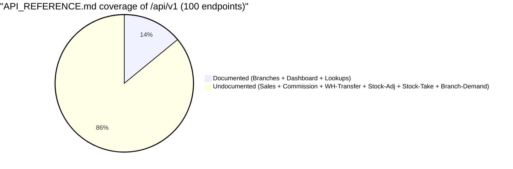

# API Reference Index

> **Module:** API / REST v1 — Reference Index
> **Audience:** Engineers + AI assistants + API consumers + maintainers of `laravel/docs/api/API_REFERENCE.md`
> **Status:** Draft — pending review (1 CRITICAL gap; see §5)
> **Last reviewed:** Phase 17 (API Layer REST v1)
> **Source of truth:** this file is the index into `laravel/docs/api/API_REFERENCE.md` (588L, the hand-written reference). It maps every `/api/*` endpoint to its documentation status, flags the 86% coverage drift, and defines the update procedure maintainers MUST follow when adding or changing endpoints.

---

## 1. What is it?

An **index** — not a full reference. The full per-endpoint reference lives in
`laravel/docs/api/API_REFERENCE.md` (588L, hand-written markdown). That file was authored in
Phase 13 (initial 14 endpoints) and lightly updated in Phase 18 (added the `api:token`
command section + the interactive `/api/docs` page mention). It has NOT been updated for
Phase 8 (Sales), Phase 9 (Stock Adjustment), Phase 10 (Branch Demand), Phase 11 (Stock Take
expansion), Task 37 (Commission), or Warehouse Transfer Phase 8.

This index file:

1. Maps every `/api/*` endpoint to a documentation status (documented / stub / missing).
2. Quantifies the coverage drift (86% of `/v1` endpoints are undocumented in
   `API_REFERENCE.md`).
3. Defines the **update procedure** maintainers MUST follow when adding or changing
   endpoints, so the drift never grows again.
4. Cross-references the canonical source-of-truth tables in `api-modules.md` §7, which ARE
   complete (101 of 101 endpoints catalogued).

This file is intentionally lighter than the other three `api/*.md` files — it is an index and
a process doc, not a §6 mandatory-13-question module reference.

---

## 2. Why does it exist?

- **`API_REFERENCE.md` is stale and the drift is invisible.** A reader who opens
  `API_REFERENCE.md` sees 14 well-documented endpoints and assumes that's the whole API. It
  is not — it is 14% of the API. This index makes the drift explicit and quantified.
- **Maintainers need a checklist.** When a new endpoint is added, the developer updates
  `routes/api.php`, the controller, the service, the test (sometimes), and the API docs page
  (rarely). `API_REFERENCE.md` is the most-skipped artifact. This file's §6 update procedure
  makes skipping it a visible process gap.
- **The interactive `/api/docs` page has the same drift.** `ApiDocController::endpoints()`
  hardcodes 23 of 100 endpoint cards. This index flags that as a parallel gap (G2 in
  `api-overview.md` §13) and recommends generating both artifacts from the same source.
- **AI assistants need a single source of truth.** An AI generating a new endpoint should
  read `api-modules.md` §7 (the canonical per-module tables) and update `API_REFERENCE.md`
  per §6 of this file. Without this index, the AI would copy the nearest neighbor in
  `API_REFERENCE.md` and propagate the staleness.

---

## 3. When is it used?

- **When a new endpoint is added** — the maintainer follows §6 to update
  `API_REFERENCE.md` and (ideally) the `ApiDocController::endpoints()` catalogue.
- **When an existing endpoint changes** (URL, role, payload, response shape) — the maintainer
  updates the corresponding section in `API_REFERENCE.md` and logs the change in the file's
  Changelog table.
- **When auditing API documentation coverage** — §4 is the coverage map; it is the single
  source of truth for "which endpoints are documented?".
- **When onboarding a new API consumer** — point them at `API_REFERENCE.md` for the
  hand-written examples, then at `api-modules.md` §7 for the complete endpoint list.

---

## 4. Who uses it?

| Audience | How |
|---|---|
| **Maintainer of `API_REFERENCE.md`** | Follows §6 on every endpoint add/change. Checks §4 coverage map before signing off. |
| **API consumer** | Uses §4 to find which endpoints have hand-written examples; falls back to `api-modules.md` §7 for the rest. |
| **Reviewer** | Checks that a PR adding an endpoint also updates `API_REFERENCE.md` (per §6). |
| **AI assistant** | Reads §4 + §6 before generating a new endpoint; updates `API_REFERENCE.md` as part of the same task. |
| **Auditor** | Uses §4 coverage stats as a KPI ("documentation coverage = X%"). |

---

## 5. Related modules

- `api-overview.md` — auth, rate limit, route map. Read first.
- `api-conventions.md` — JSON envelope, pagination, error contract. The reference doc's
  examples should follow these conventions.
- `api-modules.md` — the canonical per-module endpoint tables (101 of 101 endpoints). The
  source of truth that `API_REFERENCE.md` should mirror.
- `../security/api-security.md` — the 401/403/429 response shapes; `API_REFERENCE.md`'s
  "Error responses" section cross-references these.
- `../coding/request-validation.md` — the 12 API FormRequest classes; `API_REFERENCE.md`'s
  per-endpoint "Request body" tables should match the FormRequest `rules()`.

---

## 6. Business rules

- **MUST** update `API_REFERENCE.md` whenever a new `/api/v1/*` endpoint is added or an
  existing endpoint's URL / role / payload / response shape changes. See §7 update procedure.
- **MUST** append a row to `API_REFERENCE.md`'s Changelog table (at the bottom of the file)
  on every update: date, phase/version, one-line summary.
- **MUST** keep `API_REFERENCE.md`'s per-endpoint "Request body" table consistent with the
  FormRequest `rules()` (or the inline `$request->validate([...])` for the 6 modules without
  FormRequests).
- **MUST** keep `API_REFERENCE.md`'s "Required role" column consistent with the route's
  `api.auth:role,...` middleware parameter.
- **MUST** keep `API_REFERENCE.md`'s "Rate limiting" mention consistent with the route's
  `api.rate:N` middleware parameter.
- **SHOULD** generate `API_REFERENCE.md` from `routes/api.php` + FormRequest reflection
  eventually (G1 — §8). Until then, hand-written is acceptable but MUST follow §7.
- **MUST NOT** document an endpoint in `API_REFERENCE.md` that does not exist in
  `routes/api.php` (no aspirational docs).
- **MUST NOT** document an endpoint in `api-modules.md` §7 that does not exist in
  `routes/api.php` (this file's §7 tables are the cross-check).

---

## 7. Coverage map — `API_REFERENCE.md` vs actual endpoints

### 7.1 Summary stats

| Metric | Value |
|---|---|
| Total `/api/*` endpoints | 101 (1 public + 100 `/v1`) |
| Documented in `API_REFERENCE.md` | 14 (all `/v1`: 5 Branches + 3 Dashboard + 6 Lookups) |
| Documented on `/api/docs` page (`ApiDocController::endpoints()`) | 23 (14 above + 9 Stock Take subset) |
| Documented in `api-modules.md` §7 (this knowledge base) | 101 (complete) |
| `API_REFERENCE.md` coverage of `/v1` | 14.0% (14/100) — **86% drift** |
| `/api/docs` page coverage of `/v1` | 23.0% (23/100) — **77% drift** |
| Test coverage of `/v1` | 34.7% (35/101) — see `api-overview.md` §13 G3 |

### 7.2 Per-module documentation status

| Module group | Endpoints | In `API_REFERENCE.md` | On `/api/docs` page | In `api-modules.md` §7 |
|---|---|---|---|---|
| Public docs (`GET /api/docs`) | 1 | mentioned in intro | n/a (it IS the page) | §7.1 |
| Branches | 5 | all 5 | all 5 | §7.2 |
| Dashboard | 3 | all 3 | all 3 | §7.3 |
| Lookups | 6 | all 6 | all 6 | §7.4 |
| Sales Cart | 8 | 0 | 0 | §7.5 |
| Sales Invoices | 7 | 0 | 0 | §7.6 |
| Sales Challans | 5 | 0 | 0 | §7.7 |
| Sales Returns | 6 | 0 | 0 | §7.8 |
| Customer Payments | 6 | 0 | 0 | §7.9 |
| Commission | 8 | 0 | 0 | §7.10 |
| Warehouse Transfers | 6 | 0 | 0 | §7.11 |
| Stock Adjustments | 8 | 0 | 0 | §7.12 |
| Stock Take (sessions + items) | 17 | 0 | 9 (subset) | §7.13 |
| Branch Demands | 15 | 0 | 0 | §7.14 |
| **Total** | **101** | **14** | **23** | **101** |

### 7.3 The drift, visualised



### 7.4 What `API_REFERENCE.md` gets right (the 14 documented endpoints)

The 14 Phase-13 endpoints are well-documented:

- Full request/response JSON examples with realistic payloads.
- Per-field validation tables (matching the inline `$request->validate([...])` rules).
- Error response tables per endpoint (401/403/404/422 + the 400-with-`blockers` shape for
  `DELETE /branches/{id}`).
- A "Pagination format" section matching `api-conventions.md` §8.
- A "Rate limiting" section (slightly stale — says "Laravel's standard `throttle`
  middleware" but the API actually uses the custom `ApiRateLimit`).
- A "Changelog" table at the bottom (2 entries: 2025-01-17 Phase 13, 2025-01-19 Phase 18).

### 7.5 What `API_REFERENCE.md` gets wrong or omits

- **Stale "Rate limiting" section** (line 134–139): says "Laravel's standard `throttle`
  middleware (default: 60 requests/minute per IP)". The API actually uses the custom
  `ApiRateLimit` middleware (Redis-backed, per-(token, IP) bucket, configurable per route
  30/60/120). See `api-overview.md` §7.4.
- **No mention of `set.api.branch` middleware** — the RLS GUC setter on the 4
  inventory/branch-demand module groups.
- **No mention of idempotency** — the `idempotency_token` pattern on
  `POST /sales/invoices`, `POST /sales/challans/issue`, `POST /sales/payments`.
- **No mention of the 30 req/min transactional write cap** — the "Rate limiting" section
  implies a single 60/min default.
- **The "14 endpoints" intro claim** (line 8) is false — the API has 100 `/v1` endpoints.
- **86 of 100 `/v1` endpoints are missing entirely** (Sales × 5 controllers, Commission,
  Warehouse Transfers, Stock Adjustments, Stock Take expansion, Branch Demands).

---

## 8. Update procedure — how to keep `API_REFERENCE.md` in sync

### 8.1 When adding a new endpoint

1. **Add the route** in `laravel/routes/api.php` with the correct middleware stack
   (`api.auth`, `api.rate:N`, optional `api.auth:role,...`, optional `set.api.branch`).
2. **Add the controller method** (thin: validate → call service → wrap in Resource → JSON).
3. **Add or update the FormRequest** (preferred) under
   `app/Http/Requests/Api/V1/{Module}/`. Include `bodyParameters()` for the docs page.
4. **Add the row to `api-modules.md` §7.X** (the canonical endpoint table in this knowledge
   base). This is the source of truth.
5. **Add the section to `laravel/docs/api/API_REFERENCE.md`** with:
   - `### {METHOD} {URL}` heading.
   - One-line description.
   - "Required role" line.
   - "Path parameters" table (if any).
   - "Query parameters" table (if any).
   - "Request body" table (field / type / required / validation rules) — copy from the
     FormRequest `rules()`.
   - "Response (200/201)" JSON example — copy from the ApiResource `toArray()` shape.
   - "Errors" table (which of 401/403/404/409/422 can fire and when).
6. **Update the `ApiDocController::endpoints()` catalogue** (lines 62–480) with a new card.
   This is the interactive docs page. (G2 — eventually this should be auto-generated.)
7. **Append a row to `API_REFERENCE.md`'s Changelog table** (bottom of the file):
   `| {YYYY-MM-DD} | {phase/version} | Added {METHOD} {URL} — {one-liner}. |`.
8. **Append a row to `AI_CONTEXT/changelog/CHANGELOG.md`**:
   `- {YYYY-MM-DD} — laravel/docs/api/API_REFERENCE.md — Added {METHOD} {URL} — {agent}`.

### 8.2 When changing an existing endpoint

1. Update the route, controller, FormRequest, and Resource in code.
2. Update the row in `api-modules.md` §7.X (the canonical table).
3. Update the section in `API_REFERENCE.md` — the "Request body" table MUST match the new
   `rules()`; the "Response" example MUST match the new Resource `toArray()`.
4. Update the card in `ApiDocController::endpoints()` if the URL, role, or payload changed.
5. Append a Changelog row to `API_REFERENCE.md`:
   `| {YYYY-MM-DD} | {phase/version} | Changed {METHOD} {URL} — {what changed}. |`.
6. Append a row to `AI_CONTEXT/changelog/CHANGELOG.md`.

### 8.3 When removing an endpoint

1. Remove the route from `routes/api.php`.
2. Remove the controller method (or leave it deprecated for one release).
3. Remove the row from `api-modules.md` §7.X.
4. Remove or mark-as-deprecated the section in `API_REFERENCE.md`. If marking deprecated,
   add a `> **DEPRECATED** — removed in {phase}. Will return 410 Gone.` banner at the top of
   the section.
5. Remove or mark-as-deprecated the card in `ApiDocController::endpoints()`.
6. Append Changelog rows to both `API_REFERENCE.md` and `AI_CONTEXT/changelog/CHANGELOG.md`.

### 8.4 The "coverage check" command

Before merging a PR that touches `routes/api.php`, run:

```bash
# Count actual /v1 endpoints.
ACTUAL=$(php artisan route:list --path=api/v1 --columns=uri 2>/dev/null | tail -n +4 | grep -c '^')

# Count sections in API_REFERENCE.md (### headings under ## module sections).
DOCS=$(grep -c '^### ' laravel/docs/api/API_REFERENCE.md)

echo "Actual /v1 endpoints: $ACTUAL"
echo "Documented in API_REFERENCE.md: $DOCS"
echo "Drift: $(( (ACTUAL - DOCS) * 100 / ACTUAL ))%"
```

If the drift is > 0, the PR is incomplete. (This should be a CI check — G1 in §9.)

---

## 9. Future improvements (gap catalogue)

| ID | Severity | Gap | Recommended fix |
|---|---|---|---|
| G1 | CRITICAL | `API_REFERENCE.md` documents only 14 of 100 `/v1` endpoints (86% drift). The file claims "14 endpoints" in its intro line. | Rewrite `API_REFERENCE.md` using `api-modules.md` §7 as the source of truth. Add a CI check (§8.4) that fails when the documented count drifts from the route count. |
| G2 | CRITICAL | `ApiDocController::endpoints()` hardcodes 23 of 100 endpoint cards (77% drift). The interactive docs page is missing 77 endpoints. | Generate `endpoints()` from `routes/api.php` reflection + FormRequest `bodyParameters()`. OR add a test that fails when the card count drifts from the route count. |
| G3 | MEDIUM | `API_REFERENCE.md`'s "Rate limiting" section (line 134–139) is stale — says "Laravel's standard `throttle` middleware" but the API uses the custom `ApiRateLimit`. | Update the section to reference `ApiRateLimit` + the 30/60/120 per-route caps + the `X-RateLimit-*` headers. Cross-link to `api-overview.md` §7.4. |
| G4 | MEDIUM | `API_REFERENCE.md`'s intro (line 8) says "14 endpoints" — false. | Update to "100 endpoints" (or the current count) after the G1 rewrite. |
| G5 | LOW | No CI check for documentation drift. A developer can add an endpoint and skip `API_REFERENCE.md` without any signal. | Add the §8.4 coverage-check command as a CI step. |
| G6 | LOW | `API_REFERENCE.md` and `ApiDocController::endpoints()` are maintained independently — double the drift surface. | Generate both from a single source (e.g. a `routes/api.php` reflection + FormRequest `bodyParameters()` annotation reader). |

---

## 10. Verification commands

```bash
# Confirm the API_REFERENCE.md file exists and count its documented endpoints.
wc -l laravel/docs/api/API_REFERENCE.md
grep -c '^### ' laravel/docs/api/API_REFERENCE.md   # section count

# Count actual /v1 endpoints.
php artisan route:list --path=api/v1 --columns=uri | tail -n +4 | grep -c '^'

# Compute the drift (should be 0; today it is 86).
ACTUAL=$(php artisan route:list --path=api/v1 --columns=uri 2>/dev/null | tail -n +4 | grep -c '^')
DOCS=$(grep -c '^### ' laravel/docs/api/API_REFERENCE.md)
echo "Drift: $(( ACTUAL - DOCS )) endpoints undocumented"

# Confirm the interactive docs page is reachable.
curl -sS -o /dev/null -w '%{http_code}\n' https://erp.example.com/api/docs
# expected: 200

# Confirm the API_REFERENCE.md Changelog table is up to date.
tail -20 laravel/docs/api/API_REFERENCE.md
```

---

## 11. Cross-reference summary

| If you need to know… | read |
|---|---|
| Which endpoints are documented in `API_REFERENCE.md` | this file §7.2 |
| How to update `API_REFERENCE.md` when adding an endpoint | this file §8.1 |
| The canonical per-module endpoint tables (101 of 101) | `api-modules.md` §7 |
| The auth / rate-limit / RLS middleware chain | `api-overview.md` §7 |
| The JSON envelope / pagination / error shape | `api-conventions.md` |
| The 401/403/429 response shapes | `../security/api-security.md` §7 |
| The full gap catalogue (G1–G6 for this file; G1–G16 across the api/ folder) | this file §9 + `api-overview.md` §13 + `api-conventions.md` §13 + `api-modules.md` §13 |

---

## 12. Maintenance checklist (for the next maintainer)

When you pick up the API documentation work:

- [ ] Read `api-overview.md` §1–§7 (foundation).
- [ ] Read `api-conventions.md` §7–§11 (envelope + error contract + idempotency).
- [ ] Read `api-modules.md` §7 (the 101-endpoint catalogue — your source of truth).
- [ ] Read this file §7 (coverage map) + §8 (update procedure).
- [ ] Decide: do the G1 rewrite (full `API_REFERENCE.md` rewrite from `api-modules.md` §7)
      OR add the G5 CI check first (so future drift is caught).
- [ ] If doing the G1 rewrite: mirror `api-modules.md` §7's per-module tables into
      `API_REFERENCE.md`, with full request/response JSON examples per endpoint. Use the 14
      existing Phase-13 entries as the format exemplar.
- [ ] After the rewrite: run the §10 drift check; it should report 0.
- [ ] Append a Changelog row to `API_REFERENCE.md` and to
      `AI_CONTEXT/changelog/CHANGELOG.md`.

---

*End of `api-reference-index.md`. This completes Phase 17 (API Layer REST v1) of the
AI_CONTEXT knowledge base. The four files in `AI_CONTEXT/api/` are: `api-overview.md`,
`api-conventions.md`, `api-modules.md`, and this file.*
