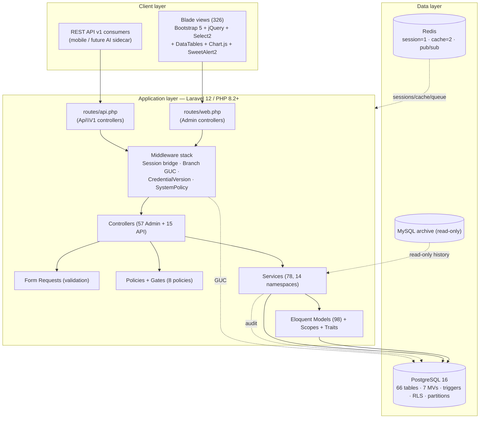
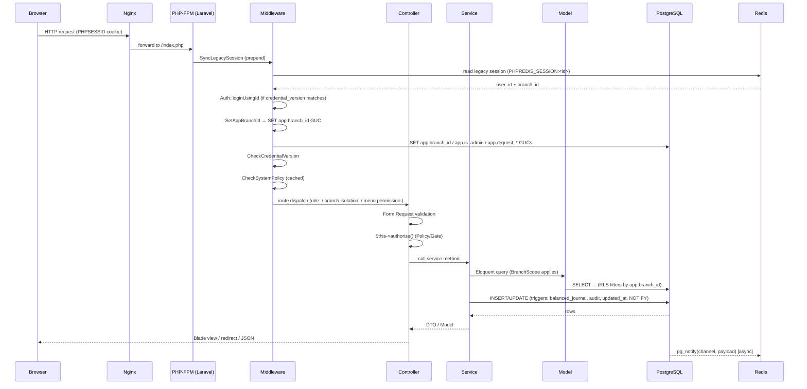
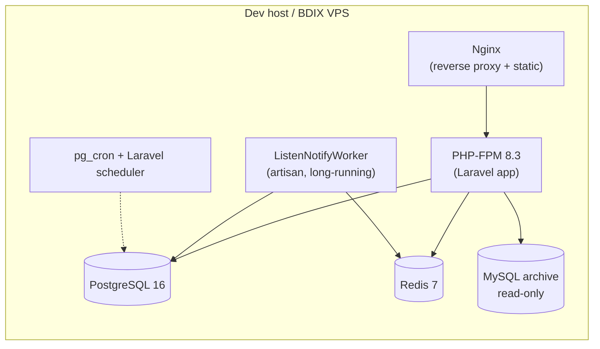

# High-Level Architecture

> **Module:** Architecture
> **Audience:** Engineers, AI assistants, architects
> **Status:** Canonical
> **Last reviewed:** Phase 1 (initial)
> **Source of truth:** This file + `laravel/bootstrap/app.php` + `laravel/composer.json`

---

## 1. What is it?

This document describes the **high-level architecture** of the RC_ERP_v2 Laravel
application — the system's layers, the request lifecycle, the supporting infrastructure,
and the cross-cutting mechanisms (branch isolation, realtime events, audit) that every
module builds on.

It is the architectural anchor for the rest of `architecture/` and is referenced by every
module doc. Deeper sub-topics have their own files:

- Layers & conventions → `layered-design.md`
- Modules & entry points → `module-map.md`
- Branch isolation & RLS → `branch-isolation-rls.md`
- Realtime (Listen/Notify + SSE) → `realtime-events.md`
- Partitioning & archival → `partitioning-archival.md`

---

## 2. Why does it exist?

The ERP was migrated from a bespoke PHP/MySQL codebase to **Laravel 12 + PostgreSQL 16 +
Redis**. The migration's fourth non-negotiable principle is *"re-derive business logic,
don't copy-paste"* — so the architecture is deliberately conventional Laravel (service
layer, Eloquent, Blade) with PostgreSQL-specific extensions (RLS, partitioning, LISTEN/
NOTIFY) chosen to enforce safety properties the legacy system lacked:

- **Branch isolation enforced at the database** (RLS), not just in app code.
- **Balanced journals enforced at the database** (trigger), not just in services.
- **Append-only audit** of financial mutations (trigger + partitioned audit log).
- **Realtime fan-out** via PostgreSQL LISTEN/NOTIFY → Redis → SSE.

A new contributor (human or AI) must understand these cross-cutting mechanisms before
touching any module, because they are non-optional and cannot be bypassed.

---

## 3. Technology stack (layers)

### 3.1 Stack facts (verified from `composer.json` + config)

| Concern | Technology | Notes |
|---|---|---|
| Framework | Laravel `^12.0` | `bootstrap/app.php` configures routing, middleware, exceptions |
| Language | PHP `^8.2` | Strict typing throughout |
| DB | PostgreSQL 16 | default connection `pgsql`; schema in `database/sql/01–07` |
| Cache/Session/Queue | Redis via `predis/predis ^2.0` | 3 logical DBs: default=0, legacy session=1, cache=2 |
| API auth | Laravel Sanctum `^4.0` | bearer token hashed SHA-256 in `users.api_token` |
| Legacy archive | MySQL (read-only) | `mysql_archive` connection; only for ACL/archive lookups |
| Frontend | Blade + Bootstrap 5 + jQuery + Select2 + DataTables + Chart.js + SweetAlert2 | UI reproduces legacy markup (principle #3 — keep existing UI) |
| Dev tooling | Larastan, Pint, PHPUnit 11, Debugbar, Pail | `phpunit.xml`, `phpstan.neon` |

> **Note:** The repo `README.md` and the `bootstrap/app.php` docblock say "Laravel 11",
> but `composer.json` requires `laravel/framework: ^12.0`. The actual runtime is
> **Laravel 12**. Treat the "11" references as stale comments.

---

## 4. Request lifecycle (web)

A typical authenticated web request flows through these stages. This is the canonical
path every module assumes.

### 4.1 Middleware order (from `bootstrap/app.php`)

Global middleware, in execution order:

1. `SyncLegacySession` (prepended) — reads legacy PHP session from Redis, logs user into
   Laravel if `credential_version` matches. Skips `api/*` and console.
2. Laravel's default web stack (sessions, cookies, etc.).
3. `SetAppBranchId` (appended) — sets `app.branch_id`, `app.is_admin`, and
   `app.request_path`/`app.request_ip`/`app.request_id` GUCs for RLS + audit triggers.
4. `CheckCredentialVersion` — invalidates session if `users.credential_version` changed.
5. `CheckSystemPolicy` — loads the current system policy (investigation mode), cached.
6. `trustProxies(at: '*')` — for VPS behind Nginx reverse proxy.

Route middleware aliases (applied per-route via `->middleware('role:admin')` etc.):

| Alias | Class | Purpose |
|---|---|---|
| `role` | `EnsureRole` | Restrict route to one or more roles |
| `legacy.session` | `SyncLegacySession` | (re-exposable) |
| `branch.isolation` | `EnforceBranchIsolation` | Validate request branch_id matches session branch_id (writes) |
| `api.auth` | `ApiAuth` | Sanctum bearer-token auth for `/api/v1` |
| `api.rate` | `ApiRateLimit` | 60 req/min per token+IP (default) |
| `set.api.branch` | `SetApiBranchContext` | Sets `app.branch_id` GUC for API requests (after `api.auth`) |
| `menu.permission` | `EnsureMenuPermission` | Blocks direct URL access to menus the user can't view |

### 4.2 Global exception rendering

`bootstrap/app.php` registers a global renderer for `WarehouseFrozenForCountException`:
it returns a 422 JSON (for API/AJAX) or a redirect-back-with-error (for web), naming the
active stock-take session(s) that froze the warehouse. This means **every** outbound
service (sales, transfers, adjustments, damages, purchase returns) gets consistent
behavior without each controller catching it. See `inventory/stock-take.md` (Phase 8).

---

## 5. Cross-cutting mechanisms

These five mechanisms are architectural and apply to **every** module. They are expanded
in their own files.

### 5.1 Branch isolation (multi-tenant)

Three defense-in-depth layers (see `branch-isolation-rls.md`):

1. **Query layer** — `BranchScope` Eloquent global scope filters reads by `branch_id`.
2. **Route layer** — `EnforceBranchIsolation` middleware validates writes.
3. **Database layer** — PostgreSQL RLS policies driven by the `app.branch_id` GUC
   (cannot be bypassed even by raw SQL).

Admin/superadmin set `app.is_admin = true` to bypass RLS; cross-branch admin actions are
logged to `user_audit_log` as `branch_override`.

### 5.2 Accounting integrity (safety-critical)

- Every journal entry MUST balance (Dr = Cr), enforced by DB trigger
  `enforce_balanced_journal_entry()` on `journal_lines` (defined in
  `database/sql/02_accounting.sql`).
- Reversals create new entries; originals are never mutated (`is_reversed` flag).
- Sub-ledgers (AR/AP/employee/bank) reconcile to GL control accounts within
  `gl_reconciliation_tolerance` (default ৳0.02).
- See `accounting/` (Phase 6).

### 5.3 Audit trails

- `AuditableMasterData` trait logs master-data changes.
- `user_audit_log` captures auth/credential/branch-override events.
- `financial_audit_log` (partitioned, append-only, trigger-driven) captures every
  mutation of financial tables with request context (path, IP, request ID) read from
  the `app.request_*` GUCs set by `SetAppBranchId`.
- See `security/audit-trails.md` (Phase 5).

### 5.4 Realtime events

PostgreSQL `LISTEN/NOTIFY` → PHP worker (`ListenNotifyWorker`) → Redis List/Pub-Sub →
`SseController` → browser `EventSource`. DB triggers fire `pg_notify` on INSERT/UPDATE of
transactional tables; the worker fans out to per-user/per-branch/global queues. See
`realtime-events.md`.

### 5.5 Partitioning & archival

Large time-series tables are RANGE-partitioned monthly (journal entries/lines, stock
transactions, audit logs, sub-ledgers, transaction headers). `pg_partman` automates
future partition creation and old-partition archival. Old partitions can be detached and
exported to Parquet. See `partitioning-archival.md`.

---

## 6. Application bootstrapping

`bootstrap/app.php` (Laravel 11+ style `Application::configure()`):

- **Routing:** `web.php`, `api.php`, `console.php`, health check at `/up`.
- **Commands:** auto-discovered from `app/Console/Commands` (27 commands).
- **Middleware:** as described in §4.1.
- **Exceptions:** the global `WarehouseFrozenForCountException` renderer.

`app/Providers/AppServiceProvider.php` binds the following **singletons** (stateless,
shared across requests) and **Gates/policies**:

- Singletons: `LegacySessionBridge`, `LedgerNatureService`, `SubLedgerService`,
  `JournalReversalService`, `SalesAuditLogger`, `MenuService`, `SystemPolicyService`,
  and the Archive layer (`ArchiveRepositoryInterface` → `LegacyMySQLRepository`,
  `ArchiveService`).
- Gates: `manage-system-policy` (superadmin only), `view-notification-rules`
  (admin+superadmin).
- Policies (defense-in-depth behind `role:` middleware): `SalesInvoicePolicy`,
  `CustomerPaymentPolicy`, `SupplierTransactionPolicy`, `EmployeeTransactionPolicy`,
  `ManualJournalPolicy`, `StockAdjustmentPolicy`, `DamagePolicy`, `SystemPolicyPolicy`.

---

## 7. Configuration philosophy

The app is **config-driven**: business rules that may change live in `config/*.php`
(21 files), env-overridable. Key configs:

| Config | Drives |
|---|---|
| `config/roles.php` | 10 roles, 3 tiers, `assignable_by` rules |
| `config/accounting.php` | `period_close_admin_override`, `gl_reconciliation_tolerance` |
| `config/branches.php` | Branch context defaults |
| `config/sales.php` | Sales module rules |
| `config/damage.php` | Damage workflow rules |
| `config/stock_adjustment.php` | Stock adjustment rules |
| `config/archive.php` | Legacy archive toggle + connection |
| `config/shadow_mode.php` / `branch_demand_shadow.php` | Shadow-mode toggles |
| `config/api.php` | API rate limits + token rules |

> **AI rule:** When a rule exists in config, read it; do not hardcode the value. See
> `coding/config-driven-rules.md` (Phase 4).

---

## 8. Deployment topology (local Docker; VPS pending)

- Local dev: `docker-compose` (see repo `README.md` + `docs/DOCKER_README.md`).
- Production: **Phase 1 (VPS BDIX provisioning) is pending.** Nginx config reference:
  `docs/migration/nginx.conf.example`.
- Long-running worker (`ListenNotifyWorker`) must be supervised (systemd / supervisor)
  in production.
- Full deployment detail: `deployment/` (Phase 19).

---

## 9. Related modules / files

| Topic | File |
|---|---|
| Layered design conventions | `layered-design.md` |
| Module map | `module-map.md` |
| Branch isolation & RLS | `branch-isolation-rls.md` |
| Realtime events | `realtime-events.md` |
| Partitioning & archival | `partitioning-archival.md` |
| Bootstrap | `laravel/bootstrap/app.php` |
| Service provider | `laravel/app/Providers/AppServiceProvider.php` |
| Middleware | `laravel/app/Http/Middleware/` (10 files) |
| Routes | `laravel/routes/web.php`, `laravel/routes/api.php` |

---

## 10. Known edge cases / constraints

- **Console commands do NOT get `app.branch_id` set automatically.** `SetAppBranchId`
  only runs for HTTP. CLI code must `DB::unprepared("SET app.branch_id = ...")` manually
  before branch-scoped queries, or run unscoped (admin mode). PostgreSQL `SET` does not
  accept PDO bound parameters — never use `?` placeholders for GUCs.
- **RLS GUCs may not exist** before migrations are run. `SetAppBranchId` catches the
  error silently and logs at debug level, so code can deploy before migrations.
- **Partitioned tables cannot be referenced by FKs** in PostgreSQL 12–17. The app uses
  trigger-based referential integrity for partitioned parents (see
  `partitioning-archival.md`).
- **SSE connections are capped at 5 minutes** (`MAX_CONNECTION_TIME`) to allow PHP-FPM
  recycling; the client auto-reconnects via `EventSource`.
- **The legacy session bridge** shares sessions between legacy PHP and Laravel via Redis
  DB 1. Once legacy PHP is decommissioned, this bridge can be removed.

---

## 11. Future improvements

- Decommission the legacy session bridge once legacy PHP is fully retired.
- Move the `ListenNotifyWorker` to a dedicated supervisor-managed process (Phase 19).
- Consider Laravel Octane for long-running PHP workers if SSE connection volume grows.
- Reconcile the stale "Laravel 11" comments in `README.md` and `bootstrap/app.php` with
  the actual Laravel 12 runtime.

---

*This is the architectural anchor. For module-specific entry points, see `module-map.md`.
For the deep mechanics of any cross-cutting mechanism, follow its dedicated file.*
