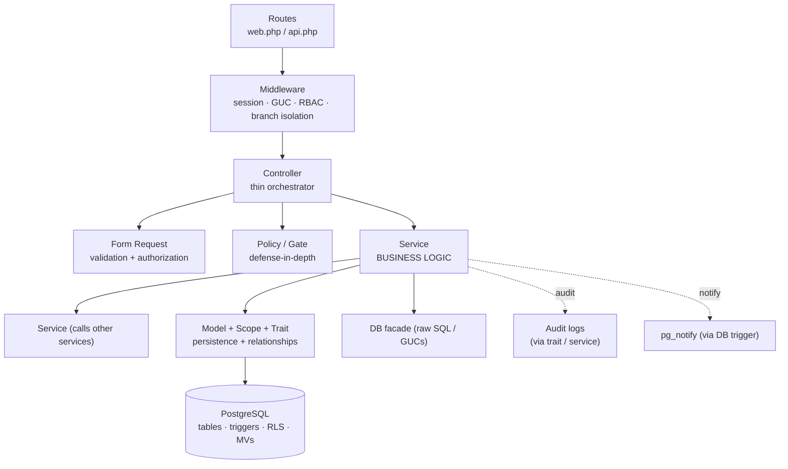
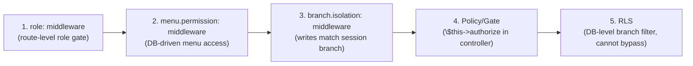

# Layered Design — Controller → Service → Model → DB

> **Module:** Architecture
> **Audience:** Engineers, AI assistants
> **Status:** Canonical
> **Last reviewed:** Phase 1 (initial)
> **Source of truth:** This file + `laravel/app/Http/Controllers/`, `laravel/app/Services/`, `laravel/app/Models/`

---

## 1. What is it?

This document describes the **layered architecture** of the RC_ERP Laravel application —
the responsibilities of each layer, the conventions for moving between layers, and the
patterns every contributor (human or AI) MUST follow when adding or changing code.

The application uses a strict **4-layer** design:

1. **HTTP layer** — Routes + Middleware + Controllers + Form Requests + Policies.
2. **Service layer** — The business logic. The single source of truth for behavior.
3. **Model layer** — Eloquent models + global scopes + traits. Persistence + relationships.
4. **Database layer** — PostgreSQL tables, triggers, RLS policies, MVs, partitions.

A fundamental rule: **business logic lives in services, never in controllers, models, or
Blade.** Controllers are thin orchestrators; models are persistence + relationships; Blade
is presentation only.

---

## 2. Why does it exist?

- **Safety-critical logic centralization.** Accounting postings (Dr=Cr), stock costing
  (moving-average), reversals, and audit trails MUST go through one owned service. If
  logic leaks into controllers or Blade, it becomes impossible to guarantee integrity.
- **Re-derivation over copy-paste** (project principle #4). A clean service layer made it
  possible to re-derive business rules from first principles during the migration.
- **Testability.** Services are plain PHP classes with injected dependencies — easy to
  unit-test (107 tests, see `tests/`).
- **Consistency for AI assistants.** A predictable layering means an AI can locate the
  right file for any change without guessing.

---

## 3. Layer responsibilities



### 3.1 HTTP layer

| Component | Responsibility | Location |
|---|---|---|
| **Routes** | URL → controller mapping; attach middleware (`role:`, `branch.isolation:`, `menu.permission:`, `api.auth`, `api.rate`) | `routes/web.php` (1,797 lines), `routes/api.php` (555 lines) |
| **Middleware** | Cross-cutting: session bridge, branch GUC, credential version, system policy, role enforcement, branch-isolation validation, menu permission, API auth/rate | `app/Http/Middleware/` (10 classes) |
| **Controllers** | Receive request, validate (via Form Request), authorize (via Policy/Gate), call **one** service method, return view/redirect/JSON. NO business logic. | `app/Http/Controllers/Admin/` (57), `app/Http/Controllers/Api/V1/` (15) |
| **Form Requests** | Input validation rules + authorization. Separate web vs API requests. | `app/Http/Requests/` |
| **Policies / Gates** | Per-model authorization (defense-in-depth behind `role:` middleware). | `app/Policies/` (8), `AppServiceProvider::boot()` |

**Controller conventions:**

- Constructor dependency injection of services (e.g.
  `public function __construct(private SalesInvoiceService $invoiceService, ...) {}`).
- Use `SalesInvoice::with([...])->when(...)->paginate(...)` for listings — `BranchScope`
  applies automatically.
- `$this->authorize('action', $model)` for policy checks.
- Return `redirect()->back()->with('error'/'success', ...)` for web; JSON for API/AJAX.

**Example (from `Admin/SalesInvoiceController.php`):**

```php
class SalesInvoiceController extends Controller
{
    public function __construct(
        private SalesInvoiceService $invoiceService,
        private SalesCartService $cartService,
        private SalesAuditLogger $auditLogger
    ) {}

    public function index(Request $request)
    {
        $query = SalesInvoice::with(['customer', 'branch', 'items'])
            ->when(! $includeCalled, fn($q) => $q->where('call_a_day', false))
            ->when($effectiveFrom, fn($q, $d) => $q->where('invoice_date', '>=', $d))
            // ... BranchScope applies automatically
            ->paginate(25);
        return view('admin.sales-invoices.index', compact('query'));
    }
}
```

### 3.2 Service layer (the heart)

- **78 service classes** across **14 namespaces** under `app/Services/`:
  `Accounting/` (17), `Stock/` (22), `Sales/` (10), `Purchase/` (4), `BranchDemand/` (7),
  `Auth/` (6), `Reports/` (3), `Budgeting/` (2), `Notification/` (2), plus
  `Approval/`, `Compliance/`, `Consolidation/`, `MasterData/`, `Export/`, and
  top-level `MenuService` (1 each).
- One service owns one domain concern. Services MAY call other services (e.g.
  `SalesInvoiceService` → `JournalPostingService`).
- Bound as **singletons** in `AppServiceProvider` when stateless + shared:
  `LedgerNatureService`, `SubLedgerService`, `JournalReversalService`,
  `SalesAuditLogger`, `MenuService`, `SystemPolicyService`, the Archive layer.
- Services use constructor DI for dependencies (e.g.
  `public function __construct(private LedgerNatureService $natureService) {}`).

**Service conventions:**

- A service method = one business operation (e.g. `finalizeInvoice()`,
  `postStockTakeSession()`, `reverseJournalEntry()`).
- Services wrap multi-statement operations in `DB::transaction()` for atomicity.
- Services call `JournalPostingService::createJournalEntry()` to post GL entries — they
  never write `journal_lines` directly.
- Services call the owning stock service for stock movements — never write
  `stock_transactions` directly from a controller.
- Services write audit entries via the audit trait / `*AuditLogger` classes.
- Services return DTOs, models, or simple arrays — never HTTP responses.

**Example (from `Accounting/JournalPostingService.php`):**

```php
class JournalPostingService
{
    public function __construct(
        private LedgerNatureService $natureService
    ) {}

    public function createJournalEntry(array $entry, array $lines): JournalEntry
    {
        // Validates: Dr=Cr, lines non-empty, period open, ledger active.
        // Generates atomic entry_no via DocumentSequenceService (advisory locks).
        // Logs the posting to journal_posting_logs.
        return DB::transaction(function () use ($entry, $lines) { ... });
    }
}
```

### 3.3 Model layer

- **98 Eloquent models** in `app/Models/` (plus `app/Models/Accounting/` and
  `app/Models/Scopes/`).
- Models define: `$fillable` / `$guarded`, `$casts`, relationships (`hasMany`,
  `belongsTo`, etc.), and (rarely) query scopes.
- **Global scopes** auto-apply cross-cutting filters:
  - `app/Models/Scopes/BranchScope.php` — filters by `branch_id` (RLS backstop at app level).
  - `app/Models/Scopes/MoneyTransferBranchScope.php`,
    `WarehouseTransferBranchScope.php` — cross-branch variants.
- **Traits**:
  - `app/Traits/AuditableMasterData.php` — logs master-data mutations to audit tables.
  - `app/Traits/ApplySystemPolicyScope.php` — applies system-policy scoping.

**Model conventions:**

- Do NOT put business logic in models (no posting, no stock movements). Models are
  persistence + relationships + light accessors/mutators only.
- Use `$casts` for date/boolean/json columns.
- Define relationships exhaustively — they power eager loading (`::with([...])`).

### 3.4 Database layer

- **66 tables + 7 materialized views + triggers + RLS policies + partitions** (see
  `database/sql/01–07` + 160 migrations).
- Cross-cutting DB-level enforcement (see `high-level-architecture.md` §5):
  - `enforce_balanced_journal_entry()` trigger — Dr=Cr.
  - `update_updated_at_column()` trigger — replaces MySQL `ON UPDATE CURRENT_TIMESTAMP`.
  - RLS policies — branch isolation (see `branch-isolation-rls.md`).
  - `pg_notify()` triggers — realtime events (see `realtime-events.md`).
  - `fn_financial_audit_trigger()` — append-only audit (reads `app.request_*` GUCs).
- Partitioned parents use **trigger-based referential integrity** (PG 12–17 can't have
  FKs referencing partitioned tables). See `partitioning-archival.md`.

---

## 4. The "never bypass services" rule

This is the most important convention in the codebase.

| If you want to… | You MUST call | You MUST NOT |
|---|---|---|
| Post a journal entry | `JournalPostingService::createJournalEntry()` | write `journal_entries`/`journal_lines` directly |
| Reverse a journal | `JournalReversalService::reverseJournalEntry()` | flip `is_reversed` manually |
| Move stock | the owning `Stock/*Service` | insert `stock_transactions` directly |
| Move cash between banks | `MoneyTransferService` | insert `money_transfers` + journals by hand |
| Change master data | the master-data controller + `AuditableMasterData` trait | raw `Model::update()` bypassing audit |
| Set the branch context | `SetAppBranchId` / `SetApiBranchContext` middleware | `DB::statement("SET app.branch_id=...")` from a controller |

> **AI rule (from `IMPLEMENTATION_PLAN.md` §7.2):** Never bypass services. Controllers MUST
> stay thin. Never post journals, move stock, or mutate ledgers directly from controllers,
> jobs, or Blade. Always go through the owning service.

---

## 5. Authorization model (defense-in-depth)

Authorization is layered. A request must pass ALL applicable layers:



- `role:` is the **primary** gate (route-level).
- Policies are **defense-in-depth** — they mirror the role matrix exactly. Each policy
  class docblock carries the full rule table. See `security/rbac-roles-permissions.md`
  (Phase 5).
- RLS is the **last line** — even raw SQL or a forgotten scope cannot leak cross-branch
  data.

---

## 6. Web vs API split

| Concern | Web | API v1 |
|---|---|---|
| Routes | `routes/web.php` | `routes/api.php` (`/api/v1`) |
| Controllers | `app/Http/Controllers/Admin/` | `app/Http/Controllers/Api/V1/` |
| Auth | session (via `SyncLegacySession` + Laravel auth) | Sanctum bearer token (`ApiAuth` middleware) |
| Branch context | `SetAppBranchId` (global) | `SetApiBranchContext` (route middleware, after `api.auth`) |
| Validation | Form Requests in `app/Http/Requests/` | Form Requests in `app/Http/Requests/Api/V1/` |
| Response | Blade view / redirect | JSON via `app/Http/Resources/Api/V1/` resources |
| Rate limit | (none global) | `ApiRateLimit` — 60 req/min per token+IP |

Both web and API controllers call the **same service layer** — the business logic is
shared. Only the HTTP wrapper differs.

---

## 7. Presentation layer (Blade)

- **326 Blade views** in `resources/views/`, organized by feature folder
  (`admin/sales-invoices/`, `admin/stock-take/`, etc.).
- Layouts: `layouts/app.blade.php`, `layouts/admin.blade.php`, `layouts/print.blade.php`,
  `layouts/print-legacy.blade.php`, `layouts/plain.blade.php`.
- **Principle #3 (keep existing UI):** Blade reproduces legacy Bootstrap 5 markup. No SPA
  rewrite. Styling via `public/assets/css/rc-erp.css` + per-module CSS.
- JS: jQuery + Select2 + DataTables + Chart.js + SweetAlert2, with per-feature files in
  `public/assets/js/` (e.g. `sales-create.js`, `stock-adjustment.js`).
- Blade MUST NOT contain business logic. Use view composers / presenters for complex
  view data; keep logic in services.

---

## 8. Console commands & jobs

- **27 artisan commands** in `app/Console/Commands/`. Categories:
  - **Verification:** `chart:validate`, `stock:replay-verify`, `journal:replay-verify`,
    `subledger:reconcile`, `reversal:verify`, `stock:manual-verify`, `journal:manual-verify`.
  - **Migration/seed:** `migrate:master-data`, `migrate:legacy-employees`,
    `migrate:legacy-users`, `setup:rcerp`, `db:snapshot-basic`, `db:restore-basic`,
    `db:reseed-basic`, `db:make-empty`.
  - **Ops:** `refresh:report-views`, `listen-notify:worker`, `cancel:stale-sales-drafts`,
    `reconcile:stock-drift`, `running-balance:reconcile`, partition health commands.
- Console commands **do not get `app.branch_id` set automatically** (see
  `high-level-architecture.md` §10). CLI code must set the GUC manually or run unscoped.
- Scheduled jobs: Laravel scheduler + `pg_cron` (see `deployment/cron-scheduled-jobs.md`,
  Phase 19).

---

## 9. Related modules / files

| Topic | File |
|---|---|
| High-level architecture | `high-level-architecture.md` |
| Module map | `module-map.md` |
| Branch isolation mechanics | `branch-isolation-rls.md` |
| Realtime events | `realtime-events.md` |
| Coding standards (full) | `coding/` (Phase 4) |
| Service-layer conventions (full) | `coding/service-layer-conventions.md` (Phase 4) |
| Controller exemplars | `app/Http/Controllers/Admin/SalesInvoiceController.php`, `Admin/StockTakeController.php` |
| Service exemplars | `app/Services/Accounting/JournalPostingService.php`, `app/Services/Stock/StockService.php` |

---

## 10. Known edge cases

- **Policies are defense-in-depth, not the primary gate.** The `role:` middleware is
  primary. Do not rely on policies alone — a route without `role:` is unprotected.
- **Global scopes can be bypassed** with `withoutGlobalScope(BranchScope::class)`, but
  this should be rare and audited — RLS still applies as the backstop.
- **Form Requests do not authorize by default** — they validate. Authorization is via
  `role:` middleware + `$this->authorize()` in the controller.
- **API controllers share services with web controllers** — a service change affects both.
  Test both paths.

---

## 11. Future improvements

- Introduce DTOs (typed return objects) for service methods that currently return arrays,
  to improve static analysis (Larastan) coverage.
- Document the canonical "new module" scaffold checklist in `coding/` (Phase 4).
- Consider extracting a thin repository layer ONLY if raw SQL complexity grows; the
  current service-direct-to-DB approach is preferred.

---

*For the full coding-standards detail (naming, typing, PSR-12, testing), see `coding/`
(Phase 4). This file covers the architectural layering only.*
