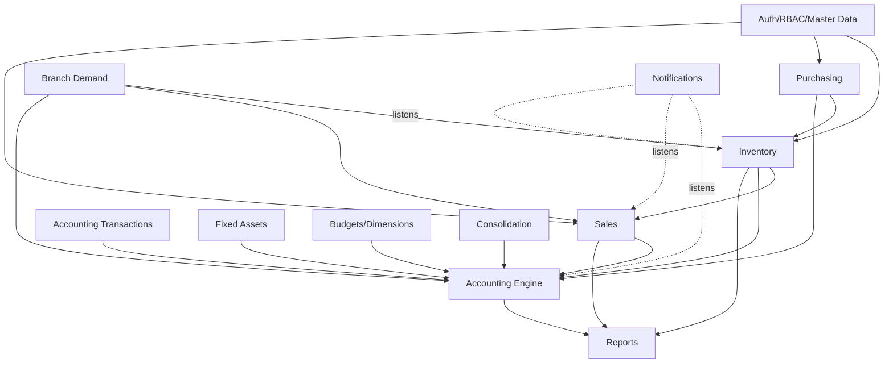

# Module Map

> **Module:** Architecture
> **Audience:** Engineers, AI assistants, new contributors
> **Status:** Canonical
> **Last reviewed:** Phase 1 (initial)
> **Source of truth:** This file + `laravel/routes/web.php` + `laravel/routes/api.php` + `laravel/app/Http/Controllers/` + `laravel/app/Services/`

---

## 1. What is it?

This is the **master map of every functional module** in the RC_ERP Laravel application,
with its web route prefix, API route prefix (if any), controllers, services, models, and
the `AI_CONTEXT/` folder where its deep documentation will live (once that phase is
complete).

Use this to locate the right files for any task. For each module, the "entry points"
column tells you where to start reading.

---

## 2. Why does it exist?

With 57 web controllers, 15 API controllers, 78 services, and 98 models, the codebase is
too large to navigate by guessing. This map gives a one-stop index: "I need to work on
sales returns → here are the exact routes, controller, service, model, and config files."

It also enforces the phase-plan boundary: each module maps to exactly one documentation
folder, so there is never ambiguity about where a rule belongs.

---

## 3. Module index

Modules are grouped by domain. Counts are verified by file scan.

### 3.1 Foundation / Auth / Master Data

| Module | Web route | API route | Controller(s) | Service(s) | Models | Entry point |
|---|---|---|---|---|---|---|
| **Auth & Sessions** | `/login`, `/forgot`, `/reset/{token}` | — | `Auth/AuthenticatedSessionController`, `Auth/PasswordResetLinkController`, `Auth/NewPasswordController` | `Auth/*` (6: PasswordPolicy, AccountLockout, CredentialVersion, UserAuditLogger, LoginRateLimiter, RememberMeManager) | `User` | `security/auth-and-sessions.md` (P5) |
| **Branches** | `/admin/branches` | `/api/v1/branches` | `Admin/BranchController`, `Api/V1/BranchApiController`, `BranchSwitchController` | `MenuService` | `Branch` | `business/organizational-structure.md` (P2) |
| **Warehouses** | `/admin/warehouses` | `/api/v1/lookups/warehouses` | `Admin/WarehouseController` | — | `Warehouse` | `inventory/warehouse-stock.md` (P8) |
| **Users** | `/admin/users` | — | `Admin/UserController` | `Auth/CredentialVersion`, `Auth/UserAuditLogger` | `User`, `UserMenuPermission` | `security/rbac-roles-permissions.md` (P5) |
| **Employees** | `/admin/employees` | — | `Admin/EmployeeController` | — | `Employee` | `business/organizational-structure.md` (P2) |
| **Menus (DB-driven)** | (consumed by layout) | — | — | `MenuService` | `Menu`, `UserMenuPermission` | `security/rbac-roles-permissions.md` (P5) |
| **Products** | `/admin/products` | `/api/v1/lookups/products` | `Admin/ProductController`, `Admin/ProductCategoryController`, `Admin/ProductGroupController` | `MasterData/CodeGenerator` | `Product`, `ProductPriceHistory`, `ProductUomConversion` | `business/core-workflows.md` (P2) |
| **Customers** | `/admin/customers` | `/api/v1/lookups/customers` | `Admin/CustomerController`, `Admin/CustomerPerformanceController` | — | `Customer`, `CustomerLedger` | `sales/` (P10) |
| **Suppliers** | `/admin/suppliers` | `/api/v1/lookups/suppliers` | `Admin/SupplierController` | — | `Supplier`, `SupplierLedger` | `purchasing/` (P9) |
| **Banks** | `/admin/banks` | — | `Admin/BankController` | — | `Bank`, `BankLedgerMapping` | `accounting/` (P6) |
| **Ledgers (CoA)** | `/admin/ledgers` | `/api/v1/lookups/ledgers` | `Admin/LedgerController` | `Accounting/LedgerNatureService` | `Ledger` | `accounting/chart-of-accounts.md` (P6) |

### 3.2 Inventory

| Module | Web route | API route | Controller(s) | Service(s) | Models | Entry point |
|---|---|---|---|---|---|---|
| **Stock (transactions)** | `/admin/stock` | — | `Admin/StockTransactionController` | `Stock/StockService`, `Stock/StockAvailabilityService`, `Stock/UomConversionService` | `StockTransaction`, `WarehouseStock` | `inventory/stock-ledger.md` (P8) |
| **Stock Take** | `/admin/stock-take` | `/api/v1/stock-take/*` | `Admin/StockTakeController`, `Api/V1/StockTake/StockTakeSessionApiController`, `Api/V1/StockTake/StockTakeItemApiController` | `Stock/StockTakeService`, `StockTakePolicyService`, `StockTakeAuditLogger`, `StockTakeHealthCheckService`, `StockTakeVarianceReport`, `StockTakeWeeklyReport`, `AbcClassificationService` | `StockTakeSession`, `StockTakeItem`, `StockTakeWarehouse`, `StockTakeAuditLog` | `inventory/stock-take.md` (P8) |
| **Stock Adjustment** | `/admin/stock-adjustments` | `/api/v1/stock-adjustments` | `Admin/StockAdjustmentController`, `Api/V1/StockAdjustment/StockAdjustmentApiController` | `Stock/StockAdjustmentService`, `StockAdjustmentPolicyService`, `StockAdjustmentAuditLogger`, `StockAdjustmentAuditService`, `StockAdjustmentReconcileService` | `StockAdjustment`, `StockAdjustmentItem` | `inventory/stock-adjustment.md` (P8) |
| **Damage** | `/admin/damages` | — | `Admin/DamageController` | `Stock/DamageService`, `DamageIntegrityService` | `DamageInvoice`, `DamageInvoiceItem`, `DamageReason` | `inventory/damage.md` (P8) |
| **Warehouse Transfer** | `/admin/warehouse-transfers` | `/api/v1/warehouse-transfers` | `Admin/WarehouseTransferController`, `Api/V1/WarehouseTransfer/WarehouseTransferApiController` | `Stock/WarehouseTransferService`, `WarehouseTransferAuditService`, `WarehouseTransferAuditLogger`, `WarehouseTransferSummaryReport`, `WarehouseTransferShadowService` | `WarehouseTransfer` | `inventory/warehouse-transfer.md` (P8) |

### 3.3 Purchasing (Procure-to-Pay)

| Module | Web route | API route | Controller(s) | Service(s) | Models | Entry point |
|---|---|---|---|---|---|---|
| **Purchase Order** | `/admin/purchase-orders` | — | `Admin/PurchaseOrderController` | `Purchase/PurchaseOrderService` | `PurchaseOrder`, `PurchaseOrderItem` | `purchasing/purchase-order.md` (P9) |
| **Purchase Receive (GRN)** | `/admin/purchase-receives` | — | `Admin/PurchaseReceiveController` | `Purchase/PurchaseReceiveService` | `PurchaseReceive`, `PurchaseReceiveItem` | `purchasing/purchase-receive.md` (P9) |
| **Purchase Return** | `/admin/purchase-returns` | — | `Admin/PurchaseReturnController` | `Purchase/PurchaseReturnService` | (shares PurchaseReceiveItem) | `purchasing/purchase-return.md` (P9) |
| **Purchase Audit** | `/admin/purchase-audit` | — | `Admin/PurchaseAuditController` | `Purchase/PurchaseAuditService` | — | `purchasing/purchase-audit.md` (P9) |

### 3.4 Sales (Order-to-Cash)

| Module | Web route | API route | Controller(s) | Service(s) | Models | Entry point |
|---|---|---|---|---|---|---|
| **Sales Cart (Draft)** | `/admin/sales/cart` | `/api/v1/sales/cart` | `Admin/SalesCartController`, `Api/V1/Sales/SalesCartApiController` | `Sales/SalesCartService` | `SalesDraftCart` | `sales/sales-cart.md` (P10) |
| **Sales Invoice** | `/admin/sales-invoices` | `/api/v1/sales/invoices` | `Admin/SalesInvoiceController`, `Api/V1/Sales/SalesInvoiceApiController` | `Sales/SalesInvoiceService`, `Sales/SalesAccess`, `SalesAuditLogger` | `SalesInvoice`, `SalesInvoiceItem`, `SalesInvoiceDispatch` | `sales/sales-invoice.md` (P10) |
| **Sales Challan** | `/admin/sales-challans` | `/api/v1/sales/challans` | `Admin/SalesChallanController`, `Api/V1/Sales/SalesChallanApiController` | `Sales/SalesChallanService` | `SalesChallanItem` | `sales/sales-challan.md` (P10) |
| **Sales Return** | `/admin/sales-returns` | `/api/v1/sales/returns` | `Admin/SalesReturnController`, `Api/V1/Sales/SalesReturnApiController` | `Sales/SalesReturnService`, `SalesReturnableQty`, `SalesReturnReversalGuard` | `SalesReturn` | `sales/sales-return.md` (P10) |
| **Customer Payment** | `/admin/customer-payments` | `/api/v1/sales/payments` | `Admin/CustomerPaymentController`, `Api/V1/Sales/CustomerPaymentApiController` | `Sales/CustomerPaymentService` | (CustomerLedger) | `accounting/customer-payments.md` (P7) |
| **Commission** | — | `/api/v1/sales/commissions` | `Api/V1/Sales/CommissionApiController` | `Sales/CommissionService` | `CommissionEntry`, `CommissionRule`, `CommissionRuleTarget`, `CommissionRuleProductGroup` | `sales/commission.md` (P10) |
| **Sales Guide** | `/admin/sales-guide` | — | `Admin/SalesGuideController` | — | — | `sales/sales-audit.md` (P10) |
| **Sales Funnel** | `/admin/sales-funnel` | — | `Admin/SalesFunnelController` | — | — | `reports/dashboards.md` (P16) |

### 3.5 Accounting (Engine + Transactions)

| Module | Web route | API route | Controller(s) | Service(s) | Models | Entry point |
|---|---|---|---|---|---|---|
| **Journal Posting (core)** | — | — | — | `Accounting/JournalPostingService`, `LedgerNatureService`, `DocumentSequenceService` | `Accounting/JournalEntry`, `Accounting/JournalLine` | `accounting/journal-posting-rules.md` (P6) |
| **Sub-ledger & Reconciliation** | `/admin/reconciliation` | — | `Admin/ReconciliationController` | `Accounting/SubLedgerService`, `ReconciliationService` | `CustomerLedger`, `SupplierLedger`, `EmployeeTransaction` | `accounting/subledger-reconciliation.md` (P6) |
| **Journal Reversal** | — | — | — | `Accounting/JournalReversalService` | (`is_reversed` flags) | `accounting/reversal-vs-cancellation.md` (P6) |
| **Accounting Period** | `/admin/accounting` | — | `Admin/AccountingPeriodController` | `Accounting/AccountingPeriodService` | `FiscalPeriod`, `PeriodCloseLog` | `accounting/fiscal-year-period-close.md` (P6) |
| **Fiscal Year** | `/admin/fiscal-years` | — | `Admin/FiscalYearController` | `Accounting/FiscalYearService` | `FiscalYear`, `FiscalPeriod` | `accounting/fiscal-year-period-close.md` (P6) |
| **Manual Journal** | `/admin/manual-journals` | — | `Admin/ManualJournalController` | `Accounting/ManualJournalService` | `ManualJournal`, `ManualJournalLine` | `accounting/manual-journals.md` (P7) |
| **Money Transfer** | `/admin/money-transfers` | — | `Admin/MoneyTransferController` | `Accounting/MoneyTransferService` | `MoneyTransfer` | `accounting/money-transfers.md` (P7) |
| **Supplier Transaction** | `/admin/supplier-transactions` | — | `Admin/SupplierTransactionController` | `Accounting/SupplierTransactionService` | `SupplierPayment` | `accounting/supplier-transactions.md` (P7) |
| **Employee Transaction** | `/admin/employee-transactions` | — | `Admin/EmployeeTransactionController` | `Accounting/EmployeeTransactionService` | `EmployeeTransaction` | `accounting/employee-transactions.md` (P7) |
| **Other Income** | `/admin/other-incomes` | — | `Admin/OtherIncomeController` | `Accounting/OtherIncomeService` | `OtherIncome` | `accounting/other-income-expense.md` (P7) |
| **Other Expense** | `/admin/other-expenses` | — | `Admin/OtherExpenseController` | `Accounting/OtherExpenseService` | `OtherExpense` | `accounting/other-income-expense.md` (P7) |
| **Bank Reconciliation** | `/admin/bank-reconciliation` | — | `Admin/BankReconciliationController` | `Accounting/BankReconciliationService` | `BankReconciliation`, `BankReconciliationItem` | `accounting/bank-reconciliation.md` (P7) |
| **Running Balance** | (cron: `running-balance:reconcile`) | — | — | (recon services) | (sub-ledger tables) | `accounting/running-balance.md` (P6) |
| **Financial Audit Log** | (trigger-driven) | — | — | — | (partitioned `financial_audit_log`) | `accounting/financial-audit-log.md` (P6) |

### 3.6 Finance (cross-cutting)

| Module | Web route | API route | Controller(s) | Service(s) | Models | Entry point |
|---|---|---|---|---|---|---|
| **Fixed Assets** | `/admin/fixed-assets` | — | `Admin/FixedAssetController` | `Accounting/DepreciationService`, `AssetDisposalService` | `FixedAsset`, `AssetDepreciationSchedule`, `AssetDisposal` | `finance/fixed-assets.md` (P11) |
| **Budgets** | `/admin/budgets` | — | `Admin/BudgetController` | `Budgeting/BudgetService`, `DimensionReportingService` | `BudgetLine` | `finance/budgeting.md` (P12) |
| **Dimensions / Cost Centers** | `/admin/dimensions` | — | `Admin/DimensionController` | `Budgeting/DimensionReportingService` | `Dimension`, `DimensionValue` | `finance/dimensions-cost-centers.md` (P12) |
| **Consolidation** | `/admin/consolidation` | — | `Admin/ConsolidationController` | `Consolidation/ConsolidationService` | `ConsolidationRun` | `finance/consolidation-intercompany.md` (P13) |
| **Branch Demand** | `/admin/branch-demands` | `/api/v1/branch-demands` | `Admin/BranchDemandController`, `Admin/BranchDemandReportController`, `Api/V1/BranchDemand/BranchDemandApiController` | `BranchDemand/BranchDemandService`, `BranchDemandRepricingService`, `BranchIntercompanyService`, `BranchDemandAuditService`, `BranchDemandAuditLogger`, `BranchDemandWeeklyReportService`, `BranchDemandShadowService` | `BranchDemand`, `BranchDemandCustomerPaymentSettlement`, `BranchDemandMoneyTransferSettlement` | `finance/branch-demand.md` (P13) |
| **Shadow Mode** | `/admin/shadow-mode`, `/admin/branch-demand-shadow` | — | `Admin/ShadowModeController`, `Admin/BranchDemandShadowController` | `BranchDemand/BranchDemandShadowService`, `Stock/WarehouseTransferShadowService` | (shadow tables) | `finance/branch-demand.md` (P13) |

### 3.7 Platform

| Module | Web route | API route | Controller(s) | Service(s) | Models | Entry point |
|---|---|---|---|---|---|---|
| **Reports** | `/admin/reports` | — | `Admin/ReportController`, `Admin/CsvExportController` | `Reports/ReportService`, `Reports/DamageReportService`, `Reports/CteReportService`, `Export/CsvExporter` | (uses MVs + CTEs) | `reports/reports-catalog.md` (P16) |
| **Dashboard** | `/dashboard`, `/dashboard/performance` | `/api/v1/dashboard/*` | `LegacyDashboardController`, `UserPerformanceDashboardController`, `Api/V1/DashboardApiController` | — | — | `reports/dashboards.md` (P16) |
| **Lookups (API)** | — | `/api/v1/lookups/*` | `Api/V1/LookupApiController` | — | — | `api/api-modules.md` (P17) |
| **API Doc** | — | `/api/doc` | `Api/ApiDocController` | — | — | `api/api-reference-index.md` (P17) |
| **Notifications** | `/admin/notifications` | — | `Admin/NotificationController` | `Notification/NotificationService`, `Notification/ListenNotifyService` | `ERPNotification`, `NotificationRule`, `NotificationRuleRecipient` | `workflows/notification-workflow.md` (P15) |
| **SSE** | `/sse/events`, `/sse/status` | — | `SseController` | `Notification/ListenNotifyService` | — | `architecture/realtime-events.md` (P1) |
| **System Policy / Compliance** | `/admin/compliance` | — | `Admin/SystemPolicyController` | `Compliance/SystemPolicyService` | `SystemPolicy` | `security/system-policy-compliance.md` (P5) |
| **Global Audit** | `/admin/audit` | — | `Admin/GlobalAuditController` | — | (audit tables) | `security/audit-trails.md` (P5) |
| **System Health** | `/admin/system-health` | — | `Admin/SystemHealthController` | — | — | `deployment/artisan-commands.md` (P19) |
| **Partition Health** | `/admin/partition-health` | — | `Admin/System/PartitionHealthController` | — | (partition stats views) | `architecture/partitioning-archival.md` (P1) |
| **Approval Workflow** | `/admin/approvals` | — | `Admin/ApprovalController` | `Approval/ApprovalService` | `ApprovalRequest`, `ApprovalStep`, `ApprovalAction`, `ApprovalWorkflow` | `workflows/approval-workflow.md` (P14) |
| **Archive (Legacy search)** | `/admin/archive` | — | `Admin/ArchiveController` | `Archive/Services/ArchiveService` (+ `Archive/Repositories/LegacyMySQLRepository`) | (DTOs in `Archive/DTOs/`) | `archive/anti-corruption-layer.md` (P18) |
| **Go-Live Checklist** | `/admin/go-live` | — | `Admin/GoLiveChecklistController` | — | — | `deployment/go-live-checklist.md` (P19) |
| **UI Preview** | `/admin/ui-preview` | — | `UiPreviewController` | — | — | (tooling) |

---

## 4. Module dependency graph (high level)

---

## 5. How to find a module quickly

1. **By URL:** Find the route prefix in `routes/web.php` (e.g. `/admin/sales-returns`) →
   the controller class is in the same group → its constructor names the service(s).
2. **By table:** Find the table in `database/sql/0*.sql` → grep the model name in
   `app/Models/` → grep the model in `app/Services/` to find the owning service.
3. **By feature:** Use the index above to jump straight to the entry-point files.

---

## 6. Related modules / files

- High-level architecture: `high-level-architecture.md`
- Layered design: `layered-design.md`
- Routes: `laravel/routes/web.php`, `laravel/routes/api.php`
- Controllers: `laravel/app/Http/Controllers/Admin/`, `laravel/app/Http/Controllers/Api/V1/`
- Services: `laravel/app/Services/` (14 namespaces)
- Models: `laravel/app/Models/`

---

## 7. Known edge cases

- **Two route groups share the `admin/purchase-returns` prefix** (lines 986 and 1035 in
  `web.php`) — one for the main resource, one for extra actions. Both resolve to the same
  controller. Check both when modifying purchase-return routes.
- **Branch Demand and Money Transfer are cross-branch by nature** — they use
  `from_branch_id` + `to_branch_id`, so `EnforceBranchIsolation` skips single-branch
  inference for them (the controller authorizes based on the user's role in the
  transaction). See `branch-isolation-rls.md` §6.
- **Some "controllers" are not under `Admin/`**: `SseController`, `UiPreviewController`,
  `BranchSwitchController`, `LegacyDashboardController`, `UserPerformanceDashboardController`
  live directly under `app/Http/Controllers/`.
- **The `Archive/` namespace** (`app/Archive/`) is the anti-corruption layer, not a
  service — it has its own DTOs + Repository + Service structure.

---

## 8. Future improvements

- Add an auto-generated module map (script that scans routes + controllers) to keep this
  file in sync as modules are added.
- Cross-link each module row to its phase doc once that phase is complete.

---

*For the layered conventions governing these modules, see `layered-design.md`. For the
mechanics of cross-cutting concerns (RLS, realtime, partitioning), see the sibling files.*
