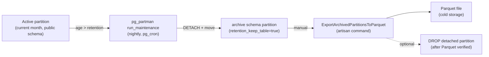

# Partitioning & Archival

> **Module:** Architecture (cross-cutting)
> **Audience:** Engineers, AI assistants, DBAs
> **Status:** Canonical
> **Last reviewed:** Phase 1 (initial)
> **Source of truth:** This file + `laravel/database/migrations/*partition*` + `laravel/app/Console/Commands/{Measure,Verify,Export}*Partition*.php` + `laravel/doc/Phase_10.1_Partitioning_and_Archival_Plan.md`

---

## 1. What is it?

RC_ERP uses **PostgreSQL declarative RANGE partitioning** to split large time-series
tables into monthly physical partitions while presenting a single logical table to
queries. **pg_partman** automates future-partition creation and old-partition archival.
Detached partitions move to an `archive` schema (and can be exported to Parquet), keeping
the hot working set small and queries fast.

This is a cross-cutting concern: ~30 tables are partitioned, including the accounting
journal, stock ledger, audit logs, sub-ledgers, and all transaction headers.

---

## 2. Why does it exist?

- **Query performance.** Date-range queries (the most common kind — "this month's
  invoices", "last 30 days of stock movements") hit only one or two partitions instead of
  scanning years of data (partition pruning).
- **Faster VACUUM.** Each partition is vacuumed independently, so maintaining a month of
  data doesn't require rewriting years.
- **Archival.** Old months can be detached and moved to the `archive` schema (or exported
  to Parquet and dropped) without affecting the active table.
- **Audit retention.** Financial/audit logs MUST be retained for years; partitioning makes
  "keep 84 months, archive the rest" a configuration value, not a manual process.

---

## 3. Design decisions

From migration `2025_01_21_000004_set_up_table_partitioning.php`:

1. **Partition key: RANGE by date column.** `sales_invoices.invoice_date`,
   `stock_transactions.transaction_date`, `journal_entries.entry_date`, etc. Monthly
   partitions.
   - Why not LIST by `branch_id`? RLS already provides branch isolation. Date-based
     partitioning enables pruning for date-range queries + easy archival.
2. **FK limitation workaround.** PostgreSQL 12–17 does NOT support FK constraints that
   REFERENCE a partitioned table. So child tables cannot have `FK → sales_invoices(id)` or
   a self-referential `FK → stock_transactions(id)`.
   - **Solution:** replace declarative FKs with **trigger-based referential integrity**
     that performs the same checks across partitions. This is the standard PG pattern for
     partitioned parents with FK children.
3. **UNIQUE constraints** on partitioned tables MUST include the partition key.
   `sales_invoices UNIQUE (invoice_code)` → `UNIQUE (invoice_code, invoice_date)`.
   Acceptable because invoice codes are date-prefixed (e.g. `SI-2025-01-001`).
4. **IDENTITY columns** (`GENERATED ALWAYS AS IDENTITY`) work on partitioned tables since
   PG 12; the sequence generates values across all partitions.
5. **pg_partman** automates future-partition creation and old-partition detaching.
   Initial partitions cover a base range plus a default partition for out-of-range dates.
6. **Migration strategy** for converting an existing table: create `_partitioned` suffix
   copy → copy data → rename old to `_unpartitioned_backup` → rename new to original →
   recreate child FKs as triggers → recreate indexes/RLS → register with pg_partman.
   These migrations lock the table during the copy — run in a maintenance window.

---

## 4. Partitioned tables (the ~30)

Grouped by domain (verified from migration filenames + retention migration):

### 4.1 Accounting core
- `journal_entries` (RANGE `entry_date`) — migration `2026_08_22_000002`
- `journal_lines` (RANGE `entry_date`) — migration `2026_08_22_000003`
- `journal_posting_logs` (RANGE `performed_at`) — migration `2026_08_02_000001`

### 4.2 Audit logs (all 36-month retention except financial = 84)
- `financial_audit_log` (84 months) — migration `2026_08_15_000001`
- `user_audit_log` (36), `stock_take_audit_log` (36),
  `stock_adjustment_audit_log` (36), `branch_demand_audit_log` (36) —
  migration `2026_08_02_000001`

### 4.3 Sub-ledgers (84-month retention)
- `customer_ledger`, `supplier_ledger`, `employee_ledger`, `cash_ledger`,
  `branch_ledger` — migration `2026_08_02_000002`

### 4.4 Inventory
- `stock_transactions` (RANGE `transaction_date`, 84 months) — migration
  `2025_01_21_000004` (original) + fixes
- `daily_warehouse_stock_summary` (36 months: 24 hot + 12 warm) — migration
  `2026_08_02_000003` (revised 24→36 by `2026_08_25_000001`)
- `stock_adjustments`, `stock_take_sessions` — migration
  `2026_08_20_000001` (multi-FK batch)

### 4.5 Sales / Purchasing transaction headers (84 months)
- `sales_invoices`, `sales_challans`, `sales_returns`, `customer_payments`,
  `purchase_receives`, `purchase_returns`, `damage_invoices`,
  `warehouse_transfers` — migrations `2026_08_02_000004` (low-FK batch) +
  `2026_08_20_000001` (multi-FK batch)

### 4.6 Other transaction headers (84 months)
- `money_transfers`, `employee_transactions`, `other_incomes`, `other_expenses`,
  `manual_journals`, `supplier_payments` — migrations
  `2026_08_15_000002` + `2026_08_20_000001`

> The full retention table is the **single source of truth** in migration
> `2026_08_25_000001_complete_retention_configs.php`.

---

## 5. pg_partman configuration

- Extension: `pg_partman` (migration `2026_08_15_000004` creates the `archive` schema +
  schedules `run_maintenance_proc()` via `pg_cron`).
- Each partitioned parent is registered in `partman.part_config` with:
  - `retention = '<N> months'` (e.g. `'84 months'`).
  - `retention_keep_table = true` → **DETACH only, never DROP** (preserves audit trail).
  - `retention_schema = 'archive'` → detached partitions move to the `archive` schema.
- Nightly `run_maintenance_proc()` auto-creates future partitions and detaches expired
  ones.
- GUCs (migration `2026_08_15_000005_set_partitioning_gucs`): tune pg_partman behavior.
- Per-partition VACUUM tuning (migration `2026_08_28_000005_tune_per_partition_vacuum`).

### 5.1 Retention policy summary

| Table class | Retention | After detach |
|---|---|---|
| Financial core (journal entries/lines, sub-ledgers, posting logs) | 84 months | → `archive` schema (kept) |
| Financial audit log | 84 months | → `archive` schema (kept) |
| Other audit logs | 36 months | → `archive` schema (kept) |
| Transaction headers (sales/purchase/inventory/other) | 84 months | → `archive` schema (kept) |
| Daily warehouse stock summary | 36 months (24 hot + 12 warm) | → `archive` schema (kept) |

> `retention_keep_table = true` means partitions are NEVER dropped automatically — they
> are detached and moved. This preserves the audit trail. Explicit Parquet export + drop
> is a separate manual step (see §7).

---

## 6. Partition health & observability

Migrations `2026_08_28_*` create the partition-health subsystem:

| Migration | Creates |
|---|---|
| `2026_08_28_000001_create_partition_dry_run_function` | A dry-run function that previews what maintenance would do. |
| `2026_08_28_000002_create_partition_health_functions` | Functions reporting partition counts, sizes, missing future partitions. |
| `2026_08_28_000003_create_partition_health_alerts` | An alerts table for partition issues (e.g. no future partition). |
| `2026_08_28_000004_create_partition_statistics_views` | Statistics views queryable from the admin UI. |
| `2026_08_28_000005_tune_per_partition_vacuum` | Per-partition VACUUM tuning. |

### 6.1 Admin UI + commands

- `Admin/System/PartitionHealthController` → `/admin/partition-health` (admin-only).
- `php artisan partition:measure-performance` (`MeasurePartitionPerformance`) — benchmarks
  partition-wise joins.
- `php artisan partition:verify-wise-join` (`VerifyPartitionwiseJoin`) — verifies the
  planner is using partition-wise joins.
- `php artisan partition:export-archived-parquet` (`ExportArchivedPartitionsToParquet`) —
  exports detached `archive` schema partitions to Parquet files.

---

## 7. Archival & Parquet export

The end-to-end archival flow:

- **Detached partitions are kept** in the `archive` schema (never auto-dropped) so the
  audit trail remains queryable.
- **Parquet export** is a manual operator action (`partition:export-archived-parquet`),
  intended for cold storage after verification.
- **Dropping** a detached partition is a separate, explicit, audited decision — never
  automatic.

---

## 8. Consolidation across partitions

Migration `2026_08_25_000003_create_partition_consolidation` creates helper objects for
the `ConsolidationService` to aggregate multi-branch financials across partitioned journal
tables efficiently. See `finance/consolidation-intercompany.md` (Phase 13).

---

## 9. Important database objects

| Object | Purpose |
|---|---|
| `archive` schema | Holds detached partitions (migration `2026_08_15_000004`). |
| `partman.part_config` | pg_partman configuration per parent table. |
| `run_maintenance_proc()` | Nightly pg_partman maintenance (pg_cron). |
| Trigger-based FK functions | Referential integrity for partitioned parents (replace declarative FKs). |
| `fn_jl_sync_entry_date` | Syncs `journal_lines.entry_date` from the parent entry (migration `2026_08_22_000001` + `2026_08_29_000001` FK guard fix). |
| Partition health functions/views | Migration `2026_08_28_000002/3/4`. |

---

## 10. Related modules / files

| Topic | File |
|---|---|
| High-level architecture | `high-level-architecture.md` |
| Database design (full) | `database/partitioning.md` (Phase 3) |
| Deployment (cron) | `deployment/cron-scheduled-jobs.md` (Phase 19) |
| Plan doc | `laravel/doc/Phase_10.1_Partitioning_and_Archival_Plan.md` |
| Original partitioning migration | `laravel/database/migrations/2025_01_21_000004_set_up_table_partitioning.php` |
| Retention config (source of truth) | `laravel/database/migrations/2026_08_25_000001_complete_retention_configs.php` |
| Console commands | `laravel/app/Console/Commands/MeasurePartitionPerformance.php`, `VerifyPartitionwiseJoin.php`, `ExportArchivedPartitionsToParquet.php` |
| Health controller | `laravel/app/Http/Controllers/Admin/System/PartitionHealthController.php` |

---

## 11. Known edge cases & rules for AI

- **Never add a declarative FK that references a partitioned table** in PostgreSQL 12–17.
  Use the trigger-based referential integrity pattern (see existing trigger functions).
- **UNIQUE constraints on partitioned tables MUST include the partition key.** A plain
  `UNIQUE (invoice_code)` will fail; use `UNIQUE (invoice_code, invoice_date)`.
- **`SET app.branch_id` GUC still works** on partitioned tables — RLS policies apply to
  the parent and propagate to partitions.
- **The `fn_jl_sync_entry_date` trigger** syncs `journal_lines.entry_date` from the parent
  `journal_entries.entry_date` so that journal_lines can be partitioned by the same date.
  A prior crash on partition-move was fixed (commit `acdb299` HOTFIX-9); do not remove the
  FK guard added in `2026_08_29_000001`.
- **pg_partman may not be installed** on every environment. Several migrations guard
  `partman.part_config` access (e.g. `2025_01_21_000004` checks `hasPgPartman()`). Code
  must tolerate its absence.
- **Partitioning migrations lock tables** during the copy phase — run in a maintenance
  window. The `_unpartitioned_backup` tables are left for rollback.
- **Console commands have no `app.branch_id`** — when a command queries partitioned
  tables, set the GUC manually or run unscoped (admin mode).

---

## 12. Future improvements

- Automate Parquet export + drop as a verified, scheduled pipeline once the manual flow is
  proven.
- Add partition-health alerts to the notification system (currently the alerts table
  exists but alerting is manual).
- Document the full per-table retention matrix in `database/partitioning.md` (Phase 3) by
  extracting from `2026_08_25_000001`.
- Consider `FORCE ROW LEVEL SECURITY` implications on partitioned parents (currently RLS
  is on the parent and propagates).

---

*This is the architectural overview. For the per-table schema + DDL detail, see
`database/partitioning.md` (Phase 3). For operational cron scheduling, see
`deployment/cron-scheduled-jobs.md` (Phase 19).*
