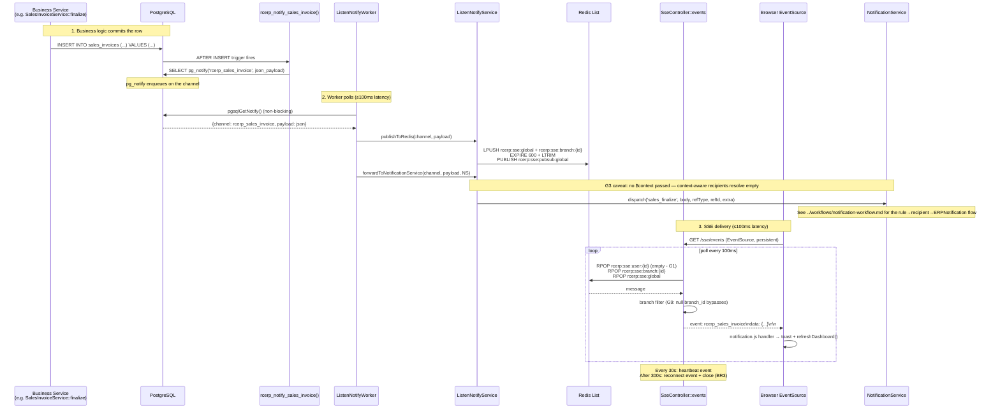
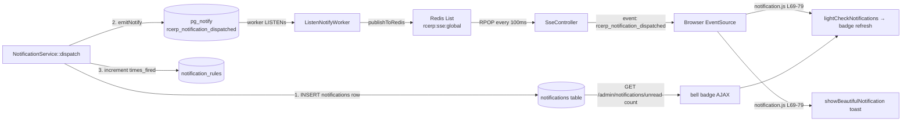
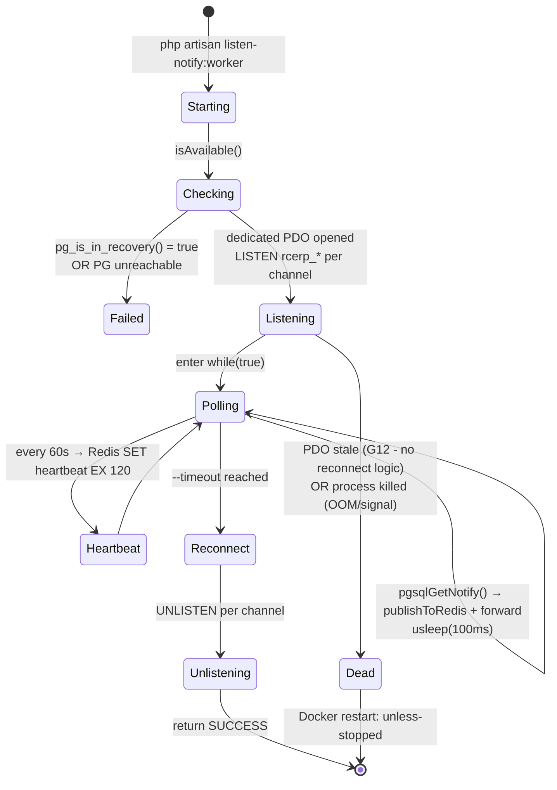

# Realtime Events — LISTEN/NOTIFY, SSE & Notification Fan-out (Canonical)

> **Module:** Architecture (cross-cutting)
> **Audience:** Engineers, AI assistants, DevOps, DBAs
> **Status:** Canonical — expanded in Phase 15 (replaces the Phase 1 high-level summary)
> **Last reviewed:** REALTIME-1 (post G-008/G-009 fix — both CRITICALs resolved)
> **Source of truth:** This file + `laravel/app/Services/Notification/ListenNotifyService.php`,
> `NotificationService.php` + `laravel/app/Http/Controllers/SseController.php` +
> `laravel/app/Console/Commands/ListenNotifyWorker.php` +
> `laravel/database/migrations/2025_01_21_000001_add_listen_notify_triggers.php` +
> `laravel/database/migrations/2026_01_02_000001_damage_listen_notify_and_audit.php` +
> `laravel/database/migrations/2026_01_03_000001_damage_attachments.php` +
> `laravel/public/assets/js/notification.js`
>
> **Scope:** This file is the canonical deep reference for the **realtime pipeline** — the
> 3-hop transport that delivers database change events to the browser without polling
> (PostgreSQL `LISTEN/NOTIFY` → PHP worker → Redis → SSE). The **rule-based notification
> system** layered on top (event → rule → recipient resolution → `ERPNotification`) is
> documented in the sibling file [`../workflows/notification-workflow.md`](../workflows/notification-workflow.md).
> This file covers only what is needed to understand the transport; the sibling covers who
> gets notified and why.
>
> **Health:** Pipeline is functional and well-architected for the documented use case, but
> has **2 CRITICAL gaps** (G1 — per-user Redis queue dead code; G2 — partition migration
> regresses the LISTEN/NOTIFY trigger payload) plus 5 HIGH + 6 MEDIUM + 7 LOW gaps. See
> §14.

---

## 1. What is it?

RC_ERP_v2 has a **realtime event pipeline** that pushes database changes to the browser
without polling. It is a **single-primary, single-worker, single-endpoint** design that
bridges three technologies in three hops:

1. **PostgreSQL `LISTEN`/`NOTIFY`** — DB triggers (10 trigger functions across 3
   migrations) call a shared `rcerp_notify(channel, table, action, id, branch_id, changes)`
   PL/pgSQL helper that fires `pg_notify()` with a JSON payload. 10 channels are registered
   in `ListenNotifyService::PG_CHANNELS`.
2. **A long-running PHP worker** (`php artisan listen-notify:worker`) — opens a dedicated
   raw PDO connection (separate from Laravel's request pool), issues `LISTEN rcerp_*` per
   channel, polls `pgsqlGetNotify()` non-blocking in a `while(true)` loop with a 100ms
   `usleep`, publishes each notification to Redis Lists + Pub/Sub, and forwards mapped
   channels to `NotificationService::dispatch()` for rule-based fan-out.
3. **Server-Sent Events (SSE)** — `SseController::events()` opens a `text/event-stream`
   response, polls 3 Redis Lists (`rcerp:sse:user:{id}`, `rcerp:sse:branch:{id}`,
   `rcerp:sse:global`) via `RPOP` every 100ms, applies branch filtering on global-queue
   events, sends `event: <pgChannel>\ndata: <json>\n\n` frames + a 30s heartbeat, and
   forces reconnect after 300s. The browser's `EventSource` auto-reconnects.

Layered on top is the **Laravel-native notification system** (`NotificationService` +
`ERPNotification`), which delivers rule-based in-app notifications (the bell icon) and
also emits `pg_notify('rcerp_notification_dispatched', ...)` so the SSE pipeline shows a
live toast. That layer is documented in
[`../workflows/notification-workflow.md`](../workflows/notification-workflow.md).

### 1.1 What this doc covers vs what it defers

| Topic | Documented here | Deferred |
|---|---|---|
| `pg_notify` channels + payload shape | §4 | — |
| DB triggers (the 10 `rcerp_notify_*` functions) | §7.4 | — |
| `ListenNotifyWorker` (the long-running command) | §7.2 | — |
| `ListenNotifyService` (PG ↔ Redis bridge) | §7.1 | — |
| `SseController` (the `/sse/events` stream + `/sse/status`) | §7.3 | — |
| Redis key map (Lists, Pub/Sub, heartbeat) | §7.5 | — |
| Client-side `EventSource` wiring | §7.6 | — |
| Event → rule → recipient resolution → `ERPNotification` | — | `../workflows/notification-workflow.md` |
| `NotificationRule` model + `EVENTS`/`RECIPIENTS` constants | — | `../workflows/notification-workflow.md` |
| `NotificationController` rule CRUD + bell AJAX | — | `../workflows/notification-workflow.md` |
| `view-notification-rules` Gate | — | `../security/rbac-roles-permissions.md` |

---

## 2. Why does it exist?

- **Operational visibility.** When a salesperson finalizes an invoice, the warehouse
  manager's invoice list should refresh instantly; when a payment is received, the
  accountant should see a toast. Polling every few seconds does not scale and feels slow.
  The pipeline delivers events in <150ms typical (PG trigger <1ms, worker poll 0-100ms,
  Redis LPUSH/RPOP <1ms, SSE flush <10ms).
- **Removed external dependencies.** Telegram alerts and Firebase FCM push were removed
  (see `../PROJECT_OVERVIEW.md` §9, R24/R25 dropped 2026-07-22). Laravel-native
  notifications + LISTEN/NOTIFY + SSE cover the same use case without third-party
  services. There is **no `config/broadcasting.php`** — the broadcast channel was removed.
- **Decoupling.** DB triggers emit raw change events; the worker + notification service
  decide who cares. Business modules don't need to know about SSE or Redis — they call
  `NotificationService::dispatch()` (or the DB trigger fires on their behalf) and the
  pipeline handles delivery.
- **Branch-scoped fan-out.** Events from one branch don't leak to another via SSE — the
  worker writes a per-branch Redis List and the SSE controller filters the global queue
  by `payload.branch_id` against the user's session branch (modulo G9 — see §12).

---

## 3. When is it used?

The pipeline is **always on** in production. Every authenticated page load opens an
`EventSource('/sse/events')` connection (wired in `components/erp/top-nav.blade.php` L212
on every authenticated page). The worker runs as a supervised Docker container
(`rcerp_listen_notify` in `docker-compose.yml`).

| Trigger | Frequency | Channel | Effect |
|---|---|---|---|
| `sales_invoices` INSERT/UPDATE | Per finalize/edit | `rcerp_sales_invoice` | Toast + dashboard refresh + `sales_finalize` notification rule fan-out |
| `sales_challans` INSERT/UPDATE | Per issue/edit | `rcerp_sales_challan` | `challan_create` notification rule fan-out (no direct JS handler — G17) |
| `sales_returns` INSERT/UPDATE | Per create/confirm/reverse | `rcerp_sales_return` | Toast + `return_created` notification rule fan-out |
| `customer_payments` INSERT/UPDATE | Per receive/edit | `rcerp_customer_payment` | Toast + `refreshPayments()` + `payment_receive` rule fan-out |
| `stock_transactions` INSERT | Per stock movement | `rcerp_stock_change` | Silent `refreshStockDisplay()` (high-frequency, no toast) |
| `journal_entries` INSERT | Per journal post | `rcerp_journal_entry` | Silent `refreshGLDashboard()` |
| `system_policies` UPDATE | Per policy change | `rcerp_system` | **DEAD in practice** (Phase 14 G12 — `SystemPolicyService` never UPDATEs `mode`, only `is_active`) |
| `notifications` INSERT (app-level) | Per `NotificationService::dispatch` | `rcerp_notification_dispatched` | Bell toast + `lightCheckNotifications()` badge refresh — **the bell toast path** |
| `damage_invoices` INSERT/UPDATE/DELETE | Per damage lifecycle | `rcerp_damage_change` | Damage index "reload" banner |
| `damage_attachments` INSERT/DELETE | Per evidence upload | `rcerp_damage_attachment_change` | Damage detail page Evidence gallery reload |

See §4 for the full channel classification (5 notification-mapped, 4 SSE-only refresh
signals, 1 emit-only).

---

## 4. Who uses it?

| Role | How they interact |
|---|---|
| All authenticated users | Receive SSE events automatically on every page load (bell badge, toasts, list refreshes). No opt-in. |
| Warehouse staff | See damage "reload" banner when another user edits a damage invoice in their branch. |
| Accountants | See `payment_receive` + `accounts_entry` (silent) toasts/refreshes. |
| Admins / superadmins | Manage notification rules at `/admin/notifications/rules` (gated by `view-notification-rules` Gate + `role:admin` middleware) — see `../workflows/notification-workflow.md`. |
| DevOps | Supervise the `rcerp_listen_notify` Docker container; monitor `/sse/status`; tail `docker compose logs rcerp_listen_notify`. |
| System (automated) | The `ListenNotifyWorker` artisan command runs 24/7; the DB triggers fire on every qualifying INSERT/UPDATE. |

---

## 5. Related modules

- [`../workflows/notification-workflow.md`](../workflows/notification-workflow.md) — the rule-based notification system on top of this pipeline (event → rule → recipient → `ERPNotification`).
- [`../security/rbac-roles-permissions.md`](../security/rbac-roles-permissions.md) — the `view-notification-rules` Gate.
- [`../security/branch-context-security.md`](../security/branch-context-security.md) — `session('branch_id')` propagation + SSE branch filtering (G9).
- [`../architecture/high-level-architecture.md`](high-level-architecture.md) — high-level positioning in the overall stack.
- [`../architecture/branch-isolation-rls.md`](branch-isolation-rls.md) — the RLS gap on notification tables (G5).
- [`../database/triggers-views-constraints.md`](../database/triggers-views-constraints.md) — DDL catalog of the 10 trigger functions + `rcerp_notify()` helper + `v_listen_notify_channels` view.
- [`../security/audit-trails.md`](../security/audit-trails.md) — the `fn_financial_audit_trigger` recurring attachment gap (G6).
- [`../security/system-policy-compliance.md`](../security/system-policy-compliance.md) — the `rcerp_system` channel + `rcerp_notify_system_policy()` trigger is dead in practice (Phase 14 G12).
- [`../workflows/approval-workflow.md`](../workflows/approval-workflow.md) — the approval notification dispatch dead code (Phase 14 G4; reaffirmed as notification-system G10).

---

## 6. Business rules

The transport layer enforces a small set of non-negotiable rules:

| # | Rule | Severity | Evidence |
|---|---|---|---|
| BR1 | The worker MUST run on the PostgreSQL primary, never a read replica. `LISTEN/NOTIFY` does not propagate to replicas. | MUST | `ListenNotifyService::isAvailable()` L236-245 checks `pg_is_in_recovery()`. |
| BR2 | The worker MUST be supervised in production (Docker `restart: unless-stopped`, or systemd/supervisor on bare metal). If it dies, realtime stops; the app still works (notifications still save to DB via `NotificationService::dispatch`), but SSE toasts + auto-refresh won't fire until it restarts. | MUST | `docker-compose.yml` L251-291 `rcerp_listen_notify` container. |
| BR3 | SSE connections MUST cap at 5 minutes (`MAX_CONNECTION_TIME = 300`). The controller sends a `reconnect` event and closes; the browser's `EventSource` auto-reconnects. This lets PHP-FPM recycle the worker. | MUST | `SseController::events` L108-113. |
| BR4 | The SSE stream MUST send a heartbeat every 30s to keep the connection alive through proxies. | MUST | `SseController::events` L155-161; `HEARTBEAT_INTERVAL = 30` L46. |
| BR5 | Branch isolation MUST apply at the SSE layer — events from the global queue whose `payload.branch_id` doesn't match the user's session branch are skipped. | MUST | `SseController::events` L148. **G9 caveat:** null `branch_id` bypasses the filter. |
| BR6 | `rcerp_damage_attachment_change` MUST be a separate channel from `rcerp_damage_change` so uploading a photo doesn't trigger the index refresh banner (only the detail page Evidence gallery reloads). | MUST | Migration `2026_01_03_000001` L148-167 comment. |
| BR7 | The `pg_notify` payload MUST be text (JSON string) and MUST stay under 8KB (PostgreSQL truncates above that). The largest realistic payload is ~500 bytes (sales_invoice UPDATE with all 7 columns changed) — not an active risk. | MUST | `rcerp_notify()` helper L51-76. |
| BR8 | `rcerp_notification_dispatched` MUST NOT be in `CHANNEL_EVENT_MAP` — otherwise `dispatch → emitNotify → worker → forwardToNotificationService → dispatch` would infinite-loop. It is emit-only (no DB trigger) and listen-only (no forward-back). | MUST | `ListenNotifyService::CHANNEL_EVENT_MAP` L84-90 omits it. |
| BR9 | Do NOT reintroduce Telegram or Firebase FCM. The notification system + SSE is the replacement. | MUST NOT | `../PROJECT_OVERVIEW.md` §9 (R24/R25 dropped 2026-07-22). |
| BR10 | `push.js` is a dead empty file — do NOT load it. | MUST NOT | `public/assets/js/push.js` is 0 bytes, unreferenced. |
| BR11 | The worker heartbeat interval is **60s** (not 30s as the worker docstring claims — G7). The Redis heartbeat key TTL is 120s, so a dead worker still appears "running" in `/sse/status` for up to 120s. | SHOULD know | `ListenNotifyWorker.php` L138 + L282. |

---

## 7. Technical implementation

### 7.1 `ListenNotifyService` — the PG ↔ Redis bridge (crown jewel)

**File:** `laravel/app/Services/Notification/ListenNotifyService.php` (304L)

#### Constants

`PG_CHANNELS` (L52-73) — public, hardcoded list of 10 channels the worker LISTENs on:

```php
public const PG_CHANNELS = [
    'rcerp_sales_invoice',
    'rcerp_sales_challan',
    'rcerp_sales_return',
    'rcerp_customer_payment',
    'rcerp_stock_change',
    'rcerp_journal_entry',
    'rcerp_system',
    'rcerp_notification_dispatched',
    'rcerp_damage_change',                  // Phase 2
    'rcerp_damage_attachment_change',       // Phase 3
];
```

`REDIS_PREFIX` (L78): `public const REDIS_PREFIX = 'rcerp:sse:';\n`

`CHANNEL_EVENT_MAP` (L84-90) — private, 5 mappings. Channels NOT in this map are
pure SSE refresh signals (no notification dispatch):

```php
private const CHANNEL_EVENT_MAP = [
    'rcerp_sales_invoice'   => 'sales_finalize',
    'rcerp_sales_challan'   => 'challan_create',
    'rcerp_sales_return'    => 'return_created',
    'rcerp_customer_payment'=> 'payment_receive',
    'rcerp_system'          => 'system_policy_change',
];
```

#### Channel classification

| Class | Channels | Behavior |
|---|---|---|
| **Notification-mapped** (forward to `NotificationService::dispatch`) | `rcerp_sales_invoice`, `rcerp_sales_challan`, `rcerp_sales_return`, `rcerp_customer_payment`, `rcerp_system` | Worker calls `forwardToNotificationService()` which calls `dispatch()` with the mapped event name. **WARNING (sibling doc G1-G3):** this path double-dispatches with direct PHP calls and omits `$context` — see `../workflows/notification-workflow.md` §12 G1-G3. |
| **SSE-only refresh signals** (no notification dispatch) | `rcerp_stock_change`, `rcerp_journal_entry`, `rcerp_damage_change`, `rcerp_damage_attachment_change` | Worker publishes to Redis only; SSE clients receive the event and refresh their UI. No bell notification. |
| **Emit-only** (no DB trigger, no forward-back) | `rcerp_notification_dispatched` | Emitted by `NotificationService::dispatch` L145 via `emitNotify()`. Worker LISTENs + publishes to Redis (so SSE shows the toast) but does NOT forward back to `dispatch()` — prevents infinite loop (BR8). |

#### `publishToRedis(string $pgChannel, array $payload): void` (L107-158)

Writes the notification to **3 Redis destinations** for robustness:

```php
public function publishToRedis(string $pgChannel, array $payload): void
{
    $message = json_encode([
        'channel' => $pgChannel,
        'payload' => $payload,
        'published_at' => now()->toISOString(),
    ], JSON_UNESCAPED_UNICODE);

    // --- Redis List delivery (for SSE polling) ---
    try {
        $redis = Redis::connection('default');
        $redis->lpush(self::REDIS_PREFIX . 'global', $message);
        $redis->expire(self::REDIS_PREFIX . 'global', 600); // TTL 10 min
        $redis->ltrim(self::REDIS_PREFIX . 'global', 0, 499); // keep last 500
    } catch (\Throwable $e) {
        Log::warning('LISTEN/NOTIFY: Redis LPUSH to global queue failed', [...]);
    }

    // LPUSH to branch-specific queue
    $branchId = $payload['branch_id'] ?? null;
    if ($branchId) {
        try {
            $branchKey = self::REDIS_PREFIX . "branch:{$branchId}";
            $redis = Redis::connection('default');
            $redis->lpush($branchKey, $message);
            $redis->expire($branchKey, 600);
            $redis->ltrim($branchKey, 0, 199); // keep last 200
        } catch (\Throwable $e) {
            Log::warning('LISTEN/NOTIFY: Redis LPUSH to branch queue failed', [...]);
        }
    }

    // --- Redis Pub/Sub delivery (for external subscribers) ---
    try {
        Redis::connection('default')->publish(self::REDIS_PREFIX . 'pubsub:global', $message);
    } catch (\Throwable $e) {
        Log::warning('LISTEN/NOTIFY: Redis Pub/Sub publish failed', [...]);
    }
}
```

> **G1 evidence:** This method writes ONLY to `rcerp:sse:global`, `rcerp:sse:branch:{id}`,
> and `rcerp:sse:pubsub:global`. It does NOT write to `rcerp:sse:user:{user_id}` —
> confirming the per-user queue is dead code (the Phase 1 doc's claim that it's "written by
> the notification path" was false).

#### `forwardToNotificationService(string $pgChannel, array $payload, NotificationService $notificationService): void` (L170-204)

For notification-mapped channels only. Calls `NotificationService::dispatch()` with the
mapped event name. **G3 (sibling doc):** omits the 6th `$context` argument, so
context-aware recipient types silently resolve empty on this path.

```php
public function forwardToNotificationService(
    string $pgChannel,
    array $payload,
    NotificationService $notificationService
): void {
    $eventName = self::CHANNEL_EVENT_MAP[$pgChannel] ?? null;

    if (!$eventName) {
        return; // No mapping — skip notification dispatch
    }

    $body = $this->buildNotificationBody($pgChannel, $payload);
    $referenceType = $payload['table'] ?? null;
    $referenceId = $payload['id'] ?? null;

    try {
        $notificationService->dispatch(
            event: $eventName,
            body: $body,
            referenceType: $referenceType,
            referenceId: $referenceId,
            extra: [
                'pg_channel' => $pgChannel,
                'changes' => $payload['changes'] ?? [],
            ]
        );
    } catch (\Throwable $e) {
        Log::error('LISTEN/NOTIFY: Failed to forward to NotificationService', [...]);
    }
}
```

#### `emitNotify(string $channel, array $data): void` (L215-229) — application-level NOTIFY

Lets PHP emit a `pg_notify` for events that don't have DB triggers (e.g. user login, the
`rcerp_notification_dispatched` channel). Uses parameterized `pg_notify()` (safe — it's a
function taking text args, not a `SET` statement):

```php
public function emitNotify(string $channel, array $data): void
{
    $payload = json_encode(array_merge($data, [
        'triggered_at' => now()->toISOString(),
    ]), JSON_UNESCAPED_UNICODE);

    try {
        DB::statement("SELECT pg_notify(?, ?)", [$channel, $payload]);
    } catch (\Throwable $e) {
        Log::warning('LISTEN/NOTIFY: pg_notify failed', [...]);
    }
}
```

> **Call sites:** Only `NotificationService::dispatch()` L145 calls this (for
> `rcerp_notification_dispatched`). No other app code emits `pg_notify` directly.

#### `isAvailable(): bool` (L236-245)

Returns `false` on a PostgreSQL read replica (`pg_is_in_recovery()` = true). The worker
refuses to start; `/sse/status` reports `pg_available: false`.

```php
public function isAvailable(): bool
{
    try {
        $result = DB::selectOne("SELECT pg_is_in_recovery()");
        return !$result->pg_is_in_recovery;
    } catch (\Throwable $e) {
        return false;
    }
}
```

#### `getActiveChannels(): array` (L252-274)

Queries `pg_listening_channels()` for active `rcerp_*` LISTEN entries — used by
`/sse/status` to confirm the worker is alive.

#### `buildNotificationBody(string $pgChannel, array $payload): string` (L283-303) — private

Builds a human-readable body for worker-forwarded notifications (e.g.
`"Sales_invoices #42 created (status: \"finalized\")"`). **G2 impact:** when the
partition migration regresses the payload to `{action, id}` only, `$table` falls back to
`'record'` and the body becomes `"Record #42 updated"` — useless.

### 7.2 `ListenNotifyWorker` — the long-running command

**File:** `laravel/app/Console/Commands/ListenNotifyWorker.php` (293L)

#### Signature (L45-48)

```php
protected $signature = 'listen-notify:worker
    {--no-dispatch : Skip forwarding to NotificationService}
    {--channels= : Comma-separated PG channels to listen on (default: all)}
    {--timeout=0 : Max seconds to run (0 = infinite)}';

protected $description = 'Listen on PostgreSQL NOTIFY channels and forward to Redis Pub/Sub + NotificationService';
```

#### `handle()` main loop (L73-159)

1. Calls `isAvailable()` — refuses to start on a read replica.
2. Opens a **dedicated raw PDO connection** via `getDedicatedConnection()` (separate from
   Laravel's pool — required because `LISTEN` needs a persistent non-pooled connection).
3. Issues `LISTEN rcerp_*` per channel.
4. Enters `while(true)`:
   - Checks the `--timeout` option (0 = infinite).
   - Calls `pollNotifications()` (consumes all pending `pgsqlGetNotify()` results).
   - Sends a heartbeat every **60s** (L138 — despite the L37 docstring saying "30s"; G7).
   - `usleep(100000)` — 100ms between poll cycles.
5. On exit: `UNLISTEN` per channel.

#### `getDedicatedConnection(): ?\PDO` (L170-191) — private

Opens a raw PDO from `config('database.connections.pgsql.*')`. **G12:** no reconnection
logic — if the PG primary fails over, this PDO becomes stale and `pgsqlGetNotify` silently
returns false forever while the heartbeat (which uses Redis, not PG) keeps writing,
masking the failure from `/sse/status`.

#### `pollNotifications()` (L204-258) — private

Consumes all pending notifications via `$pdo->pgsqlGetNotify(\PDO::FETCH_ASSOC, 0)` (the
`0` = non-blocking, return immediately if nothing pending). For each notification:
1. JSON-decodes the payload.
2. Calls `ListenNotifyService::publishToRedis($channel, $data)` → Redis Lists + Pub/Sub.
3. If `--no-dispatch` is NOT set, calls
   `ListenNotifyService::forwardToNotificationService($channel, $data, $notificationService)`.

#### `sendHeartbeat()` (L268-292) — private

Writes a JSON heartbeat to Redis key `rcerp:listen_notify:heartbeat` with TTL 120s:

```php
\Illuminate\Support\Facades\Redis::set(
    'rcerp:listen_notify:heartbeat',
    json_encode([
        'timestamp' => now()->toISOString(),
        'processed_count' => $this->processedCount,
        'last_notification_at' => $this->lastNotificationAt > 0
            ? now()->setTimestamp($this->lastNotificationAt)->toISOString()
            : null,
        'pid' => getmypid(),
    ]),
    'EX',
    120 // TTL 2 minutes — if worker dies, key expires
);
```

#### Supervision (G4)

The worker is **NOT scheduled by Laravel cron** — `routes/console.php` has 5
`Schedule::command` entries, none for `listen-notify:worker`. Supervision is delegated to
`docker-compose.yml`:

```yaml
rcerp_listen_notify:
  build: { context: ., dockerfile: Dockerfile }
  container_name: rcerp_listen_notify
  restart: unless-stopped
  depends_on:
    rcerp_postgres: { condition: service_healthy }
    rcerp_redis: { condition: service_healthy }
  command: php artisan listen-notify:worker
  volumes:
    - ./laravel:/var/www/laravel:delegated
    - app_vendor:/var/www/laravel/vendor
  networks: [rcerp_network]
  working_dir: /var/www/laravel
```

There is **no in-repo `supervisor.conf` or systemd unit file**. Non-Docker deployments
(bare-metal VPS) must hand-roll supervision.

### 7.3 `SseController` — the SSE stream + status

**File:** `laravel/app/Http/Controllers/SseController.php` (312L)

#### Routes (`routes/web.php` L1787-1792, inside the outer auth group)

```php
Route::prefix('sse')->name('sse.')->group(function () {
    Route::get('events', [SseController::class, 'events'])->name('events');
    Route::get('status', [SseController::class, 'status'])->name('status');
});
```

No explicit `role:` middleware — SSE is available to **all authenticated users**. No
`branch.isolation` middleware — branch isolation is enforced in-controller via
`session('branch_id')` filtering on the global queue.

#### Constants (L42-64)

```php
private const HEARTBEAT_INTERVAL = 30;       // L46 — seconds
private const MAX_CONNECTION_TIME = 300;     // L53 — 5 minutes
private const POLL_INTERVAL_US = 100000;     // L59 — 100ms
private const QUEUE_TTL = 600;               // L64 — 10 minutes (UNUSED — dead constant, G8)
```

> **G8:** All four constants are hardcoded `private const` — no `env()` call, no
> `config/realtime.php`. Tuning requires code change + redeploy. `QUEUE_TTL` is declared
> but never used (the worker sets its own 600s TTL on LPUSH).

#### `events(Request $request)` (L72-185) — the SSE stream

1. Authenticates the user (`abort(401)` if not logged in).
2. Reads `session('branch_id')` + `$user->id`.
3. Sets 4 headers: `Content-Type: text/event-stream`, `Cache-Control: no-cache`,
   `Connection: keep-alive`, `X-Accel-Buffering: no` (disables Nginx buffering).
4. Sends an initial `connected` event.
5. Enters `while(true)`:
   - If `time() - $startTime >= 300`: send `reconnect` event + break (BR3).
   - If `connection_aborted()`: break.
   - Calls `pollRedisQueues()` → up to 10 events from each of 3 queues (user, branch,
     global).
   - For each event: **branch filter** (L148):

     ```php
     $eventBranchId = $payload['branch_id'] ?? null;
     if ($eventBranchId && $branchId && (int) $eventBranchId !== (int) $branchId) {
         continue;
     }
     ```

     > **G9:** null `$eventBranchId` short-circuits the `if` to false, so the event is
     > forwarded unfiltered. Combined with G2 (partition migration makes `branch_id`
     > null), partitioned `sales_returns` and `damage_invoices` events leak to ALL
     > branches via the global queue.

   - Calls `sendSseEvent($pgChannel, $payload)`.
   - Every 30s: send `heartbeat` event (BR4).
   - `usleep(100000)` — 100ms.

#### `pollRedisQueues()` (L242-287) — private

RPOPs up to 10 messages from each of 3 queues (in priority order: user → branch → global).
**G1:** the per-user queue `rcerp:sse:user:{userId}` is polled every iteration but NEVER
written by any code path in the entire app — it's permanently empty.

#### `sendSseEvent(string $event, array $data): void` (L300-311) — private

```php
private function sendSseEvent(string $event, array $data): void
{
    $json = json_encode($data, JSON_UNESCAPED_UNICODE);
    echo "event: {$event}\n";
    echo "data: {$json}\n\n";

    if (ob_get_level()) {
        ob_flush();
    }
    flush();
}
```

#### `status(ListenNotifyService $listenNotify)` (L196-229) — JSON status endpoint

Returns:

```json
{
  "status": "active",
  "pg_available": true,
  "pg_channels": [{"channel": "rcerp_sales_invoice", "pid": 123, "listener_count": 1}],
  "redis_status": "connected",
  "supported_channels": [...10 channels...],
  "worker_running": true,
  "worker_heartbeat": {"timestamp": "...", "processed_count": N, "last_notification_at": "...", "pid": N}
}
```

> **G7 caveat:** `worker_running = !empty($channels) || $workerHeartbeat !== null`. The
> heartbeat Redis key has a 120s TTL and the worker writes every 60s, so a dead worker
> still appears "running" for up to 120s after death. Also, `pg_channels` is queried via
> Laravel's DB connection (not the worker's PDO) — so the presence of LISTEN entries
> confirms the worker's PDO is alive, but absence could mean either "worker not running"
> OR "worker's PDO went stale but Laravel's connection still works."

### 7.4 DB triggers — the LISTEN/NOTIFY emitters

#### Shared helper: `rcerp_notify()` (migration `2025_01_21_000001` L51-76)

All trigger functions call this shared PL/pgSQL helper. It builds the canonical JSON
payload and calls `pg_notify()`:

```sql
CREATE OR REPLACE FUNCTION rcerp_notify(
    p_channel   text,
    p_table     text,
    p_action    text,
    p_id        integer,
    p_branch_id integer DEFAULT NULL,
    p_changes   jsonb  DEFAULT '{}'::jsonb
)
RETURNS void AS $$
DECLARE
    v_payload jsonb;
BEGIN
    v_payload := jsonb_build_object(
        'table',        p_table,
        'action',       p_action,
        'id',           p_id,
        'branch_id',    p_branch_id,
        'changes',      p_changes,
        'triggered_at', CURRENT_TIMESTAMP
    );
    PERFORM pg_notify(p_channel, v_payload::text);
END;
$$ LANGUAGE plpgsql
```

**Canonical payload shape:** `{table, action, id, branch_id, changes, triggered_at}`.

#### Trigger functions + attachments (10 total)

| # | Function | Migration:Line | Channel | Table | Timing | Notifies when |
|---|---|---|---|---|---|---|
| 1 | `rcerp_notify_sales_invoice()` | `2025_01_21_000001`:86 | `rcerp_sales_invoice` | `sales_invoices` | AFTER INSERT OR UPDATE | INSERT always; UPDATE if any of (status, is_godown_prepared, is_challan_issued, is_reversed, total_amount, paid_amount, call_a_day) changed |
| 2 | `rcerp_notify_sales_challan()` | `2025_01_21_000001`:153 | `rcerp_sales_challan` | `sales_challans` | AFTER INSERT OR UPDATE | INSERT always; UPDATE if (is_reversed, is_dispatch_soft_hold) changed |
| 3 | `rcerp_notify_sales_return()` | `2025_01_21_000001`:197 | `rcerp_sales_return` | `sales_returns` | AFTER INSERT OR UPDATE | INSERT always; UPDATE if (status, is_reversed) changed |
| 4 | `rcerp_notify_customer_payment()` | `2025_01_21_000001`:240 | `rcerp_customer_payment` | `customer_payments` | AFTER INSERT OR UPDATE | INSERT always; UPDATE if (is_reversed, amount) changed |
| 5 | `rcerp_notify_stock_change()` | `2025_01_21_000001`:285 | `rcerp_stock_change` | `stock_transactions` | AFTER INSERT | Always (no UPDATE/DELETE). `branch_id` resolved via `SELECT w.branch_id FROM warehouses w WHERE w.id = NEW.warehouse_id` |
| 6 | `rcerp_notify_journal_entry()` | `2025_01_21_000001`:318 | `rcerp_journal_entry` | `journal_entries` | AFTER INSERT | Always. No UPDATE/DELETE |
| 7 | `rcerp_notify_system_policy()` | `2025_01_21_000001`:340 | `rcerp_system` | `system_policies` | AFTER UPDATE | Only when `NEW.mode IS DISTINCT FROM OLD.mode` — **DEAD IN PRACTICE** (Phase 14 G12: `SystemPolicyService` never UPDATEs `mode`, only `is_active` + INSERTs new rows) |
| 8 | `rcerp_notify_damage()` | `2026_01_02_000001`:51 | `rcerp_damage_change` | `damage_invoices` | AFTER INSERT OR UPDATE OR DELETE | INSERT always (with status/damage_type/total_value/is_reversed/journal_entry_id); UPDATE if any of 7 cols changed; DELETE with OLD.status + OLD.is_reversed |
| 9 | `rcerp_notify_damage_attachment()` | `2026_01_03_000001`:168 | `rcerp_damage_attachment_change` | `damage_attachments` | AFTER INSERT | Always. `branch_id` resolved via `SELECT di.branch_id FROM damage_invoices di WHERE di.id = NEW.damage_invoice_id` (fallback `0` if NULL) |
| 10 | `rcerp_notify_damage_attachment_delete()` | `2026_01_03_000001`:203 | `rcerp_damage_attachment_change` | `damage_attachments` | AFTER DELETE | Always (uses `OLD.*`) |

#### Monitoring view (`2025_01_21_000001` L384-399)

```sql
CREATE OR REPLACE VIEW v_listen_notify_channels AS
SELECT pid, usename, application_name, client_addr, backend_start, query_start, state, query
FROM pg_stat_activity
WHERE query ILIKE '%LISTEN%' OR query ILIKE '%rcerp_%'
ORDER BY backend_start DESC
```

### 7.5 Redis key map

| Key pattern | TTL | Trim | Writer | Reader | Purpose |
|---|---|---|---|---|---|
| `rcerp:sse:global` | 600s | last 500 (`ltrim 0 499`) | `ListenNotifyService::publishToRedis` L119-122 | `SseController::pollRedisQueues` L273 (`rpop ... 10`) | Global event queue — all SSE clients poll this. |
| `rcerp:sse:branch:{branch_id}` | 600s | last 200 (`ltrim 0 199`) | `ListenNotifyService::publishToRedis` L134-138 (only if `$payload['branch_id']` non-null) | `SseController::pollRedisQueues` L263 (`rpop ... 10`) | Branch-scoped event queue. |
| `rcerp:sse:user:{user_id}` | — | — | **NONE — DEAD QUEUE (G1)** | `SseController::pollRedisQueues` L253 (`rpop ... 10`) | Per-user event queue. **Polled every 100ms but never written.** |
| `rcerp:sse:pubsub:global` | n/a (Pub/Sub) | n/a | `ListenNotifyService::publishToRedis` L151 (`publish`) | NONE in app — fire-and-forget for external subscribers | Redis Pub/Sub channel. No in-app consumer. |
| `rcerp:listen_notify:heartbeat` | 120s | n/a | `ListenNotifyWorker::sendHeartbeat` L271-283 (`Redis::set ... 'EX' 120`) | `SseController::status` L212 (`Redis::get`) | Worker liveness. JSON `{timestamp, processed_count, last_notification_at, pid}`. |

> Redis client is `predis` (per `config/database.php` L89 + `composer.json`
> `predis/predis ^2.0`). NOT `phpredis`. 3 Redis DBs: default=0, legacy session=1,
> cache=2.

### 7.6 Client-side wiring — `notification.js`

**File:** `laravel/public/assets/js/notification.js` (319L)

#### `initSSE()` (L45-187)

```js
eventSource = new EventSource(BASE_URL + 'sse/events');   // NO withCredentials
window.rcerpEventSource = eventSource;                    // exposed for page-specific listeners
```

#### Event handlers (11 listeners)

| Event | Line | Action |
|---|---|---|
| `connected` | L60 | Console log + reset sseRetries + stopPolling() |
| `rcerp_notification_dispatched` | L69-79 | Parse `changes.title`/`body`/`reference_id` → `showBeautifulNotification(...)` + `lightCheckNotifications()` badge refresh. **THIS is the bell toast path.** |
| `rcerp_sales_invoice` | L81-106 | 3 sub-conditions: status=finalized/confirmed → "Invoice Updated"; is_challan_issued=true → "Challan Issued"; is_reversed=true → "Invoice Reversed". Plus `refreshDashboard()` if defined. |
| `rcerp_customer_payment` | L108-120 | If `changes.status==='confirmed'` OR `action==='INSERT'` → "Payment Received" toast. Plus `refreshPayments()` if defined. |
| `rcerp_sales_return` | L122-132 | If `changes.status` → "Return Updated" toast. |
| `rcerp_stock_change` | L134-137 | **Silent** — `refreshStockDisplay()` if defined (high-frequency, no toast). |
| `rcerp_journal_entry` | L139-142 | **Silent** — `refreshGLDashboard()` if defined. |
| `rcerp_system` | L144-152 | "System Policy Changed" toast with old_mode → new_mode. **DEAD in practice** (Phase 14 G12 — trigger never fires). |
| `heartbeat` | L154-157 | Console log only. |
| `reconnect` | L159-165 | Parse `retry_after_ms` (default 3000), `closeSSE()`, `setTimeout(initSSE, retryMs)`. |
| `error` | L167-181 | If `readyState===CLOSED`: `sseRetries++`; if `≤ MAX_SSE_RETRIES` (5): exponential backoff capped at 30s, `setTimeout(initSSE, backoff)`; else `startPolling()`. If `readyState===CONNECTING`: EventSource auto-reconnects. |

> **G17:** NO handler for `rcerp_sales_challan`. The channel IS in `PG_CHANNELS` +
> `CHANNEL_EVENT_MAP` (mapped to `challan_create`). The toast arrives via the
> `rcerp_notification_dispatched` path instead (with `changes.title = "Challan Created"`).

#### Bell badge + toast

- `updateNotificationBadge(count)` (L256-263) — updates `#notifBadge` text (99+ capped) +
  display toggle.
- `showBeautifulNotification(title, message, invoiceId=null)` (L230-254) — appends a
  custom Bootstrap-styled `.custom-toast` div to `#notificationContainer` (positioned in
  `top-nav.blade.php` L201-202). Auto-removes after 8s. **G18:** link hardcoded to
  `sales/today` regardless of `reference_type`.
- `lightCheckNotifications()` (L265-275) — GET `/admin/notifications/unread-count` →
  updates badge.
- `startPolling()` (L201-208) — 30s AJAX polling fallback when SSE unavailable (G16).
- Auto-init (L299-308) — probes `/sse/status` first, then picks SSE or polling.

#### Page-specific listeners (NOT in `notification.js`)

- `admin/damages/index.blade.php` L552-602 — attaches `rcerp_damage_change` listener to
  `window.rcerpEventSource`. Shows `#dmgRefreshBanner` with Reload/Dismiss buttons.
- `admin/damages/show.blade.php` L1595-1618 — attaches `rcerp_damage_attachment_change`
  listener. If `payload.damage_invoice_id === currentDamageId`, calls
  `window.location.reload()`.

---

## 8. Important database tables

| Table | Role | Schema source | RLS | Audit trigger |
|---|---|---|---|---|
| `notifications` | Laravel's notification table (in-app bell queue). UUID `id`, `notifiable_id`/`notifiable_type`, `type`, `jsonb data`, `read_at`, timestamps. | Migration `2025_01_06_000001` (DDL stale G3 — `database/sql/06_payment_and_misc.sql` L181-194 has the OLD legacy schema). | **NO** (G5) | **NO** (G6) |
| `notification_rules` | Rule definitions (event → recipients). `id`, `name`, `event`, `channel` (default `database`), `is_active`, `times_fired`, `description`, `created_by`, `deleted_at` (SoftDeletes), timestamps. | Migration `2025_01_06_000001`. | **NO** (G5) | **NO** (G6) |
| `notification_rule_recipients` | Multi-recipient selections per rule (F-18b pivot). `id`, `notification_rule_id` (FK cascade), `recipient_type` (string), `recipient_user_id` (nullable, for `specific_user`), timestamps. | Migration `2025_01_26_000001`. | **NO** (G5) | **NO** (G6) |
| (transactional tables) | `sales_invoices`, `sales_challans`, `sales_returns`, `customer_payments`, `stock_transactions`, `journal_entries`, `system_policies`, `damage_invoices`, `damage_attachments` — carry `trg_notify_*` triggers that fire `pg_notify`. | Migrations `2025_01_21_000001` + `2026_01_02_000001` + `2026_01_03_000001` (DDL stale G3 — trigger functions + view missing from `database/sql/*.sql` baseline). | varies | `customer_payments` + `journal_entries` have `fn_financial_audit_trigger`; the other 8 monitored tables do NOT (G6). |

See [`../database/schema-overview.md`](../database/schema-overview.md) for the full schema
and [`../database/er-diagrams.md`](../database/er-diagrams.md) for ER diagrams.

---

## 9. Related services

| Service | File | Role |
|---|---|---|
| `ListenNotifyService` | `laravel/app/Services/Notification/ListenNotifyService.php` (304L) | PG ↔ Redis bridge. `publishToRedis()`, `forwardToNotificationService()`, `emitNotify()`, `isAvailable()`, `getActiveChannels()`, `buildNotificationBody()`. |
| `NotificationService` | `laravel/app/Services/Notification/NotificationService.php` (262L) | Rule-based dispatcher. `dispatch()`, `resolveRecipients()`, `getStats()`. Documented in `../workflows/notification-workflow.md`. |

`ListenNotifyService` is NOT registered as a singleton in `AppServiceProvider` (G8 in
sibling doc) — Laravel's container creates a new instance per injection. It's stateless so
this is a minor perf concern only.

---

## 10. Related models

| Model | File | Role |
|---|---|---|
| `NotificationRule` | `laravel/app/Models/NotificationRule.php` (177L) | Rule model. `EVENTS` + `RECIPIENTS` + `CHANNELS` + `CONTEXT_AWARE_RECIPIENTS` constants. SoftDeletes. Documented in `../workflows/notification-workflow.md`. |
| `NotificationRuleRecipient` | `laravel/app/Models/NotificationRuleRecipient.php` (65L) | Pivot row (one recipient-type selection per rule). `getLabelAttribute()`. |

There is no Eloquent model for the `notifications` table — Laravel's `Notifiable` trait
handles it via `auth()->user()->notifications()` / `unreadNotifications`.

---

## 11. Important workflows

### 11.1 End-to-end flow (Mermaid sequenceDiagram)



### 11.2 The bell toast path (Mermaid flowchart)

The bell toast for a dispatched notification travels a separate path —
`NotificationService::dispatch()` writes the `notifications` DB row (bell badge) AND emits
`rcerp_notification_dispatched` via `emitNotify()` (live toast):



### 11.3 Worker lifecycle (Mermaid stateDiagram)



---

## 12. Known edge cases & rules for AI

- **The worker must be supervised in production** (Docker `restart: unless-stopped` or
  systemd/supervisor on bare metal — BR2). If it dies, realtime stops; the app still works
  (notifications still save to DB via `NotificationService::dispatch`), but SSE toasts +
  auto-refresh stop working. `/sse/status` reports `worker_running: false` after the
  120s heartbeat TTL expires.
- **SSE connections cap at 5 minutes** (BR3). The client must handle the `reconnect`
  event (EventSource does this automatically).
- **Heartbeat is 60s, not 30s** (G7 — the worker docstring L37 is wrong). The Redis
  heartbeat key TTL is 120s, so a dead worker still appears "running" for up to 120s.
- **`LISTEN/NOTIFY` only works on the PostgreSQL primary**, not replicas
  (`isAvailable()` checks `pg_is_in_recovery()` — BR1). `isAvailable()` is called by BOTH
  the worker (start) and `/sse/status` (every request), so a replica-only deployment will
  report `pg_available: false` everywhere.
- **Branch isolation applies at the SSE layer** (BR5) — the global queue is filtered by
  `payload.branch_id` against the user's session branch. **G9 caveat:** null `branch_id`
  bypasses the filter — combined with G2 (partition migration regresses `branch_id` to
  null), partitioned `sales_returns` and `damage_invoices` events leak to ALL branches.
- **`rcerp_damage_attachment_change` is deliberately separate from
  `rcerp_damage_change`** (BR6) so uploading a photo doesn't trigger the index refresh
  banner.
- **Per-user Redis queue `rcerp:sse:user:{id}` is DEAD CODE** (G1). The Phase 1 doc
  claimed it's "written by the notification path" — that was false. `SseController`
  polls it every 100ms but no code path ever LPUSHes to it. Per-user targeting is
  impossible via Redis queue; per-user notifications rely entirely on the
  `rcerp_notification_dispatched` channel + global queue (no per-user filtering at the
  SSE layer — branch filtering only).
- **`rcerp_sales_challan` SSE handler is missing in `notification.js`** (G17). The toast
  arrives via the `rcerp_notification_dispatched` path instead (with `changes.title =
  "Challan Created"`).
- **Partition migration regresses the trigger payload** (G2 — CRITICAL). Migration
  `2026_08_02_000004_partition_transaction_headers_low_fk.php` L1043-1056 + L1576-1589
  recreates `trg_notify_sales_returns` + `trg_notify_damage_invoices` on the new
  partitioned parents with a SIMPLIFIED `{action, id}` payload — loses `table`,
  `branch_id`, `changes`, `triggered_at`. When partitioning is applied: branch-scoped SSE
  delivery breaks (no branch_id → no branch queue write + G9 bypass → global leak),
  notification body becomes "Record #42 updated", `reference_type` becomes null.
- **Worker has no reconnection logic** (G12 — MEDIUM). If the PG primary fails over, the
  worker's PDO becomes stale and `pgsqlGetNotify` silently returns false forever while the
  heartbeat (Redis, separate connection) keeps writing, masking the failure from
  `/sse/status`.
- **Removed features:** Do NOT reintroduce Telegram or FCM (BR9). The notification system
  + SSE is the replacement (see `../PROJECT_OVERVIEW.md` §9).
- **`push.js` is dead** (BR10 / G15) — 0 bytes, unreferenced. Do NOT load it.
- **`pg_notify` payload is text** (JSON string, BR7). Keep payloads small; PostgreSQL
  truncates at 8 KB. The largest realistic payload is ~500 bytes — not an active risk.
- **No in-repo supervisor/systemd config** (G4). Docker's `restart: unless-stopped` is
  the ONLY supervision. Non-Docker deployments must hand-roll it.
- **Hardcoded constants** (G8): `HEARTBEAT_INTERVAL`, `MAX_CONNECTION_TIME`,
  `POLL_INTERVAL_US`, Redis TTLs, trim sizes — all `private const` in PHP classes. No
  `config/realtime.php` or `.env` vars. Tuning requires code change + redeploy.
- **`QUEUE_TTL` is a dead constant** (G8) — declared in `SseController` L64 but never
  used (the worker sets its own 600s TTL on LPUSH).

---

## 13. Future improvements

Ordered by severity (HIGH first). Each item maps to a gap in §14.

1. **G1 — Implement per-user Redis queue writes OR remove the dead `rpop` call.** Either
   add `Redis::lpush("rcerp:sse:user:{$user->id}", $message)` in
   `NotificationService::dispatch` after `$user->notify(...)`, OR delete the `$userQueueKey`
   setup in `SseController::events` L99 + the `rpop` call in `pollRedisQueues` L252-259 +
   correct this doc's prior false claim.
2. **G2 — Fix the partition migration trigger regression.** In
   `2026_08_02_000004_partition_transaction_headers_low_fk.php` L1043-1056 + L1576-1589,
   replace the simplified trigger functions with calls to the original rich
   `rcerp_notify_sales_return()` / `rcerp_notify_damage()` functions (which call the
   shared `rcerp_notify()` helper to preserve the canonical payload shape).
3. **G3 — Add DDL for trigger functions + view to `database/sql/*.sql` baseline.** Add
   the 10 trigger functions, `rcerp_notify()` helper, `v_listen_notify_channels` view, and
   the Laravel-standard `notifications` table to `database/sql/06_payment_and_misc.sql` +
   `07_views_triggers_constraints.sql`. Add `notification_rule_recipients` to baseline.
4. **G4 — Add supervisor/systemd config templates to repo.** Create a `supervisor/`
   directory with `rcerp-listen-notify.conf` + a `systemd/rcerp-listen-notify.service`
   unit file. Document the choice in the deployment README.
5. **G5 — Enable RLS on `notifications`, `notification_rules`,
   `notification_rule_recipients`.** `notifications`: policy on `notifiable_id =
   current_setting('app.user_id')::int`; `notification_rules` + pivot: admin-bypass-only.
6. **G6 — Attach `fn_financial_audit_trigger` to all 10 monitored tables.** Currently
   only `customer_payments` + `journal_entries` have it; the other 8 (`sales_invoices`,
   `sales_challans`, `sales_returns`, `stock_transactions`, `system_policies`,
   `damage_invoices`, `damage_attachments`, `notifications`, `notification_rules`,
   `notification_rule_recipients`) lack tamper-evident audit at the DB level.
7. **G7 — Align heartbeat docstring with code** (change "30 seconds" → "60 seconds" at
   `ListenNotifyWorker.php` L37). Reduce Redis TTL to 90s (1.5× heartbeat). Add a
   `last_heartbeat_age_seconds` field to `/sse/status`.
8. **G8 — Move hardcoded constants to `config/realtime.php` with `env()` defaults.** Add
   `SSE_POLL_INTERVAL_US`, `SSE_HEARTBEAT_INTERVAL`, `SSE_MAX_CONNECTION_TIME`,
   `LISTEN_NOTIFY_REDIS_TTL`, `LISTEN_NOTIFY_GLOBAL_TRIM`, `LISTEN_NOTIFY_BRANCH_TRIM` to
   `.env.example`. Delete the dead `QUEUE_TTL` constant.
9. **G9 — Fix null `branch_id` bypass in SSE filter.** Change
   `SseController::events` L148 to explicit filtering (if user has a branch, only forward
   matching events; null `branch_id` events get filtered OUT unless user is
   admin/superadmin). OR add an explicit `is_global` flag to the payload.
10. **G12 — Add try/catch + reconnection logic to the worker.** On `\PDOException`, log +
    close + reconnect via `getDedicatedConnection()` + re-issue LISTEN commands. Add a
    `worker_pdo_healthy` field to `/sse/status` (worker writes `pdo_last_success_at` as
    part of heartbeat JSON).
11. **G14 — Add tests for the realtime pipeline.** `tests/Feature/Realtime/SseStatusTest.php`,
    `tests/Feature/Realtime/BranchFilterTest.php`,
    `tests/Unit/Services/Notification/ListenNotifyServiceTest.php`.
12. **G17 — Add `rcerp_sales_challan` listener to `notification.js`** (calling
    `refreshChallans()` if defined) OR document that challan events rely solely on the
    dispatched-event path.
13. **G19 — Add periodic SSE retry while in polling fallback mode.** Once `startPolling()`
    is called after 5 SSE failures, add a "retry SSE every 5 minutes while polling" timer.
14. **G20 — Fix `getActiveChannels()` SQL** to deduplicate by channel
    (`SELECT channel, COUNT(*) AS listener_count, MIN(pid) AS pid ... GROUP BY channel`).
15. **Move the worker to supervisor/systemd management** (Phase 19). Add metrics
    (events/sec, queue depth, lag) to `/sse/status`.
16. **Consider WebSockets (Laravel Reverb)** if bidirectional communication is ever
    needed; for now SSE is sufficient and simpler.
17. **G15 — Delete `public/assets/js/push.js`** (dead empty file).
18. **G16 — Document the 30s polling fallback latency** in this doc (already done in §12).

---

## 14. Gap catalogue

20 gaps total: 2 CRITICAL (both ✅ resolved in REALTIME-1), 5 HIGH, 6 MEDIUM, 7 LOW.

### G1 — CRITICAL — Per-user Redis queue is dead code (polled, never written)

> ✅ RESOLVED in commit `b780ca7` (G-008, REALTIME-1) — adopted fix option (b):
> `NotificationService::dispatch` now writes a per-recipient event to the
> `rcerp:sse:user:{user_id}` Redis list inside the `foreach ($recipients as $user)`
> loop, via a new `ListenNotifyService::publishToUser(int $userId, string $pgChannel, array $payload)`
> helper. The helper mirrors `publishToRedis`'s envelope (`{channel, payload, published_at}`)
> and uses the same LPUSH + `expire(600)` + `ltrim(0, 199)` discipline, so the existing
> `SseController::pollRedisQueues` RPOP at L253 now returns per-user events instead of
> polling a permanently-empty queue. The payload carries `recipient_user_id` so the
> browser can de-dupe against the global `rcerp_notification_dispatched` pg_notify path
> (which still fires unchanged for branch/global SSE clients). Per-user targeting now
> works end-to-end: a notification meant for User A in Branch 1 is delivered ONLY to
> User A's SSE stream, not to every user in Branch 1.

- **Evidence:** `SseController.php` L99 `$userQueueKey = "rcerp:sse:user:{$userId}"`; L253
  `$userEvents = $redis->rpop($userQueueKey, 10)`. Grep for `lpush.*rcerp:sse:user`
  across entire codebase: **0 matches**. `ListenNotifyService::publishToRedis` L107-158
  writes ONLY to `global`, `branch:{id}`, `pubsub:global`. `NotificationService::dispatch`
  L143-169 calls `emitNotify('rcerp_notification_dispatched', [...])` — NOT a direct Redis
  LPUSH. The Phase 1 doc L168-170 INCORRECTLY claimed the per-user queue is "written by
  the notification path."
- **Impact:** Per-user targeting is impossible via Redis queue. Every SSE client polls a
  queue that's permanently empty. Per-user notifications rely entirely on the
  `rcerp_notification_dispatched` channel + global queue (no per-user filtering at the
  SSE layer — branch filtering only). A notification meant for User A in Branch 1 is
  delivered to ALL users in Branch 1.
- **Fix:** Either (a) remove the dead `rpop` call + `$userQueueKey` setup + correct this
  doc, OR (b) implement per-user writes in `NotificationService::dispatch`.

### G2 — CRITICAL — Partition migration regresses LISTEN/NOTIFY trigger payload

> ✅ RESOLVED in commit `b780ca7` (G-009, REALTIME-1) — the partition migration
> `2026_08_02_000004_partition_transaction_headers_low_fk.php` no longer recreates
> the simplified `trg_notify_sales_returns()` / `trg_notify_damage_invoices()`
> functions. Both call sites now `DROP FUNCTION IF EXISTS … CASCADE` (idempotent
> against DBs where the simplified function was already created) and then
> `CREATE TRIGGER … EXECUTE FUNCTION rcerp_notify_sales_return()` /
> `rcerp_notify_damage()` — reattaching the trigger to the EXISTING rich
> payload-producing functions defined by migrations `2025_01_21_000001` and
> `2026_01_02_000001` (functions are not table-bound, so they survive the
> `ALTER TABLE … RENAME TO …_unpartitioned` step). The damage trigger also
> restores the original `AFTER INSERT OR UPDATE OR DELETE` event mask (the
> simplified version had regressed to INSERT/UPDATE only, so DELETE events
> stopped firing SSE refresh). Net effect: the rich payload
> `{table, action, id, branch_id, changes, triggered_at}` is preserved across
> the partitioning migration, so `publishToRedis` continues to write to the
> correct branch queue, `SseController::events` L148 branch filter stays
> accurate, and `buildNotificationBody` / `forwardToNotificationService` see
> the real `table` name instead of falling back to `'record'` / null.

- **Evidence:** `2026_08_02_000004_partition_transaction_headers_low_fk.php` L955 renames
  `sales_returns` → `sales_returns_unpartitioned` (original trigger now attached to
  renamed table). L1043-1051 recreates a NEW trigger on the partitioned parent with a
  SIMPLIFIED function:
  ```sql
  CREATE OR REPLACE FUNCTION trg_notify_sales_returns()
  RETURNS TRIGGER AS $$
  BEGIN
      PERFORM pg_notify('rcerp_sales_return', json_build_object('action', TG_OP, 'id', NEW.id)::text);
      RETURN NEW;
  END;
  $$ LANGUAGE plpgsql
  ```
  Same regression for `damage_invoices` at L1576-1589. Original rich payload:
  `{table, action, id, branch_id, changes, triggered_at}` (from `rcerp_notify()` helper
  L51-76). Regressed payload: `{action, id}` only.
- **Impact (when partitioning migration is applied):** `publishToRedis` L131
  `$branchId = $payload['branch_id'] ?? null` → null → no branch queue write.
  `SseController::events` L148 null short-circuits → event forwarded unfiltered to ALL
  clients (branch isolation breach). `buildNotificationBody` L285 `$table =
  $payload['table'] ?? 'record'` → 'record' → body becomes "Record #42 updated".
  `forwardToNotificationService` L183-184 `$referenceType = $payload['table'] ?? null` →
  null → notification has no `reference_type`.
- **Fix:** Replace the simplified trigger functions with calls to the original rich
  `rcerp_notify_sales_return()` / `rcerp_notify_damage()` functions.

### G3 — HIGH — DDL stale (recurring cross-phase gap)
- **Evidence:** `database/sql/06_payment_and_misc.sql` L181-194 has the OLD legacy
  `notifications` schema (`user_id`, `title`, `body`, `is_read`, `read_at` — NOT Laravel
  standard). Migration `2025_01_06_000001` drops + recreates with Laravel-standard
  (`uuid id`, `notifiable_id`, `notifiable_type`, `type`, `jsonb data`, `read_at`,
  timestamps). Grep `database/sql/*.sql` for `rcerp_notify`, `rcerp_sales_invoice`,
  `rcerp_damage_change`, `listen_notify`, `v_listen_notify_channels`: **0 matches**.
  `notification_rule_recipients` table NOT in `database/sql/*.sql`.
- **Impact:** Fresh environments initialized from the SQL baseline lack ALL LISTEN/NOTIFY
  infrastructure + the correct notifications table schema.
- **Fix:** Regenerate `database/sql/*.sql` baseline from a migrated DB.

### G4 — HIGH — Worker not scheduled by Laravel cron; no in-repo supervisor/systemd config
- **Evidence:** `routes/console.php` L7-74 — 5 `Schedule::command` entries, NONE for
  `listen-notify:worker`. `docker-compose.yml` L251-291 — `rcerp_listen_notify` container
  with `restart: unless-stopped`. Grep repo for `supervisor.conf` / `systemd` /
  `.service`: **0 in-repo matches**.
- **Impact:** Non-Docker deployments have no documented supervision mechanism.
- **Fix:** Add `supervisor/` + `systemd/` config templates.

### G5 — HIGH — No RLS on `notifications`, `notification_rules`, `notification_rule_recipients`

> ✅ RESOLVED in commit 278a03d (G-093, cross-referenced with G-179) — RLS migration `2026_08_30_000002_add_rls_mvs_notifications_approvals.php` (G-093/G-179 section) adds `ENABLE ROW LEVEL SECURITY` + `FORCE ROW LEVEL SECURITY` + per-verb policies on all 3 notification tables. **`notifications`** (Laravel-standard polymorphic, NO `branch_id`): SELECT admin-only, INSERT authenticated-user (`app.branch_id IS NOT NULL` — the app creates notifications from many non-admin contexts), UPDATE + DELETE admin-only. **DISCOVERY**: the user-scoped SELECT policy (`notifiable_id = current_setting('app.user_id', true)::bigint AND notifiable_type = 'App\\Models\\User'`) would be the correct long-term fix, BUT the `app.user_id` GUC is NOT set by any middleware in this codebase (verified by grep on `app/Http/Middleware/` — only `app.branch_id` + `app.is_admin` + `app.request_*` audit-trail GUCs are set by `SetAppBranchId` / `SetApiBranchContext`). Using a non-existent GUC would make `current_setting('app.user_id', true)` return NULL → `notifiable_id = NULL::bigint` = NULL (false) → policy blocks non-admins from reading ANY notification. Admin-only is the safe interim posture; a future task should add `app.user_id` to the middleware + replace this policy with the user-scoped variant. **`notification_rules`** + **`notification_rule_recipients`** (admin-managed config, route middleware `role:admin`): admin-only for ALL verbs (SELECT/INSERT/UPDATE/DELETE — condition `false` + admin bypass folded in). Non-admins have no business reading or modifying rule config. Mirrors the canonical `add_rls_branch_isolation` pattern (GUC `app.branch_id` + `app.is_admin`, DROP IF EXISTS for idempotency).

- **Evidence:** 36 other tables have RLS (per Phase 14 worklog). None of the 3
  notification tables are among them.
- **Impact:** Any DB user with SELECT permission can read ALL users' notifications + read
  /modify notification rule config directly via SQL, bypassing the controller + audit log.
- **Fix:** Enable RLS on all 3 tables.

### G6 — HIGH — `fn_financial_audit_trigger` NOT attached to 8/10 monitored tables (RESOLVED — 9/10 done; `notifications` excluded)

> ✅ **RESOLVED — AUDIT-TRAIL-1 (migration `2026_09_06_000005`).** All 9 technically-compatible tables
> now have the trigger attached. The 10th (`notifications`) is intentionally excluded for
> a documented technical + domain reason (see below).
>
> Attachment history (9 tables across 4 migrations):
>   - `sales_invoices` / `sales_challans` / `sales_returns` — migration
>     `2026_09_01_000002_attach_financial_audit_trigger_to_sales_tables.php` (SALES-AUDIT).
>   - `stock_transactions` / `damage_invoices` — migration
>     `2026_09_06_000002_attach_financial_audit_trigger_to_inventory_tables.php`
>     (REPORTS-AUDIT-3, G-131, commit `7487cde`).
>   - `notification_rules` / `notification_rule_recipients` — migration
>     `2026_09_05_000010_attach_financial_audit_trigger_to_notification_and_approval_tables.php`
>     (WORKFLOWS-AUDIT-1, G-181/G-187).
>   - `system_policies` / `damage_attachments` — migration
>     `2026_09_06_000005_attach_financial_audit_trigger_to_remaining_tables.php`
>     (AUDIT-TRAIL-1, this wave).
>
> **`notifications` — INTENTIONALLY EXCLUDED (not a regression, a reasoned scope decision):**
> The `notifications` table (Laravel-standard polymorphic notification queue, migration
> `2025_01_06_000001`) has a **UUID** primary key (`$table->uuid('id')->primary()`). The
> trigger function `fn_financial_audit_trigger()` declares `_record_id BIGINT` and executes
> `_record_id := NEW.id;` on INSERT/UPDATE/DELETE. PostgreSQL has NO implicit cast from
> `uuid` to `bigint`, and the UUID text form (e.g. `550e8400-e29b-41d4-a716-446655440000`)
> is not a valid bigint literal. Attaching the trigger to `notifications` would raise
> `ERROR: invalid input syntax for type bigint` on EVERY notification INSERT — breaking
> Laravel's notification dispatch (high-frequency, user-facing). This is a hard blocker.
>
> Domain rationale for accepting the exclusion: `notifications` is a TRANSIENT dispatch
> queue (read-once, routinely purged by `notifications:prune`), NOT a crown-jewel financial
> table. The tamper-evidence that matters for notification SECURITY is on `notification_rules`
> + `notification_rule_recipients` (the CONFIG tables that determine who gets notified for
> what event) — both already audited by migration `2026_09_05_000010`. The transient queue
> itself does not need hash-chain auditing.
>
> Remediation path (deferred — only if a future requirement demands auditing the transient
> queue): either (a) widen `financial_audit_log.record_id` from `BIGINT` to `TEXT`/`varchar`
> on the large partitioned audit table with 30+ integer-PK consumers (risky — requires a
> partition-aware ALTER + backfill + index rebuild), or (b) add a separate UUID-aware audit
> trigger function + a nullable `uuid_record_id` column. Either is a dedicated task with its
> own migration + test plan, NOT part of G-094.

- **Original evidence:** `database/sql/02_accounting.sql` L446-454 attaches the trigger to 9
  financial tables. NOT attached to `sales_invoices`, `sales_challans`, `sales_returns`,
  `stock_transactions`, `system_policies`, `damage_invoices`, `damage_attachments`,
  `notifications`, `notification_rules`, `notification_rule_recipients`. Partial overlap:
  `customer_payments` + `journal_entries` DO have it (2/10).
- **Impact (historical):** A direct DB write to any of the originally-missing tables
  (bypassing the app) fired the NOTIFY trigger (for realtime SSE) but produced no
  `financial_audit_log` row — the change appeared in SSE but not in the tamper-evident
  audit chain. Now resolved for all 9 compatible tables.
- **Fix (done):** Attached `fn_financial_audit_trigger` to the 9 technically-compatible
  tables across 4 migrations (see attachment history above). `notifications` excluded —
  see the UUID-PK rationale in the RESOLVED blockquote.

### G7 — MEDIUM — Heartbeat interval comment/implementation mismatch + 120s false-positive window
- **Evidence:** `ListenNotifyWorker.php` L37 docstring says "30 seconds"; L138 actual is
  60s. L282 Redis key TTL = 120s. `SseController::status` L226 `worker_running =>
  !empty($channels) || $workerHeartbeat !== null`.
- **Impact:** Dead worker still appears "running" for up to 120s.
- **Fix:** Align docstring with code; reduce TTL to 90s; add `last_heartbeat_age_seconds`
  field.

### G8 — MEDIUM — Hardcoded constants that should be env-configurable
- **Evidence:** `SseController.php` L46-64 four `private const`; `ListenNotifyService.php`
  L120, L137, L122, L138 hardcoded TTLs + trims. `.env.example` (77L) has NO `SSE_*` or
  `LISTEN_NOTIFY_*` env vars. `QUEUE_TTL` declared at L64 but NEVER USED — dead constant.
- **Impact:** Tuning requires code change + redeploy.
- **Fix:** Move to `config/realtime.php` with `env()` defaults; delete dead `QUEUE_TTL`.

### G9 — MEDIUM — Null `branch_id` bypasses SSE branch filter
- **Evidence:** `SseController.php` L148 `if ($eventBranchId && $branchId && (int)
  $eventBranchId !== (int) $branchId) continue;`. Null `$eventBranchId` short-circuits
  to false.
- **Impact:** Combined with G2, partitioned `sales_returns` and `damage_invoices` events
  leak to ALL branches via the global queue.
- **Fix:** Change filter to explicit (null `branch_id` filtered OUT unless admin).

### G10 — MEDIUM — 5 PG channels are pure SSE refresh signals (no notification mapping)
- **Evidence:** `CHANNEL_EVENT_MAP` L84-90 maps only 5 channels. The other 5
  (`stock_change`, `journal_entry`, `notification_dispatched`, `damage_change`,
  `damage_attachment_change`) are NOT in the map → `forwardToNotificationService` L177-179
  returns early.
- **Impact:** By design, not a bug — but a surprise for new engineers.
- **Fix:** Add an explicit table in this doc clarifying the 3 classes (already done in
  §7.1).

### G11 — MEDIUM — `rcerp_notification_dispatched` is emit-only (no DB trigger, no forward-back)
- **Evidence:** No DB trigger emits this channel — only `NotificationService::dispatch`
  L145 via `emitNotify()`. `CHANNEL_EVENT_MAP` does NOT include it →
  `forwardToNotificationService` returns early. Worker LISTENs on it → `publishToRedis`
  runs → SSE clients receive the event.
- **Impact:** **Correct by design** — prevents infinite loop (BR8). The bell toast
  arrives via this channel for every dispatched notification.
- **Fix:** None — confirming safety (documented in §7.1).

### G12 — MEDIUM — Worker has no reconnection logic; stale PDO risk
- **Evidence:** `ListenNotifyWorker.php` L107 `$pdo = $this->getDedicatedConnection()`
  opened once, never reconnected. L127 `while(true)` no try/catch around
  `pollNotifications`. L212 `$pdo->pgsqlGetNotify(...)` may throw or silently return
  false on stale PDO. L139 `sendHeartbeat` uses Redis (separate connection) — keeps
  writing even if PDO is dead. `SseController::status` L198 queries Laravel's DB pool
  (NOT the worker's PDO).
- **Impact:** PG primary failover → worker's PDO dead → no notifications processed → SSE
  clients receive nothing → but `/sse/status` still reports `pg_available: true` +
  `worker_running: true` for up to 120s.
- **Fix:** Wrap `pollNotifications` in try/catch; on `\PDOException`, log + close +
  reconnect + re-LISTEN. Add `worker_pdo_healthy` field to `/sse/status`.

### G13 — LOW — `pg_notify` 8KB payload limit not actively at risk
- **Evidence:** Largest payload: `rcerp_notify_sales_invoice` UPDATE with all 7 columns
  changed → ~300-500 bytes. No trigger includes large text fields (notes, reason) in the
  `changes` jsonb.
- **Impact:** Not an active risk.
- **Fix:** Documented in BR7 (no action needed).

### G14 — MEDIUM — No tests for the realtime pipeline
- **Evidence:** `tests/Feature/` + `tests/Unit/` (89 test files) — grep for
  `ListenNotify|SseController|listen-notify`: **0 matches**.
- **Impact:** Worker's main loop, signal handling, heartbeat, branch filtering,
  reconnect, max-connection-time, disconnect detection — all untested.
- **Fix:** Add `SseStatusTest`, `BranchFilterTest`, `ListenNotifyServiceTest`.

### G15 — LOW — Dead file `public/assets/js/push.js`
- **Evidence:** `ls -la push.js` → 0 bytes. Grep for `push.js`: **0 references**.
- **Impact:** Dead file. Misleading doc reference (corrected in this doc).
- **Fix:** `git rm public/assets/js/push.js`.

### G16 — LOW — Polling fallback is 30s (slower than legacy 5s/10s)
- **Evidence:** `notification.js` L207 `setInterval(lightCheckNotifications, 30000)`.
- **Impact:** When SSE is unavailable, users see notifications up to 30s late.
- **Fix:** Documented in §12 (no action needed unless latency is unacceptable).

### G17 — LOW — `rcerp_sales_challan` SSE handler missing in `notification.js`
- **Evidence:** `notification.js` L67-181 — 11 `addEventListener` calls. NO handler for
  `rcerp_sales_challan`. The channel IS in `PG_CHANNELS` + `CHANNEL_EVENT_MAP`.
- **Impact:** Challan DB changes fire `challan_create` notification rules → toast appears
  via the dispatched-event path (NOT via the direct `rcerp_sales_challan` event path).
- **Fix:** Add a `rcerp_sales_challan` listener OR document reliance on the
  dispatched-event path (already done in §12).

### G18 — LOW — Toast link hardcoded to `sales/today`
- **Evidence:** `notification.js` L246 `<a href="sales/today" ...>View Invoice →</a>`.
- **Impact:** For non-sales-invoice notifications (damage, payment, return, journal), the
  toast's "View Invoice →" link goes to `sales/today` — wrong destination.
- **Fix:** Derive the link from `reference_type` (e.g. `damages/{id}` for damage).

### G19 — LOW — SSE retry abandoned after 5 attempts; no recovery without page refresh
- **Evidence:** `notification.js` L171-178 — after 5 failures, `startPolling()` is called
  with no logic to retry SSE.
- **Impact:** A temporary SSE outage permanently degrades to 30s polling for the rest of
  the page session.
- **Fix:** Add a "retry SSE every 5 minutes while polling" timer.

### G20 — LOW — `getActiveChannels()` SQL may return multiple rows per channel
- **Evidence:** `ListenNotifyService.php` L255-265 SQL uses `COUNT(*) OVER (PARTITION BY
  channel)` then `GROUP BY channel, pid, listen_count`.
- **Impact:** `/sse/status` may report duplicate channel entries. Cosmetic only.
- **Fix:** Change SQL to `SELECT channel, COUNT(*) AS listener_count, MIN(pid) AS pid ...
  GROUP BY channel`.

---

## 15. Cross-reference deferral map

| Sibling doc | What's deferred |
|---|---|
| [`../workflows/notification-workflow.md`](../workflows/notification-workflow.md) | The full rule→recipient→event business logic: `NotificationRule::EVENTS` (14 events), `RECIPIENTS` (10 types), `NotificationService::dispatch` + `resolveRecipients` verbatim, `ERPNotification` class, `NotificationController` CRUD, `/admin/notifications/rules` UI, seeder + default rules, `notification_rule_recipients` pivot (F-18b multi-select), context-aware recipient resolution, `EVENT_META` icon/color/title map. |
| [`../security/rbac-roles-permissions.md`](../security/rbac-roles-permissions.md) | The `view-notification-rules` Gate (`AppServiceProvider` L62-64) — admin+superadmin only for rule CRUD; all authenticated users see the bell + inbox. |
| [`../security/branch-context-security.md`](../security/branch-context-security.md) | SSE branch filtering (G9) — `session('branch_id')` propagation through `SyncLegacySession` + `SetAppBranchId` middlewares, `SseController::events` L148 filter logic, null-`branch_id` bypass risk. |
| [`../architecture/high-level-architecture.md`](high-level-architecture.md) | High-level positioning of the realtime pipeline in the overall architecture stack. |
| [`../architecture/branch-isolation-rls.md`](branch-isolation-rls.md) | The absence of RLS on `notifications` + `notification_rules` + `notification_rule_recipients` (G5) — recurring cross-phase gap. |
| [`../database/triggers-views-constraints.md`](../database/triggers-views-constraints.md) | The 10 LISTEN/NOTIFY trigger functions + `rcerp_notify()` helper + `v_listen_notify_channels` view (DDL catalog). |
| [`../security/audit-trails.md`](../security/audit-trails.md) | The `fn_financial_audit_trigger` recurring attachment gap (G6) — 8/10 monitored tables lack it. |
| [`../security/system-policy-compliance.md`](../security/system-policy-compliance.md) | The `rcerp_system` channel + `rcerp_notify_system_policy()` trigger is DEAD in practice (Phase 14 G12: `SystemPolicyService` never UPDATEs `mode`). |
| [`../workflows/approval-workflow.md`](../workflows/approval-workflow.md) | The approval notification dispatch DEAD CODE (Phase 14 G4: 4 approval event names not in `NotificationRule::EVENTS`). Confirms `rcerp_notification_dispatched` is NOT emitted for approval events. |

---

## 16. Verification commands

```bash
# 1. Worker liveness (manual start — docker-compose auto-starts in deployment)
php artisan listen-notify:worker
php artisan listen-notify:worker --no-dispatch          # skip NotificationService forwarding
php artisan listen-notify:worker --channels=rcerp_sales_invoice,rcerp_stock_change --timeout=60

# 2. SSE status JSON
curl -s http://localhost:8080/sse/status | jq
# Expected: {status: "active", pg_available: true, pg_channels: [...], redis_status: "connected",
#            supported_channels: [...10 channels...], worker_running: true,
#            worker_heartbeat: {timestamp, processed_count, last_notification_at, pid}}

# 3. SSE stream (CLI test — will hang; Ctrl+C to close)
curl -N http://localhost:8080/sse/events
# Expected: "event: connected\ndata: {...}\n\n" then heartbeat every 30s + business events

# 4. PostgreSQL LISTEN channels
psql -d rcerp -c "SELECT * FROM pg_listening_channels() WHERE channel LIKE 'rcerp_%' ORDER BY channel;"
# Expected: 10 rows (one per PG_CHANNELS entry) when worker is running

# 5. Monitoring view
psql -d rcerp -c "SELECT pid, state, query FROM v_listen_notify_channels;"
# Expected: 1 row with query containing "LISTEN rcerp_*"

# 6. Manual pg_notify test (end-to-end pipeline check)
psql -d rcerp -c "SELECT pg_notify('rcerp_sales_invoice', '{\"table\":\"sales_invoices\",\"action\":\"INSERT\",\"id\":999,\"branch_id\":1,\"changes\":{\"status\":\"draft\"},\"triggered_at\":\"2025-07-21T12:00:00+06:00\"}')"
# Expected: worker logs "[N] Channel: rcerp_sales_invoice | Table: sales_invoices | Action: INSERT | ID: 999"
# Expected: SSE clients receive "event: rcerp_sales_invoice\ndata: {...}\n\n"

# 7. Redis queue inspection
redis-cli LRANGE rcerp:sse:global 0 -1 | jq .
# Expected: array of JSON messages {channel, payload, published_at}
redis-cli LLEN rcerp:sse:global          # current queue depth
redis-cli TTL rcerp:sse:global           # should be ≤ 600
redis-cli GET rcerp:listen_notify:heartbeat | jq .
# Expected: {timestamp, processed_count, last_notification_at, pid}

# 8. Docker worker logs
docker compose logs rcerp_listen_notify --tail 100 -f
# Expected: "Starting LISTEN/NOTIFY worker..." + "LISTEN rcerp_*" + heartbeat lines every 60s

# 9. Trigger verification
psql -d rcerp -c "\df+ rcerp_notify*"   # list all rcerp_notify_* functions
psql -d rcerp -c "SELECT tgname, tgrelid::regclass, tgenabled FROM pg_trigger WHERE tgname LIKE 'trg_notify_%' ORDER BY tgname;"
# Expected: 10 triggers (7 original + 1 damage_invoices + 2 damage_attachments)

# 10. Test the full pipeline end-to-end
# Open browser → login → open DevTools Console
# Then in psql:
psql -d rcerp -c "INSERT INTO sales_invoices (...) VALUES (...);"
# Expected: browser console logs "[SSE] change: INSERT id #N" + toast appears
```

---

*This is the canonical reference for the realtime transport. For the rule-based
notification business logic (events, recipients, rule management), see
[`../workflows/notification-workflow.md`](../workflows/notification-workflow.md).*
