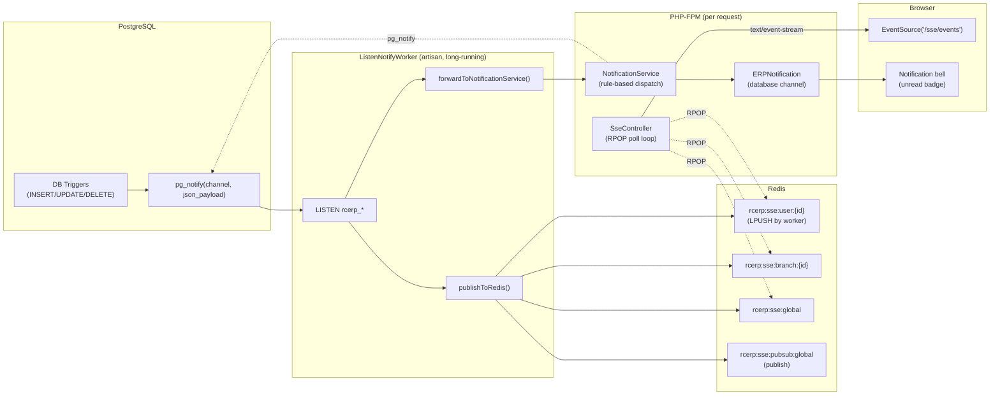

# Realtime Events — LISTEN/NOTIFY, SSE & Notification Fan-out

> **Module:** Architecture (cross-cutting)
> **Audience:** Engineers, AI assistants, DevOps
> **Status:** Canonical
> **Last reviewed:** Phase 1 (initial)
> **Source of truth:** This file + `laravel/app/Services/Notification/ListenNotifyService.php`, `NotificationService.php` + `laravel/app/Http/Controllers/SseController.php` + `laravel/app/Console/Commands/ListenNotifyWorker.php` + `laravel/database/migrations/2025_01_21_000001_add_listen_notify_triggers.php`

---

## 1. What is it?

RC_ERP has a **realtime event pipeline** that pushes database changes to the browser
without polling. It bridges three technologies:

1. **PostgreSQL `LISTEN`/`NOTIFY`** — DB triggers fire `pg_notify()` on row changes.
2. **A long-running PHP worker** (`ListenNotifyWorker` artisan command) that `LISTEN`s on
   PostgreSQL channels and republishes events to **Redis**.
3. **Server-Sent Events (SSE)** — `SseController` polls Redis and streams events to the
   browser via `EventSource`.

Layered on top is the **Laravel-native notification system** (`NotificationService` +
`ERPNotification`), which delivers rule-based in-app notifications (the bell icon) and
also emits `pg_notify` so the SSE pipeline shows a live toast.

---

## 2. Why does it exist?

- **Operational visibility.** When a salesperson finalizes an invoice, the warehouse
  manager's invoice list should refresh instantly; when a payment is received, the
  accountant should see a toast. Polling every few seconds does not scale and feels slow.
- **Removed external dependencies.** Telegram alerts and Firebase FCM push were removed
  (see `PROJECT_OVERVIEW.md` §9). Laravel-native notifications + LISTEN/NOTIFY + SSE
  cover the same use case without third-party services.
- **Decoupling.** DB triggers emit raw change events; the worker + notification service
  decide who cares. Business modules don't need to know about SSE or Redis.

---

## 3. Architecture



---

## 4. PostgreSQL channels & payload

### 4.1 Channels

`ListenNotifyService::PG_CHANNELS` defines the channels the worker listens on:

| Channel | Fires on |
|---|---|
| `rcerp_sales_invoice` | sales_invoices INSERT/UPDATE |
| `rcerp_sales_challan` | sales_challans change |
| `rcerp_sales_return` | sales_returns change |
| `rcerp_customer_payment` | customer_payments change |
| `rcerp_stock_change` | stock_transactions change |
| `rcerp_journal_entry` | journal_entries change |
| `rcerp_system` | system policy change |
| `rcerp_notification_dispatched` | a notification was sent |
| `rcerp_damage_change` | damage_invoices change |
| `rcerp_damage_attachment_change` | damage_attachments INSERT/DELETE (separate so the index refresh banner doesn't fire on an attachment upload) |

### 4.2 Payload shape

The `pg_notify` payload is JSON:

```json
{
  "table": "sales_invoices",
  "action": "INSERT",
  "id": 42,
  "branch_id": 1,
  "changes": { "status": "finalized" },
  "triggered_at": "2025-07-20T10:30:00+06:00"
}
```

DB triggers (migration `2025_01_21_000001_add_listen_notify_triggers.php`) build this
payload and call `pg_notify(channel, payload::text)`.

---

## 5. The worker — `ListenNotifyWorker`

`app/Console/Commands/ListenNotifyWorker.php` is a **long-running artisan command** that:

1. Opens a **dedicated PostgreSQL connection** (separate from the request pool).
2. `LISTEN`s on all `rcerp_*` channels.
3. On notification:
   - Calls `ListenNotifyService::publishToRedis($channel, $payload)` → pushes to Redis.
   - Calls `ListenNotifyService::forwardToNotificationService($channel, $payload, $ns)`
     if the channel has an event mapping.

### 5.1 Channel → event mapping

`ListenNotifyService::CHANNEL_EVENT_MAP`:

| PG channel | Notification event |
|---|---|
| `rcerp_sales_invoice` | `sales_finalize` |
| `rcerp_sales_challan` | `challan_create` |
| `rcerp_sales_return` | `return_created` |
| `rcerp_customer_payment` | `payment_receive` |
| `rcerp_system` | `system_policy_change` |

Other channels (`rcerp_stock_change`, `rcerp_journal_entry`, `rcerp_damage_*`) do not
forward to the notification service — they are pure SSE refresh signals.

### 5.2 Redis delivery (dual)

`publishToRedis()` does **two** things for robustness:

1. **Redis Lists (LPUSH)** — for SSE polling (PHP-FPM compatible, non-blocking):
   - `rcerp:sse:global` (TTL 600s, trimmed to last 500).
   - `rcerp:sse:branch:{branch_id}` (TTL 600s, trimmed to last 200).
2. **Redis Pub/Sub** (`rcerp:sse:pubsub:global`) — fire-and-forget for any external
   subscriber (monitoring, logging).

The List approach is used because Redis Pub/Sub's blocking `subscribe()` conflicts with
PHP-FPM's request lifecycle. The SSE controller polls Lists with `RPOP` (non-blocking).

> **Note:** The per-user queue `rcerp:sse:user:{user_id}` is polled by `SseController` but
> is written by the notification path (when `NotificationService` dispatches to a specific
> user, it can LPUSH to that user's queue). The worker writes to global + branch queues.

---

## 6. SSE controller — `SseController`

`app/Http/Controllers/SseController.php` exposes:

| Endpoint | Method | Purpose |
|---|---|---|
| `/sse/events` | GET | SSE stream for the authenticated user |
| `/sse/status` | GET | JSON status of the LISTEN/NOTIFY system |

### 6.1 The stream

`events()` opens a `text/event-stream` response and runs a polling loop:

- **Poll interval:** 100ms (`POLL_INTERVAL_US = 100000`).
- **Heartbeat:** every 30s (`HEARTBEAT_INTERVAL`), to keep the connection alive through
  proxies.
- **Max connection time:** 300s / 5 min (`MAX_CONNECTION_TIME`) — then it sends a
  `reconnect` event and closes, so PHP-FPM can recycle the worker. The browser's
  `EventSource` auto-reconnects.
- **Queues polled (RPOP, up to 10 each):**
  1. `rcerp:sse:user:{user_id}` (highest priority)
  2. `rcerp:sse:branch:{branch_id}`
  3. `rcerp:sse:global`
- **Branch filtering:** events from the global queue whose `payload.branch_id` doesn't
  match the user's session branch are skipped (branch isolation at the SSE layer).
- **Disconnect detection:** `connection_aborted()` is checked each iteration.

### 6.2 SSE event format

```
event: rcerp_sales_invoice
data: {"table":"sales_invoices","action":"INSERT","id":42,...}

```

The browser listens with:

```js
const es = new EventSource('/sse/events');
es.addEventListener('rcerp_sales_invoice', (e) => { /* refresh invoice list */ });
es.addEventListener('heartbeat', () => {});
es.addEventListener('reconnect', () => { /* EventSource auto-reconnects */ });
```

Client-side wiring lives in `public/assets/js/notification.js` and `push.js`.

### 6.3 Status endpoint

`/sse/status` returns:

```json
{
  "status": "active",
  "pg_available": true,
  "pg_channels": [{"channel": "rcerp_sales_invoice", "pid": 123, "listener_count": 1}],
  "redis_status": "connected",
  "supported_channels": [...],
  "worker_running": true,
  "worker_heartbeat": {...}
}
```

Use this to verify the pipeline is healthy.

---

## 7. The notification system (rule-based)

`NotificationService` is the **central dispatcher** for in-app notifications. Business
modules (or the worker, via `forwardToNotificationService`) call:

```php
$notificationService->dispatch(
    event: 'sales_finalize',
    body: 'Sales Invoice #42 finalized',
    referenceType: 'sales_invoice',
    referenceId: 42,
    extra: [...]
);
```

### 7.1 What `dispatch()` does

1. Finds all **active `notification_rules`** for that event.
2. Resolves recipients per rule — a rule may carry multiple recipient-type selections
   (e.g. `warehouse_manager_of_branch`, `salesman_of_invoice`, `invoice_creator`),
   merged + de-duplicated by user ID.
3. Sends `ERPNotification` to each recipient via the **database channel** (the bell icon's
   unread queue).
4. Increments each rule's `times_fired` counter.
5. Emits a `pg_notify` (`rcerp_notification_dispatched`) so the SSE pipeline pushes a
   live toast.

### 7.2 Events

Defined in `NotificationRule::EVENTS`, with metadata (icon/color/title) in
`NotificationService::EVENT_META`. Events include: `sales_finalize`, `challan_create`,
`godown_create`, `payment_receive`, `soft_delete`, `accounts_entry`, `user_login`,
`user_logout`, `damage_invoice_created`, `damage_invoice_submitted/approved/rejected`,
`branch_demand_created`, `customer_limit_increased`, `return_created/confirmed/reversed`,
`system_policy_change`.

### 7.3 Recipient types

Rules support context-aware recipient resolution (e.g. "the salesman who created this
invoice", "the warehouse manager of the invoice's branch"). These are resolved against
the `$context`/`$extra` passed to `dispatch()`.

### 7.4 Rule management

- Admin+superadmin manage rules at `/admin/notifications/rules` (gated by
  `view-notification-rules` Gate).
- The bell + unread badge is visible to **all** authenticated users.
- Seeder: `database/seeders/NotificationRuleSeeder.php` + migration
  `2025_01_09_000003_seed_return_notification_rules.php`.

---

## 8. Application-level NOTIFY

`ListenNotifyService::emitNotify($channel, $data)` lets PHP emit a `pg_notify` for events
that don't have DB triggers (e.g. user login, API calls):

```php
DB::statement("SELECT pg_notify(?, ?)", [$channel, $payload]);
```

(Here `?` placeholders ARE safe because `pg_notify` is a function taking text args, not a
`SET` statement.)

---

## 9. Important database tables

| Table | Role |
|---|---|
| `notifications` | Laravel's notification table (in-app bell queue). |
| `notification_rules` | Rule definitions (event → recipients). |
| `notification_rule_recipients` | Multi-recipient selections per rule. |
| (transactional tables) | Carry LISTEN/NOTIFY triggers that fire `pg_notify`. |

---

## 10. Related modules / files

| Topic | File |
|---|---|
| High-level architecture | `high-level-architecture.md` |
| Notification workflow (full) | `workflows/notification-workflow.md` (Phase 15) |
| Security (notification gates) | `security/rbac-roles-permissions.md` (Phase 5) |
| Source: worker | `laravel/app/Console/Commands/ListenNotifyWorker.php` |
| Source: SSE | `laravel/app/Http/Controllers/SseController.php` |
| Source: services | `laravel/app/Services/Notification/ListenNotifyService.php`, `NotificationService.php` |
| Source: triggers migration | `laravel/database/migrations/2025_01_21_000001_add_listen_notify_triggers.php` |
| Source: client JS | `laravel/public/assets/js/notification.js`, `push.js` |

---

## 11. Known edge cases & rules for AI

- **The worker must be supervised in production** (systemd / supervisor). If it dies,
  realtime stops; the app still works (notifications still save to DB), but SSE toasts
  won't fire until it restarts.
- **SSE connections cap at 5 minutes.** The client must handle the `reconnect` event
  (EventSource does this automatically).
- **`LISTEN/NOTIFY` only works on the PostgreSQL primary**, not replicas
  (`ListenNotifyService::isAvailable()` checks `pg_is_in_recovery()`).
- **Branch isolation applies at the SSE layer** — the global queue is filtered by
  `payload.branch_id` against the user's session branch.
- **`rcerp_damage_attachment_change` is deliberately separate from
  `rcerp_damage_change`** so uploading a photo doesn't trigger the index refresh banner.
- **Removed features:** Do NOT reintroduce Telegram or FCM. The notification system +
  SSE is the replacement (see `PROJECT_OVERVIEW.md` §9).
- **`pg_notify` payload is text** (JSON string). Keep payloads small; PostgreSQL truncates
  at 8 KB.

---

## 12. Future improvements

- Move the worker to supervisor/systemd management (Phase 19).
- Add metrics (events/sec, queue depth) to `/sse/status`.
- Consider WebSockets (Laravel Reverb) if bidirectional communication is ever needed;
  for now SSE is sufficient and simpler.
- Add a per-user Redis queue write path in the worker (currently per-user queue is fed by
  the notification dispatch path).

---

*This is the canonical reference for realtime. For the notification business rules
(events, recipients, rule management), see `workflows/notification-workflow.md` (Phase 15).*
