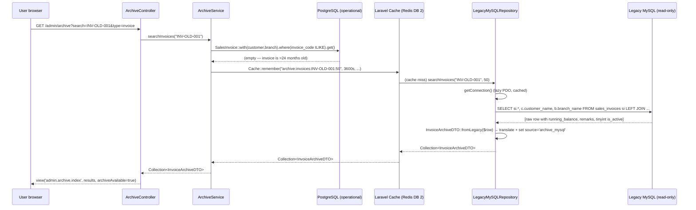

# Anti-Corruption Layer — Archive DTOs + Repository + Service

> **Module:** Archive (Legacy anti-corruption layer)
> **Audience:** Engineers + AI assistants + architects
> **Status:** Draft
> **Last reviewed:** 2026-08-04
> **Source of truth:** this file, grounded in `laravel/app/Archive/` (Services, Repositories,
> DTOs), `laravel/app/Http/Controllers/Admin/ArchiveController.php`,
> `laravel/app/Providers/AppServiceProvider.php` (lines 35-36),
> `laravel/routes/web.php` (lines 1610-1614), `laravel/resources/views/admin/archive/index.blade.php`,
> `docs/migration/phase12_complete.md`, and `../database/etl-legacy-migration.md` §7.9.

---

## 1. What is it?

The **Anti-Corruption Layer (ACL)** is the Laravel module (`app/Archive/`) that isolates all
legacy-MySQL-specific knowledge behind a clean contract so the rest of the ERP never learns
that the legacy archive is MySQL, what its table names are, or what its column names are. It
is the **third layer** of the 3-layer enterprise architecture introduced in Phase 12
(Operational PostgreSQL + Archive MySQL + Anti-Corruption Layer).

The ACL has four components:

1. **`ArchiveRepositoryInterface`** — the contract (5 query methods + `isAvailable()`).
2. **`LegacyMySQLRepository`** — the current PDO read-only implementation that talks to the
   legacy MySQL and translates raw rows into DTOs.
3. **3 DTOs** (`InvoiceArchiveDTO`, `CustomerArchiveDTO`, `LedgerArchiveDTO`) — the output
   shape. Each carries a `source` field (`postgresql` | `archive_mysql`) and an `is_archived`
   flag so the UI can badge results without knowing which database produced them.
4. **`ArchiveService`** — the unified search service. It queries PostgreSQL first; only if PG
   has no results does it fall back to the archive (cached for 1 hour because the archive is
   immutable).

The ACL is the **only** code in the Laravel stack that is allowed to know about legacy table
or column names. Controllers, Blade views, and other services depend on the DTOs and the
interface — never on the repository implementation or the legacy schema.

## 2. Why does it exist?

The ACL solves three problems that a naive "just query the legacy MySQL directly" approach
would create:

- **Schema coupling.** If controllers queried the legacy MySQL directly, every controller
  would learn legacy table names (`sales_invoices`, `customer_ledger`) and column names
  (`running_balance`, `remarks`, tinyint `is_active`). When the legacy MySQL is eventually
  replaced by a Parquet cold-store or a data warehouse, every one of those queries would
  have to be rewritten. The ACL confines that knowledge to a single class
  (`LegacyMySQLRepository`) so the backend can be swapped by changing only the
  `AppServiceProvider` binding.
- **Corruption of the new model.** The legacy MySQL has different conventions (FLOAT money,
  ENUM statuses, `0000-00-00` dates, `parent_id = 0` sentinel, MD5 hashes). If raw legacy
  rows leaked into controllers, those conventions would silently infect the new code. The
  ACL's DTOs translate every legacy-ism at the boundary: `running_balance`→`balance`,
  `remarks`→`description`, ENUM statuses are normalized, FLOAT→`(float)` cast, `0`→`null`
  for parent IDs.
- **Performance isolation.** The legacy MySQL is a separate database on a separate container
  with no indexes tuned for the new query patterns. If controllers queried it directly, a
  slow legacy query could block an operational request. The `ArchiveService` queries
  PostgreSQL first and only falls back to the archive on miss — and archive results are
  cached for 1 hour (safe because the archive is immutable). The archive can NEVER slow down
  the operational PostgreSQL.

The name "anti-corruption layer" comes from the DDD pattern (Evans, 2003): when integrating
with a legacy or third-party system whose model you do not want to adopt, place a translation
layer at the boundary so your own model stays clean.

## 3. When is it used?

- **Runtime — every archive search.** When a user searches the `/admin/archive` page, or
  views a customer/supplier ledger history, `ArchiveService` is invoked. It queries PG
  first; on miss, it queries the legacy MySQL via `LegacyMySQLRepository`, caches the result
  for 1 hour, and returns DTOs.
- **Runtime — operational lookups that may span the archive boundary.** The customer ledger
  and supplier ledger history pages call `getCustomerLedger()` / `getSupplierLedger()`,
  which return PG entries if they exist, otherwise archive entries. (Note: the current
  implementation returns PG-only if PG has ANY entries for that customer/supplier — it does
  not merge PG + archive into a single timeline. See §12 edge case E-3.)
- **Never for writes.** The ACL is read-only by construction. The `ArchiveRepositoryInterface`
  defines no insert/update/delete methods. The `LegacyMySQLRepository` opens its PDO
  connection with a read-only MySQL user (`archive_reader` — GRANT SELECT only). See
  `legacy-read-only.md` §6.

The ACL is **not** used during the one-time ETL pipeline — that was a separate pgloader
bulk load (see `../database/etl-legacy-migration.md`). The ACL is also **not** used by the
`migrate:master-data` or `migrate:legacy-employees` commands, which use the
`mysql_archive` Laravel DB connection directly (see §7.4 for the distinction).

## 4. Who uses it?

- **`ArchiveController`** (`app/Http/Controllers/Admin/ArchiveController.php`) — the only
  controller that depends on `ArchiveService`. It exposes 3 routes:
  `GET /admin/archive` (unified search), `GET /admin/archive/customer-ledger/{id}`,
  `GET /admin/archive/supplier-ledger/{id}`.
- **Accountants / auditors** — end users of the `/admin/archive` UI. They search for old
  invoices or customers by code/name/mobile and view historical ledger entries. The UI
  shows a "Archive" badge on results from the legacy MySQL so the user knows the data is
  historical.
- **`AppServiceProvider`** — binds the interface to the implementation (singleton).
- **AI assistants** — when asked to "add a new archive search type" (e.g. search historical
  products), MUST extend the interface + repository + add a DTO, and MUST NOT query the
  legacy MySQL from a controller. See §11.3.

## 5. Related modules

- `legacy-overview.md` — what the legacy system was (origin story).
- `legacy-read-only.md` — read-only enforcement + `config/archive.php` anatomy.
- `../database/etl-legacy-migration.md` §7.9 — the ACL's place in the ETL pipeline doc.
- `../architecture/high-level-architecture.md` §7 — the 3-layer architecture diagram.
- `../architecture/module-map.md` — the Archive module entry (line 131).
- `../coding/service-layer-conventions.md` — why the ACL follows the one-service-per-operation
  convention.
- `../security/audit-trails.md` — the ACL does NOT audit archive reads (immutable data, no
  business effect); only operational writes are audited.

## 6. Business rules (ACL)

- **MUST keep the ACL read-only.** The `ArchiveRepositoryInterface` defines no write
  methods. Any future "backfill from archive" feature MUST go through a separate command
  (`migrate:legacy-employees` pattern), NOT through the ACL.
- **MUST query PostgreSQL first.** `ArchiveService` always queries PG before the archive.
  The archive is a fallback, never the primary. This guarantees the operational system is
  never slowed by archive queries.
- **MUST cache archive lookups.** Archive data is immutable (read-only MySQL), so caching
  is safe. The default TTL is 3600s (1 hour), configurable via `config('archive.cache_ttl')`.
  Cache keys are namespaced by method + parameters: `archive:invoices:{search}:{limit}`,
  `archive:invoice:{code}`, `archive:customers:{search}:{limit}`,
  `archive:customer_ledger:{id}:{from}:{to}`, `archive:supplier_ledger:{id}:{from}:{to}`.
- **MUST translate legacy-isms at the DTO boundary.** The `fromLegacy()` factory on each
  DTO is the ONLY place legacy column names appear. Legacy `running_balance`→DTO `balance`,
  legacy `remarks`→DTO `description`, legacy tinyint `is_active`→`(bool)`, legacy ENUM
  statuses are passed through (the PG side normalizes them during ETL).
- **MUST set `source` and `is_archived` on every DTO.** The UI uses these to badge results.
  `source='postgresql'` → `is_archived=false`; `source='archive_mysql'` → `is_archived=true`.
- **MUST NOT leak legacy table or column names past the repository.** Controllers, Blade
  views, and other services see only DTOs. The `config/archive.php` `tables` map (legacy
  → Laravel table names) is consumed only by the repository.
- **MUST gracefully degrade when the archive is offline.** `LegacyMySQLRepository::getConnection()`
  catches `PDOException` and returns null; every query method checks for null and returns
  an empty collection (or null for single-row lookups). The UI shows an "Archive MySQL
  offline" badge via `ArchiveService::isArchiveAvailable()`.
- **MUST bind the interface as a singleton.** `AppServiceProvider` line 35 binds
  `ArchiveRepositoryInterface` → `LegacyMySQLRepository` as a singleton (one PDO connection
  per request lifecycle). `ArchiveService` is also a singleton (line 36).
- **SHOULD isolate the archive's exception behavior.** Every repository method wraps its
  PDO query in a try/catch and logs a warning via `Log::warning()` on failure. The ACL
  never throws to the controller — it returns empty results. This is deliberate: an
  archive failure should not break the operational UI.

## 7. Technical implementation

### 7.1 Module layout (`laravel/app/Archive/`)

```
laravel/app/Archive/
├── DTOs/
│   ├── InvoiceArchiveDTO.php       # 92 lines
│   ├── CustomerArchiveDTO.php      # 61 lines
│   └── LedgerArchiveDTO.php        # 73 lines
├── Repositories/
│   ├── ArchiveRepositoryInterface.php   # 67 lines — the contract
│   └── LegacyMySQLRepository.php        # 224 lines — PDO read-only impl
└── Services/
    └── ArchiveService.php          # 183 lines — PG-first unified search
```

Total: 8 files, ~700 lines of PHP. The ACL is deliberately small — it exposes 5 query
methods and 3 DTOs. Adding a new search type means adding one DTO + one interface method +
one repository implementation + one service method + one controller route (see §11.3).

### 7.2 The 3-layer request flow



### 7.3 The contract (`ArchiveRepositoryInterface`)

```php
interface ArchiveRepositoryInterface
{
    public function searchInvoices(string $search, int $limit = 50): Collection;
    public function findInvoice(string $invoiceCode): ?InvoiceArchiveDTO;
    public function searchCustomers(string $search, int $limit = 50): Collection;
    public function getCustomerLedger(int $customerId, ?string $fromDate = null, ?string $toDate = null): Collection;
    public function getSupplierLedger(int $supplierId, ?string $fromDate = null, ?string $toDate = null): Collection;
    public function isAvailable(): bool;
}
```

Six methods. No writes. The contract is backend-agnostic — a future `SqlDumpRepository`,
`DataWarehouseRepository`, or `ObjectStorageRepository` would implement the same six methods.

### 7.4 Two ways to reach the legacy MySQL (a subtle distinction)

There are **two separate configuration paths** to the legacy MySQL in this codebase. They
point at the same database but are used by different code:

| Path | Config file | Used by | Mechanism |
|---|---|---|---|
| **ACL (runtime reads)** | `config/archive.php` → `connection` array | `LegacyMySQLRepository` (PDO directly) | `new \PDO($dsn, ...)` with `config('archive.connection')` |
| **Migration commands (one-time reads)** | `config/database.php` → `mysql_archive` connection | `MigrateLegacyEmployees`, `MigrateMasterData` | `DB::connection('mysql_archive')->table(...)` (Laravel query builder) |

Both resolve to the same host/port/database/user via `ARCHIVE_DB_*` / `ARCHIVE_MYSQL_*` env
vars (see `legacy-read-only.md` §7 for the env-var mapping). The ACL uses its own PDO
connection (not Laravel's `DB` facade) because:

1. The ACL wants full control over PDO options (`ERRMODE_EXCEPTION`, `FETCH_ASSOC`).
2. The ACL wants to lazy-load the connection and cache it on the singleton instance (so a
   request that never hits the archive pays zero PDO connection cost).
3. The migration commands use Laravel's `DB` facade because they need query-builder
   ergonomics for bulk upserts and transactions.

This distinction is a known minor inconsistency (see §13, future improvement F-2).

### 7.5 The DTO translation pattern

Every DTO has three members: a constructor (typed properties), a `fromEloquent()` factory
(for PG Eloquent records), and a `fromLegacy()` factory (for raw MySQL rows). The
`fromLegacy()` method is the ONLY place legacy column names appear in the DTO layer.

Example (`InvoiceArchiveDTO::fromLegacy()`, abridged):

```php
public static function fromLegacy(array $row): self
{
    return new self(
        id: $row['id'] ?? null,
        invoiceCode: $row['invoice_code'] ?? 'UNKNOWN',
        invoiceDate: $row['invoice_date'] ?? '',
        customerName: $row['customer_name'] ?? $row['shop_name'] ?? null,  // fallback
        customerCode: $row['customer_code'] ?? null,
        branchName: $row['branch_name'] ?? null,
        totalAmount: (float) ($row['total_amount'] ?? 0),   // FLOAT → float
        paidAmount: (float) ($row['paid_amount'] ?? 0),
        dueAmount: (float) ($row['due_amount'] ?? 0),
        status: $row['status'] ?? 'unknown',                 // ENUM passthrough
        source: 'archive_mysql',                              // the badge flag
    );
}
```

The `LedgerArchiveDTO::fromLegacy()` shows a column rename: legacy `running_balance` → DTO
`balance`, legacy `remarks` → DTO `description` (with `??` fallback so either name works).

### 7.6 The PG-first fallback logic (`ArchiveService`)

Every `ArchiveService` method follows the same pattern:

```php
public function searchInvoices(string $search, int $limit = 50): Collection
{
    // 1. Search PostgreSQL (operational).
    $pgResults = SalesInvoice::with(['customer', 'branch'])
        ->where('invoice_code', 'ILIKE', "%{$search}%")
        ->orWhereHas('customer', fn($q) => $q->where('customer_name', 'ILIKE', "%{$search}%"))
        ->orderBy('invoice_date', 'desc')
        ->limit($limit)
        ->get()
        ->map(fn($inv) => InvoiceArchiveDTO::fromEloquent($inv));

    if ($pgResults->isNotEmpty()) {
        return $pgResults;  // PG hit — never touch the archive
    }

    // 2. Fallback to legacy archive (cached).
    return Cache::remember(
        "archive:invoices:{$search}:{$limit}",
        config('archive.cache_ttl', 3600),
        fn() => $this->archiveRepository->searchInvoices($search, $limit)
    );
}
```

The cache wraps the repository call, not the whole method — so a PG hit never populates the
cache, and a PG miss + archive hit caches only the archive result. The cache key includes
all parameters so different searches don't collide.

### 7.7 The repository's graceful degradation

`LegacyMySQLRepository::getConnection()` is the single point of failure handling:

```php
private function getConnection(): ?\PDO
{
    if ($this->connection !== null) return $this->connection;        // cached
    if (!config('archive.enabled', false)) return null;               // feature flag off

    try {
        $config = config('archive.connection');
        $dsn = "mysql:host={$config['host']};port={$config['port']};dbname={$config['database']};charset={$config['charset']}";
        $this->connection = new \PDO($dsn, $config['username'], $config['password'], $config['options'] ?? []);
        return $this->connection;
    } catch (\PDOException $e) {
        Log::warning('Archive MySQL connection failed: ' . $e->getMessage());
        return null;  // every query method checks for null and returns empty
    }
}
```

Every public method (`searchInvoices`, `findInvoice`, etc.) starts with
`$conn = $this->getConnection(); if (!$conn) return collect();` (or `return null;` for
single-row lookups). Additionally, each method wraps its PDO statement in a try/catch that
logs a warning and returns empty on `PDOException`. The ACL never throws.

### 7.8 The controller and routes

`ArchiveController` (`app/Http/Controllers/Admin/ArchiveController.php`) is thin — it
delegates entirely to `ArchiveService` and renders the Blade view:

```php
class ArchiveController extends Controller
{
    public function __construct(private ArchiveService $archiveService) {}

    public function index(Request $request)
    {
        $search = $request->input('search', '');
        $type = $request->input('type', 'invoice');
        $results = $search
            ? match ($type) {
                'invoice'  => $this->archiveService->searchInvoices($search),
                'customer' => $this->archiveService->searchCustomers($search),
                default    => $this->archiveService->searchInvoices($search),
            }
            : null;
        return view('admin.archive.index', [
            'search' => $search, 'type' => $type, 'results' => $results,
            'archiveAvailable' => $this->archiveService->isArchiveAvailable(),
        ]);
    }
    // customerLedger($customerId) and supplierLedger($supplierId) — same pattern
}
```

Routes (`routes/web.php` lines 1610-1614, inside the `auth` middleware group):

```php
Route::prefix('admin/archive')->name('admin.archive.')->group(function () {
    Route::get('/', [ArchiveController::class, 'index'])->name('index');
    Route::get('customer-ledger/{customerId}', [ArchiveController::class, 'customerLedger'])->name('customer-ledger');
    Route::get('supplier-ledger/{supplierId}', [ArchiveController::class, 'supplierLedger'])->name('supplier-ledger');
});
```

No `EnsureRole` middleware is applied — the archive search is available to all authenticated
users. This is acceptable because the archive is read-only and the data shown is scoped to
what the user would already see in the operational UI. (See §12 edge case E-5 for the
branch-isolation caveat.)

### 7.9 The Blade view

`laravel/resources/views/admin/archive/index.blade.php` renders the search form + results
table. It uses the DTO public properties directly (`$r->invoiceCode`, `$r->source`,
`$r->totalAmount`) and shows an "Archive" badge when `$r->source === 'archive_mysql'`:

```blade
@if ($r->source === 'archive_mysql')
    <span class="badge bg-warning text-dark">Archive</span>
@else
    <span class="badge bg-success">Current</span>
@endif
```

The view also shows a top-level "Archive MySQL offline" badge when
`$archiveAvailable === false`, so users understand why historical results are missing.

### 7.10 The service provider binding

`AppServiceProvider::register()` (lines 35-36):

```php
$this->app->singleton(
    \App\Archive\Repositories\ArchiveRepositoryInterface::class,
    \App\Archive\Repositories\LegacyMySQLRepository::class
);
$this->app->singleton(\App\Archive\Services\ArchiveService::class);
```

Both are singletons — one PDO connection and one service instance per request lifecycle.
To swap the backend (e.g. to a Parquet reader), change only the second argument of the
first binding. No other file needs to change.

## 8. Important database tables (archive-side)

The ACL reads from the legacy MySQL tables. The mapping (legacy → Laravel/PG equivalent) is
in `config/archive.php` `tables` (consumed only by the repository — controllers never see it):

| Legacy MySQL table | PG equivalent | Used by ACL method |
|---|---|---|
| `sales_invoices` | `sales_invoices` | `searchInvoices()`, `findInvoice()` |
| `customers` | `customers` | `searchCustomers()` |
| `customer_ledger` | `customer_ledger` | `getCustomerLedger()` |
| `supplier_ledger` | `supplier_ledger` | `getSupplierLedger()` |
| `branches` (join only) | `branches` | join in `searchInvoices`/`findInvoice` for `branch_name` |
| `sales_invoice_items` (mapped, not currently queried) | `sales_invoice_items` | (future — see §13) |
| `suppliers` (mapped, not currently queried) | `suppliers` | (future) |
| `products` (mapped, not currently queried) | `products` | (future) |
| `journal_entries` (mapped, not currently queried) | `journal_entries` | (future) |
| `journal_lines` (mapped, not currently queried) | `journal_lines` | (future) |

The `config/archive.php` `tables` map lists 9 legacy tables, but only 5 are actually queried
by the current repository. The remaining 4 are mapped for future expansion.

## 9. Related services

- `App\Archive\Services\ArchiveService` — the unified search service (PG-first, archive
  fallback, cached). 183 lines. The ONLY service that depends on
  `ArchiveRepositoryInterface`.
- `App\Archive\Repositories\LegacyMySQLRepository` — the PDO read-only implementation. 224
  lines. The ONLY class that knows legacy table/column names.

No other service in the Laravel stack depends on the ACL. The ACL is a leaf module — it
depends on `SalesInvoice`, `Customer` Eloquent models (for the PG-first leg) and on the
`ArchiveRepositoryInterface` (for the archive leg), but nothing depends back on it except
`ArchiveController`.

## 10. Related models (DTOs)

The ACL's "models" are DTOs (plain PHP classes, not Eloquent). Each has a typed constructor,
a `fromEloquent()` factory, a `fromLegacy()` factory, and a `toArray()` method:

| DTO | File | Properties | Source flag |
|---|---|---|---|
| `InvoiceArchiveDTO` | `app/Archive/DTOs/InvoiceArchiveDTO.php` | id, invoiceCode, invoiceDate, customerName, customerCode, branchName, totalAmount, paidAmount, dueAmount, status, source, items | `postgresql` \| `archive_mysql` |
| `CustomerArchiveDTO` | `app/Archive/DTOs/CustomerArchiveDTO.php` | id, customerCode, customerName, mobile, address, balance, source | same |
| `LedgerArchiveDTO` | `app/Archive/DTOs/LedgerArchiveDTO.php` | id, transactionDate, transactionType, referenceType, referenceId, debit, credit, balance, description, source | same |

Each DTO's `toArray()` adds a computed `is_archived` boolean (`$this->source === 'archive_mysql'`)
for JSON API consumers. The DTOs are intentionally framework-agnostic (no Eloquent base
class, no `JsonSerializable` — just plain constructors + static factories).

## 11. Important workflows

### 11.1 Unified invoice search (runtime)

Already shown in §7.2 (the sequence diagram). The flow is: controller → service → PG-first
→ cache → repository → legacy MySQL → DTO translation → cached → returned.

### 11.2 Archive availability check (runtime)

```mermaid
flowchart TD
    A[ArchiveController::index] --> B[archiveService->isArchiveAvailable]
    B --> C[archiveRepository->isAvailable]
    C --> D{getConnection() cached?}
    D -->|yes| E[return true]
    D -->|no| F{config('archive.enabled')?}
    F -->|false| G[return false — feature flag off]
    F -->|true| H[try new PDO]
    H -->|success| I[cache connection on singleton]
    I --> E
    H -->|PDOException| J[Log::warning + return null]
    J --> K[return false]
```

The availability check is cheap after the first call (the PDO connection is cached on the
singleton). The controller calls it once per request to decide whether to show the
"Archive MySQL offline" badge.

### 11.3 Adding a new archive search type (developer workflow)

To add, say, "search historical products":

1. **Add a DTO** `app/Archive/DTOs/ProductArchiveDTO.php` with `fromEloquent()` +
   `fromLegacy()` + `source` field. Follow the `InvoiceArchiveDTO` pattern exactly.
2. **Extend the interface** `ArchiveRepositoryInterface` with
   `searchProducts(string $search, int $limit = 50): Collection`.
3. **Implement in `LegacyMySQLRepository`** — add `searchProducts()` with a prepared
   statement against the legacy `products` table, translate rows via
   `ProductArchiveDTO::fromLegacy()`, wrap in try/catch + graceful-empty on failure.
4. **Add to `ArchiveService`** — `searchProducts()` that queries PG `Product::search()`
   first, falls back to `$this->archiveRepository->searchProducts()` cached for 1 hour.
5. **Add the route + controller method** — extend `ArchiveController::index` match arm
   with `'product' => $this->archiveService->searchProducts($search)`.
6. **Extend the Blade view** — add a `<option value="product">` to the search-type select
   and a new column-set branch in the results table.
7. **Update `config/archive.php` `tables`** — confirm `products` is mapped (it already is).
8. **Add an `AI_CONTEXT` changelog entry** — log the new DTO + interface method.
9. **MUST NOT** query the legacy MySQL from the controller. MUST NOT leak legacy column
   names past the repository. MUST NOT skip the cache on the archive leg.

## 12. Known edge cases

- **E-1: PG-first means PG-only when PG has ANY result.** If PG has even one matching
  invoice, the archive is never queried — even if the archive has additional older matches.
  This is deliberate (performance isolation) but means a search may miss historical results
  that co-exist with current ones. Workaround: search with a date filter that excludes the
  PG operational window. (See §13 F-1 for the merge-timeline future improvement.)
- **E-2: Customer/supplier ledger does not merge PG + archive.** `getCustomerLedger()`
  returns PG entries if PG has any for that customer, otherwise archive entries. It does
  NOT return a unified timeline spanning both. Same caveat as E-1.
- **E-3: Cache key does not include the `fromDate`/`toDate` null-ness distinctly.** The
  cache key `archive:customer_ledger:{id}:{from}:{to}` will collide for
  `from=null, to=null` vs `from='', to=''` (both render as empty in the string). In
  practice this is harmless because the repository query is identical for both, but it
  means a cache hit may serve a request that intended a different filter shape.
- **E-4: Archive search is not branch-scoped.** The ACL queries the legacy MySQL without a
  `branch_id` filter — the legacy MySQL has no RLS. A user in Branch A searching the
  archive can see Branch B's historical invoices. This is acceptable because the archive
  is read-only historical data and the operational UI enforces RLS for current data. If
  this becomes a compliance issue, add a `branch_id` clause to the repository queries
  (the legacy `sales_invoices.branch_id` column exists).
- **E-5: No `EnsureRole` on archive routes.** Any authenticated user can search the
  archive. If role-restriction is needed, add `->middleware('role:admin|accountant')` to
  the route group.
- **E-6: Archive `status` ENUM values are passed through.** The legacy
  `sales_invoices.status` ENUM may have values like `'godown_issued'` or
  `'challan_completed'` that were collapsed during ETL. The DTO `fromLegacy()` passes the
  raw value through — the UI displays it as a badge. If a user is confused by an
  unfamiliar status, explain the ETL mapping (see `legacy-overview.md` §12).
- **E-7: Archive `is_active` is tinyint, not boolean.** The legacy `customers.is_active`
  is `tinyint(1)`. The DTOs do not currently expose `is_active` (the customer DTO exposes
  `balance` instead), so no cast is needed. If a future DTO adds `isActive`, use `(bool)
  (int) $row['is_active']` (the `MigrateLegacyEmployees::mysqlBoolToPg()` pattern).
- **E-8: The ACL does not audit reads.** Archive reads are not logged to `audit_trails`
  (the archive is immutable, read-only, and has no business effect). If a compliance
  requirement demands audit of historical-data access, add a `Log::info()` call in the
  repository methods (not in the controller, so the audit is backend-agnostic).
- **E-9: The PDO connection is per-request, not persistent.** `LegacyMySQLRepository` is a
  singleton, so the PDO connection lives for one request. For high-traffic archive
  searches, consider `PDO::ATTR_PERSISTENT => true` in `config/archive.php` `options` —
  but test for connection-reset behavior first.
- **E-10: The `ArchiveService::searchCustomers()` uses `Customer::search()` scope.** This
  is a full-text search (tsvector + GIN) on the PG side. If the `customers` table lacks
  the GIN index, it falls back to ILIKE. See `../inventory/...` (customer model docs) for
  the search-scope behavior.

## 13. Future improvements

- **F-1: Merge PG + archive into a unified timeline.** For `getCustomerLedger()` and
  `getSupplierLedger()`, query both PG and archive and merge the results by date, with the
  `source` flag distinguishing them. This would fix E-1 and E-2. Performance: two queries
  per ledger view (PG + archive), both cached. Add a `merge=true` option to the service
  method to preserve the current PG-first behavior for callers who want it.
- **F-2: Unify the two legacy-MySQL config paths.** The ACL uses `config/archive.php`
  `connection` (raw PDO); the migration commands use `config/database.php` `mysql_archive`
  (Laravel `DB` facade). These should be unified — either have the ACL use the
  `mysql_archive` Laravel connection (via `DB::connection('mysql_archive')->getPdo()`), or
  have the migration commands read `config/archive.php`. The former is cleaner (one
  connection definition). Track via `changelog/CHANGELOG.md`.
- **F-3: Swap `LegacyMySQLRepository` for `ParquetRepository`.** Once the legacy MySQL is
  decommissioned (see `legacy-read-only.md` §13), the historical data will live in
  Parquet files in `storage/app/partition-exports/` (produced by
  `partition:export-parquet`). Implement a `ParquetRepository` that reads those files via
  DuckDB and produces the same DTOs. Change only the `AppServiceProvider` binding. The
  interface, service, controller, and views stay unchanged.
- **F-4: Add more archive search types.** `searchProducts()`, `searchSuppliers()`,
  `searchJournalEntries()` — the `config/archive.php` `tables` map already lists these.
  Follow the §11.3 workflow. Prioritize based on user demand.
- **F-5: Add a `--refresh-cache` artisan command.** `php artisan archive:refresh-cache`
  would flush all `archive:*` cache keys. Useful after a legacy MySQL re-import (rare) or
  if the cache TTL is changed. Currently operators must `php artisan cache:clear` (which
  flushes everything, not just archive keys).
- **F-6: Add branch-scoping to archive queries.** If E-4 becomes a compliance issue, add
  an optional `?branchId` parameter to the repository methods that appends
  `AND branch_id = :bid` to the legacy SQL. The controller would pass the current
  `session('branch_id')` unless the user is admin.
- **F-7: Type the DTOs with PHP 8.3 readonly classes.** The DTOs currently use public
  constructor properties (PHP 8.0 promoted properties). Upgrading to `readonly class`
  (PHP 8.3) would make them truly immutable. Verify the PHP version constraint in
  `composer.json` first.
- **F-8: Add tests.** There are currently NO tests for the ACL (search
  `laravel/tests/` for `ArchiveService` / `LegacyMySQLRepository` / `ArchiveController` →
  0 matches). Add: (a) a unit test for each DTO's `fromEloquent()` + `fromLegacy()` +
  `toArray()`; (b) a feature test for each `ArchiveService` method with PG-hit, PG-miss +
  archive-hit, and archive-offline scenarios (mock the repository); (c) a feature test for
  the controller routes with auth + search + type switching. This is the highest-priority
  improvement — the ACL is currently untested safety-critical-adjacent code.
