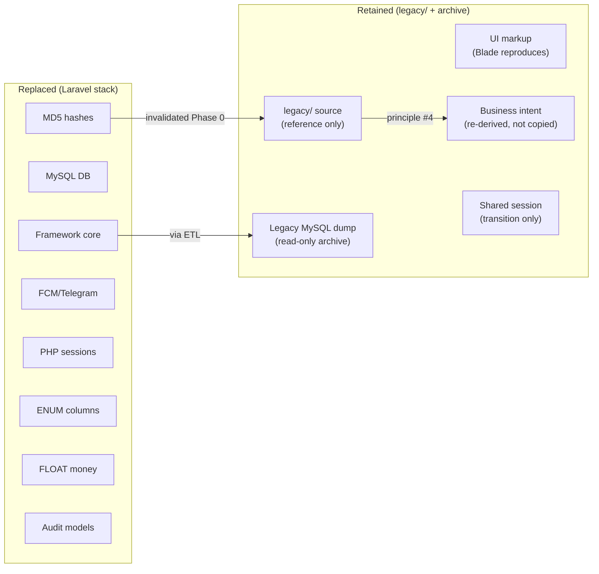
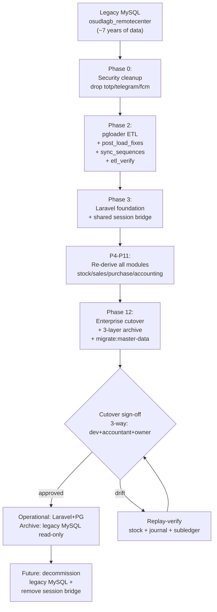

# Legacy Overview — Custom PHP/MySQL Origin

> **Module:** Archive (Legacy anti-corruption layer)
> **Audience:** Engineers + AI assistants + migration leads
> **Status:** Draft
> **Last reviewed:** 2026-08-04
> **Source of truth:** this file, grounded in `legacy/` (the vendored legacy PHP codebase),
> `README.md` (repo root), `docs/migration/schema_mapping.md`, `docs/migration/phase2_complete.md`,
> `docs/migration/phase12_complete.md`, and `../PROJECT_OVERVIEW.md`.

---

## 1. What is it?

The **legacy system** is the bespoke PHP/MySQL ERP that ran Remote Center's operations for
~7 years before being replaced by the current Laravel 12 + PostgreSQL 16 stack. Its source
lives in the repo under `legacy/` — a vanilla-PHP MVC application (no framework) with 38
controllers, 43 models, a hand-rolled router, native PHP sessions, and a single MySQL database
(`osudlagb_remotecenter`). The legacy codebase is **not deleted**: it is preserved verbatim as
(1) the origin reference for re-deriving business logic, (2) the read-only historical archive
data source, and (3) the co-running application during the transition window where the shared
session bridge keeps both apps logged-in together.

This file documents **what the legacy system was**, **what was replaced**, **what was retained**,
and the **migration phases** that executed the replacement. The runtime anti-corruption layer
that reads the legacy MySQL is documented in `anti-corruption-layer.md`; the read-only
enforcement of that MySQL is documented in `legacy-read-only.md`.

## 2. Why does it exist?

The legacy system was built incrementally over years by original developers. By 2024 it had
accumulated critical debt:

- **Aging bespoke PHP MVC** — no framework, no PSR standards, no dependency injection, no
  typed signatures. Onboarding cost was high; security patches were manual.
- **MySQL 5.7/8.0** — FLOAT columns for money (`banks.balance`), ENUM columns (38 of them)
  that required type migrations to extend, `0000-00-00` sentinel dates, no row-level security,
  no partitioning, no materialized views.
- **MD5 password hashes** — `users.password_hash` stored unsalted MD5. No bcrypt, no
  credential versioning, no lockout, no password policy.
- **Firebase FCM + Telegram** — push notification integrations that were unused in practice
  and added maintenance burden (`fcm_tokens` table, `users.telegram_user_id` column).
- **No double-entry guarantees** — journal entries were validated in PHP application code
  with no DB-level `CHECK (sum(debit) = sum(credit))` trigger. Reversals were sometimes
  implemented as status-flag flips rather than new offsetting entries.

The replacement was governed by the **four non-negotiable principles** (see
`../PROJECT_OVERVIEW.md` §1.2):

| # | Principle | Status |
|---|---|---|
| 1 | **Database conversion** (MySQL → PostgreSQL) | ✅ Complete (Phase 2) |
| 2 | **Application conversion** (PHP → Laravel) | ✅ Complete (Phase 3+) |
| 3 | **Keep the existing UI** — Blade reproduces legacy markup; no SPA rewrite | ✅ Complete |
| 4 | **Re-derive business logic — never copy-paste** | ✅ Complete |

Principle #4 is the reason the legacy source is kept in-tree: when implementing a Laravel
service, the engineer reads the legacy PHP to understand the *intent*, then re-derives the
rule from first principles + the documented accounting rules
(`docs/migration/journal_posting_rules.md`, `docs/migration/avg_cost_rule.md`) rather than
transliterating the code.

## 3. When is it used?

- **During migration (Phases 0–12, complete)** — the legacy app ran in production alongside
  the new Laravel app, sharing sessions via Redis (see `../security/auth-and-sessions.md`
  §7.4). Cutover required 3-way sign-off (lead developer + accountant + business owner).
- **As the read-only archive data source (ongoing)** — `ArchiveService` reads historical
  data from the legacy MySQL for queries older than the 24-month operational window. See
  `anti-corruption-layer.md`.
- **As a business-logic reference (ongoing)** — when a bug report or feature request
  references "how the old system did it", engineers consult `legacy/app/controllers/` and
  `legacy/app/models/` to understand intent, then implement in the Laravel service layer.
- **For forensic re-derivation (rare)** — if the PostgreSQL data is ever suspected of drift,
  the legacy MySQL is the ground truth for replay verification (`stock:replay-verify`,
  `journal:replay-verify` — see `../database/etl-legacy-migration.md` §11).

The legacy PHP application itself is **not started in the default docker-compose stack**. It
is invoked only during transition or forensic scenarios. The MySQL archive container
(`rcerp_mysql_archive`) is opt-in via the `archive` profile.

## 4. Who uses it?

- **Migration lead / DBA** — ran the ETL pipeline (`pgloader.load`, `post_load_fixes.sql`,
  `sync_sequences.sql`, `etl_verify.sql`) and the master-data migration
  (`php artisan migrate:master-data`). See `../database/etl-legacy-migration.md`.
- **Engineers** — consult `legacy/` source for intent when re-deriving business logic.
- **`ArchiveService`** — runtime consumer of the legacy MySQL via the anti-corruption layer.
- **Accountants / auditors** — query historical data (>24 months old) through the
  `/admin/archive` UI, which transparently falls back to the legacy MySQL.
- **AI assistants** — MUST treat `legacy/` as reference-only. Never modify it. When a task
  references "the old behavior", read the legacy source, then implement in the Laravel
  service layer per principle #4.

## 5. Related modules

- `anti-corruption-layer.md` — the runtime ACL that reads the legacy MySQL.
- `legacy-read-only.md` — the read-only enforcement plan and `config/archive.php`.
- `../database/etl-legacy-migration.md` — the one-time ETL pipeline (pgloader + fixes +
  sequence sync + verification).
- `../security/auth-and-sessions.md` §7.4 — the shared-session bridge (legacy PHP ↔ Laravel).
- `../architecture/high-level-architecture.md` §7 — the 3-layer architecture (Operational PG
  + Archive MySQL + ACL).
- `../architecture/module-map.md` — the Archive module entry.

## 6. Business rules (legacy-replacement)

- **MUST NOT modify `legacy/` source.** It is preserved verbatim as the origin reference.
  Bug fixes happen in the Laravel stack only.
- **MUST NOT run the legacy PHP application as the system of record.** It is read-only by
  policy; the Laravel + PostgreSQL stack is the ONLY writable system (principle #1+#2).
- **MUST re-derive, never copy-paste** (principle #4). When implementing a Laravel service
  that mirrors legacy behavior, derive the rule from first principles + the documented
  accounting rules, then cite the legacy source only as intent reference.
- **MUST keep the existing UI** (principle #3). Blade views reproduce the legacy Bootstrap
  markup. The `*-legacy.blade.php` files under `laravel/resources/views/admin/sales-invoices/`
  and `sales-challans/` are the verbatim ports; they are kept for parity reference and
  progressively replaced by the canonical Blade views.
- **MUST preserve accounting integrity.** Legacy journal entries did NOT have a DB-level
  balance trigger; the Laravel stack adds one (`triggers-views-constraints.md`). When
  re-deriving a posting rule, the Laravel version MUST satisfy the balance trigger — even
  if the legacy PHP version did not.
- **MUST treat the legacy MySQL as immutable.** No writes ever go to `mysql_archive`; the
  ACL translates reads into DTOs with a `source` flag. See `legacy-read-only.md` §6.
- **MUST preserve reversal-over-mutation.** The legacy system sometimes flipped status
  flags to "cancel" a posted transaction. The Laravel stack MUST create a reversal entry
  instead (see `../accounting/reversal-vs-cancellation.md`).
- **MUST hash passwords with bcrypt at cost 12.** Legacy MD5 hashes were all invalidated
  during Phase 0 (pre-migration security cleanup); users reset passwords on first login to
  the Laravel app. The `users.password_hash` column in the archive still contains MD5
  hashes — they are NEVER used for authentication, only for forensic reference.

## 7. Technical implementation

### 7.1 Legacy codebase structure (`legacy/`)

```
legacy/
├── README.md                    # Folder-tree readme (not a user guide)
├── .htaccess                    # Apache rewrite rules
├── composer.json                # Dev-only: codeception + chillerlan/php-qrcode
├── app/
│   ├── controllers/             # 38 controllers (see §7.2)
│   ├── models/                  # 43 models (see §7.3)
│   ├── helpers/Helper.php
│   └── views/                   # auth/, dashboard/, godown/, layouts/, partials/,
│                                # products/, sales/ — raw PHP, no Blade
├── assets/                      # Legacy CSS/JS/images (Bootstrap 4 + jQuery)
├── config/config.php            # define()-based config (DB_HOST, DB_USER, FCM keys, …)
├── core/                        # The hand-rolled framework (see §7.4)
├── database/                    # Legacy SQL dumps + migrations
├── docs/                        # Legacy developer notes
├── public/                      # Document root (index.php front controller)
├── admin_employee.sql           # Legacy employee dump (~100 KB)
├── osudlagb_remotecenter.sql    # Full legacy MySQL dump (~7.1 MB — the ETL source)
├── product_catagory.sql         # Legacy product/category dump (~222 KB)
├── mermaid-diagram.svg          # Legacy schema diagram
├── note.js                      # Legacy dev notes
├── sample_invoice.pdf           # Legacy invoice template sample
└── test_warehouses.php          # Legacy smoke test
```

### 7.2 Legacy controllers (`legacy/app/controllers/`, 38 files)

The legacy controllers map roughly 1:1 to Laravel controllers — they are the primary
intent-reference for re-derivation:

| Legacy controller | Laravel equivalent | Notes |
|---|---|---|
| `AuthController.php` | `Auth/AuthenticatedSessionController` | MD5 → bcrypt; +credential_version |
| `DashboardController.php` | `LegacyDashboardController` (superseded) → `UserPerformanceDashboardController` | Company-wide → per-user |
| `SalesController.php` | `Admin/SalesInvoiceController` + `SalesCartController` | Cart split out; +idempotency |
| `ChallanController.php` | `Admin/SalesChallanController` | Godown dispatch flow |
| `SalesReturnController.php` | `Admin/SalesReturnController` | +restock-at-original-cost guard |
| `PurchaseOrderController.php` | `Admin/PurchaseOrderController` | PO lifecycle |
| `PurchaseReceiveController.php` | `Admin/PurchaseReceiveController` | GRN → stock-in + AP |
| `PurchaseReturnController.php` | `Admin/PurchaseReturnController` | Return reversal |
| `StockAdjustmentController.php` | `Admin/StockAdjustmentController` | +maker-checker |
| `StockTakeController.php` | `Admin/StockTakeController` | +count-session state machine |
| `WarehouseTransferController.php` | `Admin/WarehouseTransferController` | +intercompany postings |
| `DamageController.php` | `Admin/DamageInvoiceController` | +witness/accountable workflow |
| `CustomerController.php` | `Admin/CustomerController` | +tsvector GIN search |
| `SupplierController.php` | `Admin/SupplierController` | |
| `ProductController.php` | `Admin/ProductController` | +price_history UNIQUE |
| `EmployeeController.php` | `Admin/EmployeeController` | +HR columns (father_name, NID, …) |
| `UserController.php` | `Admin/UserController` | +credential_version |
| `BranchController.php` | `Admin/BranchController` | +RLS scoping |
| `WarehouseController.php` | `Admin/WarehouseController` | |
| `BankController.php` | `Admin/BankController` | FLOAT → numeric(18,2) |
| `LedgerController.php` | `Admin/LedgerController` + `ChartOfAccountsController` | +ledger_nature CHECK |
| `ManualJournalController.php` | `Admin/ManualJournalController` | +balance trigger |
| `MoneyTransferController.php` | `Admin/MoneyTransferController` | |
| `CustomerTransactionController.php` | `Admin/CustomerPaymentController` | +allocation logic |
| `SupplierTransactionController.php` | `Admin/SupplierTransactionController` | |
| `EmployeeTransactionController.php` | `Admin/EmployeeTransactionController` | |
| `OtherIncomeController.php` / `OtherExpenseController.php` | `Admin/OtherIncomeController` / `OtherExpenseController` | |
| `ReconciliationController.php` | `Admin/BankReconciliationController` | |
| `AccountingController.php` / `AccountingPeriodController.php` | `Admin/FiscalYearController` + `AccountingPeriodController` | +period-close workflow |
| `ReportController.php` | `Admin/ReportController` + `ReportService` + `ReportsCatalog` | +7 materialized views |
| `PurchaseAuditController.php` / `SalesAuditController.php` | `Admin/PurchaseAuditController` / `SalesAuditController` | +audit trait |
| `BranchDemandController.php` | `Admin/BranchDemandController` | +intercompany + FIFO + repricing |
| `InvestigationController.php` | `Admin/SystemPolicyController` | +investigation mode |
| `NotificationController.php` | `Admin/NotificationController` | FCM/Telegram removed; +Listen/Notify + SSE |

### 7.3 Legacy models (`legacy/app/models/`, 43 files)

Each legacy model extends `BaseModel` (a thin PDO wrapper). They map 1:1 to MySQL tables.
Notable: each module has a parallel `*AuditModel.php` (e.g. `DamageAuditModel`,
`StockAdjustmentAuditModel`, `WarehouseTransferAuditModel`, `CustomerTransactionAuditModel`,
`StockTakeAuditModel`, `PurchaseAuditModel`, `SalesAuditModel`, `BranchIntercompanyAuditModel`)
— these were the legacy audit trail. The Laravel stack replaces them with the
`Auditable` trait + `audit_trails` table (see `../security/audit-trails.md`).

There is also a `Reports/` subdirectory holding legacy report models — replaced by
`ReportService` + `ReportsCatalog` + 7 materialized views (see `../reports/reports-catalog.md`).

### 7.4 Legacy framework (`legacy/core/`, 22 files)

The hand-rolled framework — the part that was **fully replaced** by Laravel:

| Legacy core file | Laravel replacement | Notes |
|---|---|---|
| `Router.php` | Laravel routing (`routes/web.php`, `routes/api.php`) | +named routes, +middleware groups |
| `BaseController.php` | `App\Http\Controllers\Controller` | +FormRequest validation, +policy authorization |
| `BaseModel.php` | `App\Models\*` (Eloquent) | +scopes, +casts, +relationships, +observables |
| `Database.php` | Laravel `DB` facade + Eloquent + `config/database.php` | MySQL → PostgreSQL |
| `Auth.php` | `Auth` facade + `AuthenticatesUsers` + guards | MD5 → bcrypt; +credential_version |
| `Session.php` | Laravel `Session` + `LegacySessionBridge` | Native PHP sessions → Redis-shared |
| `CredentialVersion.php` | `App\Services\Auth\CredentialVersion` | +constant-time comparison |
| `PasswordPolicy.php` | `App\Services\Auth\PasswordPolicy` | +length/complexity/history rules |
| `PasswordReset.php` | Laravel `Password` broker + custom reset flow | +throttling |
| `AccountLockout.php` | `App\Services\Auth\AccountLockout` | +Redis-backed lockout |
| `LoginAudit.php` | `App\Models\LoginAudit` + `LoginAuditService` | +IP/UA capture |
| `UserAudit.php` | `Auditable` trait + `audit_trails` table | Append-only |
| `RememberMe.php` | `App\Services\Auth\RememberMeManager` | +secure cookie, +credential_version check |
| `RateLimiter.php` | Laravel `RateLimiter` + `throttle` middleware | +Redis backend |
| `InvestigationMode.php` | `App\Services\Compliance\SystemPolicyService` | +policy gate |
| `RoleRegistry.php` | `config/roles.php` + `EnsureRole` middleware + Policies | +menu permissions |
| `Logger.php` | Laravel `Log` facade + `APP_LOG_LEVEL` | +structured logging |
| `Flash.php` | Laravel `session()->flash()` + Blade `@include('partials.alerts')` | |
| `ApiResponse.php` | Laravel JSON responses + `ApiResource` + `api-conventions.md` envelope | +standardized error shape |
| `Mail.php` | Laravel `Mail` facade + mailables | (Mail disabled in dev: `MAIL_MAILER=log`) |
| `Telegram.php` | **REMOVED** (2026-07-22) | Firebase FCM + Telegram both dropped |
| `QrRenderer.php` | (kept for invoice QR codes) | `chillerlan/php-qrcode` still a dependency |

### 7.5 What was replaced vs retained



| Replaced | Retained |
|---|---|
| Hand-rolled PHP framework → Laravel 12 | `legacy/` source (reference only, never modified) |
| MySQL 5.7/8.0 → PostgreSQL 16 | Legacy MySQL as read-only archive (`rcerp_legacy` DB) |
| MD5 password hashes → bcrypt cost 12 | Legacy `users.password_hash` column (forensic reference only) |
| FCM + Telegram push → in-app inbox + Listen/Notify + SSE | (nothing — fully removed) |
| Native PHP sessions → Redis-shared sessions | `LegacySessionBridge` during transition (removable post-cutover) |
| 38 ENUM columns → `varchar(50) CHECK (...)` | Legacy ENUM values mapped in `post_load_fixes.sql` |
| FLOAT money columns → `numeric(18,2)` | Legacy FLOAT values logged as deltas > 0.01 BDT for accountant review |
| 8 per-module `*AuditModel.php` → `Auditable` trait + `audit_trails` | Legacy audit rows migrated into `audit_trails` |
| No DB balance trigger → `CHECK (sum(debit) = sum(credit))` trigger | Legacy journal rows validated + fixed in `post_load_fixes.sql` |
| Status-flag cancels → reversal entries | Legacy "cancelled" rows mapped to `is_reversed=true` + reversal entry |

### 7.6 The migration phases (0–12, complete)

| Phase | Name | Legacy relevance |
|---|---|---|
| 0 | Pre-Migration Security Cleanup | Dropped `totp_secret`, `telegram_user_id`, `fcm_tokens`; +`credential_version` |
| 2 | Database Migration to PostgreSQL | pgloader ETL + `post_load_fixes.sql` + `sync_sequences.sql` + `etl_verify.sql` |
| 3 | Laravel Foundation + Shared Session | `LegacySessionBridge` + `SyncLegacySession` middleware |
| 4 | Master Data Modules (CRUD) | Re-derived all 38 legacy controllers' CRUD |
| 5 | Reporting Layer | 7 materialized views replacing legacy `Reports/` models |
| 6.1–6.6 | Stock transactions, warehouse stock, adjustments, stock take, transfers, damages | Re-derived avg-cost + stock ledger from `docs/migration/avg_cost_rule.md` |
| 7.1 | Purchase Orders | Re-derived PO lifecycle |
| 12 | Enterprise Cutover + Archive | 3-layer architecture; `migrate:master-data` command; legacy MySQL → read-only |

See `docs/migration/phase*_complete.md` for per-phase completion reports.

## 8. Important database tables (legacy-origin)

The legacy MySQL database (`osudlagb_remotecenter`) had 66 tables. All were migrated to
PostgreSQL with the schema conversions documented in `docs/migration/schema_mapping.md`
(see §1 conversion rules: `int(11)`→`integer`, `tinyint(1)`→`boolean`, `enum`→`varchar+CHECK`,
`float`→`numeric`, `AUTO_INCREMENT`→`GENERATED ALWAYS AS IDENTITY`, etc.).

| Legacy table | PG table | Key change |
|---|---|---|
| `users` | `users` | +`credential_version`; +`username` UNIQUE; -`totp_secret`/`telegram_user_id` |
| `employees` | `employees` | +HR columns (father_name, mother_name, NID, DOB, …) re-added in Phase 12 |
| `banks` | `banks` | `balance` FLOAT → `numeric(18,2)`; `updated_at` INT(YYYYMMDD) → `date` |
| `sales_invoices` | `sales_invoices` | `status` ENUM → varchar+CHECK; +`is_godown_prepared`, `is_reversed` flags |
| `journal_entries` / `journal_lines` | `journal_entries` / `journal_lines` | +balance CHECK trigger; +`is_reversed` |
| `customer_ledger` / `supplier_ledger` | `customer_ledger` / `supplier_ledger` | `running_balance` → `balance`; +`is_reversed` |
| `stock_transactions` | `stock_transactions` | SSOT; +`reference_type` CHECK; +`is_reversed` |
| `warehouse_stock` | `warehouse_stock` | FLOAT avg_cost → `numeric(18,4)` |

The legacy MySQL archive now contains the historical rows of these same tables (for data
older than the 24-month operational window). See `legacy-read-only.md` §8.

## 9. Related services

The legacy system had no service layer (logic lived in controllers + models). The Laravel
stack introduced the service layer — the relevant services that *replaced* legacy controller
logic are documented in their respective module files. The **archive-specific** services are:

- `App\Archive\Services\ArchiveService` — runtime PG-first search with archive fallback.
- `App\Archive\Repositories\LegacyMySQLRepository` — PDO read-only legacy access.
- `App\Session\LegacySessionBridge` — shared-session bridge (transition-only, removable).
- `App\Services\Auth\CredentialVersion` — supersedes legacy `core/CredentialVersion.php`.
- `App\Services\Auth\PasswordPolicy` — supersedes legacy `core/PasswordPolicy.php`.
- `App\Services\Auth\RememberMeManager` — supersedes legacy `core/RememberMe.php`.
- `App\Services\Auth\AccountLockout` — supersedes legacy `core/AccountLockout.php`.
- `App\Services\Compliance\SystemPolicyService` — supersedes legacy `core/InvestigationMode.php`.

See `anti-corruption-layer.md` §9 for the full ACL service inventory.

## 10. Related models

The legacy models (`legacy/app/models/`) are NOT Eloquent models — they are PDO-wrapper
classes. The Laravel Eloquent models that replaced them live in `app/Models/`. The
archive-specific models are DTOs, not Eloquent:

- `App\Archive\DTOs\InvoiceArchiveDTO` — see `anti-corruption-layer.md` §10.
- `App\Archive\DTOs\CustomerArchiveDTO`
- `App\Archive\DTOs\LedgerArchiveDTO`

## 11. Important workflows

### 11.1 The migration timeline (one-time, complete)



### 11.2 Re-derivation workflow (ongoing, per feature)

When a feature request references legacy behavior:

1. Read the legacy controller in `legacy/app/controllers/<Name>Controller.php` to understand
   **intent** (what the user sees, what the rule is).
2. Read the legacy model in `legacy/app/models/<Name>Model.php` to understand **data shape**
   (which tables, which columns, which joins).
3. Consult the documented accounting/inventory rules in `AI_CONTEXT/accounting/` or
   `AI_CONTEXT/inventory/` — these are the **first-principles derivation**.
4. Consult `docs/migration/journal_posting_rules.md` and `docs/migration/avg_cost_rule.md`
   for the canonical posting/costing rules.
5. Implement in the Laravel service layer (`app/Services/*`), citing the legacy source in a
   code comment only as intent reference — never copy-paste.
6. Add a FormRequest for validation, a Policy for authorization, and a Blade view that
   reproduces the legacy markup (principle #3).
7. Add an `AI_CONTEXT` entry if a new business rule was discovered.

## 12. Known edge cases

- **Legacy `0000-00-00` dates** — pgloader's `zero-dates-to-null` cast converted these to
  NULL during ETL. Code MUST NOT assume a date is always present. See
  `../database/etl-legacy-migration.md` §6.
- **Legacy `parent_id = 0` sentinel** — MySQL "no parent" was stored as `0`; PG uses `NULL`.
  Code MUST NOT treat `0` as root. Affects `ledgers`, `product_categories`, `menus`.
- **Legacy `status = 'godown_issued'` / `'challan_completed'`** — these ENUM values were
  collapsed into `status='confirmed' + is_godown_prepared=true` (+ `is_challan_completed`
  where applicable) during ETL. The archive MySQL still has the old ENUM values; the ACL
  translates them in the DTO `fromLegacy()` methods.
- **Legacy FLOAT money** — `banks.balance` was FLOAT; some rows drifted by < 0.01 BDT vs the
  numeric(18,2) PG equivalent. `post_load_fixes.sql` logs deltas > 0.01 BDT for accountant
  review. The archive MySQL retains the original FLOAT values.
- **Legacy MD5 password hashes** — the archive `users.password_hash` column contains MD5
  hashes. They are NEVER used for authentication. If an accountant asks "what was the old
  password", the answer is: it cannot be recovered (MD5 is one-way, and the Laravel app
  forced a reset on first login post-Phase-0).
- **Legacy audit tables** — the per-module `*_audit` tables (e.g. `damage_audit`,
  `stock_adjustment_audit`) were migrated into the unified `audit_trails` table. The legacy
  audit tables are NOT present in the archive MySQL — only the operational data was archived.
- **Legacy `sales_returns.status='pending'`/`'completed'`** — mapped to `'created'`/`'confirmed'`
  during ETL. The ACL `fromLegacy()` does not re-translate these (they only appear in the
  archive if the return predates the migration).
- **Legacy FCM/Telegram columns** — `users.telegram_user_id` and the `fcm_tokens` table were
  dropped in Phase 0. They do NOT exist in either PG or the archive MySQL. If legacy source
  references them, it is dead code.
- **Legacy `is_active` as tinyint(1)** — MySQL stored booleans as 0/1 integers. The
  `MigrateLegacyEmployees` command has a `mysqlBoolToPg()` helper for this. The archive
  MySQL still has tinyint(1); the ACL DTOs cast to `(bool)` where needed.
- **Shared-session bridge drift** — if the legacy PHP app and Laravel app disagree on the
  session schema (e.g. a new field added on one side), the bridge will silently drop the
  unknown field. See `../security/auth-and-sessions.md` §12.1.

## 13. Future improvements

- **Decommission legacy MySQL** — once all historical queries >24 months are migrated to
  cold storage (Parquet via `partition:export-parquet`) or no longer needed, set
  `ARCHIVE_ENABLED=false` and remove the `rcerp_mysql_archive` docker service. See
  `legacy-read-only.md` §13.
- **Remove the shared-session bridge** — once legacy PHP is fully retired, remove
  `LegacySessionBridge`, `SyncLegacySession` middleware, the `legacy` Redis connection
  (DB 1), and the `PHPSESSID` cookie name override. See `../architecture/high-level-architecture.md`
  §16 (decommission checklist).
- **Delete `legacy/` source** — once no engineer or AI needs to reference it for intent,
  the entire `legacy/` folder can be removed from the repo. Until then, it stays. The
  `osudlagb_remotecenter.sql` dump should be preserved in cold storage even after `legacy/`
  is deleted, as the forensic ground truth.
- **Replace `LegacyMySQLRepository` with `SqlDumpRepository` or `ObjectStorageRepository`** —
  the ACL interface (`ArchiveRepositoryInterface`) is backend-agnostic. Once the MySQL
  container is decommissioned, swap the binding in `AppServiceProvider` to a new
  implementation that reads from Parquet/S3/MinIO. See `anti-corruption-layer.md` §13.
- **Migrate the `*-legacy.blade.php` views** — the verbatim legacy ports under
  `laravel/resources/views/admin/sales-invoices/` and `sales-challans/` should be
  progressively replaced by the canonical Blade views (which add RLS scoping, idempotency,
  and the audit trait). Track via `changelog/CHANGELOG.md`.
- **Document the legacy report queries** — the `legacy/app/models/Reports/` directory
  contains ~20 hand-written SQL reports. Some have been re-derived as materialized views
  (see `../reports/materialized-views.md`); the remainder should be catalogued and either
  re-derived or marked as superseded.
