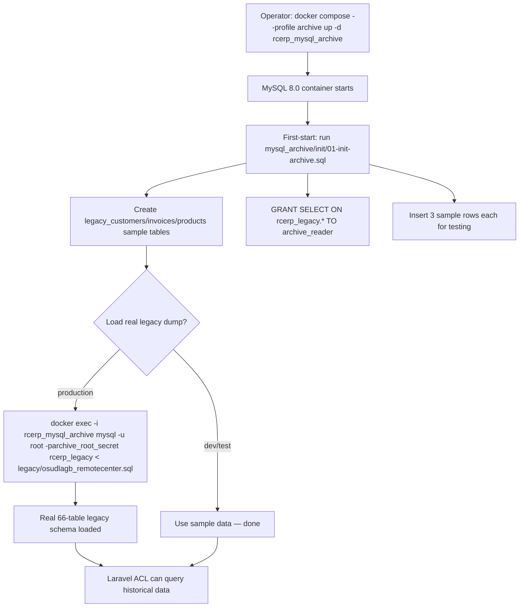

# Legacy MySQL — Read-Only Enforcement & `config/archive.php`

> **Module:** Archive (Legacy anti-corruption layer)
> **Audience:** Engineers + AI assistants + DBAs + ops/security
> **Status:** Draft
> **Last reviewed:** 2026-08-04
> **Source of truth:** this file, grounded in `laravel/config/archive.php`,
> `laravel/config/database.php` (lines 29-45, the `mysql_archive` connection),
> `mysql_archive/init/01-init-archive.sql`, `docker-compose.yml` (the `rcerp_mysql_archive`
> service, lines 83-105), `.env.docker` / `.env`, `laravel/app/Archive/Repositories/LegacyMySQLRepository.php`,
> `laravel/app/Console/Commands/MigrateMasterData.php`, `laravel/app/Console/Commands/MigrateLegacyEmployees.php`,
> `laravel/app/Console/Commands/ExportArchivedPartitionsToParquet.php`, and `docs/migration/phase12_complete.md`.

---

## 1. What is it?

This file documents the **read-only enforcement** of the legacy MySQL archive — the layered
set of technical and policy controls that guarantee no Laravel code, artisan command, or
operator ever writes to the legacy `osudlagb_remotecenter` / `rcerp_legacy` MySQL database.
It also documents the full anatomy of `config/archive.php` (the configuration that controls
the ACL's connection to the legacy MySQL) and the **critical distinction** between the
legacy MySQL archive (this file) and the PostgreSQL partition-archival system (a completely
separate "archive" that lives in the `archive` PG schema — see §6 rule R-1).

The runtime code that reads the legacy MySQL is documented in `anti-corruption-layer.md`;
the origin story of the legacy system is documented in `legacy-overview.md`. This file is
the **enforcement + configuration** reference.

## 2. Why does it exist?

The legacy MySQL contains ~7 years of financial history. It is the forensic ground truth for
replay verification (`stock:replay-verify`, `journal:replay-verify`) and the source of
historical queries >24 months old. If any code ever wrote to it:

- **Replay verification would break** — the verification commands compare PG against the
  legacy MySQL as the immutable baseline. A write to the legacy MySQL would corrupt the
  baseline and make drift detection meaningless.
- **Audit trails would be compromised** — the legacy MySQL is the historical record. Writes
  would create rows that never existed in production, undermining forensic integrity.
- **The ACL's caching assumption would break** — `ArchiveService` caches archive lookups
  for 1 hour on the assumption that the data is immutable. A write would make cached
  results stale and incorrect.
- **Accounting integrity would be at risk** — the legacy `journal_entries` /
  `journal_lines` tables are the source of the opening balances migrated into PG. A write
  would silently change the opening position.

Read-only enforcement is therefore a **safety-critical** property, enforced at **five
layers** so that no single misconfiguration or code bug can violate it.

## 3. When is it used?

- **Every runtime archive query** — `ArchiveService` → `LegacyMySQLRepository` → PDO →
  legacy MySQL. The ACL enforces read-only at layers 1 (MySQL user), 2 (PDO options), 3
  (application — no write methods on the interface), 4 (feature flag), and 5 (Docker
  profile opt-in).
- **One-time migration commands** — `migrate:master-data` and `migrate:legacy-employees`
  read from the legacy MySQL via the `mysql_archive` Laravel connection (layer 1 + layer 2
  apply; layers 3-5 do not, because these commands use `DB::connection('mysql_archive')`
  directly, not the ACL). These commands write to **PostgreSQL**, never to the legacy
  MySQL.
- **Never for writes** — there is no legitimate code path that writes to the legacy MySQL.
  The only way to write to it is via the MySQL root user directly (e.g. `docker exec ...
  mysql -u root -p`), which is an operator action, not a code action.

## 4. Who uses it?

- **`LegacyMySQLRepository`** — the only ACL class that opens a PDO connection to the
  legacy MySQL. Uses the `archive_reader` MySQL user (SELECT-only).
- **`MigrateMasterData` / `MigrateLegacyEmployees` console commands** — read from the
  legacy MySQL via `DB::connection('mysql_archive')`. Also use the `archive_reader` user.
- **DBAs / ops** — may connect to the legacy MySQL via the root user for forensic
  re-imports (rare) or to load the legacy SQL dump into a fresh archive container. This
  is the only write path and is documented in §11.2.
- **`ArchiveService`** — checks `isArchiveAvailable()` (a read-only connection test) to
  decide whether to show the "Archive MySQL offline" badge.
- **Security auditors** — verify the read-only enforcement by inspecting the MySQL user
  grants (§11.4) and the ACL code (§7.3).

## 5. Related modules

- `anti-corruption-layer.md` — the runtime ACL that consumes `config/archive.php`.
- `legacy-overview.md` — the legacy system origin story.
- `../database/etl-legacy-migration.md` §7.8 — the `mysql_archive` Laravel connection.
- `../database/partitioning.md` — the PostgreSQL partition-archival (the OTHER "archive" —
  see §6 rule R-1 for the distinction).
- `../deployment/docker-setup.md` (Phase 19, pending) — the `rcerp_mysql_archive` docker
  service.
- `../deployment/environment.md` (Phase 19, pending) — the `ARCHIVE_*` env vars.

## 6. Business rules (read-only enforcement)

- **R-1: MUST NOT confuse the two "archive" systems.** There are TWO completely separate
  things called "archive" in this codebase:
  1. **Legacy MySQL archive** — the read-only `osudlagb_remotecenter` / `rcerp_legacy`
     MySQL database, queried by the ACL. Controlled by `config/archive.php` and the
     `mysql_archive` Laravel connection. This is what this file documents.
  2. **PostgreSQL partition archival** — the `archive` PG schema, populated by pg_partman's
     `run_maintenance_proc()` when partitions expire, exported to Parquet by
     `partition:export-parquet`. Controlled by `partman.part_config` retention. Documented
     in `../database/partitioning.md` and `../architecture/partitioning-archival.md`.
  The `config/archive.php` file's header comment explicitly warns about this (see §7.1).
  They share NO code, NO tables, NO config. The only thing they share is the word "archive".

- **R-2: MUST enforce read-only at the MySQL user level.** The `archive_reader` MySQL user
  has `GRANT SELECT ON rcerp_legacy.* TO 'archive_reader'@'%'` and nothing else. No
  INSERT/UPDATE/DELETE/DDL. This is the primary enforcement layer — even if a bug in the
  ACL tried to write, MySQL would reject it. See §7.2.

- **R-3: MUST enforce read-only at the PDO options level.** The ACL's PDO connection sets
  `PDO::ATTR_ERRMODE => PDO::ERRMODE_EXCEPTION` (so any error, including a write attempt,
  throws) and `PDO::ATTR_DEFAULT_FETCH_MODE => PDO::FETCH_ASSOC`. The connection does NOT
  set `PDO::ATTR_PERSISTENT` (per-request connection, see `anti-corruption-layer.md` §12
  E-9). See §7.3.

- **R-4: MUST enforce read-only at the application level.** The
  `ArchiveRepositoryInterface` defines NO write methods (no insert/update/delete). The
  `LegacyMySQLRepository` implementation executes only `SELECT` statements. A code review
  of the ACL will find zero write SQL. See `anti-corruption-layer.md` §7.3.

- **R-5: MUST enforce read-only via the feature flag.** `config/archive.php` `enabled`
  (env `ARCHIVE_ENABLED`, default `true`) gates the entire ACL. When set to `false`,
  `LegacyMySQLRepository::getConnection()` returns null without even trying to connect.
  This is the decommission switch — set it to `false` once the legacy MySQL is retired.
  See §7.5.

- **R-6: MUST make the archive opt-in at the Docker level.** The `rcerp_mysql_archive`
  container is in the `archive` docker-compose profile. It does NOT start with the default
  `docker compose up -d` — operators must explicitly `docker compose --profile archive up -d`.
  This means a fresh dev environment has NO legacy MySQL running, and the ACL gracefully
  degrades to "Archive MySQL offline". See §7.6.

- **R-7: MUST NOT use the MySQL root user from application code.** The root user
  (`archive_root_secret`) exists only for: (a) the initial container init script
  (`mysql_archive/init/01-init-archive.sql`), (b) loading the legacy SQL dump into a fresh
  container, (c) forensic re-imports. Application code uses `archive_reader` exclusively.

- **R-8: MUST cache archive lookups (immutable data).** Because the legacy MySQL is
  read-only, its data is immutable, so caching is safe. The default TTL is 3600s. The cache
  key includes all query parameters. See `anti-corruption-layer.md` §7.6.

- **R-9: MUST treat the migration commands as read-from-legacy, write-to-PG.** The
  `migrate:master-data` and `migrate:legacy-employees` commands read from the legacy MySQL
  (via `DB::connection('mysql_archive')`) and write to PostgreSQL. They do NOT write to
  the legacy MySQL. The commands are one-time, run during cutover, and idempotent (upsert
  with `ON CONFLICT DO NOTHING/UPDATE`). See §9.

- **R-10: MUST distinguish `partition:export-parquet` from the legacy MySQL archive.** The
  `ExportArchivedPartitionsToParquet` console command operates on the PostgreSQL `archive`
  schema (PG partition archival), NOT on the legacy MySQL. Its name contains "archive" but
  it has nothing to do with `config/archive.php`. See §10.

## 7. Technical implementation

### 7.1 `config/archive.php` — full anatomy

The file (`laravel/config/archive.php`, 92 lines) has five sections:

| Section | Keys | Purpose |
|---|---|---|
| `connection` | driver, host, port, database, username, password, charset, collation, prefix, strict, engine, options | The PDO connection params for the legacy MySQL. Used by `LegacyMySQLRepository`. |
| `cache_ttl` | (int, seconds, default 3600) | Cache TTL for archive lookups. |
| `migration_history_months` | (int, default 24) | How many months of recent history live in PG; older data is in the archive. (Advisory — not enforced by code; used for documentation.) |
| `enabled` | (bool, default true) | The feature flag / decommission switch. |
| `tables` | (array, legacy → Laravel table name) | Legacy table name mappings. Consumed only by the repository. |

The file's header comment (lines 1-31) is critical — it explicitly warns about R-1 (the two
"archive" systems). Verbatim excerpt:

```php
/**
 * Archive Configuration — Phase 12 (Legacy MySQL Anti-Corruption Layer).
 *
 * ⚠️  NOT related to Phase 10.1 Phase 7 (PostgreSQL Partition Archival).
 *
 * This config is for the LEGACY MySQL read-only archive — the Anti-Corruption
 * Layer that lets Laravel read historical data from the old MySQL database
 * during the migration period. It is completely separate from the PostgreSQL
 * partition archival system defined in Phase_10.1_Partitioning_and_Archival_Plan.md.
 * ...
 * The Legacy MySQL Archive Layer:
 *   - Connects to the legacy MySQL, translates data into Laravel DTOs,
 *     and isolates all legacy-specific logic. Laravel controllers never
 *     know legacy table names or column names.
 *   - The legacy database is READ-ONLY — Laravel never writes to it.
 *
 * Future: the MySQL connection can be replaced by SQL dump, data warehouse,
 * object storage, or reporting database — only this config + the repository
 * implementation change, not the ERP itself.
 */
```

### 7.2 The `archive_reader` MySQL user (layer 1 — DB-level)

Created by `mysql_archive/init/01-init-archive.sql` (runs automatically on first container
start). The relevant grant:

```sql
GRANT SELECT ON rcerp_legacy.* TO 'archive_reader'@'%';
```

That is the ONLY grant. No `INSERT`, `UPDATE`, `DELETE`, `CREATE`, `ALTER`, `DROP`, `INDEX`,
`ALTER ROUTINE`, `EXECUTE`, `CREATE VIEW`, `SHOW VIEW`, `TRIGGER`, `EVENT`, `LOCK TABLES`,
`REFERENCES`, `FILE`, `RELOAD`, `PROCESS`, `REPLICATION CLIENT`, `REPLICATION SLAVE`,
`SHUTDOWN`, `SUPER`, `USAGE` (beyond the implicit connect). The user can connect and
`SELECT` — nothing else.

If a bug in the ACL tried to run `INSERT INTO sales_invoices (...)`, MySQL would reject it
with `ERROR 1142 (42000): INSERT command denied to user 'archive_reader'@'%' for table
'sales_invoices'`. The ACL's try/catch would log a warning and return empty — no data
corruption, no crash.

The docker-compose service (`docker-compose.yml` lines 83-105) creates the user via the
standard MySQL image env vars:

```yaml
rcerp_mysql_archive:
  image: mysql:8.0
  profiles: [archive]
  environment:
    MYSQL_ROOT_PASSWORD: ${MYSQL_ROOT_PASSWORD:-archive_root_secret}
    MYSQL_DATABASE: ${MYSQL_DATABASE:-rcerp_legacy}
    MYSQL_USER: ${MYSQL_USER:-archive_reader}
    MYSQL_PASSWORD: ${MYSQL_PASSWORD:-archive_reader_secret}
```

The MySQL image auto-creates `archive_reader` with full privileges on `rcerp_legacy.*` by
default; the init script then narrows it to SELECT-only by re-issuing the GRANT. (The
image's auto-grant is `ALL PRIVILEGES ON rcerp_legacy.* TO archive_reader`; the init
script's `GRANT SELECT` is additive, not restrictive. To truly restrict, the init script
would need `REVOKE ALL ON rcerp_legacy.* FROM archive_reader; GRANT SELECT ON ...`. See
§13 F-1 — this is a known weakness.)

### 7.3 The PDO connection (layer 2 — driver-level)

`LegacyMySQLRepository::getConnection()` builds the PDO connection from
`config('archive.connection')`:

```php
$config = config('archive.connection');
$dsn = "mysql:host={$config['host']};port={$config['port']};dbname={$config['database']};charset={$config['charset']}";
$this->connection = new \PDO($dsn, $config['username'], $config['password'], $config['options'] ?? []);
```

The `options` array (from `config/archive.php`):

```php
'options' => [
    PDO::ATTR_ERRMODE => PDO::ERRMODE_EXCEPTION,         // throw on any error
    PDO::ATTR_DEFAULT_FETCH_MODE => PDO::FETCH_ASSOC,    // return associative arrays
],
```

`ERRMODE_EXCEPTION` is the safety property: any PDO error (including a denied write) throws
a `PDOException`, which the repository's try/catch logs and returns empty. There is no
`PDO::ATTR_PERSISTENT`, no `PDO::ATTR_EMULATE_PREPARES` (defaults are fine for read-only).

Note: the `mysql_archive` Laravel connection (`config/database.php` lines 29-45) sets one
additional option the ACL's raw PDO does not: `PDO::ATTR_EMULATE_PREPARES => false`. This
forces server-side prepared statements. The ACL's raw PDO uses the default (emulated
prepares on for MySQL), which is acceptable for read-only queries but is a minor
inconsistency (see `anti-corruption-layer.md` §13 F-2).

### 7.4 The application-level enforcement (layer 3 — code-level)

The `ArchiveRepositoryInterface` defines exactly six methods, all read-only:

```php
public function searchInvoices(string $search, int $limit = 50): Collection;
public function findInvoice(string $invoiceCode): ?InvoiceArchiveDTO;
public function searchCustomers(string $search, int $limit = 50): Collection;
public function getCustomerLedger(int $customerId, ?string $fromDate = null, ?string $toDate = null): Collection;
public function getSupplierLedger(int $supplierId, ?string $fromDate = null, ?string $toDate = null): Collection;
public function isAvailable(): bool;
```

No `insert`, `update`, `delete`, `save`, `create`, `upsert`. The `LegacyMySQLRepository`
implementation executes only `SELECT` statements (all use `$conn->prepare(...)` with
`SELECT ... FROM ... WHERE ...`). A `grep -rn 'INSERT\|UPDATE\|DELETE\|REPLACE\|CREATE\|ALTER\|DROP\|TRUNCATE' laravel/app/Archive/`
returns zero matches in statement bodies (only in comments explaining what the ACL does NOT
do).

### 7.5 The feature flag (layer 4 — config-level)

`config/archive.php` `enabled` (env `ARCHIVE_ENABLED`, default `true`):

```php
'enabled' => env('ARCHIVE_ENABLED', true),
```

`LegacyMySQLRepository::getConnection()` checks this FIRST:

```php
if (!config('archive.enabled', false)) {
    return null;
}
```

When `false`, the ACL never even tries to connect. Every query method returns empty. The
`ArchiveService::isArchiveAvailable()` returns false. The UI shows "Archive MySQL offline".
This is the **decommission switch** — set it to `false` (and remove the docker service)
once the legacy MySQL is retired (see §13).

### 7.6 The Docker profile (layer 5 — infra-level)

The `rcerp_mysql_archive` container is in the `archive` profile (`docker-compose.yml`):

```yaml
rcerp_mysql_archive:
  image: mysql:8.0
  profiles: [archive]
  ...
```

The default `docker compose up -d` does NOT start it. Operators must explicitly:

```bash
docker compose --profile archive up -d              # start core + archive
docker compose --profile archive up -d rcerp_mysql_archive  # start only archive
```

This means a fresh dev environment (or a CI runner) has NO legacy MySQL running. The ACL
gracefully degrades. The `laravel/app` container's `depends_on` does NOT include
`rcerp_mysql_archive` (see `docker-compose.yml` lines 116-126 comment) — Laravel starts
without it.

The host port is `3307:3306` (mapped to 3307 on the host to avoid conflicts with any
existing MySQL/XAMPP on 3306). Internally, containers communicate on 3306 via the
`rcerp_network` bridge.

### 7.7 The env vars (`.env` / `.env.docker`)

| Env var | Default | Used by | Purpose |
|---|---|---|---|
| `ARCHIVE_DB_HOST` | `127.0.0.1` | `config/archive.php` `connection.host` | ACL PDO host (local dev) |
| `ARCHIVE_DB_PORT` | `3306` | `config/archive.php` `connection.port` | ACL PDO port |
| `ARCHIVE_DB_DATABASE` | `osudlagb_remotecenter` | `config/archive.php` `connection.database` | ACL PDO database |
| `ARCHIVE_DB_USERNAME` | `readonly_user` | `config/archive.php` `connection.username` | ACL PDO user |
| `ARCHIVE_DB_PASSWORD` | (empty) | `config/archive.php` `connection.password` | ACL PDO password |
| `ARCHIVE_CACHE_TTL` | `3600` | `config/archive.php` `cache_ttl` | Cache TTL |
| `ARCHIVE_MIGRATION_MONTHS` | `24` | `config/archive.php` `migration_history_months` | Advisory window |
| `ARCHIVE_ENABLED` | `true` | `config/archive.php` `enabled` | Feature flag |
| `ARCHIVE_MYSQL_HOST` | `rcerp_mysql_archive` | `config/database.php` `mysql_archive.host` | Migration commands host (docker) |
| `ARCHIVE_MYSQL_PORT` | `3306` | `config/database.php` `mysql_archive.port` | Migration commands port |
| `ARCHIVE_MYSQL_DATABASE` | `rcerp_legacy` | `config/database.php` `mysql_archive.database` | Migration commands database |
| `ARCHIVE_MYSQL_USERNAME` | `archive_reader` | `config/database.php` `mysql_archive.username` | Migration commands user |
| `ARCHIVE_MYSQL_PASSWORD` | (empty) | `config/database.php` `mysql_archive.password` | Migration commands password |

**There are TWO sets of env vars** (`ARCHIVE_DB_*` for the ACL, `ARCHIVE_MYSQL_*` for the
migration commands) because of the two-config-path split documented in
`anti-corruption-layer.md` §7.4. In `.env.docker` (docker deployment), both sets point at
the same `rcerp_mysql_archive` host; in `.env` (local dev), `ARCHIVE_DB_*` defaults to
`127.0.0.1` (host MySQL) while `ARCHIVE_MYSQL_*` defaults to `rcerp_mysql_archive` (docker
hostname). This is a known minor inconsistency (see §13 F-2).

## 8. Important database tables (archive-side)

The legacy MySQL (`rcerp_legacy` / `osudlagb_remotecenter`) has 66 tables — the same schema
as the original production MySQL, frozen at ETL time. The ACL queries 5 of them (see
`anti-corruption-layer.md` §8). The init script (`mysql_archive/init/01-init-archive.sql`)
creates 3 sample tables (`legacy_customers`, `legacy_invoices`, `legacy_products`) for
testing the connection — these are NOT the real legacy schema; in production, the real
schema is loaded from `legacy/osudlagb_remotecenter.sql` (the ~7.1 MB dump).

| Table | Purpose | ACL usage |
|---|---|---|
| `sales_invoices` | Historical sales invoices (>24 months old) | `searchInvoices()`, `findInvoice()` |
| `customers` | Historical customer master (may overlap with PG for old customers) | `searchCustomers()` |
| `customer_ledger` | Historical customer ledger entries (Dr/Cr/running_balance) | `getCustomerLedger()` |
| `supplier_ledger` | Historical supplier ledger entries | `getSupplierLedger()` |
| `branches` | Branch master (join for `branch_name`) | join in invoice queries |
| `employees`, `users` | Historical employee/user master | `migrate:legacy-employees` command (one-time) |
| All other 60 tables | Historical data frozen at ETL time | (future ACL expansion; current migration commands) |

## 9. Related services (migration commands)

Two console commands read from the legacy MySQL (via `DB::connection('mysql_archive')`)
and write to PostgreSQL. They are one-time, run during cutover, and idempotent.

### 9.1 `migrate:master-data` (`MigrateMasterData.php`)

```bash
php artisan migrate:master-data [--dry-run] [--skip=table1,table2]
```

Migrates: branches, warehouses, employees, users (password hashes re-hashed with bcrypt),
product categories + groups, products + price history, customers (with opening balances),
suppliers (with opening balances), banks (with GL ledger mapping), chart of accounts
(ledgers), opening stock (warehouse_stock at current avg_cost).

Does NOT migrate: historical transactions (invoices, GRNs, payments), historical journal
entries, historical stock transactions — those stay in the archive.

### 9.2 `migrate:legacy-employees` (`MigrateLegacyEmployees.php`)

```bash
php artisan migrate:legacy-employees [--execute] [--force]
```

Upserts employees + users from the legacy MySQL into PG. Used to backfill HR columns
(father_name, mother_name, date_of_birth, NID, designation, department, bank_account,
blood_group, mobile) that were dropped during Phase 2 ETL and re-added in Phase 12.
Default is dry-run; `--execute` writes; `--force` skips the confirmation prompt. Wraps
all upserts in a `DB::transaction()` and syncs PG sequences afterward.

Both commands check prerequisites (PG connection, MySQL archive connection, HR columns
exist) before running. Both use `ON CONFLICT (id) DO NOTHING` / `ON CONFLICT (employee_code)
DO NOTHING` / `ON CONFLICT (username) DO NOTHING` for idempotency.

## 10. Related services (NOT the legacy MySQL — disambiguation)

### 10.1 `partition:export-parquet` (`ExportArchivedPartitionsToParquet.php`)

This command's name contains "archive" but it has NOTHING to do with the legacy MySQL
archive. It operates on the **PostgreSQL `archive` schema** — the partition-archival
cold-store (see `../database/partitioning.md`). It:

1. Lists tables in the PG `archive` schema (populated by pg_partman when partitions expire).
2. Exports each to Parquet (via DuckDB) or CSV (fallback) in
   `storage/app/partition-exports/`.
3. Drops the archived PG table (unless `--keep`).

The `config/archive.php` file's header comment (§7.1) explicitly warns about this confusion.
The two "archive" systems share NO code, NO tables, NO config.

## 11. Important workflows

### 11.1 Starting the legacy MySQL archive (dev/ops)



### 11.2 Loading the legacy SQL dump (one-time, per fresh container)

```bash
# 1. Start the archive container
docker compose --profile archive up -d rcerp_mysql_archive

# 2. Wait for healthy
docker compose --profile archive ps rcerp_mysql_archive  # wait for "healthy"

# 3. Load the legacy dump (PowerShell syntax; use `cat` on bash)
Get-Content legacy/osudlagb_remotecenter.sql | docker exec -i rcerp_mysql_archive mysql -u root -parchive_root_secret rcerp_legacy

# On bash:
docker exec -i rcerp_mysql_archive mysql -u root -parchive_root_secret rcerp_legacy < legacy/osudlagb_remotecenter.sql

# 4. Verify
docker exec -it rcerp_mysql_archive mysql -u archive_reader -parchive_reader_secret rcerp_legacy -e "SHOW TABLES; SELECT COUNT(*) FROM sales_invoices;"
```

This is the ONLY legitimate write path to the legacy MySQL, and it is an operator action
using the root user — not application code. After this load, the legacy MySQL is treated
as immutable.

### 11.3 Decommissioning the legacy MySQL (future)

Once all historical queries >24 months are migrated to Parquet cold-storage (via
`partition:export-parquet`) or no longer needed:

1. Confirm no `/admin/archive` searches are returning `source='archive_mysql'` results
   (check application logs for `archive:invoices:` cache writes).
2. Set `ARCHIVE_ENABLED=false` in `.env` / `.env.docker`.
3. Verify the `/admin/archive` UI now shows "Archive MySQL offline" and all searches
   return PG-only results.
4. Stop the container: `docker compose --profile archive down rcerp_mysql_archive`.
5. Remove the `rcerp_mysql_archive` service block from `docker-compose.yml` (or leave it
   in the `archive` profile, dormant).
6. Optionally remove the `mysql_archive_data` volume after backing up the dump:
   `docker volume rm debugRC_mysql_archive_data`.
7. Implement `ParquetRepository` (see `anti-corruption-layer.md` §13 F-3) and swap the
   `AppServiceProvider` binding if historical queries are still needed.
8. Remove the `LegacySessionBridge` + `SyncLegacySession` middleware if legacy PHP is also
   retired (see `legacy-overview.md` §13).
9. Log the decommission in `changelog/CHANGELOG.md`.

### 11.4 Verifying read-only enforcement (security audit)

```bash
# 1. Verify the archive_reader user has ONLY SELECT
docker exec -it rcerp_mysql_archive mysql -u root -parchive_root_secret -e \
  "SHOW GRANTS FOR 'archive_reader'@'%';"
# Expected: GRANT SELECT ON rcerp_legacy.* TO 'archive_reader'@'%' (+ the implicit USAGE)

# 2. Verify a write attempt is rejected
docker exec -it rcerp_mysql_archive mysql -u archive_reader -parchive_reader_secret rcerp_legacy -e \
  "INSERT INTO sales_invoices (invoice_code) VALUES ('TEST-REJECTED');"
# Expected: ERROR 1142 (42000): INSERT command denied to user 'archive_reader'@'%'

# 3. Verify the ACL has no write SQL
grep -rn 'INSERT\|UPDATE\|DELETE\|REPLACE\|CREATE\|ALTER\|DROP\|TRUNCATE' laravel/app/Archive/ --include='*.php' | grep -v '^\s*//' | grep -v '^\s*\*'
# Expected: zero matches in statement bodies (only in comments)

# 4. Verify the interface has no write methods
grep -n 'function ' laravel/app/Archive/Repositories/ArchiveRepositoryInterface.php
# Expected: searchInvoices, findInvoice, searchCustomers, getCustomerLedger, getSupplierLedger, isAvailable — all read-only

# 5. Verify the feature flag is respected
ARCHIVE_ENABLED=false php artisan tinker --execute="echo config('archive.enabled') ? 'on' : 'off';"
# Expected: off
```

## 12. Known edge cases

- **E-1: The init script's GRANT is additive, not restrictive.** The MySQL image auto-creates
  `archive_reader` with `ALL PRIVILEGES ON rcerp_legacy.*`. The init script then issues
  `GRANT SELECT ON rcerp_legacy.* TO archive_reader` — but does NOT `REVOKE` the other
  privileges first. So `archive_reader` may actually have `ALL PRIVILEGES` (the SELECT
  grant is redundant). This is a **known weakness** (see §13 F-1). The mitigation is that
  application code (the ACL) never attempts writes, so the over-broad grant is not
  exploited. But a defense-in-depth fix should add `REVOKE ALL ON rcerp_legacy.* FROM
  archive_reader; GRANT SELECT ON ...` to the init script.
- **E-2: The two env-var sets can drift.** `ARCHIVE_DB_*` (ACL) and `ARCHIVE_MYSQL_*`
  (migration commands) are separate. If an operator sets `ARCHIVE_DB_HOST=rcerp_mysql_archive`
  but forgets `ARCHIVE_MYSQL_HOST`, the ACL will work but `migrate:legacy-employees` will
  fail (or vice versa). The `.env.docker` file sets both consistently; `.env` (local dev)
  has `ARCHIVE_DB_*` defaulting to `127.0.0.1` which may not match a docker-only setup.
  See §7.7 and §13 F-2.
- **E-3: The `migration_history_months` config is advisory.** `config/archive.php`
  `migration_history_months` (default 24) is documented as "how many months of recent
  history to migrate from legacy to PG". But NO code reads this value to enforce a cutoff.
  The `ArchiveService` queries PG first unconditionally; the archive is fallback regardless
  of how old the data is. The config is documentation-only. If a future feature wants to
  enforce the 24-month boundary (e.g. skip PG for queries older than 24 months), it would
  read this config.
- **E-4: The `tables` map is documentation-only.** `config/archive.php` `tables` (9 legacy
  → Laravel mappings) is NOT consumed by `LegacyMySQLRepository` — the repository hard-codes
  the legacy table names in its SQL. The map is for human reference and future tooling
  (e.g. a "validate ACL queries against the map" linter). If you rename a legacy table in
  the repository SQL, update the map too.
- **E-5: The `strict => true` in `config/archive.php` `connection` is ignored.** The
  `strict` key is a Laravel-DB-factory setting, but the ACL uses raw PDO (not Laravel's
  MySQL factory), so `strict` has no effect. The `mysql_archive` Laravel connection (for
  migration commands) does respect `strict` via Laravel's factory. Harmless but confusing.
- **E-6: The sample data in the init script can confuse testers.** `01-init-archive.sql`
  inserts 3 sample rows each in `legacy_customers`, `legacy_invoices`, `legacy_products`.
  These are NOT the real legacy schema (the real schema uses `customers`, `sales_invoices`,
  `products` — no `legacy_` prefix). A tester running the ACL against a fresh container
  (without loading the real dump) will get zero results because the ACL queries
  `sales_invoices`, not `legacy_invoices`. The init script's sample tables are for testing
  the MySQL connection only, not the ACL. See §13 F-3.
- **E-7: The ACL does not verify the MySQL user's grants at runtime.** `isAvailable()`
  tests only that the PDO connection succeeds. It does not verify that the user has
  SELECT-only grants. A misconfigured MySQL user with broader grants would not be detected
  until a bug tried to write (and succeeded). The §11.4 audit is the mitigation.
- **E-8: The `rcerp_mysql_archive` container is not in `depends_on` for `rcerp_app`.**
  This is deliberate (Laravel starts without the archive), but it means a freshly-started
  stack will have the ACL reporting "offline" until an operator manually starts the archive
  container. The `docker-compose.yml` comment (lines 111-114) explains this.
- **E-9: The host port 3307 can conflict.** The archive maps `3307:3306`. If another
  service on the host uses 3307, the container will fail to start. Change the host-side
  port in `docker-compose.yml` if needed. The internal port (3306) and the docker-network
  hostname (`rcerp_mysql_archive:3306`) are unaffected.
- **E-10: The `osudlagb_remotecenter.sql` dump is 7.1 MB and may take time to load.** The
  `docker exec -i ... mysql ... < dump.sql` command is synchronous; for a slow disk it can
  take several minutes. There is no progress indicator. If it appears to hang, check
  `docker stats rcerp_mysql_archive` for CPU/disk activity.

## 13. Future improvements

- **F-1: Add `REVOKE ALL` before `GRANT SELECT` in the init script.** Defense-in-depth fix
  for E-1. Change `mysql_archive/init/01-init-archive.sql` to:
  ```sql
  REVOKE ALL ON rcerp_legacy.* FROM 'archive_reader'@'%';
  GRANT SELECT ON rcerp_legacy.* TO 'archive_reader'@'%';
  ```
  This guarantees the user has ONLY SELECT regardless of what the MySQL image auto-grants.
  Test on a fresh container to confirm the REVOKE doesn't break the image's user creation.
- **F-2: Unify the two env-var sets.** Collapse `ARCHIVE_DB_*` and `ARCHIVE_MYSQL_*` into
  one set (e.g. `ARCHIVE_DB_*` for everything). Have `config/database.php` `mysql_archive`
  read from `ARCHIVE_DB_*` instead of `ARCHIVE_MYSQL_*`. Update `.env.example`,
  `.env.docker`, and the `docker-compose.yml` env block. Track via
  `changelog/CHANGELOG.md`. (Same as `anti-corruption-layer.md` §13 F-2.)
- **F-3: Make the init script create the REAL legacy schema (or a representative subset).**
  The current `01-init-archive.sql` creates `legacy_customers`/`legacy_invoices`/
  `legacy_products` which the ACL never queries (the ACL queries `customers`/
  `sales_invoices`/`products`). Either (a) rename the sample tables to match the real
  schema, or (b) add a comment that the sample tables are for connection-testing only and
  the real schema must be loaded from `legacy/osudlagb_remotecenter.sql`. Option (a) is
  better for dev onboarding.
- **F-4: Add a `php artisan archive:verify` command.** A health-check command that:
  (1) confirms `config('archive.enabled')`, (2) connects via the ACL and runs a trivial
  `SELECT 1`, (3) verifies the `archive_reader` user has only SELECT grants (via
  `SHOW GRANTS`), (4) reports the row counts of the 5 ACL-queried tables. Useful for
  post-deploy verification and for the §11.4 audit. Output should be green/red per check.
- **F-5: Add a `php artisan archive:refresh-cache` command.** Flush only `archive:*` cache
  keys (not the whole cache). Useful after a legacy MySQL re-import. Currently operators
  must `php artisan cache:clear` (nuclear) or wait for the 1-hour TTL.
- **F-6: Add a `--readonly-audit` flag to `migrate:legacy-employees` / `migrate:master-data`.**
  The flag would run the migration in dry-run mode AND verify that no SQL was executed
  against the legacy MySQL (only against PG). Currently the commands read from legacy and
  write to PG, but there's no automated check that the "write to PG only" invariant holds.
- **F-7: Add Prometheus/Grafana metrics for the ACL.** Counters for: archive queries
  issued, cache hits, cache misses, PDO connection failures, average query latency. This
  would surface E-7 (silent grant misconfiguration) as an anomaly if writes started
  succeeding.
- **F-8: Document the decommission runbook in `deployment/`.** The §11.3 decommission
  workflow should be expanded into a full runbook in
  `AI_CONTEXT/deployment/go-live-checklist.md` (Phase 19, pending) once that phase is
  commissioned. Include the verification steps, the rollback procedure (if
  `ParquetRepository` has bugs), and the post-decommission cache-flush.
