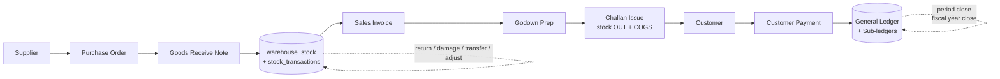

# Business Model

> **Module:** Business Domain (overview)
> **Audience:** Engineers + AI assistants + business analysts + accountants
> **Status:** Draft
> **Last reviewed:** 2026-08-03
> **Source of truth:** this file, grounded in `laravel/app/Models/Branch.php`, `laravel/docs/migration/avg_cost_rule.md`, `laravel/docs/migration/journal_posting_rules.md`, repo `README.md`, and `laravel/docs/MIGRATION_PLAN.md`.

---

## 1. What is it?

**Remote Center ERP (RC_ERP_v2)** is the internal ERP of a Bangladeshi **wholesale / distribution**
business. The company buys goods (primarily electronics and mixed consumer goods) from suppliers,
holds them across **4 branches** and **6 warehouses** in Old Dhaka, and sells them **B2B** to
retail customers on credit. The ERP automates the full chain — procurement, inventory, sales,
collection, and double-entry accounting — in a single PostgreSQL-backed system with strict
multi-branch isolation.

It is a **perpetual, moving-average-cost, multi-branch, double-entry** ERP. Every stock movement
hits the ledger the moment it happens; every transaction is journaled with debits equal to
credits; every branch can only see and mutate its own data unless an admin explicitly overrides
(and that override is audited).

## 2. Why does it exist?

The ERP was migrated from a legacy custom PHP/MySQL application into Laravel 12 + PostgreSQL 16.
The migration was governed by four non-negotiable principles (see
`../PROJECT_OVERVIEW.md`):

1. **Database conversion done** — MySQL → PostgreSQL 16.
2. **Application conversion done** — custom PHP MVC → Laravel 12.
3. **Keep the existing UI** — Blade views preserve the operator workflows users already know.
4. **Re-derive business logic — never copy-paste** — every rule was re-derived from first
   principles and verified by replaying production data, not transplanted verbatim.

The ERP exists to run day-to-day distribution operations reliably: it must never lose inventory
value, never post an unbalanced journal, never let one branch touch another's books, and never
silently mutate a posted transaction. These are the safety-critical invariants the rest of this
knowledge base documents.

## 3. When is it used?

The ERP is the **system of record** for every operating day. It runs continuously:

- **Daytime (operational):** salesmen build carts and finalize invoices; warehouse staff prepare
  godown packs and issue challans; accountants receive customer payments, pay suppliers, and post
  manual journals; warehouse managers run stock takes and adjustments.
- **End of day:** challans are dispatched, payments are confirmed, daily stock summaries are
  materialized.
- **End of month:** bank reconciliation, sub-ledger reconciliation, soft period close.
- **End of fiscal year (June 30, Bangladesh):** income/expense ledgers are rolled into retained
  earnings; the fiscal year is closed and locked.

## 4. Who uses it?

| Role tier | Roles | Primary use |
|---|---|---|
| Superadmin | `superadmin` | Company-critical actions, system policy, superadmin account management |
| Admin | `admin` | Users, employees, permissions, branch-wide administration |
| Operational | `manager`, `accountant`, `salesman`, `warehouse_manager`, `dispatcher`, `hr`, `user`, `other` | Day-to-day branch operations |

See `organizational-structure.md` for the full role matrix and `../security/rbac-roles-permissions.md`
(will be created in Phase 5) for the detailed permission model.

## 5. Related modules

- `organizational-structure.md` — branches, warehouses, roles, employees.
- `core-workflows.md` — the buy → stock → sell → collect chain.
- `business-rules-catalog.md` — cross-cutting business rules.
- `../PROJECT_OVERVIEW.md` — tech stack, scale, migration status.
- `../architecture/high-level-architecture.md` — how the Laravel app is layered.
- `../architecture/module-map.md` — every module and its entry points.

## 6. Business rules

The business model is governed by invariants that span every module. Each is documented in
detail in `business-rules-catalog.md`; the headline rules are:

- **Double-entry integrity.** Every journal entry MUST have total debits = total credits,
  enforced by a PostgreSQL trigger (`enforce_balanced_journal_entry`). See
  `business-rules-catalog.md#1-accounting-integrity-dr--cr`.
- **Reversal, never mutation.** Posted transactions are never edited. Corrections create a new
  reversal entry with swapped Dr/Cr; the original is flagged `is_reversed = true`.
- **Moving-average cost.** Inventory is valued at per-warehouse moving-average cost, re-derived
  on every inbound movement. Outbound movements consume at the current average.
- **Negative stock is forbidden.** Stock cannot go below zero (tolerance 0.0001 for transient
  in-transaction states), enforced at DB and service layers.
- **Branch isolation.** A user can only see and mutate their own branch's data. Cross-branch
  flows go through the Branch Demand or Money Transfer modules, both of which carry explicit
  `from_branch_id` / `to_branch_id`.
- **Single currency (BDT).** No FX translation; all amounts are Bangladeshi Taka.

## 7. Technical implementation

The business model is realized through the Laravel 12 service layer. The relevant code surfaces:

| Concern | Primary code path |
|---|---|
| Org structure | `laravel/app/Models/{Company,Branch,Warehouse,Employee,User}.php` |
| Procurement | `laravel/app/Services/Purchase/*` (4 services) |
| Inventory | `laravel/app/Services/Stock/*` (22 services) |
| Sales | `laravel/app/Services/Sales/*` (10 services) |
| Accounting | `laravel/app/Services/Accounting/*` (17 services) |
| Inter-branch | `laravel/app/Services/BranchDemand/*` (7 services) |
| Consolidation | `laravel/app/Services/Consolidation/ConsolidationService.php` |
| RBAC | `laravel/config/roles.php`, `laravel/app/Services/MenuService.php` |
| Accounting config | `laravel/config/accounting.php` |
| DB schema | `laravel/database/sql/{01..07}*.sql` (7 DDL files) |

## 8. Important database tables

The business model is backed by 66 tables + 7 materialized views. The headline tables by domain:

| Domain | Key tables | Purpose |
|---|---|---|
| Org | `companies`, `branches`, `warehouses`, `employees`, `users` | Legal entity → branch → warehouse; staff + login identity |
| Master data | `products`, `product_categories`, `product_groups`, `customers`, `suppliers`, `banks`, `ledgers` | What is bought/sold, to/from whom, and the chart of accounts |
| Procurement | `purchase_orders`, `purchase_receives`, `purchase_returns` | PO → GRN → return |
| Inventory | `stock_transactions`, `warehouse_stock`, `stock_adjustments`, `stock_take_sessions`, `warehouse_transfers`, `damage_invoices`, `units_of_measure` | The stock ledger + derived balances |
| Sales | `sales_invoices`, `sales_challans`, `sales_returns`, `sales_draft_carts`, `customer_payments` | Cart → invoice → challan → return + collection |
| Accounting | `journal_entries`, `journal_lines`, `customer_ledger`, `supplier_ledger`, `employee_ledger`, `branch_ledger`, `accounting_periods`, `fiscal_years`, `financial_audit_log`, `document_sequences` | GL + sub-ledgers + audit chain |
| Inter-branch | `branch_demands`, `branch_demand_*_settlements` | Inter-branch stock requests + FIFO settlement |

See `../database/schema-overview.md` (Phase 3) for the full ER picture.

## 9. Related services

The business model is owned by the service layer (78 services across 14 namespaces). The ones
that most directly express the business model:

- `laravel/app/Services/Stock/StockService.php` — the **only** entry point that mutates
  `warehouse_stock`; runs the moving-average cost recompute and the negative-stock guard.
- `laravel/app/Services/Accounting/JournalPostingService.php` — the **only** creator of
  `journal_entries` / `journal_lines`; runs the Dr=Cr pre-check.
- `laravel/app/Services/Sales/SalesInvoiceService.php` — finalizes a cart into a posted invoice.
- `laravel/app/Services/Purchase/PurchaseReceiveService.php` — the economic event of procurement
  (stock IN + GL + supplier ledger).
- `laravel/app/Services/BranchDemand/BranchDemandService.php` — inter-branch stock movement.
- `laravel/app/Services/Consolidation/ConsolidationService.php` — intercompany elimination.

## 10. Related models

- `laravel/app/Models/Branch.php` — operating location; comment: *"RC_ERP has 4 branches: Head
  Office, Patuatuli, Nowabpur, Tarabo."*
- `laravel/app/Models/Warehouse.php` — physical stockroom; carries `is_frozen_for_count`.
- `laravel/app/Models/Employee.php` — the person; the role lives here, not on `User`.
- `laravel/app/Models/Company.php` — legal entity (Phase 8; supports minority interest).

## 11. Important workflows

The end-to-end value chain (procure → stock → sell → collect → close) is documented in
`core-workflows.md`. The headline flow:

Each arrow that moves stock or money also posts a balanced journal entry. See `core-workflows.md`
for the per-stage sequence diagrams and Dr/Cr tables.

## 12. Known edge cases

- **Sales return at original cost.** Returned goods re-enter stock at the avg_cost that was in
  effect when the original challan issued them, NOT the current avg_cost. This prevents phantom
  gain/loss. See `business-rules-catalog.md#5-inventory-costing-moving-average`.
- **Warehouse freeze during stock count.** Outbound stock from a warehouse with an active
  stock-take session is blocked (`WarehouseFrozenForCountException`); inbound is allowed.
- **Cross-branch stock movement is forbidden** via the warehouse-transfer module. It MUST go
  through Branch Demand, which posts dual intercompany journals.
- **Period-close override.** By default even admins cannot post to a closed period; the override
  is config-gated (`PERIOD_CLOSE_ADMIN_OVERRIDE`) and audited.
- **Cash payments do not settle inter-branch demands.** Only bank-mode customer payments and
  inter-branch money transfers trigger FIFO demand settlement.

## 13. Future improvements

- **Multi-entity consolidation with minority interest** is supported by the `companies` schema
  (`ownership_pct < 100`) but not yet by the posting engine — currently a single legal entity
  (RC Group) with multiple branches.
- **AI Sidecar** (repo README "Phase 13") — demand forecasting, invoice OCR, anomaly detection.
  Pending.
- **VPS BDIX deployment** — production cutover to a Bangladesh Internet Exchange VPS. Pending.
- **System policy modes** `READ_ONLY`, `MAINTENANCE`, `EMERGENCY` are modeled but not yet active
  (only `NORMAL` and `INVESTIGATION` are implemented).

---

## Appendix A — Business scale (verified from `docs/MIGRATION_PLAN.md`)

| Metric | Value | Source |
|---|---|---|
| Branches | 4 (Head Office, Patuatuli, Nowabpur, Tarabo) | `Branch.php` |
| Warehouses | 6 | `docs/MIGRATION_PLAN.md` §3.3 |
| Currency | BDT (single currency, no FX) | `companies.currency` default, `ConsolidationService` |
| Fiscal year | July 1 → June 30 (Bangladesh) | `SystemPolicy::getFiscalYearStart` |
| Production replay — stock transactions | 38,775 | `docs/MIGRATION_PLAN.md` Phase 6 acceptance |
| Production replay — warehouse_stock rows | 1,529 (zero drift) | `docs/MIGRATION_PLAN.md` Phase 6 acceptance |
| Production replay — invoices | 521 | `docs/MIGRATION_PLAN.md` Phase 9 |
| Production replay — GRNs | 311 | `docs/MIGRATION_PLAN.md` Phase 9 |
| Production replay — payments | 550 | `docs/MIGRATION_PLAN.md` Phase 9 |
| Golden dataset | 50 products, 5 categories, 20 customers, 10 suppliers | `docs/MIGRATION_PLAN.md` §3.3 |
| Product base units | Pcs, Carton, KG, Bag, Dobe, Set | `01_auth_and_master.sql` `products.unit` CHECK |

## Appendix B — Value-chain at a glance

| Stage | Business event | Stock effect | GL effect | Owner service |
|---|---|---|---|---|
| Procure | Supplier delivers goods (GRN confirmed) | IN at purchase rate | Dr Inventory / Cr AP | `PurchaseReceiveService` |
| Hold | Stock sits in warehouse | — | valued at avg_cost × qty | `StockService` (derived) |
| Sell | Sales invoice finalized | none (draft) | Dr AR / Cr Sales Revenue | `SalesInvoiceService` |
| Dispatch | Challan issued | OUT at avg_cost | Dr COGS / Cr Inventory | `SalesChallanService` |
| Collect | Customer payment confirmed | none | Dr Bank/Cash / Cr AR | `CustomerPaymentService` |
| Return | Sales return confirmed | IN at original cost | Dr Sales Return / Cr AR; Dr Inventory / Cr COGS | `SalesReturnService` |
| Close | Period / fiscal year close | none | income/expense → retained_earnings | `AccountingPeriodService` / `FiscalYearService` |
