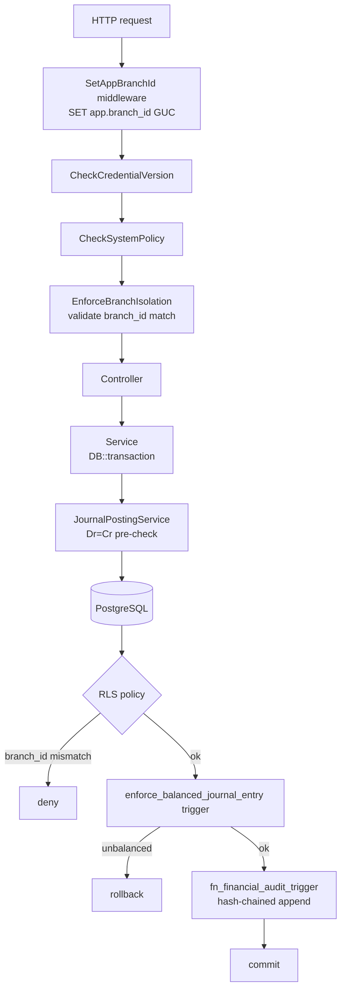
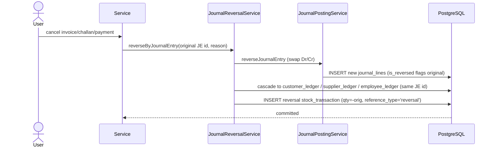

# Business Rules Catalog

> **Module:** Business Domain (cross-cutting rules)
> **Audience:** Engineers + AI assistants + accountants + auditors
> **Status:** Draft
> **Last reviewed:** 2026-08-03
> **Source of truth:** this file, grounded in `laravel/config/accounting.php`, `laravel/database/sql/02_accounting.sql`, `laravel/database/sql/03_stock.sql`, `laravel/database/sql/07_views_triggers_constraints.sql`, `laravel/app/Services/{Accounting,Stock,Auth,Compliance,Approval,BranchDemand}/*`, `laravel/app/Traits/AuditableMasterData.php`, and `laravel/docs/migration/{journal_posting_rules,avg_cost_rule}.md`.

---

## 1. What is it?

This is the **catalog of non-negotiable business rules that span more than one module**. Rules
that live entirely inside a single module (e.g. "a sales invoice has items") are documented in
that module's file. The rules here are the cross-cutting invariants — accounting integrity,
costing, isolation, approvals, audit, and compliance — that any AI assistant or engineer MUST
respect regardless of which module they are working in.

Each rule states the invariant, where it is enforced (DB trigger / service / middleware /
config), and the failure mode if violated.

## 2. Why does it exist?

These rules are the **safety-critical spine** of the ERP. Violating any of them risks:
corrupted books (unbalanced journals), lost inventory value (wrong cost), branch data leakage
(isolation breach), unaudited changes (audit gap), or compliance failure (period tampering). The
rules are enforced at the **lowest reliable layer** (usually a DB trigger or CHECK constraint)
with defense-in-depth at the service and middleware layers, so that a bug in one layer is caught
by the next.

## 3. When is it used?

Always. These rules apply on **every** request, every transaction, every background job. They
are not opt-in.

## 4. Who uses it?

Every actor in the system is bound by these rules — `superadmin` included. Some rules have an
admin override (period-close override, branch override), but every override is audited. No role
can bypass the Dr=Cr trigger, the negative-stock guard, the financial audit log, or the
reversal-only model.

## 5. Related modules

- `business-model.md`, `organizational-structure.md`, `core-workflows.md`
- `../architecture/branch-isolation-rls.md` — rule 7 in detail.
- `../architecture/realtime-events.md` — notification fan-out.
- `../accounting/journal-posting-rules.md` (Phase 6) — rule 1 + 3 + 4 in depth.
- `../security/audit-trails.md` (Phase 5) — rule 12 in depth.
- `../security/credential-versioning.md` (Phase 5) — rule 10 in depth.

## 6. Business rules

The 17 cross-cutting rules below. Each is keyed for stable anchoring.

---

### Rule 1 — Accounting integrity (Dr = Cr)

**Invariant:** Every journal entry MUST have `SUM(debit) = SUM(credit)`.

**Enforced at:**
- **DB trigger** `enforce_balanced_journal_entry` (`database/sql/02_accounting.sql` lines 74-96)
  — `AFTER INSERT OR UPDATE OR DELETE ON journal_lines`, raises `check_violation` if unbalanced.
- **CHECK constraints** on `journal_lines`: `jl_balanced_check` (debit≥0 AND credit≥0),
  `jl_not_both_zero_check` (debit>0 OR credit>0). Same on `manual_journal_lines`.
- **Service pre-check** `JournalPostingService::createJournalEntry` — rejects if
  `abs(totalDebit - totalCredit) > 0.01` before INSERT.

**Failure mode:** unbalanced INSERT raises `check_violation`; the whole transaction rolls back.
No partial journal can ever persist.

```sql
CREATE TRIGGER trg_journal_balanced
AFTER INSERT OR UPDATE OR DELETE ON journal_lines
FOR EACH ROW EXECUTE FUNCTION enforce_balanced_journal_entry();
```

### Rule 2 — Reversal, never mutation

**Invariant:** A posted transaction is **never edited**. Corrections create a new reversal entry
with swapped Dr/Cr; the original is flagged `is_reversed = true`.

**Enforced at:**
- `JournalReversalService::reverseByJournalEntry` — swaps Dr/Cr via
  `JournalPostingService::reverseJournalEntry`, cascades to all sub-ledger rows referencing the
  same `journal_entry_id`.
- `StockService::reverseTransaction` — inserts a new `stock_transactions` row with
  `qty = -original.qty`, `reference_type = 'reversal'`, `reversal_of_transaction_id = original.id`;
  marks original `is_reversed = true`.
- Source quotes:
  > `docs/migration/journal_posting_rules.md` §1.4: *"Reversals create a new entry with swapped
  > Dr/Cr — originals are never mutated."*
  > `docs/migration/avg_cost_rule.md` §2: *"Reversals are append-only — the original transaction
  > is never mutated."*

**Failure mode:** an attempt to `UPDATE` a posted `journal_lines` row would fire the audit
trigger but the application layer never does this; reversals are the only correction path.

### Rule 3 — Sub-ledger reconciliation (control-account integrity)

**Invariant:** Each control account in the GL MUST equal the sum of its sub-ledger, within
tolerance `0.02` BDT (`config('app.gl_reconciliation_tolerance', 0.02)`).

**6 sections** (`ReconciliationService::reconcileAll`):

| # | Section | Sub-ledger | GL control |
|---|---|---|---|
| 1 | AR | `customer_ledger` | `ar` |
| 2 | AP | `supplier_ledger` | `ap` |
| 3 | Employee | `employee_ledger` | `employee_payable` |
| 4 | Cash/Bank | bank balances | `cash_bank` per branch |
| 5 | Inventory | `warehouse_stock` (Σ qty × avg_cost) | `inventory` |
| 6 | COGS | `stock_transactions` where `reference_type='sales_challan'` | `cogs` |

**When:** run before period close (pre-close gate) and on demand.

### Rule 4 — Period close + fiscal year

**Invariant:** Once an accounting period is closed (`closed_through_date` per branch), postings
to that period are blocked. Year-end close rolls income/expense into `retained_earnings`.

**Enforced at:**
- `AccountingPeriodService` — sets `accounting_periods.closed_through_date`.
- `JournalPostingService::validatePeriod` — rejects `posting_date <= closed_through_date`.
- `config/accounting.php`:
  - `period_close_admin_override` (default `false`). When `true`, admin + superadmin can post to
    closed periods; the override is logged to `user_audit_log`.
- **Pre-close gate** (4 checks): Trial Balance balanced, AR recon green, AP recon green,
  Employee recon green, backup on file.
- **Fiscal year:** Bangladesh — **July 1 → June 30** (`SystemPolicy::getFiscalYearStart`).
  Year-end zeros income/expense ledgers to `retained_earnings`; balance-sheet ledgers carry
  forward. Reopen requires superadmin + audit log.

### Rule 5 — Inventory costing (moving average)

**Invariant:** Inventory is valued at **per-warehouse moving-average cost**, re-derived on every
inbound movement.

**Formula:**
- IN (`qty > 0`): `new_avg_cost = (old_qty × old_avg_cost + in_qty × in_rate) / new_qty`.
- OUT (`qty < 0`): `avg_cost` UNCHANGED; `value_removed = out_qty × old_avg_cost`.

**Critical sub-rule — sales return at ORIGINAL cost:** returned stock re-enters at the avg_cost
in effect when the original challan issued it (snapshotted to `sales_return_items.original_cost`),
NOT the current avg_cost. Using current avg_cost creates phantom gain/loss.

**Rate semantics by `stock_transactions.reference_type`** (11 values):

| reference_type | rate used |
|---|---|
| `purchase_receive` | purchase rate |
| `purchase_return` | avg_cost at time of original receive |
| `sales_challan` | current avg_cost |
| `sales_return` | ORIGINAL avg_cost from original challan |
| `stock_adjustment` | current avg_cost (variance adjusts value) |
| `stock_take` | current avg_cost (variance adjusts value) |
| `warehouse_transfer` | source = current; dest = source avg_cost |
| `damage` | current avg_cost |
| `branch_demand` | source OUT at current; dest IN at same (no phantom gain/loss) |
| `opening_balance` | supplied rate |
| `reversal` | original transaction's rate |

**Verification:** `php artisan stock:replay-verify` replays all production `stock_transactions`
through `StockService::applyTransaction` into `warehouse_stock_shadow` and requires zero drift.

### Rule 6 — Negative stock forbidden

**Invariant:** `warehouse_stock.qty` cannot go below zero (tolerance `-0.0001` for transient
in-transaction states).

**Enforced at:**
- **DB CHECK** `warehouse_stock.qty >= -0.0001`.
- **DB trigger** `prevent_negative_stock()` BEFORE INSERT/UPDATE — raises `check_violation`.
- **Service** `StockService::applyTransaction` — throws `RuntimeException("Insufficient stock…")`
  when `newQty < -0.0001`.
- **Stock-take pre-check** — `StockTakeService::postSession` throws
  `StockTakeNegativeStockException` (with offending-products list) BEFORE applying variances, so
  the session stays in `counting` state.

### Rule 7 — Branch isolation

**Invariant:** A non-admin user can only read and write their own session branch's data.

**Enforced at 3 layers** (defense-in-depth, see `../architecture/branch-isolation-rls.md`):
1. `SetAppBranchId` middleware — sets GUC `app.branch_id` + `app.is_admin`.
2. `BranchScope` global Eloquent scope — `WHERE branch_id = session('branch_id')` for non-admins.
3. `EnforceBranchIsolation` middleware — write-validation; admin override audited to
   `user_audit_log` with `action='branch_override'`.
4. PostgreSQL RLS — 5 policies per branch-scoped table; bypass when
   `current_setting('app.is_admin', true) = 'true'`.

**Cross-branch exceptions:** `branch-demands` and `money-transfers` carry both `from_branch_id`
and `to_branch_id`; `EnforceBranchIsolation::inferTableFromUri` returns `null` for them and the
controller authorizes by role.

**`document_sequences`** uses `branch_id = 0` as a sentinel for global access (advisory locks
need cross-branch reads); it has special RLS policies.

### Rule 8 — Document numbering (advisory locks)

**Invariant:** Document numbers are unique, gap-resistant, and concurrency-safe.

**Enforced at:**
- `document_sequences` table — `(doc_type, branch_id, period_key)` unique.
- `DocumentSequenceService` — uses `pg_advisory_xact_lock(crc32(doc_type:branch_id:period_key))`
  (PostgreSQL session-level, transaction-scoped auto-release). Replaces `SELECT … FOR UPDATE`
  to avoid RLS conflict and blocking reads.
- Format: `{PREFIX}-{datePart}-{NNNN}` (e.g. `INV-20250120-0001`, `JE-2025-000001`,
  `PO-YYYYMMDD-NNNN`, `BD-` branch demands, `ET-YYYY-NNNNN` employee transactions).

### Rule 9 — Warehouse freeze during stock count

**Invariant:** Outbound stock from a warehouse with an active stock-take session is blocked;
inbound is allowed.

**Enforced at:**
- `warehouses.is_frozen_for_count` boolean (denormalized), partial index
  `idx_wh_is_frozen WHERE is_frozen_for_count = true`.
- `StockService::applyTransaction` — at the start of an OUTBOUND movement (`qty < 0`), calls
  `assertWarehouseNotFrozen()` unless `reference_type IN ('stock_take', 'reversal')`.
- Throws `WarehouseFrozenForCountException` (carries `warehouseId`, `warehouseName`, offending
  `sessions` list) → controller renders 422.
- Refreshed by `StockTakeService::refreshWarehouseFreezeFlags` on every create/post/cancel/delete.

**Why inbound is allowed:** only stock LEAVING the warehouse would corrupt an active count;
inbound (purchases received, transfers IN) is safe.

### Rule 10 — Credential versioning (session invalidation)

**Invariant:** When a user's password or role changes, all their other sessions are invalidated.

**Enforced at:**
- `users.credential_version` — monotonic counter.
- `CredentialVersion::bump(userId)` — `credential_version + 1`.
- `CheckCredentialVersion` middleware — runs on every request; rejects if session's stored
  version ≠ DB version. Comparison uses `hash_equals()` (constant-time).

### Rule 11 — Approval workflow + maker-checker

**Invariant:** Sensitive operations require a second person; the submitter cannot approve their
own request (segregation of duties).

**Enforced at:**
- **Workflow engine** (`ApprovalService` + 4 tables: `approval_workflows`, `approval_steps`,
  `approval_requests`, `approval_actions`). Lifecycle: `submitForApproval → approve (advance
  level or final-approve → entity posts)`. `canBeActedBy($user)` rejects self-approval. If no
  workflow applies → `auto_approved = true`.
- **Per-module maker-checker state machines:**
  - Stock adjustments: `draft → submitted → approved → confirmed`.
  - Stock-take sessions: `draft → counting → submitted → approved → posted`.
  - Damages: `draft → submitted → approved → confirmed` + type-aware threshold escalation
    (`config damage.approval.threshold`); theft requires witness, missing requires accountable
    employee.
  - Manual journals: `draft → submitted → approved → posted` (default workflow: 2 levels —
    manager then admin; `min_amount=0`).

### Rule 12 — Audit trail (3 layers)

**Invariant:** Every master-data change and every financial transaction is audited; financial
audit rows are immutable and hash-chained.

**Layer 1 — `user_audit_log`** (partitioned by `created_at`): master-data CRUD via
`AuditableMasterData` trait (events `created/updated/deleted/restored`, prefixed
`master_data_`); also `branch_override`, `reconciliation_run`, `purchase_order_created`, and
module-specific sales/stock audit events. The trait re-throws errors if inside a DB transaction
(avoids swallowing SQL errors leaving PG in aborted 25P02 state).

**Layer 2 — `financial_audit_log`** (partitioned, immutable, hash-chained):
- Trigger `fn_financial_audit_trigger()` AFTER INSERT/UPDATE/DELETE on 10 financial tables
  (`journal_entries`, `journal_lines`, `manual_journals`, `manual_journal_lines`,
  `customer_payments`, `supplier_payments`, `money_transfers`, `other_incomes`,
  `other_expenses`, `employee_transactions`).
- Captures `before_data`, `after_data`, `changed_columns`, `performed_by`, `branch_id`,
  `transaction_id xid`, `request_path`, `request_ip`, `request_id`.
- **SHA-256 hash chain:** `row_hash = SHA-256(prev_hash || table_name || op || record_id ||
  coalesce(after, before))`; first row's `prev_hash` = 64 zeros. View
  `v_financial_audit_chain_verification` flags `chain_valid`.
- Immutability: `REVOKE UPDATE, DELETE` from `PUBLIC, postgres, remote_center`. Uses `pgcrypto`.

**Layer 3 — module-specific audit loggers** (dual-write DB + file): `SalesAuditLogger`,
`StockAdjustmentAuditLogger`, `StockTakeAuditLogger`, `WarehouseTransferAuditLogger`,
`BranchDemandAuditLogger`, `PurchaseAuditService`. Exist because services use `DB::table()` for
efficiency, bypassing Eloquent events the trait would catch.

### Rule 13 — System policy (compliance)

**Invariant:** A single active system policy can restrict visibility company-wide.

**Enforced at:**
- `SystemPolicyService` (singleton, cached 5-min under `system_policy:active`).
  Controllers/middleware NEVER read `system_policies` directly — they call this service.
- 5 modes (only 2 active): `NORMAL` (default), `INVESTIGATION` (all users including superadmin
  see only current fiscal year), `READ_ONLY` (future), `MAINTENANCE` (future, superadmin-only),
  `EMERGENCY` (future lockdown).
- `Gate::define('manage-system-policy', …)` — only superadmin can manage.
- `SystemPolicyChanged` event dispatched on every activate/deactivate; every change logged to
  `user_audit_log`.

### Rule 14 — Credit limit enforcement

**Invariant:** A sales invoice cannot be finalized if it would push the customer over their
credit limit, unless an explicit override is given.

**Enforced at:**
- `SalesInvoiceService::checkCreditLimit` — checked TWICE: outside the transaction (for UX) and
  inside after `Customer::lockForUpdate()` (for race safety).
- `customers.credit_limit` (numeric 14,2) + `opening_balance` + `balance_type`.
- `credit_limit_override` flag allows explicit override (audited).

### Rule 15 — Intercompany settlement (cross-branch)

**Invariant:** Cross-branch stock and cash movements post dual intercompany journals and settle
FIFO.

**Enforced at:**
- `BranchIntercompanyService` — creditor journal `Dr Due-from-Branches / Cr Inventory`; debtor
  journal `Dr Inventory / Cr Due-to-Branches`.
- **FIFO auto-settlement:**
  - `branch_demand_money_transfer_settlements` — inter-branch money transfer settles open
    demands FIFO.
  - `branch_demand_customer_payment_settlements` — a **bank-mode** customer payment at the
    debtor branch settles open demands FIFO. **Cash payments do NOT settle demands.**
- Ledger natures: `interbranch_receivable` (Due-from-Branches), `interbranch_payable`
  (Due-to-Branches).
- **Terminology gotcha:** in `branch_demands`, `from_branch_id = requester (debtor)`,
  `to_branch_id = supplier (creditor)` — OPPOSITE of stock movement direction.

### Rule 16 — Over-allocation prevention

**Invariant:** A customer payment cannot be allocated to invoices beyond their total amount.

**Enforced at:**
- `invoice_payment_allocations` CHECK `allocated_amount > 0`.
- EXCLUDE constraint (GiST, requires `btree_gist` extension) preventing
  `SUM(allocated_amount) > invoice.total_amount`.

### Rule 17 — Single currency (BDT)

**Invariant:** All amounts are Bangladeshi Taka. No FX translation.

**Enforced at:**
- `companies.currency` default `BDT`.
- `ConsolidationService`: *"All amounts are in BDT (single currency, no FX translation)."*
- GL reconciliation tolerance `0.02` BDT.

---

## 7. Technical implementation

The rules are enforced across four layers. The table maps each rule to its enforcement layers:

| # | Rule | DB trigger / CHECK | Service | Middleware | Config |
|---|---|---|---|---|---|
| 1 | Dr=Cr | `enforce_balanced_journal_entry` + CHECKs | `JournalPostingService` | — | — |
| 2 | Reversal not mutation | — | `JournalReversalService`, `StockService::reverseTransaction` | — | — |
| 3 | Sub-ledger reconciliation | — | `ReconciliationService` | — | `gl_reconciliation_tolerance` |
| 4 | Period close | — | `AccountingPeriodService`, `FiscalYearService`, `JournalPostingService::validatePeriod` | — | `period_close_admin_override` |
| 5 | Moving-average cost | — | `StockService` | — | `avg_cost_rule.md` |
| 6 | Negative stock forbidden | CHECK + `prevent_negative_stock()` | `StockService`, `StockTakeService` | — | — |
| 7 | Branch isolation | RLS (5 policies/table) | `BranchScope` | `SetAppBranchId`, `EnforceBranchIsolation` | — |
| 8 | Document numbering | `document_sequences` UNIQUE | `DocumentSequenceService` (advisory lock) | — | — |
| 9 | Warehouse freeze | `is_frozen_for_count` + partial index | `StockService` | — | — |
| 10 | Credential versioning | — | `CredentialVersion` | `CheckCredentialVersion` | — |
| 11 | Approval / maker-checker | state CHECKs | `ApprovalService` + per-module services | `role` | `damage.approval.threshold` |
| 12 | Audit trail | `fn_financial_audit_trigger` + REVOKE | `AuditableMasterData` + loggers | — | — |
| 13 | System policy | — | `SystemPolicyService` | `CheckSystemPolicy` | — |
| 14 | Credit limit | — | `SalesInvoiceService::checkCreditLimit` | — | — |
| 15 | Intercompany settlement | EXCLUDE on allocations | `BranchIntercompanyService` | — | — |
| 16 | Over-allocation | EXCLUDE (GiST) | `CustomerPaymentService` | — | — |
| 17 | Single currency | `companies.currency` default | `ConsolidationService` | — | — |

## 8. Important database tables

| Rule | Key tables |
|---|---|
| 1, 2, 3 | `journal_entries`, `journal_lines`, `customer_ledger`, `supplier_ledger`, `employee_ledger` |
| 4 | `accounting_periods`, `fiscal_years`, `period_close_logs` |
| 5, 6, 9 | `stock_transactions`, `warehouse_stock`, `warehouses.is_frozen_for_count` |
| 7 | (all branch-scoped tables) + `user_audit_log` |
| 8 | `document_sequences` |
| 11 | `approval_workflows`, `approval_steps`, `approval_requests`, `approval_actions` |
| 12 | `user_audit_log`, `financial_audit_log` |
| 13 | `system_policies` |
| 15, 16 | `branch_demands`, `branch_demand_*_settlements`, `invoice_payment_allocations`, `branch_ledger` |

## 9. Related services

- `laravel/app/Services/Accounting/{JournalPostingService, JournalReversalService, ReconciliationService, AccountingPeriodService, FiscalYearService, DocumentSequenceService, LedgerNatureService, SubLedgerService, MoneyTransferService}.php`
- `laravel/app/Services/Stock/{StockService, StockTakeService, StockAdjustmentService, DamageService, WarehouseTransferService}.php`
- `laravel/app/Services/Auth/CredentialVersion.php`
- `laravel/app/Services/Compliance/SystemPolicyService.php`
- `laravel/app/Services/Approval/ApprovalService.php`
- `laravel/app/Services/BranchDemand/{BranchDemandService, BranchIntercompanyService}.php`
- `laravel/app/Traits/AuditableMasterData.php`

## 10. Related models

- `JournalEntry`, `JournalLine`, `AccountingPeriod`, `FiscalYear`, `SystemPolicy`
- `StockTransaction`, `WarehouseStock`, `Warehouse`
- `User` (`credential_version`), `UserAuditLog`, `FinancialAuditLog`
- `ApprovalWorkflow`, `ApprovalRequest`, `ApprovalAction`
- `BranchDemand`, `BranchLedger`, `InvoicePaymentAllocation`

## 11. Important workflows

See `core-workflows.md` for the end-to-end chains. The rules above are applied inline at each
step. The two cross-cutting sequences most worth visualizing:

### 11.1 Defense-in-depth for a financial write



### 11.2 Reversal cascade



## 12. Known edge cases

- **Reversal of a reversal is blocked.** The original is marked `is_reversed = true`; a second
  reversal of the same entry is rejected.
- **Period-close override is auditable but not undoable.** Once `PERIOD_CLOSE_ADMIN_OVERRIDE=true`
  allows a post to a closed period, the post stands; only the audit log records it.
- **`AuditableMasterData` trait inside a transaction.** If a model event fires while inside
  `DB::transaction`, the trait re-throws errors rather than swallowing them — otherwise a
  swallowed SQL error leaves PostgreSQL in aborted 25P02 state.
- **Console bypasses branch isolation.** RLS sees no `app.branch_id` for console commands;
  console jobs that need branch context MUST set the GUC explicitly.
- **`document_sequences.branch_id = 0`** is a sentinel, not a real branch. Do not join it to
  `branches`.
- **Cash payments do not settle inter-branch demands** — only bank-mode customer payments and
  inter-branch money transfers do. A cash customer payment at the debtor branch does NOT
  auto-settle.
- **Financial audit log immutability** — even `postgres` superuser has `UPDATE/DELETE` revoked.
  Corrections are append-only via new audit rows.

## 13. Future improvements

- **System policy modes** `READ_ONLY`, `MAINTENANCE`, `EMERGENCY` are modeled but not active.
- **Approval thresholds for purchase orders** above a configurable amount are a candidate
  (currently only manual journals, stock adjustments, stock takes, and damages have
  maker-checker).
- **Multi-entity consolidation posting** — the `companies` schema supports minority interest, but
  the engine currently posts only single-entity inter-branch elimination.
- **Anomaly detection** (AI Sidecar, README Phase 13) could monitor the financial audit chain
  for irregular patterns.

---

## Appendix A — Ledger natures (the posting engine's behavior tags)

Source: `laravel/app/Services/Accounting/LedgerNatureService.php` + `docs/migration/journal_posting_rules.md` §2.

**7 critical natures** (each MUST resolve to exactly one active ledger — zero or multiple → error):

| Nature | Account type | Normal balance | Used by |
|---|---|---|---|
| `cash_bank` | Asset | Debit | Payments, transfers, money transfers |
| `ar` | Asset | Debit | Sales invoices, customer payments, sales returns |
| `ap` | Liability | Credit | Purchase receives, supplier payments, purchase returns |
| `inventory` | Asset | Debit | All stock movements |
| `sales_revenue` | Income | Credit | Sales invoice finalize |
| `cogs` | Expense | Debit | Sales challan issue, sales return confirm |
| `retained_earnings` | Equity | Credit | Year-end close |

**Extended natures (14+):** `sales_return` (contra-revenue), `sales_discount` (contra-revenue),
`transport_revenue`, `inventory_shrinkage`, `inventory_surplus`, `damage_loss` (falls back to
`inventory_shrinkage`), `employee_payable`, `interbranch_receivable`, `interbranch_payable`,
`other_income`, `operating_expense`, `salary_expense`, `payroll_expense`, `depreciation`,
`finance_cost`, `manual_adjustment`. Plus Phase 8 elimination natures: `elimination_receivable`,
`elimination_payable`, `elimination_revenue`, `elimination_cogs`, `elimination_investment`.

## Appendix B — Config-driven rule constants

Source: `laravel/config/accounting.php`.

| Constant | Default | Effect |
|---|---|---|
| `PERIOD_CLOSE_ADMIN_OVERRIDE` | `false` | When `true`, admin+superadmin can post to closed periods (audited). |
| `GL_RECONCILIATION_TOLERANCE` | `0.02` | BDT tolerance for sub-ledger reconciliation. |
| `STOCK_TAKE_MAX_REOPENS` (policy) | `1` | Cap on `re_open_count` for stock-take sessions. |
| `DAMAGE_APPROVAL_THRESHOLD` (config) | — | Threshold above which damage escalates approval. |

Other config files of business-rule relevance: `laravel/config/roles.php` (10 roles),
`laravel/config/app.php` (`gl_reconciliation_tolerance`).
