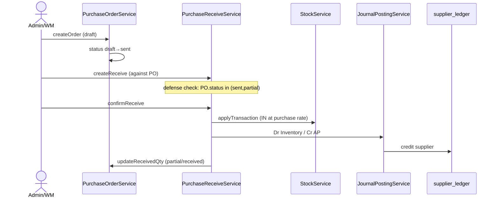
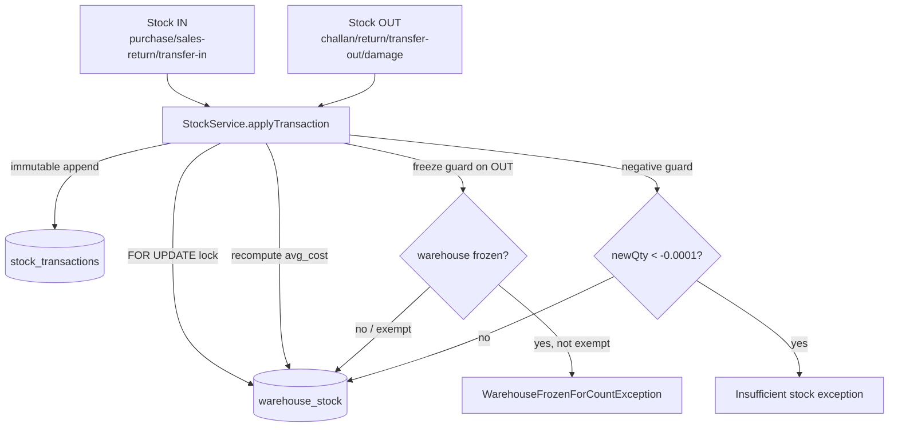
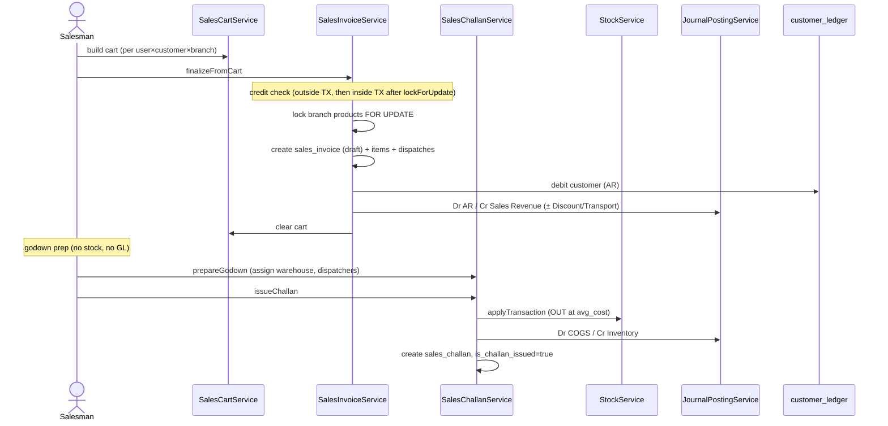
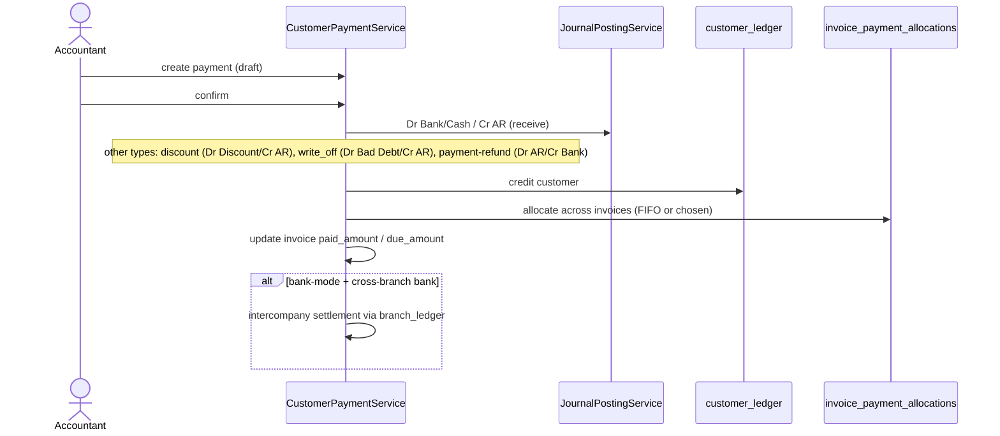
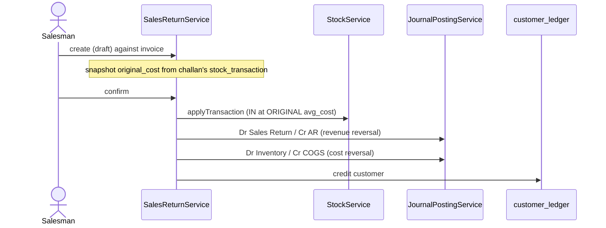
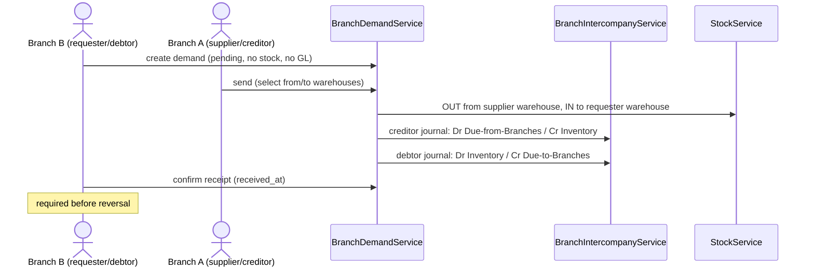
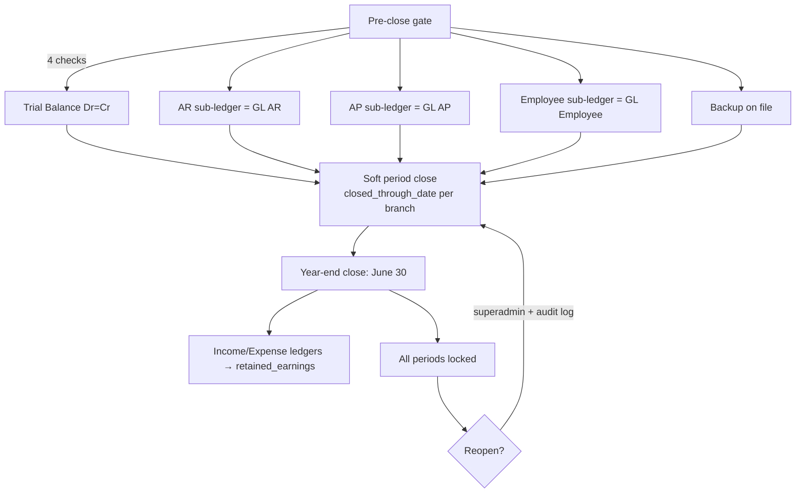

# Core Workflows

> **Module:** Business Domain (value chain)
> **Audience:** Engineers + AI assistants + business analysts + accountants
> **Status:** Draft
> **Last reviewed:** 2026-08-03
> **Source of truth:** this file, grounded in `laravel/app/Services/{Purchase,Stock,Sales,Accounting,BranchDemand}/*`, `laravel/routes/web.php`, `laravel/routes/api.php`, `laravel/database/sql/{02..06}*.sql`, `laravel/docs/migration/journal_posting_rules.md`, and `laravel/docs/migration/avg_cost_rule.md`.

---

## 1. What is it?

This file documents the **end-to-end value chain** of RC_ERP: how a product moves from a
supplier, through inventory, to a customer, and how the money comes back — with every step
posting balanced double-entry journals. The chain is:

**Procure → Stock → Sell → Dispatch → Collect → (Return) → Close**

plus two cross-cutting flows: **inter-branch demand** (stock moving between branches) and
**money transfer** (cash/bank moving between branches or accounts).

Each workflow names the controller, service, model, and tables involved, and shows the Dr/Cr
postings. Detailed posting rules live in `../accounting/journal-posting-rules.md` (Phase 6); this
file gives the business-level view.

## 2. Why does it exist?

The legacy application scattered these workflows across custom PHP pages with ad-hoc SQL. The
Laravel rewrite re-derived each workflow from first principles and verified it by **replaying
production data** (38,775 stock transactions, 521 invoices, 311 GRNs, 550 payments — see
`docs/MIGRATION_PLAN.md`). The goal is a single, auditable, balanced chain where no inventory
value is lost and no journal is ever unbalanced or mutated after posting.

## 3. When is it used?

Every operating day. The chain runs continuously: procurement and sales happen in parallel,
collections follow dispatches, and returns/damages/adjustments happen as exceptions arise. The
accounting close happens monthly (period close) and annually (fiscal year close on June 30).

## 4. Who uses it?

| Stage | Primary roles | Module |
|---|---|---|
| Procure (PO, GRN, return) | `admin`, `warehouse_manager`, `accountant` | Purchase |
| Stock (receipt, costing, take, adjust, damage, transfer) | `warehouse_manager`, `manager`, `accountant` | Stock |
| Sell (cart, invoice, godown, challan) | `salesman`, `manager` | Sales |
| Collect (customer payment) | `accountant`, `salesman` | Sales/Accounting |
| Return | `salesman`, `warehouse_manager`, `accountant` | Sales |
| Inter-branch demand | `warehouse_manager`, `manager` | BranchDemand |
| Money transfer | `accountant`, `manager` | Accounting |
| Close | `accountant`, `admin`, `superadmin` | Accounting |

## 5. Related modules

- `business-model.md` — the business the workflows serve.
- `organizational-structure.md` — who runs each stage.
- `business-rules-catalog.md` — the invariants every stage obeys.
- `../architecture/module-map.md` — every module's controllers/services/models.
- `../accounting/journal-posting-rules.md` (Phase 6) — the full Dr/Cr matrix.
- `../accounting/journal-posting-rules.md` supersedes `docs/migration/journal_posting_rules.md`.

## 6. Business rules

- **Every stock movement posts a journal.** Stock and GL are never out of sync — the same
  service call that mutates `warehouse_stock` also posts the GL entry.
- **`StockService::applyTransaction` is the ONLY writer** of `warehouse_stock`. No controller,
  no other service, no raw SQL may touch it directly.
- **`JournalPostingService` is the ONLY creator** of `journal_entries` / `journal_lines`.
- **Cost is always moving-average**, re-derived on IN, consumed on OUT at the current average.
  Sales returns use the *original* challan avg_cost.
- **Reversal, never mutation.** A posted invoice/challan/payment is reversed with a swapped
  entry, never edited.
- **Credit limit is enforced twice** during invoice finalization — once outside the transaction
  (for UX) and once inside (after `Customer::lockForUpdate()` for race safety).
- **Warehouse freeze blocks outbound** stock during a stock take; inbound is allowed.
- **Cross-branch stock movement is forbidden** outside the Branch Demand module.

## 7. Technical implementation

### 7.1 Module surface (route prefixes)

| Domain | Web routes (`admin/*`) | API routes (`/api/v1/*`) |
|---|---|---|
| Procurement | `purchase-orders`, `purchase-receives`, `purchase-returns` | — |
| Inventory | `stock`, `stock-adjustments`, `stock-take`, `warehouse-transfers`, `branch-demands` | `stock-adjustments`, `stock-take/sessions`, `warehouse-transfers`, `branch-demands` |
| Sales | `sales`, `sales-invoices`, `sales-challans`, `sales-returns`, `customer-payments` | `sales/cart`, `sales/invoices`, `sales/challans`, `sales/returns`, `sales/payments`, `sales/commission` |
| Accounting | `supplier-transactions`, `employee-transactions`, `money-transfers`, `other-incomes`, `other-expenses`, `manual-journals`, `accounting`, `bank-reconciliation`, `fiscal-years`, `consolidation` | — |

### 7.2 Service layer (78 services, 14 namespaces)

The workflows are owned by the service layer. Key services per stage:

| Stage | Service | Responsibility |
|---|---|---|
| Procure | `app/Services/Purchase/PurchaseOrderService` | PO draft/sent/partial/received/cancelled |
| Procure | `app/Services/Purchase/PurchaseReceiveService` | GRN = economic event (stock IN + GL + supplier ledger) |
| Procure | `app/Services/Purchase/PurchaseReturnService` | Return to supplier (Good = stock OUT; Damage = claim only) |
| Stock | `app/Services/Stock/StockService` | The ONLY `warehouse_stock` writer |
| Stock | `app/Services/Stock/StockAvailabilityService` | available = physical − sales pipeline |
| Stock | `app/Services/Stock/StockAdjustmentService` | Maker-checker variance |
| Stock | `app/Services/Stock/StockTakeService` | Physical count + freeze |
| Stock | `app/Services/Stock/WarehouseTransferService` | Same-branch transfer only |
| Stock | `app/Services/Stock/DamageService` | Loss write-off (type-aware ledger) |
| Sell | `app/Services/Sales/SalesCartService` | Per-user draft cart |
| Sell | `app/Services/Sales/SalesInvoiceService` | Finalize cart → posted invoice |
| Sell | `app/Services/Sales/SalesChallanService` | Godown prep → challan issue (stock OUT + COGS) |
| Sell | `app/Services/Sales/SalesReturnService` | Return at original cost |
| Collect | `app/Services/Sales/CustomerPaymentService` | Receive/discount/write_off/refund + allocation |
| Collect | `app/Services/Sales/CommissionService` | Commission on payment allocation |
| Pay | `app/Services/Accounting/SupplierTransactionService` | Supplier payment/advance/receive |
| Pay | `app/Services/Accounting/EmployeeTransactionService` | Advance/loan/salary/repayment |
| Transfer | `app/Services/Accounting/MoneyTransferService` | cash↔bank, cross-branch |
| Inter-branch | `app/Services/BranchDemand/BranchDemandService` | Cross-branch stock request |
| Inter-branch | `app/Services/BranchDemand/BranchIntercompanyService` | Dual intercompany journals |
| Close | `app/Services/Accounting/AccountingPeriodService` | Soft period close + year-end rollup |
| Close | `app/Services/Accounting/FiscalYearService` | Fiscal year lifecycle |
| Close | `app/Services/Accounting/BankReconciliationService` | Statement matching |
| Close | `app/Services/Accounting/ReconciliationService` | 6-section sub-ledger reconciliation |
| Reverse | `app/Services/Accounting/JournalReversalService` | Single reversal entry point |
| Manual | `app/Services/Accounting/ManualJournalService` | Parked/posted manual journals |

## 8. Important database tables

See `business-model.md#8-important-database-tables` for the full table list. The workflow-critical
ones: `purchase_orders`, `purchase_receives`, `purchase_returns`, `stock_transactions`,
`warehouse_stock`, `sales_invoices`, `sales_challans`, `sales_returns`, `customer_payments`,
`supplier_transactions`, `employee_transactions`, `money_transfers`, `branch_demands`,
`journal_entries`, `journal_lines`, `customer_ledger`, `supplier_ledger`, `employee_ledger`,
`branch_ledger`, `accounting_periods`, `fiscal_years`.

## 9. Related services

Listed in §7.2 above. All paths are under `laravel/app/Services/`.

## 10. Related models

Under `laravel/app/Models/`: `PurchaseOrder`, `PurchaseReceive`, `PurchaseReturn`,
`StockTransaction`, `WarehouseStock`, `SalesInvoice`, `SalesChallan`, `SalesReturn`,
`CustomerPayment`, `SupplierTransaction`, `EmployeeTransaction`, `MoneyTransfer`, `BranchDemand`,
`JournalEntry`, `JournalLine`, `CustomerLedger`, `SupplierLedger`, `EmployeeLedger`,
`BranchLedger`, `AccountingPeriod`, `FiscalYear`.

## 11. Important workflows

### 11.1 Procure-to-Pay (buy)

| Step | Stock | GL (Dr / Cr) | Sub-ledger |
|---|---|---|---|
| GRN confirm | IN at purchase rate | Inventory / AP | supplier_ledger Cr |

**Purchase return** (Good condition): stock OUT at the *original receive rate*; GL
Dr AP / Cr Inventory; supplier_ledger debit; GRN `return_qty++`. **Damage condition**: supplier
claim only — no stock movement (stock was never received in usable condition).

**PO status machine:** `draft → sent → partial → received → cancelled`.
**GRN status machine:** `draft → confirmed → cancelled`.

### 11.2 Inventory (stock)

The stock ledger is `stock_transactions` (immutable, partitioned by date). `warehouse_stock` is
the derived current on-hand (composite PK `warehouse_id, product_id`; no `id` column).

**Costing rules (moving average):**
- IN (`qty > 0`): `new_avg_cost = (old_qty × old_avg_cost + in_qty × in_rate) / new_qty`.
- OUT (`qty < 0`): `avg_cost` unchanged; `value_removed = out_qty × old_avg_cost`.

**Stock-take** state machine: `draft → counting → submitted → approved → posted → cancelled → reversed`.
Posting a session freezes the warehouse, applies variances, and un-freezes (unless another active
session exists). Reversal is distinct from cancel (`re_open_count` capped by policy
`stock_take.max_reopens`, default 1).

**Stock adjustment** state machine: `draft → submitted → approved → confirmed → cancelled/rejected`
(maker-checker). Categories: `opening_balance, data_migration, uom_correction, post_conversion_fix,
legacy_cleanup, reconciliation_variance, other`.

**Warehouse transfer** is **same-branch only**. Reversal safety: dest IN is reversed FIRST, then
source OUT.

**Damage** state machine: `draft → submitted → approved → confirmed`. Type-aware loss ledger:
`real_damage/quality_reject/customer_return/other` → `damage_loss`; `missing/theft` →
`inventory_shrinkage`. Theft requires a witness; missing requires an accountable employee.

### 11.3 Order-to-Cash (sell + dispatch)

| Step | Stock | GL (Dr / Cr) | Sub-ledger |
|---|---|---|---|
| Invoice finalize | none | AR / Sales Revenue (+ Discount / Transport) | customer_ledger Dr |
| Challan issue | OUT at avg_cost | COGS / Inventory | — |

**Invoice status CHECK:** `draft, confirmed, cancelled, reversed`. Workflow flags:
`is_godown_prepared`, `is_challan_issued`, `is_soft_hold`, `call_a_day`.

**Availability (pipeline-aware):** `available = physical − sales_pipeline`, where
`sales_pipeline` = open invoice dispatches not yet challan-completed. Branch-level and
warehouse-level views, Redis-cached 5-min TTL (`StockAvailabilityService`).

### 11.4 Collection (collect)

| Type | GL (Dr / Cr) |
|---|---|
| `receive` | Bank/Cash / AR |
| `discount` | Sales Discount / AR |
| `write_off` | Bad Debt Expense / AR |
| `payment` (refund) | AR / Bank/Cash |

`invoice_payment_allocations` uses a GiST EXCLUDE constraint (with `btree_gist`) to prevent
over-allocation (`SUM(allocated_amount) > invoice.total_amount`).

**Commission** is computed on payment allocation, not invoice creation (`CommissionService`,
Task 37).

### 11.5 Sales return (return)

**Critical correctness rule:** returned stock re-enters at the avg_cost in effect when the
original challan issued it, snapshotted to `sales_return_items.original_cost`. Using the current
avg_cost would create phantom gain/loss. See `business-rules-catalog.md#5-inventory-costing`.

### 11.6 Inter-branch demand (cross-branch stock)

**Terminology gotcha:** `from_branch_id = requester (debtor)`, `to_branch_id = supplier
(creditor)` — the OPPOSITE of stock movement direction. Stock physically moves from the
supplier's warehouse (`to_branch`) to the requester's warehouse (`from_branch`).

**FIFO auto-settlement** — two settlement tables:
- `branch_demand_money_transfer_settlements` — inter-branch money transfer (cash_to_cash /
  cash_to_bank) settles open demands FIFO.
- `branch_demand_customer_payment_settlements` — a bank-mode customer payment at the debtor
  branch settles open demands FIFO. **Cash payments do NOT settle demands.**

### 11.7 Money transfer (cross-branch cash/bank)

`MoneyTransferService` — 4 transfer types:

| Type | GL posted? | Intercompany? |
|---|---|---|
| `cash_to_bank` | yes (Dr Bank / Cr Cash) | if cross-branch |
| `bank_to_cash` | yes (Dr Cash / Cr Bank) | if cross-branch |
| `cash_to_cash` | **no** (same ledger) | if cross-branch, posts branch_ledger only |
| `bank_to_bank` | yes (Dr Bank B / Cr Bank A) | if cross-branch |

Cross-branch (`from_branch_id !== to_branch_id`) triggers intercompany settlement via
`branch_ledger`. Money transfer is one of only 2 cross-branch exceptions in
`EnforceBranchIsolation`.

### 11.8 Accounting close

- **Soft period close** sets `accounting_periods.closed_through_date`; `JournalPostingService`
  rejects postings with `posting_date <= closed_through_date` (unless `PERIOD_CLOSE_ADMIN_OVERRIDE`
  is on, which is audited).
- **Year-end close** zeros income/expense ledgers into `retained_earnings`; balance-sheet
  ledgers carry forward.
- **Bank reconciliation** lifecycle: `create → import → auto-match (5-day tolerance) → manual
  match → complete (difference=0) → reverse`.
- **Sub-ledger reconciliation** — 6 sections (AR, AP, Employee, Cash/Bank, Inventory, COGS),
  tolerance `0.02` BDT.

## 12. Known edge cases

- **Credit-limit race.** A salesman could pass the outside-TX credit check, then a concurrent
  payment changes the balance. The inside-TX check after `Customer::lockForUpdate()` catches
  this; the `credit_limit_override` flag allows an explicit override.
- **Sales return at original cost** — must read the avg_cost from the original challan's
  `stock_transactions` row, snapshotted to `sales_return_items.original_cost`. Re-reading
  current avg_cost is a correctness bug.
- **Warehouse freeze during dispatch.** If a stock-take session starts between godown prep and
  challan issue, the challan's `StockService::applyTransaction` throws
  `WarehouseFrozenForCountException`. The user must finish/cancel the count first.
- **Purchase return damage split.** A "Damage" condition return does NOT move stock — the goods
  were never received in usable condition, so only a supplier claim is raised.
- **Money transfer `cash_to_cash` posts no GL** — same ledger, so only `cash_ledger` +
  intercompany `branch_ledger` entries are created.
- **Document numbering concurrency.** Uses PostgreSQL advisory locks
  (`pg_advisory_xact_lock`) keyed by `crc32(doc_type:branch_id:period_key)` to avoid sequence
  contention; `document_sequences` carries `branch_id=0` for global access.
- **Reversal cascade.** Reversing a journal entry cascades to all `customer_ledger` /
  `supplier_ledger` / `employee_ledger` rows referencing the same `journal_entry_id`.

## 13. Future improvements

- **Quotation / sales order pre-invoice stage** — the current flow goes cart → invoice
  directly; a formal quotation/SO stage is a candidate enhancement.
- **Demand-driven procurement** — Branch Demand currently moves stock between branches;
  demand forecasting (AI Sidecar, README Phase 13) could drive purchase orders.
- **Automated bank statement import** — bank reconciliation currently imports statement lines
  manually; an auto-import pipeline is a candidate.
- **Cross-branch warehouse transfer** — currently forbidden; if business needs direct
  cross-branch transfers, the Warehouse Transfer service would need an intercompany mode.

---

## Appendix A — Workflow → service/controller quick reference

| Workflow | Controller (Admin) | Service | Key tables |
|---|---|---|---|
| Purchase Order | `PurchaseOrderController` | `PurchaseOrderService` | `purchase_orders`, `purchase_order_items` |
| GRN | `PurchaseReceiveController` | `PurchaseReceiveService` | `purchase_receives`, `purchase_receive_items` |
| Purchase Return | `PurchaseReturnController` | `PurchaseReturnService` | `purchase_returns`, `purchase_return_items` |
| Sales Cart | `SalesCartController` / `SalesCartApiController` | `SalesCartService` | `sales_draft_carts` |
| Sales Invoice | `SalesInvoiceController` / `SalesInvoiceApiController` | `SalesInvoiceService` | `sales_invoices`, `sales_invoice_items` |
| Godown + Challan | `SalesChallanController` / `SalesChallanApiController` | `SalesChallanService` | `sales_challans`, `sales_invoice_dispatches` |
| Customer Payment | `CustomerPaymentController` / `CustomerPaymentApiController` | `CustomerPaymentService` | `customer_payments`, `invoice_payment_allocations` |
| Sales Return | `SalesReturnController` / `SalesReturnApiController` | `SalesReturnService` | `sales_returns`, `sales_return_items` |
| Stock Adjust | `StockAdjustmentController` | `StockAdjustmentService` | `stock_adjustments`, `stock_adjustment_items` |
| Stock Take | `StockTakeController` | `StockTakeService` | `stock_take_sessions`, `stock_take_items` |
| Warehouse Transfer | `WarehouseTransferController` | `WarehouseTransferService` | `warehouse_transfers`, `warehouse_transfer_items` |
| Damage | `DamageController` | `DamageService` | `damage_invoices`, `damage_invoice_items` |
| Branch Demand | `BranchDemandController` | `BranchDemandService` | `branch_demands` |
| Money Transfer | `MoneyTransferController` | `MoneyTransferService` | `money_transfers` |
| Manual Journal | `ManualJournalController` | `ManualJournalService` | `manual_journals`, `manual_journal_lines` |
| Period Close | `AccountingController` | `AccountingPeriodService` | `accounting_periods` |
| Fiscal Year | `FiscalYearController` | `FiscalYearService` | `fiscal_years`, `fiscal_periods` |
| Bank Recon | `BankReconciliationController` | `BankReconciliationService` | `bank_reconciliations` |
| Reconciliation | `AccountingController` | `ReconciliationService` | (read-only across 6 sections) |

## Appendix B — Status enums at a glance

| Entity | Status CHECK |
|---|---|
| `purchase_orders` | `draft, sent, partial, received, cancelled` |
| `purchase_receives` | `draft, confirmed, cancelled` |
| `purchase_returns` | `draft, confirmed, cancelled` |
| `sales_invoices` | `draft, confirmed, cancelled, reversed` |
| `sales_returns` | `draft, confirmed, reversed, cancelled` |
| `stock_take_sessions` | `draft, counting, submitted, approved, posted, cancelled, reversed` |
| `stock_adjustments` | `draft, submitted, approved, confirmed, cancelled, rejected` |
| `damage_invoices` | `draft, submitted, approved, confirmed, cancelled, rejected` |
| `manual_journals` | `draft, submitted, approved, posted, reversed, rejected` |
| `fiscal_years` | `draft, active, closed` |
| `branch_demands` | `pending, received, reversed, rejected` (+ deleted) |
