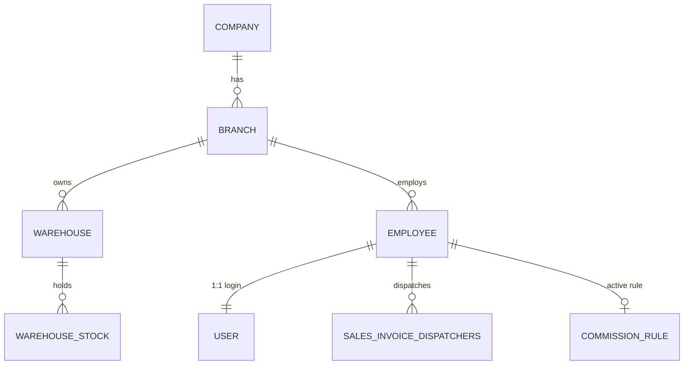
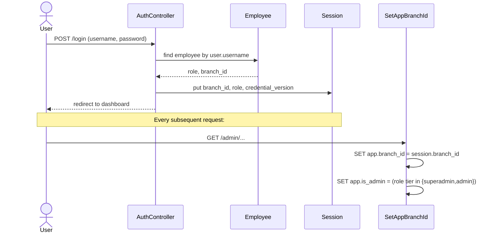
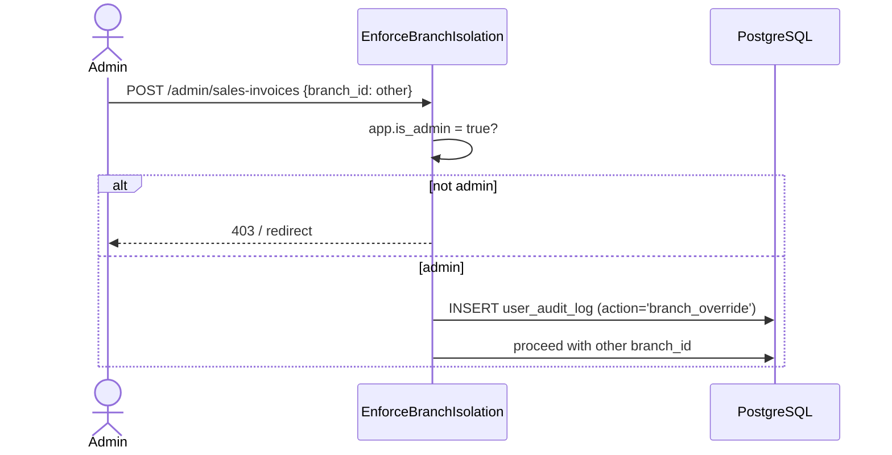

# Organizational Structure

> **Module:** Business Domain (organization)
> **Audience:** Engineers + AI assistants + business analysts
> **Status:** Draft
> **Last reviewed:** 2026-08-03
> **Source of truth:** this file, grounded in `laravel/config/roles.php`, `laravel/app/Models/{Company,Branch,Warehouse,Employee,User}.php`, `laravel/app/Models/Scopes/BranchScope.php`, `laravel/app/Http/Middleware/{SetAppBranchId,EnforceBranchIsolation}.php`, and `laravel/database/sql/01_auth_and_master.sql`.

---

## 1. What is it?

RC_ERP models the organization as a four-level hierarchy:
**Company → Branch → Warehouse → (Employee / User)**. A *company* is a legal entity (currently
one: RC Group). A *branch* is an operating location (4 today: Head Office, Patuatuli, Nowabpur,
Tarabo). A *warehouse* is a physical stockroom belonging to exactly one branch (6 today). An
*employee* is a person assigned to one branch; a *user* is a login identity attached 1:1 to an
employee. Access control is role-tier plus per-user menu permissions, and data isolation is
enforced branch-by-branch at three layers (RLS, Eloquent scope, middleware).

There are **no Department / Designation / Section / Unit tables** — those are free-text columns on
`employees`. RBAC is deliberately flat: 10 roles in 3 tiers, refined per-user by menu
permissions.

## 2. Why does it exist?

The business operates across multiple physical locations in Old Dhaka, each holding its own
inventory and running its own sales. To prevent one branch's mistakes (or fraud) from
contaminating another's books, the ERP enforces **branch isolation as a first-class invariant**:
a non-admin user can never read or write another branch's data through the normal application
path. This is the multi-tenant boundary.

The hierarchy also exists to support **intercompany accounting**: when Branch A sends stock to
Branch B, the ERP posts dual journals (Due-from-Branches on the creditor, Due-to-Branches on the
debtor) and settles them later via money transfers or bank payments. The `companies` table
(Phase 8) extends this to true multi-entity consolidation with minority interest, though the
posting engine currently treats all branches as one legal entity.

## 3. When is it used?

The org structure is consulted on **every request**:

- `SetAppBranchId` middleware sets the PostgreSQL GUC `app.branch_id` (and `app.is_admin`) at the
  start of every HTTP request, so RLS policies can filter rows.
- `BranchScope` applies `WHERE branch_id = session('branch_id')` to every Eloquent read by a
  non-admin.
- `EnforceBranchIsolation` validates that a write request's `branch_id` matches the session
  branch (or is an audited admin override).
- `CheckCredentialVersion` invalidates stale sessions when a user's password or role changes.

Master data (branches, warehouses, employees, users) is created and edited by `admin` /
`superadmin` through the `admin/branches`, `admin/warehouses`, `admin/employees`, `admin/users`
routes.

## 4. Who uses it?

| Actor | What they do with the org structure |
|---|---|
| `superadmin` | Manages companies, superadmin accounts, system policy |
| `admin` | Creates branches, warehouses, employees, users; assigns roles + menu permissions |
| `manager` | Branch operations oversight; sees own branch only |
| `accountant` | Own-branch accounting; cannot see other branches |
| `salesman` | Own-branch sales |
| `warehouse_manager` | Own-branch godown + stock movements |
| `dispatcher` | Own-branch challan execution |
| `hr` | Employee master data |
| System / automated job | Console commands bypass branch isolation (GUC not set) |

## 5. Related modules

- `business-model.md` — what the business is.
- `core-workflows.md` — how work flows across the org.
- `business-rules-catalog.md#7-branch-isolation` — the isolation rule in detail.
- `../architecture/branch-isolation-rls.md` — the 3-layer isolation mechanism.
- `../security/rbac-roles-permissions.md` (Phase 5) — full role/menu matrix.
- `../security/credential-versioning.md` (Phase 5) — session invalidation.

## 6. Business rules

- **Every warehouse belongs to exactly one branch.** `warehouses.branch_id` is `NOT NULL`.
  Cross-branch warehouse transfers are forbidden; they MUST go through Branch Demand.
- **Every employee belongs to exactly one branch.** `employees.branch_id` is `NOT NULL`.
- **The role lives on the Employee, not the User.** `User::getRole()` returns
  `employee?->role ?? 'user'`. This mirrors the legacy schema.
- **Employee ↔ User is 1:1.** `users.employee_id` is `NOT NULL UNIQUE`. A user cannot exist
  without an employee record.
- **Only 10 canonical roles exist** (see §8). The raw DDL `01_auth_and_master.sql` originally
  listed 9 (omitting `user`); migration `2025_01_12_000001_fix_employees_role_check.php`
  replaced the CHECK to include all 10.
- **A user's accessible warehouses are the warehouses of their session branch.** There is no
  separate user-warehouse-access table.
- **Non-admin users are locked to their session branch.** Branch context is chosen at login and
  stored in the session; switching requires re-authentication.
- **Admin / superadmin can override** branch scope, but every override is logged to
  `user_audit_log` with `action = 'branch_override'`.
- **Superadmin management is restricted to superadmin.** Only `superadmin` can assign the
  `superadmin` role.

## 7. Technical implementation

### 7.1 Hierarchy models

| Model | File | Key traits |
|---|---|---|
| `Company` | `laravel/app/Models/Company.php` | Phase 8. Legal entity. Fields: `company_code`, `legal_name`, `tax_id`, `currency` (default `BDT`), `is_consolidation_parent`, `ownership_pct` (default 100.00; <100 → minority interest), `status`. Helpers: `hasMinorityInterest()`. |
| `Branch` | `laravel/app/Models/Branch.php` | `SoftDeletes` + `AuditableMasterData`. Fields: `branch_code` (unique, e.g. `HO`), `branch_name`, `company_id` (nullable), `is_active`. Scope: `active()`. |
| `Warehouse` | `laravel/app/Models/Warehouse.php` | `SoftDeletes` + `AuditableMasterData`. Fields: `warehouse_code`, `warehouse_name`, `branch_id` (NOT NULL), `is_active`, **`is_frozen_for_count`**. Helper: `isFrozenForCount()`. Partial index `idx_wh_is_frozen WHERE is_frozen_for_count = true`. |
| `Employee` | `laravel/app/Models/Employee.php` | `SoftDeletes` + `AuditableMasterData`. Fields: `employee_code`, `name`, **`role`** (the role lives here), `branch_id` (NOT NULL), `salary`, `joining_date`, `designation` (free-text), `department` (free-text), `father_name`, `mother_name`, `nid`, `bank_account`, `blood_group`. Scopes: `active()`, `dispatchers()`, `salesmen()`. |
| `User` | `laravel/app/Models/User.php` | `Authenticatable` + `SoftDeletes` + `AuditableMasterData`. Fields: `employee_id` (UNIQUE FK), `username` (unique), `password_hash` (NOT `password` — `getAuthPassword()` returns it), `is_active`, `last_login`, `failed_login_count`, `locked_until`, **`credential_version`**, `api_token` (SHA-256). Role helpers: `getRole()`, `getBranchId()`, `isSuperadmin()`, `isAdmin()`, `hasRole()`. |

### 7.2 Branch-isolation stack (3 layers)

Documented in full in `../architecture/branch-isolation-rls.md`. Summary:

1. **`SetAppBranchId` middleware** — sets GUC `app.branch_id`, `app.is_admin`, `app.request_*`
   per request; console bypasses.
2. **`BranchScope` global Eloquent scope** — `WHERE branch_id = session('branch_id')` for
   non-admins; admin bypasses; no-op when unauthenticated/console.
3. **`EnforceBranchIsolation` middleware** — write-validation; `inferTableFromUri()` maps 15 URI
   patterns to tables; admin override audited; two cross-branch exceptions (`branch-demands`,
   `money-transfers`) carry both `from_branch_id` and `to_branch_id`.
4. **PostgreSQL RLS** (`07_views_triggers_constraints.sql`) — 5 policies per branch-scoped table
   (SELECT/INSERT/UPDATE/DELETE/admin-bypass); `document_sequences` has special `branch_id=0`
   global-access policies.

### 7.3 Menu permissions

RBAC is role-tier **plus** per-user menu permissions. The `user_menu_permissions` table links
users → menus with `can_view` / `can_edit`, managed by `MenuService` (registered as a singleton
in `AppServiceProvider`). The `menu.permission` route middleware enforces it. The generic `user`
and `other` roles rely entirely on menu permissions for their access profile.

## 8. Important database tables

| Table | Purpose | Key columns |
|---|---|---|
| `companies` | Legal entity (Phase 8) | `company_code`, `currency`, `ownership_pct`, `is_consolidation_parent` |
| `branches` | Operating location | `branch_code` (unique), `company_id`, `is_active` |
| `warehouses` | Physical stockroom | `warehouse_code`, `branch_id` (NOT NULL), `is_frozen_for_count` |
| `employees` | Person + role | `employee_code`, `name`, `role`, `branch_id` (NOT NULL), `designation`, `department` |
| `users` | Login identity | `employee_id` (UNIQUE FK), `username`, `password_hash`, `credential_version`, `api_token` |
| `user_menu_permissions` | Per-user menu access | `user_id`, `menu`, `can_view`, `can_edit` |
| `user_audit_log` | Branch overrides + master-data CRUD | `user_id`, `action`, `branch_id`, `record_id`, `details jsonb` |

## 9. Related services

- `laravel/app/Services/MenuService.php` — singleton; menu permission resolution.
- `laravel/app/Services/Auth/CredentialVersion.php` — session invalidation via monotonic counter.
- `laravel/app/Services/MasterData/*` — master-data CRUD with audit.
- `laravel/app/Services/Compliance/SystemPolicyService.php` — compliance mode (NORMAL /
  INVESTIGATION) that further restricts visibility.

## 10. Related models

- `laravel/app/Models/{Company,Branch,Warehouse,Employee,User}.php`
- `laravel/app/Models/Scopes/BranchScope.php`
- `laravel/app/Models/UserMenuPermission.php`
- `laravel/app/Models/SystemPolicy.php`

## 11. Important workflows

### 11.1 Login + branch context selection

### 11.2 Admin cross-branch override

## 12. Known edge cases

- **Role-vs-CHECK mismatch (historical).** The raw DDL `01_auth_and_master.sql` created the
  `employees.role` CHECK with only 9 values (omitting `user`). Saving an employee with
  `role='user'` raised a CHECK violation. Migration
  `2025_01_12_000001_fix_employees_role_check.php` replaced the constraint with the canonical
  10-role list. AI assistants editing the role enum MUST keep `config/roles.php` and the DB
  CHECK in sync.
- **`document_sequences` uses `branch_id = 0`** as a sentinel for global access, because
  advisory locks need cross-branch reads. RLS has special policies for this table.
- **Console commands bypass branch isolation** — the GUC is not set, so RLS policies see no
  `app.branch_id`. Console jobs that need branch context MUST set it explicitly.
- **`designation` and `department` are free text**, not foreign keys. Do not assume referential
  integrity; reports grouping by department MUST normalize/trim values.
- **2FA / Telegram / FCM fields were removed** in Phase 0. Do not reference `totp_secret`,
  `totp_enabled`, or messaging tokens.
- **`password_hash` column name.** `User::getAuthPassword()` returns `password_hash`, not the
  Laravel-default `password`. Custom auth code MUST use the accessor, not the column directly.

## 13. Future improvements

- **Multi-entity consolidation posting** — the `companies` schema supports minority interest
  (`ownership_pct < 100`), but the consolidation engine currently posts only inter-branch
  elimination for a single legal entity.
- **Warehouse-level access control** — today a user sees all warehouses in their branch. A
  finer-grained user-warehouse-access table may be needed if a branch runs restricted godowns.
- **Department / Designation tables** — currently free text; promoting them to lookup tables
  would enable cleaner HR reporting.

---

## Appendix A — The 10 canonical roles

Source: `laravel/config/roles.php`.

| Role | Tier | Description | Assignable by |
|---|---|---|---|
| `superadmin` | superadmin | Full system control incl. company-critical actions and superadmin account management. | `superadmin` |
| `admin` | admin | User accounts, employees, permissions, normal administrative work. | `superadmin`, `admin` |
| `manager` | operational | Branch operations: sales oversight, reversals, reports, warehouse coordination. | `superadmin`, `admin` |
| `accountant` | operational | Payments, GL reconciliation, financial reports, return confirmations. | `superadmin`, `admin` |
| `salesman` | operational | Sales invoices, challans (read), customer-facing day-to-day sales. | `superadmin`, `admin` |
| `warehouse_manager` | operational | Godown/challan preparation, stock movements, return confirmations. | `superadmin`, `admin` |
| `dispatcher` | operational | Dispatch and challan execution alongside warehouse staff. | `superadmin`, `admin` |
| `hr` | operational | Employee master data and HR-related modules. | `superadmin`, `admin` |
| `user` | operational | Generic operational login; access controlled entirely by menu permissions. | `superadmin`, `admin` |
| `other` | operational | Catch-all operational role for custom access profiles. | `superadmin`, `admin` |

## Appendix B — The 4 branches

Source: `laravel/app/Models/Branch.php` comment.

| Branch | Code | Notes |
|---|---|---|
| Head Office | `HO` | Primary branch |
| Patuatuli | — | Operating location |
| Nowabpur | — | Operating location |
| Tarabo | — | Operating location |
