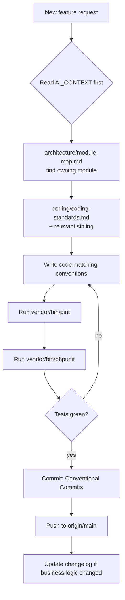

# Coding Standards

> **Module:** Coding Standards (overview)
> **Audience:** Engineers + AI assistants
> **Status:** Draft
> **Last reviewed:** 2026-08-03
> **Source of truth:** This file, grounded in `laravel/composer.json`, `laravel/bootstrap/app.php`, `laravel/app/Providers/AppServiceProvider.php`, `laravel/phpunit.xml`, `laravel/routes/{web,api}.php`, `laravel/app/`, and `docs/SESSION_CONTEXT.md`.

## 1. What is it?

This file codifies the engineering conventions that govern how PHP code is written, organized, named, formatted, and tooled across the RC_ERP_v2 Laravel application. It is the **canonical reference** for any engineer or AI assistant adding, modifying, or reviewing code so that the result matches the existing codebase.

This is the overview file. Domain-specific conventions live in the sibling files:
`service-layer-conventions.md`, `model-conventions.md`, `request-validation.md`,
`testing-standards.md`, `config-driven-rules.md`, `error-handling.md`.

## 2. Why does it exist?

- **Consistency across 78 services, 96 models, 81 controllers, 41 FormRequests.** Without a written standard, drift creeps in (and already has — see §13). A new contributor must produce code that looks like the surrounding code.
- **AI-assisted development safety.** AI assistants that generate code without a standard will invent patterns (repositories, DTOs, enums, event sourcing) that the codebase deliberately does **not** use. This file tells the AI what to reuse and what to avoid.
- **Four non-negotiable principles** (see `../PROJECT_OVERVIEW.md`): DB conversion done, app conversion done, **keep the existing UI**, and **re-derive business logic — never copy-paste**. Coding standards enforce the first two by keeping the codebase homogeneous.

## 3. When is it used?

- Before writing any new class, method, migration, or test.
- During code review (human or AI) as the checklist of expected patterns.
- When refactoring: this file defines the target state toward which deviations are pulled.

## 4. Who uses it?

- **Engineers** adding features or fixing bugs in `laravel/app/`.
- **AI assistants** generating code suggestions — MUST consult this file first.
- **Reviewers** judging whether a contribution is mergeable.

## 5. Related modules

- `../architecture/layered-design.md` — the layered architecture these standards serve.
- `../architecture/module-map.md` — where each module lives.
- Sibling files in this folder (service-layer, model, request-validation, testing, config-driven-rules, error-handling).

## 6. Business rules (non-negotiable)

### 6.1 Technology stack — the actual, pinned versions

| Concern | Pinned version | Source |
|---|---|---|
| PHP | `^8.2` | `laravel/composer.json:8` |
| Laravel | `^12.0` | `laravel/composer.json:9` |
| Sanctum | `^4.0` | `laravel/composer.json:10` |
| Predis | `^2.0` | `laravel/composer.json:12` |
| PHPUnit | `^11.5` | `laravel/composer.json:23` |
| Laravel Pint | `^1.18` (dev) | `laravel/composer.json:21` |
| Larastan | `^3.0` (dev) | `laravel/composer.json:18` |
| Collision | `^8.6` (dev) | `laravel/composer.json:22` |
| Database | PostgreSQL 16 | `laravel/config/database.php` |
| Cache/Session | Redis (Predis) | `laravel/config/database.php` |

> **MUST NOT** document this project as "Laravel 11". `composer.json` pins `^12.0`. The "Laravel 11" strings in `laravel/bootstrap/app.php:8` and `laravel/README.md:3` are **stale comments** flagged for cleanup (see §13).

### 6.2 PHP language rules

- **MUST** target PHP 8.2+. Use promoted constructor properties (`private X $x` in the parameter list), typed returns, typed properties, `readonly` where a property is set once in the constructor.
- **MUST** declare `declare(strict_types=1);` at the top of every class file (Laravel default; Pint enforces).
- **MUST NOT** use PHP 8.1 backed enums. The codebase has **zero** `app/Enums/` directory. Status and type fields are `VARCHAR(50) + CHECK constraint` at the DB level and plain string constants on models (e.g. `StockTransaction::REFERENCE_TYPES`). Rationale: adding a status value requires only a migration `ALTER ... CHECK` and a constant edit — no enum type migration. See `../database/triggers-views-constraints.md`.
- **MUST** prefer constructor promotion over manual `$this->x = $x` assignment.
- **MUST NOT** use `app()` / `app()->make()` inside services or controllers to resolve collaborators. Use constructor DI. (The only exceptions are inside `app/Rules/` objects, which cannot use constructor DI for readonly-property reasons, and inside traits — see §13 item 10.)

### 6.3 Naming

| Artifact | Convention | Example |
|---|---|---|
| Class (model) | StudlyCase singular | `SalesInvoice`, `JournalEntry` |
| Class (service) | StudlyCase + `Service` suffix | `JournalPostingService`, `StockTakeService` |
| Class (controller) | StudlyCase + `Controller` suffix | `SalesInvoiceController` |
| Class (FormRequest) | `Store\|Update\|Save\|Finalize<Entity>Request` | `StoreManualJournalRequest` |
| Class (policy) | `<Entity>Policy` | `SalesInvoicePolicy` |
| Class (rule) | Descriptive StudlyCase | `WarehouseBelongsToBranch` |
| Method (service) | verb+noun | `createJournalEntry`, `reverseJournalEntry` |
| Method (model relationship) | plural for many, singular for one | `items()`, `customer()` |
| Method (scope) | `scope<Name>` | `scopeActive`, `scopeNotReversed` |
| Method (boolean check) | `is<State>` / `has<Thing>` | `isDraft()`, `isReversed()` |
| Table | snake_case plural | `sales_invoices`, `journal_entries` |
| Column (FK) | `<singular_entity>_id` | `customer_id`, `journal_entry_id` |
| Column (two-branch) | `from_branch_id` + `to_branch_id` | `money_transfers`, `warehouse_transfers` |
| Column (actor) | `<verb>_by` | `created_by`, `approved_by`, `reversed_by` |
| Route name | `admin.<kebab-resource>.<camelAction>` | `admin.products.priceHistory`, `admin.sales-invoices.call-it-a-day` |
| Migration | `YYYY_MM_DD_HHMMSS_<verb>_<desc>.php` | `2025_01_08_000001_add_transport_cost_to_sales_invoices.php` |
| Index | `idx_<table>_<cols>` / `uk_<table>_<cols>` (unique) | `idx_sales_invoices_branch_id_status` |

> **Table-name exceptions** (singular, not plural): `warehouse_stock` (composite PK), `customer_ledger`, `supplier_ledger`, `employee_ledger` (sub-ledgers). These are deliberate; do not "fix" them.

### 6.4 Formatting

- **MUST** run `vendor/bin/pint` before committing. Pint uses **preset: laravel** (PSR-12 + Laravel conventions).
- There is **no `pint.json`, `.php-cs-fixer.php`, `.editorconfig`, or `phpstan.neon`** committed today. The codebase relies on Pint defaults and runs **no static analysis in CI**. See §13 item 4 (tech debt).
- Indentation: 4 spaces. Lines: no hard limit enforced, but Pint's laravel preset soft-wraps long arrays.
- Braces: Allman for classes/methods, K&R for control structures (Laravel/Pint default).
- Strings: single quotes unless interpolation is needed.

### 6.5 File layout

- One class per file. Filename = class name + `.php`.
- Namespace MUST match directory: `app/Services/Accounting/` → `App\Services\Accounting`.
- Class file structure (top to bottom):
  1. `<?php` opening tag (no closing `?>`).
  2. `namespace` declaration.
  3. `use` imports (alphabetized by Pint).
  4. Class docblock (optional, one line describing the class purpose).
  5. `class` / `final class` declaration.
  6. Constants (`public const`).
  7. Properties (`protected`/`private`, typed).
  8. Constructor (promoted properties).
  9. Public methods (ordered by usage: lifecycle → public API → helpers).
  10. Private/protected methods last.

### 6.6 Git workflow

- **MUST** commit with a descriptive message following the existing style:
  `fix(accounting): guard period-close override against non-admin users` (Conventional Commits).
- **MUST** push to `origin/main` after commit (per `docs/SESSION_CONTEXT.md` §4 rule 1).
- **Pre-commit hook** (`laravel/git-hooks/pre-commit`) rebuilds CSS only — it does **not** run Pint or tests. Devs run `vendor/bin/pint` and `vendor/bin/phpunit` manually.
- **CSS guard CI** (`.github/workflows/css-guard.yml`) is the only CI gate today; there is no PHP test CI.

## 7. Technical implementation

### 7.1 Application bootstrap (Laravel 11+ style)

The application is bootstrapped in `laravel/bootstrap/app.php` using the Laravel 11+ fluent `Application::configure()` API — **not** the legacy `app/Exceptions/Handler.php` (which does not exist). Key bindings:

```php
return Application::configure(basePath: dirname(__DIR__))
    ->withRouting(web: __DIR__.'/../routes/web.php',
                  api:  __DIR__.'/../routes/api.php',
                  commands: __DIR__.'/../routes/console.php',
                  health: '/up')
    ->withMiddleware(function (Middleware $middleware): void {
        $middleware->prepend(\App\Http\Middleware\SyncLegacySession::class);
        $middleware->append(\App\Http\Middleware\SetAppBranchId::class);
        $middleware->append(\App\Http\Middleware\CheckCredentialVersion::class);
        $middleware->append(\App\Http\Middleware\CheckSystemPolicy::class);
        $middleware->alias([
            'role'              => \App\Http\Middleware\EnsureRole::class,
            'legacy.session'    => \App\Http\Middleware\SyncLegacySession::class,
            'branch.isolation'  => \App\Http\Middleware\EnforceBranchIsolation::class,
            'api.auth'          => \App\Http\Middleware\ApiAuth::class,
            'api.rate'          => \App\Http\Middleware\ApiRateLimit::class,
            'set.api.branch'    => \App\Http\Middleware\SetApiBranchContext::class,
            'menu.permission'   => \App\Http\Middleware\EnsureMenuPermission::class,
        ]);
    })
    ->withExceptions(function (Exceptions $exceptions): void { /* see error-handling.md */ })
    ->create();
```
(`laravel/bootstrap/app.php:12-80`)

> **MUST** add new middleware via `->alias([...])` here, not via legacy `Kernel.php` (which does not exist). RBAC enforcement is via the `role:` alias. See `../security/branch-context-security.md` (Phase 5, pending) for the full middleware chain.

### 7.2 Service provider bindings

`laravel/app/Providers/AppServiceProvider.php` registers:
- **7 singletons** (stateful or expensive services): `LegacySessionBridge`, `LedgerNatureService`, `SubLedgerService`, `JournalReversalService`, `SalesAuditLogger`, `MenuService`, `SystemPolicyService`, the `ArchiveRepositoryInterface → LegacyMySQLRepository` binding, and `ArchiveService`.
- **8 explicit `Gate::policy()` registrations** (SalesInvoice, CustomerPayment, SupplierTransaction, EmployeeTransaction, ManualJournal, StockAdjustment, DamageInvoice). Explicit (not auto-discovered) by deliberate choice — see comment at `AppServiceProvider.php:66-72`.

> **MUST** register a new singleton in `AppServiceProvider::register()` if the service is stateful (e.g. holds a cached ledger-nature map) or if it binds an interface. Stateless services are auto-resolved by the container and need no registration.

### 7.3 Folders under `app/`

| Folder | Purpose | Count |
|---|---|---|
| `app/Http/Controllers/Admin/` | Web (Blade) controllers, one per module | 57 |
| `app/Http/Controllers/Api/V1/` | REST API v1 controllers | 15 |
| `app/Http/Controllers/` (root + Auth) | Auth, dashboard, SSE, UI preview | 9 |
| `app/Services/` | Business logic (14 namespaces) | 78 |
| `app/Models/` | Eloquent models (+ `Accounting/`, `Scopes/`) | ~96 |
| `app/Models/Scopes/` | Global scope classes (Branch + 2 transfer variants) | 3 |
| `app/Http/Requests/` | FormRequest classes | 41 |
| `app/Policies/` | Authorization policy classes | 8 |
| `app/Rules/` | Custom validation rules (`ValidationRule` interface) | 3 |
| `app/Traits/` | `AuditableMasterData` (used by 37 models) + `ApplySystemPolicyScope` (dead code) | 2 |
| `app/Middleware/` | HTTP middleware | ~12 |
| `app/Console/Commands/` | Artisan commands (verify, migrate, cron, db util) | 28 |
| `app/Support/` | Pure helpers (`BranchColor`, `Accents`, `StatusPalette`) | 3 |
| `app/Archive/` | Anti-corruption layer (Phase 12) — Services/Repositories/DTOs | ~6 |
| `app/Session/` | `LegacySessionBridge` (Redis DB 1 → session) | 1 |
| `app/Events/` | `SystemPolicyChanged` only | 1 |
| `app/Notifications/` | `ERPNotification` only | 1 |
| `app/Jobs/`, `app/Listeners/`, `app/Mail/` | **Empty** — no queued jobs, no listeners, no mailables | 0 |

> **MUST NOT** introduce queued jobs without explicit approval. `QUEUE_DRIVER=sync` in production; the codebase is synchronous by design. Realtime fan-out uses Listen/Notify + SSE (see `../architecture/realtime-events.md`).

## 8. Important database tables

N/A — see `../database/schema-overview.md`.

## 9. Related services

N/A — service conventions are codified in `service-layer-conventions.md`.

## 10. Related models

N/A — model conventions are codified in `model-conventions.md`.

## 11. Important workflows



### Decision: where does new code go?

| You are adding… | It goes in… | Read first |
|---|---|---|
| A business operation (post journal, move stock, finalize invoice) | `app/Services/<Domain>/<Entity>Service.php` | `service-layer-conventions.md` |
| A new entity / table | `app/Models/<Entity>.php` + migration | `model-conventions.md`, `../database/migrations-conventions.md` |
| Input validation | `app/Http/Requests/<Domain>/Store<Entity>Request.php` | `request-validation.md` |
| Authorization rule | `app/Policies/<Entity>Policy.php` + `Gate::policy()` in `AppServiceProvider` | `../security/rbac-roles-permissions.md` (Phase 5) |
| A tunable threshold / role matrix | `config/<module>.php` | `config-driven-rules.md` |
| A new HTTP route | `routes/web.php` (web) or `routes/api.php` (API) | `../architecture/module-map.md` |
| A verification / cron command | `app/Console/Commands/` | `../database/schema-overview.md` (verification commands listed) |
| A test | `tests/Feature/` or `tests/Unit/` | `testing-standards.md` |

## 12. Known edge cases

- **Mixed conventions in the wild.** Several modules predate the standards (e.g. SalesInvoice, StockTake use inline `$request->validate()` instead of FormRequests). The standard defines the **target**; do not propagate the old style when extending these modules — extract a FormRequest.
- **`HasFactory` is on only 5 of 96 models.** Tests for the other 91 use `DB::table()->insertGetId()` helpers (`tests/Helpers/InsertsXDependencies`). See `testing-standards.md` §6.
- **`app/Jobs/` is empty.** If you believe a job is warranted, raise it with a human — the synchronous design is deliberate (accounting integrity requires immediate DB writes, not async jobs that can fail silently).

## 13. Future improvements (tech debt)

Flagged inconsistencies to address over time. Each is grounded in the Phase 4 research digest:

1. **Stale "Laravel 11" comments.** `laravel/bootstrap/app.php:8` and `laravel/README.md:3` say Laravel 11; `composer.json:9` pins `^12.0`. Fix the comments.
2. **Missing tooling config.** Despite `laravel/pint` and `larastan/larastan` being installed, **none** of `pint.json`, `.php-cs-fixer.php`, `phpstan.neon`, `.editorconfig` exist. Recommend adding `pint.json` (preset laravel + `array_syntax` short) and `phpstan.neon` (level 6 baseline) as a hardening step.
3. **No CI for PHP.** `.github/workflows/` only has `css-guard.yml`. Add a `php-test.yml` workflow running `vendor/bin/phpunit` and `vendor/bin/pint --test`.
4. **No composer scripts.** `composer.json:36-52` has no `test`/`lint`/`cs-fix`/`stan` scripts. Add:
   ```json
   "scripts": {
     "test": "vendor/bin/phpunit",
     "lint": "vendor/bin/pint --test",
     "cs-fix": "vendor/bin/pint",
     "stan": "vendor/bin/phpstan analyse"
   }
   ```
5. **`gl_reconciliation_tolerance` duplicated.** Defined in both `config/accounting.php:40` (canonical) and `config/app.php:50` (stale). Two readers (`RunningBalanceReconcile.php:49`, `ReconciliationService.php:41`) read from the wrong key. Fix the readers and delete the `app.php` duplicate.
6. **`ApplySystemPolicyScope` trait is dead code.** Defined at `app/Traits/ApplySystemPolicyScope.php` but used by **zero** models. Either remove it or wire it into date-based models for INVESTIGATION-mode date clamping.
7. **`rules()` form is inconsistent.** Older FormRequests use pipe-string (`'required|integer|exists:branches,id'`); newer use array (`['required', 'integer', 'exists:branches,id']`). Standardize on **array form** (multi-line, diff-friendly). See `request-validation.md`.
8. **FormRequest adoption is partial.** `SalesInvoiceController::finalize` uses inline `validate()` despite `FinalizeInvoiceRequest` existing for the API tier with identical rules. Migrate web controllers to share the FormRequest.
9. **`auth()->id()` / `session('branch_id')` read inside services.** `BudgetService`, `ApprovalService`, `UserAuditLogger`, `SupplierTransactionService`, `MoneyTransferService`, `SalesAccess` read these directly. Canonical pattern: **pass auth context as a parameter** (`'created_by' => auth()->id()`), do not read the `Auth`/`session` facade inside a service. See `service-layer-conventions.md` §6.7.
10. **`DatabaseSeeder` only seeds notification rules.** Master data is seeded via migration files (chart-of-accounts, menus, legacy data). Document this as intentional, not a gap.

## 14. Verification commands

```bash
# Format check (does not write)
cd laravel && vendor/bin/pint --test

# Run the full test suite (107 files, ~1185 tests)
cd laravel && vendor/bin/phpunit

# Run a single test file
cd laravel && vendor/bin/phpunit tests/Feature/StockTake/CreateSessionTest.php

# List all Artisan commands (verification + cron + db util)
cd laravel && php artisan list
```

The test DB (`rcerp_test`) MUST already exist with the full RC_ERP schema applied. See `../database/migrations-conventions.md` for setup. Tests use `DatabaseTransactions` (not `RefreshDatabase`) — see `testing-standards.md` §3 for why.
