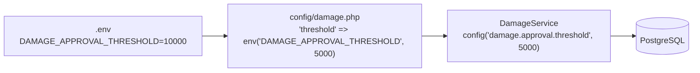
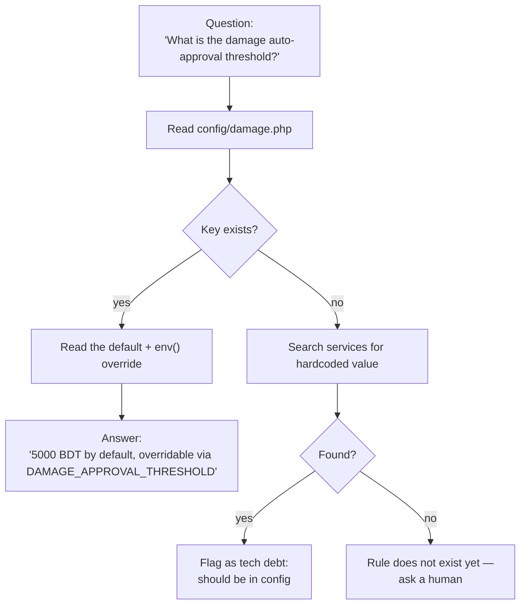

# Config-Driven Rules

> **Module:** Coding Standards (config externalization)
> **Audience:** Engineers + AI assistants
> **Status:** Draft
> **Last reviewed:** 2026-08-03
> **Source of truth:** This file, grounded in `laravel/config/*.php` (21 config files) and the services/commands that consume them.

## 1. What is it?

The pattern by which **every tunable business rule, role definition, threshold, tolerance, and role-permission matrix** lives in a `config/*.php` file (with `env()` override) rather than hardcoded in a service. Services read rules via `config('module.key', $default)`. This makes the ERP tunable per-deployment without code changes, and gives AI assistants a single place to discover what a rule actually is.

## 2. Why does it exist?

- **Deployment variance.** Different deployments (production vs. staging vs. a client pilot) need different thresholds (damage auto-approval limit, stale-draft cleanup window, API rate limits). Hardcoding these in services would require code edits + redeploy per change.
- **Auditability.** When an accountant asks "what is the GL reconciliation tolerance?", the answer is `config/accounting.php:40` — one file, version-controlled, with a default and an env override. Not "grep the codebase for `0.02`".
- **Role-matrix single source of truth.** The role matrix for each module (who can create / approve / confirm / cancel) lives in `config/<module>.php` and is mirrored by route `role:` middleware + Policy classes. Three layers read the same config — no drift.
- **AI safety.** An AI assistant that needs to know "can a warehouse_manager approve a damage claim?" reads `config/damage.php` instead of guessing from code.

## 3. When is it used?

- **Reading a rule at runtime**: services call `config('module.key', default)`.
- **Adding a new tunable**: add a key to the relevant `config/<module>.php` with an `env()` override, then read it from the service.
- **Tuning for a deployment**: set the env var in `.env` (e.g. `DAMAGE_APPROVAL_THRESHOLD=10000`).
- **Discovering what a rule is**: read the config file directly (it is the source of truth).

## 4. Who uses it?

- **Services** — read thresholds, tolerances, role matrices.
- **Middleware** — `EnsureRole` reads `config('roles')` to validate the `role:` parameter.
- **Policy classes** — `DamagePolicy` reads `config('damage.roles')` to mirror the route middleware.
- **Artisan commands** — `SubLedgerReconcile` reads `config('accounting.gl_reconciliation_tolerance')`.
- **Controllers** — pass config values to views (e.g. `EmployeeController` passes `config('roles')` to the role dropdown).

## 5. Related modules

- `coding-standards.md` — config files are listed in the folder inventory.
- `service-layer-conventions.md` — services read config, never hardcode.
- `../business/business-rules-catalog.md` — the cross-cutting business rules catalog cross-references config keys.
- `../security/rbac-roles-permissions.md` (Phase 5) — `config/roles.php` is the role-definition source of truth.

## 6. Business rules (non-negotiable)

### 6.1 Inventory — 21 config files

`laravel/config/` contains: `accounting.php`, `api.php`, `app.php`, `archive.php`, `auth.php`, `branch_demand_shadow.php`, `branches.php`, `cache.php`, `damage.php`, `database.php`, `filesystems.php`, `hashing.php`, `logging.php`, `mail.php`, `queue.php`, `roles.php`, `sales.php`, `services.php`, `session.php`, `shadow_mode.php`, `stock_adjustment.php`.

### 6.2 The pattern — every rule has three layers



1. **`.env`** — deployment-specific override (optional; falls back to the default).
2. **`config/<module>.php`** — the canonical key + default + `env()` binding.
3. **Service / middleware / policy** — reads via `config('module.key', $fallback)`.

> **MUST** always pass a second-argument fallback to `config()` so the service works even if the config file is missing (defensive).

### 6.3 Rule: business rules live in config, not hardcoded

- **MUST** externalize every tunable threshold, tolerance, window, and role matrix to a `config/<module>.php` file.
- **MUST NOT** hardcode a magic number in a service if it represents a business rule. Use `config('module.key', default)` instead.
- **MUST** provide an `env()` override so deployments can tune without code edits.
- **MUST** document the key's purpose in a comment in the config file.

### 6.4 Canonical exemplars (three concrete patterns)

#### Exemplar 1 — `config('accounting.gl_reconciliation_tolerance')`

`laravel/config/accounting.php:38-42`:
```php
// Tolerance (in BDT) when reconciling GL debits vs credits.
// Two entries that differ by less than this are considered balanced
// (rounding from decimal:2 arithmetic).
'gl_reconciliation_tolerance' => (float) env('GL_RECONCILIATION_TOLERANCE', 0.02),
```

Consumed in `laravel/app/Console/Commands/SubLedgerReconcile.php:133, 183, 227`:
```php
$tolerance = (float) config('accounting.gl_reconciliation_tolerance', 0.02);
```

> **INCONSISTENCY — flagged for cleanup**: the same key is duplicated in `config/app.php:50`. Two readers (`RunningBalanceReconcile.php:49`, `ReconciliationService.php:41`) read from the wrong key `config('app.gl_reconciliation_tolerance')`. Canonical = `config/accounting.php`. See `coding-standards.md` §13 item 5.

#### Exemplar 2 — `config('damage.approval.threshold')` + role matrix

`laravel/config/damage.php:126-137`:
```php
'approval' => [
    'threshold'          => (float) env('DAMAGE_APPROVAL_THRESHOLD', 5000),
    'auto_approve_roles' => ['admin', 'manager'],
],
'roles' => [
    'create'  => ['admin', 'manager', 'warehouse_manager'],
    'submit'  => ['admin', 'manager', 'warehouse_manager'],
    'approve' => ['admin', 'manager'],
    'confirm' => ['admin', 'manager'],
    'cancel'  => ['admin', 'manager'],
],
```

Consumed by:
- `DamagePolicy` (defense-in-depth policy).
- `DamageService` (applies the auto-approval threshold).
- `DamageController.php:403` — comment: "config('damage.approval.threshold'), the damage transitions straight to approved".

Business logic: a damage claim ≤ 5000 BDT submitted by an admin/manager is auto-approved inline at submit. A claim > 5000 BDT waits for a second admin/manager approval (segregation of duties — the submitter cannot be the approver).

The `roles` matrix is the **single source of truth** mirrored by:
1. Route middleware `role:admin,manager,warehouse_manager` on the damage routes.
2. `DamagePolicy::create() / submit() / approve() / confirm() / cancel()` returning true for the same role sets.
3. `config('damage.roles')` itself.

> **MUST** keep all three in sync. The Policy docblock at `DamagePolicy.php:13-18` documents this mirroring.

#### Exemplar 3 — `config('stock_adjustment.*')` — full maker-checker config

`laravel/config/stock_adjustment.php:38-60` (11 knobs):
```php
'require_approval'                     => env('STOCK_ADJ_REQUIRE_APPROVAL', true),
'auto_approve_below_value'             => env('STOCK_ADJ_AUTO_APPROVE_VALUE', 1000),
'max_value_without_secondary_approval' => env('STOCK_ADJ_FORCE_APPROVE_VALUE', 50000),
'approver_roles'                       => ['admin', 'manager'],
'submitter_roles'                      => ['admin', 'accountant'],
'confirmer_roles'                      => ['admin', 'accountant'],
'force_confirmer_roles'                => ['admin'],
'block_closed_period'                  => env('STOCK_ADJ_BLOCK_CLOSED_PERIOD', true),
'stale_draft_days'                     => env('STOCK_ADJ_STALE_DRAFT_DAYS', 7),
'reconcile_tolerance'                  => env('STOCK_ADJ_RECONCILE_TOLERANCE', 0.0001),
'reconcile_drift_alert'                => env('STOCK_ADJ_RECONCILE_DRIFT_ALERT', true),
'reconcile_alert_roles'                => ['admin', 'superadmin'],
```

Comment at `stock_adjustment.php:5-17`: "Single source of truth for the maker-checker knobs. Read by `App\Services\Stock\StockAdjustmentPolicyService`. Every value is overridable via env() so deployments can tune the gate without editing code."

Consumed by `StockAdjustmentPolicyService` (applies the maker-checker state machine) and `StockAdjustmentAuditService.php:94`:
```php
$staleDays = (int) config('stock_adjustment.stale_draft_days', 7);
```

### 6.5 `config/roles.php` — 10 canonical roles, 3 tiers

`laravel/config/roles.php:7-68` returns an array keyed by role name. Each entry has `label`, `tier` (`superadmin` / `admin` / `operational`), `description`, `assignable_by`:

```php
'superadmin' => [
    'label'         => 'Super Admin',
    'tier'          => 'superadmin',
    'description'   => 'Full system access, including system policy and credential management.',
    'assignable_by' => ['superadmin'],
],
'admin' => [
    'label'         => 'Admin',
    'tier'          => 'admin',
    'description'   => 'Branch-agnostic operational admin. Bypasses BranchScope.',
    'assignable_by' => ['superadmin'],
],
'manager' => [
    'label'         => 'Manager',
    'tier'          => 'operational',
    'description'   => 'Branch-level manager. Approves transactions, manages staff.',
    'assignable_by' => ['superadmin', 'admin'],
],
'accountant'  => [...],
'salesman'    => [...],
'warehouse_manager' => [...],
'dispatcher'  => [...],
'hr'          => [...],
'user'        => [...],
'other'       => [...],
```

Consumed by:
- `laravel/app/Http/Middleware/EnsureRole.php:71` — `$allRoles = config('roles', []);` validates the `role:admin,manager` middleware parameter against the canonical list (rejects typos like `role:admin,manger`).
- `laravel/app/Http/Controllers/Admin/EmployeeController.php:82` — `'roles' => config('roles')` passes the full role map to the create/edit view for the role dropdown.
- `laravel/app/Console/Commands/GenerateApiToken.php:75` — `$validRoles = array_keys(config('roles', []));` validates the `--role` option.

> See `../business/organizational-structure.md` for the full role hierarchy and `../security/rbac-roles-permissions.md` (Phase 5) for the role-permission matrix.

### 6.6 `config/accounting.php` — period close + reconciliation

`laravel/config/accounting.php:13-42` (key sections):

| Key | Default | Env override | Consumed by |
|---|---|---|---|
| `period_close_admin_override` | `false` | `PERIOD_CLOSE_ADMIN_OVERRIDE` | `JournalPostingService.php:313, 341` — when true AND user is admin/superadmin, posting to a closed period is allowed (logged to `user_audit_log`). |
| `gl_reconciliation_tolerance` | `0.02` (BDT) | `GL_RECONCILIATION_TOLERANCE` | `SubLedgerReconcile`, `JournalPostingService::verifyAllEntriesBalanced` |

Business rule: by default, NO user can post to a closed accounting period. The override is a deployment-level escape hatch for month-end-correction scenarios, and every use is audit-logged.

### 6.7 `config/sales.php` — stale draft cleanup

`laravel/config/sales.php:13-60` (4 knobs):

| Key | Default | Env override | Consumed by |
|---|---|---|---|
| `stale_draft_days` | `14` | `SALES_STALE_DRAFT_DAYS` | `SalesInvoiceController.php:124`, `CancelStaleSalesDrafts` command |
| `stale_draft_auto_cancel` | `true` | `SALES_STALE_DRAFT_AUTO_CANCEL` | `CancelStaleSalesDrafts` command |
| `stale_draft_cancelled_by` | `1` (system admin user) | `SALES_STALE_DRAFT_CANCELLED_BY` | `CancelStaleSalesDrafts` command |
| `stale_draft_max_per_run` | `200` | `SALES_STALE_DRAFT_MAX_PER_RUN` | `CancelStaleSalesDrafts` command |

The `CancelStaleSalesDrafts` command runs nightly at 02:00 (per `routes/console.php` schedule) and cancels sales invoice drafts older than `stale_draft_days`. This prevents cart/invoice drafts from accumulating forever.

### 6.8 `config/damage.php` — full module rules

Three sections:

1. **Photo/evidence requirements** — `require_photo_for_types = ['real_damage', 'theft', 'quality_reject']`.
2. **Attachment limits** — max 10 attachments, 5MB each, local disk, `damage-evidence/` folder.
3. **Accountability** — `require_accountable_for_types = ['missing']`, `require_witness_for_types = ['theft']`, `recovery_transaction_type = 'deduction'`.
4. **Approval workflow** — threshold + auto_approve_roles (see §6.4 Exemplar 2).
5. **Role matrix** — create / submit / approve / confirm / cancel (see §6.4 Exemplar 2).

### 6.9 `config/branches.php` — 4 branch color palette

`laravel/config/branches.php:19-74` defines the 4 branches with metadata for UI coloring:

```php
'colors' => [
    'HO' => [
        'code' => 'HO', 'name' => 'Head Office', 'name_bn' => 'হেড অফিস',
        'color_name' => 'Red', 'color_hex' => '#dc2626',
        'bg_class' => 'bg-red-600', 'text_class' => 'text-red-600',
        'border_class' => 'border-red-600',
        'gradient_from' => 'from-red-500', 'gradient_to' => 'to-red-700',
    ],
    'PAT' => [...],  // Blue #2563eb, পাটন
    'NOW' => [...],  // Green #16a34a, নবাবগঞ্জ
    'TAR' => [...],  // Orange #ea580c, টাঙ্গাইল
],
```

Consumed by `laravel/app/Support/BranchColor.php:25`:
```php
return config("branches.colors.{$code}", config('branches.colors.' . config('branches.default', 'HO')));
```

> This is the ONLY place in the codebase where Bangla (Bengali) text appears in a config file. The `name_bn` field is used in UI labels for the 4 branches.

### 6.10 `config/api.php` — 3 rate-limit buckets

`laravel/config/api.php:32-36`:
```php
'rate_limit' => [
    'default'   => (int) env('API_RATE_LIMIT', 60),          // most /api/v1/* endpoints
    'dashboard' => (int) env('API_RATE_LIMIT_DASHBOARD', 120), // read-only dashboard
    'lookups'   => (int) env('API_RATE_LIMIT_LOOKUPS', 120),   // read-only dropdowns
],
```

Consumed by `laravel/app/Http/Middleware/ApiRateLimit.php:100`:
```php
$config = (int) config('api.rate_limit.default', 60);
```

Per-route override via middleware parameter: `->middleware('api.rate:120')`.

### 6.11 `config/shadow_mode.php` + `config/branch_demand_shadow.php` — full shadow-mode state machine

These two config files encode the entire shadow-mode comparison framework (Phase 12 / Phase 13):

- Master toggle + mode (`off` / `passive` / `active`).
- Legacy MySQL connection name.
- Cutover thresholds: `consecutive_days_zero_diff = 7`, `max_tolerance_qty = 0.0001`, `max_tolerance_rate = 0.01`, `max_tolerance_amount = 0.01`.
- Comparison scope (5 booleans: which entity types to compare).
- Alerts (roles to notify on drift).
- Schedule (cron expression for the comparison run).
- Dashboard (which stats to show).
- Retention (days to keep comparison records).

> See `../inventory/stock-verification.md` (Phase 8, pending) and `../finance/consolidation-intercompany.md` (Phase 13, pending) for the shadow-mode workflows.

### 6.12 `config/database.php` — 2 PG connections + 3 Redis DBs

`laravel/config/database.php:1-89`:
- `pgsql` (default) — `sslmode=prefer`, `search_path=public`.
- `mysql_archive` — read-only legacy MySQL. PDO options: `ERRMODE_EXCEPTION`, `FETCH_ASSOC`, `EMULATE_PREPARES=false`.
- Redis: `default` (DB 0), `legacy` (DB 1 — legacy PHP session bridge), `cache` (DB 2).

### 6.13 `config/logging.php` — 5 channels

`laravel/config/logging.php:1-34`:
- `stack` (default = `single`).
- `single` — `storage_path('logs/laravel.log')`.
- `daily` — 14-day retention.
- `stderr`.
- **`shadow`** — custom daily channel, `storage_path('logs/shadow_mode.log')`, 30-day retention. Used exclusively for shadow-mode diff logging.

### 6.14 `config/app.php` — timezone + locale

`laravel/config/app.php:7-10`:
```php
'timezone' => env('APP_TIMEZONE', 'Asia/Dhaka'),
'locale' => env('APP_LOCALE', 'en'),
'fallback_locale' => env('APP_FALLBACK_LOCALE', 'en'),
'faker_locale' => env('APP_FAKER_LOCALE', 'en_US'),
```

Plus `legacy_url` (for the "Back to Legacy App" link in the UI).

> The duplicate `gl_reconciliation_tolerance` key in `config/app.php:50` is stale — see §6.4 Exemplar 1 inconsistency.

## 7. Technical implementation

### 7.1 Adding a new tunable — the full checklist

1. **Identify the module**: which `config/<module>.php` does this belong to? If none exists, create one (e.g. `config/commission.php` for a future commission-tuning need).
2. **Add the key** with an `env()` override and a sensible default:
   ```php
   'auto_approve_below_value' => env('COMMISSION_AUTO_APPROVE_VALUE', 5000),
   ```
3. **Document the key** in a comment above it (what it means, what unit, what happens at the threshold).
4. **Read it in the service** with a fallback:
   ```php
   $threshold = (float) config('commission.auto_approve_below_value', 5000);
   ```
5. **Add an env var** to `.env.example` (so deployments know it exists).
6. **Mirror the role matrix** (if the key is a role matrix) in the route middleware AND the Policy class.
7. **Test it**: write a test that sets the env var via `Config::set('commission.auto_approve_below_value', 9999)` and asserts the service behaves accordingly.

### 7.2 Reading config inside a service (canonical)

```php
public function approveDamage(int $damageId, int $approverId): void
{
    $threshold = (float) config('damage.approval.threshold', 5000);
    $autoApproveRoles = config('damage.approval.auto_approve_roles', ['admin', 'manager']);

    $damage = DamageInvoice::findOrFail($damageId);
    $approver = User::findOrFail($approverId);

    if ($damage->total_value <= $threshold && in_array($approver->getRole(), $autoApproveRoles, true)) {
        $damage->markApproved($approverId);
        return;
    }
    // ... else require secondary approval ...
}
```

### 7.3 Caching

Laravel caches config in production via `php artisan config:cache`. The cached config is a single PHP file in `bootstrap/cache/config.php`. Services read from this cache transparently — no code change needed.

> **MUST NOT** call `env()` inside services, controllers, or models. `env()` only works inside config files (when `config:cache` is NOT run) and inside config files (always, because config files are loaded before caching). Once `config:cache` runs, `env()` returns `null` everywhere except config files. Always wrap `env()` in a config file and read via `config()`.

## 8. Important database tables

N/A — config files are PHP, not DB. The role matrix in `config/roles.php` is NOT stored in the DB; it is the source of truth. (The `employees.role` column stores the role NAME as a VARCHAR, validated against `config('roles')` keys at assignment time.)

## 9. Related services

| Service | Config keys it reads |
|---|---|
| `JournalPostingService` | `accounting.period_close_admin_override`, `accounting.gl_reconciliation_tolerance` |
| `StockAdjustmentPolicyService` | `stock_adjustment.*` (11 keys) |
| `StockAdjustmentAuditService` | `stock_adjustment.stale_draft_days` |
| `DamageService` + `DamagePolicy` | `damage.approval.*`, `damage.roles.*` |
| `CancelStaleSalesDrafts` (command) | `sales.stale_draft_*` |
| `SubLedgerReconcile` (command) | `accounting.gl_reconciliation_tolerance` |
| `EnsureRole` (middleware) | `roles` (full map) |
| `ApiRateLimit` (middleware) | `api.rate_limit.*` |
| `BranchColor` (support) | `branches.colors.*`, `branches.default` |
| `EmployeeController` | `roles` (for dropdown) |

## 10. Related models

N/A — config is not bound to models. The `Employee.role` column stores a role name that MUST be a key in `config('roles')`.

## 11. Important workflows

### 11.1 Discover what a business rule actually is



### 11.2 Tune a rule for a deployment

1. Edit `.env` (or `.env.production`): `DAMAGE_APPROVAL_THRESHOLD=10000`.
2. If `config:cache` is in use: `php artisan config:cache`.
3. Restart the web worker / queue worker (so the new env is loaded).
4. Verify: `php artisan tinker` → `config('damage.approval.threshold')` should return `10000.0`.

## 12. Known edge cases

- **`config:cache` + `env()` outside config files.** If someone writes `env('SOME_KEY')` inside a service and `config:cache` is run, the call returns `null`. Always go through a config file. See §7.3.
- **Role matrix drift.** The damage role matrix exists in THREE places: `config/damage.php`, the route `role:` middleware, and `DamagePolicy`. If you edit one, you MUST edit all three. The Policy docblock reminds reviewers of this.
- **`gl_reconciliation_tolerance` duplication.** Defined in both `config/accounting.php:40` (canonical) and `config/app.php:50` (stale). Two readers use the wrong key. See §6.4 Exemplar 1.
- **`config/branches.php` is a closed list.** The 4 branches (HO, PAT, NOW, TAR) are hardcoded in config. Adding a 5th branch requires editing this config file AND inserting a row in the `branches` table AND ensuring the `branch_code` matches the config key. See `../business/organizational-structure.md`.
- **Shadow-mode config is large.** `config/shadow_mode.php` + `config/branch_demand_shadow.php` together encode the entire comparison framework. Changing a key here affects the nightly comparison run, the dashboard, and the alert recipients. Test changes in `passive` mode first.

## 13. Future improvements

1. **Fix the `gl_reconciliation_tolerance` duplication.** Delete the `config/app.php:50` entry; fix `RunningBalanceReconcile.php:49` and `ReconciliationService.php:41` to read from `config('accounting.gl_reconciliation_tolerance')`.
2. **Add a config-test.** Write a test that asserts every `env()` call in `config/*.php` has a corresponding entry in `.env.example`, so deployments discover all tunables.
3. **Document the config-to-policy-to-middleware mirroring** in a dedicated file under `../security/` (Phase 5) so the three-layer invariant is explicit.
4. **Consider a `config/audit.php`** for audit-log retention, sampling, and redaction rules (currently hardcoded in `AuditableMasterData` trait).
5. **Localize `config/branches.php` `name_bn`** into a proper `lang/bn/` file if Bangla localization expands beyond branch names.

## 14. Verification commands

```bash
# List all config files
ls laravel/config/   # 21 files

# Find all env() calls (must be inside config/ only)
grep -rn 'env(' laravel/app/      # expects 0 hits (config:cache safety)
grep -rn 'env(' laravel/config/   # the canonical location

# Find config() reads in services
grep -rn "config(" laravel/app/Services/ | wc -l   # many hits

# Validate the role list is closed
php artisan tinker --execute="echo implode(',', array_keys(config('roles')));"
# Expected: superadmin,admin,manager,accountant,salesman,warehouse_manager,dispatcher,hr,user,other

# Confirm the gl_reconciliation_tolerance inconsistency
grep -rn 'gl_reconciliation_tolerance' laravel/config/ laravel/app/
# config/accounting.php:40 (canonical) + config/app.php:50 (stale) + readers
```
