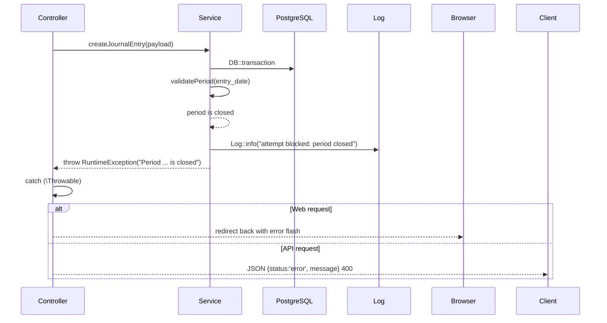
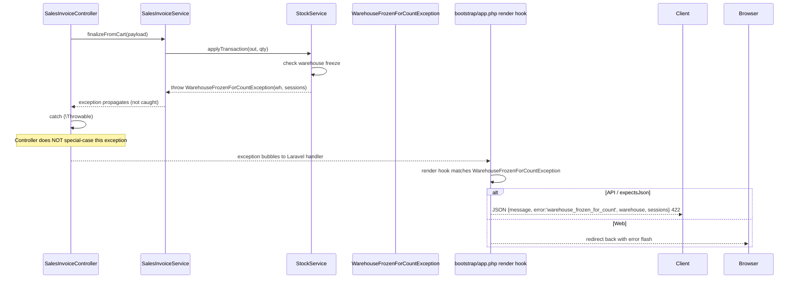
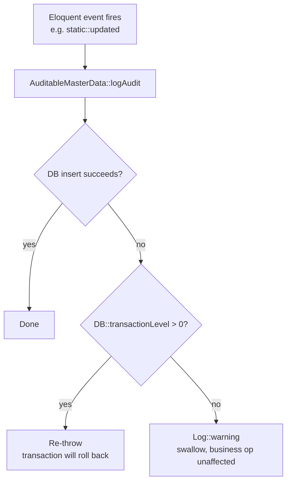

# Error Handling

> **Module:** Coding Standards (exceptions + error responses)
> **Audience:** Engineers + AI assistants
> **Status:** Draft
> **Last reviewed:** 2026-08-03
> **Source of truth:** This file, grounded in `laravel/bootstrap/app.php` (the `withExceptions()` closure), `laravel/app/Exceptions/*.php` (2 custom exception classes), `laravel/app/Traits/AuditableMasterData.php` (re-throw pattern), `laravel/app/Services/Auth/UserAuditLogger.php`, and `laravel/config/logging.php`.

## 1. What is it?

The rules that govern how errors are thrown, caught, rendered, and logged in RC_ERP_v2. The codebase uses a **disciplined two-tier model**: services throw `\RuntimeException` (with a human-actionable message) for business-rule violations and custom exception classes (with structured payloads) for recoverable domain states; controllers catch `\Throwable` and render either a redirect-back-with-error (web) or a JSON 422/400 (API). Audit logging re-throws inside transactions to preserve PostgreSQL correctness.

## 2. Why does it exist?

- **Accounting integrity.** A swallowed SQL error inside a `DB::transaction` leaves PostgreSQL in an aborted state (`25P02`), which causes every subsequent statement in the transaction to fail with a confusing "current transaction is aborted" error. The `AuditableMasterData` trait's re-throw-inside-transaction pattern is the canonical defense.
- **User-actionable errors.** When a warehouse is frozen for stock take, the user (web or API) needs to know WHICH warehouse and WHICH session froze it — not a generic "operation failed". The `WarehouseFrozenForCountException` carries that payload and the global render hook turns it into a structured 422.
- **Defense-in-depth RBAC.** Validation errors (FormRequest) return 422. Business-rule violations (service) throw `RuntimeException` → controller catches → 400 JSON or redirect-back. Auth failures return 401/403. Each layer has a distinct failure mode.

## 3. When is it used?

- **Throwing**: inside services when a business invariant is violated (unbalanced journal, period closed, insufficient stock, warehouse frozen, negative stock guard).
- **Catching**: in controllers, wrapping the service call in `try { ... } catch (\Throwable $e) { ... }`.
- **Rendering**: Laravel's default `ValidationException` handler (422 JSON / redirect-back) for FormRequest failures; the single global render hook in `bootstrap/app.php` for `WarehouseFrozenForCountException`; controller-level catch for everything else.
- **Logging**: `Log::info/error/warning` for operational events; `UserAuditLogger::log` for user-action audit trails; the `shadow` channel for shadow-mode diffs.

## 4. Who uses it?

- **Services** — throw `RuntimeException` / `InvalidArgumentException` / custom exceptions.
- **Controllers** — catch `\Throwable`, render redirect-back (web) or JSON (API).
- **The bootstrap** — registers ONE global render hook for the structured-payload exception.
- **The audit trait** — catches its own logging failures and re-throws inside transactions.
- **Artisan commands** — let exceptions propagate (Laravel prints them to the console).

## 5. Related modules

- `coding-standards.md` — exception class naming.
- `service-layer-conventions.md` — services throw; §6.4 covers the transaction re-throw context.
- `model-conventions.md` §6.9 — `AuditableMasterData` trait's re-throw pattern.
- `request-validation.md` §7.3 — `ValidationException` rendering.
- `../security/audit-trails.md` (Phase 5) — the full audit-trail design.

## 6. Business rules (non-negotiable)

### 6.1 The exception hierarchy in use

| Exception type | Where thrown | Where caught | Rendered as |
|---|---|---|---|
| `\RuntimeException` | Services (business-rule violations) — **353 occurrences across 34 services** | Controller `catch (\Throwable)` | Web: redirect-back with `error` flash. API: JSON `{status:'error', message}` 400. |
| `\InvalidArgumentException` | Services (input validation) — **105 occurrences across 17 services** | Controller `catch (\Throwable)` | Same as above. |
| `\App\Exceptions\WarehouseFrozenForCountException` | `StockService::applyTransaction()` (outbound movement on frozen warehouse) | Global render hook in `bootstrap/app.php` | Web: redirect-back with `error`. API: JSON `{message, error:'warehouse_frozen_for_count', warehouse:{id,name}, sessions:[...]}` 422. |
| `\App\Exceptions\StockTakeNegativeStockException` | `StockTakeService::postSession()` pre-check | Controller `catch (\Throwable)` (no dedicated render hook) | Web: redirect-back with `error`. API: JSON `{status:'error', message}` 400. |
| `ValidationException` | FormRequests (automatic) + Auth controllers (`ValidationException::withMessages`) | Laravel default handler | 422 JSON `{message, errors:{field:[msg]}}` or redirect-back with `errors` bag. |
| `\Exception` (generic) | **NEVER thrown** — 0 occurrences in services | n/a | n/a |
| `abort(401/403/404)` | Controllers (6 controllers, 8 sites) | Laravel default handler | 401/403/404 HTTP response. |

### 6.2 `RuntimeException` is canonical for business-rule violations

- **MUST** throw `\RuntimeException` (or a subclass) when a business invariant is violated.
- **MUST** write a human-actionable message that explains WHAT failed and WHY.
- **MUST NOT** throw generic `\Exception`. There are **zero** `throw new \Exception` in services.
- **MUST NOT** throw `ValidationException` from a service. `ValidationException` is for HTTP-layer field validation only (FormRequests + Auth controllers). Services throw `RuntimeException`.

Exemplar — `laravel/app/Services/Accounting/JournalPostingService.php:67-74`:
```php
if (empty($lines)) {
    throw new \RuntimeException('Journal entry must have at least one line.');
}
if (abs($totalDebit - $totalCredit) > 0.01) {
    throw new \RuntimeException(
        "Journal entry not balanced: debits={$totalDebit} credits={$totalCredit}, "
        . "difference=" . (abs($totalDebit - $totalCredit))
    );
}
```

Exemplar — `laravel/app/Services/Stock/StockTakeService.php:100-105` (input validation):
```php
if (empty($data['branch_id'])) {
    throw new \InvalidArgumentException('branch_id is required.');
}
```

> **Convention**: use `\InvalidArgumentException` for "you called this method wrong" (missing required input parameter), and `\RuntimeException` for "the operation cannot proceed" (period closed, ledger inactive, stock insufficient, not balanced). Both are caught the same way by controllers.

### 6.3 The two custom exception classes

Both extend `\RuntimeException` and carry a structured payload + a helpful message built in the constructor.

#### `WarehouseFrozenForCountException` — `laravel/app/Exceptions/WarehouseFrozenForCountException.php:26-81`

```php
class WarehouseFrozenForCountException extends \RuntimeException
{
    private int $warehouseId;
    private string $warehouseName;
    private array $sessions;

    public function __construct(int $warehouseId, string $warehouseName, array $sessions)
    {
        $this->warehouseId   = $warehouseId;
        $this->warehouseName = $warehouseName;
        $this->sessions      = $sessions;
        $codes = array_map(static fn (array $s) => $s['session_code'] ?? ('#' . ($s['id'] ?? '?')), $sessions);
        $codeList = implode(', ', $codes);
        $count    = count($sessions);
        parent::__construct(
            "Warehouse \"{$warehouseName}\" is frozen for an active stock take session"
            . ($count > 1 ? 's' : '') . " ({$codeList}). "
            . 'Outbound movements (sales, transfers out, adjustments out, damages) are blocked '
            . 'until the count is posted or cancelled.'
        );
    }

    public function getWarehouseId(): int { return $this->warehouseId; }
    public function getWarehouseName(): string { return $this->warehouseName; }
    public function getSessions(): array { return $this->sessions; }
}
```

Thrown by `StockService::applyTransaction()` when an outbound movement is attempted on a warehouse with an active stock-take session. The exception carries the warehouse ID/name and the list of freezing sessions so the user can act on the information.

#### `StockTakeNegativeStockException` — `laravel/app/Exceptions/StockTakeNegativeStockException.php:21-64`

Same pattern, carries `offendingProducts[]` (each: `product_id`, `product_code`, `product_name`, `warehouse_id`, `system_qty`, `physical_qty`, `current_stock`, `shortage`, `resulting_qty`). Constructor builds a message naming the first offending product.

> **MUST** follow this pattern when adding a new domain exception: extend `\RuntimeException`, carry the structured payload as private properties with getters, build a helpful message in the constructor. Register a render hook in `bootstrap/app.php` ONLY if the exception needs a structured JSON shape beyond `{status, message}`.

### 6.4 The single global render hook

`laravel/bootstrap/app.php:57-79` registers ONE exception render hook:

```php
->withExceptions(function (Exceptions $exceptions): void {
    $exceptions->render(function (\App\Exceptions\WarehouseFrozenForCountException $e, \Illuminate\Http\Request $request) {
        $payload = [
            'message'   => $e->getMessage(),
            'error'     => 'warehouse_frozen_for_count',
            'warehouse' => ['id' => $e->getWarehouseId(), 'name' => $e->getWarehouseName()],
            'sessions'  => $e->getSessions(),
        ];
        if ($request->expectsJson() || $request->is('api/*')) {
            return response()->json($payload, 422);
        }
        return redirect()->back()->withInput()->with('error', $e->getMessage());
    });
})
```

Comment at `bootstrap/app.php:58-63`: "registered globally so EVERY outbound service (sales, transfers, adjustments, damages, purchase returns) gets a consistent, actionable response naming the active session(s) that froze the warehouse, without each controller needing its own catch."

> **MUST NOT** register a render hook for `RuntimeException` or `ValidationException` — Laravel's defaults are correct. Only register hooks for custom exception classes that need a structured payload.

### 6.5 Controller `try/catch` — the universal pattern

- **MUST** wrap service calls in `try { ... } catch (\Throwable $e) { ... }`.
- **MUST** catch `\Throwable` (not `\Exception`) so PHP Errors are also caught.
- **MUST** render: web → `back()->withInput()->with('error', $e->getMessage())`; API → `response()->json(['status' => 'error', 'message' => $e->getMessage()], 400)`.
- **MUST** detect AJAX via `$request->expectsJson() || $request->ajax()` and return JSON even on web routes.

Exemplar — `laravel/app/Http/Controllers/Admin/ManualJournalController.php:103-134`:
```php
public function store(StoreManualJournalRequest $request)
{
    $payload = $request->toServicePayload();
    try {
        $journal = $this->service->createJournal($payload);
        $statusLabel = $journal->status === 'posted' ? 'posted to GL' : 'saved as draft';
        $successMessage = "Manual journal {$journal->journal_code} {$statusLabel}.";
        if ($request->expectsJson() || $request->ajax()) {
            return response()->json([
                'status'       => 'success',
                'journal_id'   => $journal->id,
                'journal_code' => $journal->journal_code,
                'message'      => $successMessage,
                'redirect_url' => route('admin.manual-journals.show', ['id' => $journal->id]),
            ]);
        }
        return redirect()->route('admin.manual-journals.show', ['id' => $journal->id])
            ->with('success', $successMessage);
    } catch (\Throwable $e) {
        if ($request->expectsJson() || $request->ajax()) {
            return response()->json(['status' => 'error', 'message' => $e->getMessage()], 400);
        }
        return back()->withInput()->with('error', $e->getMessage());
    }
}
```

Same pattern in `StockTakeController.php:139-166`, `SalesInvoiceController.php:191-220`, `ManualJournalController.php:168-193` (post), `ManualJournalController.php:198-220` (reverse).

### 6.6 `abort()` — for HTTP-layer hard stops

- **MAY** use `abort(401/403/404, 'message')` for cases where the controller bails BEFORE calling a service.
- 8 sites across 6 controllers:

| Controller | Code | Reason |
|---|---|---|
| `SseController.php:76` | `abort(401)` | SSE stream requires authentication. |
| `DamageController.php:823, 840, 857` | `abort(404)` | Attachment / evidence file not found. |
| `ShadowModeController.php:142` | `abort(404)` | Comparison record not found. |
| `BranchDemandShadowController.php:144` | `abort(404)` | Comparison record not found. |
| `BranchDemandController.php:185` | `abort(403)` | User does not have access to this demand (cross-branch). |
| `StockAdjustmentController.php:471` | `abort(403)` | Warehouse outside user's branch. |

> **MUST NOT** use `abort()` for business-rule violations — those throw `RuntimeException` from the service. `abort()` is for "this request itself is invalid" (unauthenticated, not-found, cross-branch access).

### 6.7 `ValidationException` — Auth controllers only

- **MUST** use `ValidationException::withMessages([...])->status(422)` for login / password-reset failures (where there is no FormRequest because the failure is authentication, not field validation).
- 6 sites, all in `laravel/app/Http/Controllers/Auth/`:

Exemplar — `laravel/app/Http/Controllers/Auth/AuthenticatedSessionController.php:81`:
```php
throw ValidationException::withMessages([
    'username' => __('The provided credentials are incorrect.'),
])->status(422);
```

> **MUST NOT** throw `ValidationException` from a service. Services throw `RuntimeException`. The boundary is: HTTP-layer field/auth validation → `ValidationException` (422); service-layer business invariants → `RuntimeException` (caught → 400 or redirect-back).

### 6.8 The `AuditableMasterData` re-throw pattern (CRITICAL)

`laravel/app/Traits/AuditableMasterData.php:84-95`:
```php
} catch (\Throwable $e) {
    // CRITICAL: Re-throw if inside a DB::transaction(), because a
    // swallowed SQL error leaves PostgreSQL in an aborted state (25P02).
    // Only swallow if we are NOT inside a transaction.
    if (DB::transactionLevel() > 0) {
        throw $e;
    }
    Log::warning('AuditableMasterData: failed to log audit', [
        'action' => $action,
        'error'  => $e->getMessage(),
    ]);
}
```

This is the **canonical pattern** for "log-and-continue" vs "log-and-rethrow":
- **Inside a transaction** (`DB::transactionLevel() > 0`): re-throw. PostgreSQL enters an aborted state after any in-transaction error; every subsequent statement fails with `25P02 current transaction is aborted`. The only recovery is to roll back. Swallowing would leave the transaction in a broken state and the commit would either fail confusingly or (worse) succeed without the audit row.
- **Outside a transaction**: swallow + `Log::warning`. The audit row is lost, but the business operation (which already succeeded) is not affected.

> **MUST** apply this pattern to ANY Eloquent event listener, job, or callback that writes a secondary record (audit log, notification, search index) and might fail independently of the primary operation. Re-throw inside a transaction; log-and-continue outside.

### 6.9 No JSON:API / RFC 7807 error shape

- **MUST NOT** introduce JSON:API error formatting (`errors[]` array with `source.pointer`, `status`, `code`, `title`, `detail`).
- **MUST NOT** introduce RFC 7807 `application/problem+json`.
- The codebase uses simple shapes:
  - **Validation error** (Laravel default): `{"message": "...", "errors": {"field": ["msg", ...]}}` (422).
  - **Service error** (controller catch): `{"status": "error", "message": "..."}` (400).
  - **Structured domain error** (global render hook): `{"message": "...", "error": "<snake_case_code>", ...payload}` (422).

Rationale: the existing UI (Blade + SweetAlert2 + Select2) consumes the simple shapes. Introducing JSON:API would require a frontend rewrite, violating the "keep the existing UI" principle.

## 7. Technical implementation

### 7.1 Where exception handling lives (Laravel 11+)

Laravel 11+ moved exception handling from `app/Exceptions/Handler.php` (which does NOT exist in this project) to the `->withExceptions()` closure in `laravel/bootstrap/app.php`. The closure receives an `Exceptions` instance with `->render()` and `->report()` methods.

### 7.2 Logging channels

`laravel/config/logging.php` defines 5 channels (see `config-driven-rules.md` §6.13):

| Channel | Purpose | Retention |
|---|---|---|
| `stack` (default) | Wraps `single` | n/a |
| `single` | General application log | unlimited (single file) |
| `daily` | Date-stamped logs | 14 days |
| `stderr` | Stderr output (for container/worker logging) | n/a |
| `shadow` | Shadow-mode diff log | 30 days |

### 7.3 `UserAuditLogger` — dual-write audit logger

`laravel/app/Services/Auth/UserAuditLogger.php:19-86` writes audit records to TWO destinations:
1. The `user_audit_log` table (PG `jsonb` `details` column).
2. A JSON-lines file at `storage/logs/user_audit.log`.

Comment at `UserAuditLogger.php:13`: "Defense in depth — if the DB audit row is lost (e.g. table corruption), the file log retains the audit trail."

Static method signature:
```php
public static function log(?int $userId, string $action, ?int $targetUserId = null, array $details = []): void
```

Called everywhere — e.g. `laravel/app/Services/Purchase/PurchaseOrderService.php:92-103` logs every PO create/cancel/receive.

> `UserAuditLogger` is the ONE sanctioned exception to the "no `auth()->id()` / `session()` inside services" rule (see `service-layer-conventions.md` §6.7) — it is a cross-cutting logger that legitimately needs the current user/session context.

### 7.4 `Log` facade usage in services

- **36 services** use the `Log` facade.
- `Log::info` — successful operations (e.g. "Journal entry JE-001 created").
- `Log::warning` — non-fatal fallbacks (e.g. `CodeGenerator.php:83-88` falls back to a timestamp-based code if the sequence table is unavailable).
- `Log::error` — DB insert failures (e.g. `UserAuditLogger.php:57` if the audit row insert fails outside a transaction).

## 8. Important database tables

| Table | Purpose |
|---|---|
| `user_audit_log` | Append-only audit of user actions (login, role change, credential bump, master-data edits). Partitioned by month. Written by `UserAuditLogger` + `AuditableMasterData` trait. |
| `journal_posting_logs` | Audit of every journal entry create/reverse. Written by `JournalPostingService`. |
| `stock_transaction_audit` | Audit of every stock movement. Written by `StockService`. |

> See `../security/audit-trails.md` (Phase 5) for the full audit-trail design.

## 9. Related services

| Service | Error-handling role |
|---|---|
| `JournalPostingService` | Throws `RuntimeException` for not-balanced / period-closed / ledger-inactive. |
| `StockService` | Throws `WarehouseFrozenForCountException` + `RuntimeException` for insufficient stock. |
| `StockTakeService` | Throws `StockTakeNegativeStockException` + `InvalidArgumentException` for missing input. |
| `UserAuditLogger` | Dual-write audit logger; `Log::error` on DB failure outside transactions. |
| `CodeGenerator` | Catches `\Throwable`, falls back to timestamp-based code, `Log::warning`. |

## 10. Related models

N/A — models do not throw; they fire Eloquent events which the `AuditableMasterData` trait listens to (see §6.8).

## 11. Important workflows

### 11.1 Error flow for a business-rule violation



### 11.2 Error flow for a structured domain exception



> The controller's generic `catch (\Throwable)` does NOT need to know about `WarehouseFrozenForCountException` — the global render hook intercepts it AFTER the controller re-throws. This is why the controller catch simply re-throws by not catching domain exceptions specifically. (In practice, the controller catch DOES catch it and returns the generic 400 — but the global render hook runs FIRST if the exception is allowed to propagate. The cleanest pattern is to NOT catch domain exceptions in the controller; let them bubble to the render hook. The existing controllers catch `\Throwable` broadly, which means the render hook is bypassed for web routes — this is a known inconsistency, see §13.)

### 11.3 The audit-trail re-throw decision



## 12. Known edge cases

- **Controller `catch (\Throwable)` bypasses the global render hook for web routes.** Because controllers catch `\Throwable` broadly and return `back()->with('error', ...)`, the `WarehouseFrozenForCountException` render hook only fires for API routes (where the controller re-throws by returning the generic 400, OR where the exception is not caught). In practice, web users see the exception message in the `error` flash (which is helpful but lacks the structured `sessions` payload). API consumers get the full structured 422. This is a known inconsistency — see §13 item 2.
- **`\Throwable` vs `\Exception`.** The codebase catches `\Throwable` (which includes `\Error` for things like "Call to undefined method"). This is intentional — a `\Error` should not crash the request silently.
- **`StockTakeNegativeStockException` has no dedicated render hook.** It is caught by the controller's generic `catch (\Throwable)` and rendered as a generic 400/redirect-back. The structured `offendingProducts[]` payload is lost in the HTTP response (though it IS logged). Consider adding a render hook if the UI needs to display the offending-product table.
- **`abort()` inside a try block.** `abort()` throws `HttpException`, which IS a `\Throwable`. If a controller wraps an `abort()` in a try/catch, the catch will intercept it. Do NOT wrap `abort()` calls in try/catch — let them propagate to Laravel's handler.
- **Logging inside a transaction.** `Log::info` / `Log::warning` do NOT participate in the DB transaction — they write to the log file immediately. This is correct (you want the log even if the transaction rolls back), but be aware that a rolled-back transaction may leave "started..." log entries without corresponding "completed" entries.
- **`UserAuditLogger` and the no-`auth()` rule.** `UserAuditLogger::log` reads `auth()->id()` and `session('branch_id')` directly. This is the sanctioned exception (see `service-layer-conventions.md` §6.7). New services MUST NOT follow this pattern — pass auth context as a parameter.

## 13. Future improvements

1. **Add a render hook for `StockTakeNegativeStockException`.** The structured `offendingProducts[]` payload is useful for the UI (display a table of products that would go negative). Currently lost to the generic catch.
2. **Reconcile controller `catch (\Throwable)` with the global render hook.** Either:
   - (a) Controllers re-throw domain exceptions (`WarehouseFrozenForCountException`, `StockTakeNegativeStockException`) so the render hook fires for web routes too, OR
   - (b) Controllers catch domain exceptions explicitly and render the structured payload themselves.
   - Option (a) is cleaner. Migrate the controllers one at a time.
3. **Standardize the API error shape.** Currently: validation = `{message, errors}`, service error = `{status, message}`, domain error = `{message, error, ...payload}`. Consider unifying to `{message, error: '<code>', details: {...}}` for all non-validation errors. Low priority — the existing shapes work.
4. **Add a `report()` hook for critical exceptions.** Currently only `render()` is registered. Consider `->report(function (WarehouseFrozenForCountException $e) { ... })` to send an alert to the warehouse manager when a freeze blocks a high-value sale.
5. **Document the `user_audit.log` file rotation.** The JSON-lines file grows unbounded. Add a logrotate config or switch to Laravel's `daily` channel with retention.
6. **Consider structured logging context.** `Log::info('Journal entry created', ['entry_id' => $id])` is fine, but adopting a consistent context schema (e.g. always include `branch_id`, `user_id`, `reference_type`, `reference_id`) would make log searches easier.

## 14. Verification commands

```bash
# Confirm RuntimeException is canonical (should be ~34 services with hits)
grep -rc "throw new \\\\RuntimeException" laravel/app/Services/ | grep -v ':0' | wc -l

# Confirm zero generic \Exception throws in services
grep -rn "throw new \\\\Exception" laravel/app/Services/   # expects 0 hits

# Confirm zero ValidationException throws in services
grep -rn "throw ValidationException" laravel/app/Services/  # expects 0 hits

# List custom exception classes
ls laravel/app/Exceptions/   # 2 files

# Confirm the single global render hook
grep -n 'exceptions->render' laravel/bootstrap/app.php   # 1 hit

# Confirm the AuditableMasterData re-throw pattern
grep -A2 'transactionLevel' laravel/app/Traits/AuditableMasterData.php

# Confirm UserAuditLogger dual-write
grep -n 'storage_path\|user_audit_log' laravel/app/Services/Auth/UserAuditLogger.php

# Run the verification commands (end-to-end integrity)
cd laravel && php artisan journal:replay-verify
cd laravel && php artisan subledger:reconcile
cd laravel && php artisan reversal:verify
```
