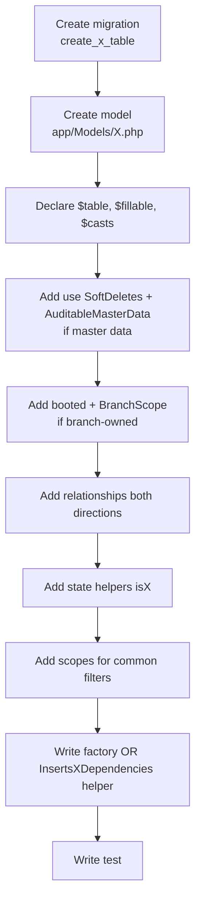

# Model Conventions

> **Module:** Coding Standards (Eloquent models)
> **Audience:** Engineers + AI assistants
> **Status:** Draft
> **Last reviewed:** 2026-08-03
> **Source of truth:** This file, grounded in `laravel/app/Models/**/*.php` (~96 models), `laravel/app/Models/Scopes/*.php` (3 global scope classes), and `laravel/app/Traits/*.php` (2 traits).

## 1. What is it?

The rules that govern how Eloquent models are declared in RC_ERP_v2: fillable guards, casts, hidden fields, relationships, scopes (local + global), traits, boot hooks, accessors, and helper methods. Models are the read shape and the relationship graph; **writes go through services** (see `service-layer-conventions.md`).

## 2. Why does it exist?

- **Mass-assignment safety.** Every model declares an explicit `$fillable` list — `$guarded = []` is forbidden. This prevents accidental mass-assignment of `branch_id`, `is_reversed`, `created_by`, etc.
- **Branch isolation.** Multi-tenant scoping is enforced by a global `BranchScope` added in `booted()` on every branch-owned model. The model is the single place this scope is wired.
- **Audit integrity.** 37 models use the `AuditableMasterData` trait, which writes old/new value snapshots to `user_audit_log` on every create/update/delete. The trait's re-throw-inside-transaction behavior is critical to PostgreSQL correctness (see `error-handling.md` §6.3).
- **Type fidelity.** Money is `decimal:2` (BDT, 2 dp); quantities are `decimal:4` (allows fractional cartons/bags); flags are `boolean`; FKs are `integer`. Casting at the model boundary prevents string-leaking into business logic.

## 3. When is it used?

- Adding a new table → create the matching model.
- Adding a column → add it to `$fillable` and `$casts`.
- Adding a relationship → declare the method on both sides.
- Adding a reusable filter → write a local scope.
- Adding a branch-scoped table → wire `BranchScope` in `booted()`.

## 4. Who uses it?

- **Services** — for reads (`Model::query()->with(...)->paginate()`) and for the final return shape.
- **Controllers** — never call `$model->save()` directly; they delegate to a service.
- **Tests** — factories (`HasFactory` on 5 models) + `DB::table()->insertGetId()` helpers for the rest.
- **Policies** — type-hint the model in `view(User $u, Model $m)` methods.

## 5. Related modules

- `coding-standards.md` — naming conventions.
- `service-layer-conventions.md` — services own writes.
- `../database/schema-overview.md` — table definitions.
- `../database/er-diagrams.md` — relationship graphs.
- `../architecture/branch-isolation-rls.md` — how `BranchScope` + RLS compose.

## 6. Business rules (non-negotiable)

### 6.1 Inventory — ~96 models

- 95 model files in `laravel/app/Models/` root.
- 2 models in `laravel/app/Models/Accounting/` (`JournalEntry`, `JournalLine`) — partitioned-table models grouped for clarity.
- 3 global scope classes in `laravel/app/Models/Scopes/` (`BranchScope`, `MoneyTransferBranchScope`, `WarehouseTransferBranchScope`).

### 6.2 `$fillable` is mandatory; `$guarded = []` is forbidden

- **MUST** declare an explicit `$fillable` array listing every mass-assignable column.
- **MUST NOT** use `protected $guarded = [];`. There are **zero** occurrences in `app/Models/`.
- **MUST NOT** list generated/computed columns in `$fillable` (e.g. `search_vector` on `Product`/`Customer` — it is a GENERATED tsvector).

Exemplar — `laravel/app/Models/User.php:40-54`:
```php
protected $fillable = [
    'employee_id', 'username', 'password_hash', 'is_active', 'last_login',
    'last_login_ip', 'failed_login_count', 'locked_until', 'credential_version',
    'api_token', 'created_by', 'deleted_by',
];
```

### 6.3 `$casts` — money, qty, dates, flags, FKs

- **MUST** cast money columns as `'decimal:2'` (BDT, 2 decimal places).
- **MUST** cast quantity columns as `'decimal:4'` (allows fractional cartons, bags, KG).
- **MUST** cast dates as `'date'` and timestamps as `'datetime'`.
- **MUST** cast boolean flags as `'boolean'`.
- **MUST** cast foreign-key integers as `'integer'` (ensures `int`, not `string`, after PG fetch).
- **MUST NOT** use custom cast classes or enum casts. The codebase has none.

Exemplar — `laravel/app/Models/SalesInvoice.php:102-128`:
```php
protected $casts = [
    'invoice_date'   => 'date',
    'sub_total'      => 'decimal:2',
    'discount_amount'=> 'decimal:2',
    'transport_cost' => 'decimal:2',
    'total_amount'   => 'decimal:2',
    'paid_amount'    => 'decimal:2',
    'due_amount'     => 'decimal:2',
    'is_godown_prepared' => 'boolean',
    'is_challan_issued'  => 'boolean',
    'is_reversed'    => 'boolean',
    'is_soft_hold'   => 'boolean',
    'call_a_day'     => 'boolean',
    'godown_prepared_at' => 'datetime',
    'challan_issued_at'  => 'datetime',
    'customer_id'      => 'integer',
    'salesman_id'      => 'integer',
    'branch_id'        => 'integer',
    'journal_entry_id' => 'integer',
    'cogs_journal_entry_id' => 'integer',
    'created_by'   => 'integer',
    'reversed_by'  => 'integer',
];
```

### 6.4 `$hidden` — secrets and generated columns

- **MUST** hide credentials: `password_hash`, `remember_token`, `api_token` on `User`.
- **MUST** hide GENERATED columns that would break JSON serialization: `search_vector` on `Product` and `Customer`.

Exemplar — `laravel/app/Models/User.php:56-60`:
```php
protected $hidden = [
    'password_hash', 'remember_token', 'api_token',
];
```
`laravel/app/Models/Product.php:37`:
```php
protected $hidden = ['search_vector'];
```

### 6.5 Relationships — explicit return types, explicit FK column

- **MUST** declare the full return type (`\Illuminate\Database\Eloquent\Relations\HasMany`, `BelongsTo`, `HasOne`, `BelongsToMany`). The codebase does NOT use short `use` imports for these — it writes the FQN.
- **MUST** pass the explicit FK column as the second argument: `->belongsTo(Customer::class, 'customer_id')`.
- **MUST** name methods: plural for `hasMany`/`belongsToMany`; singular for `belongsTo`/`hasOne`.
- **MAY** add clauses inside a relationship (`->where('is_active', true)`, `->withPivot('dispatch_role')`, `->latestOfMany()`).

Exemplar — `laravel/app/Models/SalesInvoice.php:130-150`:
```php
public function items(): \Illuminate\Database\Eloquent\Relations\HasMany
{
    return $this->hasMany(SalesInvoiceItem::class, 'sales_invoice_id');
}

public function customer(): \Illuminate\Database\Eloquent\Relations\BelongsTo
{
    return $this->belongsTo(Customer::class, 'customer_id');
}

public function dispatchers(): \Illuminate\Database\Eloquent\Relations\BelongsToMany
{
    return $this->belongsToMany(
        Employee::class,
        'sales_invoice_dispatchers',
        'sales_invoice_id',
        'employee_id'
    )->withPivot('dispatch_role');
}

public function challan(): \Illuminate\Database\Eloquent\Relations\HasOne
{
    return $this->hasOne(\App\Models\SalesChallan::class, 'sales_invoice_id')->latestOfMany();
}
```

> `latestOfMany()` is used on partitioned child tables (e.g. the latest non-reversed challan for an invoice) because the relationship should surface the "current" row, not the first.

### 6.6 Local scopes — `scope<Name>(Builder $q, ...): Builder`

- **MUST** name scopes `scope<Name>` and return `Builder`.
- **MUST** declare the `Builder` parameter type.
- Common scopes: `scopeActive` (on most master-data models), `scopeNotReversed` (on ledger/transaction models), `scopeFor<Product>InWarehouse`, `scopeForReference`.

Exemplar — `laravel/app/Models/StockTransaction.php:131-145`:
```php
public function scopeNotReversed(Builder $query): Builder
{
    return $query->where('is_reversed', false);
}

public function scopeForProductInWarehouse(Builder $query, int $warehouseId, int $productId): Builder
{
    return $query->where('warehouse_id', $warehouseId)->where('product_id', $productId);
}

public function scopeForReference(Builder $query, string $referenceType, int $referenceId): Builder
{
    return $query->where('reference_type', $referenceType)->where('reference_id', $referenceId);
}
```

Exemplar — `laravel/app/Models/User.php:189-201`:
```php
public function scopeActive(\Illuminate\Database\Eloquent\Builder $query): \Illuminate\Database\Eloquent\Builder
{
    return $query->where('is_active', true)->whereNull('deleted_at');
}

public function scopeLocked(\Illuminate\Database\Eloquent\Builder $query): \Illuminate\Database\Eloquent\Builder
{
    return $query->whereNotNull('locked_until')->where('locked_until', '>', now());
}
```

### 6.7 Global scopes — `booted()` + scope class

- **MUST** add `BranchScope` to every branch-owned model via `booted()`.
- **MUST** use `MoneyTransferBranchScope` / `WarehouseTransferBranchScope` for two-branch tables (they filter on `from_branch_id` OR `to_branch_id`).
- **MUST NOT** apply `BranchScope` to branch-independent tables (master data shared across branches: `Ledger`, `ProductCategory`, `ProductGroup`, `Bank`, `NotificationRule`).

Exemplar — `laravel/app/Models/SalesInvoice.php:85-88`:
```php
protected static function booted(): void
{
    static::addGlobalScope(new BranchScope);
}
```

Models using `booted()` for `BranchScope`: `SalesInvoice`, `SalesChallan`, `SalesReturn`, `CustomerPayment`, `Budget`, `FixedAsset`, `FiscalYear`, `EmployeeTransaction`, `CommissionRule`, `PurchaseReturn` (10 total).

### 6.8 The three scope classes

#### `BranchScope` — `laravel/app/Models/Scopes/BranchScope.php:39-65`

```php
public function apply(Builder $builder, Model $model): void
{
    if (!Auth::check()) { return; }              // console / unauthenticated: no-op
    $user = Auth::user();
    if ($user->isAdmin()) { return; }             // admin + superadmin bypass
    $branchId = (int) (session('branch_id') ?? $user->getBranchId() ?? 0);
    if ($branchId > 0) {
        $builder->where($model->getTable() . '.branch_id', '=', $branchId);
    }
}
```

- Reads `session('branch_id')` (populated by `SyncLegacySession` middleware).
- Admin/superadmin bypass (they see all branches).
- Console/unauthenticated requests are no-op (so `php artisan db:seed` and tests can seed any branch).

#### `MoneyTransferBranchScope` — `laravel/app/Models/Scopes/MoneyTransferBranchScope.php:26-57`

Two-branch OR filter for `money_transfers`:
```php
$builder->where(function ($query) use ($table, $branchId) {
    $query->where($table . '.from_branch_id', '=', $branchId)
          ->orWhere($table . '.to_branch_id', '=', $branchId);
});
```

#### `WarehouseTransferBranchScope`

Same shape as `MoneyTransferBranchScope`, applied to `warehouse_transfers`.

> **To bypass a global scope** (rare, admin-only reports): `SalesInvoice::withoutGlobalScope(BranchScope::class)->get();`.

### 6.9 Traits

#### `AuditableMasterData` — `laravel/app/Traits/AuditableMasterData.php` (used by 37 models)

Boots Eloquent events (`created`, `updated`, `deleted`, `restored`) to write `user_audit_log` with old/new value snapshots:

```php
public static function bootAuditableMasterData(): void
{
    static::created(function ($model) {
        static::logAudit($model, 'created', null, $model->getAttributes());
    });
    static::updated(function ($model) {
        if ($model->wasChanged()) {
            $changes = $model->getChanges();
            static::logAudit($model, 'updated', array_intersect_key($model->getOriginal(), $changes), $changes);
        }
    });
    static::deleted(function ($model) {
        static::logAudit($model, 'deleted', $model->getAttributes(), null);
    });
    if (in_array(\Illuminate\Database\Eloquent\SoftDeletes::class, class_uses_recursive(static::class))) {
        static::restored(function ($model) {
            static::logAudit($model, 'restored', null, $model->getAttributes());
        });
    }
}
```

**Critical re-throw pattern** in `logAudit()` (`AuditableMasterData.php:84-95`):
```php
} catch (\Throwable $e) {
    // CRITICAL: Re-throw if inside a DB::transaction(), because a
    // swallowed SQL error leaves PostgreSQL in an aborted state (25P02).
    // Only swallow if we are NOT inside a transaction.
    if (DB::transactionLevel() > 0) { throw $e; }
    Log::warning('AuditableMasterData: failed to log audit', [...]);
}
```

> **MUST** apply this trait to every master-data model (Branch, Employee, User, Product, Customer, Supplier, Bank, Ledger, Warehouse, ProductCategory, ProductGroup, etc.) and to any model whose changes need an audit trail.

Also provides `auditHistory(int $limit = 100): Collection` using `whereRaw("details::jsonb->>'table' = ?", [...])`.

#### `ApplySystemPolicyScope` — `laravel/app/Traits/ApplySystemPolicyScope.php` (DEAD CODE)

Designed to add a global scope for INVESTIGATION-mode date clamping. Supports `protected string $policyDateColumn = 'created_at'` override + `scopeWithoutPolicy(Builder $query)` bypass.

> **WARNING — ZERO models use this trait today** (verified by Grep). It is dead/aspirational code. Either remove it or wire it into date-based models. See `coding-standards.md` §13 item 6.

### 6.10 Standard Laravel traits in use

| Trait | Where | Notes |
|---|---|---|
| `HasFactory` | 5 models only (User, Branch, Employee, Product, Customer) | Only models with factories declare it. The other 91 models skip it. |
| `SoftDeletes` | Most master-data + transactional models | Uses `deleted_at` column. `protected $dates = ['deleted_at'];` is still declared explicitly (legacy style; harmless). |
| `Notifiable` | `User` only | For in-app + SSE notifications. |
| `AuthorizesRequests`, `ValidatesRequests` | `Controller` base | Not on models. |

### 6.11 Timestamps

- Default: `public $timestamps = true;` (Laravel default — manages `created_at` + `updated_at`).
- **Append-only ledger models** set `public $timestamps = false;` and rely on the DB trigger `update_updated_at()` only where updates are legitimate:
  - `laravel/app/Models/StockTransaction.php:57` — `false` (only `created_at` set; rows never update, reversals create new rows).
  - `laravel/app/Models/JournalLine.php:11` — `false` (same rationale).
  - `laravel/app/Models/JournalEntry.php:11` — `true` (entry can be marked `is_reversed`, so `updated_at` is meaningful).
- The DB trigger `update_updated_at()` (defined in `database/sql/07_views_triggers_constraints.sql`) refreshes `updated_at` on `UPDATE` for 41 tables — belt-and-suspenders with Eloquent's own management.

### 6.12 No `Attribute::make`, no `$with`, no `$appends`

- **MUST NOT** use the Laravel 9+ `Attribute::make` accessor syntax. There are **zero** occurrences in `app/Models/`. Use classic `getXAttribute()` methods if needed (only `User` does, for `getAuthPassword()`).
- **MUST NOT** declare `protected $with` (eager-load defaults). Controllers pass `->with(['customer', 'items', ...])` explicitly so each query declares its own join depth.
- **MUST NOT** declare `protected $appends` (computed attributes appended to JSON). Computed values are added at the resource/controller layer.

### 6.13 Constants for closed value lists

- **MUST** declare closed value lists as `public const` on the model, mirroring the DB `CHECK` constraint.

Exemplar — `laravel/app/Models/StockTransaction.php:95-110`:
```php
public const REFERENCE_TYPES = [
    'purchase_receive', 'purchase_return', 'sales_challan', 'sales_return',
    'stock_adjustment', 'stock_take', 'warehouse_transfer', 'damage',
    'branch_demand', 'demand_send', 'demand_receive', 'demand_reversal',
    'opening_balance', 'reversal',
];
```

> When adding a value: update BOTH the constant AND the DB `CHECK` constraint via a migration. They must agree.

### 6.14 Boolean state-check helpers

- **MUST** add `is<State>(): bool` helpers for status fields used in conditionals.

Exemplar — `laravel/app/Models/SalesInvoice.php:213-217`:
```php
public function isDraft(): bool     { return $this->status === 'draft'; }
public function isConfirmed(): bool { return $this->status === 'confirmed'; }
public function isCancelled(): bool { return $this->status === 'cancelled'; }
public function isReversed(): bool  { return $this->status === 'reversed' || $this->is_reversed; }
public function isCalledItADay(): bool { return (bool) $this->call_a_day; }
```

Exemplar — `laravel/app/Models/StockTransaction.php:162-170`:
```php
public function isIn(): bool   { return (float) $this->qty > 0; }
public function isOut(): bool  { return (float) $this->qty < 0; }
public function absQty(): float { return abs((float) $this->qty); }
```

### 6.15 Role helpers on `User`

The role is stored on **`Employee`** (not `User`); `User` delegates via the `employee` relationship. `laravel/app/Models/User.php:144-165`:
```php
public function getRole(): string { return $this->employee?->role ?? 'user'; }
public function getBranchId(): ?int { return $this->employee?->branch_id; }
public function isSuperadmin(): bool { return $this->getRole() === 'superadmin'; }
public function isAdmin(): bool { return in_array($this->getRole(), ['admin', 'superadmin'], true); }
public function hasRole(string ...$roles): bool { return in_array($this->getRole(), $roles, true); }
public function isLocked(): bool { return $this->locked_until !== null && $this->locked_until->isFuture(); }
```

> `User::getAuthPassword()` returns `$this->password_hash` (the column is `password_hash`, not Laravel's default `password`). See `laravel/app/Models/User.php:115-126`.

## 7. Technical implementation

### 7.1 Model file skeleton (canonical)

```php
<?php

namespace App\Models;

use Illuminate\Database\Eloquent\Builder;
use Illuminate\Database\Eloquent\Model;
use Illuminate\Database\Eloquent\SoftDeletes;
use App\Models\Scopes\BranchScope;
use App\Traits\AuditableMasterData;

class ExampleTransaction extends Model
{
    use SoftDeletes;
    use AuditableMasterData;

    protected $table = 'example_transactions';

    protected $fillable = [
        'code', 'branch_id', 'transaction_date', 'amount', 'status',
        'is_reversed', 'created_by', 'reversed_by',
    ];

    protected $hidden = ['search_vector'];

    protected $casts = [
        'transaction_date' => 'date',
        'amount'            => 'decimal:2',
        'is_reversed'       => 'boolean',
        'branch_id'         => 'integer',
        'created_by'        => 'integer',
        'reversed_by'       => 'integer',
    ];

    public const STATUSES = ['draft', 'confirmed', 'cancelled', 'reversed'];

    protected static function booted(): void
    {
        static::addGlobalScope(new BranchScope);
    }

    // --- Relationships ---

    public function branch(): \Illuminate\Database\Eloquent\Relations\BelongsTo
    {
        return $this->belongsTo(Branch::class, 'branch_id');
    }

    public function items(): \Illuminate\Database\Eloquent\Relations\HasMany
    {
        return $this->hasMany(ExampleTransactionItem::class, 'example_transaction_id');
    }

    // --- Scopes ---

    public function scopeActive(Builder $query): Builder
    {
        return $query->where('is_reversed', false);
    }

    // --- State helpers ---

    public function isReversed(): bool { return $this->is_reversed || $this->status === 'reversed'; }
}
```

### 7.2 Partitioned-table models

5 parent tables are partitioned (`sales_invoices`, `sales_challans`, `journal_entries`, `journal_lines`, `user_audit_log`). Their models work normally with Eloquent because the partition key is in `created_at` / `entry_date` — Eloquent's `where` clauses naturally hit the right partition. The `JournalEntry` and `JournalLine` models live under `app/Models/Accounting/` (not the root) to group them. See `../database/partitioning.md`.

## 8. Important database tables

N/A — see `../database/schema-overview.md`.

## 9. Related services

N/A — services are documented in `service-layer-conventions.md`.

## 10. Related models (exemplars)

| Model | File | Why read it |
|---|---|---|
| `User` | `laravel/app/Models/User.php` | Role delegation, `$hidden`, `getAuthPassword()`, scopes |
| `Branch` | `laravel/app/Models/Branch.php` | Master-data shape, `scopeActive`, color config link |
| `SalesInvoice` | `laravel/app/Models/SalesInvoice.php` | Full `$casts`, relationships, `BranchScope`, state helpers |
| `StockTransaction` | `laravel/app/Models/StockTransaction.php` | `REFERENCE_TYPES` constant, `timestamps = false`, qty scope |
| `JournalEntry` | `laravel/app/Models/Accounting/JournalEntry.php` | Partitioned model, minimal casts |
| `JournalLine` | `laravel/app/Models/Accounting/JournalLine.php` | `timestamps = false`, append-only pattern |
| `Product` | `laravel/app/Models/Product.php` | `$hidden = ['search_vector']`, full-text search |

## 11. Important workflows

### 11.1 Add a new branch-scoped model



### 11.2 Add a column to an existing model

1. Migration: `php artisan make:migration add_y_to_x_table --table=x`.
2. Add column to `$fillable` on the model.
3. Add a `$casts` entry if the column is money/qty/date/boolean/FK.
4. Update the factory definition if a factory exists.
5. Update tests that assert `assertDatabaseHas`.

## 12. Known edge cases

- **`BranchScope` is a no-op for console/unauthenticated.** This means `php artisan db:seed`, `php artisan tinker`, and unauthenticated API calls see ALL branches. Production API endpoints MUST be behind `api.auth` middleware (which establishes the user + session branch).
- **Admin bypass in `BranchScope`.** `admin` and `superadmin` roles skip the branch filter entirely — they see every branch. This is intentional for cross-branch reports but means admin-facing controllers MUST explicitly filter when scoping is required.
- **`SoftDeletes` + `AuditableMasterData`.** Soft-deleting a model fires the `deleted` event (logs `deleted` action with full attributes). Restoring fires `restored`. Hard-deleting (`forceDelete()`) does NOT fire a trait event — avoid it on audited models.
- **`search_vector` is GENERATED.** Never include it in `$fillable` or in a factory definition. The DB computes it from a `tsvector(name, code)` expression. `Product` and `Customer` hide it in `$hidden` so JSON serialization does not crash.
- **`$dates = ['deleted_at']` is redundant.** Laravel 10+ auto-casts `deleted_at` from `$casts`. The codebase keeps both for belt-and-suspenders; do not remove without testing SoftDeletes behavior.
- **`HasFactory` on only 5 models.** When adding a model, add a factory ONLY if the model is simple master-data (like Branch, User, Product, Customer, Employee). For transactional models with many NOT NULL FKs, use the `tests/Helpers/InsertsXDependencies` pattern instead (see `testing-standards.md` §6).

## 13. Future improvements

- **Remove `ApplySystemPolicyScope` dead-code trait** OR wire it into date-based models for INVESTIGATION-mode date clamping (Phase 5/14).
- **Migrate `$dates = ['deleted_at']` away** once SoftDeletes behavior is confirmed without it (low priority; cosmetic).
- **Consider `Attribute::make` for computed accessors** if new computed fields are needed — the codebase has none today, so this is forward-looking only.
- **Add `HasFactory` to more models** as test coverage expands — but only where the factory is genuinely simpler than the `InsertsXDependencies` helper.

## 14. Verification commands

```bash
# Confirm zero $guarded = [] (forbidden pattern)
grep -rn 'protected \$guarded = \[\];' laravel/app/Models/   # expects 0 hits

# Confirm zero Attribute::make (forbidden pattern)
grep -rn 'Attribute::make' laravel/app/Models/                # expects 0 hits

# List models using BranchScope
grep -rln 'addGlobalScope(new BranchScope)' laravel/app/Models/  # ~10 hits

# List models using AuditableMasterData
grep -rln 'use AuditableMasterData' laravel/app/Models/          # ~37 hits

# List models with timestamps = false (append-only ledgers)
grep -rn 'public \$timestamps = false' laravel/app/Models/        # ~2-3 hits

# Validate chart of accounts (model-level sanity)
cd laravel && php artisan chart:validate
```
