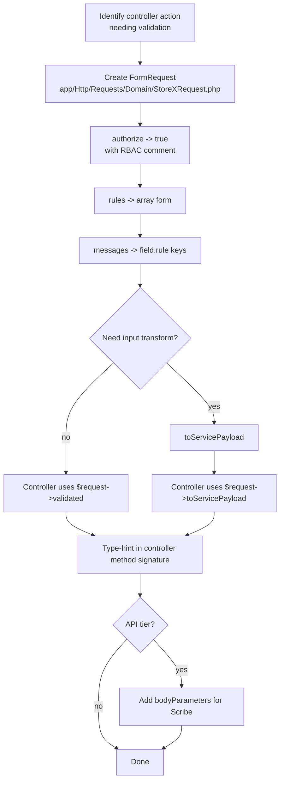

# Request Validation Conventions

> **Module:** Coding Standards (FormRequests + Rules)
> **Audience:** Engineers + AI assistants
> **Status:** Draft
> **Last reviewed:** 2026-08-03
> **Source of truth:** This file, grounded in `laravel/app/Http/Requests/**/*.php` (41 FormRequests) and `laravel/app/Rules/*.php` (3 custom Rule classes).

## 1. What is it?

The rules that govern how HTTP request input is validated before it reaches a service. RC_ERP_v2 uses Laravel **FormRequest** classes as the canonical pattern, with custom **Rule** classes for cross-field / cross-table checks that built-in rules cannot express. A small number of older controllers still use inline `$request->validate()` and are flagged for migration.

## 2. Why does it exist?

- **Separation of concerns.** Validation is HTTP-layer concern; business invariants are service-layer concern. FormRequests keep the two apart so controllers stay thin and services can be tested without HTTP.
- **Branch-isolation defense-in-depth.** Custom `WarehouseBelongsToBranch` and `WarehouseHasStock` rules enforce that the warehouse in the request actually belongs to the user's branch and has enough stock — before the service is called. This is a second line of defense behind the `branch.isolation` middleware and `BranchScope`.
- **Idempotency.** Several finalize/payment endpoints require an `idempotency_token` (UUID) validated in the FormRequest, then cached in the controller to make duplicate submissions return the original result.

## 3. When is it used?

- Every `store()` and `update()` controller action SHOULD type-hint a FormRequest.
- Every API `POST`/`PUT` endpoint MUST use a FormRequest (the API tier is the migration target).
- Custom Rule classes are used when validation requires a DB lookup, a cross-field computation, or a domain-specific error message.

## 4. Who uses it?

- **Controllers** type-hint the FormRequest as a method parameter; Laravel resolves + validates before the controller body runs.
- **API consumers** (mobile/external integrators) hit the same FormRequests via the `Api/V1/` controllers.
- **Scribe** (API doc generator) reads `bodyParameters()` to produce the API reference at `laravel/docs/api/API_REFERENCE.md`.

## 5. Related modules

- `coding-standards.md` — naming conventions for FormRequest classes.
- `service-layer-conventions.md` — services receive `$request->validated()` or `$request->toServicePayload()`.
- `error-handling.md` — how validation errors are rendered (422 JSON / redirect-back with errors).
- `../security/rbac-roles-permissions.md` (Phase 5) — why `authorize()` returns `true`.

## 6. Business rules (non-negotiable)

### 6.1 Inventory — 41 FormRequests + 3 custom Rules

Layout of `laravel/app/Http/Requests/`:
- Root: `StoreManualJournalRequest`, `StoreMoneyTransferRequest`, `StoreEmployeeTransactionRequest`, `StoreSupplierTransactionRequest`.
- `Api/V1/Sales/` (8): `FinalizeInvoiceRequest`, `StoreCartRequest`, `UpdateCartItemRequest`, etc.
- `Api/V1/StockTake/` (5): `CreateSessionRequest`, `SaveCountsRequest`, etc.
- `BranchDemand/` (6).
- `PurchaseOrder/` (3), `PurchaseReceive/` (4), `PurchaseReturn/` (4).
- `Sales/` (4), `SalesReturn/` (4).

Custom Rules in `laravel/app/Rules/`:
- `WarehouseBelongsToBranch`
- `WarehouseHasStock`
- `WarehouseTransferItemHasAvailableStock`

### 6.2 `authorize()` MUST return `true` — RBAC is handled by route middleware

- **MUST** return `true` from `authorize()`.
- **MUST NOT** put RBAC logic in `authorize()`. Role enforcement is the responsibility of the `role:` route middleware (see `../security/rbac-roles-permissions.md`, Phase 5) and the defense-in-depth `Gate::policy()` registration.

Exemplar — `laravel/app/Http/Requests/PurchaseOrder/StorePurchaseOrderRequest.php:21-24`:
```php
public function authorize(): bool
{
    return true; // RBAC handled by route middleware (admin, manager, warehouse_manager)
}
```

Same pattern on every FormRequest: `StoreManualJournalRequest.php:25-28`, `StoreBranchDemandRequest.php:15-18`, `SaveCountsRequest.php:20-23`, `FinalizeInvoiceRequest.php:19-22`, `StorePurchaseReceiveRequest.php:26-29`.

> **Why?** The route middleware `role:admin,manager` rejects unauthorized users BEFORE the FormRequest is instantiated. Putting the check in `authorize()` would duplicate it. Defense-in-depth is provided by `$this->authorize('<action>', Model::class)` in the controller (invoking the registered Policy), NOT by `authorize()` in the FormRequest.

### 6.3 `rules()` — array form is canonical (pipe-string is legacy)

- **MUST** use the **array form** `['required', 'integer', 'exists:branches,id']` for new FormRequests. It is multi-line, diff-friendly, and allows per-rule comments.
- **MAY** encounter pipe-string form `'required|integer|exists:branches,id'` in older modules (PurchaseOrder, BranchDemand) — leave as-is unless you are already editing the file, then convert.
- **MUST** use nested array rules for line items: `'items.*.product_id' => ['required', 'integer', 'exists:products,id']`.
- **MUST** use `nullable` for optional fields, `sometimes` for conditionally-applied rules.

Exemplar (array form — canonical) — `laravel/app/Http/Requests/StoreManualJournalRequest.php:32-39`:
```php
public function rules(): array
{
    return [
        'journal_date' => ['required', 'date'],
        'branch_id'    => ['required', 'integer', 'exists:branches,id'],
        'description'  => ['nullable', 'string', 'max:1000'],
        'status'       => ['required', 'in:draft,post'],
        'lines'        => ['required', 'string'], // JSON-encoded array of {ledger_id, debit, credit, description}
    ];
}
```

Exemplar (pipe-string form — legacy, do not propagate) — `laravel/app/Http/Requests/PurchaseOrder/StorePurchaseOrderRequest.php:28-42`:
```php
public function rules(): array
{
    return [
        'supplier_id'        => 'required|integer|exists:suppliers,id',
        'branch_id'          => 'required|integer|exists:branches,id',
        'items'              => 'required|array|min:1',
        'items.*.product_id' => 'required|integer|exists:products,id',
        'items.*.qty'        => 'required|numeric|min:0.001',
        'items.*.rate'       => 'required|numeric|min:0',
    ];
}
```

### 6.4 `messages()` — English, custom, field-specific

- **MUST** write custom messages in English for user-facing validation errors. There are **no Bangla (Bengali) validation messages** in the codebase today.
- **MUST** key messages by `field.rule` so the user sees the specific failure.
- **MAY** use `attributes()` instead of `messages()` to prettify field names only (`StoreManualJournalRequest.php:41-50`).

Exemplar — `laravel/app/Http/Requests/PurchaseOrder/StorePurchaseOrderRequest.php:44-62`:
```php
public function messages(): array
{
    return [
        'supplier_id.required'        => 'Please select a supplier.',
        'supplier_id.exists'          => 'The selected supplier is not active.',
        'items.*.product_id.required' => 'Each line must have a product.',
        'items.*.qty.min'             => 'Quantity must be greater than zero.',
    ];
}
```

### 6.5 `prepareForValidation()` — NOT used

- **MUST NOT** override `prepareForValidation()`. There are **zero** occurrences in `app/Http/Requests/`.
- **MUST** do input transformation in `toServicePayload()` (newer pattern, see §6.6) or in the controller before calling the service.

Rationale: keeping `prepareForValidation()` out of the codebase means the validated data shape always matches the rule definitions — no silent mutations between validation and service call.

### 6.6 `toServicePayload()` — the newer pattern

Newer FormRequests expose a `toServicePayload(): array` method that:
1. Calls `$this->validated()`.
2. Decodes JSON-encoded nested arrays (e.g. the `lines` JSON string → array).
3. Casts types explicitly (`(int)`, `(float)`, `(string)`).
4. Injects `auth()->id()` as `created_by`.

Exemplar — `laravel/app/Http/Requests/StoreManualJournalRequest.php:64-91`:
```php
public function toServicePayload(): array
{
    $validated = $this->validated();
    $lines = json_decode($validated['lines'], true);
    if (!is_array($lines)) { $lines = []; }
    $lines = array_map(function ($line) {
        return [
            'ledger_id'   => (int) ($line['ledger_id'] ?? 0),
            'debit'       => (float) ($line['debit'] ?? 0),
            'credit'      => (float) ($line['credit'] ?? 0),
            'description' => (string) ($line['description'] ?? ''),
        ];
    }, $lines);
    return [
        'journal_date' => $validated['journal_date'],
        'branch_id'    => (int) $validated['branch_id'],
        'post'         => $validated['status'] === 'post',
        'lines'        => $lines,
        'created_by'   => auth()->id(),
    ];
}
```

The controller then calls `$this->service->createJournal($request->toServicePayload())` instead of `$this->service->createJournal($request->validated())`. This isolates the "request shape → service shape" mapping in one place.

> **MUST** add `toServicePayload()` to new FormRequests whenever the validated array needs any transformation before reaching the service.

### 6.7 `bodyParameters()` — Scribe API docs

API-tier FormRequests expose `bodyParameters(): array` so Scribe can generate request-body examples in `laravel/docs/api/API_REFERENCE.md`.

Exemplar — `laravel/app/Http/Requests/Api/V1/Sales/FinalizeInvoiceRequest.php:49-62`:
```php
public function bodyParameters(): array
{
    return [
        'customer_id'           => ['description' => 'Customer for this invoice', 'example' => 1],
        'credit_limit_override' => ['description' => 'Set true to override credit limit (requires override_reason >= 10 chars)', 'example' => true],
        'idempotency_token'     => ['description' => 'Client-generated UUID to prevent duplicate invoice creation', 'example' => '550e8400-e29b-41d4-a716-446655440000'],
    ];
}
```

> **MUST** add `bodyParameters()` to every `Api/V1/` FormRequest. Web-tier FormRequests do not need it.

### 6.8 Custom Rule classes — `ValidationRule` interface (PHP 8.4 closure style)

- **MUST** implement `Illuminate\Contracts\Validation\ValidationRule` (the modern closure-based interface), NOT the deprecated `Illuminate\Contracts\Validation\Rule`.
- **MUST** declare `validate(string $attribute, mixed $value, Closure $fail): void` and call `$fail('message')` on validation failure.
- **MUST NOT** return a boolean.
- **MAY** accept constructor parameters (context ID, mode).

#### `WarehouseBelongsToBranch` — `laravel/app/Rules/WarehouseBelongsToBranch.php:31-88`

Defense-in-depth branch check with two modes:

```php
class WarehouseBelongsToBranch implements ValidationRule
{
    public function __construct(
        public ?int $contextId = null,
        public string $mode = 'invoice',   // 'invoice' or 'branch'
    ) {}

    public function validate(string $attribute, mixed $value, Closure $fail): void
    {
        $warehouseId = (int) $value;
        if ($warehouseId <= 0) { return; }
        $warehouse = Warehouse::select('id', 'branch_id', 'is_active')->find($warehouseId);
        if (!$warehouse) { $fail('The selected warehouse does not exist.'); return; }
        if (!$warehouse->is_active) { $fail('The selected warehouse is not active.'); return; }
        // ... resolve expected branch from mode ...
        if ((int) $warehouse->branch_id !== (int) $expectedBranchId) {
            $fail('The selected warehouse does not belong to your branch. '
                . 'Cross-branch transfers must go through Branch Demand.');
        }
    }
}
```

#### `WarehouseHasStock` — `laravel/app/Rules/WarehouseHasStock.php:26-89`

Pipeline-aware stock availability check. Resolves `StockAvailabilityService` lazily via `app()`:

```php
public function validate(string $attribute, mixed $value, Closure $fail): void
{
    // ...
    $availability = app(StockAvailabilityService::class);  // lazy resolution
    $demand = (float) $item->qty;
    $available = (float) $availability->getWarehouseAvailableQty(
        (int) $item->product_id, $warehouseId, (int) $this->invoiceId
    );
    if ($available < $demand) {
        $fail('Insufficient stock in this warehouse: available '
            . number_format($available, 2) . ', demanded ' . number_format($demand, 2) . '.');
    }
}
```

> The `app()` resolution inside the Rule is a deliberate exception to the no-`app()` rule (see `coding-standards.md` §6.2). Rule objects are instantiated by the validator with constructor data; using constructor DI for a service would conflict with PHP 8.4 readonly property promotion. The comment at `WarehouseHasStock.php:40` documents this.

#### `WarehouseTransferItemHasAvailableStock`

Same pattern as `WarehouseHasStock`, applied to warehouse-transfer line items.

### 6.9 FormRequest vs inline `$request->validate()`

| Pattern | Count | Status |
|---|---|---|
| Controllers type-hinting a FormRequest | 11 | Canonical — used by ManualJournal, PurchaseOrder, PurchaseReceive, PurchaseReturn, SalesReturn, BranchDemand, all `Api/V1/*` |
| Controllers using inline `$request->validate([...])` | 59 | Legacy — SalesInvoice, StockTake, older modules |

> **MUST** use FormRequest for new controllers. When extending an older controller that uses inline `validate()`, extract the rules into a FormRequest and share it across web + API tiers. The docblock at `StorePurchaseOrderRequest.php:9-13` documents the extraction pattern: "Extracted verbatim from the inline `$request->validate()` call that lived inside PurchaseOrderController::store() since Phase 2."

> **Known violation**: `SalesInvoiceController::finalize` (`laravel/app/Http/Controllers/Admin/SalesInvoiceController.php:160-176`) uses inline `validate()` despite `FinalizeInvoiceRequest` existing for the API tier with identical rules. Migrate to share the FormRequest. See `coding-standards.md` §13 item 8.

## 7. Technical implementation

### 7.1 FormRequest file skeleton (canonical)

```php
<?php

namespace App\Http\Requests\Sales;

use Illuminate\Foundation\Http\FormRequest;
use App\Rules\WarehouseBelongsToBranch;

class StoreSalesOrderRequest extends FormRequest
{
    public function authorize(): bool
    {
        return true; // RBAC handled by route middleware (salesman, manager, admin)
    }

    public function rules(): array
    {
        return [
            'customer_id'  => ['required', 'integer', 'exists:customers,id'],
            'branch_id'    => ['required', 'integer', 'exists:branches,id'],
            'warehouse_id' => ['required', 'integer', new WarehouseBelongsToBranch(mode: 'branch')],
            'order_date'   => ['required', 'date'],
            'items'        => ['required', 'array', 'min:1'],
            'items.*.product_id' => ['required', 'integer', 'exists:products,id'],
            'items.*.qty'        => ['required', 'numeric', 'min:0.001'],
            'items.*.rate'       => ['required', 'numeric', 'min:0'],
        ];
    }

    public function messages(): array
    {
        return [
            'customer_id.required'        => 'Please select a customer.',
            'customer_id.exists'          => 'The selected customer is not active.',
            'items.*.product_id.required' => 'Each line must have a product.',
            'items.*.qty.min'             => 'Quantity must be greater than zero.',
        ];
    }

    public function toServicePayload(): array
    {
        $validated = $this->validated();
        return [
            'customer_id'  => (int) $validated['customer_id'],
            'branch_id'    => (int) $validated['branch_id'],
            'warehouse_id' => (int) $validated['warehouse_id'],
            'order_date'   => $validated['order_date'],
            'items'        => $validated['items'],
            'created_by'   => auth()->id(),
        ];
    }
}
```

### 7.2 Controller usage

```php
public function store(StoreSalesOrderRequest $request)
{
    $payload = $request->toServicePayload();
    try {
        $order = $this->service->createOrder($payload);
        return redirect()->route('admin.sales-orders.show', $order)
            ->with('success', "Sales order {$order->code} created.");
    } catch (\Throwable $e) {
        return back()->withInput()->with('error', $e->getMessage());
    }
}
```

### 7.3 Validation error rendering

Laravel's default `ValidationException` handler renders:
- **JSON / API** (`$request->expectsJson()` or `api/*` route): HTTP 422 with `{"message": "...", "errors": {"field": ["message", ...]}}`.
- **Web**: redirect back with `->withErrors()` and `->withInput()`. Blade renders `$errors->first('field')` or `$errors->all()`.

No custom rendering is registered for `ValidationException` in `bootstrap/app.php` — the Laravel default is used. See `error-handling.md` §5.

## 8. Important database tables

N/A — validation rules reference tables via the `exists:table,column` rule, but no tables are owned by this layer.

## 9. Related services

N/A — services receive the validated payload; they do not re-validate (except for business invariants like period-closed, credit-limit, stock-availability — those throw `RuntimeException`, see `service-layer-conventions.md` §6).

## 10. Related models

Custom Rules reference models for `exists` checks:
- `WarehouseBelongsToBranch` → `App\Models\Warehouse`.
- `WarehouseHasStock` → `App\Services\Stock\StockAvailabilityService` (which reads `App\Models\WarehouseStock`).

## 11. Important workflows

### 11.1 Add a new FormRequest



### 11.2 Migrate inline `validate()` to a FormRequest

1. Create `Store<Entity>Request` in the matching `app/Http/Requests/<Domain>/` folder.
2. Copy the inline rules array verbatim (converting pipe-string to array form while you are there).
3. Add `authorize(): true` with a comment naming the route middleware.
4. Add `messages()` if the controller had custom messages.
5. Replace `$request->validate([...])` in the controller with `Store<Entity>Request $request` type-hint.
6. If the controller did any post-validation transformation, move it to `toServicePayload()`.
7. Run the existing tests — they should pass unchanged.

## 12. Known edge cases

- **JSON-encoded nested arrays.** Some legacy forms submit line items as a JSON string in a single field (e.g. `lines` in `StoreManualJournalRequest`). The `rules()` validates `lines` as `['required', 'string']`, then `toServicePayload()` decodes it. New forms SHOULD submit nested arrays directly (`items.*.field` rules) — do not propagate the JSON-string pattern.
- **`exists` rule and soft-deletes.** The `exists:branches,id` rule does NOT automatically exclude soft-deleted rows. If a branch is soft-deleted, `exists` will still pass for its ID. Add `exists:branches,id,deleted_at,NULL` when this matters, OR ensure the upstream UI only offers active rows.
- **`WarehouseHasStock` race condition.** The Rule checks availability at validation time, but the service re-checks inside `DB::transaction` with `lockForUpdate()`. The Rule is a UX guard (fail fast with a friendly message); the service is the authoritative guard. Both MUST exist.
- **`idempotency_token` validation.** The Rule validates the token is a UUID; the controller caches the result. If a request with a duplicate token arrives, the controller returns the cached result with `idempotent_replay: true` (see `coding-standards.md` §11 exemplar and `docs/REMEDIATION_LOG.md:240`).
- **Custom Rule `app()` resolution.** `WarehouseHasStock` resolves `StockAvailabilityService` via `app()` because Rule objects cannot use constructor DI for services under PHP 8.4 readonly promotion. This is the ONLY sanctioned `app()` call outside traits. See `coding-standards.md` §6.2.

## 13. Future improvements

1. **Standardize on array-form `rules()`.** Convert the ~10 older FormRequests that use pipe-string to array form. Low-risk, diff-friendly.
2. **Migrate the 59 inline-`validate()` controllers to FormRequests.** Priority: SalesInvoice (finalize, create), StockTake (create, save-counts), Damage (create, submit, approve). Each migration is mechanical.
3. **Share FormRequests across web + API tiers.** `FinalizeInvoiceRequest` already serves the API; route the web `SalesInvoiceController::finalize` through it instead of duplicating rules inline.
4. **Consider Bangla (Bengali) validation messages.** The ERP serves Bangladeshi users; `config/branches.php` already carries `name_bn` for the 4 branches. A `lang/bn/validation.php` file would localize messages. Not currently present.
5. **Add `prepareForValidation()` discipline** IF a compelling case arises. Currently none — the `toServicePayload()` pattern covers transformation needs.

## 14. Verification commands

```bash
# Count FormRequests
find laravel/app/Http/Requests -name '*.php' | wc -l   # ~41

# Confirm authorize() always returns true
grep -rn 'public function authorize' laravel/app/Http/Requests/ | wc -l  # ~41
grep -rn 'return true' laravel/app/Http/Requests/ | wc -l                 # should match

# List custom Rule classes
ls laravel/app/Rules/   # 3 files

# Find controllers still using inline validate (migration candidates)
grep -rln '\$request->validate' laravel/app/Http/Controllers/ | wc -l     # ~59

# Regenerate Scribe API docs from bodyParameters()
cd laravel && php artisan scribe:generate
```
