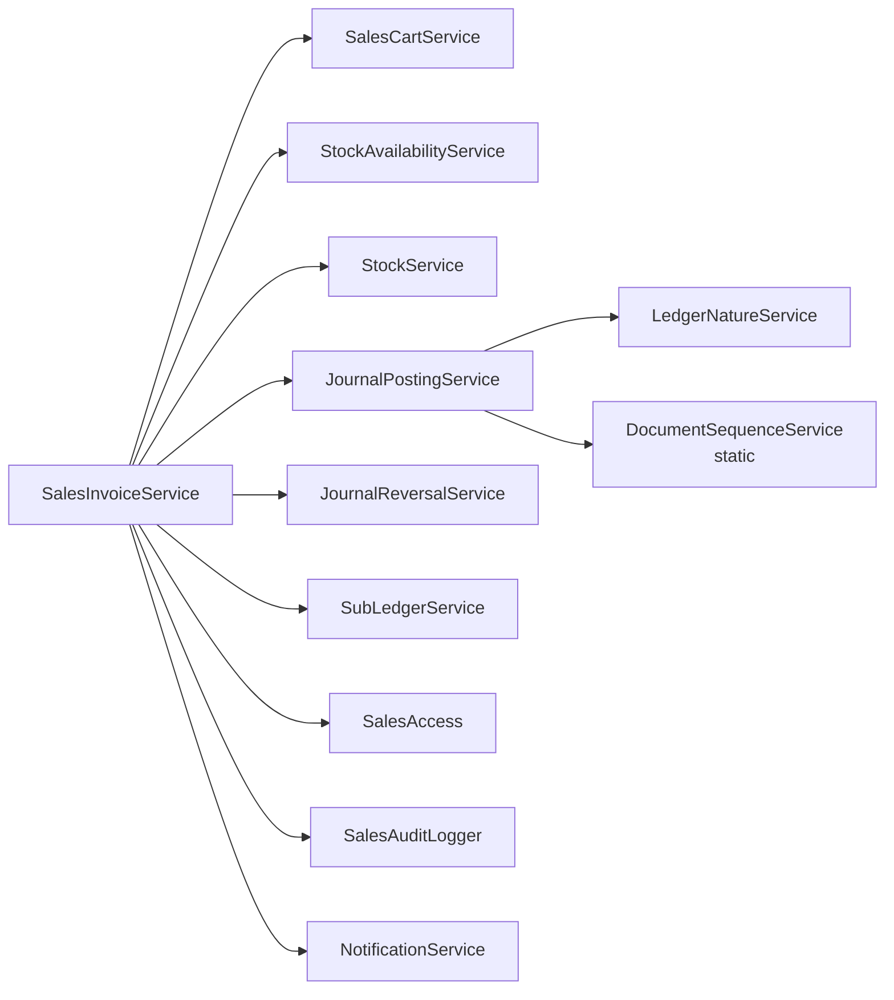
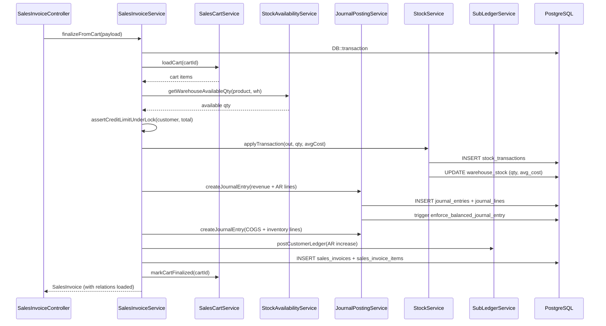

# Service Layer Conventions

> **Module:** Coding Standards (service layer)
> **Audience:** Engineers + AI assistants
> **Status:** Draft
> **Last reviewed:** 2026-08-03
> **Source of truth:** This file, grounded in `laravel/app/Services/**/*.php` (78 services across 14 namespaces).

## 1. What is it?

The rules that govern how service classes — the home of **all** business logic in RC_ERP_v2 — are structured, instantiated, named, transacted, and composed. Controllers are thin; services own every journal post, stock movement, invoice finalization, reversal, and reconciliation.

## 2. Why does it exist?

- **Accounting integrity.** Every journal entry MUST balance (Dr=Cr), reference an active ledger, fall in an open period, and be reversible. Concentrating that logic in services (rather than controllers or models) makes the invariants enforceable and reviewable. See `../accounting/journal-posting-rules.md` (Phase 6, pending).
- **Reversal-over-deletion.** To undo a posted transaction, the service creates a reversal — it never mutates the original. This requires a single owner per operation; services are that owner.
- **Branch isolation.** Services operate on data already scoped by middleware/global scopes (see `../architecture/branch-isolation-rls.md`); they MUST NOT re-implement scoping.

## 3. When is it used?

Every time business state changes: creating/finalizing/reversing a sales invoice, posting a journal entry, moving stock, reconciling a sub-ledger, closing a period, generating a document sequence, approving a damage claim, settling an inter-branch demand.

Read-only reporting also goes through services (`ReportService`, `CteReportService`, `DamageReportService`) so SQL is centralized and auditable.

## 4. Who uses it?

- **Controllers** call services (constructor DI). Controllers never write to `DB::table()` directly.
- **Other services** call services (constructor DI) — composition is the norm (e.g. `SalesInvoiceService` depends on `JournalPostingService`, `StockService`, `SubLedgerService`, etc.).
- **Artisan commands** call services (`SubLedgerReconcile`, `CancelStaleSalesDrafts`, `JournalReplayVerify`).
- **API controllers** call the same services as web controllers — never duplicate logic.

## 5. Related modules

- `coding-standards.md` — overview + naming.
- `../architecture/layered-design.md` — where services sit in the layer cake.
- `../architecture/module-map.md` — every service namespace.
- `error-handling.md` — how services throw.
- `config-driven-rules.md` — services read business rules from `config/`, not hardcoded.

## 6. Business rules (non-negotiable)

### 6.1 Inventory — 78 services, 14 namespaces

| Namespace | Count | Representative services |
|---|---|---|
| `Stock/` | 22 | StockService, StockTakeService, WarehouseTransferService, DamageService, StockAdjustmentService, AbcClassificationService, UomConversionService |
| `Accounting/` | 17 | JournalPostingService, JournalReversalService, SubLedgerService, LedgerNatureService, DocumentSequenceService, AccountingPeriodService, FiscalYearService, DepreciationService, BankReconciliationService, MoneyTransferService, ManualJournalService, EmployeeTransactionService, SupplierTransactionService, OtherIncomeService, OtherExpenseService |
| `Sales/` | 10 | SalesInvoiceService, SalesChallanService, SalesCartService, SalesReturnService, CustomerPaymentService, CommissionService, SalesAccess, SalesAuditLogger |
| `BranchDemand/` | 7 | BranchDemandService, BranchIntercompanyService, BranchDemandRepricingService |
| `Auth/` | 6 | PasswordPolicy, AccountLockout, CredentialVersion, UserAuditLogger, LoginRateLimiter, RememberMeManager |
| `Purchase/` | 4 | PurchaseOrderService, PurchaseReceiveService, PurchaseReturnService, PurchaseAuditService |
| `Reports/` | 3 | ReportService, DamageReportService, CteReportService |
| `Notification/` | 2 | NotificationService, ListenNotifyService |
| `Budgeting/` | 2 | BudgetService, DimensionReportingService |
| `MasterData/` | 1 | CodeGenerator |
| `Export/` | 1 | CsvExporter |
| `Consolidation/` | 1 | ConsolidationService |
| `Compliance/` | 1 | SystemPolicyService |
| `Approval/` | 1 | ApprovalService |
| (root `Services/`) | 1 | MenuService |

### 6.2 Class structure

- **MUST** be a plain `class` (not `final`). The codebase uses no `final` on services.
- **MUST NOT** extend a base service class. **There is no `BaseService`.** Every service is standalone.
- **MUST** use constructor dependency injection with PHP 8.0+ promoted properties.

Exemplar — `laravel/app/Services/Accounting/JournalPostingService.php:29-33`:
```php
class JournalPostingService
{
    public function __construct(
        private LedgerNatureService $natureService
    ) {}
```

Exemplar with many dependencies — `laravel/app/Services/Sales/SalesInvoiceService.php:47-57`:
```php
public function __construct(
    private SalesCartService $cartService,
    private StockAvailabilityService $availabilityService,
    private StockService $stockService,
    private JournalPostingService $journalPosting,
    private JournalReversalService $journalReversal,
    private SubLedgerService $subLedger,
    private SalesAccess $salesAccess,
    private SalesAuditLogger $auditLogger,
    private NotificationService $notifications
) {}
```

Stateless services may omit the constructor entirely — `laravel/app/Services/Purchase/PurchaseOrderService.php:27` and `laravel/app/Services/Stock/StockService.php:28` declare no constructor.

### 6.3 Method signatures

- **MUST** declare return types. Common shapes:
  - `int` — created entity ID (`createJournalEntry(...): int`).
  - Model instance — `SalesInvoice finalizeFromCart(...): SalesInvoice`.
  - `void` — validators (`validatePeriod(...): void`).
  - `?int` / `?object` — nullable lookups.
  - `array` — query results, payloads.
- **MUST** accept typed arrays for payloads (NOT DTOs — see §6.6) with a PHPDoc `@param array $entry { key: type, ... }` shape block.
- **MUST** write PHPDoc on every public method: `@param`, `@return`, `@throws`.

Exemplar — `laravel/app/Services/Accounting/JournalPostingService.php:39-60`:
```php
/**
 * Create a balanced journal entry (Dr = Cr).
 *
 * @param array $entry {
 *     @var string      $entry_date   YYYY-MM-DD, must fall in an open period.
 *     @var string      $reference_type  e.g. 'sales_invoice', 'purchase_receive'.
 *     @var int         $reference_id    FK to the source transaction.
 *     @var int         $branch_id       Owning branch.
 *     @var int|null    $created_by      User ID.
 *     @var string|null $description     Memo.
 * }
 * @param array $lines  Each: { ledger_id: int, debit: float, credit: float, description?: string }
 * @return int  The new journal_entries.id.
 * @throws \RuntimeException  If lines empty, not balanced, period closed, or ledger inactive.
 */
public function createJournalEntry(array $entry, array $lines): int
```

### 6.4 Transaction handling — `DB::transaction(closure)` is universal

- **MUST** wrap multi-statement writes in `DB::transaction(function () use (...) { ... })`.
- **MUST NOT** use manual `DB::beginTransaction()` / `commit()` / `rollBack()`. There are **zero** occurrences in `app/Services/`.
- **MUST NOT** use `DB::afterCommit()`. There are **zero** occurrences in the entire `app/`.
- **SHOULD** use `lockForUpdate()` inside the transaction for rows that must not race (e.g. the original entry being reversed, the warehouse stock row, the document-sequence counter). 25 services do this.

Exemplar — `laravel/app/Services/Accounting/JournalPostingService.php:175-200`:
```php
public function reverseJournalEntry(int $journalEntryId, int $reversedBy, string $reason = '', ?string $entryDate = null): int
{
    return DB::transaction(function () use ($journalEntryId, $reversedBy, $reason, $entryDate) {
        $original = DB::table('journal_entries')
            ->where('id', $journalEntryId)
            ->lockForUpdate()
            ->first();
        if (!$original) {
            throw new \RuntimeException("Journal entry {$journalEntryId} not found.");
        }
        // ... build swapped Dr/Cr lines ...
        $reversalId = $this->createJournalEntry([...], $reversalLines);
        DB::table('journal_entries')->where('id', $journalEntryId)->update([
            'is_reversed'    => true,
            'reversed_by'    => $reversedBy,
            'reversed_at'    => now(),
            'reversal_of_entry_id' => $reversalId,
        ]);
        DB::table('journal_posting_logs')->insert([...]);
        return $reversalId;
    });
}
```

### 6.5 Advisory locks for cross-row serialization

Two services use PostgreSQL advisory locks to serialize operations that `lockForUpdate()` cannot express:

- `DocumentSequenceService` — single-int `pg_advisory_xact_lock(hash)` to generate gap-free document codes (journal entry no, invoice code, PO code). The lock is transaction-scoped (released on commit/rollback).
- `StockTakeService` — two-int `pg_advisory_xact_lock(namespace, id)` with `POST_ADVISORY_LOCK_NAMESPACE = 0x53544B50` to freeze a warehouse during stock count posting.

```php
DB::statement('SELECT pg_advisory_xact_lock(?)', [$hashedKey]);
```

> **MUST** use the `_xact_` (transaction-scoped) variant, never the session-scoped `pg_advisory_lock()` — the latter leaks across requests on persistent connections.

### 6.6 No DTOs — typed arrays with PHPDoc

- **MUST NOT** create `app/DTO/` or `app/ValueObjects/` directories. They do not exist (except for the Phase 12 anti-corruption layer `app/Archive/DTOs/`, which is a deliberate isolation boundary).
- **MUST** pass associative arrays between controller → service and service → service.
- **MUST** document the array shape in PHPDoc `{ @var key: type }` blocks (see §6.3 exemplar).

Rationale: the codebase values directness over type ceremony. Array payloads map 1:1 to validated request data and to `DB::table()->insert()` column lists, avoiding a mapping layer.

### 6.7 Auth context — pass as a parameter, do not read the facade

- **MUST** accept `created_by`, `reversed_by`, `approved_by` etc. as an explicit `int` parameter. The controller injects `auth()->id()`.
- **MUST NOT** call `Auth::user()`, `auth()->id()`, or `session('branch_id')` inside a service. These belong to the HTTP layer.

Exemplar (correct) — `laravel/app/Services/Accounting/JournalPostingService.php:60`:
```php
public function createJournalEntry(array $entry, array $lines): int
// $entry['created_by'] is set by the controller from auth()->id()
```

> **Known violations** (flagged for cleanup, see `coding-standards.md` §13 item 9): `BudgetService`, `ApprovalService`, `SupplierTransactionService`, `MoneyTransferService`, `SalesAccess` read `auth()->id()` / `session('branch_id')` directly. `UserAuditLogger` is an acceptable exception (cross-cutting logger). New code MUST follow the parameter-passing pattern.

### 6.8 Writes via `DB::table()`, not Eloquent

- **SHOULD** use `DB::table('x')->insert([...])` / `insertGetId([...])` / `where(...)->update([...])` inside transactions rather than `Model::create()`. Rationale: explicit column order, no mass-assignment surprises, no model events firing inside a ledger write.
- **MAY** use Eloquent for reads (`Model::query()->with(...)->paginate()`) and for the final return shape (`SalesInvoice::find($id)`).

Exemplar — `laravel/app/Services/Accounting/JournalPostingService.php:107-145`:
```php
$entryId = DB::table('journal_entries')->insertGetId([
    'entry_no'       => $this->generateEntryNo($entry['entry_date']),
    'entry_date'     => $entry['entry_date'],
    'reference_type' => $entry['reference_type'],
    'reference_id'   => $entry['reference_id'],
    'branch_id'      => $entry['branch_id'],
    'description'    => $entry['description'] ?? null,
    'is_reversed'    => false,
    'created_by'     => $entry['created_by'] ?? null,
    'created_at'     => now(),
    'updated_at'     => now(),
]);
DB::table('journal_lines')->insert(array_map(fn ($l) => [...], $lines));
```

### 6.9 Raw SQL — heredoc for complex queries

- **MAY** use `DB::select(<<<SQL ... SQL, [...$bindings])` heredoc for verification queries and CTEs that the query builder cannot express cleanly (4 services: `JournalPostingService`, `JournalReversalService`, `AccountingPeriodService`, `StockAdjustmentAuditService`).
- **MAY** use `DB::raw(...)` for select expressions (43 services do).
- **MUST** use parameter bindings (`?` or named `:name`) — never string-concatenate user input into SQL.

Exemplar — `laravel/app/Services/Accounting/JournalPostingService.php:417-426`:
```php
$rows = DB::select(<<<SQL
    SELECT je.id, je.entry_no,
           COALESCE(SUM(jl.debit),  0) AS total_debit,
           COALESCE(SUM(jl.credit), 0) AS total_credit
    FROM   journal_entries je
    JOIN   journal_lines   jl ON jl.journal_entry_id = je.id
    WHERE  je.is_reversed = false
    GROUP  BY je.id, je.entry_no
    HAVING ABS(COALESCE(SUM(jl.debit), 0) - COALESCE(SUM(jl.credit), 0)) > ?
SQL, [config('accounting.gl_reconciliation_tolerance', 0.02)]);
```

### 6.10 Static helpers — three exceptions

Three services expose static methods and are called without DI:

| Service | Static method | Used by |
|---|---|---|
| `DocumentSequenceService` | `::nextCode(doc_type:, prefix:, datePart:, padLength:, periodKey:)` | `JournalPostingService`, `PurchaseOrderService`, `ManualJournalService` |
| `UserAuditLogger` | `::log(userId:, action:, targetUserId:, details:)` | `PurchaseOrderService`, most Admin controllers |
| `CodeGenerator` | `::productCode()`, `::customerCode()`, `::supplierCode()`, `::employeeCode()`, `::ledgerCode()`, `::warehouseCode()` | Master-data controllers |

> **MUST NOT** add new static helpers without strong justification. These three predate the DI discipline and are tolerated because they are stateless pure functions. New services MUST be instance methods resolved via constructor DI.

### 6.11 Naming — verb+noun

| Pattern | Examples |
|---|---|
| `create<Entity>` | `createJournalEntry`, `createOrder`, `createSession` |
| `<verb><Entity>` for lifecycle | `finalizeFromCart`, `cancelInvoice`, `postSession`, `reverseSession`, `reOpen` |
| `reverse<Entity>` | `reverseJournalEntry`, `reverseTransaction` |
| `validate<Thing>` | `validatePeriod`, `validateLines` |
| `find<Entity>By<Criterion>` | `findJournalEntryByReference` |
| `lookup<Thing>` | `lookupLedgerByNature` |
| `get<Entity>With<Parts>` | `getEntryWithLines`, `getTotalDebitsCredits` |
| `generate<Token>` | `generateEntryNo`, `generateInvoiceCode` |
| `verify<Invariant>` | `verifyAllEntriesBalanced`, `verifyStockNonNegative` |
| `assert<Condition>` | `assertCreditLimitUnderLock` (throws on failure, no return) |
| `check<Rule>` | `checkCreditLimit`, `checkPeriodOpen` |
| `apply<Transaction>` | `applyTransaction` (stock), `applySystemPolicy` |
| `lock<Entity>ForUpdate` | `lockBranchProductsForUpdate` |

## 7. Technical implementation

### 7.1 Service resolution

Services are auto-resolved by the Laravel container via constructor DI. **7 are registered as singletons** in `AppServiceProvider::register()` because they are stateful or expensive to construct:

- `LedgerNatureService` — caches the ledger-nature map.
- `SubLedgerService` — caches sub-ledger resolution.
- `JournalReversalService` — holds reversal-planning state.
- `SalesAuditLogger`, `MenuService`, `SystemPolicyService`, `LegacySessionBridge`.

> **MUST** register a new service as a singleton in `AppServiceProvider::register()` ONLY if it caches state across calls. Otherwise let the container resolve a fresh instance per request.

### 7.2 Inter-service composition

Services depend on other services via constructor DI. Example dependency graph for `SalesInvoiceService::finalizeFromCart`:



### 7.3 Reversal pattern (canonical)

Every reversible operation follows the same shape. See `../accounting/reversal-vs-cancellation.md` (Phase 6, pending) for the full treatment:

1. Open `DB::transaction`.
2. `lockForUpdate()` the original row.
3. Assert the original is not already reversed.
4. Build the mirrored operation (swapped Dr/Cr for journals; opposite-sign qty for stock).
5. Create the reversal via the same `create<Entity>` method (so all invariants fire).
6. Mark the original `is_reversed = true`, set `reversed_by`, `reversed_at`, `reversal_of_entry_id` / `reversal_of_transaction_id`.
7. Insert into the audit log table (`journal_posting_logs`, `stock_transaction_audit`, etc.).
8. Return the new reversal ID.

## 8. Important database tables

N/A — see `../database/schema-overview.md`. Services own the writes; tables are documented per-module in later phases.

## 9. Related services (exemplars by domain)

| Domain | Anchor service | File |
|---|---|---|
| Accounting (journal post) | `JournalPostingService` | `laravel/app/Services/Accounting/JournalPostingService.php` |
| Accounting (reversal) | `JournalReversalService` | `laravel/app/Services/Accounting/JournalReversalService.php` |
| Accounting (period) | `AccountingPeriodService` | `laravel/app/Services/Accounting/AccountingPeriodService.php` |
| Accounting (sequence) | `DocumentSequenceService` | `laravel/app/Services/Accounting/DocumentSequenceService.php` |
| Stock (ledger) | `StockService` | `laravel/app/Services/Stock/StockService.php` |
| Stock (take) | `StockTakeService` | `laravel/app/Services/Stock/StockTakeService.php` |
| Sales (invoice) | `SalesInvoiceService` | `laravel/app/Services/Sales/SalesInvoiceService.php` |
| Purchase (order) | `PurchaseOrderService` | `laravel/app/Services/Purchase/PurchaseOrderService.php` |
| Compliance | `SystemPolicyService` | `laravel/app/Services/Compliance/SystemPolicyService.php` |
| Audit | `UserAuditLogger` | `laravel/app/Services/Auth/UserAuditLogger.php` |

## 10. Related models

N/A — models are documented in `model-conventions.md`.

## 11. Important workflows

### 11.1 Finalize a sales invoice (end-to-end)



### 11.2 Reverse a journal entry

See §6.4 exemplar and `../accounting/reversal-vs-cancellation.md` (Phase 6).

## 12. Known edge cases

- **Partial rollback on audit-log failure.** The `AuditableMasterData` trait (used by 37 models) catches `\Throwable` inside its Eloquent-event listener and **re-throws if inside a transaction** (because PostgreSQL enters an aborted state `25P02` after any in-transaction error) but **swallows + logs** outside a transaction. See `error-handling.md` §6.3. Services that mutate audited models inside `DB::transaction` therefore propagate audit failures as transaction rollbacks — this is correct.
- **`StockTransaction` and `JournalLine` have `timestamps = false`.** They are append-only ledger rows; only `created_at` is set. Services MUST NOT call `$model->save()` expecting `updated_at` to refresh on these.
- **`Reference types` are a closed list.** `StockTransaction::REFERENCE_TYPES` (14 values) and the DB `CHECK` constraint must agree. Adding a new reference type requires both a migration and a constant edit. See `../inventory/stock-ledger.md` (Phase 8, pending).
- **Document sequence gap-free guarantee.** `DocumentSequenceService::nextCode` uses `pg_advisory_xact_lock`. Do NOT bypass it by computing codes in application code — you will create gaps under concurrency.

## 13. Future improvements

- **Extract `SalesInvoiceController::finalize` inline validation into `FinalizeInvoiceRequest`.** The API tier already has the FormRequest; the web tier duplicates the rules inline.
- **Remove `auth()->id()` reads from `BudgetService`, `ApprovalService`, `SupplierTransactionService`, `MoneyTransferService`, `SalesAccess`.** Pass as parameter instead.
- **Consider a `Dto` for the largest payloads** (sales invoice finalization, journal entry with lines) IF the array-shape PHPDoc becomes unwieldy. Not currently warranted.
- **Standardize the `rules()` form** in FormRequests — see `request-validation.md` §13.

## 14. Verification commands

```bash
# Count services per namespace
find laravel/app/Services -mindepth 1 -maxdepth 1 -type d -exec sh -c \
  'echo "$(find "$1" -name "*.php" | wc -l) $1"' _ {} \; | sort -rn

# Confirm zero manual begin/commit
grep -rn "DB::beginTransaction" laravel/app/Services/   # expects 0 hits
grep -rn "DB::afterCommit"     laravel/app/             # expects 0 hits

# Confirm RuntimeException is the canonical throw
grep -rc "throw new \\\\RuntimeException" laravel/app/Services/ | grep -v ':0' | wc -l  # ~34 services

# Replay-verify the ledger (end-to-end integrity check)
cd laravel && php artisan journal:replay-verify
cd laravel && php artisan subledger:reconcile
```
