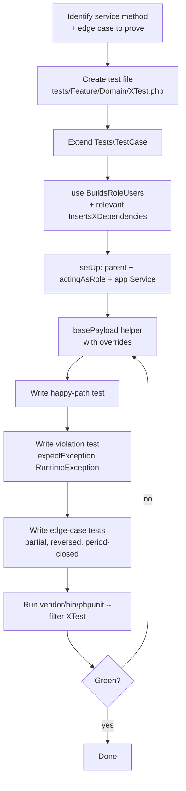

# Testing Standards

> **Module:** Coding Standards (tests)
> **Audience:** Engineers + AI assistants
> **Status:** Draft
> **Last reviewed:** 2026-08-03
> **Source of truth:** This file, grounded in `laravel/tests/` (107 test files + 12 helper traits + 1 base `TestCase`), `laravel/database/factories/` (14 factories), `laravel/database/seeders/` (2 seeders), and `laravel/phpunit.xml`.

## 1. What is it?

The rules that govern how automated tests are written, organized, and run in RC_ERP_v2. The project uses **PHPUnit 11.5** (NOT Pest), runs against a **real PostgreSQL test database** (`rcerp_test`), and uses the **`DatabaseTransactions`** trait (NOT `RefreshDatabase`) for speed. Test data is built via **factories** for simple master-data and via **`InsertsXDependencies` helper traits** for transactional tables with many NOT NULL FKs.

## 2. Why does it exist?

- **Accounting integrity needs proof.** The ERP enforces Dr=Cr, reversal-over-mutation, moving-average cost, and branch isolation. These invariants are too safety-critical to leave untested — every posting rule has a dedicated test that proves both the happy path and the violation path.
- **Speed.** The baseline migration runs 7 large raw PostgreSQL DDL files plus 160 migrations. Replaying that per test (the `RefreshDatabase` default) would make the suite unusably slow. `DatabaseTransactions` rolls back after each test, leaving the schema intact.
- **Legacy-schema fidelity.** Many tables have NOT NULL columns and FK chains that Eloquent factories cannot satisfy without pulling in an entire module. The `InsertsXDependencies` helper traits use `DB::table()->insertGetId()` with the minimum required columns — faster and more focused than factory chains.

## 3. When is it used?

- Before merging any change to a service, model, controller, or migration.
- Nightly (manually today; no CI yet — see `coding-standards.md` §13 item 3) to catch drift.
- Before release: the full suite is the gate. `docs/SETUP_GUIDE.md` header reports **1185 tests · 2681 assertions · 87.93% coverage**.

## 4. Who uses it?

- **Engineers** adding features — MUST add a test for every new service method and every new business rule.
- **AI assistants** generating code — MUST run the existing tests after changes and add a test for any new invariant.
- **Reviewers** — MUST require a green test run before approving.

## 5. Related modules

- `coding-standards.md` — naming conventions for test classes.
- `service-layer-conventions.md` — services are the primary test target.
- `model-conventions.md` — factories + `HasFactory`.
- `../database/migrations-conventions.md` — why the baseline migration is slow.

## 6. Business rules (non-negotiable)

### 6.1 Test runner — PHPUnit 11.5 (NOT Pest)

- **MUST** use PHPUnit. `laravel/composer.json:23` pins `phpunit/phpunit: ^11.5`.
- **MUST NOT** introduce Pest. Despite `composer.json:63-66` allowing `pestphp/pest-plugin`, **Pest is not installed** and there is no `Pest.php` / `tests/Pest.php`. All tests use `class FooTest extends Tests\TestCase` with `public function test_foo(): void` methods.
- **MUST** declare `: void` return type on every test method (PHPUnit 10+ requirement).

### 6.2 Test DB — real PostgreSQL `rcerp_test`

- **MUST** run tests against a dedicated PostgreSQL database `rcerp_test`, NOT in-memory SQLite.
- The DB MUST already exist with the full RC_ERP schema applied before the suite runs.

`laravel/phpunit.xml:30-39`:
```xml
<env name="DB_CONNECTION" value="pgsql"/>
<env name="DB_HOST" value="127.0.0.1"/>
<env name="DB_PORT" value="5432"/>
<env name="DB_DATABASE" value="rcerp_test"/>
<env name="DB_USERNAME" value="rcerp_app"/>
```

Comment at `phpunit.xml:30-33`: "Tests use a dedicated test database to avoid polluting the dev DB... must already exist and have the full RC_ERP schema applied."

### 6.3 `DatabaseTransactions` — NOT `RefreshDatabase`

- **MUST** use the `DatabaseTransactions` trait on the base `TestCase`.
- **MUST NOT** use `RefreshDatabase`. The baseline migration `2025_01_01_000001_create_rcerp_schema.php` executes large raw PostgreSQL SQL files which are slow to replay per-test.

`laravel/tests/TestCase.php:13-30`:
```php
/**
 * Base test case. DatabaseTransactions is used instead of RefreshDatabase
 * because the project's baseline migration executes large raw PostgreSQL SQL
 * files which are slow to replay per-test. Transactions roll back after every
 * test, leaving the dev DB pristine.
 */
abstract class TestCase extends BaseTestCase
{
    use DatabaseTransactions;

    protected function setUp(): void
    {
        parent::setUp();
        $this->withoutMiddleware([
            \App\Http\Middleware\SyncLegacySession::class,
            \App\Http\Middleware\CheckCredentialVersion::class,
            \App\Http\Middleware\CheckSystemPolicy::class,
        ]);
        $this->withSession(['credential_version' => '1']);
    }
}
```

> The `setUp()` disables three middleware that depend on Redis / legacy session state (which tests do not bootstrap) and seeds a fake `credential_version` session key so `CheckCredentialVersion` would pass even if it were not disabled.

### 6.4 Test environment — `phpunit.xml` env overrides

| Env var | Value | Why |
|---|---|---|
| `APP_ENV` | `testing` | Standard. |
| `BCRYPT_ROUNDS` | `4` | Fast password hashing. |
| `CACHE_DRIVER` | `array` | No Redis dependency for cache. |
| `SESSION_DRIVER` | `array` | No Redis dependency for sessions. |
| `QUEUE_DRIVER` | `sync` | Jobs run inline (there are none today anyway). |
| `MAIL_MAILER` | `array` | No real email. |
| `PREDIS_DISABLED` | `true` | Disables the Redis-backed `LegacySessionBridge`. |

### 6.5 Test file layout

```
laravel/tests/
├── TestCase.php                          # Base class (DatabaseTransactions + setUp)
├── Helpers/                              # 12 reusable traits
│   ├── BuildsRoleUsers.php               # Branch + Employee + User factory chain
│   ├── IssuesApiTokens.php               # Sanctum token helper
│   ├── InsertsBranchDependencies.php     # DB::table inserters for branches/customers/invoices
│   ├── InsertsWarehouseDependencies.php
│   ├── InsertsEmployeeDependencies.php
│   ├── InsertsBranchDemandDependencies.php
│   ├── InsertsProductDependencies.php
│   ├── InsertsCustomerDependencies.php
│   ├── InsertsBankDependencies.php
│   ├── InsertsLedgerDependencies.php
│   ├── InsertsSupplierDependencies.php
│   └── InsertsUserDependencies.php
├── Feature/                              # 73 feature tests (HTTP + service end-to-end)
│   ├── BranchCrudTest.php
│   ├── StockTake/                        # 15 stock-take tests
│   ├── WarehouseTransfer/                # 9 transfer tests
│   ├── Api/                              # 10 API tests
│   └── ...
└── Unit/                                 # 21 unit tests (service-level, no HTTP)
    ├── Services/Accounting/              # 3 accounting service tests
    ├── BranchDeactivationUnitTest.php
    ├── StockTake/                        # 3 stock-take unit tests
    └── ...
```

- **Feature tests** exercise the full stack: HTTP request → middleware → controller → service → DB → response.
- **Unit tests** exercise a single service in isolation, resolving it via `app(Service::class)` and calling methods directly.

### 6.6 `setUp()` pattern — parent first, then role, then service

- **MUST** call `parent::setUp()` first (it applies the middleware disabling).
- **MUST** call `$this->actingAsRole('<role>')` to establish the authenticated user + branch context.
- **MUST** resolve the service under test via `app(Service::class)` so constructor DI wires dependencies.

Exemplar — `laravel/tests/Feature/StockTake/CreateSessionTest.php:47-52`:
```php
protected function setUp(): void
{
    parent::setUp();
    $this->actingAsRole('admin');
    $this->service = app(StockTakeService::class);
}
```

Exemplar — `laravel/tests/Unit/BranchDeactivationUnitTest.php:38-43`:
```php
protected function setUp(): void
{
    parent::setUp();
    $this->actingAsRole('admin');
    $this->controller = app(BranchController::class);
}
```

### 6.7 `BuildsRoleUsers` helper trait — `laravel/tests/Helpers/BuildsRoleUsers.php`

Creates the Branch + Employee (with role) + User chain that mirrors the legacy schema. Role is stored on **Employee**, not User (see `model-conventions.md` §6.15).

```php
protected function makeRoleUser(string $role, array $employeeOverrides = [], array $userOverrides = [], ?Branch $branch = null): User
{
    $branch = $branch ?? Branch::factory()->create();
    $employee = Employee::factory()->forBranch($branch->id)->withRole($role)->create($employeeOverrides);
    $user = User::factory()->forEmployee($employee->id)->create(array_merge([
        'username'      => strtolower($role) . '_' . substr(uniqid(), -6),
        'password_hash' => Hash::make('password'),
    ], $userOverrides));
    return $user->fresh(['employee.branch']);
}

protected function actingAsRole(string $role, ?Branch $branch = null)
{
    $user = $this->makeRoleUser($role, [], [], $branch);
    $this->actingAs($user);
    return $this;  // chainable: $this->actingAsRole('admin')->get(route('...'))
}
```

Convenience shortcuts (`BuildsRoleUsers.php:71-115`):
- `$this->superadmin()`, `$this->adminUser()`, `$this->managerUser()`, `$this->warehouseManagerUser()`, `$this->salesmanUser()`, `$this->accountantUser()`.

### 6.8 `InsertsXDependencies` helper traits — `DB::table()->insertGetId()`

For transactional tables with many NOT NULL FKs (sales invoices, branch demands, warehouses), factories are impractical. The `InsertsXDependencies` traits insert the minimum required columns directly.

Exemplar — `laravel/tests/Helpers/InsertsBranchDependencies.php:16-60`:
```php
protected function insertCustomer(int $branchId, string $code = null): int
{
    return DB::table('customers')->insertGetId([
        'customer_code' => $code ?? 'CUST-' . uniqid(),
        'customer_name' => 'Test Customer ' . $code,
        'branch_id'     => $branchId,
        'created_at'    => now(),
        'updated_at'    => now(),
    ]);
}

protected function insertSalesInvoice(int $branchId, string $status = 'confirmed', bool $isReversed = false, ?string $invoiceCode = null): int
{
    $customerId = $this->insertCustomer($branchId);
    return DB::table('sales_invoices')->insertGetId([
        'invoice_code' => $invoiceCode ?? 'INV-' . uniqid(),
        'invoice_date' => now()->toDateString(),
        'customer_id'  => $customerId,
        'branch_id'    => $branchId,
        'status'       => $status,
        'is_reversed'  => $isReversed,
        'created_at'   => now(),
        'updated_at'   => now(),
    ]);
}
```

Docblock (`InsertsBranchDependencies.php:11-15`): "These helpers exist because the legacy `sales_invoices`, `branch_demands`, and `warehouses` tables have many NOT NULL columns and foreign keys that factories can't easily satisfy without pulling in the full Sales/Customer module. Using `DB::table()->insertGetId()` with the minimum required columns is faster and more focused than building factory chains."

12 such helper traits exist — one per dependency cluster (Branch, Warehouse, Employee, Product, Customer, Bank, Ledger, Supplier, User, BranchDemand).

### 6.9 Factories — 14, with static sequence + uniqid()

`laravel/database/factories/`: `BankFactory`, `BranchFactory`, `CustomerFactory`, `EmployeeFactory`, `LedgerFactory`, `ProductCategoryFactory`, `ProductFactory`, `ProductGroupFactory`, `StockTakeItemFactory`, `StockTakeSessionFactory`, `StockTakeWarehouseFactory`, `SupplierFactory`, `UserFactory`, `WarehouseFactory`.

**Conventions**:
- **MUST** declare `protected $model = \App\Models\X::class;` (the codebase uses the older explicit-property style, not the modern `protected static string $model`).
- **MUST** use a static sequence counter + `uniqid()` suffix for code uniqueness across PHP process restarts:

Exemplar — `laravel/database/factories/UserFactory.php:28-50`:
```php
protected static int $sequence = 1000;

public function definition(): array
{
    self::$sequence += 1;
    $suffix = strtoupper(substr(uniqid(), -6));
    return [
        'employee_id' => null, // must be set by caller
        'username'    => 'user_' . $suffix,
        'password_hash' => Hash::make('password'),
        'is_active'   => true,
        'credential_version' => 1,
        'failed_login_count' => 0,
        'created_at'  => now(),
        'updated_at'  => now(),
    ];
}
```

Comment in `BranchFactory.php`: "Use `uniqid()` to guarantee uniqueness across PHP process restarts (the static counter resets on each test run, so previous test data left in the DB would collide with new factory-generated codes)."

- **MUST** provide state methods (`forX()`, `inactive()`, `withRole()`) for common variations.

Exemplars:
- `UserFactory.php:55-60` `forEmployee(int $employeeId)`.
- `BranchFactory.php:54-60` `inactive()`.
- `ProductFactory.php:42-47` `forCategory(int $categoryId)`.
- `LedgerFactory.php:63-115` `system()`, `active()`, `inactive()`, `withNature(string $nature)`, `withAccountType($type)`, `withNormalBalance($balance)`.
- `EmployeeFactory.php` `withRole(string $role)`, `forBranch(int $branchId)`.

- **MAY** use `$this->faker` for non-unique fields. `BranchFactory.php:43-45` uses `$this->faker->optional()->address()` etc. `ProductFactory.php:27` uses `$this->faker->randomElement(['Pcs', 'Carton', 'KG', 'Bag', 'Dobe', 'Set'])` for the unit-of-measure field.

### 6.10 `HasFactory` on only 5 models

Only `User`, `Branch`, `Employee`, `Product`, `Customer` use the `HasFactory` trait (because only they have factories). The other 91 models have **no factory** — their test data is built via the `InsertsXDependencies` helpers.

> When adding a new model: add a factory ONLY if the model is simple master-data with few NOT NULL FKs. For transactional models, extend the relevant `InsertsXDependencies` trait instead.

### 6.11 Assertions — standard Laravel test helpers

| Assertion type | Example |
|---|---|
| HTTP status | `$response->assertOk()` / `assertStatus(422)` / `assertRedirect()` |
| View | `$response->assertViewIs('admin.branches.index')->assertViewHas(['title', 'items', 'stats'])` |
| JSON structure | `$response->assertJsonStructure(['draw', 'recordsTotal', 'recordsFiltered', 'data'])` |
| DB state | `$this->assertDatabaseHas('stock_take_sessions', ['id' => ..., 'status' => 'draft'])` |
| DB missing | `$this->assertDatabaseMissing('journal_entries', ['id' => $reversedId, 'is_reversed' => false])` |
| Count | `$this->assertCount(2, $stwRows);` |
| Exception | `$this->expectException(\RuntimeException::class); $this->expectExceptionMessage('not balanced');` |
| View-has callback | `$response->assertViewHas('stats', fn ($stats) => $stats['active'] >= 2);` |

### 6.12 Test class structure (canonical)

Exemplar — `laravel/tests/Feature/StockTake/CreateSessionTest.php:41-67`:
```php
class CreateSessionTest extends TestCase
{
    use BuildsRoleUsers, InsertsBranchDependencies, InsertsWarehouseDependencies;

    protected StockTakeService $service;

    protected function setUp(): void
    {
        parent::setUp();
        $this->actingAsRole('admin');
        $this->service = app(StockTakeService::class);
    }

    private function basePayload(int $branchId, array $warehouseIds, array $overrides = []): array
    {
        return array_merge([
            'branch_id'     => $branchId,
            'session_date'  => now()->format('Y-m-d'),
            'warehouse_ids' => $warehouseIds,
            'notes'         => 'Phase 12 test session',
            'created_by'    => auth()->id(),
        ], $overrides);
    }

    public function test_index_returns_ok_with_paginated_branches(): void
    {
        // ...
    }
}
```

- Class docblock documents what the test class covers (which service methods, which edge cases).
- `use` the helper traits needed for data setup.
- Declare typed service/controller properties.
- `setUp()` establishes role + resolves service.
- Private `basePayload()` helper for common request shapes with `$overrides` for per-test variation.

### 6.13 Seeders — 2, minimal

`laravel/database/seeders/`:
1. `DatabaseSeeder.php:17-25` — calls only `NotificationRuleSeeder::class`.
2. `NotificationRuleSeeder.php:38-159` — seeds 9 default notification rules + recipient-type selections. Idempotent (skips existing event+name combos).

> **MUST NOT** add master-data seeders. The chart-of-accounts is seeded via migration `2025_01_05_000001_seed_default_chart_of_accounts.php`; menus via `2025_01_10_000001_seed_menus_from_legacy.php`; legacy data via 7 migration files in the `2026_07_30_*` block. This is intentional — data migrations are version-controlled and re-runnable, unlike seeders.

### 6.14 API token helper — `IssuesApiTokens`

`laravel/tests/Helpers/IssuesApiTokens.php` provides `$this->issueApiToken(User $user, array $abilities = ['*']): string` for Sanctum-authenticated API tests. Used by the `tests/Feature/Api/` suite.

## 7. Technical implementation

### 7.1 Running the suite

```bash
# Full suite (107 files, ~1185 tests, ~2681 assertions)
cd laravel && vendor/bin/phpunit

# Single file
cd laravel && vendor/bin/phpunit tests/Feature/StockTake/CreateSessionTest.php

# Single test method
cd laravel && vendor/bin/phpunit --filter test_index_returns_ok_with_paginated_branches

# With coverage (slow — requires Xdebug or PCOV)
cd laravel && vendor/bin/phpunit --coverage-text
```

### 7.2 Coverage

`phpunit.xml:14-18` configures the `<source>` for coverage as the `app/` directory. `docs/SETUP_GUIDE.md` reports 87.93% coverage. Coverage is NOT enforced as a gate today.

## 8. Important database tables

N/A — tests touch many tables via `DatabaseTransactions` rollback. See `../database/schema-overview.md`.

## 9. Related services

Tests target services directly. See `service-layer-conventions.md` §9 for the exemplar list.

## 10. Related models

See §6.10 — only 5 models have factories.

## 11. Important workflows

### 11.1 Write a new feature test



### 11.2 Test the Dr=Cr invariant (exemplar)

From `laravel/tests/Unit/Services/Accounting/JournalPostingServiceTest.php:84-90` (pattern):
```php
public function test_create_journal_entry_throws_when_lines_not_balanced(): void
{
    $this->expectException(\RuntimeException::class);
    $this->expectExceptionMessage('not balanced');

    $this->service->createJournalEntry(
        entry: ['entry_date' => now()->format('Y-m-d'), 'reference_type' => 'manual_journal', 'reference_id' => 1, 'branch_id' => $this->branch->id, 'created_by' => auth()->id()],
        lines: [
            ['ledger_id' => $this->cashLedgerId, 'debit' => 100.00, 'credit' => 0],
            ['ledger_id' => $this->arLedgerId,   'debit' => 0,       'credit' => 99.99], // off by 0.01
        ]
    );
}
```

## 12. Known edge cases

- **Tests share the `rcerp_test` database.** Because `DatabaseTransactions` rolls back per test, parallel test runs would conflict. Do NOT run `phpunit` with `--parallel` without isolating DBs.
- **`BranchScope` no-op in tests.** Tests call `actingAsRole('admin')` — admin bypasses `BranchScope` (see `model-conventions.md` §6.8). To test branch-scoped behavior for a non-admin role, use `actingAsRole('salesman')` and assert the query filters correctly.
- **Factories + `uniqid()`.** The static sequence counter resets per PHP process, so if a previous test run left rows in the DB (should not happen with `DatabaseTransactions`, but can happen if a test crashes mid-run), factory-generated codes could collide. The `uniqid()` suffix prevents this. Do NOT remove the suffix.
- **`Search_vector` column.** When using `DB::table()->insertGetId()` for `products` or `customers`, do NOT set `search_vector` — it is GENERATED. The trigger computes it from `name` + `code`.
- **`created_at` / `updated_at`.** The `InsertsXDependencies` helpers set these explicitly to `now()`. The DB trigger `update_updated_at()` also refreshes `updated_at` on UPDATE, so do not assert exact timestamps after an update — assert `>=` the pre-update time.

## 13. Future improvements

1. **Add CI for PHP tests.** `.github/workflows/` only has `css-guard.yml`. Add a `php-test.yml` that runs `vendor/bin/phpunit` on every push/PR against a PostgreSQL service container.
2. **Add `pint.json` + run Pint in CI.** Enforce formatting as a gate (see `coding-standards.md` §13 item 2).
3. **Consider Pest adoption.** Pest's `it('does X')` syntax is more readable for BDD-style tests, and `pestphp/pest-plugin` is already allow-listed in `composer.json`. Not currently a priority — the existing PHPUnit suite is large and works.
4. **Add factories for more models.** The `InsertsXDependencies` helpers are pragmatic but bypass model events. As test coverage expands, adding factories for `SalesInvoice`, `JournalEntry`, `StockTransaction` would let tests assert Eloquent-event behavior (audit logging, in particular).
5. **Coverage gate.** Enforce a minimum coverage (e.g. 85%) in CI once Xdebug/PCOV is available in the CI environment.
6. **Parallel test runs.** If the suite grows beyond ~2000 tests, consider `paraunit` or Pest's parallel runner with per-process DB isolation.

## 14. Verification commands

```bash
# Confirm PHPUnit (not Pest)
grep '"phpunit/phpunit"' laravel/composer.json     # ^11.5
ls laravel/Pest.php laravel/tests/Pest.php 2>/dev/null   # both should be absent

# Count tests
find laravel/tests -name '*Test.php' | wc -l        # ~107

# Confirm DatabaseTransactions (not RefreshDatabase)
grep 'use DatabaseTransactions' laravel/tests/TestCase.php
grep 'use RefreshDatabase' laravel/tests/TestCase.php   # expects no match

# Run the full suite
cd laravel && vendor/bin/phpunit

# Run a single domain
cd laravel && vendor/bin/phpunit tests/Feature/StockTake/

# Run with coverage summary
cd laravel && vendor/bin/phpunit --coverage-text
```
