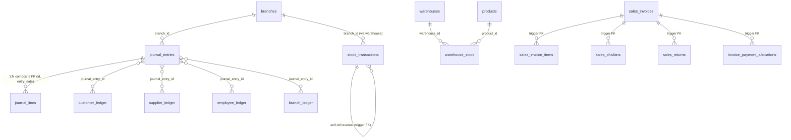
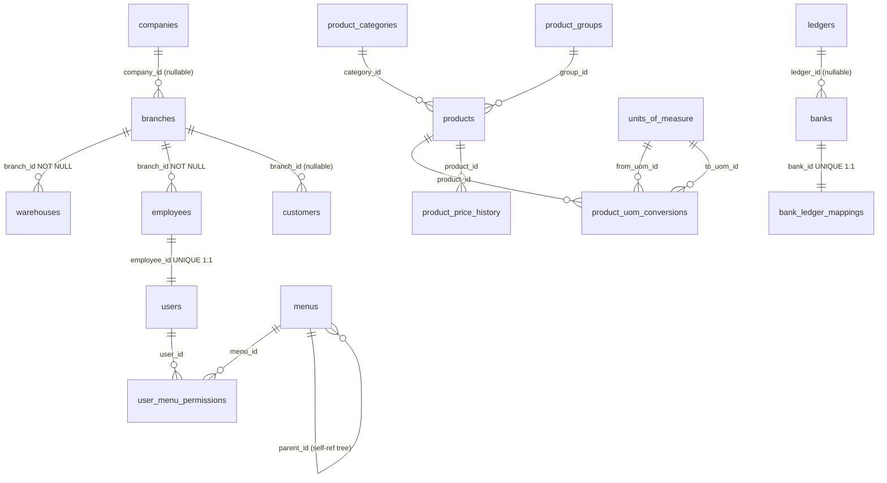
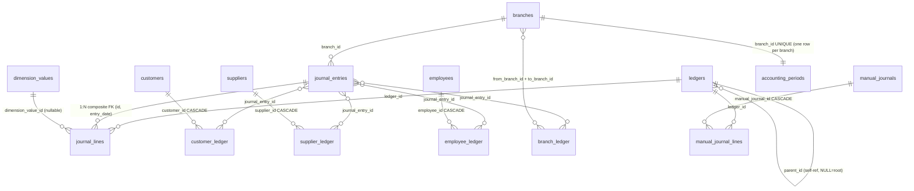
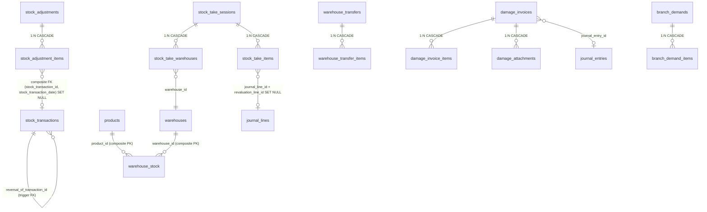
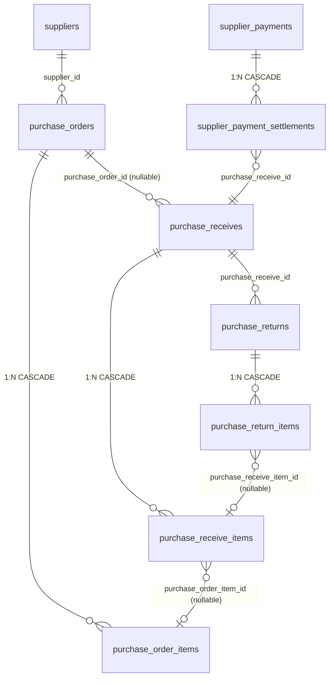
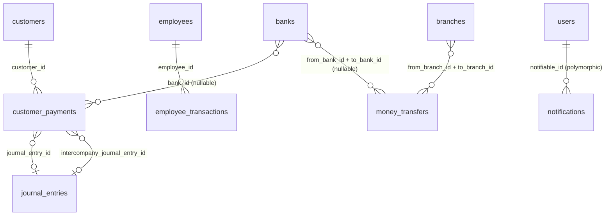
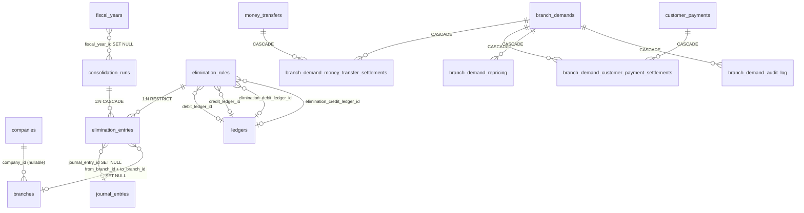
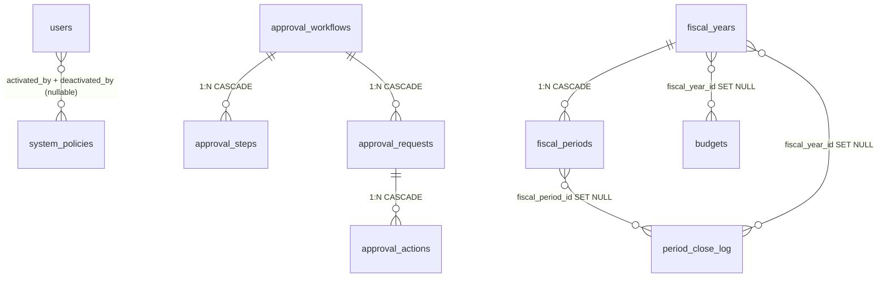
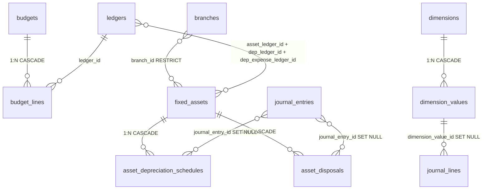

# ER Diagrams

> **Module:** Database Design (entity relationships)
> **Audience:** Engineers + AI assistants + DBAs
> **Status:** Draft
> **Last reviewed:** 2026-08-03
> **Source of truth:** this file, grounded in `laravel/database/sql/{01..07}*.sql` (FK definitions) and `laravel/database/migrations/*.php` (trigger-based FKs and later-added tables).

---

## 1. What is it?

Per-domain Entity-Relationship diagrams for the RC_ERP_v2 PostgreSQL schema. Each section
covers one logical domain (Auth & Master Data, Accounting, Stock, Sales, Purchase, Payment &
Misc, Intercompany & Consolidation, Compliance & Audit, Budgeting & Dimensions, Fixed Assets)
with a Mermaid `erDiagram` and a relationship table giving cardinality, FK column(s), and
ON DELETE behavior.

Two relationship patterns are used heavily and deserve up-front explanation:

- **Declarative FK** — standard `FOREIGN KEY ... REFERENCES`. Used wherever the parent table is
  NOT partitioned, or where the FK includes the partition key (composite FK).
- **Trigger-based FK** — PostgreSQL (PG 12–17) does NOT allow a FK to reference a partitioned
  table. Where a child references a partitioned parent, a `CREATE CONSTRAINT TRIGGER` calls a
  validation function (e.g. `fn_fk_si_check`) at INSERT time. See
  `triggers-views-constraints.md#trigger-based-fks` for the catalog.

## 2. Why does it exist?

The schema is large (~100 tables across ~20 domains). A single monolithic ER diagram is
unreadable. Per-domain diagrams let an AI assistant or engineer focus on the tables relevant to
the task at hand, while the spine tables (`journal_entries`, `stock_transactions`,
`sales_invoices`) are referenced repeatedly because they sit at the center of every
transactional domain.

## 3. When is it used?

When an engineer or AI needs to: understand which tables a given service touches, plan a schema
change (which FKs will be affected), write a JOIN query, or debug a referential integrity
error. The diagrams are navigational — for column-level detail, read the DDL file cited per
table.

## 4. Who uses it?

Engineers writing services/queries; AI assistants generating code that touches the schema;
DBAs planning migrations; auditors tracing a transaction across tables.

## 5. Related modules

- `schema-overview.md` — the full table inventory and naming conventions.
- `triggers-views-constraints.md` — the trigger-based FK function bodies + constraint catalog.
- `partitioning.md` — which tables are partitioned (affects FK strategy).
- `../architecture/module-map.md` — which controllers/services own each table.

## 6. Business rules (ER-level)

- **Every transactional table carries `branch_id`** (single-branch) or `from_branch_id` +
  `to_branch_id` (inter-branch). RLS filters on these columns.
- **`journal_entries` is referenced by ~25 transactional tables** via `journal_entry_id`. This
  is the GL spine — every financial transaction links back to it.
- **`stock_transactions` is self-referential** via `reversal_of_transaction_id` (trigger-based
  FK) — a reversal points to the original transaction.
- **`warehouse_stock` has a composite PK `(warehouse_id, product_id)` and no `id` column** —
  code that assumes an `id` will fail.
- **Sub-ledger rows `CASCADE` on parent delete** (`customer_ledger` → `customers`,
  `supplier_ledger` → `suppliers`, `employee_ledger` → `employees`) because the sub-ledger is
  meaningless without its master.
- **Soft deletes are explicit** (`deleted_at` + `deleted_by`), not just Laravel's `SoftDeletes`
  trait — the `deleted_by` audit column is always populated.

## 7. Technical implementation

### 7.1 Spine tables (the crown jewels)



### 7.2 FK strategy by parent partitioning

| Parent table | Partitioned? | FK strategy |
|---|---|---|
| `branches`, `warehouses`, `products`, `customers`, `suppliers`, `employees`, `ledgers` | No | Standard declarative FK |
| `journal_entries` | Yes (by `entry_date`) | Declarative composite FK `(journal_entry_id, entry_date)` — includes partition key |
| `stock_transactions` | Yes (by `transaction_date`) | Composite FK `(stock_transaction_id, stock_transaction_date)` where needed; self-ref via trigger `fn_st_reversal_fk_check` |
| `sales_invoices` | Yes (by `invoice_date`) | **Trigger-based FK** `fn_fk_si_check` (no partition key on child) |
| `customer_payments`, `supplier_payments`, `money_transfers`, etc. | Yes | Trigger-based or composite FK depending on child |

## 8. Important database tables

See `schema-overview.md#8-important-database-tables` for the full per-domain table inventory.
Each ER section below lists its own tables.

## 9. Related services

See `../business/core-workflows.md` Appendix A for the workflow → service/controller/table map.

## 10. Related models

98 Eloquent models in `laravel/app/Models/`. Each table typically has a 1:1 model. Models that
participate in composite PKs (`WarehouseStock`, `DailyWarehouseStockSummary`) override
`getKeyName()` / `getKeyType()`.

## 11. Important workflows

### 11.1 Auth & Master Data



| Relationship | Cardinality | FK | ON DELETE |
|---|---|---|---|
| companies → branches | 1:N | `branches.company_id` (nullable) | SET NULL |
| branches → warehouses | 1:N | `warehouses.branch_id` NOT NULL | RESTRICT |
| branches → employees | 1:N | `employees.branch_id` NOT NULL | RESTRICT |
| branches → customers | 1:N | `customers.branch_id` (nullable) | SET NULL |
| employees → users | 1:1 | `users.employee_id` UNIQUE | CASCADE |
| users → user_menu_permissions | 1:N | `user_menu_permissions.user_id` | CASCADE |
| menus → user_menu_permissions | 1:N | `user_menu_permissions.menu_id` | CASCADE |
| menus → menus | self-ref | `menus.parent_id` | SET NULL |
| product_categories → products | 1:N | `products.category_id` | RESTRICT |
| product_groups → products | 1:N | `products.group_id` | SET NULL |
| products → product_uom_conversions | 1:N | `product_uom_conversions.product_id` | CASCADE |
| units_of_measure → product_uom_conversions | 1:N (×2) | `from_uom_id`, `to_uom_id` | RESTRICT |
| banks → bank_ledger_mappings | 1:1 | `bank_ledger_mappings.bank_id` UNIQUE | CASCADE |
| banks → ledgers | M:1 | `banks.ledger_id` (nullable) | SET NULL |

### 11.2 Accounting



| Relationship | Cardinality | FK | ON DELETE |
|---|---|---|---|
| ledgers → ledgers | self-ref | `parent_id` (NULL = root; was 0 in MySQL) | SET NULL |
| ledgers → journal_lines | 1:N | `journal_lines.ledger_id` | RESTRICT |
| branches → journal_entries | 1:N | `journal_entries.branch_id` | RESTRICT |
| journal_entries → journal_lines | 1:N | composite `(journal_entry_id, entry_date)` | CASCADE |
| journal_entries → customer_ledger | 1:N | `customer_ledger.journal_entry_id` | SET NULL |
| journal_entries → supplier_ledger | 1:N | `supplier_ledger.journal_entry_id` | SET NULL |
| journal_entries → employee_ledger | 1:N | `employee_ledger.journal_entry_id` | SET NULL |
| journal_entries → branch_ledger | 1:N | `branch_ledger.journal_entry_id` | SET NULL |
| customers → customer_ledger | 1:N | `customer_ledger.customer_id` | CASCADE |
| suppliers → supplier_ledger | 1:N | `supplier_ledger.supplier_id` | CASCADE |
| employees → employee_ledger | 1:N | `employee_ledger.employee_id` | CASCADE |
| branches → branch_ledger | M:N | `from_branch_id`, `to_branch_id` | RESTRICT |
| manual_journals → manual_journal_lines | 1:N | `manual_journal_lines.manual_journal_id` | CASCADE |
| ledgers → manual_journal_lines | 1:N | `manual_journal_lines.ledger_id` | RESTRICT |
| dimension_values → journal_lines | 1:N | `journal_lines.dimension_value_id` (nullable) | SET NULL |
| branches → accounting_periods | 1:1 | `accounting_periods.branch_id` UNIQUE | CASCADE |

### 11.3 Stock



| Relationship | Cardinality | FK | ON DELETE |
|---|---|---|---|
| warehouses + products → warehouse_stock | M:N (composite PK) | `(warehouse_id, product_id)` | — |
| stock_transactions → stock_transactions | self-ref | `reversal_of_transaction_id` (trigger) | — |
| stock_adjustments → stock_adjustment_items | 1:N | `stock_adjustment_items.stock_adjustment_id` | CASCADE |
| stock_adjustment_items → stock_transactions | M:1 (composite) | `sai_stock_tx_fk (stock_transaction_id, stock_transaction_date)` | SET NULL |
| stock_take_sessions → stock_take_warehouses | 1:N | `stock_take_warehouses.stock_take_session_id` | CASCADE |
| stock_take_sessions → stock_take_items | 1:N | `stock_take_items.stock_take_session_id` | CASCADE |
| stock_take_warehouses → warehouses | M:1 | `warehouse_id` | RESTRICT |
| stock_take_items → journal_lines | M:1 (nullable) | `journal_line_id`, `revaluation_line_id` | SET NULL |
| warehouse_transfers → warehouse_transfer_items | 1:N | `warehouse_transfer_items.warehouse_transfer_id` | CASCADE |
| damage_invoices → damage_invoice_items | 1:N | `damage_invoice_items.damage_invoice_id` | CASCADE |
| damage_invoices → damage_attachments | 1:N | `damage_attachments.damage_invoice_id` | CASCADE |
| damage_invoices → journal_entries | M:1 | `journal_entry_id` | SET NULL |
| branch_demands → branch_demand_items | 1:N | `branch_demand_items.branch_demand_id` | CASCADE |

### 11.4 Sales

```mermaid
erDiagram
    sales_invoices ||--o{ sales_invoice_items : "trigger FK"
    sales_invoices ||--o{ sales_invoice_dispatchers : "trigger FK"
    sales_invoices ||--o{ sales_invoice_dispatches : "trigger FK"
    sales_invoices ||--o{ sales_challans : "trigger FK"
    sales_invoices ||--o{ sales_returns : "trigger FK"
    sales_invoices ||--o{ invoice_payment_allocations : "trigger FK"
    sales_invoices ||--o{ commission_entries : "trigger FK"
    sales_invoices }o--o| journal_entries : "journal_entry_id (revenue)"
    sales_invoices }o--o| journal_entries : "cogs_journal_entry_id (COGS)"
    sales_challans ||--o{ sales_challan_items : "1:N CASCADE"
    sales_returns ||--o{ sales_return_items : "1:N CASCADE"
    customer_payments ||--o{ invoice_payment_allocations : "payment_id CASCADE"
    sales_invoice_dispatches }o--|| sales_invoices : "unique(invoice_id, product_id)"
    users ||--o{ sales_draft_carts : "user_id CASCADE"
    commission_rules ||--o{ commission_rule_tiers : "CASCADE"
    commission_rules ||--o{ commission_rule_product_groups : "CASCADE"
    commission_rules ||--o{ commission_rule_targets : "CASCADE"
    invoice_payment_allocations ||--o{ commission_entries : "allocation_id SET NULL"
    sales_returns ||--o{ commission_entries : "sales_return_id SET NULL"
```



| Relationship | Cardinality | FK | ON DELETE |
|---|---|---|---|
| sales_invoices → sales_invoice_items | 1:N | **trigger** `trg_fk_sii_si` (`fn_fk_si_check('sales_invoice_id')`) | cascade via trigger `fn_fk_si_cascade_delete` |
| sales_invoices → sales_invoice_dispatchers | 1:N | **trigger** `trg_fk_sid_si` | cascade via trigger |
| sales_invoices → sales_invoice_dispatches | 1:N | **trigger** `trg_fk_sdis_si` | cascade via trigger |
| sales_invoices → sales_challans | 1:N | **trigger** `trg_fk_sc_si` | SET NULL |
| sales_invoices → sales_returns | 1:N | **trigger** `trg_fk_sr_si` | SET NULL |
| sales_invoices → invoice_payment_allocations | 1:N | **trigger** `trg_fk_ipa_si` (`fn_fk_si_check('invoice_id')`) | CASCADE |
| sales_invoices → commission_entries | 1:N | **trigger** `trg_fk_ce_si` (`fn_fk_ce_si_check`) | SET NULL |
| sales_invoices → journal_entries | M:1 (×2) | `journal_entry_id` (revenue), `cogs_journal_entry_id` | SET NULL |
| sales_challans → sales_challan_items | 1:N | `sales_challan_items.sales_challan_id` | CASCADE |
| sales_returns → sales_return_items | 1:N | `sales_return_items.sales_return_id` | CASCADE |
| customer_payments → invoice_payment_allocations | 1:N | `ipa_payment_id_foreign` | CASCADE |
| sales_invoice_dispatches → (sales_invoices, products) | M:N | `unique_invoice_product UNIQUE (sales_invoice_id, product_id)` | — |
| users → sales_draft_carts | 1:N | `sales_draft_carts.user_id` | CASCADE |
| commission_rules → commission_rule_tiers | 1:N | `commission_rule_tiers.commission_rule_id` | CASCADE |
| commission_rules → commission_rule_product_groups | 1:N | `commission_rule_product_groups.commission_rule_id` | CASCADE |
| commission_rules → commission_rule_targets | 1:N | `commission_rule_targets.commission_rule_id` | CASCADE |
| invoice_payment_allocations → commission_entries | 1:N | `commission_entries.allocation_id` | SET NULL |
| sales_returns → commission_entries | 1:N | `commission_entries.sales_return_id` | SET NULL |

### 11.5 Purchase



| Relationship | Cardinality | FK | ON DELETE |
|---|---|---|---|
| suppliers → purchase_orders | 1:N | `purchase_orders.supplier_id` | RESTRICT |
| purchase_orders → purchase_order_items | 1:N | `purchase_order_items.purchase_order_id` | CASCADE |
| purchase_orders → purchase_receives | 1:N | `purchase_receives.purchase_order_id` (nullable) | SET NULL |
| purchase_receives → purchase_receive_items | 1:N | `purchase_receive_items.purchase_receive_id` | CASCADE |
| purchase_receive_items → purchase_order_items | M:1 | `purchase_order_item_id` (nullable) | SET NULL |
| purchase_receives → purchase_returns | 1:N | `purchase_returns.purchase_receive_id` | RESTRICT |
| purchase_returns → purchase_return_items | 1:N | `purchase_return_items.purchase_return_id` | CASCADE |
| purchase_return_items → purchase_receive_items | M:1 | `purchase_receive_item_id` (nullable) | SET NULL |
| supplier_payments → supplier_payment_settlements | 1:N | `supplier_payment_settlements.supplier_payment_id` | CASCADE |
| supplier_payment_settlements → purchase_receives | M:1 | `purchase_receive_id` | RESTRICT |

### 11.6 Payment & Misc



| Relationship | Cardinality | FK | ON DELETE |
|---|---|---|---|
| customers → customer_payments | 1:N | `customer_payments.customer_id` | RESTRICT |
| banks → customer_payments | M:1 | `bank_id` (nullable) | SET NULL |
| customer_payments → journal_entries | M:1 (×2) | `journal_entry_id`, `intercompany_journal_entry_id` | SET NULL |
| employees → employee_transactions | 1:N | `employee_transactions.employee_id` | RESTRICT |
| branches → money_transfers | M:N | `from_branch_id`, `to_branch_id` | RESTRICT |
| banks → money_transfers | M:1 (×2) | `from_bank_id`, `to_bank_id` (nullable) | SET NULL |
| users → notifications | 1:N (polymorphic) | `notifiable_id`, `notifiable_type` | CASCADE |

### 11.7 Intercompany & Consolidation



| Relationship | Cardinality | FK | ON DELETE |
|---|---|---|---|
| companies → branches | 1:N | `branches.company_id` (nullable) | SET NULL |
| consolidation_runs → elimination_entries | 1:N | `elimination_entries.consolidation_run_id` | CASCADE |
| elimination_rules → elimination_entries | 1:N | `elimination_entries.elimination_rule_id` | RESTRICT |
| elimination_rules → ledgers (×4) | M:1 | `debit_ledger_id`, `credit_ledger_id`, `elimination_debit_ledger_id`, `elimination_credit_ledger_id` | RESTRICT |
| elimination_entries → journal_entries | M:1 | `journal_entry_id` (nullable) | SET NULL |
| elimination_entries → branches (×2) | M:1 | `from_branch_id`, `to_branch_id` (nullable) | SET NULL |
| fiscal_years → consolidation_runs | M:1 | `fiscal_year_id` (nullable) | SET NULL |
| branch_demands → branch_demand_money_transfer_settlements | 1:N | `branch_demand_id` | CASCADE |
| money_transfers → branch_demand_money_transfer_settlements | 1:N | `money_transfer_id` | CASCADE |
| branch_demands → branch_demand_customer_payment_settlements | 1:N | `branch_demand_id` | CASCADE |
| customer_payments → branch_demand_customer_payment_settlements | 1:N | `customer_payment_id` | CASCADE |
| branch_demands → branch_demand_repricing | 1:N | `branch_demand_id` | CASCADE |
| branch_demands → branch_demand_audit_log | 1:N | `branch_demand_id` | CASCADE |

### 11.8 Compliance & Audit



| Relationship | Cardinality | FK | ON DELETE |
|---|---|---|---|
| users → system_policies | M:1 (×4) | `activated_by`, `deactivated_by` (nullable) | SET NULL |
| approval_workflows → approval_steps | 1:N | `approval_steps.approval_workflow_id` | CASCADE |
| approval_workflows → approval_requests | 1:N | `approval_requests.approval_workflow_id` | CASCADE |
| approval_requests → approval_actions | 1:N | `approval_actions.approval_request_id` | CASCADE |
| fiscal_years → fiscal_periods | 1:N | `fiscal_periods.fiscal_year_id` | CASCADE |
| fiscal_periods → period_close_log | 1:N | `period_close_log.fiscal_period_id` (nullable) | SET NULL |
| fiscal_years → period_close_log | 1:N | `period_close_log.fiscal_year_id` (nullable) | SET NULL |
| fiscal_years → budgets | 1:N | `budgets.fiscal_year_id` (nullable) | SET NULL |

### 11.9 Budgeting, Dimensions & Fixed Assets



| Relationship | Cardinality | FK | ON DELETE |
|---|---|---|---|
| budgets → budget_lines | 1:N | `budget_lines.budget_id` | CASCADE |
| ledgers → budget_lines | 1:N | `budget_lines.ledger_id` | RESTRICT |
| dimensions → dimension_values | 1:N | `dimension_values.dimension_id` | CASCADE |
| dimension_values → journal_lines | 1:N | `journal_lines.dimension_value_id` (nullable) | SET NULL |
| branches → fixed_assets | M:1 | `fixed_assets.branch_id` | RESTRICT |
| ledgers → fixed_assets (×3) | M:1 | `asset_ledger_id`, `dep_ledger_id`, `dep_expense_ledger_id` | RESTRICT |
| fixed_assets → asset_depreciation_schedules | 1:N | `asset_depreciation_schedules.fixed_asset_id` | CASCADE |
| fixed_assets → asset_disposals | 1:N | `asset_disposals.fixed_asset_id` | CASCADE |
| journal_entries → asset_depreciation_schedules | M:1 | `journal_entry_id` (nullable) | SET NULL |
| journal_entries → asset_disposals | M:1 | `journal_entry_id` (nullable) | SET NULL |

## 12. Known edge cases

- **Trigger-based FKs do not fire on UPDATE of the FK column** by default — only on INSERT. Code
  that re-points a `sales_invoice_id` to a different invoice via UPDATE would bypass the check.
  The application never does this; reversals create new rows instead.
- **`stock_transactions.reversal_of_transaction_id` is a self-ref trigger FK** — a reversal
  points to its original. The trigger `fn_st_reversal_fk_check` validates existence at INSERT.
- **`customer_payment_settlements` was dropped** (migration `2025_01_09_000001`) in favor of
  `invoice_payment_allocations`. Do not reference the old table.
- **`cash_ledger` has no `is_reversed` column** — reversals create opposite-sign rows.
- **`notifications` was overwritten** by Laravel-standard UUID PK schema in Phase 2.
- **`ledgers.parent_id = 0` (MySQL sentinel) was converted to `NULL`** during ETL.

## 13. Future improvements

- **Declarative FKs to partitioned parents** — PG 18+ may relax the restriction; the trigger
  FKs could then be replaced with declarative ones.
- **Dimensional model** — `dimensions` / `dimension_values` exist but are lightly used; a
  richer dimensional model (cost-center, project, region) is a candidate.
- **Graph view** — a single navigable graph of all ~100 tables would help onboarding; currently
  the per-domain split is the best compromise.

---

## Appendix A — Trigger-based FK function signature

```sql
CREATE OR REPLACE FUNCTION fn_fk_si_check()
RETURNS trigger AS $$
DECLARE
    fk_col text := TG_ARGV[0];
    invoice_id_val integer;
    invoice_exists boolean;
BEGIN
    EXECUTE format('SELECT ($1).%I', fk_col) USING NEW INTO invoice_id_val;
    IF invoice_id_val IS NULL THEN
        RETURN NEW;
    END IF;
    SELECT EXISTS (SELECT 1 FROM sales_invoices WHERE id = invoice_id_val) INTO invoice_exists;
    IF NOT invoice_exists THEN
        RAISE EXCEPTION 'Referential integrity: %=% does not exist in sales_invoices', fk_col, invoice_id_val;
    END IF;
    RETURN NEW;
END;
$$ LANGUAGE plpgsql;
```

Attached as `CREATE CONSTRAINT TRIGGER trg_fk_<child>_<parent> AFTER INSERT ON <child> DEFERRABLE INITIALLY IMMEDIATE FOR EACH ROW EXECUTE FUNCTION fn_fk_si_check('<fk_col>')`.

## Appendix B — ON DELETE behavior summary

| Behavior | When used |
|---|---|
| `CASCADE` | Child is meaningless without parent (sub-ledger → master; line → header; approval_actions → approval_request) |
| `RESTRICT` | Parent is referenced for integrity (branches, ledgers, suppliers, products, warehouses) — prevents deleting a master row that has transactions |
| `SET NULL` | FK is informational/nullable (journal_entry_id on sub-ledgers, intercompany columns, fiscal_year_id) |
| Trigger cascade | Partitioned parent DELETE (sales_invoices → items/dispatchers/dispatches via `fn_fk_si_cascade_delete`) |
