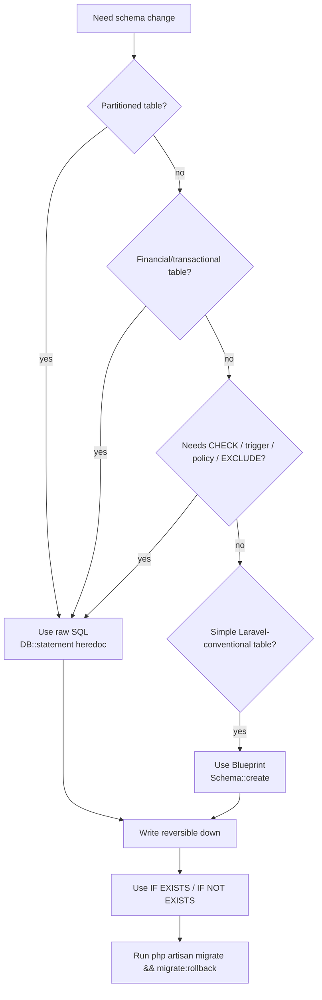

# Migrations Conventions

> **Module:** Database Design (migrations)
> **Audience:** Engineers + AI assistants writing migrations
> **Status:** Draft
> **Last reviewed:** 2026-08-03
> **Source of truth:** this file, grounded in `laravel/database/migrations/*.php` (160 files) and `laravel/database/sql/*.sql` (7 raw DDL files loaded by the first migration).

---

## 1. What is it?

The conventions for writing and organizing database migrations in RC_ERP_v2. The codebase has
**160 migration files** spanning 2025-01 to 2026-08. They follow a distinctive hybrid pattern:
the **raw SQL DDL files** (`database/sql/*.sql`) are the canonical schema source, loaded by the
first migration; subsequent migrations apply incremental changes via `DB::statement(<<<'SQL')`
heredocs (the dominant pattern) or `Schema::create` Blueprint (for Laravel-style tables). This
file codifies when to use each pattern, how to name things, how to handle partitions/RLS/triggers,
and the up/down discipline.

## 2. Why does it exist?

PostgreSQL features (partitioning, RLS, triggers, functions, EXCLUDE constraints, generated
columns, advisory locks) are not expressible through Laravel's Blueprint API. The codebase
therefore uses raw SQL for anything non-trivial and reserves Blueprint for simple
Laravel-conventional tables. Codifying the pattern prevents AI-generated migrations from
producing invalid PG syntax (e.g. using `Schema::create` for a partitioned table, or forgetting
to add a `down()` for a trigger).

## 3. When is it used?

Every time the schema changes: a new table, a new column, a new index, a new trigger, a new RLS
policy, a new partition, a data migration. Migrations are the ONLY path to schema change in
production — direct `ALTER TABLE` on the DB is forbidden.

## 4. Who uses it?

- **Engineers** writing feature work that needs schema changes.
- **AI assistants** generating migrations — MUST follow these conventions or the migration will
  fail or produce inconsistent state.
- **DBAs** reviewing migrations before deploy.

## 5. Related modules

- `schema-overview.md` — the schema the migrations modify.
- `triggers-views-constraints.md` — how to add triggers/functions/constraints.
- `partitioning.md` — how to create partitioned tables.
- `../coding/coding-standards.md` (Phase 4) — general code standards.

## 6. Business rules (migration-level)

- **The raw SQL DDL files are the canonical schema source.** The first migration
  (`2025_01_01_000001_create_rcerp_schema.php`) loads all 7 DDL files. Subsequent migrations are
  incremental deltas. NEVER edit the DDL files directly to change a live table — write a new
  migration.
- **CHECK constraints are ALWAYS added via raw SQL `ALTER TABLE`**, never via Blueprint
  (Blueprint has no CHECK support).
- **Triggers, functions, policies, EXCLUDE constraints, partitioned tables, generated columns,
  materialized views** are ALWAYS raw SQL via `DB::statement`.
- **Every migration MUST have a working `down()`** that reverses `up()`. For raw SQL: `DROP
  TABLE ... CASCADE`, `DROP TRIGGER IF EXISTS`, `DROP FUNCTION IF EXISTS ... CASCADE`, `DROP
  POLICY IF EXISTS`, `DROP INDEX IF EXISTS`, `ALTER TABLE ... DROP CONSTRAINT IF EXISTS`.
- **Migrations MUST be idempotent-safe where possible** — use `IF NOT EXISTS` / `IF EXISTS` in
  DDL so a partial rerun doesn't fail.
- **Data migrations are allowed** but MUST be reversible or explicitly flagged as irreversible
  with a comment.
- **Never use `DB::unprepared`** — the codebase uses `DB::statement` (which uses PDO prepared
  statements) for everything, even multi-statement heredocs.
- **One logical change per migration** — do not bundle unrelated schema changes.

## 7. Technical implementation

### 7.1 Migration count and phasing

**160 migration files** grouped by YYYY_MM prefix:

| YYYY_MM | Count | Phase / focus |
|---|---|---|
| 2025_01 | 57 | Baseline (DDL load) + auth + reports MVs + stock + accounting + RLS + advisory locks + LISTEN/NOTIFY + partitioning + EXCLUDE + DEFERRABLE FK + generated columns + commission |
| 2025_07 | 15 | Phase 6.3–6.6 stock take/adjustment/transfer/damage + Phase 8 RLS hardening + cost revaluation |
| 2025_08 | 7 | Phase 9/10/11/12 — UOM, pg_cron, post-time cost, reversal-vs-cancel |
| 2026_01 | 5 | Damage Phase 1–3 — category taxonomy, witness/accountable, attachments, LISTEN/NOTIFY |
| 2026_07 | 26 | Branch Demand Phase 1–7 + legacy data migration (7 files) + HR columns |
| 2026_08 | 50 | Partitioning (000001–000005, 000015+) + approval + budgeting + fiscal year + intercompany + bank reconciliation + fixed assets + financial audit log + journal partitioning |

### 7.2 First and last migration

- **First:** `2025_01_01_000001_create_rcerp_schema.php` — executes all 7 raw SQL files via a
  custom `splitSql()` dollar-quote-aware splitter. This is the baseline schema loader.
- **Last:** `2026_08_29_000001_fix_journal_lines_sync_trigger_fk_guard.php` — Phase 6.6 FK-guard
  hotfix for `trg_jl_sync_entry_date` (HOTFIX-9).

### 7.3 Filename convention

`YYYY_MM_DD_HHMMSS_<snake_case_description>.php` — Laravel standard. The timestamp governs
order; the description is imperative ("create_X", "add_Y_to_Z", "fix_W", "drop_V",
"partition_U", "seed_T").

### 7.4 The two creation patterns

**Pattern A — Raw SQL heredoc (dominant for financial/transactional tables):**

```php
public function up(): void
{
    DB::statement(<<<'SQL'
        CREATE TABLE sales_invoices (
            id integer GENERATED ALWAYS AS IDENTITY,
            invoice_code varchar(30) NOT NULL,
            invoice_date date NOT NULL,
            branch_id integer NOT NULL REFERENCES branches(id),
            customer_id integer NOT NULL REFERENCES customers(id),
            total_amount numeric(14,2) NOT NULL DEFAULT 0,
            status varchar(20) NOT NULL DEFAULT 'draft',
            ...
            PRIMARY KEY (id, invoice_date),
            CONSTRAINT sales_invoices_code_unique UNIQUE (invoice_code, invoice_date),
            CONSTRAINT sales_invoices_status_check CHECK (status IN ('draft','confirmed','cancelled','reversed'))
        ) PARTITION BY RANGE (invoice_date)
    SQL);
}

public function down(): void
{
    DB::statement('DROP TABLE IF EXISTS sales_invoices CASCADE');
}
```

**Pattern B — Blueprint (for Laravel-style tables: notifications, system_policies, approval_*,
budgets, fixed_assets):**

```php
public function up(): void
{
    Schema::create('approval_workflows', function (Blueprint $table) {
        $table->id();
        $table->string('name', 100);
        $table->string('entity_type', 50);
        $table->decimal('min_amount', 15, 2)->default(0);
        $table->boolean('is_active')->default(true);
        $table->unsignedSmallInteger('requires_approval_levels')->default(1);
        $table->string('branch_id')->nullable();
        $table->text('description')->nullable();
        $table->timestamps();
        $table->softDeletes();
        $table->unique(['entity_type', 'branch_id', 'deleted_at'], 'uq_workflow_entity_branch');
        $table->index(['entity_type', 'is_active']);
    });
}
```

### 7.5 When to use which pattern

| Use raw SQL (`DB::statement`) | Use Blueprint (`Schema::create`) |
|---|---|
| Partitioned tables (`PARTITION BY`) | Simple non-partitioned Laravel-conventional tables |
| Tables with CHECK constraints on status/role | Tables where SoftDeletes + timestamps suffice |
| Tables with composite PKs | Auth/notification/config tables |
| Triggers, functions, policies | — |
| EXCLUDE constraints, generated columns, MVs | — |
| Tables referenced by trigger-based FKs | — |
| Any financial/transactional table | — |

**Rule of thumb:** if the table participates in accounting, stock, sales, purchase, or payment,
use raw SQL. If it's a Laravel framework table (auth, notifications, config), Blueprint is fine.

### 7.6 How CHECK constraints are added

Always via raw SQL `ALTER TABLE`, never Blueprint:

```php
// From 2026_08_10_000001_create_approval_workflow_engine.php
DB::statement("
    ALTER TABLE manual_journals
    ADD CONSTRAINT manual_journals_status_check
    CHECK (status IN ('draft','submitted','approved','posted','reversed','rejected'))
");
```

To replace an existing CHECK (e.g. expanding a status enum):

```php
DB::statement("ALTER TABLE employees DROP CONSTRAINT IF EXISTS employees_role_check");
DB::statement("
    ALTER TABLE employees
    ADD CONSTRAINT employees_role_check
    CHECK (role IN ('admin','salesman','warehouse_manager','dispatcher','accountant','hr','manager','other','superadmin','user'))
");
```

### 7.7 How FKs are declared

| Pattern | When | Example |
|---|---|---|
| Inline `REFERENCES` | Simple single-column FK in raw SQL | `branch_id integer NOT NULL REFERENCES branches(id)` |
| Named `CONSTRAINT ... FOREIGN KEY` | When you need ON DELETE/UPDATE behavior | `CONSTRAINT fk_si_customer FOREIGN KEY (customer_id) REFERENCES customers(id)` |
| Blueprint `$table->foreignId('x')->constrained()` | Laravel-style tables | `$table->foreignId('user_id')->constrained()` |
| Composite FK | When child includes the parent's partition key | `FOREIGN KEY (stock_transaction_id, stock_transaction_date) REFERENCES stock_transactions(id, transaction_date) ON DELETE SET NULL` |
| Trigger-based FK | When child references a partitioned parent WITHOUT the partition key | `CREATE CONSTRAINT TRIGGER trg_fk_sii_si AFTER INSERT ON sales_invoice_items DEFERRABLE INITIALLY IMMEDIATE FOR EACH ROW EXECUTE FUNCTION fn_fk_si_check('sales_invoice_id')` |

### 7.8 Index naming conventions

| Type | Pattern | Example |
|---|---|---|
| B-tree | `idx_<table>_<cols>` | `idx_si_customer`, `idx_jl_journal_entry` |
| Unique | `<table>_<cols>_unique` (raw SQL) or `uk_<table>_<cols>` (migrations) | `sales_invoices_code_unique`, `uk_doc_sequence` |
| Partial | `idx_<table>_<col>` with `WHERE` | `idx_wh_is_frozen ON warehouses(id) WHERE is_frozen_for_count = true` |
| Covering | `idx_<table>_<cols>_covering` with `INCLUDE` | `idx_si_customer_due_covering ON sales_invoices(customer_id, is_reversed, invoice_date) INCLUDE (id, invoice_code, total_amount, paid_amount, due_amount) WHERE due_amount > 0` |
| BRIN | `idx_<table>_<col>_brin` | `idx_si_invoice_date_brin ON sales_invoices USING BRIN (invoice_date) WITH (pages_per_range = 32)` |
| GIN | `idx_<table>_<col>` with `USING GIN` | `idx_products_search ON products USING GIN (search_vector)` |
| GiST | backs an EXCLUDE constraint | (implicit) |
| MV indexes | `mv_<name>_<cols>_idx` | `mv_ar_aging_customer_branch_idx` |

### 7.9 How partitions are created

Initial months explicitly, then pg_partman for auto-creation:

```php
// From 2025_01_21_000004_set_up_table_partitioning.php
foreach ($months as [$from, $to, $name]) {
    DB::statement(
        "CREATE TABLE {$name} PARTITION OF stock_transactions
         FOR VALUES FROM ('{$from}') TO ('{$to}')"
    );
}
DB::statement('CREATE TABLE stock_transactions_default PARTITION OF stock_transactions DEFAULT');

// Register with pg_partman for auto-creation of future months
DB::statement(<<<'SQL'
    SELECT partman.create_parent(
        p_parent_table    := 'public.stock_transactions',
        p_control         := 'transaction_date',
        p_type            := 'range',
        p_interval        := '1 month',
        p_premake         := 6,
        p_start_partition := '2026-01-01'
    )
SQL);
```

See `partitioning.md` for the full partition scheme.

### 7.10 How RLS policies are added

5 policies per branch-scoped table (SELECT/INSERT/UPDATE/DELETE/admin-bypass):

```php
DB::statement("ALTER TABLE employees ENABLE ROW LEVEL SECURITY");
DB::statement("ALTER TABLE employees FORCE ROW LEVEL SECURITY");
DB::statement("CREATE POLICY rls_employees_select ON employees FOR SELECT USING (current_setting('app.is_admin', true) = 'true' OR branch_id = current_setting('app.branch_id')::int)");
DB::statement("CREATE POLICY rls_employees_insert ON employees FOR INSERT WITH CHECK (current_setting('app.is_admin', true) = 'true' OR branch_id = current_setting('app.branch_id')::int)");
DB::statement("CREATE POLICY rls_employees_update ON employees FOR UPDATE USING (...) WITH CHECK (...)");
DB::statement("CREATE POLICY rls_employees_delete ON employees FOR DELETE USING (...)");
DB::statement("CREATE POLICY rls_employees_admin ON employees FOR ALL USING (current_setting('app.is_admin', true) = 'true') WITH CHECK (...)");
```

`document_sequences` has a special `branch_id = 0` global-access policy.

### 7.11 How triggers/functions are added

Via `DB::statement(<<<'SQL' ... SQL)` heredoc. PDO requires one statement per call, so a
function + its trigger is two `DB::statement` calls:

```php
DB::statement(<<<'SQL'
    CREATE OR REPLACE FUNCTION fn_ipa_no_overallocation()
    RETURNS trigger AS $$
    DECLARE
        v_total_allocated numeric(14,2);
        v_invoice_total  numeric(14,2);
    BEGIN
        SELECT COALESCE(SUM(ipa.allocated_amount), 0)
        INTO v_total_allocated
        FROM invoice_payment_allocations ipa
        JOIN customer_payments cp ON cp.id = ipa.payment_id AND cp.is_reversed = false
        WHERE ipa.invoice_id = NEW.invoice_id;
        SELECT total_amount INTO v_invoice_total FROM sales_invoices WHERE id = NEW.invoice_id;
        IF v_total_allocated > v_invoice_total + 0.01 THEN
            RAISE EXCEPTION 'Over-allocation prevented: invoice % total_amount is %, but allocated amount is %',
                NEW.invoice_id, v_invoice_total, v_total_allocated;
        END IF;
        RETURN NEW;
    END;
    $$ LANGUAGE plpgsql;
SQL);

DB::statement('DROP TRIGGER IF EXISTS trg_ipa_no_overallocation ON invoice_payment_allocations');
DB::statement(
    "CREATE CONSTRAINT TRIGGER trg_ipa_no_overallocation
     AFTER INSERT ON invoice_payment_allocations
     DEFERRABLE INITIALLY IMMEDIATE
     FOR EACH ROW
     EXECUTE FUNCTION fn_ipa_no_overallocation()"
);
```

### 7.12 up() vs down() discipline

- `up()`: `DB::statement` for `CREATE TABLE`, `CREATE TRIGGER`, `CREATE FUNCTION`, `CREATE
  POLICY`, `CREATE INDEX`, `ALTER TABLE ADD CONSTRAINT`, etc.
- `down()`: `DB::statement` for `DROP TABLE ... CASCADE`, `DROP TRIGGER IF EXISTS`,
  `DROP FUNCTION IF EXISTS ... CASCADE`, `DROP POLICY IF EXISTS`, `DROP INDEX IF EXISTS`,
  `ALTER TABLE ... DROP CONSTRAINT IF EXISTS`.
- For Blueprint: `Schema::dropIfExists('table')`.
- For data migrations: `down()` should reverse the data change OR be marked irreversible with a
  comment (`// Irreversible: data migration only`).

### 7.13 Data migrations (not just schema)

| Migration | What it seeds/migrates |
|---|---|
| `2025_01_05_000001_seed_default_chart_of_accounts.php` | Full hierarchical CoA (5 levels, 7 critical natures + extended) |
| `2025_01_09_000003_seed_return_notification_rules.php` | Sales return notification rules |
| `2025_07_28_000001_add_approval_workflow_to_stock_take_sessions.php` | 4 default `stock_take_policies` |
| `2026_07_30_000005_migrate_legacy_admin_and_employee_data.php` | Parses legacy SQL dump → employees + users |
| `2026_07_30_000006/007_make_e0001/emp0001_superadmin_with_all_menus.php` | Grants superadmin + all menus |
| `2026_07_30_000008-000013_migrate_legacy_*_data.php` | Products, categories, banks, suppliers, customers, branches, warehouses, ledger heads from legacy MySQL |
| `2026_08_10_000001_create_approval_workflow_engine.php` | Default Manual Journal approval workflow + 2 steps (manager → admin) |
| `2026_08_10_000002_create_budgeting_and_cost_centers.php` | 3 default dimensions (Department, Project, Location) + 5 departments |
| `2026_08_10_000004_create_enhanced_period_and_fiscal_year_controls.php` | Current fiscal year from SystemPolicy data |
| `2026_08_13_000001_create_fixed_assets.php` | Fixed asset CoA ledgers (machinery, furniture, vehicle, etc.) |

### 7.14 Style statistics

- **132 migrations use `DB::statement`** (raw SQL) — the dominant pattern.
- **20 migrations use `Schema::create`** (Blueprint).
- **49 migrations contain advanced PG features** (CREATE EXTENSION/TRIGGER/FUNCTION/VIEW/
  MATERIALIZED VIEW/POLICY/EXCLUDE).
- **0 migrations use `DB::unprepared`** — confirmed.

## 8. Important database tables

The migrations table itself: `migrations` (Laravel-standard, tracks applied migrations). The
legacy `schema_migrations` table (from MySQL) still exists in the DDL but is unused by Laravel.

## 9. Related services

- `laravel/app/Services/Accounting/DocumentSequenceService.php` — advisory-lock doc# generator
  (replaces the `SELECT FOR UPDATE` pattern; migration `2025_01_20_000008`).
- Console commands: `php artisan migrate`, `php artisan migrate:rollback`,
  `php artisan migrate:status`. Plus the replay commands (`stock:replay-verify`,
  `journal:replay-verify`, `subledger:reconcile`) used post-migration.

## 10. Related models

Each migration that creates a table typically has a corresponding Eloquent model in
`laravel/app/Models/`. Models for partitioned tables override `getKeyType()` and may disable
incrementing if the PK is composite.

## 11. Important workflows

### 11.1 Writing a new migration (decision tree)



### 11.2 Converting a base table to partitioned (the rename → recreate → copy → drop flow)

Used in Phase 6.2-6.6 and the 2026-08 partitioning wave:

1. Rename the existing table (`ALTER TABLE sales_invoices RENAME TO sales_invoices_old`).
2. Create the new partitioned parent (`CREATE TABLE sales_invoices (...) PARTITION BY RANGE (invoice_date)`).
3. Create initial partitions + default partition.
4. Copy data (`INSERT INTO sales_invoices SELECT * FROM sales_invoices_old`).
5. Drop the old table (`DROP TABLE sales_invoices_old`).
6. Re-add indexes, constraints, triggers, RLS policies on the new parent.
7. Register with pg_partman.

## 12. Known edge cases

- **`DB::statement` is one-statement-per-call** (PDO limitation). A function + trigger requires
  two calls. Use the heredoc for the function body (which contains semicolons inside `$$`).
- **`CREATE OR REPLACE FUNCTION` is idempotent**; `CREATE TRIGGER` is not — always `DROP TRIGGER
  IF EXISTS` before `CREATE TRIGGER`.
- **Adding a CHECK constraint that existing rows violate** will fail — either fix the data first
  or use `NOT VALID` + `VALIDATE CONSTRAINT` (the codebase does not currently use this pattern).
- **Partitioned parent UNIQUE must include the partition key** — `UNIQUE(invoice_code)` becomes
  `UNIQUE(invoice_code, invoice_date)`. Code that queries by `invoice_code` alone still works
  (index scan), but unique enforcement is per-partition.
- **Trigger-based FKs do not fire on UPDATE** of the FK column — only INSERT. The application
  never re-points FKs via UPDATE; reversals create new rows.
- **`generated columns` cannot be loaded by pgloader** — they are EXCLUDED in `pgloader.load`
  and PG computes them.

## 13. Future improvements

- **Adopt `NOT VALID` + `VALIDATE CONSTRAINT`** for CHECK constraints added to large tables, to
  avoid long table scans during migration.
- **Migration review checklist** — a formal checklist (raw SQL vs Blueprint, down() present,
  IF EXISTS, partition key in UNIQUE, RLS policies added) would reduce review friction.
- **Migration testing** — currently no automated test that `migrate && migrate:rollback` is
  clean; a CI job would catch missing `down()` methods.

---

## Appendix A — Migration prefix quick-find

| Prefix | Phase | Count |
|---|---|---|
| `2025_01_01` | Baseline DDL load | 1 |
| `2025_01_02-05` | Auth support + CoA seed | ~5 |
| `2025_01_06-09` | Notifications + sales fixes | ~10 |
| `2025_01_10-15` | Menus + ledgers + indexes | ~5 |
| `2025_01_17-20` | API token + RLS + advisory locks + generated cols + indexes + pg_cron | ~15 |
| `2025_01_21-22` | LISTEN/NOTIFY + partitioning + EXCLUDE + DEFERRABLE FK + commission | ~10 |
| `2025_01_23-28` | Soft deletes + indexes + dispatchers | ~10 |
| `2025_07_*` | Stock take/adjustment/transfer/damage + RLS hardening | 15 |
| `2025_08_*` | UOM + pg_cron + post-time cost + reversal-vs-cancel | 7 |
| `2026_01_*` | Damage taxonomy + witness + attachments + LISTEN/NOTIFY | 5 |
| `2026_07_29_*` | Branch Demand Phase 1-7 | 19 |
| `2026_07_30_*` | Legacy data migration + HR columns | 13 |
| `2026_08_01-08` | Audit log + manual journals + pgcrypto + approval + budgeting + fiscal year + intercompany + bank recon + employee transactions | ~20 |
| `2026_08_10` | Approval workflow + budgeting + fiscal year + menus | 5 |
| `2026_08_11-13` | Consolidation + fixed assets + bank recon menus | ~5 |
| `2026_08_15` | Partitioning regression fixes + partman schedule + archive schema | 5 |
| `2026_08_20-22` | Partition transaction headers + journal_entries + journal_lines + FK conversion | ~6 |
| `2026_08_25` | Retention configs + archival procedures + consolidation | 3 |
| `2026_08_28` | Partition health (functions + alerts + stats + vacuum) | 5 |
| `2026_08_29` | HOTFIX-9 FK guard | 1 |

## Appendix B — Do / Don't quick reference

| Do | Don't |
|---|---|
| Use `DB::statement(<<<'SQL')` for partitioned tables | Use `Schema::create` for a partitioned table |
| Add a CHECK via `ALTER TABLE ... ADD CONSTRAINT` | Expect Blueprint to support CHECK |
| `DROP TRIGGER IF EXISTS` before `CREATE TRIGGER` | Assume `CREATE TRIGGER` is idempotent |
| Include partition key in UNIQUE on partitioned tables | Declare `UNIQUE(invoice_code)` alone on a partitioned table |
| Write a `down()` for every `up()` | Leave `down()` empty or missing |
| Use `IF EXISTS` / `IF NOT EXISTS` for idempotency | Assume the migration runs only once |
| One logical change per migration | Bundle unrelated changes |
| Name indexes `idx_<table>_<cols>` | Leave indexes with auto-generated names |
| Use heredoc for function bodies (contains `$$` and `;`) | Concatenate SQL strings |
