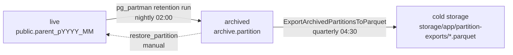
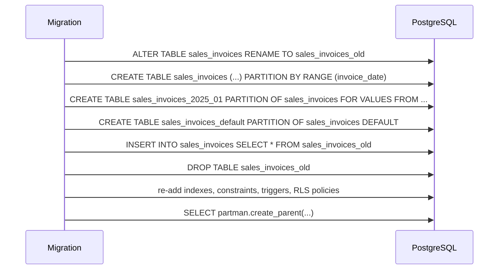
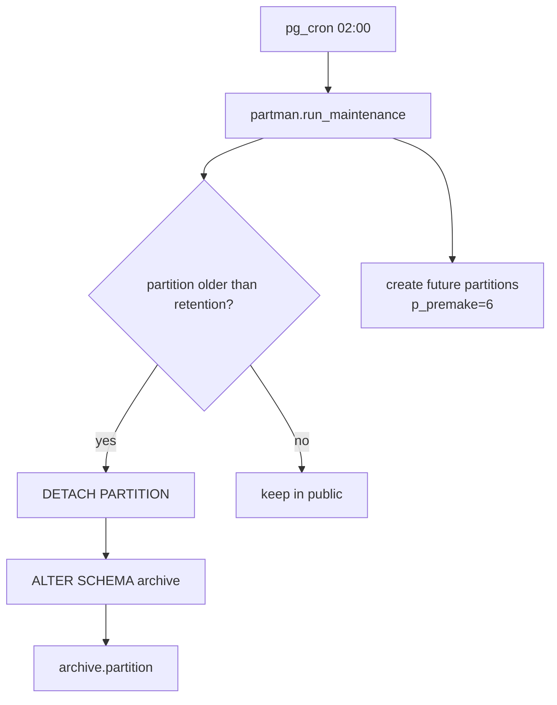
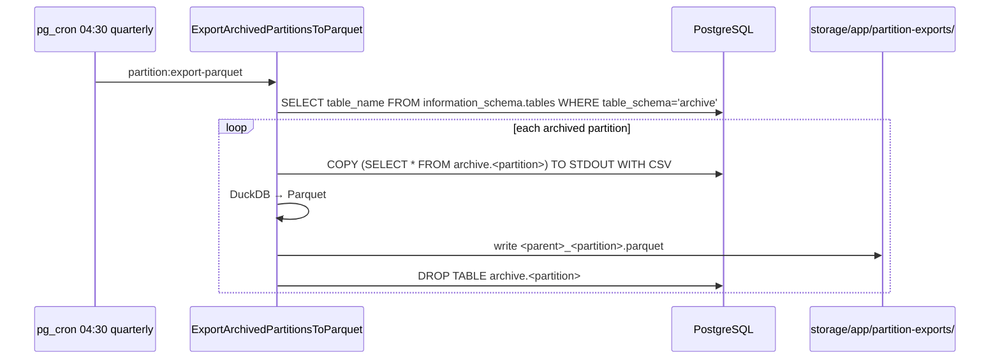

# Partitioning

> **Module:** Database Design (partitioning & archival)
> **Audience:** Engineers + AI assistants + DBAs
> **Status:** Draft
> **Last reviewed:** 2026-08-03
> **Source of truth:** this file, grounded in `laravel/database/migrations/2025_01_21_000004_set_up_table_partitioning.php`, the 12 partition-related migrations in `laravel/database/migrations/`, `laravel/app/Console/Commands/{MeasurePartitionPerformance,VerifyPartitionwiseJoin,ExportArchivedPartitionsToParquet}.php`, and `laravel/database/sql/07_views_triggers_constraints.sql`.

---

## 1. What is it?

RC_ERP_v2 uses **declarative PostgreSQL RANGE partitioning by date** on **30 tables**, managed
by **pg_partman** (auto-creation of future partitions + retention/detachment) and a custom
**partition-health subsystem** (5 migrations + 6 functions + 1 alerts table + 5 statistics
views + 3 console commands). Retention is **84 months (7 years)** for financial/transactional
tables and **36 months (3 years)** for operational audit logs, with `retention_keep_table=true`
(detached partitions move to the `archive` schema, never dropped). A quarterly job exports
archived partitions to **Parquet** cold storage via DuckDB.

This file is the canonical reference for the partition scheme; `../architecture/partitioning-archival.md`
gives the higher-level architecture view.

## 2. Why does it exist?

The ERP must retain 7 years of financial data for compliance, but querying 7 years of
`stock_transactions` (38,775+ rows and growing daily) in a single table destroys performance.
Partitioning by month gives: (1) partition pruning for date-range queries (a "this month"
report scans 1 partition, not 84); (2) faster per-partition VACUUM; (3) cheap archival — detach
an old partition to the `archive` schema without touching live data; (4) BRIN indexes become
effective on naturally-ordered date columns.

## 3. When is it used?

- **At query time** — every date-range query on a partitioned table prunes to the relevant
  partitions automatically (no code change needed).
- **Nightly 02:00** — pg_cron job `partman-maintenance` creates future partitions and detaches
  expired ones per the retention config.
- **Quarterly 04:30** — `partition:export-parquet` exports detached (archived) partitions to
  Parquet cold storage.
- **Weekly Mon 05:00/05:30** — `partition:verify-join` and `partition:measure-perf` verify
  partition-wise joins and measure query performance against targets.
- **Daily 03:00** — partition health sweep populates `partition_health_alerts`.

## 4. Who uses it?

- **pg_partman** (extension) — auto-creates/detaches partitions.
- **pg_cron** — schedules maintenance, consolidation, health sweep, MV refresh.
- **DBA** — monitors `v_partition_sizes`, `v_missing_future_partitions`, `partition_health_alerts`.
- **Engineers** — write date-range queries (partitioning is transparent to SQL).
- **Console commands** — `MeasurePartitionPerformance`, `VerifyPartitionwiseJoin`,
  `ExportArchivedPartitionsToParquet`.

## 5. Related modules

- `schema-overview.md` — which tables are partitioned.
- `triggers-views-constraints.md#trigger-based-fks` — the FK workaround.
- `migrations-conventions.md#how-partitions-are-created` — how to write a partitioning migration.
- `etl-legacy-migration.md` — the rename → recreate → copy → drop flow used during conversion.
- `../architecture/partitioning-archival.md` — the architecture-level view (Phase 1).

## 6. Business rules (partitioning-level)

- **RANGE by date, not LIST by branch.** RLS already provides branch isolation; date-based
  partitioning enables pruning + archival.
- **UNIQUE (and PK) on a partitioned table MUST include the partition key.**
  `UNIQUE(invoice_code)` → `UNIQUE(invoice_code, invoice_date)`.
- **FK to a partitioned table is NOT supported in PG 12–17.** Use trigger-based FKs
  (`fn_fk_si_check`, `fn_st_reversal_fk_check`) or composite FK that includes the partition key.
- **`retention_keep_table = true` ALWAYS.** Detached partitions move to the `archive` schema;
  they are NEVER dropped (preserves audit trail). Dropping is reserved for Parquet-verified
  cold storage.
- **`retention_schema = 'archive'`** for all partitioned tables.
- **Partitioned parents use `GENERATED BY DEFAULT AS IDENTITY`** (not `ALWAYS`) so IDs can be
  copied during the rename → recreate → copy → drop migration flow via
  `INSERT ... OVERRIDING SYSTEM VALUE`.
- **`enable_partitionwise_join` GUC must be ON** for the `journal_entries` ⨝ `journal_lines`
  partition-wise join (verified by `partition:verify-join`).

## 7. Technical implementation

### 7.1 Design decisions (from `2025_01_21_000004_set_up_table_partitioning.php` header)

1. **Partition key:** RANGE by the table's date column. Date-based enables pruning, archival,
   faster VACUUM, and effective BRIN indexes.
2. **FK limitations:** PG 12–17 does not support FK to a partitioned table. **Solution:
   trigger-based referential integrity** (`fn_fk_si_check`, `fn_fk_si_cascade_delete`,
   `fn_st_reversal_fk_check`, `fn_fk_ce_si_check`).
3. **UNIQUE constraints:** on partitioned tables, UNIQUE must include the partition key.
4. **IDENTITY columns:** `GENERATED ALWAYS AS IDENTITY` works on partitioned tables since PG 12;
   partitioned parents use `GENERATED BY DEFAULT AS IDENTITY` so IDs can be copied during
   migration.
5. **Partition management:** pg_partman automates creating future partitions and detaching old
   ones. Initial partitions cover 2025-01 to 2025-12, with a default partition for out-of-range
   dates.

### 7.2 The 30 partitioned tables

| Parent table | Partition key | Migration source |
|---|---|---|
| `stock_transactions` | `transaction_date` | `03_stock.sql:46`; `2025_01_21_000004` |
| `sales_invoices` | `invoice_date` | `04_sales.sql:67`; `2025_01_21_000004` |
| `journal_posting_logs` | `performed_at` | `02_accounting.sql:109`; `2026_08_02_000001` |
| `financial_audit_log` | `created_at` | `02_accounting.sql:351`; `2026_08_02_000001`; `2026_08_15_000001` (regression fix) |
| `user_audit_log` | `created_at` | `06_payment_and_misc.sql:233`; `2026_08_02_000001` |
| `stock_take_audit_log` | `created_at` | `03_stock.sql:405`; `2026_08_02_000001` |
| `stock_adjustment_audit_log` | `created_at` | `03_stock.sql:465`; `2026_08_02_000001` |
| `branch_demand_audit_log` | `created_at` | `2026_08_02_000001` (new) |
| `customer_ledger` | `transaction_date` | `2026_08_02_000002` |
| `supplier_ledger` | `transaction_date` | `2026_08_02_000002` |
| `employee_ledger` | `transaction_date` | `2026_08_02_000002` |
| `cash_ledger` | `transaction_date` | `2026_08_02_000002` |
| `branch_ledger` | `transaction_date` | `2026_08_02_000002` |
| `daily_warehouse_stock_summary` | `summary_date` | `2026_08_02_000003` |
| `money_transfers` | `transfer_date` | `2026_08_02_000004` |
| `employee_transactions` | `transaction_date` | `2026_08_02_000004` |
| `other_incomes` | `income_date` | `2026_08_02_000004` |
| `other_expenses` | `expense_date` | `2026_08_02_000004` |
| `sales_returns` | `return_date` | `2026_08_02_000004` |
| `purchase_receives` | `receive_date` | `2026_08_02_000004` |
| `purchase_returns` | `return_date` | `2026_08_02_000004` |
| `damage_invoices` | `damage_date` | `2026_08_02_000004` |
| `manual_journals` | `journal_date` | `2026_08_02_000004` |
| `customer_payments` | `payment_date` | `2026_08_20_000001` |
| `supplier_payments` | `payment_date` | `2026_08_20_000001` |
| `sales_challans` | `challan_date` | `2026_08_20_000001` |
| `warehouse_transfers` | `transfer_date` | `2026_08_20_000001` |
| `stock_adjustments` | `adjustment_date` | `2026_08_20_000001` |
| `stock_take_sessions` | `session_date` | `2026_08_20_000001` |
| `journal_entries` | `entry_date` | `2026_08_22_000002` |
| `journal_lines` | `entry_date` (denormalized via `fn_jl_sync_entry_date`) | `2026_08_22_000003` |

### 7.3 pg_partman configuration

- **Schema:** `partman` (created by `CREATE SCHEMA IF NOT EXISTS partman`).
- **Registration:**

```sql
SELECT partman.create_parent(
    p_parent_table    := 'public.stock_transactions',
    p_control         := 'transaction_date',
    p_type            := 'range',
    p_interval        := '1 month',
    p_premake         := 6,
    p_start_partition := '2026-01-01'
);
```

- **Config table:** `partman.part_config` — one row per parent, with retention settings.
- **Maintenance cron:** pg_cron job `partman-maintenance` at `0 2 * * *` (daily 02:00) calling
  `CALL partman.run_maintenance_proc()` (v5+) or `SELECT partman.run_maintenance()` (v4).
- **Partition naming:** manual initial partitions use `<parent>_YYYY_MM`
  (e.g. `stock_transactions_2025_01`); pg_partman v5+ auto-creates `<parent>_pYYYY_MM`
  (e.g. `journal_entries_p2027_01`). The consolidation function regex `_(\d{4})_(\d{2})$`
  matches both.

### 7.4 Retention matrix (single source of truth)

From `2026_08_25_000001_complete_retention_configs.php` (lines 82-131) — an idempotent
`UPDATE partman.part_config`:

| Category | Tables | Months | Rationale |
|---|---|---|---|
| Financial audit logs | `financial_audit_log`, `journal_posting_logs` | 84 (7 years) | Compliance |
| Operational audit logs | `user_audit_log`, `stock_take_audit_log`, `stock_adjustment_audit_log`, `branch_demand_audit_log` | 36 (3 years) | Operational audit |
| Sub-ledgers | `customer_ledger`, `supplier_ledger`, `employee_ledger`, `cash_ledger`, `branch_ledger` | 84 (7 years) | Compliance |
| Journal core | `journal_entries`, `journal_lines` | 84 (7 years) | Compliance |
| Transaction headers | `customer_payments`, `supplier_payments`, `money_transfers`, `employee_transactions`, `other_incomes`, `other_expenses`, `sales_returns`, `purchase_receives`, `purchase_returns`, `damage_invoices`, `manual_journals`, `sales_challans`, `warehouse_transfers`, `stock_adjustments`, `stock_take_sessions` | 84 (7 years) | Compliance |
| Stock transactions | `stock_transactions` | 84 (7 years) | Compliance |
| Sales invoices | `sales_invoices` | 84 (7 years) | Compliance |
| Daily warehouse summary | `daily_warehouse_stock_summary` | 36 (3 years) | 24 hot + 12 warm |

**All rows use:**
- `retention_keep_table = true` (DETACH only, never DROP — preserves audit trail)
- `retention_schema = 'archive'` (move detached partitions to the `archive` schema)

### 7.5 FK workaround (trigger-based)

PG 12–17 does not allow a declarative FK to reference a partitioned table. Two strategies are
used:

**Strategy A — Composite FK (declarative, when partition key is on the child):**

```sql
ALTER TABLE stock_adjustment_items
ADD CONSTRAINT sai_stock_tx_fk
FOREIGN KEY (stock_transaction_id, stock_transaction_date)
REFERENCES stock_transactions(id, transaction_date)
ON DELETE SET NULL;
```

**Strategy B — Trigger-based FK (when partition key is NOT on the child):**

```sql
CREATE CONSTRAINT TRIGGER trg_fk_sii_si
AFTER INSERT ON sales_invoice_items
DEFERRABLE INITIALLY IMMEDIATE
FOR EACH ROW
EXECUTE FUNCTION fn_fk_si_check('sales_invoice_id');
```

See `triggers-views-constraints.md#714-trigger-based-fks` for the full catalog (7 child tables
of `sales_invoices` + `stock_transactions` self-ref + `commission_entries`).

### 7.6 UNIQUE + partition key requirement

On every partitioned parent, UNIQUE (including PK) must include the partition key:

```sql
-- sales_invoices
PRIMARY KEY (id, invoice_date),
CONSTRAINT sales_invoices_code_unique UNIQUE (invoice_code, invoice_date)
```

Code that queries by `invoice_code` alone still works (B-tree index scan), but uniqueness
enforcement is per-partition (acceptable because `invoice_code` is globally unique by
application convention).

### 7.7 IDENTITY columns

- **`GENERATED ALWAYS AS IDENTITY`** (76 in raw SQL) — normal tables; prevents explicit ID
  insertion.
- **`GENERATED BY DEFAULT AS IDENTITY`** (5 in raw SQL: `journal_posting_logs.id`,
  `financial_audit_log.id` BIGINT, `stock_transactions.id`, `stock_take_audit_log.id` BIGINT,
  `stock_adjustment_audit_log.id` BIGINT, `user_audit_log.id`) — partitioned parents so IDs can
  be copied during migration via `INSERT ... OVERRIDING SYSTEM VALUE`.

### 7.8 Partition health subsystem

**Migrations (8):**
1. `2026_08_25_000001_complete_retention_configs.php` — retention matrix (single source of truth)
2. `2026_08_25_000002_create_archival_procedures.php` — `archive_partition()` +
   `restore_partition()` PL/pgSQL functions
3. `2026_08_25_000003_create_partition_consolidation.php` — `consolidate_partitions()` +
   `run_quarterly_consolidation()` + pg_cron job `partition-consolidation` at 04:00 Jan/Apr/Jul/Oct
4. `2026_08_28_000001_create_partition_dry_run_function.php` — `partition_dry_run(p_table, p_control)`
5. `2026_08_28_000002_create_partition_health_functions.php` — 6 health-check functions
6. `2026_08_28_000003_create_partition_health_alerts.php` — `partition_health_alerts` table +
   daily 03:00 pg_cron sweep
7. `2026_08_28_000004_create_partition_statistics_views.php` — 5 statistics views
8. `2026_08_28_000005_tune_per_partition_vacuum.php` — `tune_partition_autovacuum()` + monthly
   pg_cron

**Console commands (3):**
- `MeasurePartitionPerformance` (`partition:measure-perf`) — runs 10 EXPLAIN ANALYZE queries vs
  targets (Q1 trial_balance 500ms, Q2 gl_detail 400ms, etc.); weekly Mon 05:30.
- `VerifyPartitionwiseJoin` (`partition:verify-join`) — verifies `enable_partitionwise_join` GUC
  on the `journal_entries` ⨝ `journal_lines` join; weekly Mon 05:00.
- `ExportArchivedPartitionsToParquet` (`partition:export-parquet`) — COPY → DuckDB → Parquet
  cold storage; quarterly 04:30 Jan/Apr/Jul/Oct.

**Health-check functions (6):**
1. `check_future_partitions()` → (parent_table, missing_months) — CRITICAL if <3 future partitions
2. `check_default_partitions()` → (parent_table, row_count) — WARNING if rows in `_default`
3. `check_partman_stale()` → (parent_table, last_maintenance) — CRITICAL if >24h since maintenance
4. `check_retention_configured()` → (parent_table) — WARNING if retention IS NULL
5. `check_brin_index_usage()` → (indexname, tablename) — INFO if BRIN idx_scan = 0
6. `check_trigger_fks_functional()` → (child_table, fk_column, status) — structural check

**Statistics views (5):** `v_partition_sizes`, `v_partition_vacuum_stats`,
`v_default_partition_check`, `v_missing_future_partitions`, `v_catalog_bloat`.

### 7.9 archive schema lifecycle

Created by `2026_08_15_000004_schedule_partman_maintenance_and_create_archive_schema.php`:

```sql
CREATE SCHEMA IF NOT EXISTS archive;
GRANT USAGE ON SCHEMA archive TO remote_center, postgres;
```



`restore_partition(p_parent, p_partition, p_start, p_end)` reverses the flow for historical
audit — moves the partition back to `public` and ATTACHes it.

### 7.10 BRIN indexes

101 BRIN indexes on partitioned tables' date columns — ideal for naturally-ordered time-series
data (small index, fast range scans):

```sql
CREATE INDEX idx_si_invoice_date_brin ON sales_invoices USING BRIN (invoice_date) WITH (pages_per_range = 32);
CREATE INDEX idx_st_transaction_date_brin ON stock_transactions USING BRIN (transaction_date) WITH (pages_per_range = 64);
CREATE INDEX idx_fal_created_at_brin ON financial_audit_log USING BRIN (created_at) WITH (pages_per_range = 32);
```

## 8. Important database tables

- `partman.part_config` — pg_partman's config table; one row per partitioned parent with
  retention settings.
- `partition_health_alerts` — rows from the daily 03:00 health sweep; `resolved_at` tracks
  acknowledgment.
- `archive.*` — schema holding detached partitions (cold storage, never dropped).

## 9. Related services

- `laravel/app/Services/Consolidation/ConsolidationService.php` — `REFRESH MATERIALIZED VIEW
  mv_consolidated_trial_balance`.
- `laravel/app/Console/Commands/MeasurePartitionPerformance.php`,
  `VerifyPartitionwiseJoin.php`, `ExportArchivedPartitionsToParquet.php`.
- pg_cron jobs: `partman-maintenance`, `partition-consolidation`, `refresh-abc-classification`,
  partition health sweep, autovacuum tuning.

## 10. Related models

Partitioned tables have Eloquent models that override `getKeyType()` (composite PK). The
`BranchScope` global scope works transparently on partitioned tables (RLS does the filtering).

## 11. Important workflows

### 11.1 Converting a base table to partitioned (rename → recreate → copy → drop)



### 11.2 Nightly retention run



### 11.3 Quarterly Parquet export



## 12. Known edge cases

- **`journal_lines.entry_date` is denormalized** from `journal_entries.entry_date` by the
  `fn_jl_sync_entry_date` trigger (HOTFIX-9). This allows the composite FK
  `(journal_entry_id, entry_date) → journal_entries(id, entry_date)` for partition-wise joins.
  If the trigger is missing, the FK fails.
- **HOTFIX-9 guard** (`2026_08_29_000001`) added an FK guard to `trg_jl_sync_entry_date` to
  prevent a partition-move crash when the referenced `journal_entries` row doesn't exist yet.
- **`_default` partitions should be empty** — `v_default_partition_check` flags any rows there
  (an out-of-range date is usually a data-entry bug).
- **pg_partman v4 vs v5** — v5 uses `CALL run_maintenance_proc()` and `<parent>_pYYYY_MM`
  naming; v4 uses `SELECT run_maintenance()` and `<parent>_YYYY_MM`. The consolidation regex
  handles both.
- **`retention_keep_table = true` is mandatory** — never set to `false` (which DROPs detached
  partitions) for compliance tables.
- **`enable_partitionwise_join` GUC** must be ON for the JE ⨝ JL join to use partition-wise
  planning; `partition:verify-join` checks this weekly.
- **Trigger-based FKs fire only on INSERT** — UPDATE of the FK column is not checked. The
  application never re-points FKs via UPDATE.
- **BRIN indexes are lossy** — they summarize page ranges, not individual rows. A BRIN scan
  returns "maybe" pages that the planner must re-check. Best for naturally-ordered columns
  (dates), worst for random data.

## 13. Future improvements

- **Declarative FKs to partitioned parents** — PG 18+ may relax the restriction, allowing the
  trigger-based FKs to be retired.
- **Automated Parquet retention** — once a Parquet export is verified, the `archive.*` table is
  DROPped; a long-term retention policy (e.g. 10 years) for Parquet files is a candidate.
- **Sub-monthly partitioning for high-volume tables** — `stock_transactions` and `journal_lines`
  could move to weekly partitions if monthly partitions exceed ~10M rows.
- **Partition-wise aggregation in reports** — some reports still scan the parent; rewriting to
  scan a single partition + aggregate would be faster.

---

## Appendix A — pg_cron jobs (partition-related)

| Job | Schedule | Action |
|---|---|---|
| `partman-maintenance` | `0 2 * * *` (daily 02:00) | `CALL partman.run_maintenance_proc()` |
| `partition-consolidation` | `0 4 1 1,4,7,10 *` (quarterly 04:00) | `SELECT run_quarterly_consolidation()` |
| partition health sweep | `0 3 * * *` (daily 03:00) | runs 6 `check_*` functions → `partition_health_alerts` |
| autovacuum tuning | `0 5 1 * *` (monthly 05:00) | `SELECT run_monthly_autovacuum_tuning()` |
| `refresh-abc-classification` | nightly | `REFRESH MATERIALIZED VIEW mv_product_abc_classification` |
| `partition:measure-perf` | Mon 05:30 | artisan command |
| `partition:verify-join` | Mon 05:00 | artisan command |
| `partition:export-parquet` | quarterly 04:30 Jan/Apr/Jul/Oct | artisan command |

## Appendix B — Partition health alert severities

| Severity | Meaning | Example |
|---|---|---|
| CRITICAL | Action required now | <3 future partitions; partman stale >24h |
| WARNING | Investigate soon | rows in `_default`; retention not configured |
| INFO | Informational | BRIN index with 0 scans |
