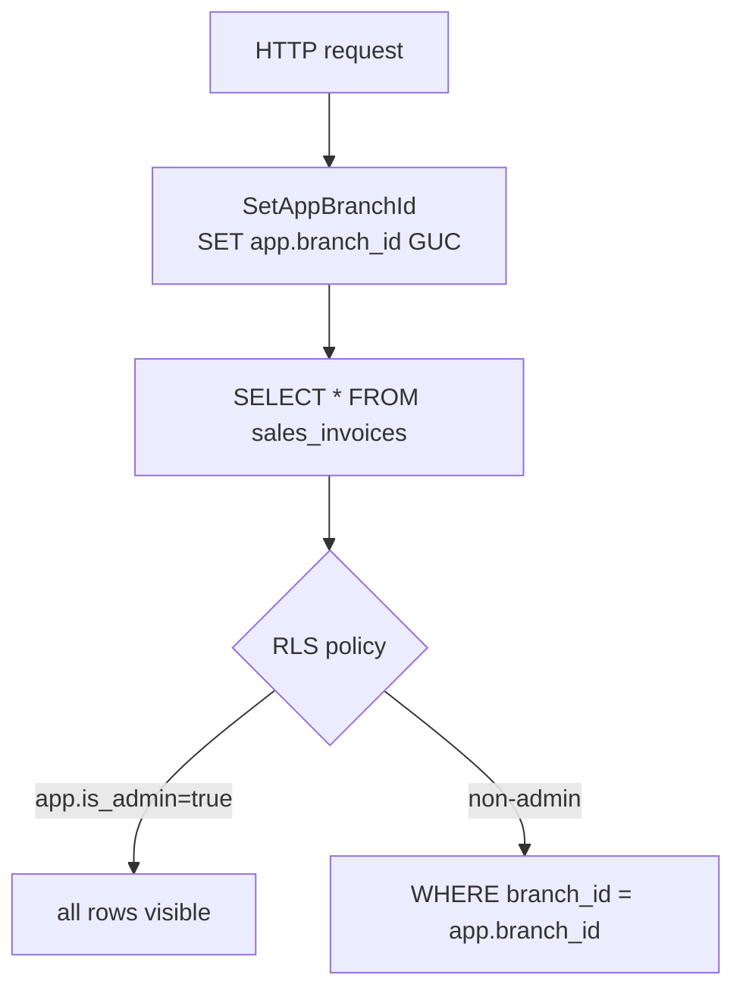

# Schema Overview

> **Module:** Database Design (overview)
> **Audience:** Engineers + AI assistants + DBAs
> **Status:** Draft
> **Last reviewed:** 2026-08-03
> **Source of truth:** this file, grounded in `laravel/database/sql/{01..07}*.sql` (7 raw DDL files) and `laravel/database/migrations/*.php` (160 migrations).

---

## 1. What is it?

The RC_ERP_v2 database is a **PostgreSQL 16** schema containing ~100 tables (78 base tables
defined in raw SQL DDL + ~40 added by migrations), 13 materialized views, 14 regular views,
~93 triggers, ~66 functions, ~152 CHECK constraints, and 30 partitioned parents. It was
migrated from a legacy MySQL database via pgloader, then hardened with double-entry integrity
triggers, hash-chained audit logs, row-level security, declarative range partitioning
(pg_partman), and a trigger-based FK workaround for partitioned parents.

The schema is organized into 3 PostgreSQL namespaces (`public`, `partman`, `archive`) and ~20
logical domains (Auth, Master Data, Accounting, Stock, Sales, Purchase, Payment, Intercompany,
Compliance, Budgeting, Fixed Assets, Notification, etc.).

## 2. Why does it exist?

The legacy MySQL schema had no DB-level enforcement of accounting integrity (Dr=Cr was
application-enforced and routinely violated), no audit trail, no branch isolation, and no
archival strategy. The PostgreSQL rewrite moves every safety-critical invariant to the
**lowest reliable layer** — a DB trigger or CHECK constraint — so that a bug in the application
layer can never corrupt the books. Partitioning was added to keep 7-year retention queryable
and to enable cheap archival of cold partitions. RLS was added so multi-branch isolation is
enforced even by raw SQL, not just by Eloquent scopes.

## 3. When is it used?

Always. The schema is the system of record. Every HTTP request opens a transaction that sets
the `app.branch_id` GUC (for RLS), reads/writes tables, and commits. Triggers fire inline to
enforce invariants and write audit rows. pg_cron jobs run nightly to refresh materialized
views, run pg_partman maintenance, and sweep partition health.

## 4. Who uses it?

- **Application (Laravel):** the only writer. Reads go through Eloquent + `BranchScope`; writes
  go through services that wrap `DB::transaction` + `JournalPostingService`.
- **pg_cron:** nightly jobs (partman maintenance 02:00, MV refreshes, partition health sweep
  03:00, autovacuum tuning monthly).
- **Console commands:** replay verification, partition performance measurement, Parquet export.
- **DBA:** direct read access for ad-hoc reporting; `UPDATE`/`DELETE` on `financial_audit_log`
  is revoked even from `postgres`.

## 5. Related modules

- `er-diagrams.md` — per-domain ER diagrams.
- `migrations-conventions.md` — how migrations are structured.
- `triggers-views-constraints.md` — the trigger/view/constraint catalog.
- `partitioning.md` — the partition scheme + retention matrix.
- `etl-legacy-migration.md` — the MySQL → PostgreSQL ETL pipeline.
- `../architecture/partitioning-archival.md` — partition architecture (Phase 1).
- `../business/business-rules-catalog.md` — the business invariants the schema enforces.

## 6. Business rules (schema-level)

- **Dr=Cr is enforced at the DB layer** by the `enforce_balanced_journal_entry` trigger on
  `journal_lines`. No application bug can write an unbalanced journal.
- **Negative stock is forbidden** by a CHECK + `prevent_negative_stock` trigger on
  `warehouse_stock` (tolerance -0.0001 for transient rounding).
- **Reversal, never mutation** — posted rows carry `is_reversed boolean DEFAULT false`; no
  `UPDATE` path exists for posted journal/stock rows in the application.
- **Financial audit log is immutable** — `REVOKE UPDATE, DELETE` from all roles; corrections are
  append-only via a new hash-chained row.
- **Branch isolation is enforced by RLS** — 5 policies per branch-scoped table; bypass only when
  `current_setting('app.is_admin', true) = 'true'`.
- **ENUMs are VARCHAR + CHECK, not PG ENUM types** — zero `CREATE TYPE` statements; enables
  schema evolution without `ALTER TYPE` locking.
- **Partitioned tables use composite primary keys** that include the partition key (PG
  requirement for UNIQUE on partitioned tables).

## 7. Technical implementation

### 7.1 Canonical schema source

The **raw SQL DDL files** (`laravel/database/sql/01_…07_*.sql`) are the canonical schema. The
first migration `2025_01_01_000001_create_rcerp_schema.php` loads them via a dollar-quote-aware
`splitSql()` splitter. Subsequent migrations apply incremental changes (partitioning, RLS,
approval workflow, fiscal year, intercompany, fixed assets, etc.).

| File | Lines | Tables | Domain |
|---|---|---|---|
| `01_auth_and_master.sql` | 290 | 16 | Auth + Master Data |
| `02_accounting.sql` | 480 | 18 | Accounting core + audit |
| `03_stock.sql` | 742 | 17 | Stock / Inventory |
| `04_sales.sql` | 231 | 8 | Sales |
| `05_purchase.sql` | 166 | 7 | Purchase |
| `06_payment_and_misc.sql` | 257 | 12 | Payments + Audit + Auth |
| `07_views_triggers_constraints.sql` | 912 | 0 (views/triggers/RLS/indexes only) | Cross-cutting |

### 7.2 Extensions (4)

| Extension | Purpose | Enabled by |
|---|---|---|
| `pgcrypto` | `digest()` for SHA-256 hash-chain audit log | `02_accounting.sql` + `2026_08_08_000005` |
| `btree_gist` | `=` operator on integers in GiST EXCLUDE constraints | `2025_01_21_000003` + `2025_01_22_000001` |
| `pg_partman` | Auto-create future partitions + retention/detachment | `2025_01_21_000004` + 7 other migrations |
| `pg_cron` | Database-level scheduled jobs | `2025_01_20_000009` + `2025_08_04_000001` |

### 7.3 Schemas (namespaces)

| Schema | Purpose |
|---|---|
| `public` | Default — all application tables, views, MVs, triggers. |
| `partman` | pg_partman config (`part_config` table) + maintenance functions. |
| `archive` | Detached partitions moved here for cold storage (never dropped — `retention_keep_table=true`). |

### 7.4 Naming conventions

| Pattern | Convention | Example |
|---|---|---|
| Tables | snake_case, plural | `sales_invoices`, `journal_lines` |
| PK | `id integer GENERATED ALWAYS AS IDENTITY PRIMARY KEY` (normal); `GENERATED BY DEFAULT AS IDENTITY` (partitioned parents, so IDs can be copied during migration) | `branches.id` |
| Composite PK | Includes partition key on partitioned tables | `stock_transactions PRIMARY KEY (id, transaction_date)` |
| `branch_id` FK | Every transactional table | `branch_id integer REFERENCES branches(id)` |
| Inter-branch | `from_branch_id` + `to_branch_id` | `money_transfers`, `branch_demands`, `branch_ledger` |
| Audit columns | `created_at`, `updated_at`, `created_by`, `deleted_at`, `deleted_by` (explicit, NOT Laravel SoftDeletes trait alone) | |
| Status flags | `is_active boolean DEFAULT true`, `is_reversed boolean DEFAULT false` | |
| Indexes | `idx_<table>_<cols>` (B-tree), `idx_<table>_<col>_brin` (BRIN), `idx_<table>_<col>_gin` (GIN), `uk_<table>_<cols>` (unique) | |
| Constraints | `<table>_<col>_unique`, `<table>_<col>_check`, `fk_<table>_<col>`, `rls_<table>_<verb>`, `trg_<table>_<action>`, `fn_<purpose>` | |

### 7.5 ENUM vs CHECK pattern

The codebase **exclusively uses `varchar(50) CHECK (col IN (...))`** instead of PostgreSQL
`CREATE TYPE` enums. Verified: zero `CREATE TYPE` statements in any SQL file or migration.
Rationale (per `docs/migration/schema_mapping.md` §3.4): adding a new enum value requires only
an `ALTER TABLE ... ALTER CHECK`, vs `ALTER TYPE ... ADD VALUE` for PG enums which has locking
implications. VARCHAR+CHECK is more flexible for a system under active development.

## 8. Important database tables

### 8.1 Tables-per-domain summary

| Domain | Tables | Examples |
|---|---|---|
| Auth | 5 | `branches`, `employees`, `users`, `menus`, `user_menu_permissions` |
| Master Data | 11 | `products`, `product_categories`, `product_groups`, `units_of_measure`, `product_uom_conversions`, `customers`, `suppliers`, `banks`, `bank_ledger_mappings`, `warehouses`, `product_price_history` |
| Accounting | 18 | `ledgers`, `journal_entries`, `journal_lines`, `journal_posting_logs`, `document_sequences`, `customer_ledger`, `supplier_ledger`, `employee_ledger`, `branch_ledger`, `cash_ledger`, `accounting_periods`, `manual_journals`, `manual_journal_lines`, `financial_audit_log`, `branch_cash`, `branch_expenses`, `branch_product_cost` |
| Stock | 17 | `stock_transactions`, `warehouse_stock`, `stock_adjustments`, `stock_adjustment_items`, `stock_take_sessions`, `stock_take_warehouses`, `stock_take_items`, `stock_take_audit_log`, `stock_take_policies`, `stock_adjustment_audit_log`, `warehouse_transfers`, `warehouse_transfer_items`, `damage_invoices`, `damage_invoice_items`, `daily_warehouse_stock_summary`, `branch_demands`, `branch_demand_items` |
| Sales | 8 + 5 commission + 1 challan_items | `sales_invoices`, `sales_invoice_items`, `sales_invoice_dispatchers`, `sales_invoice_dispatches`, `sales_challans`, `sales_challan_items`, `sales_draft_carts`, `sales_returns`, `sales_return_items`, `invoice_payment_allocations`, `commission_rules`, `commission_rule_tiers`, `commission_rule_product_groups`, `commission_rule_targets`, `commission_entries` |
| Purchase | 7 | `purchase_orders`, `purchase_order_items`, `purchase_receives`, `purchase_receive_items`, `purchase_returns`, `purchase_return_items`, `supplier_payment_settlements` |
| Payment & Misc | 12 | `customer_payments`, `customer_payment_settlements` (dropped), `supplier_payments`, `money_transfers`, `other_incomes`, `other_expenses`, `employee_transactions`, `notifications`, `investigation_activators`, `login_rate_limits`, `user_audit_log`, `schema_migrations` |
| Intercompany & Consolidation | 8 | `companies`, `consolidation_runs`, `elimination_rules`, `elimination_entries`, `branch_demand_repricing`, `branch_demand_money_transfer_settlements`, `branch_demand_customer_payment_settlements`, `branch_demand_audit_log` |
| Compliance & Audit | 6 | `system_policies`, `financial_audit_log`, `approval_workflows`, `approval_steps`, `approval_requests`, `approval_actions` |
| Budgeting & Dimensions | 4 | `budgets`, `budget_lines`, `dimensions`, `dimension_values` |
| Fixed Assets | 3 | `fixed_assets`, `asset_depreciation_schedules`, `asset_disposals` |
| Notification | 3 | `notifications`, `notification_rules`, `notification_rule_recipients` |
| Fiscal Year | 3 | `fiscal_years`, `fiscal_periods`, `period_close_log` |
| Bank Reconciliation | 3 | `bank_reconciliations`, `bank_statement_lines`, `bank_reconciliation_items` |
| Auth Support | 2 | `password_reset_tokens`, `remember_tokens` |
| Partition Health | 1 | `partition_health_alerts` |
| Replay Verification | 3 | `avg_cost_drift`, `warehouse_stock_shadow`, `reconciliation_snapshots` |
| Shadow Mode | 3 | `shadow_transfer_comparisons`, `shadow_cutover_log`, `shadow_demand_comparisons` |
| Damage | 2 | `damage_reasons`, `damage_attachments` |

### 8.2 Spine tables (the "crown jewels")

| Table | PK | Purpose |
|---|---|---|
| `journal_entries` | `(id, entry_date)` partitioned | GL header — referenced by ~25 transactional tables via `journal_entry_id` |
| `journal_lines` | `(id, entry_date)` partitioned | GL detail; composite FK `(journal_entry_id, entry_date) → journal_entries(id, entry_date)` enables partition-wise joins |
| `stock_transactions` | `(id, transaction_date)` partitioned | Inventory ledger SSOT; self-ref FK on `reversal_of_transaction_id` (trigger-enforced) |
| `warehouse_stock` | `(warehouse_id, product_id)` composite, NO `id` | Current on-hand snapshot with moving-average cost |
| `sales_invoices` | `(id, invoice_date)` partitioned | Sales header — 7 child tables reference it via trigger-based FK |

## 9. Related services

The schema is mutated exclusively through the service layer (78 services). Key writers:
- `StockService::applyTransaction` — the only writer of `warehouse_stock` + `stock_transactions`.
- `JournalPostingService::createJournalEntry` — the only creator of `journal_entries` + `journal_lines`.
- `DocumentSequenceService` — atomic doc# via `pg_advisory_xact_lock`.
- `JournalReversalService` — the only reversal path.

See `../business/core-workflows.md` for the full service map.

## 10. Related models

98 Eloquent models in `laravel/app/Models/`. Key spine models: `JournalEntry`, `JournalLine`,
`StockTransaction`, `WarehouseStock`, `SalesInvoice`, `Branch`, `Warehouse`, `Employee`, `User`.
All branch-scoped models use the `BranchScope` global scope (see `../architecture/branch-isolation-rls.md`).

## 11. Important workflows (schema-level)

### 11.1 A balanced journal write (end-to-end)

```mermaid
sequenceDiagram
    participant S as Service
    participant JPS as JournalPostingService
    participant DB as PostgreSQL
    S->>JPS: createJournalEntry(lines[])
    JPS->>JPS: pre-check abs(sumDr - sumCr) <= 0.01
    JPS->>DB: BEGIN; SET app.branch_id
    JPS->>DB: INSERT journal_entries
    JPS->>DB: INSERT journal_lines (multiple)
    DB->>DB: trg_journal_balanced (AFTER INSERT)
    DB->>DB: enforce_balanced_journal_entry()
    alt unbalanced
        DB-->>JPS: RAISE check_violation
        JPS->>DB: ROLLBACK
    else balanced
        DB->>DB: trg_audit_journal_lines → fn_financial_audit_trigger
        DB->>DB: INSERT financial_audit_log (hash-chained)
        DB-->>JPS: COMMIT
    end
```

### 11.2 RLS filter on a read



## 12. Known edge cases

- **`document_sequences.branch_id = 0` is a sentinel** for global sequences (advisory locks need
  cross-branch reads); it has special RLS policies and must NOT be joined to `branches`.
- **`ledgers.parent_id = 0` (MySQL sentinel) was converted to `NULL`** during ETL. Do not assume
  0 means "root".
- **`banks.balance` was FLOAT in MySQL**, converted to `numeric(18,2)` — a post-load fix logs
  deltas for accountant review.
- **`employees.role` CHECK originally omitted `user`** (raw DDL had 9 values); migration
  `2025_01_12_000001` replaced the constraint with the canonical 10-role list.
- **`warehouse_stock` has no `id` column** — composite PK `(warehouse_id, product_id)`. Code
  that assumes an `id` will fail.
- **`customer_payment_settlements` was dropped** in favor of `invoice_payment_allocations`
  (migration `2025_01_09_000001`).
- **`cash_ledger` has no `is_reversed` column** (unlike other sub-ledgers) — reversals create
  opposite-sign rows instead.
- **`notifications` table was overwritten** by the Laravel-standard UUID PK schema in Phase 2,
  replacing the original Phase 1 schema.

## 13. Future improvements

- **Partition-wise joins** — `enable_partitionwise_join` GUC must be verified on (`partition:verify-join`).
- **Consolidation posting for multi-entity** — the `companies` schema supports minority interest
  but the engine posts only single-entity inter-branch elimination.
- **Cold-storage Parquet export** — quarterly job exists (`partition:export-parquet`) but is not
  yet wired to a long-term retention policy.
- **`READ_ONLY` / `MAINTENANCE` / `EMERGENCY` system policy modes** are modeled but not active.

---

## Appendix A — Quantitative summary

| Metric | Count |
|---|---|
| Raw SQL DDL files | 7 |
| Migration files | 160 |
| Base tables (raw SQL) | 78 |
| Migration-added tables | ~40 |
| Total tables | ~100+ |
| Extensions | 4 |
| Schemas | 3 (public, partman, archive) |
| Partitioned parents | 30 |
| Materialized views | 13 unique |
| Regular views | 14 unique |
| Functions | 66 unique |
| Triggers | 93 total |
| RLS-enabled tables | 36 |
| CREATE POLICY statements | 403 total |
| CHECK constraints | 152+ in raw SQL |
| EXCLUDE constraints | 2 explicit + implicit partition-key UNIQUE |
| Indexes | ~700 (101 BRIN, 6 GIN, 4 GiST, ~25 partial, ~15 covering) |
| ETL files | 4 |

## Appendix B — The 13 materialized views

| MV | Purpose | Refresh |
|---|---|---|
| `mv_product_abc_classification` | Per-warehouse ABC ranking | nightly pg_cron |
| `mv_ledger_balances` | Per-ledger opening/period/closing | on-demand |
| `mv_ar_aging` | Customer receivable aging buckets | on-demand |
| `mv_ap_aging` | Supplier payable aging buckets | on-demand |
| `mv_stock_valuation` | Per-warehouse product stock value | on-demand |
| `mv_journal_entry_summary` | Per-JE debit/credit totals | on-demand |
| `mv_branch_intercompany` | Due-from/Due-to balances per branch pair | on-demand |
| `mv_product_movement_summary` | Per-product in/out totals | on-demand |
| `mv_customer_ledger_balance_check` | Running balance drift detection | on-demand |
| `mv_supplier_ledger_balance_check` | Same for supplier_ledger | on-demand |
| `mv_employee_ledger_balance_check` | Same for employee_ledger | on-demand |
| `mv_cash_ledger_balance_check` | Same for cash_ledger | on-demand |
| `mv_consolidated_trial_balance` | Consolidated trial balance | ConsolidationService |

All use `REFRESH MATERIALIZED VIEW CONCURRENTLY` (requires a UNIQUE index).
