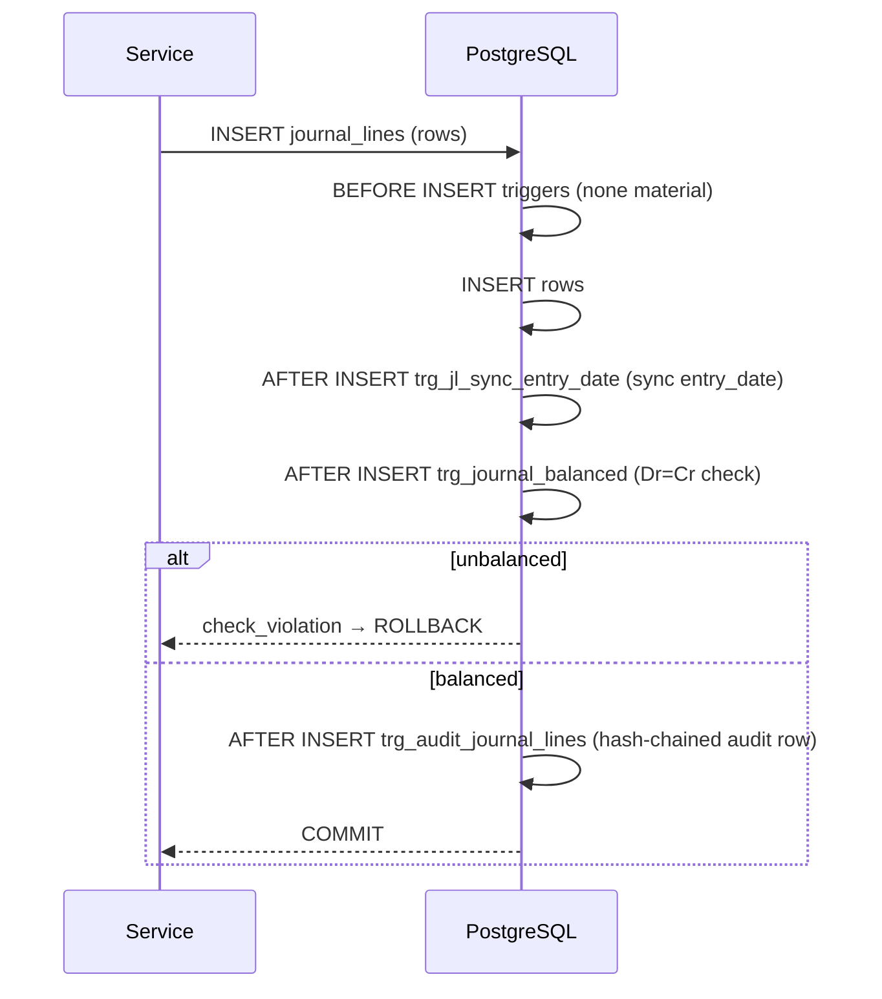
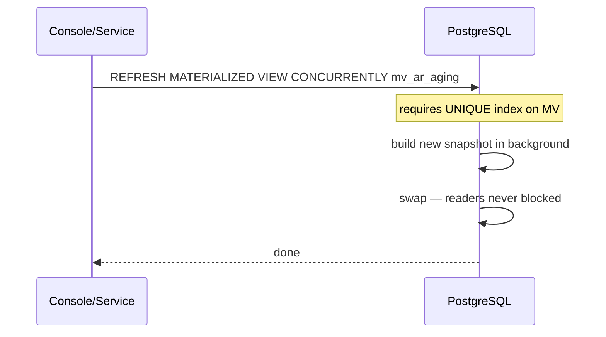

# Triggers, Views & Constraints

> **Module:** Database Design (server-side logic)
> **Audience:** Engineers + AI assistants + DBAs + auditors
> **Status:** Draft
> **Last reviewed:** 2026-08-03
> **Source of truth:** this file, grounded in `laravel/database/sql/02_accounting.sql`, `laravel/database/sql/03_stock.sql`, `laravel/database/sql/07_views_triggers_constraints.sql`, and the trigger-bearing migrations in `laravel/database/migrations/`.

---

## 1. What is it?

The catalog of PostgreSQL server-side logic that enforces business invariants and accelerates
reads: **~93 triggers**, **~66 functions**, **14 regular views**, **13 materialized views**,
**~152 CHECK constraints**, **2 explicit EXCLUDE constraints**, and the **RLS policy set** (5
policies × 36 tables = ~180 policies, plus admin-bypass). This is the defense-in-depth layer
that catches anything the application layer misses.

## 2. Why does it exist?

Because the application layer is not trusted with safety-critical invariants. A bug in a
service, a raw `DB::table()` call, or a console script could otherwise write an unbalanced
journal, drive stock negative, mutate a posted transaction, or leak data across branches. By
moving these invariants to DB triggers and CHECK constraints, the schema guarantees integrity
regardless of the writer. Views and MVs exist to pre-compute expensive aggregations (aging,
trial balance, reconciliation drift) so reports don't re-scan millions of rows per request.

## 3. When is it used?

- **Triggers** fire inline on every INSERT/UPDATE/DELETE of their table — within the user's
  transaction, so a violation rolls back the whole transaction.
- **Functions** are called by triggers or by the application (e.g. `partman.create_parent`,
  `archive_partition`, `partition_dry_run`).
- **Views** are queried on demand by reports/services.
- **Materialized views** are refreshed by pg_cron (nightly for ABC) or on-demand by services
  (`ConsolidationService`, `RunningBalanceReconcile`, `AbcClassificationService`) using
  `REFRESH MATERIALIZED VIEW CONCURRENTLY`.

## 4. Who uses it?

- **The DB** itself (triggers fire automatically).
- **pg_cron** (refreshes MVs, runs partman maintenance, sweeps partition health).
- **Services** call functions (`DocumentSequenceService` → advisory locks;
  `ConsolidationService` → `REFRESH MATERIALIZED VIEW`).
- **Console commands** (`partition:measure-perf`, `partition:verify-join`,
  `partition:export-parquet`, `stock:replay-verify`).
- **DBAs** query views for diagnostics (`v_partition_sizes`, `v_financial_audit_chain_verification`).

## 5. Related modules

- `schema-overview.md` — the tables these objects live on.
- `er-diagrams.md` — the trigger-based FKs (replacing declarative FKs to partitioned parents).
- `partitioning.md` — the partition-health triggers/functions.
- `../business/business-rules-catalog.md` — the business rules these objects enforce.
- `../architecture/branch-isolation-rls.md` — the RLS policy mechanism.

## 6. Business rules (enforced here)

- **Dr=Cr** — `enforce_balanced_journal_entry` trigger on `journal_lines`.
- **Negative stock forbidden** — `prevent_negative_stock` trigger + `ws_qty_nonnegative` CHECK
  on `warehouse_stock`.
- **Reversal immutability (audit)** — `fn_financial_audit_trigger` writes a hash-chained row on
  any INSERT/UPDATE/DELETE of 10 financial tables; `REVOKE UPDATE, DELETE` on the audit log.
- **Over-allocation prevention** — `fn_ipa_no_overallocation` trigger + `ipa_unique_invoice_payment`
  EXCLUDE constraint on `invoice_payment_allocations`.
- **Same-branch warehouse transfer only** — `enforce_same_branch_transfer` trigger on
  `warehouse_transfers`.
- **No overlapping frozen stock-take sessions** — `prevent_overlapping_frozen_stock_take`
  trigger on `stock_take_warehouses`.
- **Branch isolation** — 5 RLS policies per branch-scoped table.
- **Partition key sync (HOTFIX-9)** — `fn_jl_sync_entry_date` trigger on `journal_lines` syncs
  `entry_date` from `journal_entries` so the composite FK works.

## 7. Technical implementation

### 7.1 Triggers catalog (key triggers; ~93 total)

#### 7.1.1 Accounting integrity

| Trigger | Table | Timing/Event | Function | Purpose | Source |
|---|---|---|---|---|---|
| `trg_journal_balanced` | journal_lines | AFTER INSERT/UPDATE/DELETE | `enforce_balanced_journal_entry()` | Dr=Cr — raises `check_violation` if `SUM(debit) <> SUM(credit)` | `02_accounting.sql:94` |

**Function body (the crown jewel):**

```sql
CREATE OR REPLACE FUNCTION enforce_balanced_journal_entry()
RETURNS TRIGGER AS $$
DECLARE
    total_debit numeric(15,2);
    total_credit numeric(15,2);
BEGIN
    SELECT COALESCE(SUM(debit), 0), COALESCE(SUM(credit), 0)
    INTO total_debit, total_credit
    FROM journal_lines
    WHERE journal_entry_id = COALESCE(NEW.journal_entry_id, OLD.journal_entry_id);
    IF total_debit <> total_credit THEN
        RAISE EXCEPTION 'Journal entry % is not balanced: debits (%) do not equal credits (%)',
            COALESCE(NEW.journal_entry_id, OLD.journal_entry_id), total_debit, total_credit
            USING ERRCODE = 'check_violation';
    END IF;
    RETURN COALESCE(NEW, OLD);
END;
$$ LANGUAGE plpgsql;
```

#### 7.1.2 Stock integrity

| Trigger | Table | Timing/Event | Function | Purpose | Source |
|---|---|---|---|---|---|
| `trg_warehouse_stock_no_negative_insert` | warehouse_stock | BEFORE INSERT | `prevent_negative_stock()` | Blocks `qty < -0.0001` | `03_stock.sql:91` |
| `trg_warehouse_stock_no_negative_update` | warehouse_stock | BEFORE UPDATE | `prevent_negative_stock()` | Same, on update | `03_stock.sql:95` |
| `trg_stw_no_overlapping_frozen` | stock_take_warehouses | BEFORE INSERT OR UPDATE OF warehouse_id, freeze_outbound | `prevent_overlapping_frozen_stock_take()` | No overlapping frozen sessions per warehouse | `2025_08_01_000001:275` |
| `trg_enforce_same_branch_transfer` | warehouse_transfers | BEFORE INSERT OR UPDATE OF from_branch_id, to_branch_id | `enforce_same_branch_transfer()` | Blocks cross-branch transfers (must use Branch Demand) | `2025_07_28_000010:48` |
| `trg_st_reversal_fk` | stock_transactions | AFTER INSERT (CONSTRAINT, DEFERRABLE) WHEN reversal_of_transaction_id IS NOT NULL | `fn_st_reversal_fk_check()` | Self-ref FK for reversal_of_transaction_id | `2025_01_21_000004:414` |

#### 7.1.3 Financial audit (hash-chained, immutable)

`fn_financial_audit_trigger()` fires AFTER INSERT/UPDATE/DELETE on **10 financial tables**:

| Trigger | Table |
|---|---|
| `trg_audit_journal_entries` | journal_entries |
| `trg_audit_journal_lines` | journal_lines |
| `trg_audit_manual_journals` | manual_journals |
| `trg_audit_manual_journal_lines` | manual_journal_lines |
| `trg_audit_customer_payments` | customer_payments |
| `trg_audit_supplier_payments` | supplier_payments |
| `trg_audit_money_transfers` | money_transfers |
| `trg_audit_other_incomes` | other_incomes |
| `trg_audit_other_expenses` | other_expenses |
| `trg_audit_employee_transactions` | employee_transactions |

Each writes a row to `financial_audit_log` with: `before_data`, `after_data`,
`changed_columns`, `performed_by`, `branch_id`, `transaction_id xid`, `request_path`,
`request_ip`, `request_id`, and a SHA-256 `row_hash` chained to the previous row's hash. Uses
`pgcrypto` `digest()`. `REVOKE UPDATE, DELETE` from all roles. View
`v_financial_audit_chain_verification` flags `chain_valid = (prev_hash = LAG(row_hash))`.

#### 7.1.4 Trigger-based FKs (partitioned-parent workaround)

PG 12–17 does not allow a declarative FK to reference a partitioned table. These
`CREATE CONSTRAINT TRIGGER ... DEFERRABLE INITIALLY IMMEDIATE` triggers enforce referential
integrity at INSERT:

| Trigger | Child table | Referenced parent | Function |
|---|---|---|---|
| `trg_fk_sii_si` | sales_invoice_items | sales_invoices | `fn_fk_si_check('sales_invoice_id')` |
| `trg_fk_sid_si` | sales_invoice_dispatchers | sales_invoices | `fn_fk_si_check('sales_invoice_id')` |
| `trg_fk_sdis_si` | sales_invoice_dispatches | sales_invoices | `fn_fk_si_check('sales_invoice_id')` |
| `trg_fk_sc_si` | sales_challans | sales_invoices | `fn_fk_si_check('sales_invoice_id')` |
| `trg_fk_sr_si` | sales_returns | sales_invoices | `fn_fk_si_check('sales_invoice_id')` |
| `trg_fk_ipa_si` | invoice_payment_allocations | sales_invoices | `fn_fk_si_check('invoice_id')` |
| `trg_fk_ce_si` | commission_entries | sales_invoices | `fn_fk_ce_si_check()` |

And cascade-delete triggers on `sales_invoices` (AFTER DELETE):

| Trigger | Function |
|---|---|
| `trg_si_cascade_items` | `fn_fk_si_cascade_delete('sales_invoice_items', 'sales_invoice_id')` |
| `trg_si_cascade_dispatchers` | `fn_fk_si_cascade_delete('sales_invoice_dispatchers', 'sales_invoice_id')` |
| `trg_si_cascade_dispatches` | `fn_fk_si_cascade_delete('sales_invoice_dispatches', 'sales_invoice_id')` |

**`fn_fk_si_check` body:**

```sql
CREATE OR REPLACE FUNCTION fn_fk_si_check()
RETURNS trigger AS $$
DECLARE
    fk_col text := TG_ARGV[0];
    invoice_id_val integer;
    invoice_exists boolean;
BEGIN
    EXECUTE format('SELECT ($1).%I', fk_col) USING NEW INTO invoice_id_val;
    IF invoice_id_val IS NULL THEN
        RETURN NEW;
    END IF;
    SELECT EXISTS (SELECT 1 FROM sales_invoices WHERE id = invoice_id_val) INTO invoice_exists;
    IF NOT invoice_exists THEN
        RAISE EXCEPTION 'Referential integrity: %=% does not exist in sales_invoices', fk_col, invoice_id_val;
    END IF;
    RETURN NEW;
END;
$$ LANGUAGE plpgsql;
```

#### 7.1.5 LISTEN/NOTIFY triggers (realtime)

10 triggers fire AFTER INSERT/UPDATE on their table, calling `pg_notify()` with a JSON payload
(see `../architecture/realtime-events.md`):

| Trigger | Table | Channel |
|---|---|---|
| `trg_notify_sales_invoices` | sales_invoices | `sales_invoice_changes` |
| `trg_notify_sales_challans` | sales_challans | `sales_challan_changes` |
| `trg_notify_sales_returns` | sales_returns | `sales_return_changes` |
| `trg_notify_customer_payments` | customer_payments | `customer_payment_changes` |
| `trg_notify_stock_transactions` | stock_transactions | `stock_changes` |
| `trg_notify_journal_entries` | journal_entries | `journal_entry_changes` |
| `trg_notify_system_policies` | system_policies | `system_policy_changes` |
| `trg_notify_damage_invoices` | damage_invoices | `damage_invoice_changes` |
| `trg_notify_damage_attachments_insert` | damage_attachments | `damage_attachment_changes` |
| `trg_notify_damage_attachments_delete` | damage_attachments | `damage_attachment_changes` |

#### 7.1.6 Over-allocation prevention

| Trigger | Table | Function | Purpose |
|---|---|---|---|
| `trg_ipa_no_overallocation` | invoice_payment_allocations | `fn_ipa_no_overallocation()` | Sum-based: blocks `SUM(allocated) > invoice.total_amount` |

#### 7.1.7 Commission automation

| Trigger | Table | Function | Purpose |
|---|---|---|---|
| `trg_ce_set_period` | commission_entries | `fn_ce_set_period()` | Auto-set `commission_period` from `entry_date` (YYYY-MM) |
| `trg_ce_updated_at` | commission_entries | `fn_ce_updated_at()` | Auto-touch `updated_at` |
| `trg_ce_validate_source` | commission_entries | `fn_ce_validate_source()` | Exactly one of `allocation_id`/`sales_return_id` set |

#### 7.1.8 HOTFIX-9 (partition key sync)

| Trigger | Table | Function | Purpose |
|---|---|---|---|
| `trg_jl_sync_entry_date` | journal_lines | `fn_jl_sync_entry_date()` | BEFORE INSERT OR UPDATE OF journal_entry_id — syncs `entry_date` from `journal_entries` so the composite FK `(journal_entry_id, entry_date)` works for partition-wise joins |

#### 7.1.9 updated_at auto-touch (41 tables)

A `DO` block in `07_views_triggers_constraints.sql` (lines 51-81) loops over 41 tables and
creates `trg_<table>_updated_at BEFORE UPDATE` calling the shared `update_updated_at_column()`
function — replaces MySQL's `ON UPDATE CURRENT_TIMESTAMP`.

### 7.2 Functions catalog (~66 unique; grouped)

**Core business invariants:**
- `enforce_balanced_journal_entry()` — Dr=Cr
- `prevent_negative_stock()` — qty >= -0.0001
- `prevent_overlapping_frozen_stock_take()` — no overlapping frozen sessions
- `enforce_same_branch_transfer()` — cross-branch transfer block
- `fn_financial_audit_trigger()` — SHA-256 hash-chained audit (SECURITY DEFINER; reads
  `app.request_path`, `app.request_ip`, `app.request_id` GUCs)
- `fn_jl_sync_entry_date()` — HOTFIX-9 partition key sync
- `fn_ipa_no_overallocation()` — over-allocation prevention
- `fn_st_reversal_fk_check()` — self-ref FK for stock_transactions
- `fn_fk_si_check()` / `fn_fk_si_cascade_delete()` — trigger-based FK to partitioned sales_invoices
- `fn_fk_ce_si_check()` — trigger-based FK for commission_entries
- `fn_ce_set_period()` / `fn_ce_updated_at()` / `fn_ce_validate_source()` — commission automation
- `update_updated_at_column()` — shared updated_at trigger fn (41 tables)
- `doc_seq_advisory_key(p_doc_type, p_branch_id, p_period_key)` — SQL mirror of PHP
  `DocumentSequenceService::computeLockKey()`

**LISTEN/NOTIFY (10 functions):**
- `rcerp_notify(p_channel, p_table, p_action, p_id, p_branch_id, p_changes)` — central helper
- `rcerp_notify_sales_invoice()`, `..._sales_challan()`, `..._sales_return()`,
  `..._customer_payment()`, `..._stock_change()`, `..._journal_entry()`, `..._system_policy()`
- `trg_notify_damage_invoices()`, `rcerp_notify_damage_attachment()`,
  `rcerp_notify_damage_attachment_delete()`

**ABC classification (3 STABLE sql fns):**
- `stock_take_abc_threshold_a()` (default 0.80), `stock_take_abc_threshold_b()` (default 0.95),
  `stock_take_abc_lookback_days()` (default 365)

**Partition health (8 fns):**
- `partition_dry_run(p_table, p_control)` — planning metrics
- `archive_partition(p_parent, p_partition)` — DETACH + SET SCHEMA archive
- `restore_partition(p_parent, p_partition, p_start, p_end)` — reverse
- `consolidate_partitions(p_parent, p_strategy, p_dry_run)` — quarterly/yearly consolidation
- `run_quarterly_consolidation()` — wrapper for 4 highest-volume parents
- `check_future_partitions()`, `check_default_partitions()`, `check_partman_stale()`,
  `check_retention_configured()`, `check_brin_index_usage()`, `check_trigger_fks_functional()`

**Vacuum tuning (3 fns):**
- `tune_partition_autovacuum()`, `run_monthly_autovacuum_tuning()`,
  `vacuum_analyze_high_write_tables()`

**CTE reports (4 fns):**
- `rcerp_general_ledger_cte()`, `rcerp_ar_aging_cte()`, `rcerp_gross_margin_cte()`,
  `rcerp_today_summary()`

**Stock-take automation (3 fns):**
- `stock_take_mark_stale_sessions()`, `stock_take_reconciliation_alert_sweep()`,
  `stock_take_abc_classification_status()`

**Misc:**
- `refresh_all_report_views()`, `purge_old_notifications()`,
  `fn_check_journal_entry_exists(p_je_id)`

### 7.3 Regular views catalog (14 unique)

| View | Purpose | Source |
|---|---|---|
| `v_journal_entries_with_lines` | JOIN journal_entries ⨝ journal_lines ⨝ ledgers — GL report | `07_*.sql:10` |
| `v_financial_audit_chain_verification` | Validates SHA-256 hash chain (`prev_hash = LAG(row_hash)`) | `02_accounting.sql:470` |
| `v_listen_notify_channels` | Active LISTEN sessions via pg_stat_activity | `2025_01_21_000001:385` |
| `v_pg_cron_jobs` | Wraps `cron.job` for admin UI | `2025_01_20_000009:269` |
| `v_today_summary` | Today's sales/payment/stock summary (CTE) | `2025_01_21_000002:702` |
| `v_ar_aging_today` | AR aging as of today (CTE) | `2025_01_21_000002:708` |
| `budget_vs_actual` | Budget lines vs actual journal_lines with variance % | `2026_08_10_000002:119` |
| `v_unreconciled_bank_entries` | Bank ledger entries not yet reconciled | `2026_08_12_000001:186` |
| `v_partition_sizes` | One row per partition child with size + seq_scans | `2026_08_28_000004:64` |
| `v_partition_vacuum_stats` | Per-partition VACUUM/ANALYZE timing + dead tuples | `2026_08_28_000004:90` |
| `v_default_partition_check` | Rows in `_default` partitions (should be 0) | `2026_08_28_000004:126` |
| `v_missing_future_partitions` | partman.part_config entries with <3 future partitions | `2026_08_28_000004:171` |
| `v_catalog_bloat` | Sizes of pg_class, pg_attribute, pg_depend, pg_constraint, pg_index | `2026_08_28_000004:237` |

### 7.4 Materialized views catalog (13 unique)

| MV | Purpose | Refresh |
|---|---|---|
| `mv_product_abc_classification` | Per-warehouse ABC ranking | nightly pg_cron `refresh-abc-classification` |
| `mv_ledger_balances` | Per-ledger opening/period/closing | on-demand (RunningBalanceReconcile) |
| `mv_ar_aging` | Customer receivable aging buckets (0-30/31-60/61-90/90+) | on-demand |
| `mv_ap_aging` | Supplier payable aging buckets | on-demand |
| `mv_stock_valuation` | Per-warehouse product stock with value (qty × avg_cost) | on-demand |
| `mv_journal_entry_summary` | Per-JE debit/credit totals | on-demand |
| `mv_branch_intercompany` | Due-from/Due-to balances per branch pair | on-demand |
| `mv_product_movement_summary` | Per-product in/out totals | on-demand |
| `mv_customer_ledger_balance_check` | Window-function running balance drift detection | on-demand |
| `mv_supplier_ledger_balance_check` | Same for supplier_ledger | on-demand |
| `mv_employee_ledger_balance_check` | Same for employee_ledger | on-demand |
| `mv_cash_ledger_balance_check` | Same for cash_ledger | on-demand |
| `mv_consolidated_trial_balance` | Consolidated trial balance for group reporting | ConsolidationService |

All use `REFRESH MATERIALIZED VIEW CONCURRENTLY` (requires a UNIQUE index on the MV).

### 7.5 Constraints catalog (key non-trivial)

#### 7.5.1 CHECK constraints (152+ in raw SQL + many in migrations)

| Constraint | Table | Rule | Source |
|---|---|---|---|
| `jl_balanced_check` | journal_lines | `debit >= 0 AND credit >= 0` | `02_accounting.sql:65` |
| `jl_not_both_zero_check` | journal_lines | `debit > 0 OR credit > 0` | `02_accounting.sql:66` |
| `mjl_debit_non_negative` | manual_journal_lines | `debit >= 0` | `02_accounting.sql:317` |
| `mjl_credit_non_negative` | manual_journal_lines | `credit >= 0` | `02_accounting.sql:318` |
| `mjl_not_both_zero` | manual_journal_lines | `debit > 0 OR credit > 0` | `02_accounting.sql:319` |
| `ws_qty_nonnegative` | warehouse_stock | `qty >= -0.0001` (epsilon for float rounding) | `03_stock.sql:77` |
| `ipa_allocated_amount_positive` | invoice_payment_allocations | `allocated_amount > 0` | `2025_01_21_000003:58` |
| `employees_role_check` | employees | `role IN ('admin','salesman','warehouse_manager','dispatcher','accountant','hr','manager','other','superadmin','user')` (10-role fix) | `2025_01_12_000001:33` |
| `sa_category_check` | stock_adjustments | `adjustment_category IN ('opening_balance','data_migration','uom_correction','post_conversion_fix','legacy_cleanup','reconciliation_variance','other')` | `03_stock.sql:110` |
| Status CHECKs | (every transactional table) | varies — `sales_invoices.status`, `purchase_orders.status`, `stock_take_sessions.status` (7 states), `manual_journals.status` (6 states, expanded by approval workflow), etc. | throughout |

#### 7.5.2 EXCLUDE constraints (2 explicit)

**`ipa_unique_invoice_payment`** — prevents duplicate (invoice, payment) pairs:

```sql
ALTER TABLE invoice_payment_allocations
ADD CONSTRAINT ipa_unique_invoice_payment
EXCLUDE USING gist (
    invoice_id WITH =,
    payment_id WITH =
);
```

**`commission_rules_unique_active`** — one active open-ended rule per salesman:

```sql
EXCLUDE USING gist (
    salesman_id WITH =,
    (CASE WHEN is_active AND effective_to IS NULL
          THEN daterange(effective_from, NULL, '[)')
          ELSE daterange(NULL, NULL, '[]')
     END) WITH &&
) WHERE (is_active AND effective_to IS NULL);
```

Both require the `btree_gist` extension (for `=` on integers / daterange in GiST).

#### 7.5.3 Implicit partition-key-required UNIQUE

On every partitioned parent, UNIQUE (including PK) must include the partition key:

```sql
-- sales_invoices
PRIMARY KEY (id, invoice_date),
CONSTRAINT sales_invoices_code_unique UNIQUE (invoice_code, invoice_date)
```

### 7.6 RLS policies (5 per branch-scoped table × 36 tables)

```sql
ALTER TABLE employees ENABLE ROW LEVEL SECURITY;
ALTER TABLE employees FORCE ROW LEVEL SECURITY;
CREATE POLICY rls_employees_select ON employees FOR SELECT
    USING (current_setting('app.is_admin', true) = 'true' OR branch_id = current_setting('app.branch_id')::int);
CREATE POLICY rls_employees_insert ON employees FOR INSERT
    WITH CHECK (current_setting('app.is_admin', true) = 'true' OR branch_id = current_setting('app.branch_id')::int);
CREATE POLICY rls_employees_update ON employees FOR UPDATE
    USING (...) WITH CHECK (...);
CREATE POLICY rls_employees_delete ON employees FOR DELETE
    USING (...);
CREATE POLICY rls_employees_admin ON employees FOR ALL
    USING (current_setting('app.is_admin', true) = 'true') WITH CHECK (...);
```

`document_sequences` has a special `branch_id = 0` global-access policy (advisory locks need
cross-branch reads). See `../architecture/branch-isolation-rls.md` for the full mechanism.

### 7.7 Index catalog (~700 total; key non-trivial)

| Type | Count | Representative |
|---|---|---|
| B-tree | ~580 | `idx_si_customer`, `idx_jl_journal_entry` |
| Partial (WHERE) | ~25 | `idx_wh_is_frozen`, `idx_si_open_invoice`, `system_policies_one_active` |
| Covering (INCLUDE) | ~15 | `idx_si_customer_due_covering`, `idx_jl_entry_covering` |
| BRIN | 101 | `idx_si_invoice_date_brin`, `idx_st_transaction_date_brin` |
| GIN | 6 | `idx_products_search`, `idx_sdc_items_gin` |
| GiST | 4 | backs the 2 EXCLUDE constraints |

**Generated columns for full-text search:**

```sql
ALTER TABLE products ADD COLUMN search_vector tsvector
    GENERATED ALWAYS AS (
        setweight(to_tsvector('simple', coalesce(product_name, '')), 'A') ||
        setweight(to_tsvector('simple', coalesce(product_code, '')), 'B')
    ) STORED;
```

## 8. Important database tables

The triggers/views/constraints live ON the tables cataloged in `schema-overview.md`. The most
trigger-dense tables: `journal_lines` (balanced + audit + sync), `warehouse_stock` (negative +
audit), `sales_invoices` (7 trigger-based FKs + cascade + notify + audit), `invoice_payment_allocations`
(EXCLUDE + over-allocation + trigger FK).

## 9. Related services

- `DocumentSequenceService` — calls `pg_advisory_xact_lock` (function `doc_seq_advisory_key`
  mirrors the PHP key).
- `ConsolidationService` — `REFRESH MATERIALIZED VIEW mv_consolidated_trial_balance`.
- `RunningBalanceReconcile` command — refreshes the 4 `*_ledger_balance_check` MVs.
- `AbcClassificationService::refresh` — refreshes `mv_product_abc_classification`.
- `StockTakeService` — reads `stock_take_abc_threshold_a/b/lookback_days()` STABLE functions.

## 10. Related models

Most views/MVs do not have Eloquent models (queried via `DB::table('v_...')` or
`DB::table('mv_...')`). A few MVs have read-only models for typed access.

## 11. Important workflows

### 11.1 Trigger firing order on a journal write



### 11.2 MV refresh (concurrent)



## 12. Known edge cases

- **Trigger-based FKs fire only on INSERT**, not UPDATE of the FK column. The application never
  re-points FKs via UPDATE; reversals create new rows.
- **`fn_financial_audit_trigger` is `SECURITY DEFINER`** and reads GUCs (`app.request_path`,
  `app.request_ip`, `app.request_id`) set by `SetAppBranchId` middleware. Console scripts that
  don't set these GUCs will write NULL request fields.
- **`REFRESH MATERIALIZED VIEW CONCURRENTLY` requires a UNIQUE index** on the MV — if the index
  is dropped, refresh falls back to non-concurrent (blocks readers).
- **`financial_audit_log` is `REVOKE UPDATE, DELETE`** from all roles including `postgres` and
  `remote_center`. Corrections are append-only.
- **`prevent_negative_stock` tolerance is -0.0001** — a CHECK at exactly 0 would reject
  legitimate float rounding within a transaction.
- **`trg_jl_sync_entry_date` (HOTFIX-9)** must fire BEFORE `trg_journal_balanced` — order
  matters; the partition key must be populated before the balanced check reads `journal_entries`.
- **`commission_rules_unique_active` EXCLUDE** uses a `CASE` to produce a daterange — only one
  active open-ended rule per salesman is allowed.
- **`v_financial_audit_chain_verification`** flags `chain_valid = (prev_hash = LAG(row_hash))` —
  if any row is tampered, the chain breaks at that row.

## 13. Future improvements

- **Declarative FKs to partitioned parents** — PG 18+ may relax the restriction, allowing the
  trigger-based FKs to be replaced.
- **`NOT VALID` + `VALIDATE CONSTRAINT`** for CHECK constraints on large tables, to avoid
  long scans during migration.
- **Per-row audit for master data** — currently only financial tables have the hash-chained
  audit; master-data changes go to `user_audit_log` (not hash-chained). A candidate for parity.
- **MV refresh orchestration** — a single `refresh_all_report_views()` function exists but is
  not scheduled; wiring it to pg_cron would simplify ops.

---

## Appendix A — Trigger density per table

| Table | Triggers | Notes |
|---|---|---|
| `journal_lines` | 3 (sync, balanced, audit) | The most protected table |
| `sales_invoices` | 3 cascade-delete + notify + audit | Partitioned parent |
| `warehouse_stock` | 2 (negative insert + update) | Composite PK |
| `stock_take_warehouses` | 1 (no overlapping frozen) | — |
| `warehouse_transfers` | 1 (same-branch) | — |
| `invoice_payment_allocations` | 2 (over-allocation + trigger FK) | + EXCLUDE constraint |
| 10 financial tables | 1 each (audit) | hash-chained |
| 10 child tables of sales_invoices | 1 each (trigger FK) | partitioned-parent workaround |
| 41 tables | 1 each (updated_at) | shared `update_updated_at_column()` |

## Appendix B — Where each trigger is defined

| Category | Primary source file |
|---|---|
| Accounting integrity | `database/sql/02_accounting.sql` |
| Stock integrity | `database/sql/03_stock.sql` + `2025_08_01_000001` + `2025_07_28_000010` |
| Financial audit | `database/sql/02_accounting.sql` + `2026_08_08_000002` + `2026_08_08_000005` (pgcrypto) + `2026_08_08_000006`/`000007` (fixes) |
| Trigger-based FKs | `2025_01_21_000004_set_up_table_partitioning.php` (lines 965-1090) |
| LISTEN/NOTIFY | `2025_01_21_000001_add_listen_notify_triggers.php` + `2026_01_02/03_000001` (damage) |
| Over-allocation | `2025_01_21_000003_add_exclude_constraint_invoice_payment_allocations.php` |
| Commission | `2025_01_22_000001_create_commission_tracking.php` |
| HOTFIX-9 | `2026_08_22_000001_add_entry_date_to_journal_lines.php` + `2026_08_29_000001_fix_journal_lines_sync_trigger_fk_guard.php` |
| updated_at (×41) | `database/sql/07_views_triggers_constraints.sql` (DO block lines 51-81) |
| Partition health | `2026_08_25_000002` + `2026_08_28_000001/000002/000003/000005` |
