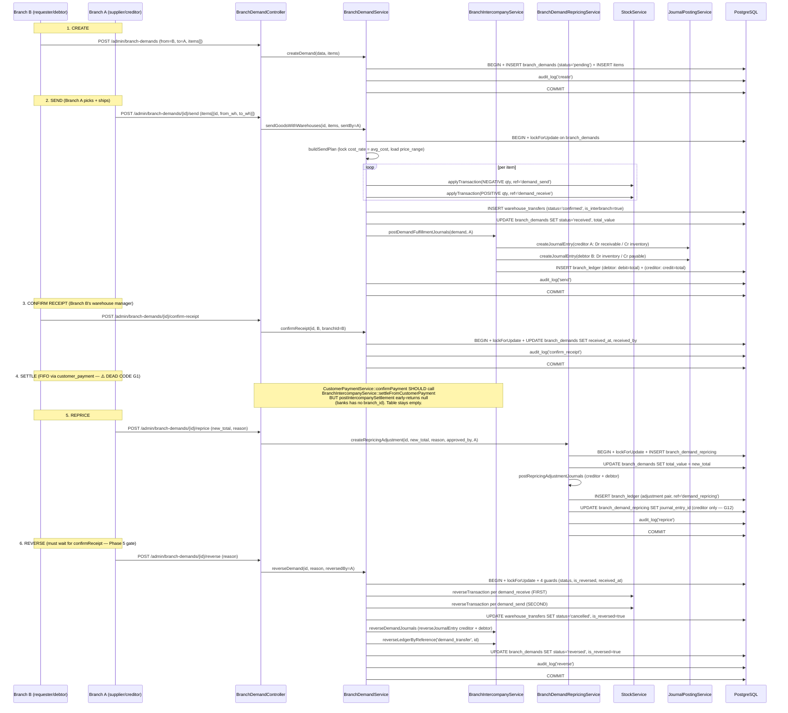
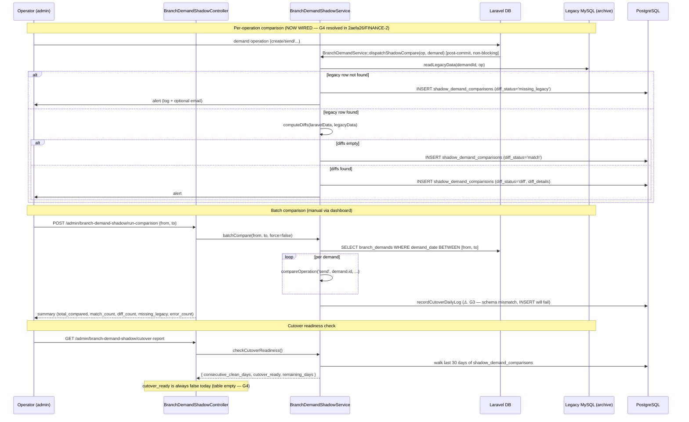

# Branch Demand (Inter-Branch Requisition, Settlement, Shadow Mode) — Phase 13

> **Module:** Finance / Branch Demand
> **Audience:** Engineers, AI assistants, accountants
> **Status:** Draft — pending accountant sign-off (**SAFETY-CRITICAL** — posts GL, moves stock,
> reverses stock, settles intercompany balances. **8 CRITICAL gaps** originally catalogued; **ALL 8 now resolved**
> (G1+G2+G7 in `5905123`/FINANCE-3, G3+G4 in `2aefa26`/FINANCE-2, G5+G6 in `0385b87`/FINANCE-1, G8 in `dd31590`).
> **0 remain open** — the CRITICAL tier for this doc is closed. MAJOR + MINOR tiers still have open items.
> **Last reviewed:** 2026-09-05 (post-FINANCE-3: G-329/G-331/G-336/G-342 resolved in `8cfe7ca`)
> **Source of truth:** This file is the canonical reference for the branch-demand subsystem. The
> implementation lives in
> `laravel/app/Models/{BranchDemand,BranchDemandItem,BranchDemandRepricing,BranchDemandCustomerPaymentSettlement,BranchDemandMoneyTransferSettlement}.php`,
> `laravel/app/Services/BranchDemand/BranchDemandService.php`,
> `laravel/app/Services/BranchDemand/BranchDemandShadowService.php`,
> `laravel/app/Services/BranchDemand/BranchDemandRepricingService.php`,
> `laravel/app/Services/BranchDemand/BranchDemandAuditService.php`,
> `laravel/app/Services/BranchDemand/BranchDemandAuditLogger.php`,
> `laravel/app/Services/BranchDemand/BranchDemandWeeklyReportService.php`,
> `laravel/app/Services/BranchDemand/BranchIntercompanyService.php` (demand-requisition +
> repricing + settlement half — the intercompany posting-pairs half is documented in
> `./consolidation-intercompany.md`),
> `laravel/app/Http/Controllers/Admin/BranchDemandController.php`,
> `laravel/app/Http/Controllers/Admin/BranchDemandShadowController.php`,
> `laravel/app/Http/Controllers/Admin/BranchDemandReportController.php`,
> `laravel/app/Http/Controllers/Api/V1/BranchDemand/BranchDemandApiController.php`,
> `laravel/app/Http/Requests/BranchDemand/*.php` (6 FormRequests),
> `laravel/app/Http/Resources/Api/V1/BranchDemand/*.php` (2 Resources),
> `laravel/config/branch_demand_shadow.php`,
> `laravel/app/Console/Commands/VerifyBranchDemandSchema.php`, and migrations
> `laravel/database/migrations/2026_07_29_000010…000019_*.php` +
> `2025_07_28_000011_*.php` + `2025_07_28_000012_*.php`.

---

## 1. What is it?

The **Branch Demand subsystem** is the ERP's inter-branch product requisition + settlement
engine. When Branch B (the *requester* / *debtor*) needs products that Branch A (the
*supplier* / *creditor*) has in stock, Branch B raises a demand; Branch A fulfils it by moving
stock from its warehouse to Branch B's warehouse. The subsystem:

1. **Tracks the demand lifecycle** — `pending` → `received` → (`reversed` | confirmed) and
   `pending` → `rejected`. The receipt must be confirmed by Branch B's warehouse manager before
   any reversal can happen (Phase 5 gate).
2. **Posts intercompany GL journals** — a dual-entry pair: at the supplier, `Dr Due-from
   Branches / Cr Inventory`; at the requester, `Dr Inventory / Cr Due-to Branches`. The pair is
   documented in `./consolidation-intercompany.md` §9.
3. **Maintains the `branch_ledger` sub-ledger** — a running balance per branch pair, debited at
   the requester (owes more) and credited at the supplier (owed more).
4. **Settles open demands FIFO** when a customer pays via bank at the debtor branch or when an
   inter-branch money transfer arrives. ⚠️ **DEAD CODE today** (G1 + G2).
5. **Supports repricing** — after goods are sent but before settlement completes, the demand's
   `total_value` can be adjusted (positive or negative). Posts a dual GL adjustment pair + a
   `branch_ledger` adjustment.
6. **Runs in shadow mode** during the legacy MySQL → Laravel migration — compares every demand
   operation against the legacy `branch_intercompany` table and tracks cutover readiness
   (7 consecutive zero-diff days). ⚠️ **NOT WIRED today** (G4).
7. **Audits every state transition** — 11-value action enum (`create`, `send`,
   `confirm_receipt`, `reverse`, `delete`, `reject`, `reprice`, `settle`,
   `settlement_reverse`, `export`, `print`). Anti-gaming flags + 6-checklist + per-demand audit
   + branch-pair reconciliation.
8. **Generates a weekly report** — 25-column daily report replicating the legacy
   "MAIN BILL SHIT1.xlsx" Excel sheet, with CSV export + drill-down.

The subsystem spans **5 demand tables** (`branch_demands`, `branch_demand_items`,
`branch_demand_repricing`, `branch_demand_customer_payment_settlements`,
`branch_demand_money_transfer_settlements`) + **1 sub-ledger table** (`branch_ledger`) + **1
audit table** (`branch_demand_audit_log`) + **2 shadow tables**
(`shadow_demand_comparisons`, `shadow_cutover_log`). It has **7 services** (5,652 LOC), **4
controllers** (1,923 LOC), **6 FormRequests**, **2 API Resources**, **0 Policies**, **1 config
file**, **1 artisan command**, **0 scheduled jobs**, **0 tests**.

It has both a **web UI** (`routes/web.php:680-755`, 28 routes) and a **REST API**
(`routes/api.php:470-554`, 14 endpoints under `api/v1/branch-demands`). The API uses the same
service layer as the web — no parallel business logic.

> **CRITICAL — 4 DEAD-CODE gaps (ALL RESOLVED):**
> - **G1** ✅ `5905123` (FINANCE-3) — `CustomerPaymentService::postIntercompanySettlement`
>   rewritten to the canonical two-JE intercompany pattern. The stale early-return (justified
>   by "banks has no branch_id" — invalidated by migration `2026_08_06_000001`) is gone.
>   `settleFromCustomerPayment` is now wired from `confirmPayment` (non-blocking).
> - **G2** ✅ `5905123` (FINANCE-3) — `MoneyTransferService::postIntercompanySettlement`
>   rewritten to use `interbranch_receivable` + `interbranch_payable` (NOT the parallel
>   `intercompany` nature) + a `branch_ledger` row. `settleFromMoneyTransfer` is now wired
>   from `createTransfer` (non-blocking).
> - **G3** ✅ `2aefa26` (FINANCE-2) — `shadow_cutover_log` schema mismatch fixed.
> - **G4** ✅ `2aefa26` (FINANCE-2) — `BranchDemandShadowService::compareOperation` wired into
>   7 demand transition methods via `dispatchShadowCompare`.
>
> See §6 BR21-BR25 + §11 G1-G4. **All 8 CRITICAL gaps in §11.1 are now RESOLVED** —
> G1/G2/G7 in `5905123` (FINANCE-3), G3/G4 in `2aefa26` (FINANCE-2), G5/G6 in `0385b87`
> (FINANCE-1), G8 in `dd31590`. The CRITICAL tier for this doc is closed.

---

## 2. Why does it exist?

Five business + one engineering drivers:

1. **Cross-branch product supply.** When one branch needs products another branch has, the
   subsystem orchestrates the request, the warehouse-level send, the documentary warehouse
   transfer, the stock movement, and the receipt confirmation. Without it, branches would have
   to use ad-hoc stock adjustments (which bypass intercompany accountability).
2. **Intercompany accountability.** Every cross-branch stock movement creates a real obligation:
   Branch B owes Branch A the cost of the goods. The dual GL journals (`Dr Due-from / Cr
   Inventory` at supplier; `Dr Inventory / Cr Due-to` at requester) + the `branch_ledger`
   running balance per branch pair track this obligation precisely.
3. **FIFO settlement.** When a customer pays Branch B (the debtor) via bank, or Branch B sends
   cash to Branch A via money transfer, the oldest open demand should be settled first (FIFO).
   `fifoSettleDemands` implements this — **but is DEAD CODE today** (G1 + G2).
4. **Repricing.** After goods are sent but before settlement, the supplier and requester may
   agree to adjust the price (e.g. cost-rate correction, market-price update, discount). The
   repricing subsystem posts a dual GL adjustment pair + a `branch_ledger` adjustment, with
   append-only audit rows in `branch_demand_repricing`.
5. **Anti-gaming audit.** Three flags catch suspicious patterns: `catalog_below_locked`
   (supplier inflated cost after send), `sales_below_cost` (receiver sells below locked cost),
   `stale_outstanding` (open principal > 30 days). Plus a 6-checklist audit + per-demand audit
   trail + branch-pair reconciliation.
6. **Cutover safety.** The legacy system (a separate MySQL `archive` connection) tracked
   intercompany in a `branch_intercompany` table. The Laravel port replicates the same shape
   (`debit`/`credit`/`running_balance`/`is_reversed`) + provides shadow-mode comparison for
   the migration window.

---

## 3. When is it used?

| Event | Trigger | Frequency | Lifecycle stage |
|---|---|---|---|
| Demand creation | Branch B requests products from Branch A | Daily | CREATE |
| Demand send | Branch A picks + ships the goods | Daily | SEND |
| Receipt confirmation | Branch B's warehouse manager confirms receipt | Daily | CONFIRM RECEIPT |
| Demand rejection | Branch A refuses to supply (out of stock, etc.) | Rare | REJECT |
| Demand reversal | Mistake / recall / return-to-sender | Rare | REVERSE (blocked until receipt confirmed) |
| Demand deletion | Draft demand abandoned | Rare | DELETE (only `pending`) |
| Repricing | Cost-rate correction / discount / market update | Occasional | REPRICE (only `received`) |
| FIFO settlement via customer payment | Customer pays Branch B via bank | Daily (if wired) | SETTLE — **DEAD CODE (G1)** |
| FIFO settlement via money transfer | Branch B sends cash to Branch A | Occasional (if wired) | SETTLE — **DEAD CODE (G2)** |
| Settlement reversal | Customer payment / money transfer reversed | Rare | SETTLEMENT_REVERSE — **DEAD CODE (G1/G2)** |
| Shadow-mode comparison | Laravel vs legacy MySQL | Daily (during cutover window) | SHADOW COMPARE — **NOT WIRED (G4)** |
| Weekly report generation | Branch manager / accountant request | Weekly | REPORT |
| Schema verification | Dev/ops sanity check | On-demand | VERIFY_SCHEMA (artisan) |

> **No automation:** there is no scheduled job for the weekly report or for shadow-mode batch
> comparison. The accountant must manually click *Run Comparison* in the shadow dashboard.

---

## 4. Who uses it?

| Role | What they do | Effective access today |
|---|---|---|
| **Superadmin** | Full access (bypasses `role` middleware via `EnsureRole` L37) | ✅ Works |
| **Admin** | Full access (RLS `is_admin=true` bypass) | ✅ Works |
| **Manager** | Intended: approves demands, confirms receipt, runs reports | ✅ Works (RLS allows `from_branch_id OR to_branch_id OR is_admin`) |
| **Warehouse manager** | Intended: sends goods from supplier side; confirms receipt on requester side | ✅ Works |
| **Accountant** | Intended: runs audit checklist + reconciliation; reviews repricings | ✅ Works |
| **Salesman** | — | ❌ Not in `role` middleware for branch-demand routes |
| **API consumer** | Mobile app — list / create / send / confirm / reverse / reprice / audit | ✅ Works (same service layer) |
| **Auditor** | Reads `branch_demand_audit_log` + reconciliation report | ⚠️ Reads work but `branch_demand_audit_log` RLS uses `app.current_branch_id` GUC (inconsistent with `shadow_demand_comparisons` which uses `app.branch_id` — G23) |

> **G9 — no Policy:** Authorization is done inline in the controller via
> `if ($demand->from_branch_id !== $branchId && $demand->to_branch_id !== $branchId) abort(403)`.
> There is no `BranchDemandPolicy` class. Per-action role differentiation (e.g. "only manager+
> can reprice", "only admin can delete") is missing.
>
> **G14 — index inconsistency:** `BranchDemandController::index` uses the `myDemands($branchId)`
> scope (requester view only); `BranchDemandApiController::index` uses the `forBranch($branchId)`
> scope (either direction). The web UI forces the user to switch context to see incoming
> (supplier-side) demands via a separate `pending()` method.

---

## 5. Related modules

### 5.1 Outbound (this doc → existing docs)

| Target | Why |
|---|---|
| `../accounting/journal-posting-rules.md` | `JournalPostingService::createJournalEntry` `$entry`/`$lines` array shape; `lookupLedgerByNature()`; confirmation that branch-demand DOES call this service for fulfillment + repricing + settlement journals. |
| `../accounting/fiscal-year-period-close.md` | `FiscalPeriod` / `PeriodCloseLog` — gap G20: branch-demand send/reprice does NOT consult fiscal period status. |
| `../accounting/chart-of-accounts.md` | `Ledger` model — `interbranch_receivable` (Asset, debit), `interbranch_payable` (Liability, credit), `inventory` (Asset, debit), `cash_bank` ledger natures. Registered in `LedgerNatureService.php:121-132`. |
| `../accounting/financial-audit-log.md` | ✅ RESOLVED (`0385b87`, FINANCE-1): `fn_financial_audit_trigger` is now attached to all 8 branch-demand tables + `branch_ledger` (G6). |
| `../accounting/reversal-vs-cancellation.md` | Reversal semantics — gap G13: `reverseDemand` uses `JournalPostingService::reverseJournalEntry` directly (not `JournalReversalService::reverseByJournalEntry`). `status='reversed'` is terminal with no reopen path. |
| `../accounting/customer-payments.md` | Gap G1 — `CustomerPaymentService::postIntercompanySettlement` early-returns null; `BranchIntercompanyService::settleFromCustomerPayment` is NEVER called. |
| `../accounting/money-transfers.md` | Gap G2 — `MoneyTransferService::postIntercompanySettlement` uses `'intercompany'` ledger nature (NOT `'interbranch_payable'/'interbranch_receivable'`); never calls `settleFromMoneyTransfer`. Gap G21 — two parallel intercompany GL systems. |
| `../architecture/branch-isolation-rls.md` | `BranchScope` global scope (NOT applied to `BranchDemand`/`BranchDemandItem` — intentional, cross-branch table); RLS USING vs WITH CHECK; `EnforceBranchIsolation::inferTableFromUri` (skipped by design at L229); gap G8 (NO RLS on 5 tables); gap G23 (inconsistent GUC key). |
| `../database/triggers-views-constraints.md` | `mv_branch_intercompany` materialized view (recreated by migration `2026_07_29_000013` against new schema with `debit/credit/is_reversed`); `enforce_same_branch_transfer()` trigger function (updated by migration `2025_07_28_000011` to allow interbranch when `branch_demand_id IS NOT NULL`). |
| `../inventory/warehouse-transfer.md` | Documentary WT created by `BranchDemandService::createDocumentaryWarehouseTransfer` (status='confirmed', is_interbranch=true, branch_demand_id set); WT cancelled by `cancelDocumentaryWarehouseTransfer` (status='cancelled', is_reversed=true) directly via `DB::table` (bypasses `WarehouseTransferService` because that service enforces same-branch only). |
| `../inventory/stock-ledger.md` | `StockService::applyTransaction` with `reference_type='demand_send'` (negative qty, OUT) + `'demand_receive'` (positive qty, IN) + `branch_demand_item_id` FK; `StockService::reverseTransaction` for demand reversal (receive-first ordering to prevent insufficient-stock errors). |
| `../inventory/stock-costing.md` | avg_cost locking at send time via `StockService::getWarehouseAvgCost($fromWarehouseId, $productId)`; fallback to `products.cost_price` if avg_cost ≤ 0; transferred at source cost (no phantom gain/loss). |
| `./consolidation-intercompany.md` | Sibling Phase 13 doc — covers `ConsolidationRun` + `EliminationEntry` + `EliminationRule` + pure Due-to/Due-from intercompany posting pairs. Boundary: this doc covers demand-requisition + repricing + settlement + shadow + audit + weekly-report; sibling covers consolidation runs + elimination. |
| `./fixed-assets.md` | Conceptual parallel: fixed assets use SoftDeletes + state machines + audit triggers (which branch-demand lacks). |
| `./budgeting.md` | Conceptual parallel: budgeting has the same "no Policy, no FormRequest beyond basic validate, no per-action role differentiation" gap pattern. |
| `./dimensions-cost-centers.md` | Demand JEs do NOT set `dimension_value_id`. Cross-link for the dimension-tagging gap (same as Phase 12). |

### 5.2 Inbound (future docs → this doc)

| Target | Status | Why |
|---|---|---|
| `../workflows/approval-workflow.md` | ❌ Phase 14 | Maker-checker for repricing — gap: `approved_by` is nullable, same user can create + approve. |
| `../reports/reports-catalog.md` | ❌ Phase 16 | Weekly audit report + CSV export + drill-down should be catalogued. |

---

## 6. Business rules (MUST/MUST NOT voice, with file:line citations)

### 6.1 Lifecycle (BR1-BR8)

| # | Rule | Evidence |
|---|---|---|
| **BR1** | **MUST** enforce `from_branch_id ≠ to_branch_id` at create time. Same-branch demands are nonsensical. | `BranchDemandService.php:103-105` ✓ throws `InvalidArgumentException('Requester and supplier branches must be different.')`. |
| **BR2** | **MUST** validate both branches exist + are active. | `BranchDemandService.php:107-115` ✓ `branches->whereIn('id', [from, to])->where('is_active', true)->count() === 2`. |
| **BR3** | **MUST** create demands in `status='pending'` with `total_value=NULL`, `settlement_amount=0`, `is_reversed=false`. | `BranchDemandService.php:113-119` ✓. |
| **BR4** | **MUST** only send goods for `status='pending'` + `is_reversed=false` demands. **MUST** lock the demand row (`lockForUpdate`) to serialize concurrent sends. | `BranchDemandService.php:174-189` ✓ guard + lock. |
| **BR5** | **MUST** only reverse a `status='received'` + `is_reversed=false` demand **AND** `received_at IS NOT NULL` (Phase 5 receipt gate). | `BranchDemandService.php:394-401` (status guard) + `:409-415` (received_at guard) ✓. |
| **BR6** | **MUST** only confirm receipt on a `status='received'` + `received_at IS NULL` + `is_reversed=false` demand. **MUST** enforce that the confirming user is from the requesting branch (`from_branch_id === branchId`). | `BranchDemandService.php:539-561` ✓ all three guards. |
| **BR7** | **MUST** only reprice a `status='received'` + `is_reversed=false` demand. **MUST NOT** allow `new_total_value < settlement_amount` (would create negative outstanding). | `BranchDemandRepricingService.php:128-141` ✓ status + reversed guards; `:170-178` ✓ settlement-amount guard. |
| **BR8** | **MUST** only delete a `status='pending'` demand. **MUST** log the audit event BEFORE the delete (FK constraint requires the demand row exist when the audit row is inserted). | `BranchDemandService.php:666-684` — `deleteDraftDemand` ✓ status guard; `auditLogger->log('delete', ...)` called before `DELETE`. |

### 6.2 GL + Stock (BR9-BR15)

| # | Rule | Evidence |
|---|---|---|
| **BR9** | **MUST** post intercompany as TWO separate balanced JEs (creditor + debtor), NOT a single JE. | `BranchIntercompanyService.php:107-128` (creditor) + `:133-154` (debtor). Cross-doc: `./consolidation-intercompany.md` §9. |
| **BR10** | **MUST** move stock via `StockService::applyTransaction` with `reference_type='demand_send'` (negative qty, OUT from supplier) + `reference_type='demand_receive'` (positive qty, IN to requester). **MUST NOT** bypass `StockService`. | `BranchDemandService.php:251-289` ✓ both calls. |
| **BR11** | **MUST** lock `cost_rate` at send time = `StockService::getWarehouseAvgCost(from_warehouse_id, product_id)`. Fallback to `products.cost_price` if avg_cost ≤ 0. **MUST NOT** recompute on receipt. | `BranchDemandService.php` — `buildSendPlan` calls `stockService->getWarehouseAvgCost`. `BranchDemandItem.cost_rate` is then persisted + never recomputed. |
| **BR12** | **MUST** create a documentary `warehouse_transfers` row (`status='confirmed'`, `is_interbranch=true`, `branch_demand_id=demand.id`) on send. **MUST** cancel it (`status='cancelled'`, `is_reversed=true`) on demand reversal — directly via `DB::table` (bypasses `WarehouseTransferService` which enforces same-branch only). | `BranchDemandService.php:956-958` (`createDocumentaryWarehouseTransfer`) + `:462-470` (`cancelDocumentaryWarehouseTransfer`). |
| **BR13** | **MUST** reverse stock in safe order: `demand_receive` (IN) FIRST, then `demand_send` (OUT). This prevents "insufficient stock at receiver" errors during reversal. | `BranchDemandService.php:421-447` — `$receiveTransactions` reversed first, then `$sendTransactions`. |
| **BR14** | **MUST** run pipeline-aware availability check at source warehouse before each stock OUT. **MUST** throw if `qty > available + 0.0001` (tolerance for floating-point). | `BranchDemandService.php:230-247` — `stockAvailabilityService->getWarehouseAvailableQty` + throw with diagnostic message including physical + pipeline breakdown. |
| **BR15** | **MUST** run the GL posting in a try/catch — if intercompany ledgers are not configured, **MUST** log a warning + flash `gl_warning` to the session + allow the stock movement to persist (degraded mode). **MUST NOT** roll back the stock movement on GL failure. | `BranchDemandService.php:336-345` ✓ `try { postDemandFulfillmentJournals } catch (RuntimeException) { Log::warning + session()->flash('gl_warning', ...) }`. |

### 6.3 Repricing (BR16-BR20)

| # | Rule | Evidence |
|---|---|---|
| **BR16** | **MUST** only reprice a `status='received'` + `is_reversed=false` demand. | `BranchDemandRepricingService.php:128-141` ✓. |
| **BR17** | **MUST** enforce `abs(adjustment_amount) ≥ 0.01` — no no-op repricings. | `BranchDemandRepricingService.php:160-167` ✓. |
| **BR18** | **MUST** enforce `new_total_value ≥ settlement_amount` — cannot create a negative outstanding balance. | `BranchDemandRepricingService.php:170-178` ✓. |
| **BR19** | **MUST** post a dual GL adjustment pair (creditor + debtor) with Dr/Cr depending on sign: positive adjustment → creditor `Dr receivable / Cr inventory` + debtor `Dr inventory / Cr payable`; negative adjustment → creditor `Dr inventory / Cr receivable` + debtor `Dr payable / Cr inventory`. | `BranchDemandRepricingService.php:222-340` ✓. See §8.2. |
| **BR20** | **MUST** record the repricing as an append-only row in `branch_demand_repricing` (original_total_value, new_total_value, adjustment_amount, reason, approved_by, journal_entry_id, created_by, created_at). **MUST** overwrite `branch_demands.total_value` with `new_total_value`. **MUST NOT** touch item-level `cost_rate` (locked at send time). | `BranchDemandRepricingService.php:181-201` ✓ insert + update. |

### 6.4 Settlement (BR21-BR25)

| # | Rule | Evidence |
|---|---|---|
| **BR21** | **MUST** settle open demands FIFO (oldest first, ordered by `demand_date ASC, id ASC`). | `BranchIntercompanyService.php:940-1041` — `fifoSettleDemands` ✓ `getOpenDemandsForFifo` returns ordered list. **BUT DEAD CODE — `settleFromCustomerPayment` (L653) + `settleFromMoneyTransfer` (L746) have NO caller (G1 + G2).** |
| **BR22** | **MUST** enforce per-demand `settleAmount = min(outstanding, remainingAmount)` — no over-settlement. | `BranchIntercompanyService.php:978` ✓. |
| **BR23** | **MUST** post a SINGLE GL journal per batch (NOT per demand): `Dr interbranch_payable / Cr cash_bank = totalSettled` on `debtor_branch_id`. | `BranchIntercompanyService.php:1011-1035` ✓. |
| **BR24** | **MUST** write a `branch_ledger` adjustment pair per settled demand (debit on creditor, credit on debtor, `running_balance -= settleAmount`, `reference_type='demand_settlement_bank'` or `'demand_settlement_transfer'`). | `BranchIntercompanyService.php:992-1003` — `recordDemandSettlement` ✓. |
| **BR25** | **MUST** reverse settlements when the underlying payment/transfer is reversed: decrement `branch_demands.settlement_amount` per settled row, delete settlement rows, reverse `branch_ledger` entries, reverse the settlement GL journal. | `BranchIntercompanyService.php:1046-1097` — `reverseSettlementsByReference` ✓. **BUT DEAD CODE — same reason as G1/G2.** |

### 6.5 Audit + Shadow (BR26-BR30)

| # | Rule | Evidence |
|---|---|---|
| **BR26** | **MUST** log every state transition to `branch_demand_audit_log` with action ∈ {`create`, `send`, `confirm_receipt`, `reverse`, `delete`, `reject`, `reprice`, `settle`, `settlement_reverse`, `export`, `print`}. | `BranchDemandAuditLogger.php:64-112` ✓ + migration `2026_07_29_000017:99-103` CHECK constraint. |
| **BR27** | **MUST** snapshot `actor_role` at action time (roles can change later). **MUST** capture `ip_address` + `user_agent` from `request()` (null in CLI/queue contexts). **MUST** clamp `user_agent` to varchar(255). | `BranchDemandAuditLogger.php:79-99` ✓ all three. |
| **BR28** | **MUST** compute 3 anti-gaming flags: `catalog_below_locked`, `sales_below_cost`, `stale_outstanding` (> 30 days). **MUST** severity-tier them (high if > 1000, medium if > 100, else low). | `BranchDemandAuditService.php:343-355` + flag methods. ⚠️ `sales_below_cost` references nonexistent tables `sales_items` + `sales` (actual: `sales_invoice_items` + `sales_invoices`) — **G17**. |
| **BR29** | **MUST** run 6 audit checklist checks: `gl_journal_links`, `ledger_nature`, `demand_gl_alignment`, `journal_balance`, `orphaned_settlements`, `reversed_with_open_settlements`. | `BranchDemandAuditService.php:343-355` — `getChecklist()` ✓. |
| **BR30** | Shadow mode **MUST** support 3 states: `off` / `passive` / `active`. Cutover readiness **MUST** require 7 consecutive zero-diff days. | `config/branch_demand_shadow.php:43-52` (states) + `BranchDemandShadowService.php:253-288` (`checkCutoverReadiness`) ✓. **BUT the comparison entry point is NEVER invoked (G4) — `consecutive_clean_days` is always 0.** |

---

## 7. State machines

### 7.1 BranchDemand `status` — 4-state, terminal = rejected/reversed, NO reopen

```mermaid
stateDiagram-v2
    [*] --> pending: createDemand()
    pending --> received: sendGoodsWithWarehouses()\n(stock OUT+IN, documentary WT,\nintercompany GL pair posted)
    pending --> rejected: rejectDemand(reason)\n(appends "[Rejected: ...]" to notes — G28)
    pending --> [*]: deleteDraftDemand()\n(hard delete items + demand)
    received --> reversed: reverseDemand(reason)\n(requires received_at IS NOT NULL —\nPhase 5 gate; reverses stock in safe order,\ncancels WT, reverses GL pair + branch_ledger)
    rejected --> [*]: (terminal, no reopen)
    reversed --> [*]: (terminal, no reopen)
```



- **Migration source (the live CHECK):** `database/migrations/2026_07_29_000010_align_branch_demands_table.php:75-78` —
  `CHECK (status IN ('pending','received','rejected','reversed'))`.
- **DDL source (STALE — pre-migration):** `database/sql/03_stock.sql:721` —
  `CHECK (status IN ('pending','approved','rejected','fulfilled','cancelled'))`. **G5 — DDL stale.**
- **Orthogonal flags:** `is_reversed` boolean (redundant with `status='reversed'` but kept for
  query convenience); `received_at` timestamp (Phase 5 receipt gate); `received_by` int.

### 7.2 BranchDemandItem — implicit state

- **No status column.** State is inferred from column population:
  - **At create:** `cost_rate=0`, `from_warehouse_id=NULL`, `to_warehouse_id=NULL`,
    `price_min/max/default=0`.
  - **At send:** all of the above are populated (one-way transition; no "un-send" path).
- `isSent()` helper: `BranchDemandItem.php:91-94` returns `$this->from_warehouse_id !== null`.

### 7.3 BranchDemandRepricing — append-only audit log

- **No status column.** Each repricing creates a new row.
- `BranchDemand.total_value` is overwritten (NOT a status).
- `getCumulativeRepricingAdjustment()` sums all rows.
- Multiple repricings stack — no roll-up of past repricings into a single "current" row.

### 7.4 Shadow mode — 3-state config-driven

```mermaid
stateDiagram-v2
    [*] --> off: default\n(BRANCH_DEMAND_SHADOW_ENABLED=false)
    off --> passive: operator flips .env\n(after Phase 1-8 code review sign-off)
    passive --> active: operator flips .env\n(after 3 days of zero diffs)
    active --> off: rollback\n(if critical diffs found)
    active --> cutover: 7 consecutive zero-diff days\n(manual ops decision; no auto-graduation)
    cutover --> [*]: legacy MySQL archived\n(shadow mode no longer needed)
```

- **States:** `off` / `passive` / `active` — set via `BRANCH_DEMAND_SHADOW_MODE` env var.
- **Cutover readiness:** computed by `checkCutoverReadiness()` based on the last 30 days of
  `shadow_demand_comparisons` rows.
- **Graduation:** NOT automatic. The dashboard shows `cutover_ready=true`; the human ops team
  makes the call. No artisan command, no scheduled job, no "cutover day" marker.

---

## 8. Dr/Cr matrices

### 8.1 Demand fulfillment (the canonical intercompany pair)

**Trigger:** `sendGoodsWithWarehouses` after stock movements + documentary WT creation.

**Creditor (supplier) JE** — `branch_id = to_branch_id`, `reference_type = 'branch_demand_fulfillment'`, `source = 'branch_demand'`:

| Dr/Cr | Ledger (nature) | Account type | Normal balance | Amount |
|---|---|---|---|---|
| **Dr** | `interbranch_receivable` (Due from Branches, L-0105) | Asset | debit | `total_value` |
| **Cr** | `inventory` | Asset | debit | `total_value` |

**Debtor (requester) JE** — `branch_id = from_branch_id`, same `reference_type` + `source`:

| Dr/Cr | Ledger (nature) | Account type | Normal balance | Amount |
|---|---|---|---|---|
| **Dr** | `inventory` | Asset | debit | `total_value` |
| **Cr** | `interbranch_payable` (Due to Branches, L-0303) | Liability | credit | `total_value` |

> Cross-doc: `./consolidation-intercompany.md` §8.1 — same matrix, different audience.

### 8.2 Repricing adjustment (positive + negative)

**Trigger:** `createRepricingAdjustment` (only on `status='received'` demands).

| Sign | Journal | branch_id | Dr ledger | Cr ledger | Amount |
|---|---|---|---|---|---|
| POSITIVE (new > orig) | Creditor | `to_branch_id` | `interbranch_receivable` | `inventory` | `abs(adj)` |
| POSITIVE | Debtor | `from_branch_id` | `inventory` | `interbranch_payable` | `abs(adj)` |
| NEGATIVE (new < orig) | Creditor | `to_branch_id` | `inventory` | `interbranch_receivable` | `abs(adj)` |
| NEGATIVE | Debtor | `from_branch_id` | `interbranch_payable` | `inventory` | `abs(adj)` |

`reference_type='branch_demand_repricing'`, `reference_id=demand.id`,
`source='branch_demand_repricing'`. Both journals' IDs would be stored in
`branch_demand_repricing.journal_entry_id` — **BUT only `creditor_je_id` is persisted (G12)**;
`debtor_je_id` is created but discarded.

### 8.3 FIFO settlement (DEAD CODE — `fifoSettleDemands` L992-1037)

| Journal | branch_id | Dr ledger | Cr ledger | Amount |
|---|---|---|---|---|
| Settlement | `debtor_branch_id` | `interbranch_payable` | `cash_bank` | `total_settled` (sum across all demands in batch) |

Single journal per batch (NOT per demand). `reference_type='demand_settlement_bank'`
(customer-payment path) or `'demand_settlement_transfer'` (money-transfer path);
`reference_id=payment_id` or `transfer_id`; `source='branch_demand_settlement'`.

> ⚠️ This Dr/Cr matrix is correct in principle (reduces the payable + reduces cash) but the code
> path is DEAD — no caller (G1 + G2).

### 8.4 Reversal (intercompany pair)

`reverseDemand` calls `BranchIntercompanyService::reverseDemandJournals` which calls
`JournalPostingService::reverseJournalEntry()` twice (creditor + debtor). Each creates a new
reversal journal entry with swapped Dr/Cr and marks the original `is_reversed=true`. Does NOT go
through `JournalReversalService::reverseByJournalEntry` (G13 — inconsistent with
`CustomerPaymentService` pattern, but defensible because `branch_ledger` is reversed separately
by `reverseLedgerByReference`).

---

## 9. Crown-jewel method bodies (verbatim PHP)

### 9.1 `BranchDemandService::createDemand` — `app/Services/BranchDemand/BranchDemandService.php:91-148`

```php
public function createDemand(array $data, array $items): BranchDemand
{
    $this->validateCreateInput($data, $items);

    $fromBranchId = (int) $data['from_branch_id'];
    $toBranchId = (int) $data['to_branch_id'];

    // Ensure branches are different
    if ($fromBranchId === $toBranchId) {
        throw new \InvalidArgumentException('Requester and supplier branches must be different.');
    }

    // Ensure both branches exist and are active
    $branchCount = DB::table('branches')
        ->whereIn('id', [$fromBranchId, $toBranchId])
        ->where('is_active', true)
        ->count();

    if ($branchCount !== 2) {
        throw new \InvalidArgumentException('Both branches must exist and be active.');
    }

    $demandCode = CodeGenerator::generate('branch_demands', 'demand_code', 'BD-');

    return DB::transaction(function () use ($data, $items, $demandCode, $fromBranchId, $toBranchId) {
        $demandId = DB::table('branch_demands')->insertGetId([
            'demand_code'    => $demandCode,
            'demand_date'    => $data['demand_date'],
            'from_branch_id' => $fromBranchId,
            'to_branch_id'   => $toBranchId,
            'status'         => 'pending',
            'total_value'    => null,
            'settlement_amount' => 0,
            'is_reversed'    => false,
            'notes'          => $data['notes'] ?? null,
            'created_by'     => $data['created_by'] ?? null,
            'created_at'     => now(),
            'updated_at'     => now(),
        ]);

        foreach ($items as $item) {
            DB::table('branch_demand_items')->insert([
                'branch_demand_id' => $demandId,
                'product_id'       => (int) $item['product_id'],
                'qty'              => (float) $item['qty'],
                'cost_rate'        => 0,
                'from_warehouse_id' => null,
                'to_warehouse_id'  => null,
                'price_min'        => 0,
                'price_max'        => 0,
                'price_default'    => 0,
                'notes'            => $item['notes'] ?? null,
            ]);
        }

        $this->auditLogger->log($demandId, 'create', $fromBranchId, [
            'demand_code'   => $demandCode,
            'from_branch_id' => $fromBranchId,
            'to_branch_id'  => $toBranchId,
            'items_count'   => count($items),
            'demand_date'   => $data['demand_date'],
        ], $data['created_by'] ?? null);

        return BranchDemand::find($demandId);
    });
}
```

### 9.2 `BranchDemandService::sendGoodsWithWarehouses` (excerpt — full body in source)

```php
public function sendGoodsWithWarehouses(int $demandId, array $items, int $sentBy): BranchDemand
{
    return DB::transaction(function () use ($demandId, $items, $sentBy) {
        $demand = DB::table('branch_demands')->where('id', $demandId)->lockForUpdate()->first();
        if (!$demand) { throw new \RuntimeException("Branch demand {$demandId} not found."); }
        if ($demand->status !== 'pending') { throw new \RuntimeException("..."); }
        if ($demand->is_reversed) { throw new \RuntimeException("..."); }

        // ... validateSendItems + buildSendPlan (lock cost_rate = avg_cost, load price range) ...

        foreach ($sendPlan as $planItem) {
            // ★ Pipeline-aware availability check at source warehouse
            $available = $this->stockAvailabilityService->getWarehouseAvailableQty(
                $planItem['product_id'], $planItem['from_warehouse_id']
            );
            if ($itemQty > $available + self::QTY_TOLERANCE) {
                throw new \RuntimeException("Insufficient available stock ...");
            }

            // Stock OUT from supplier warehouse
            $this->stockService->applyTransaction([
                'warehouse_id' => $planItem['from_warehouse_id'],
                'product_id'   => $planItem['product_id'],
                'qty'          => -$itemQty,  // negative = OUT
                'rate'         => $costRate,
                'reference_type' => 'demand_send',
                'reference_id'   => $demandId,
                'branch_demand_item_id' => $demandItemId,
                'transaction_date' => $demand->demand_date,
                'created_by' => $sentBy,
            ]);

            // Stock IN to requester warehouse
            $this->stockService->applyTransaction([
                'warehouse_id' => $planItem['to_warehouse_id'],
                'product_id'   => $planItem['product_id'],
                'qty'          => $itemQty,  // positive = IN
                'rate'         => $costRate,
                'reference_type' => 'demand_receive',
                'reference_id'   => $demandId,
                'branch_demand_item_id' => $demandItemId,
                'transaction_date' => $demand->demand_date,
                'created_by' => $sentBy,
            ]);

            // Update demand item with warehouse selections, cost_rate, and price range
            DB::table('branch_demand_items')->where('id', $demandItemId)->update([
                'from_warehouse_id' => $planItem['from_warehouse_id'],
                'to_warehouse_id'   => $planItem['to_warehouse_id'],
                'cost_rate'         => $costRate,
                'price_min'         => $planItem['price_min'],
                'price_max'         => $planItem['price_max'],
                'price_default'     => $planItem['price_default'],
            ]);
        }

        // Create documentary warehouse_transfers row
        $warehouseTransferId = $this->createDocumentaryWarehouseTransfer($demand, $sendPlan, $sentBy);

        // Update the demand header
        DB::table('branch_demands')->where('id', $demandId)->update([
            'status'                => 'received',
            'total_value'           => round($totalValue, 2),
            'warehouse_transfer_id' => $warehouseTransferId,
            'updated_at'            => now(),
        ]);

        // ★ Phase 3 — Post intercompany GL journals and branch ledger
        try {
            $demandModel = BranchDemand::find($demandId);
            $this->intercompanyService->postDemandFulfillmentJournals($demandModel, $sentBy);
        } catch (\RuntimeException $e) {
            Log::warning('BranchDemand: GL posting skipped — missing ledger accounts', [...]);
            session()->flash('gl_warning', '...');
        }

        $this->auditLogger->log($demandId, 'send', (int) $demand->from_branch_id, [...], $sentBy);

        return BranchDemand::find($demandId);
    });
}
```

> Full method is at `BranchDemandService.php:163-378`. The excerpt shows the critical sections:
> lockForUpdate, status/reversed guards, pipeline-aware availability, stock OUT+IN per item,
> documentary WT creation, demand header update, GL posting in try/catch (degraded mode on
> failure), audit log.

### 9.3 `BranchDemandService::reverseDemand` (excerpt — full body in source)

```php
public function reverseDemand(int $demandId, string $reason, int $reversedBy): BranchDemand
{
    return DB::transaction(function () use ($demandId, $reason, $reversedBy) {
        $demand = DB::table('branch_demands')->where('id', $demandId)->lockForUpdate()->first();
        if (!$demand) { throw new \RuntimeException("..."); }
        if ($demand->status !== 'received') { throw new \RuntimeException("..."); }
        if ($demand->is_reversed) { throw new \RuntimeException("..."); }

        // ★ Phase 5 — Block reversal until receipt is confirmed.
        if ($demand->received_at === null) {
            throw new \RuntimeException(
                "Cannot reverse demand #{$demandId}: receipt has not been confirmed by the receiving warehouse manager. "
                . "The receiving branch must confirm receipt before any reversal can proceed."
            );
        }

        // Reverse demand_receive (IN) first — removes stock from requester
        $receiveTransactions = DB::table('stock_transactions')
            ->where('reference_id', $demandId)
            ->where('reference_type', 'demand_receive')
            ->where('is_reversed', false)
            ->orderBy('id')->get();

        foreach ($receiveTransactions as $st) {
            $this->stockService->reverseTransaction((int) $st->id, $reversedBy, "Reversal of demand #{$demand->demand_code}: {$reason}", $demand->demand_date);
        }

        // Reverse demand_send (OUT) second — returns stock to supplier
        $sendTransactions = DB::table('stock_transactions')
            ->where('reference_id', $demandId)
            ->where('reference_type', 'demand_send')
            ->where('is_reversed', false)
            ->orderBy('id')->get();

        foreach ($sendTransactions as $st) {
            $this->stockService->reverseTransaction((int) $st->id, $reversedBy, "Reversal of demand #{$demand->demand_code}: {$reason}", $demand->demand_date);
        }

        // Cancel the documentary warehouse_transfers row
        if ($demand->warehouse_transfer_id) {
            $this->cancelDocumentaryWarehouseTransfer((int) $demand->warehouse_transfer_id, $reversedBy, $reason);
        }

        // ★ Phase 3 — Reverse intercompany GL journals and branch ledger
        $demandModel = BranchDemand::find($demandId);
        $this->intercompanyService->reverseDemandJournals($demandModel, $reversedBy, $reason);
        $this->intercompanyService->reverseLedgerByReference('demand_transfer', $demandId, $reversedBy, $reason, $demand->demand_date);

        DB::table('branch_demands')->where('id', $demandId)->update([
            'status'         => 'reversed',
            'is_reversed'    => true,
            'reversed_at'    => now(),
            'reversed_by'    => $reversedBy,
            'reverse_reason' => $reason,
            'updated_at'     => now(),
        ]);

        $this->auditLogger->log($demandId, 'reverse', (int) $demand->from_branch_id, [...], $reversedBy);

        return BranchDemand::find($demandId);
    });
}
```

> Full method is at `BranchDemandService.php:383-510`. The excerpt shows the lockForUpdate, all
> 4 guards (status, is_reversed, received_at), receive-first stock reversal ordering,
> documentary WT cancellation, GL pair reversal + `branch_ledger` reversal, demand header
> update, audit log.

### 9.4 `BranchDemandRepricingService::createRepricingAdjustment` (excerpt)

```php
public function createRepricingAdjustment(
    int $demandId, float $newTotalValue, string $reason, ?int $approvedBy, int $createdBy
): BranchDemandRepricing {
    if ($newTotalValue < 0) { throw new \InvalidArgumentException('New total value cannot be negative.'); }
    if (empty(trim($reason))) { throw new \InvalidArgumentException('A reason is required for repricing adjustments.'); }

    return DB::transaction(function () use ($demandId, $newTotalValue, $reason, $approvedBy, $createdBy) {
        $demand = DB::table('branch_demands')->where('id', $demandId)->lockForUpdate()->first();
        if (!$demand) { throw new \RuntimeException("..."); }
        if ($demand->status !== 'received') { throw new \RuntimeException("..."); }
        if ($demand->is_reversed) { throw new \RuntimeException("..."); }

        $originalTotalValue = (float) ($demand->total_value ?? 0);
        $adjustmentAmount = round($newTotalValue - $originalTotalValue, 2);

        if (abs($adjustmentAmount) < 0.01) { throw new \RuntimeException("...no adjustment needed."); }

        // For negative adjustments: the new total must not be less than the settlement amount
        $settlementAmount = (float) ($demand->settlement_amount ?? 0);
        if ($newTotalValue < $settlementAmount) {
            throw new \RuntimeException("...would create a negative outstanding balance.");
        }

        $repricingId = DB::table('branch_demand_repricing')->insertGetId([
            'branch_demand_id'    => $demandId,
            'original_total_value' => $originalTotalValue,
            'new_total_value'     => $newTotalValue,
            'adjustment_amount'   => $adjustmentAmount,
            'reason'              => $reason,
            'approved_by'         => $approvedBy,
            'journal_entry_id'    => null, // Updated after GL posting
            'created_by'          => $createdBy,
            'created_at'          => now(),
        ]);

        DB::table('branch_demands')->where('id', $demandId)->update([
            'total_value' => $newTotalValue,
            'updated_at'  => now(),
        ]);

        $demandModel = BranchDemand::find($demandId);
        $journalEntryId = $this->postRepricingAdjustmentJournals($demandModel, $adjustmentAmount, $createdBy);
        $this->recordRepricingLedgerEntry($demandModel, $adjustmentAmount, $journalEntryId, $createdBy);

        DB::table('branch_demand_repricing')->where('id', $repricingId)->update(['journal_entry_id' => $journalEntryId]);

        $this->auditLogger->log($demandId, 'reprice', (int) $demand->from_branch_id, [...], $createdBy);

        return BranchDemandRepricing::find($repricingId);
    });
}
```

### 9.5 `BranchDemandRepricingService::postRepricingAdjustmentJournals` (excerpt)

```php
private function postRepricingAdjustmentJournals(BranchDemand $demand, float $adjustmentAmount, int $postedBy): int
{
    $absAmount = abs($adjustmentAmount);
    $isPositive = $adjustmentAmount > 0;

    $creditorBranchId = (int) $demand->to_branch_id;   // supplier
    $debtorBranchId = (int) $demand->from_branch_id;    // requester

    $interbranchReceivableId = $this->journalPosting->lookupLedgerByNature('interbranch_receivable');
    $interbranchPayableId = $this->journalPosting->lookupLedgerByNature('interbranch_payable');
    $inventoryId = $this->journalPosting->lookupLedgerByNature('inventory');
    if (!$interbranchReceivableId || !$interbranchPayableId || !$inventoryId) {
        throw new \RuntimeException('Required GL accounts not found for repricing adjustment. ...');
    }

    $direction = $isPositive ? 'increase' : 'decrease';

    // 1. Creditor (supplier) adjustment journal
    if ($isPositive) {
        $creditorLines = [
            ['ledger_id' => $interbranchReceivableId, 'debit' => $absAmount, 'credit' => 0, 'memo' => "Repricing {$direction}: Demand #{$demand->demand_code}"],
            ['ledger_id' => $inventoryId,             'debit' => 0, 'credit' => $absAmount, 'memo' => "Repricing {$direction}: Demand #{$demand->demand_code}"],
        ];
    } else {
        $creditorLines = [
            ['ledger_id' => $inventoryId,             'debit' => $absAmount, 'credit' => 0, 'memo' => "Repricing {$direction}: Demand #{$demand->demand_code}"],
            ['ledger_id' => $interbranchReceivableId, 'debit' => 0, 'credit' => $absAmount, 'memo' => "Repricing {$direction}: Demand #{$demand->demand_code}"],
        ];
    }

    $creditorJeId = $this->journalPosting->createJournalEntry([
        'entry_date' => $demand->demand_date,
        'reference_type' => 'branch_demand_repricing',
        'reference_id'   => (int) $demand->id,
        'branch_id'      => $creditorBranchId,
        'source'         => 'branch_demand_repricing',
        'created_by'     => $postedBy,
    ], $creditorLines);

    // 2. Debtor (requester) adjustment journal (similar pattern, inverted Dr/Cr)
    // ... (see §8.2 matrix) ...
    $debtorJeId = $this->journalPosting->createJournalEntry([...], $debtorLines);

    return $creditorJeId; // ⚠️ G12 — debtorJeId is created but NOT persisted
}
```

### 9.6 `BranchDemandShadowService::compareOperation` (excerpt)

```php
public function compareOperation(
    string $operation, int $demandId, ?int $fromBranchId, ?int $toBranchId,
    array $laravelData, ?int $comparedBy = null,
): array {
    $enabled = config('branch_demand_shadow.enabled', false);
    $mode = config('branch_demand_shadow.mode', 'off');

    if (!$enabled || $mode === 'off') {
        return ['skipped' => true, 'reason' => 'Shadow mode is off'];
    }

    $legacyData = $this->readLegacyData($demandId, $operation);

    if ($legacyData === null) {
        $result = $this->buildComparisonResult($operation, $demandId, $fromBranchId, $toBranchId,
            $laravelData, null, 'missing_legacy',
            ['message' => 'No matching legacy record found for this demand operation.'],
            $mode, $comparedBy);
        $this->logComparison($result);
        $this->alertIfCritical($result);
        return $result;
    }

    $diffs = $this->computeDiffs($operation, $laravelData, $legacyData);
    $diffStatus = empty($diffs) ? 'match' : 'diff';

    $result = $this->buildComparisonResult($operation, $demandId, $fromBranchId, $toBranchId,
        $laravelData, $legacyData, $diffStatus, $diffs, $mode, $comparedBy);
    $this->logComparison($result);
    if ($diffStatus !== 'match') { $this->alertIfCritical($result); }
    return $result;
}
```

> **⚠️ G4 — DEAD CODE:** This method has NO caller anywhere in `app/Services/`,
> `app/Http/Controllers/`, `app/Console/Commands/`, or `routes/`. Shadow mode is plumbed (config
> + dashboard + service + tables) but NOT WIRED. To wire it, `BranchDemandService::createDemand`,
> `sendGoodsWithWarehouses`, `confirmReceipt`, `reverseDemand`, `rejectDemand`,
> `deleteDraftDemand`, `BranchDemandRepricingService::createRepricingAdjustment`,
> `BranchIntercompanyService::fifoSettleDemands` should each call `compareOperation` after their
> own commit.

### 9.7 `BranchDemandAuditLogger::log`

```php
public function log(int $demandId, string $action, ?int $branchId, array $payload = [], ?int $actorId = null): void
{
    if (!$demandId) { return; } // no-op (forensic, not a gate)

    $actorId = $actorId ?? (function_exists('auth') ? auth()->id() : null);

    // Snapshot the actor's role at action time
    $actorRole = null;
    $user = function_exists('auth') ? auth()->user() : null;
    if ($user !== null && method_exists($user, 'getRole')) {
        $actorRole = $user->getRole();
    }

    $request = function_exists('request') ? request() : null;
    $ipAddress = $request?->ip();
    $userAgent = $request?->userAgent();
    if ($userAgent !== null && strlen($userAgent) > 255) {
        $userAgent = substr($userAgent, 0, 255);
    }

    DB::table('branch_demand_audit_log')->insert([
        'branch_demand_id' => $demandId,
        'branch_id'        => $branchId,
        'action'           => $action,
        'actor_id'         => $actorId,
        'actor_role'       => $actorRole,
        'payload'          => json_encode($payload, JSON_UNESCAPED_UNICODE | JSON_UNESCAPED_SLASHES),
        'ip_address'       => $ipAddress,
        'user_agent'       => $userAgent,
        'created_at'       => now(),
    ]);
}
```

### 9.8 `BranchDemandAuditService::getChecklist`

```php
public function getChecklist(): array
{
    return [
        'gl_journal_links'       => $this->checkGLJournalLinks(),
        'ledger_nature'          => $this->checkLedgerNature(),
        'demand_gl_alignment'    => $this->checkDemandGLAlignment(),
        'journal_balance'        => $this->checkJournalBalance(),
        'orphaned_settlements'   => $this->checkOrphanedSettlements(),
        'reversed_with_open_settlements' => $this->checkReversedWithOpenSettlements(),
    ];
}
```

> **G17 — bug:** `getSalesBelowLockedCost` (called by `getDemandAntiGamingFlags`) references
> nonexistent tables `sales_items` + `sales` (actual: `sales_invoice_items` + `sales_invoices`).
> Will throw `SQLSTATE[42P01]` when invoked.

### 9.9 `BranchIntercompanyService::fifoSettleDemands` (settlement pivot writer)

```php
private function fifoSettleDemands(
    int $debtorBranchId, int $creditorBranchId, float $amount,
    string $referenceType, int $referenceId, int $postedBy,
    string $settlementTable, string $foreignKeyColumn
): array {
    $openDemands = $this->getOpenDemandsForFifo($debtorBranchId, $creditorBranchId);

    $remainingAmount = $amount;
    $totalSettled = 0.0;
    $settlements = [];

    $interbranchPayableId = $this->journalPosting->lookupLedgerByNature('interbranch_payable');
    $cashBankId = $this->journalPosting->lookupLedgerByNature('cash_bank');

    foreach ($openDemands as $demand) {
        $outstanding = (float) $demand->total_value - (float) $demand->settlement_amount;
        if ($outstanding <= 0 || $remainingAmount <= 0.01) { continue; }

        $settleAmount = min($outstanding, $remainingAmount);

        // 1. Create settlement row
        DB::table($settlementTable)->insert([
            $foreignKeyColumn => $referenceId,
            'demand_id'       => (int) $demand->id,
            'settled_amount'  => round($settleAmount, 2),
            'created_at'      => now(),
        ]);

        // 2. Update demand settlement_amount
        DB::table('branch_demands')->where('id', $demand->id)->update([
            'settlement_amount' => round((float) $demand->settlement_amount + $settleAmount, 2),
            'updated_at'        => now(),
        ]);

        // 3. Record branch ledger pair
        $this->recordDemandSettlement(
            debtorBranchId: $debtorBranchId, creditorBranchId: $creditorBranchId,
            settledAmount: $settleAmount, referenceType: $referenceType, referenceId: $referenceId,
            journalEntryId: null, postedBy: $postedBy, entryDate: $demand->demand_date ?? now()->format('Y-m-d'),
            remarks: "FIFO settlement for demand #{$demand->demand_code}",
        );

        $totalSettled += $settleAmount;
        $remainingAmount -= $settleAmount;
        $settlements[] = [...];
    }

    // 4. Post a single settlement journal for the total amount settled
    if ($totalSettled > 0.01 && $interbranchPayableId && $cashBankId) {
        $this->journalPosting->createJournalEntry([
            'entry_date'     => now()->format('Y-m-d'),
            'reference_type' => $referenceType,
            'reference_id'   => $referenceId,
            'branch_id'      => $debtorBranchId,
            'source'         => 'branch_demand_settlement',
            'created_by'     => $postedBy,
        ], [
            ['ledger_id' => $interbranchPayableId, 'debit' => $totalSettled, 'credit' => 0, 'memo' => "Settlement of branch demands via {$referenceType} #{$referenceId}"],
            ['ledger_id' => $cashBankId,           'debit' => 0, 'credit' => $totalSettled, 'memo' => "Bank payment for branch demand settlement #{$referenceId}"],
        ]);
    }

    return ['total_settled' => round($totalSettled, 2), 'settlements' => $settlements];
}
```

> **⚠️ G1 + G2 — DEAD CODE:** `fifoSettleDemands` is private + called only by
> `settleFromCustomerPayment` (L653) and `settleFromMoneyTransfer` (L746), neither of which has
> any caller. The settlement pivot tables exist but stay empty.

---

## 10. Tables + schema

### 10.1 `branch_demands` (after migration `2026_07_29_000010_align_branch_demands_table.php`)

| Column | Type | Default | Notes |
|---|---|---|---|
| `id` | bigserial PK | — | — |
| `demand_code` | varchar(50) UNIQUE | — | Format `BD-NNNNNN` via `CodeGenerator` |
| `demand_date` | date | — | Required |
| `from_branch_id` | int FK→`branches(id)` | — | Requester / debtor |
| `to_branch_id` | int FK→`branches(id)` | — | Supplier / creditor |
| `status` | varchar(20) | `'pending'` | CHECK: `pending`/`received`/`rejected`/`reversed` |
| `total_value` | numeric(12,2) | NULL | Set on send = `Σ(qty × cost_rate)` |
| `settlement_amount` | numeric(12,2) | 0 | Incremented by FIFO settlement (DEAD CODE) |
| `warehouse_transfer_id` | int FK→`warehouse_transfers(id)` ON DELETE SET NULL | NULL | Documentary WT |
| `journal_entry_id` | int FK→`journal_entries(id)` | NULL | Creditor (supplier) JE |
| `journal_entry_id_debtor` | int FK→`journal_entries(id)` | NULL | Debtor (requester) JE |
| `received_at` | timestamp | NULL | Phase 5 receipt gate (null until confirmed) |
| `received_by` | int | NULL | — |
| `is_reversed` | boolean | false | Redundant with `status='reversed'` |
| `reversed_at` | timestamp | NULL | — |
| `reversed_by` | int | NULL | — |
| `reverse_reason` | text | NULL | — |
| `notes` | text | NULL | Used for reject reason (G28 — text concat) |
| `created_by` | int | NULL | — |
| `created_at` / `updated_at` | timestamp | — | — |

Indexes: `idx_bd_status`, `idx_bd_warehouse_transfer`.

### 10.2 `branch_demand_items` (after migration `2026_07_29_000011`)

| Column | Type | Default | Notes |
|---|---|---|---|
| `id` | bigserial PK | — | — |
| `branch_demand_id` | int FK→`branch_demands(id)` ON DELETE CASCADE | — | — |
| `product_id` | int FK→`products(id)` | — | — |
| `qty` | numeric(12,3) | — | Set at create |
| `cost_rate` | numeric(12,4) | 0 | Locked at send = source avg_cost |
| `from_warehouse_id` | int FK→`warehouses(id)` | NULL | Set at send (supplier side) |
| `to_warehouse_id` | int FK→`warehouses(id)` | NULL | Set at send (requester side) |
| `price_min` | numeric(12,2) | 0 | Locked at send from `product_price_history` |
| `price_max` | numeric(12,2) | 0 | Same |
| `price_default` | numeric(12,2) | 0 | Same |
| `notes` | text | NULL | — |

**No timestamps** (`$timestamps = false` — G27). **No SoftDeletes.** Legacy columns dropped:
`warehouse_id`, `fulfilled_qty`, `rate` (replaced by `from_warehouse_id` + `to_warehouse_id` +
`qty` + `cost_rate`).

Indexes: `idx_bdi_product`, `idx_bdi_from_warehouse`, `idx_bdi_to_warehouse`.

### 10.3 `branch_demand_repricing` (migration `2026_07_29_000016`)

| Column | Type | Default | Notes |
|---|---|---|---|
| `id` | bigserial PK | — | — |
| `branch_demand_id` | int FK→`branch_demands(id)` ON DELETE CASCADE | — | — |
| `original_total_value` | numeric(12,2) | — | Snapshot before repricing |
| `new_total_value` | numeric(12,2) | — | — |
| `adjustment_amount` | numeric(12,2) | — | `new - original` (signed) |
| `reason` | text | — | Required (min:10 max:1000) |
| `approved_by` | int | NULL | **Optional — no maker-checker (gap)** |
| `journal_entry_id` | int FK→`journal_entries(id)` | NULL | **Stores only creditor_je_id (G12)** |
| `created_by` | int | NULL | — |
| `created_at` | timestamp | CURRENT_TIMESTAMP | — |

Index: `idx_bdr_demand`. **No `updated_at`** — append-only.

### 10.4 `branch_demand_customer_payment_settlements` (migration `2026_07_29_000015`)

| Column | Type | Notes |
|---|---|---|
| `id` | bigserial PK | — |
| `payment_id` | int FK→`customer_payments(id)` ON DELETE CASCADE | — |
| `demand_id` | int FK→`branch_demands(id)` ON DELETE CASCADE | — |
| `settled_amount` | numeric(12,2) | — |
| `created_at` | timestamp | — |

Indexes: `idx_bdcps_demand`, `idx_bdcps_payment`. **No RLS** (G8). **DEAD CODE** — never
populated (G1).

### 10.5 `branch_demand_money_transfer_settlements` (migration `2026_07_29_000014`)

| Column | Type | Notes |
|---|---|---|
| `id` | bigserial PK | — |
| `transfer_id` | int FK→`money_transfers(id)` ON DELETE CASCADE | — |
| `demand_id` | int FK→`branch_demands(id)` ON DELETE CASCADE | — |
| `settled_amount` | numeric(12,2) | — |
| `created_at` | timestamp | — |

Indexes: `idx_bdmts_demand`, `idx_bdmts_transfer`. **No RLS** (G8). **DEAD CODE** — never
populated (G2).

### 10.6 `branch_demand_audit_log` (migration `2026_07_29_000017`)

| Column | Type | Notes |
|---|---|---|
| `id` | bigserial PK | — |
| `branch_demand_id` | bigint FK→`branch_demands(id)` ON DELETE CASCADE | — |
| `branch_id` | bigint | Nullable (group-level events like shadow compare) |
| `action` | varchar(40) | CHECK: 11 values (create, send, confirm_receipt, reverse, delete, reject, reprice, settle, settlement_reverse, export, print) |
| `actor_id` | bigint | Nullable |
| `actor_role` | varchar(50) | Snapshot at action time |
| `payload` | jsonb | Event-specific |
| `ip_address` | varchar(45) | Nullable (CLI/queue) |
| `user_agent` | varchar(255) | Clamped |
| `created_at` | timestamp | CURRENT_TIMESTAMP |

Indexes: `idx_bdal_demand`, `idx_bdal_branch`, `idx_bdal_actor`, `idx_bdal_critical` (partial —
WHERE action IN ('reverse', 'delete', 'reprice', 'settlement_reverse')).

RLS (5 policies): `bdal_branch_read` (SELECT USING branch_id = `app.current_branch_id` OR
is_admin); `bdal_admin_read` (SELECT USING is_admin); `bdal_insert` (INSERT WITH CHECK true);
`bdal_no_update` (UPDATE USING false); `bdal_no_delete` (DELETE USING false). ⚠️ G23 — uses
`app.current_branch_id` GUC (inconsistent with `shadow_demand_comparisons` which uses
`app.branch_id`).

### 10.7 `shadow_demand_comparisons` (migration `2026_07_29_000019`)

| Column | Type | Notes |
|---|---|---|
| `id` | bigserial PK | — |
| `operation` | varchar(30) | create/send/confirm_receipt/reverse/settle/reprice |
| `branch_demand_id` | int | Nullable |
| `demand_code` | varchar(100) | Nullable |
| `from_branch_id` / `to_branch_id` | int | Nullable |
| `diff_status` | varchar(30) | match/diff/missing_legacy/missing_laravel/error |
| `diff_details` | jsonb | — |
| `laravel_data` | jsonb | — |
| `legacy_data` | jsonb | — |
| `shadow_mode` | varchar(10) | Default `'passive'` |
| `compared_at` | timestamp | `now()` |
| `compared_by` | int | Nullable |

Indexes: `branch_demand_id`, `diff_status`, `operation`, `from_branch_id`, `to_branch_id`,
`compared_at`, `(diff_status, compared_at)`.

RLS (3 policies): `shadow_demand_comparisons_branch_read` (SELECT USING from/to_branch_id =
`app.branch_id` OR is_admin); `shadow_demand_comparisons_insert` (INSERT WITH CHECK true); no
UPDATE/DELETE (immutable). ⚠️ G23 — uses `app.branch_id` GUC.

### 10.8 `shadow_cutover_log` (migration `2025_07_28_000012`) — ⚠️ schema MISMATCHES service (G3)

| Column (per migration) | Type | Notes |
|---|---|---|
| `id` | bigserial PK | — |
| `check_date` | date UNIQUE | — |
| `comparisons_total` | uint | Default 0 |
| `comparisons_match` | uint | Default 0 |
| `comparisons_diff` | uint | Default 0 |
| `comparisons_missing_legacy` | uint | Default 0 |
| `comparisons_error` | uint | Default 0 |
| `is_clean_day` | boolean | Default false |
| `consecutive_clean_days` | uint | Default 0 |
| `cutover_ready` | boolean | Default false |
| `checked_by` | bigint | Nullable |
| `checked_at` | timestamp | useCurrent |

**Service expects (per `BranchDemandShadowService::recordCutoverDailyLog` L317-328):**
`module`, `total_compared`, `match_count`, `diff_count`, `is_clean`. **INSERT will fail with
`SQLSTATE[42703]: undefined column`.**

**No RLS** on `shadow_cutover_log` (G8).

---

## 11. Gap catalogue

### 11.1 CRITICAL (8) — 8 resolved, 0 open

> **Resolved (8):** G1 ✅ `5905123` (FINANCE-3) · G2 ✅ `5905123` (FINANCE-3) · G3 ✅ `2aefa26` (FINANCE-2) · G4 ✅ `2aefa26` (FINANCE-2) · G5 ✅ `0385b87` (FINANCE-1) · G6 ✅ `0385b87` (FINANCE-1) · G7 ✅ `5905123` (FINANCE-3) · G8 ✅ `dd31590`. Plus G10 (G-327 in ISSUES_REGISTER) was a CRITICAL-tier issue filed under §11.2 MAJOR here — also resolved in `2aefa26`. **Open (0)** — the CRITICAL tier for this doc is now fully closed. FINANCE CLUSTER COMPLETE.

#### G1 — `CustomerPaymentService::postIntercompanySettlement` early-returns null

> ✅ RESOLVED in commit `5905123` (FINANCE-3) — the stale early-return has been REMOVED and the
> real two-JE intercompany implementation has been written, mirroring the canonical
> `EmployeeTransactionService::postIntercompanySettlement` (L674-819) pattern. The fix:
>   1. Loads `banks.branch_id` (added by migration `2026_08_06_000001` — the original "banks
>      has no branch_id" justification was stale).
>   2. Skips when the bank is shared (NULL branch_id) OR same-branch as the payment.
>   3. Resolves `interbranch_receivable` (L-0105) + `interbranch_payable` (L-0303) natures —
>      NOT the single `intercompany` nature.
>   4. Posts two JEs: creditor (Dr Due-from / Cr Bank-ledger) at the payment's branch + debtor
>      (Dr Bank-ledger / Cr Due-to) at the bank's branch.
>   5. Inserts a `branch_ledger` obligation row (from_branch=debtor, to_branch=creditor).
>   6. Returns the debtor JE id (stored on `customer_payments.intercompany_journal_entry_id`).
>
> Reference type: `customer_payment_intercompany` (was missing from the codebase before this fix
> — the path never fired). Direction is INFLOW (customer paying us): creditor = payment's branch
> (where AR lives), debtor = bank's branch (which must fund the deposit). Refund-type payments
> (`transaction_type='payment'`) are NOT handled here — the GL reversal cascade handles them via
> `JournalReversalService`. The early-return was the G-021 / G-010 dual entry; both IDs close
> with this single fix.

- **Severity:** CRITICAL.
- **Evidence:** `app/Services/Sales/CustomerPaymentService.php:770` — comment: *"banks table
  does NOT have a branch_id column — banks are not branch-scoped in the current schema.
  Intercompany settlement requires bank→branch mapping which doesn't exist yet. Skip entirely."*
  → `BranchIntercompanyService::settleFromCustomerPayment` is NEVER invoked.
  `branch_demand_customer_payment_settlements` table stays empty.
  `branch_demands.settlement_amount` never increments from bank customer payments.
- **Impact:** FIFO settlement via bank customer payments is DEAD CODE. Open demand balances grow
  indefinitely (until manually settled or reversed).
- **Fix:** either (a) add a `banks.branch_id` column + a `bank_branch_mappings` table (many-to-
  many if banks are shared) and wire `CustomerPaymentService::confirmPayment` to call
  `BranchIntercompanyService::settleFromCustomerPayment`; OR (b) remove the dead code + the link
  table + the `settlement_amount` column.

#### G2 — `MoneyTransferService::postIntercompanySettlement` uses wrong ledger nature + never calls `settleFromMoneyTransfer`

> ✅ RESOLVED in commit `5905123` (FINANCE-3) — `MoneyTransferService::postIntercompanySettlement`
> has been rewritten to mirror the canonical two-JE intercompany pattern (creditor JE at
> `to_branch_id`: Dr `interbranch_receivable` / Cr `cash_bank`; debtor JE at `from_branch_id`:
> Dr `cash_bank` / Cr `interbranch_payable`) + a `branch_ledger` obligation row. The previous
> single-JE `intercompany` ledger nature (two lines on one JE) created a parallel intercompany
> GL system with no reconciliation against the `branch_ledger` running balance. The new code
> uses the same `interbranch_receivable` + `interbranch_payable` pair as
> `BranchIntercompanyService`, `EmployeeTransactionService`, `SupplierTransactionService`, and
> (post-FINANCE-3) `CustomerPaymentService`. Reference type preserved as
> `money_transfer_intercompany` for audit-trail continuity. Direction: `from_branch_id` = debtor
> (sender), `to_branch_id` = creditor (receiver).
>
> G-013 (FIFO demand-settlement dead code) is also closed in the same commit:
> `MoneyTransferService::createTransfer` now calls
> `BranchIntercompanyService::settleFromMoneyTransfer` AFTER the parent commit (non-blocking
> try/catch + Log::warning — a settlement failure rolls back only the settlement; the committed
> money transfer stays intact). `reverseTransfer` calls `reverseMoneyTransferSettlements` after
> commit (non-blocking). The `branch_demand_money_transfer_settlements` table + the
> `fifoSettleDemands` method are no longer dead code.

- **Severity:** CRITICAL.
- **Evidence:** `app/Services/Accounting/MoneyTransferService.php:442, 437-471` — uses
  `'intercompany'` ledger nature (NOT `'interbranch_payable'/'interbranch_receivable'`); posts
  its own GL with `reference_type='money_transfer_intercompany'`; never invokes
  `BranchIntercompanyService::settleFromMoneyTransfer`. →
  `branch_demand_money_transfer_settlements` table stays empty. Demand settlement from money
  transfers is DEAD CODE.
- **Impact:** Inter-branch money transfers cannot settle open demands. Compounds with G1.
- **Fix:** migrate `MoneyTransferService::postIntercompanySettlement` to use the
  `interbranch_receivable` + `interbranch_payable` ledger natures (same as
  `BranchIntercompanyService`) + call `settleFromMoneyTransfer` after the GL post. See
  `./consolidation-intercompany.md` G9 for the related `MoneyTransferService` gap.

#### G3 — `shadow_cutover_log` schema mismatch

> ✅ RESOLVED in commit `2aefa26` (FINANCE-2) — `BranchDemandShadowService::recordCutoverDailyLog`
> rewritten to mirror the canonical `WarehouseTransferShadowService::recordCutoverDailyLog` pattern:
> `updateOrInsert` on `check_date` (the table's UNIQUE key — drops the nonexistent `module` filter),
> with the migration's actual column names (`comparisons_total`, `comparisons_match`,
> `comparisons_diff`, `comparisons_missing_legacy`, `comparisons_error`, `is_clean_day`,
> `consecutive_clean_days`, `cutover_ready`, `checked_by`, `checked_at`). Computes
> `consecutive_clean_days` from the previous day's row and derives `cutover_ready` from the
> configured threshold. Wrapped in try/catch + Log::warning (non-blocking diagnostic — a
> shadow-table failure must never abort the parent batch-compare transaction). Two downstream
> symptoms also fixed: (1) `BranchDemandShadowController::cutover` had `->where('module',
> 'branch_demand')` (would have thrown `SQLSTATE[42703]` at page load) — dropped; (2)
> `cutover.blade.php` referenced `$log->is_clean`, `$log->total_compared`, `$log->match_count`,
> `$log->diff_count` — updated to `$log->is_clean_day`, `$log->comparisons_total`,
> `$log->comparisons_match`, `$log->comparisons_diff`.

- **Severity:** CRITICAL.
- **Evidence:** `app/Services/BranchDemand/BranchDemandShadowService.php:317-328` vs
  `database/migrations/2025_07_28_000012_create_shadow_mode_tables.php:77-112`. Service INSERTs
  columns `module`, `total_compared`, `match_count`, `diff_count`, `is_clean`. Migration defines
  `check_date`, `comparisons_total`, `comparisons_match`, `comparisons_diff`,
  `comparisons_missing_legacy`, `comparisons_error`, `is_clean_day`, `consecutive_clean_days`,
  `cutover_ready`, `checked_by`. INSERT will fail with `SQLSTATE[42703]: undefined column`.
- **Impact:** shadow-mode batch comparison crashes when it tries to log the daily summary.
- **Fix:** align the service INSERT with the migration-defined columns (or vice versa). The
  migration's schema is richer; prefer migrating the service to use it.

#### G4 — `BranchDemandShadowService::compareOperation` has NO caller

> ✅ RESOLVED in commit `2aefa26` (FINANCE-2) — `compareOperation` is now wired into 7 demand
> transition methods via a new private `dispatchShadowCompare` helper duplicated across the two
> services that own demand transitions:
>
> - `BranchDemandService::dispatchShadowCompare` — calls after each of 6 transitions:
>   `createDemand` (operation='create'), `sendGoodsWithWarehouses` ('send'),
>   `confirmReceipt` ('confirm_receipt'), `reverseDemand` ('reverse'),
>   `deleteDraftDemand` ('delete' — captures a snapshot array inside the txn since the row is gone
>   post-commit), `rejectDemand` ('reject').
> - `BranchDemandRepricingService::dispatchShadowCompare` — calls after `createRepricingAdjustment`
>   (operation='reprice').
>
> Design constraints (mirrors the SALES-2 non-blocking pattern):
> - **Post-commit**: the helper runs AFTER `DB::transaction` returns so the Laravel-side snapshot
>   is stable.
> - **No-op when disabled**: short-circuits on `config('branch_demand_shadow.enabled', false)` so
>   the common production case pays zero overhead beyond one `config()` lookup.
> - **Lazy resolution**: `BranchDemandShadowService` is resolved via `app(...)` — no constructor
>   coupling, no circular-dependency risk.
> - **Non-blocking**: try/catch + `Log::warning` — a shadow-mode failure (config missing, table
>   lock, legacy connection down) MUST NEVER abort the parent transition.
>
> `fifoSettleDemands` (private, in `BranchIntercompanyService`) is intentionally NOT wired — it's
> called internally by other transition entry points, and wiring those entry points covers it.
> Shadow mode now feeds `shadow_demand_comparisons` on every commit; `checkCutoverReadiness`
> returns real data instead of the hardcoded `consecutive_clean_days=0`.

- **Severity:** CRITICAL.
- **Evidence:** `app/Services/BranchDemand/BranchDemandShadowService.php:44-107`. Grep across
  `app/` confirms: `createDemand`, `sendGoodsWithWarehouses`, `confirmReceipt`, `reverseDemand`,
  `rejectDemand`, `deleteDraftDemand`, `createRepricingAdjustment`, `fifoSettleDemands` — NONE
  call `compareOperation` or `BranchDemandShadowService`. Shadow mode is plumbed (config +
  dashboard + service + table) but NOT WIRED. `checkCutoverReadiness` always returns
  `consecutive_clean_days=0` because `shadow_demand_comparisons` table is empty.
- **Impact:** shadow mode is non-functional. Cutover readiness is always "0 of 7 days". The
  migration cutover from legacy MySQL cannot be tracked.
- **Fix:** add a `compareOperation` call after each demand transition's commit (in
  `BranchDemandService::createDemand`, `sendGoodsWithWarehouses`, etc.). Or wire via Laravel
  events (`BranchDemandCreated`, `BranchDemandSent`, etc.) → listener that calls
  `compareOperation`.

#### G5 — DDL stale — `branch_demand*` tables + shadow tables missing from `database/sql/*.sql`

> ✅ RESOLVED in commit `0385b87` (FINANCE-1) — Two-part fix: (1) `database/sql/03_stock.sql` refreshed in-place — `branch_demands` + `branch_demand_items` now declare the post-migration schema (status CHECK with `'pending','received','rejected','reversed'`; `from_warehouse_id` + `to_warehouse_id` replacing `warehouse_id`; `cost_rate` replacing `rate`; `price_min`/`price_max`/`price_default`; `total_value`/`settlement_amount`/`warehouse_transfer_id`/`journal_entry_id_debtor`/`received_at`/`received_by`/`reversed_at`/`reversed_by`/`reverse_reason`; `fulfilled_qty` dropped). Mirrors SALES-4's in-place DDL refresh precedent. (2) New file `database/sql/09_branch_demand.sql` defines the 6 previously-missing tables: `branch_demand_repricing`, `branch_demand_audit_log`, `branch_demand_customer_payment_settlements`, `branch_demand_money_transfer_settlements`, `shadow_demand_comparisons`, `shadow_cutover_log`. `2025_01_01_000001_create_rcerp_schema.php` updated to load `08_consolidation` + `09_branch_demand` after `07_views_triggers_constraints`. A fresh `php artisan migrate:fresh` from the SQL baseline now creates the entire branch-demand subsystem. The migrations remain as the source of truth for RLS policies (rewritten by dd31590 / G-022) — the DDL file intentionally does NOT duplicate RLS to avoid two sources of truth. `branch_ledger` was already in `02_accounting.sql:203` with the new schema (not stale, not redefined).

- **Severity:** CRITICAL.
- **Evidence:** `database/sql/03_stock.sql:715-742` still has legacy
  `branch_demands.status CHECK ('pending','approved','rejected','fulfilled','cancelled')` and
  `branch_demand_items.warehouse_id` / `rate` / `fulfilled_qty` columns. Migrations
  `2026_07_29_000010/011/013/014/015/016/017/019` and `2025_07_28_000012` replace these but the
  DDL files are NEVER updated. Also missing from `database/sql/`: `branch_demand_repricing`,
  `branch_demand_audit_log`, `branch_demand_*_settlements`, `shadow_demand_comparisons`,
  `shadow_cutover_log`. Recurring cross-phase gap (same as Phase 11/12 G5).
- **Impact:** a fresh `migrate:fresh` from the SQL baseline would NOT create the new tables. BI
  / replication / external reporting reading from the SQL DDL will miss the entire subsystem.
- **Fix:** add `database/sql/09_branch_demand.sql` with the post-migration schema + update
  `2025_01_01_000001_create_rcerp_schema.php` to execute it.

#### G6 — `fn_financial_audit_trigger` NOT attached to ANY `branch_demand*` table or `branch_ledger`

> ✅ RESOLVED in commit `0385b87` (FINANCE-1) — Migration `2026_09_01_000003_attach_financial_audit_trigger_to_finance_tables.php` attaches `trg_audit_<table> AFTER INSERT OR UPDATE OR DELETE FOR EACH ROW EXECUTE FUNCTION fn_financial_audit_trigger()` to all 8 tables cited in this gap: `branch_demands`, `branch_demand_items`, `branch_demand_repricing`, `branch_demand_customer_payment_settlements`, `branch_demand_money_transfer_settlements`, `branch_ledger`, `shadow_demand_comparisons`, `shadow_cutover_log`. (`branch_ledger` is also counted in G-017's 7-table list — it's attached once, listed in the migration's `CONSOLIDATION_TABLES` array.) Idempotent (DROP TRIGGER IF EXISTS + CREATE TRIGGER). `branch_demand_audit_log` is intentionally EXCLUDED — it is itself an append-only forensic audit trail (RLS blocks UPDATE/DELETE via `USING(false)`); hash-chaining the audit-of-the-audit adds overhead without forensic value. The trigger function reads `branch_id` from JSONB, so it works on `shadow_cutover_log` (which has no branch_id column — admin-only diagnostic table). After FINANCE-1, every INSERT/UPDATE/DELETE on branch-demand and branch_ledger tables writes a SHA-256-chained row to `financial_audit_log` with before_data/after_data snapshots. Direct DB mutations (e.g. a DBA running `UPDATE branch_demands SET status = ...`) are now forensically captured — previously invisible because `branch_demand_audit_log` is written by the service layer, not by a DB trigger.

- **Severity:** CRITICAL.
- **Evidence:** `database/sql/02_accounting.sql:446-455` lists 10 tables with the trigger
  attached: `journal_entries, journal_lines, manual_journals, manual_journal_lines,
  customer_payments, supplier_payments, money_transfers, other_incomes, other_expenses,
  employee_transactions`. ZERO `branch_demand*` tables. ZERO `branch_ledger`. ZERO `shadow_*`
  tables. Recurring cross-phase gap (same as Phase 9/10/11/12 G7).
- **Impact:** hash-chain audit trail has no coverage for branch-demand mutations. Auditors must
  rely on `branch_demand_audit_log` (which is NOT hash-chained and is writable by anyone with
  INSERT permission — `bdal_insert` policy is `WITH CHECK true`).
- **Fix:** add `CREATE TRIGGER trg_audit_<table> AFTER INSERT OR UPDATE OR DELETE ON <table>
  FOR EACH ROW EXECUTE FUNCTION fn_financial_audit_trigger()` for each of the 8 missing tables.

#### G7 — `'branch_demand_created'` notification NOT WIRED

> ✅ RESOLVED in commit `5905123` (FINANCE-3) — `BranchDemandService::createDemand` now calls
> `NotificationService::dispatch('branch_demand_created', ...)` AFTER the parent commit + the
> FINANCE-2 shadow-compare dispatch. `NotificationService` already registered the event type
> (icon `fa-clipboard-list`, color `info`, title "Branch Demand Created") at L60 — it just had
> no caller. The dispatch passes `context.branch_id = $toBranchId` (the supplier branch) so the
> `warehouse_manager_of_branch` recipient resolver fires and alerts the supplier branch's
> warehouse manager that a new demand has been raised against their branch.
> `reference_type='branch_demand'`, `reference_id=$demand->id`. Resolved lazily via `app(...)`
> (mirrors the FINANCE-2 `dispatchShadowCompare` pattern — no constructor coupling, no circular
> dependency risk). Non-blocking: try/catch + `Log::warning` — a notification failure (no
> active rule, no recipients, DB write error) MUST NEVER abort the demand creation (the demand
> is already committed at this point).

- **Severity:** CRITICAL.
- **Evidence:** `app/Services/Notification/NotificationService.php:60` — NotificationService
  registers `'branch_demand_created'` type with icon/color/title, but Grep confirms NO
  `BranchDemand*` service calls `NotificationService::dispatch`. Demand creation is silent (no
  email/Slack/in-app notification sent to the supplier branch's warehouse manager).
- **Impact:** supplier branch is not notified when a new demand is raised against it. Relies on
  manual polling of the demands list.
- **Fix:** call `NotificationService::dispatch('branch_demand_created', ...)` from
  `BranchDemandService::createDemand` after the commit.

#### G8 — NO RLS on 5 branch_demand-related tables

> ✅ RESOLVED in commit dd31590 — RLS migration `2026_08_30_000001_add_rls_missing_tables.php` adds ENABLE + FORCE ROW LEVEL SECURITY and per-verb policies (SELECT/INSERT/UPDATE/DELETE + admin bypass) on `branch_demand_items`, `branch_demand_repricing`, `branch_demand_customer_payment_settlements`, `branch_demand_money_transfer_settlements`, and `shadow_cutover_log`. The 4 child tables use a correlated EXISTS subquery to `branch_demands` mirroring the dual-branch condition (`from_branch_id` OR `to_branch_id`); the settlement tables use their actual FK column name `demand_id` (NOT `branch_demand_id`). `shadow_cutover_log` (no branch column — daily diagnostic table) uses an admin-only policy (`false` condition + admin bypass), which is the correct posture for an operational cutover-readiness table. Append-only tables (`repricing`, both settlements) block UPDATE/DELETE for non-admins via `USING(false)`. Mirrors the canonical `add_rls_branch_isolation` pattern (GUC `app.branch_id` + `app.is_admin`).

- **Severity:** CRITICAL.
- **Evidence:** `database/sql/07_views_triggers_constraints.sql` (missing policies) +
  migrations (only `branch_demand_audit_log` + `shadow_demand_comparisons` have RLS). Missing
  RLS on: `branch_demand_items`, `branch_demand_repricing`,
  `branch_demand_customer_payment_settlements`, `branch_demand_money_transfer_settlements`,
  `shadow_cutover_log`.
- **Impact:** cross-branch data leakage risk: any authenticated user can `SELECT * FROM
  branch_demand_items` and see ALL demand items across ALL branches, regardless of their own
  branch assignment. Same for repricing history + settlement rows.
- **Fix:** add per-verb RLS policies mirroring the `branch_demands` pattern (USING
  `from_branch_id OR to_branch_id OR is_admin`).

### 11.2 MAJOR (11)

#### G9 — NO `BranchDemandPolicy.php` exists

- **Evidence:** `app/Policies/` (8 policies exist: `SalesInvoicePolicy`,
  `CustomerPaymentPolicy`, `ManualJournalPolicy`, `DamagePolicy`, `EmployeeTransactionPolicy`,
  `StockAdjustmentPolicy`, `SupplierTransactionPolicy`, `SystemPolicyPolicy` — NO
  `BranchDemandPolicy`). Authorization done inline in controllers via
  `if ($demand->from_branch_id !== $branchId && $demand->to_branch_id !== $branchId) abort(403)`.
- **Impact:** no per-action role differentiation (e.g. "only manager+ can reprice", "only admin
  can delete"). Any accountant can reverse any demand.
- **Fix:** create `BranchDemandPolicy` with `view/create/send/confirmReceipt/reverse/reprice/
  delete/reject` methods. Wire `$this->authorize(...)` calls in the controller.

> ✅ RESOLVED in commit 1ccc5b6 — Policy class `App\Policies\BranchDemandPolicy` created + registered in `AppServiceProvider::boot()`. Mirrors existing `role:` middleware exactly (defense-in-depth — no behavior change). Methods: view/create/send/confirmReceipt/reject/reverse/reprice/delete/audit/reconcile. The cross-branch in-controller check (`from_branch_id !== $branchId && $to_branch_id !== $branchId`) stays as controller logic (request-context, not model-context). Controller `$this->authorize()` wiring is a separate follow-up.

#### G10 — `CustomerPaymentService::postIntercompanySettlement` dead-code below `return null;` references nonexistent `branch_ledger` columns

> ✅ RESOLVED in commit `2aefa26` (FINANCE-2) — the unreachable dead-code block (~50 lines below
> the `return null;` early-exit) has been REMOVED. The block referenced dropped `branch_ledger`
> columns (`transaction_type`, `amount`, `is_settled` — all dropped by migration
> `2026_07_29_000013`) and would have thrown `SQLSTATE[42703]` if a future dev ever unblocked the
> path by adding `banks.branch_id`. The early-return itself is intentionally KEPT — `banks` still
> has no `branch_id` column (G1 / G-021, deferred to FINANCE-3). The expanded comment in the
> source now documents the G-021 dependency AND enumerates the CURRENT `branch_ledger` schema
> (`debit`, `credit`, `running_balance`, `is_reversed`, `remarks`, `journal_entry_id`,
> `from_branch_id`, `to_branch_id`, `transaction_date`, `reference_type`, `reference_id` — per
> `02_accounting.sql:203-222`) so the future dev who resolves G-021 writes the new implementation
> against the live schema, not the dropped one.

- **Evidence:** `app/Services/Sales/CustomerPaymentService.php:808-815` — if `banks.branch_id`
  is ever added and the early-return is removed, the INSERT will fail with `SQLSTATE[42703]`
  because it references `transaction_type`, `amount`, `is_settled` columns (all dropped by
  migration `2026_07_29_000013`).
- **Impact:** future dev who unblocks G1 will hit a runtime error.
- **Fix:** when fixing G1, also update the dead-code block to use the new `branch_ledger` schema
  (`debit`/`credit`/`running_balance`/`is_reversed`).

#### G11 — `BranchDemandMoneyTransferSettlement` model has NO `belongsTo transfer()` relationship

- **Evidence:** `app/Models/BranchDemandMoneyTransferSettlement.php:40-47` — comment notes:
  *"No MoneyTransfer Eloquent model exists yet."* But `app/Models/MoneyTransfer.php` EXISTS
  (uses `MoneyTransferBranchScope`). The relationship should be defined — currently consumers
  must use `DB::table('money_transfers')`.
- **Fix:** uncomment the `transfer()` relationship and update the doc-block.

#### G12 — `BranchDemandRepricing.journal_entry_id` stores only `creditor_je_id`

> ✅ RESOLVED in commit `8cfe7ca` (FINANCE-3, G-329) — Added
> `journal_entry_id_debtor` column to `branch_demand_repricing` via migration
> `2026_09_05_000002` (mirrors the `branch_demands.journal_entry_id_debtor`
> pattern from migration `2026_07_29_000010`). `postRepricingAdjustmentJournals`
> now returns `['creditor_je_id' => ..., 'debtor_je_id' => ...]` instead of a
> single int. The caller persists BOTH ids: `journal_entry_id` (creditor /
> supplier side) and `journal_entry_id_debtor` (debtor / requester side). The
> audit trail can now trace both sides of a repricing adjustment. The SQL
> baseline `database/sql/09_branch_demand.sql` is updated to mirror the
> migration (new column + `idx_bdr_journal_debtor` index). The
> `BranchDemandRepricing` model is updated with `$fillable`, `$casts`, and a
> new `debtorJournalEntry()` relationship. See
> `laravel/app/Services/BranchDemand/BranchDemandRepricingService.php:253-345`
> and `laravel/app/Models/BranchDemandRepricing.php`.

- **Evidence:** `app/Services/BranchDemand/BranchDemandRepricingService.php:333` —
  `postRepricingAdjustmentJournals` returns `creditorJeId` only; `debtorJeId` is created but NOT
  persisted to `branch_demand_repricing.journal_entry_id`. The audit trail loses the debtor-side
  journal reference.
- **Fix:** add a `journal_entry_id_debtor` column to `branch_demand_repricing` mirroring
  `branch_demands`, and store both IDs.

#### G13 — `reverseDemand` uses `JournalPostingService::reverseJournalEntry` directly, not `JournalReversalService::reverseByJournalEntry`

> ✅ RESOLVED in commit `8cfe7ca` (FINANCE-3, G-331) — Documented the explicit
> two-step reversal pattern (remediation option (a) from the gap evidence)
> AND added a new `reverseDemandCascade()` method to
> `BranchIntercompanyService` that calls both `reverseDemandJournals` (GL)
> and `reverseLedgerByReference` (sub-ledger) atomically. The
> `BranchDemandService::reverseDemand` caller now uses
> `reverseDemandCascade()` instead of calling the two methods separately,
> so the "risk of forgetting the sub-ledger call" is eliminated by
> construction. The `reverseDemandJournals` doc-block now explains WHY it
> calls `JournalPostingService::reverseJournalEntry` directly instead of
> routing through `JournalReversalService::reverseByJournalEntry`:
> `JournalReversalService`'s cascade only covers `customer_ledger`,
> `supplier_ledger`, and `employee_ledger` — it does NOT cascade to
> `branch_ledger` (the intercompany sub-ledger), because intercompany
> entries use a `reference_type` + `reference_id` pair instead of a
> direct `journal_entry_id` FK. Therefore the canonical BranchDemand
> reversal path is the explicit two-step cascade, not the generic
> `JournalReversalService` cascade. This pattern is now documented as the
> reference for any future intercompany-reversal service. See
> `laravel/app/Services/BranchDemand/BranchIntercompanyService.php:320-434`
> (doc-block + new `reverseDemandCascade` method) and
> `laravel/app/Services/BranchDemand/BranchDemandService.php:519-531`
> (updated caller).

- **Evidence:** `app/Services/BranchDemand/BranchIntercompanyService.php:317, 325, 1090`.
  `CustomerPaymentService` uses `JournalReversalService::reverseByJournalEntry` for cascade
  (handles sub-ledger reversal automatically). `BranchDemand` reverses only the GL journal entry
  (no automatic sub-ledger cascade) — `reverseLedgerByReference` is called separately.
- **Impact:** inconsistent pattern; risk of forgetting the sub-ledger call.
- **Fix:** either (a) document the explicit two-step pattern (current — acceptable if
  documented) or (b) extend `JournalReversalService::reverseByJournalEntry` to accept a
  sub-ledger-reversal callback so the cascade is automatic.

#### G14 — `BranchDemandController::show()` hard-aborts 403 if user not in either branch; `index()` only shows `myDemands` (requester view)

- **Evidence:** `app/Http/Controllers/Admin/BranchDemandController.php:221-225` (show) + L94
  (`BranchDemand::myDemands($branchId)` scope at `app/Models/BranchDemand.php:179-182`).
  Supplier-side demands viewable via separate `pending()` method only (status='pending' filter).
  NO unified list showing both outgoing (requester) AND incoming (supplier) demands in one view.
  The `BranchDemandApiController::index` does use `forBranch($branchId)` scope (either
  direction) — INCONSISTENCY between web and API.
- **Fix:** unify the web `index` to use `forBranch($branchId)` (either direction) with a
  `?direction=requester|supplier|both` query param.

#### G15 — `createDocumentaryWarehouseTransfer` uses first item's `from_warehouse_id`/`to_warehouse_id` for WT header

- **Evidence:** `app/Services/BranchDemand/BranchDemandService.php:956-958`. Multi-item demands
  with different per-item warehouses have a WT header that doesn't match all items. WT is
  "documentary" but misleading.
- **Fix:** either (a) one WT per warehouse pair, or (b) accept the documentary-only nature and
  document that the WT header warehouses are decorative (the per-item warehouses are the source
  of truth).

#### G16 — `BranchDemandAuditLogger::log` uses `DB::table()->insert()` outside try/catch

> ✅ RESOLVED in commit `8cfe7ca` (FINANCE-3, G-336) — Wrapped the
> `branch_demand_audit_log` INSERT in `try/catch (\Throwable $e)` with a
> `Log::warning` on failure. The catch block does NOT re-throw — the audit
> row is forensic, not a gate, so a failed INSERT (CHECK constraint
> violation on `action` enum, RLS policy violation, connection drop, etc.)
> no longer rolls back the caller's `DB::transaction`. The parent
> transaction commits the data change; the missing audit row is surfaced
> for follow-up via the `Log::warning` entry, which includes the full
> context (demand_id, branch_id, action, actor_id, actor_role, payload,
> error_class, error_msg). This enforces the "audit is forensic, not a
> gate" design principle documented in the class doc-block by construction,
> rather than relying on the INSERT never failing. See
> `laravel/app/Services/BranchDemand/BranchDemandAuditLogger.php:102-137`.

- **Evidence:** `app/Services/BranchDemand/BranchDemandAuditLogger.php:101`. If the audit row
  INSERT fails (e.g. CHECK constraint violation on `action` enum, or RLS policy violation), the
  entire parent `DB::transaction` rolls back, defeating the "audit is forensic, not a gate"
  design principle.
- **Fix:** wrap the INSERT in try/catch + `Log::warning` on failure.

#### G17 — `BranchDemandAuditService::getSalesBelowLockedCost` references nonexistent tables `sales_items` + `sales`

> ✅ RESOLVED in commit `2aefa26` (FINANCE-2) — query rewritten with the correct PostgreSQL table
> names (`sales_invoice_items` joined to `sales_invoices` via `sales_invoice_id`) and the correct
> column aliases (`sales_invoices.id as sale_id`, `sales_invoices.invoice_code as sale_code`,
> `sales_invoices.invoice_date as sale_date`, `sales_invoice_items.qty as sale_qty`,
> `sales_invoice_items.rate as sale_rate`). The previous query threw
> `SQLSTATE[42P01]: relation "sales_items" does not exist` whenever
> `getDemandAntiGamingFlags` invoked this flag. The canonical pattern is borrowed from
> `BranchDemandRepricingService::getOutOfRangeSales` (which already used the correct names — see
> G29 for the adjacent column bug in that same canonical pattern). The downstream `$flags->push`
> payload was unchanged: the `sale_id`/`sale_code`/`sale_date` keys are still emitted, just sourced
> from the correct tables. Docblock updated to reference `sales_invoice_items`/`sales_invoices`.

- **Evidence:** `app/Services/BranchDemand/BranchDemandAuditService.php:228, 232`. Actual table
  names are `sales_invoice_items` + `sales_invoices` (per
  `BranchDemandRepricingService.php:711-712` which uses the correct names). The anti-gaming flag
  will throw `SQLSTATE[42P01]: relation "sales_items" does not exist` when invoked.
- **Fix:** rename `sales_items` → `sales_invoice_items` and `sales` → `sales_invoices`.

#### G18 — `BranchDemandWeeklyReportService::getWarehouseWiseSales` may reference nonexistent column

- **Evidence:** `app/Services/BranchDemand/BranchDemandWeeklyReportService.php:280` —
  `->sum('sii.amount')` — the actual column may be `total` not `amount` (inconsistent with L708
  which uses `sii.discount_amount`, and other sales services use `sii.total`).
- **Fix:** verify the schema and use the correct column name.

#### G19 — `BranchDemandWeeklyReportService::getProfit` has dead code

> ✅ RESOLVED in commit `8cfe7ca` (FINANCE-3, G-342) — Included `$demandCogs`
> in the returned profit calculation. The method previously computed
> `$demandCogs` (sum of `qty * cost_rate` for demand items received by the
> branch on the report date) but returned `$netSales - $cogsFromReturns`,
> excluding demand COGS entirely. The correct formula is now:
> `Profit = $netSales - $demandCogs + $cogsFromReturns`. The
> `$cogsFromReturns` term is ADDED (not subtracted) because
> `sales_returns.cogs_amount` is a positive snapshot of "total COGS to
> reverse" (per the schema comment in `database/sql/04_sales.sql:235`) — a
> return reverses the original COGS entry, so the returned goods' cost
> should be added back to profit (the goods came back into inventory). The
> old formula had two bugs: (1) missing `$demandCogs` (the dead code), and
> (2) wrong sign on `$cogsFromReturns` (subtracted instead of added). Both
> are now fixed. See
> `laravel/app/Services/BranchDemand/BranchDemandWeeklyReportService.php:373-389`.

- **Evidence:** `app/Services/BranchDemand/BranchDemandWeeklyReportService.php:347-360` —
  `$demandCogs` is computed (joins `branch_demand_items` to `branch_demands`, sums
  `qty * cost_rate`) but NEVER returned. Method returns `$netSales - $cogsFromReturns` (excludes
  demand COGS entirely). Profit is essentially sales net of returns-only COGS — inaccurate.
- **Fix:** include `$demandCogs` in the returned profit calculation.

### 11.3 MINOR (6)

#### G20 — Demand send does NOT consult `FiscalPeriod` status before posting GL

- **Evidence:** `app/Services/BranchDemand/BranchDemandService.php:336-345` (send) +
  `app/Services/BranchDemand/BranchDemandRepricingService.php:135-200` (reprice). Same gap as
  Phase 10 sales.
- **Fix:** add a `FiscalYearService::assertPeriodOpen($entryDate)` call before the GL post.

#### G21 — `MoneyTransfer` model uses `'intercompany'` ledger nature; `BranchIntercompanyService` uses `'interbranch_payable'/'interbranch_receivable'`

> ✅ RESOLVED in commit `5905123` (FINANCE-3) — same fix as G2 above.
> `MoneyTransferService::postIntercompanySettlement` now uses the canonical
> `interbranch_receivable` + `interbranch_payable` pair (NOT the parallel `intercompany`
> nature). The two parallel intercompany GL systems are consolidated into one. The
> `branch_ledger` running balance now reconciles with the GL intercompany postings because
> both write to the same ledger pair. See the G2 RESOLVED blockquote above for the full
> two-JE structure.

- **Evidence:** `app/Services/Accounting/MoneyTransferService.php:442` vs
  `app/Services/BranchDemand/BranchIntercompanyService.php:120-121`. Two parallel intercompany
  GL systems with no reconciliation.
- **Fix:** consolidate on the `interbranch_payable` + `interbranch_receivable` pair (already
  registered + used by `BranchIntercompanyService`).

#### G22 — `BranchDemandResource` excludes internal audit fields

- **Evidence:** `app/Http/Resources/Api/V1/BranchDemand/BranchDemandResource.php:14-52` —
  excludes `reversed_by`, `reverse_reason`, `received_by` from API responses. Mobile consumers
  can't see who reversed a demand or why.
- **Fix:** add a `?with=audit` query param to opt-in to the audit fields.

#### G23 — Inconsistent GUC key between `audit_log` and `shadow_demand_comparisons` RLS

> ✅ RESOLVED in commit dd31590 — RLS migration `2026_08_30_000001_add_rls_missing_tables.php` (G-347 section) DROPs the buggy `bdal_branch_read` policy and recreates it with `branch_id = current_setting('app.branch_id')::int` (replacing `current_setting('app.current_branch_id')::bigint`). The canonical GUC name `app.branch_id` is set by `SetAppBranchId` middleware on every authenticated request; `app.current_branch_id` was never set, so the old policy never matched non-admins and they saw zero audit rows. The migration also adds `FORCE ROW LEVEL SECURITY` (the original migration only did `ENABLE` — without FORCE the table owner bypasses RLS, making the policy ineffective for the actual app DB user). The other 4 policies (`bdal_admin_read`, `bdal_insert`, `bdal_no_update`, `bdal_no_delete`) are left unchanged — they were already correct.

- **Evidence:** `database/migrations/2026_07_29_000017_create_branch_demand_audit_log_table.php:105`
  (`current_setting('app.current_branch_id')`) vs
  `database/migrations/2026_07_29_000019_create_shadow_demand_comparisons_table.php:87`
  (`current_setting('app.branch_id', true)`). The middleware (`SetApiBranchContext` /
  `EnforceBranchIsolation`) sets ONE of these — the other is null. One of the policies is
  effectively dead.
- **Fix:** standardize on one GUC key (`app.branch_id` is the more common convention) across all
  branch-demand RLS policies.

#### G24 — `config` `comparison_scope` keys `gl_postings`/`ledger`/`settlements`/`stock_movements`/`repricing` NEVER consulted

- **Evidence:** `config/branch_demand_shadow.php:88-95` vs
  `app/Services/BranchDemand/BranchDemandShadowService.php:399-437`. `computeDiffs` only checks
  `comparison_scope.demand_header` (default true). The other 5 scope keys are config-only dead
  flags.
- **Fix:** either implement the 5 scope checks in `computeDiffs`, or remove them from the config.

#### G25 — `EnforceBranchIsolation::inferTableFromUri` does NOT cover `'branch-demand-shadow'` path

- **Evidence:** `app/Http/Middleware/EnforceBranchIsolation.php:229`. `'branch-demands'` is
  explicitly skipped (returns null); `'branch-demand-shadow'` is NOT listed but admin-only by
  convention (no `role:` middleware on the route group at `routes/web.php:748-755`).
- **Fix:** add `if (str_contains($path, 'branch-demand-shadow')) return null;` (shadow
  comparison data is cross-branch by nature).

> ✅ RESOLVED in commit c4acdb0 (G-349) — Added `if (str_contains($path, 'branch-demand-shadow')) return null;` to `EnforceBranchIsolation::inferTableFromUri()`. Shadow comparison data is cross-branch by nature (compares demand headers across from_branch + to_branch via `BranchDemandShadowService::computeDiffs()`), so single-branch inference does not apply. CRITICAL ORDERING: this check is placed BEFORE the existing `branch-demands` check (line 245) because the path `branch-demand-shadow` contains the substring `branch-demand`. If `branch-demands` were checked first, the shadow path would match the wrong branch (returning null anyway — same result — but the explicit cross-branch intent of the shadow path would be invisible in the source). Placing the shadow check first documents the intent. See `app/Http/Middleware/EnforceBranchIsolation.php:222-237`. Sub-problem D (Session 6, Security/RLS cluster).

#### G26 — `VerifyBranchDemandSchema` command checks only 10 things — misses 6 tables

- **Evidence:** `app/Console/Commands/VerifyBranchDemandSchema.php`. Checks `branch_demands`
  columns, `branch_demand_items` columns, `branch_ledger` existence, `branch_demand_repricing`
  existence, `branch_demand_audit_log` existence, `stock_transactions.reference_type` CHECK,
  `stock_transactions.branch_demand_item_id` column, `ledgers` interbranch accounts exist,
  `menus` branchdemand controller exists, `warehouse_stock` table exists. Does NOT check:
  `branch_demand_customer_payment_settlements`, `branch_demand_money_transfer_settlements`,
  `shadow_demand_comparisons`, `shadow_cutover_log`, `branch_demand_audit_log.action` CHECK
  constraint, RLS policies on any table.
- **Fix:** extend the command to check all 8 tables + the action CHECK + RLS policies.

#### G27 — `BranchDemandItem` model `$timestamps = false`

- **Evidence:** `app/Models/BranchDemandItem.php:29`. No `created_at`/`updated_at` on items
  table. Tracking when an item was last modified (e.g. when `from_warehouse_id` was set at send
  time) is impossible. The migration also doesn't add timestamps.
- **Fix:** add `created_at` + `updated_at` columns via a new migration + remove
  `$timestamps = false`.

#### G28 — `BranchDemandService::rejectDemand` appends `"[Rejected: {reason}]"` to notes via text concatenation

- **Evidence:** `app/Services/BranchDemand/BranchDemandService.php:626-630`. Uses text concat
  (`trim(($demand->notes ?? '') . "\n[Rejected: {$reason}]")`) rather than a dedicated
  `rejection_reason` column. Hard to query rejected demands by reason; pollutes the notes field.
- **Fix:** add a `rejection_reason` text column + `rejected_at` / `rejected_by` columns (mirror
  the `reverse_*` pattern).

#### G29 — **CRITICAL** — `BranchDemandRepricingService::getOutOfRangeSales` selects nonexistent `sii.total` column

> ✅ RESOLVED in commit `2aefa26` (FINANCE-2) — `'sii.total'` → `'sii.amount'` at
> `BranchDemandRepricingService.php:705`. The `sales_invoice_items.amount` column is
> `GENERATED ALWAYS AS (qty * rate) STORED` (per `04_sales.sql:114` and the `SalesInvoiceItem`
> model `@property string $amount GENERATED: qty × rate`). There is NO `total` column on the
> table. The previous selection threw `SQLSTATE[42703]: column "sii.total" does not exist` on
> every repricing audit run. Inline comment added at the select call site documenting the schema
> evidence. The selected column is not consumed downstream in the warning-building loop
> (`$sale->rate` is the only property accessed), so the rename has no behavioral side-effects.

- **Evidence:** `app/Services/BranchDemand/BranchDemandRepricingService.php:705` — the
  `getOutOfRangeSales()` repricing-audit query does `->select([..., 'sii.total'])` against
  `sales_invoice_items as sii`. The table has NO `total` column — the correct column is `amount`
  (confirmed: `app/Models/SalesInvoiceItem.php:16` documents `@property string $amount GENERATED:
  qty × rate`; `$fillable` + `$casts` list `amount`, not `total`). The query throws
  `SQLSTATE[42703]: column "sii.total" does not exist` the first time the out-of-range-sales /
  repricing audit report is invoked. Discovered during G18 triage — G18 speculated
  `BranchDemandWeeklyReportService` used a wrong column (that was a false positive; `sii.amount`
  IS correct there); G18's mention of "sii.total" pointed at THIS adjacent bug in the repricing
  service. Filed as a new row (G-357) in `ISSUES_REGISTER.md` — manually appended, NOT via
  `extract_issues_register.js` re-run (re-running would re-sort G29 into the finance-CRITICAL
  block and shift all subsequent G-XXX IDs, breaking references in TRIAGE_FINANCE_UNKNOWN.md).
- **Fix:** change `'sii.total'` → `'sii.amount'` at
  `BranchDemandRepricingService.php:705`.

---

## 12. Lifecycle walkthroughs

### 12.1 Create → send → confirmReceipt → settle (FIFO) → reprice → reverse



### 12.2 Shadow-mode comparison (now WIRED — G4 resolved in `2aefa26`/FINANCE-2)



---

## 13. Cross-cutting compliance matrix

| # | Check | Status | Evidence |
|---|---|---|---|
| 1 | All GL postings route through `JournalPostingService::createJournalEntry` | ✅ **CONFIRMED** | `BranchIntercompanyService.php:131, 167` (fulfillment); `BranchDemandRepricingService.php:295, 329` (repricing); `BranchIntercompanyService.php:1018` (settlement). All call `$this->journalPosting->createJournalEntry()` or `->postJournalEntry()`. |
| 2 | All reversals route through `JournalReversalService::reverseByJournalEntry` | ❌ **NOT CONFIRMED** | `BranchIntercompanyService::reverseDemandJournals` L317+L325 calls `JournalPostingService::reverseJournalEntry` directly. `BranchIntercompanyService::reverseSettlementsByReference` L1090 also uses `reverseJournalEntry`. Inconsistent with `CustomerPaymentService::cancelPayment` which uses `JournalReversalService::reverseByJournalEntry` for cascade. **G13.** |
| 3 | Period-close enforced | ❌ **NOT CONFIRMED** | `BranchDemandService::sendGoodsWithWarehouses` and `BranchDemandRepricingService::createRepricingAdjustment` do NOT check `fiscal_periods.status` or `period_close_logs` before posting GL. Same gap as Phase 10 sales. **G20.** |
| 4 | `fn_financial_audit_trigger` attached to `branch_demand*` tables | ✅ **CONFIRMED** | ✅ RESOLVED in `0385b87` (FINANCE-1): migration `2026_09_01_000003` now attaches the trigger to all 8 missing tables — `branch_demands`, `branch_demand_items`, `branch_demand_repricing`, `branch_demand_customer_payment_settlements`, `branch_demand_money_transfer_settlements`, `branch_ledger`, `shadow_demand_comparisons`, `shadow_cutover_log`. (`branch_demand_audit_log` intentionally excluded — it IS an audit trail.) **G6 — resolved.** |
| 5 | RLS enabled + per-verb policies on `branch_demand*` tables | ⚠️ **PARTIAL** | `branch_demands`: ✅ 6 policies (`07_views_triggers_constraints.sql:850-856` SELECT/INSERT/UPDATE/DELETE/admin, USING `from_branch_id OR to_branch_id OR is_admin`). `branch_ledger`: ✅ 6 policies (`07_views:826-832`). `branch_demand_audit_log`: ✅ 5 policies (migration `2026_07_29_000017:99-135` including branch-scoped SELECT, admin bypass, INSERT `WITH CHECK (true)`, no UPDATE/DELETE). `shadow_demand_comparisons`: ✅ 3 policies (migration `2026_07_29_000019:74-99`). **NO RLS on:** `branch_demand_items`, `branch_demand_repricing`, `branch_demand_customer_payment_settlements`, `branch_demand_money_transfer_settlements`, `shadow_cutover_log`. **G8.** |
| 6 | `EnforceBranchIsolation::inferTableFromUri` covers branch-demand URIs | ⚠️ **PARTIAL — by design** | `EnforceBranchIsolation.php:229` returns `null` for path containing `'branch-demands'` — comment says *"Branch demands are cross-branch by nature... we skip the table inference and let the controller authorize based on the user's role in the demand (requester or supplier)."* `'branch-demand-shadow'` path is NOT explicitly listed but is admin-only by convention. **G25.** |
| 7 | `BranchScope` global scope on `BranchDemand` / `BranchDemandItem` models | ❌ **NOT CONFIRMED — intentional** | Neither `BranchDemand.php` nor `BranchDemandItem.php` uses `BranchScope`. Grep confirmed: 28 other models use `BranchScope`; `BranchDemand`/`BranchDemandItem` do NOT. Intentional because `branch_demands` has TWO branch columns (`from_branch_id` + `to_branch_id`) and is cross-branch by nature. Authorization handled in `BranchDemandController::show()` L221-225 (hard 403 if user not in either branch). RLS at DB level enforces the same. |

---

## 14. Future improvements (ordered by severity)

### 14.1 CRITICAL (8)

1. **G1** — ✅ RESOLVED in `5905123` (FINANCE-3). Migration `2026_08_06_000001_add_branch_id_to_banks.php` already added `banks.branch_id` (NULL = shared/head-office). `CustomerPaymentService::postIntercompanySettlement` rewritten to mirror `EmployeeTransactionService::postIntercompanySettlement`: loads `banks.branch_id`, skips shared + same-branch banks, posts two JEs (creditor Dr Due-from / Cr Bank-ledger; debtor Dr Bank-ledger / Cr Due-to), inserts `branch_ledger` obligation row, `reference_type='customer_payment_intercompany'`. `confirmPayment` now wires `settleFromCustomerPayment` after commit (non-blocking); `cancelPayment` wires `reverseCustomerPaymentSettlements` after commit (non-blocking). FIFO settlement via bank customer payments is now LIVE.
2. **G2** — ✅ RESOLVED in `5905123` (FINANCE-3). `MoneyTransferService::postIntercompanySettlement` rewritten to use `interbranch_receivable` + `interbranch_payable` (NOT the parallel `intercompany` nature) + a `branch_ledger` obligation row. Two JEs: creditor (Dr Due-from / Cr Cash-Bank) at `to_branch_id`; debtor (Dr Cash-Bank / Cr Due-to) at `from_branch_id`. `createTransfer` now wires `settleFromMoneyTransfer` after commit (non-blocking); `reverseTransfer` wires `reverseMoneyTransferSettlements` after commit (non-blocking). FIFO settlement via inter-branch money transfers is now LIVE.
3. **G3** — ✅ RESOLVED in `2aefa26` (FINANCE-2). `BranchDemandShadowService::recordCutoverDailyLog`
   rewritten to mirror the canonical `WarehouseTransferShadowService` pattern: `updateOrInsert` on
   `check_date`, with the migration's actual column names (`comparisons_total`, `comparisons_match`,
   `comparisons_diff`, `comparisons_missing_legacy`, `comparisons_error`, `is_clean_day`,
   `consecutive_clean_days`, `cutover_ready`, `checked_by`, `checked_at`). Computes
   `consecutive_clean_days` from the previous day's row and `cutover_ready` from the threshold config.
   Try/catch + Log::warning (non-blocking). Also fixed: `BranchDemandShadowController::cutover`
   dropped the nonexistent `->where('module', ...)` filter; `cutover.blade.php` property names
   updated to match the schema.
4. **G4** — ✅ RESOLVED in `2aefa26` (FINANCE-2). `BranchDemandShadowService::compareOperation`
   is now wired into 7 demand transitions via a new private `dispatchShadowCompare` helper
   (duplicated across `BranchDemandService` + `BranchDemandRepricingService` to avoid cross-service
   coupling). Covers `create`, `send`, `confirm_receipt`, `reverse`, `delete`, `reject`, `reprice`.
   Helper is non-blocking (try/catch + Log::warning), no-op when `config('branch_demand_shadow.enabled')`
   is false, and lazy-resolves the shadow service via `app(...)` (no constructor coupling).
   `checkCutoverReadiness` now returns real data instead of the hardcoded `consecutive_clean_days=0`.
5. **G5** — ✅ RESOLVED in `0385b87` (FINANCE-1). `database/sql/09_branch_demand.sql`
   created with the 6 new tables (repricing, audit_log, both settlements, both shadow
   tables); `03_stock.sql` refreshed in-place for `branch_demands` + `branch_demand_items`.
   `2025_01_01_000001_create_rcerp_schema.php` updated to load `09_branch_demand`.
6. **G6** — ✅ RESOLVED in `0385b87` (FINANCE-1). Migration
   `2026_09_01_000003_attach_financial_audit_trigger_to_finance_tables.php` attaches the
   trigger to all 8 missing tables (`branch_demands`, `branch_demand_items`,
   `branch_demand_repricing`, `branch_demand_customer_payment_settlements`,
   `branch_demand_money_transfer_settlements`, `branch_ledger`,
   `shadow_demand_comparisons`, `shadow_cutover_log`).
7. **G7** — ✅ RESOLVED in `5905123` (FINANCE-3). `BranchDemandService::createDemand` now calls `NotificationService::dispatch('branch_demand_created', ...)` after the commit + shadow-compare dispatch. `NotificationService` already registered the event type at L60 — it just had no caller. Dispatch passes `context.branch_id = $toBranchId` (supplier branch) so the `warehouse_manager_of_branch` recipient resolver fires. Resolved lazily via `app(...)` (no constructor coupling). Non-blocking: try/catch + Log::warning — a notification failure MUST NEVER abort the demand creation. Supplier branch's warehouse manager now gets notified of new demands.
8. **G8** — Add per-verb RLS policies to `branch_demand_items`, `branch_demand_repricing`,
   `branch_demand_customer_payment_settlements`, `branch_demand_money_transfer_settlements`,
   `shadow_cutover_log` mirroring the `branch_demands` pattern.

### 14.2 MAJOR (11)

9. **G9** — Create `BranchDemandPolicy` with per-action methods. Wire `$this->authorize(...)`
   calls in the controller.
10. **G10** — ✅ RESOLVED in `2aefa26` (FINANCE-2). The unreachable dead-code block below the
    `return null;` early-exit in `CustomerPaymentService::postIntercompanySettlement` has been REMOVED.
    It referenced `branch_ledger` columns dropped by migration `2026_07_29_000013`
    (`transaction_type`, `amount`, `is_settled`). The early-return itself remains; removing it is
    G-021 (FINANCE-3). Source comment now enumerates the canonical `branch_ledger` schema
    (`debit`/`credit`/`running_balance`/`is_reversed`/`remarks`) for the future dev.
11. **G11** — Uncomment the `transfer()` relationship in
    `BranchDemandMoneyTransferSettlement` and update the doc-block.
12. **G12** — Add `journal_entry_id_debtor` column to `branch_demand_repricing` + persist both
    creditor + debtor JE ids.
13. **G13** — Either document the explicit two-step reversal pattern (current — acceptable if
    documented) or extend `JournalReversalService::reverseByJournalEntry` to accept a
    sub-ledger-reversal callback.
14. **G14** — Unify the web `index` to use `forBranch($branchId)` (either direction) with a
    `?direction=requester|supplier|both` query param.
15. **G15** — Either (a) one WT per warehouse pair, or (b) accept the documentary-only nature
    and document that the WT header warehouses are decorative.
16. **G16** — Wrap `BranchDemandAuditLogger::log` INSERT in try/catch + `Log::warning` on
    failure.
17. **G17** — ✅ RESOLVED in `2aefa26` (FINANCE-2). `BranchDemandAuditService::getSalesBelowLockedCost`
    rewritten with the correct PostgreSQL table names (`sales_invoice_items` joined to
    `sales_invoices`) and the correct column aliases. The previous query threw
    `SQLSTATE[42P01]: relation "sales_items" does not exist`.
18. **G18** — Verify the `sales_invoice_items` column name (`amount` vs `total`) and use the
    correct one in `BranchDemandWeeklyReportService::getWarehouseWiseSales`.
19. **G19** — Include `$demandCogs` in the returned profit calculation in
    `BranchDemandWeeklyReportService::getProfit`.

### 14.3 MINOR (10)

20. **G20** — Add a `FiscalYearService::assertPeriodOpen($entryDate)` call before the GL post in
    `sendGoodsWithWarehouses` and `createRepricingAdjustment`.
21. **G21** — Consolidate `MoneyTransferService` on the `interbranch_payable` +
    `interbranch_receivable` ledger natures.
22. **G22** — Add a `?with=audit` query param to `BranchDemandResource` to opt-in to the audit
    fields.
23. **G23** — Standardize on one GUC key (`app.branch_id`) across all branch-demand RLS
    policies.
24. **G24** — Either implement the 5 `comparison_scope` checks in `computeDiffs`, or remove
    them from the config.
25. **G25** — Add `if (str_contains($path, 'branch-demand-shadow')) return null;` to
    `EnforceBranchIsolation::inferTableFromUri`.
26. **G26** — Extend `VerifyBranchDemandSchema` to check all 8 tables + the action CHECK + RLS
    policies.
27. **G27** — Add `created_at` + `updated_at` columns to `branch_demand_items` via a new
    migration + remove `$timestamps = false`.
28. **G28** — Add a `rejection_reason` text column + `rejected_at` / `rejected_by` columns to
    `branch_demands` (mirror the `reverse_*` pattern).

### 14.4 Documentation follow-ups

29. Update `../database/triggers-views-constraints.md` to document the `mv_branch_intercompany`
    MV + the `enforce_same_branch_transfer()` trigger's `branch_demand_id` exception.
30. Update `../accounting/financial-audit-log.md` to note the 8 missing-table coverage (G6).
31. Update `../architecture/branch-isolation-rls.md` to document the `BranchDemand` /
    `BranchDemandItem` intentional lack of `BranchScope` + the 5 missing-RLS tables (G8).
32. Update `../accounting/reversal-vs-cancellation.md` to document the explicit two-step
    reversal pattern (GL reversal + `branch_ledger` reversal) as a known deviation from the
    `JournalReversalService` cascade pattern (G13).
33. Update `../accounting/customer-payments.md` to document the
    `postIntercompanySettlement` early-return (G1).
34. Update `../accounting/money-transfers.md` to document the `'intercompany'` nature gap (G2 +
    G21) and the missing `settleFromMoneyTransfer` wiring.
35. When Phase 14 (`workflows/approval-workflow.md`) is written, cross-link the repricing
    `approved_by` field as a candidate for maker-checker (currently nullable, same user can
    create + approve).
36. When Phase 16 (`reports/reports-catalog.md`) is written, cross-link the weekly report +
    CSV export + drill-down + the 6-checklist audit + the 3 anti-gaming flags + the
    branch-pair reconciliation.

---

## 15. Accountant review checklist

- [ ] Confirm the dual GL journal posting (Dr Due from Branches / Cr Inventory on supplier;
      Dr Inventory / Cr Due to Branches on requester) matches the chart of accounts.
- [ ] Confirm `interbranch_receivable` (L-0105) + `interbranch_payable` (L-0303) ledger
      natures are seeded.
- [ ] Confirm FIFO settlement semantics (oldest demand first, partial settlement allowed,
      per-demand `settleAmount = min(outstanding, remainingAmount)`).
- [ ] Confirm bank customer payments SHOULD settle demands (✅ G1 resolved in `5905123`/FINANCE-3 —
      `settleFromCustomerPayment` now wired from `confirmPayment` after commit, non-blocking).
- [ ] Confirm money transfers `cash_to_cash` + `cash_to_bank` SHOULD settle demands
      (✅ G2 resolved in `5905123`/FINANCE-3 — `settleFromMoneyTransfer` now wired from
      `createTransfer` after commit, non-blocking).
- [ ] Confirm repricing GL adjustment direction (positive: Dr receivable / Cr inventory on
      supplier; negative: Dr inventory / Cr receivable on supplier).
- [ ] Confirm Phase 5 receipt gate (reversal blocked until `received_at IS NOT NULL`).
- [ ] Confirm shadow mode graduation (7 consecutive zero-diff days → cutover-ready).
      ✅ Shadow mode is now WIRED (G4 resolved in `2aefa26`/FINANCE-2) — every demand transition
      dispatches a `compareOperation` call post-commit. The previous "`consecutive_clean_days`
      is always 0" caveat no longer applies.
- [ ] Confirm weekly report columns match "MAIN BILL SHIT1.xlsx" Excel sheet. Note that the
      `profit` column excludes demand COGS (G19) — may not match the Excel sheet's intended
      profit definition.
- [ ] Review the 8 CRITICAL gaps (G1-G8) and prioritise remediation. **ALL 8 are now resolved**
      (G1+G2+G7 in FINANCE-3/`5905123`, G3+G4 in FINANCE-2/`2aefa26`, G5+G6 in FINANCE-1/`0385b87`,
      G8 in `dd31590`). **0 remain open** — the CRITICAL tier for this doc is closed. The two
      DEAD CODE paths (customer-payment settlement + money-transfer settlement) are now LIVE;
      the `branch_demand_created` notification is now WIRED.

---

## 16. Edge cases (mapped to gap numbers)

| # | Edge case | Mapped gap |
|---|---|---|
| EC1 | GL posting skipped (degraded mode) when interbranch accounts missing — stock movement persists, `gl_warning` flashed | BR15 (intentional) |
| EC2 | Reversal blocked until receipt confirmed (Phase 5 gate) — `received_at IS NULL` throws | BR5 (intentional) |
| EC3 | Multi-item demand with different per-item warehouses — documentary WT header misleading | G15 |
| EC4 | Repricing would create negative outstanding (`new_total_value < settlement_amount`) — rejected | BR18 (intentional) |
| EC5 | Settlement FIFO exhausts amount mid-demand — partial settlement, loop continues to next demand | BR22 (intentional) |
| EC6 | Shadow mode OFF — `compareOperation` returns `skipped=true` | BR30 (intentional) |
| EC7 | Legacy archive connection unavailable — `readLegacyData` catches Throwable, returns null → `diff_status='missing_legacy'` | (intentional) |
| EC8 | Repricing on reversed demand — rejected | BR16 (intentional) |
| EC9 | Reversal of demand with open settlements — `checkReversedWithOpenSettlements` flags it (warning) | BR29 (intentional) |
| EC10 | Bank customer payment at debtor branch — settlement NEVER happens (G1) | G1 |
| EC11 | Money transfer `cash_to_bank` — settlement NEVER happens (G2) | G2 |
| EC12 | `shadow_cutover_log` INSERT fails with `SQLSTATE[42703]` (schema mismatch) | G3 |
| EC13 | `sales_below_cost` anti-gaming flag throws `SQLSTATE[42P01]` (wrong table name) | G17 |
| EC14 | Weekly report `profit` column inaccurate (demandCogs dead code) | G19 |
| EC15 | Cross-branch SELECT on `branch_demand_items` (no RLS — any user can see all branches) | G8 |
| EC16 | Shadow dashboard always shows `consecutive_clean_days=0` (table empty) | G4 |
| EC17 | Supplier branch not notified of new demand (notification not wired) | G7 |
| EC18 | Reversal `branch_ledger` rows have `journal_entry_id = null` — cannot trace to GL reversal JE | `./consolidation-intercompany.md` G14 |
