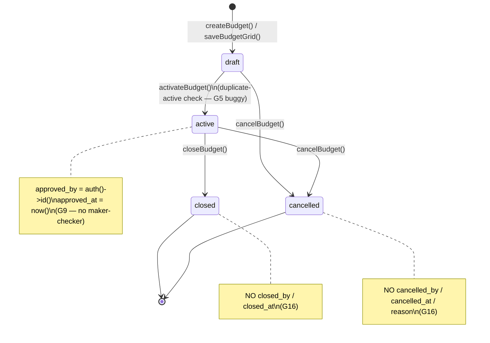
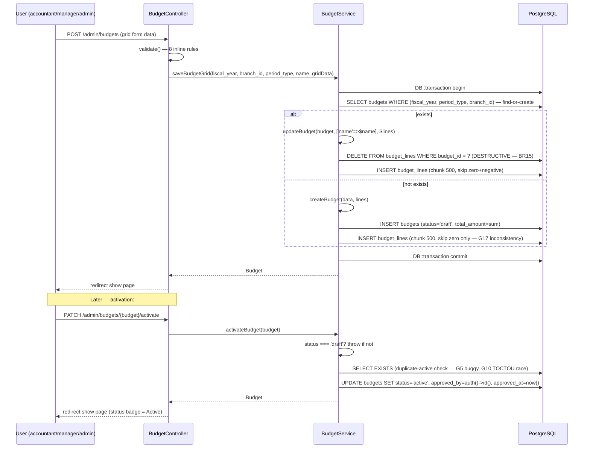

# Budgeting (Budgets, Lines, Variance) — Phase 6.5

> **Module:** Finance / Budgeting
> **Audience:** Engineers, AI assistants, accountants
> **Status:** Draft — pending accountant sign-off (analytical-only — no GL posting, NOT SAFETY-CRITICAL)
> **Last reviewed:** Phase 12 (initial creation)
> **Source of truth:** This file is the canonical reference for the budgeting subsystem. The
> implementation lives in `laravel/app/Models/{Budget,BudgetLine}.php`,
> `laravel/app/Services/Budgeting/BudgetService.php`,
> `laravel/app/Http/Controllers/Admin/BudgetController.php`, and the migration
> `laravel/database/migrations/2026_08_10_000002_create_budgeting_and_cost_centers.php`.

---

## 1. What is it?

The **Budgeting subsystem** (internally tagged *Phase 6.5* in the route file, sharing a migration
with the dimensions subsystem) is the ERP's planning-and-variance module for Income and Expense
accounts. It provides a spreadsheet-like grid entry form (ledgers × periods), a 4-state
lifecycle (draft → active → closed/cancelled), and a `budget_vs_actual` SQL VIEW that joins
`budget_lines` to posted `journal_lines` to compute variance per ledger × period.

The subsystem spans **two tables** (`budgets`, `budget_lines`) + one SQL VIEW
(`budget_vs_actual`), **two Eloquent models**, **one service** (`BudgetService` — 436 LOC),
**one controller** (`BudgetController` — 324 LOC, 9 actions), and **five Blade views**
(index, create, edit, show, variance). It is **web-only** — there is no REST API. Budgets are
**analytical-only**: they do NOT post to the GL, do NOT appear on the trial balance, and do NOT
call `JournalPostingService`. The only GL touch-point is the read-side variance computation,
which sources actuals from `journal_lines`.

> **CRITICAL — G20:** The `checkBudgetControl()` method exists in `BudgetService` (L243-300)
> and the Activate button's confirm dialog advertises "budget control checks" — but NO
> business module calls it. The feature is **DEAD CODE**. Postings that exceed budget silently
> succeed.

---

## 2. Why does it exist?

Three management-accounting drivers:

1. **Planning.** Set expense and income targets per fiscal year, per branch (or company-wide),
   per period (monthly / quarterly / yearly). The spreadsheet grid UI mirrors how accountants
   actually build budgets in Excel.
2. **Variance analysis.** Compare plan vs. actuals for management reporting. The `budget_vs_actual`
   VIEW computes `variance_amount = budget_amount - actual_amount` and `variance_percent` per
   budget line, sliced by ledger and period.
3. **Budget control (aspirational).** Warn or block when a posting would exceed the budget.
   `checkBudgetControl()` implements the 80%/100% warning/error thresholds — but it is **DEAD
   CODE** (G20). No posting flow consults it.

---

## 3. When is it used?

| Event | Trigger | Frequency | Lifecycle stage |
|---|---|---|---|
| Budget creation | Annual planning cycle | Yearly | Pre-fiscal-year |
| Budget activation | Start of fiscal year (after approval) | Yearly | Fiscal-year start |
| Budget edit | Draft revision before activation | As needed | Draft only |
| Variance review | Month-end / quarter-end close | Monthly/Quarterly | In-flight |
| Budget closure | Year-end (after actuals finalised) | Yearly | End-of-fiscal-year |
| Budget cancellation | Abandoned plan / error correction | Rare | Any (draft or active) |
| CSV export | Board / management reporting | Monthly/Quarterly | Any |

> **G8:** There is no artisan command and no scheduled job for variance reporting. The
> accountant must manually click *Variance* in the UI.

---

## 4. Who uses it?

| Role | What they do | Effective access today |
|---|---|---|
| **Superadmin** | Full access (bypasses `role` middleware via `EnsureRole` L37) | ✅ Works |
| **Admin** | Full access (RLS `is_admin=true` bypass) | ✅ Works |
| **Manager** | Intended: approves budgets, reviews variance | ✅ Reads work; ⚠️ **G27 — can also create/activate/cancel (no per-action role differentiation)** |
| **Accountant** | Intended primary user: creates budgets, runs variance | ✅ Reads work (RLS allows `branch_id IS NULL OR branch_id = session`); ⚠️ **G27 — can activate/cancel (should arguably be manager+)** |
| **API consumer** | — | ❌ No REST API exists |

> ✅ RESOLVED in commit d617c14 (G-353) — Added `->middleware('role:manager,admin')` overlay to the 3 status-changing routes in the `admin/budgets` route group (`routes/web.php:1706-1711`): `activate`, `close`, `cancel`. The group middleware stays `role:accountant,manager,admin` (BR27 basic requirement — the budgeting subsystem is accessible to accountant, manager, admin). Activation/closure/cancellation are management approval actions (they move a budget between lifecycle states that lock/unlock posting), not data entry. Accountants retain create/store/show/edit/update access for budget drafting + revision. Laravel merges middleware — the prefix `role:accountant,manager,admin` runs first, then the route-level `role:manager,admin` runs: an accountant passes the first but fails the second (403); a manager/admin passes both (allowed). Same defense-in-depth pattern as G-114 fixed-assets disposal + depreciation routes (Session 6, commit ece0a1a). Sub-problem E (Session 7, Security/RLS cluster — FINAL session).

> **G29:** `EnforceBranchIsolation::inferTableFromUri` does NOT include `budgets`. Cross-branch
> URL access (e.g. `/admin/budgets/{id}/edit` for another branch's budget) is NOT request-level
> guarded. RLS is the only backstop (and it has no `WITH CHECK` — G8).

> ✅ RESOLVED in commit c4acdb0 (G-356) — Extended `EnforceBranchIsolation::inferTableFromUri()` with a `budgets` pattern that resolves to `budgets` (the table has `branch_id`, nullable — null = all branches, per migration `2026_08_10_000002_create_budgeting_and_cost_centers`). Resolves `{id}` from `admin/budgets/{id}/edit`, `admin/budgets/{id}/activate`, and `admin/budgets/{id}/cancel` to `budgets.branch_id`. The middleware now blocks a non-admin accountant in Branch A from URL-guessing another branch's budget id. RLS (per-verb `rls_budgets_*` policies from G-095's migration) remains the DB-level backstop. See `app/Http/Middleware/EnforceBranchIsolation.php:328-335`. Sub-problem D (Session 6, Security/RLS cluster).

---

## 5. Related modules

| Direction | Target | Why |
|---|---|---|
| Outbound | [`../accounting/journal-posting-rules.md`](../accounting/journal-posting-rules.md) | `createJournalEntry` `$entry`/`$lines` array shape; `dimension_value_id` key (L133); confirmation that budgets do NOT call this service. |
| Outbound | [`../accounting/fiscal-year-period-close.md`](../accounting/fiscal-year-period-close.md) | `FiscalYearService::closePeriod` / `closeFiscalYear` — gap: budgets do NOT consult these (G2). `budgets.fiscal_year` is free-text, not a FK. |
| Outbound | [`../accounting/chart-of-accounts.md`](../accounting/chart-of-accounts.md) | `Ledger` model — `account_type` (Expense/Income filter for budgetable ledgers), `ledger_nature` (posting-level only), `normal_balance` (drives the variance formula's sign in `budget_vs_actual`). |
| Outbound | [`../accounting/financial-audit-log.md`](../accounting/financial-audit-log.md) | `fn_financial_audit_trigger` — gap: NOT attached to budgets/budget_lines (G3); hash-chain audit trail not extended to budget subsystem. |
| Outbound | [`../accounting/reversal-vs-cancellation.md`](../accounting/reversal-vs-cancellation.md) | Cancellation vs. reversal semantics — gap: budgets have NO reversal path for activation (G9); `cancelled` is terminal with no audit columns (G16). |
| Outbound | [`../architecture/branch-isolation-rls.md`](../architecture/branch-isolation-rls.md) | `BranchScope` global scope (read filtering); RLS `USING` vs `WITH CHECK` (gap: budgets has USING only — G8); `EnforceBranchIsolation::inferTableFromUri` (gap: budgets not in list — G29). |
| Sibling | [`./dimensions-cost-centers.md`](./dimensions-cost-centers.md) | The `dimensions` + `dimension_values` tables created by the SAME migration `2026_08_10_000002`; the `journal_lines.dimension_value_id` column added by that migration; gap: `budget_lines` has NO `dimension_value_id` (G6) — budgets are per-ledger × per-period only, not per-dimension. |
| Inbound (future) | `../workflows/approval-workflow.md` (Phase 14) | No maker-checker exists today (G9 — `approved_by = auth()->id()` same user who clicks Activate). |
| Inbound (future) | `../reports/reports-catalog.md` (Phase 16) | Budget vs Actual report + CSV export should be catalogued. |
| Inbound (future) | `../reports/materialized-views.md` (Phase 16) | `budget_vs_actual` is a regular VIEW (not MV), performance risk (G12); future MV proposal. |

---

## 6. Business rules

> Voice: **MUST** / **MUST NOT**. Every rule cites the code that enforces it.

### 6.1 Lifecycle

| # | Rule | Evidence |
|---|---|---|
| BR1 | A budget MUST be created with `status = 'draft'`. There is NO direct path to `active` on creation. | `BudgetService.php:35` (`$data['status'] = 'draft';`) |
| BR2 | A budget MUST NOT be edited after activation. The `isEditable()` helper returns `status === 'draft'` only. | `Budget.php:88-91`; `BudgetService.php:54-56` (throws `RuntimeException`) |
| BR3 | A budget MUST NOT be activated if another active budget exists for the same `(fiscal_year, branch_id)`. ⚠️ **G5 — check is buggy; allows company-wide + branch-specific to coexist.** | `BudgetService.php:83-91` |
| BR4 | A `cancelled` budget MUST NOT be reactivated or edited (no exit transition from `cancelled`). | `BudgetService.php` (no method exposes cancelled→active) |
| BR5 | A `closed` budget MUST NOT be reactivated (no exit transition from `closed`). | `BudgetService.php` (no method exposes closed→active) |
| BR6 | Budget activation MUST set `approved_at = now()` and `approved_by = auth()->id()`. ⚠️ **G9 — no maker-checker separation.** | `BudgetService.php:95-96` |
| BR7 | Budget closure MUST NOT set `closed_by` or `closed_at` (no such columns exist). ⚠️ **G16.** | migration L28-46 (no columns); `BudgetService.php:111` |
| BR8 | Budget cancellation MUST NOT set `cancelled_by` / `cancelled_at` / `cancel_reason` (no such columns). ⚠️ **G16.** | migration L28-46; `BudgetService.php:124` |
| BR9 | Budgets MUST NOT be hard-deleted via the UI (no `destroy` route exists). Soft-deletes are applied via the model, but no UI surface triggers them. | `routes/web.php:1647-1662` (no `Route::delete`) |

### 6.2 Budget lines

| # | Rule | Evidence |
|---|---|---|
| BR10 | A `budget_line` MUST be unique per `(budget_id, ledger_id, period)`. DB-level UNIQUE constraint enforces this. | migration L58 (`uq_bl_budget_ledger_period`) |
| BR11 | A `budget_line` MUST have a non-zero `amount` (zero-amount lines are silently skipped in `syncBudgetLines`). | `BudgetService.php:145-147` |
| BR12 | A budget's `total_amount` MUST equal the sum of its `budget_lines.amount`. Recalculated in `updateBudget()` (L66) but NOT in `createBudget()` if `lines` is empty. | `BudgetService.php:34, 66` |
| BR13 | A `budget_line` MUST reference an active Expense or Income ledger (parent/control ledgers and Asset/Liability/Equity ledgers are excluded from the grid). | `BudgetService.php:317-323` (`whereIn('account_type', ['Expense','Income'])->whereNotNull('ledger_nature')`) |
| BR14 | A budget's `period` MUST be in range `1..maxPeriod` (12 monthly / 4 quarterly / 1 yearly). Application-enforced via `Budget::maxPeriod()`; NOT DB-enforced. ⚠️ **G18 — no server-side validation.** | `Budget.php:98-105` |
| BR15 | Budget lines MUST be hard-deleted on sync (no soft-delete, no append-only audit trail). | `BudgetService.php:139` (`$budget->lines()->delete();`) |

### 6.3 Variance computation

| # | Rule | Evidence |
|---|---|---|
| BR16 | A budget's variance MUST be computed from posted (non-reversed) journal lines only. | `budget_vs_actual` VIEW L154 (`AND je2.is_reversed = false`) |
| BR17 | A budget's actuals MUST be sourced via the `budget_vs_actual` SQL VIEW (no service-layer aggregation). | `BudgetService.php:177` (`DB::table('budget_vs_actual')`) |
| BR18 | Variance formula: `variance_amount = budget_amount - actual_amount`. Positive = under-budget; negative = over-budget. | `budget_vs_actual` VIEW L151 |
| BR19 | A budget's `fiscal_year` MUST be a 4-digit year string for variance to compute correctly. The view joins on `EXTRACT(YEAR FROM entry_date)::text = b.fiscal_year` — multi-format strings like "2026-27" will NEVER match. ⚠️ **G1 CRITICAL.** | `budget_vs_actual` VIEW L156; migration L31 comment |
| BR20 | Variance computation MUST use `EXTRACT(MONTH FROM entry_date)` for period matching — this assumes a Jan-Dec calendar fiscal year and breaks for any other fiscal-year variant. ⚠️ **G2.** | `budget_vs_actual` VIEW L157 |
| BR21 | A budget's branch scope MUST be `NULL` (company-wide) OR a specific branch. NULL-branch budgets aggregate actuals across ALL branches. | `budget_vs_actual` VIEW L158 (`b.branch_id IS NULL OR je2.branch_id = b.branch_id`) |

### 6.4 GL isolation

| # | Rule | Evidence |
|---|---|---|
| BR22 | Budgets MUST NOT post any GL entries — budgets are analytical-only, do not appear on the trial balance, do not affect Dr/Cr. | `BudgetService.php` (no `JournalPostingService` call anywhere) |
| BR23 | Budgets MUST NOT be created via REST API (no api.php routes exist for budgets). | `routes/api.php` (no `budget` matches) |

### 6.5 Security & isolation

| # | Rule | Evidence |
|---|---|---|
| BR24 | Budgets MUST be filtered by branch for non-admin users (BranchScope global scope + RLS `USING` policy). | `Budget.php:42-45`; migration L165-176 |
| BR25 | Budget writes MUST NOT be RLS-restricted (no `WITH CHECK` clause) — branch isolation on writes is the application's responsibility (which it does not enforce). ⚠️ **G8.** | migration L168-175 (USING only) |
| BR26 | Budgets MUST NOT be audit-logged by `fn_financial_audit_trigger` (trigger is NOT attached to either budget table). ⚠️ **G3.** | `database/sql/02_accounting.sql:446-455` (budgets/budget_lines absent) |
| BR27 | The `role:accountant,manager,admin` middleware MUST be applied to every budget route. ⚠️ **G27 — no per-action differentiation.** | `web.php:1648, 1662` |

### 6.6 Budget control (DEAD CODE)

| # | Rule | Evidence |
|---|---|---|
| BR28 | Budget control checks (warning/error thresholds) MUST NOT block a posting — they are advisory only (and currently DEAD CODE). ⚠️ **G20 CRITICAL.** | `BudgetService.php:243-300` (returns `level` string, no exception thrown; no caller) |
| BR29 | Budget control MUST only check Expense and Income ledgers. | `BudgetService.php:253` (`if (!in_array($ledger->account_type, ['Expense','Income']))`) |
| BR30 | Budget control warning threshold MUST be 80% usage; error threshold MUST be >100% usage. | `BudgetService.php:279, 286` |

---

## 7. Technical implementation

### 7.1 Models

#### `Budget` (`app/Models/Budget.php` — 106 LOC)

- `$table = 'budgets'`, `use SoftDeletes;`, `BranchScope` global scope applied via `booted()` (non-admin queries auto-filtered by `session('branch_id')`).
- `$fillable` (10 columns): `name, fiscal_year, branch_id, period_type, status, description, total_amount, created_by, approved_by, approved_at`.
- `$casts`: `total_amount → decimal:2`, `approved_at → datetime`.
- **Statuses** (bare strings — no `STATUS_*` constants, G13): `draft` (default), `active`, `closed`, `cancelled`.
- **Period types** (bare strings): `monthly` (default), `quarterly`, `yearly`.
- **Relationships**: `branch()`, `lines()` (hasMany BudgetLine), `creator()`, `approver()`.
- **Scopes**: `scopeActive`, `scopeDraft`, `scopeForYear($year)`.
- **Helpers**: `isEditable()` (status==='draft'), `isActive()`, `maxPeriod()` (12/4/1 by period_type).

#### `BudgetLine` (`app/Models/BudgetLine.php` — 43 LOC)

- `$table = 'budget_lines'`. **No SoftDeletes. No BranchScope** (branch filtering inherited via parent `Budget`).
- `$fillable` (5 columns): `budget_id, ledger_id, period, amount, notes`.
- `$casts`: `amount → decimal:2`, `period → integer`.
- **Relationships**: `budget()`, `ledger()`.
- **No scopes, no helpers, no constants.**

### 7.2 Service — `BudgetService` (`app/Services/Budgeting/BudgetService.php` — 436 LOC)

**Constructor:** none (no DI). The class is `new`-ed by Laravel's container with no dependencies.

**Public methods (crown jewels):**

1. `createBudget(array $data, array $lines = []): Budget` (L31-46) — wrapped in `DB::transaction`. Always creates with `status='draft'`. `total_amount` = sum of line amounts. Calls `syncBudgetLines`.

```php
public function createBudget(array $data, array $lines = []): Budget
{
    return DB::transaction(function () use ($data, $lines) {
        $data['total_amount'] = collect($lines)->sum('amount');
        $data['status'] = 'draft';
        $data['created_by'] = $data['created_by'] ?? auth()->id();

        $budget = Budget::create($data);

        if (!empty($lines)) {
            $this->syncBudgetLines($budget, $lines);
        }

        return $budget->fresh('lines.ledger');
    });
}
```

2. `updateBudget(Budget $budget, array $data, array $lines = []): Budget` (L52-71) — wrapped in `DB::transaction`. Hard guard: only `draft` budgets editable. `syncBudgetLines` is DESTRUCTIVE (delete-then-reinsert).

3. `activateBudget(Budget $budget): Budget` (L76-100) — **THE CROWN JEWEL.** Sets `status='active'`, `approved_by=auth()->id()`, `approved_at=now()`. Duplicate-active check is BUGGY (G5). NOT wrapped in `DB::transaction` (TOCTOU race — G10).

```php
public function activateBudget(Budget $budget): Budget
{
    if ($budget->status !== 'draft') {
        throw new \RuntimeException("Only draft budgets can be activated. Current status: {$budget->status}");
    }

    // Check for duplicate active budget for same year/branch
    $exists = Budget::where('fiscal_year', $budget->fiscal_year)
        ->where('branch_id', $budget->branch_id)
        ->where('status', 'active')
        ->when($budget->branch_id, fn($q) => $q->where('branch_id', $budget->branch_id))
        ->exists();

    if ($exists) {
        throw new \RuntimeException("An active budget already exists for fiscal year {$budget->fiscal_year} and this branch. Close it first.");
    }

    $budget->update([
        'status'      => 'active',
        'approved_by' => auth()->id(),
        'approved_at' => now(),
    ]);

    return $budget;
}
```

4. `closeBudget(Budget $budget): Budget` (L105-113) — `active → closed`. No audit columns (G16).
5. `cancelBudget(Budget $budget): Budget` (L118-126) — `draft|active → cancelled`. No audit columns (G16).
6. `syncBudgetLines(Budget $budget, array $lines): void` (L136-164) — **PRIVATE, DESTRUCTIVE.** Deletes ALL existing lines, then re-inserts. Skips zero-amount lines (L145-147). Uses raw `DB::table('budget_lines')->insert()` (bypasses Eloquent events).

7. `getBudgetVsActual(Budget $budget, ?int $period = null): array` (L175-212) — reads from `budget_vs_actual` VIEW. Groups by `account_type`. Returns `['budget', 'lines' (grouped), 'totals', 'period']`.

8. `getLedgerBudgetVsActual(int $ledgerId, int $period, string $fiscalYear, ?int $branchId = null): ?object` (L218-233) — used by `checkBudgetControl` (dead code).

9. `checkBudgetControl(int $ledgerId, float $proposedAmount, string $fiscalYear, int $period, ?int $branchId = null): object` (L243-300) — **DEAD CODE (G20 CRITICAL).** Returns `(object)['level'=>'ok|warning|error', 'message'=>..., ...]`. Warning at ≥80%, error at >100%. No caller anywhere in `app/`.

10. `getBudgetGridData(string $fiscalYear, ?int $branchId, string $periodType): array` (L308-374) — builds the spreadsheet grid (active Expense/Income ledgers with `ledger_nature IS NOT NULL` × periods). Returns the FIRST matching budget only (G21).

11. `saveBudgetGrid(string $fiscalYear, ?int $branchId, string $periodType, string $name, array $gridData): Budget` (L379-415) — find-or-create semantics. Skips zero AND negative amounts (L393 — inconsistent with `syncBudgetLines` which only skips zero, G17).

12. `getPeriodLabels(string $periodType): array` (L419-435) — PRIVATE. Returns `[1=>'Jan',...12=>'Dec']` / `[1=>'Q1',...]` / `[1=>'Annual']`. Calendar-month labels (consistent with the variance view's `EXTRACT(MONTH)` — both assume Jan-Dec).

### 7.3 Controller — `BudgetController` (`app/Http/Controllers/Admin/BudgetController.php` — 324 LOC)

**Constructor DI:** `BudgetService $budgetService` + `DimensionReportingService $reportingService` (the latter is DEAD INJECTION — G23 — never called).

| # | Route | Method | Service call | Validation | DB::transaction | Audit |
|---|---|---|---|---|---|---|
| 1 | GET `admin/budgets` | `index` (L30-58) | none | inline `filled()` | No | No |
| 2 | GET `admin/budgets/create` | `create` (L63-80) | `getBudgetGridData()` | none | No | No |
| 3 | POST `admin/budgets` | `store` (L85-111) | `saveBudgetGrid()` | inline `validate()` (8 rules) | No (service wraps) | No |
| 4 | GET `admin/budgets/{budget}` | `show` (L116-132) | `getBudgetVsActual()` (if active/closed) | none | No | No |
| 5 | GET `admin/budgets/{budget}/edit` | `edit` (L137-161) | `getBudgetGridData()` | none | No | No |
| 6 | PUT `admin/budgets/{budget}` | `update` (L166-187) | `updateBudget()` | inline `validate()` (6 rules) | No (service wraps) | No |
| 7 | PATCH `admin/budgets/{budget}/activate` | `activate` (L192-201) | `activateBudget()` | none | No | No |
| 8 | PATCH `admin/budgets/{budget}/close` | `close` (L206-215) | `closeBudget()` | none | No | No |
| 9 | PATCH `admin/budgets/{budget}/cancel` | `cancel` (L220-229) | `cancelBudget()` | none | No | No |
| 10 | GET `admin/budgets/variance` | `varianceReport` (L234-261) | `getBudgetVsActual()` | none | No | No |
| 11 | GET `admin/budgets/export-csv` | `exportCsv` (L266-311) | `getBudgetVsActual()` | none | No | No |

**Validation:** All inline `$request->validate()`. **No FormRequest classes** (G24). Rules duplicated between `store` and `update`. **No Policy** (G25). **No DB::transaction** in controller (relies on service-layer transactions). **No audit logging**. **`resolveListBranchId()`** (L316-323) is DEAD CODE (G26).

### 7.4 Migrations

#### `2026_08_10_000002_create_budgeting_and_cost_centers.php` (278 LOC)

Creates 4 tables (budgets, budget_lines, dimensions, dimension_values — the latter two are the sibling doc's domain), adds `journal_lines.dimension_value_id`, creates `budget_vs_actual` VIEW, enables RLS on `budgets` + `dimension_values`, seeds 3 dimensions + 5 department values.

**`budgets` RLS policy** (L165-176):
```sql
CREATE POLICY budgets_branch_policy ON budgets
USING (
    branch_id IS NULL
    OR branch_id = current_setting('app.branch_id', true)::int
    OR current_setting('app.is_admin', true) = 'true'
);
-- NO WITH CHECK clause → writes not RLS-restricted (G8)
```

**`budget_vs_actual` VIEW** (L118-162, recreated identically in `2026_08_22_000003` L866-911 after journal_lines partitioning):
```sql
CREATE OR REPLACE VIEW budget_vs_actual AS
SELECT
    bl.id AS budget_line_id, b.id AS budget_id, b.name AS budget_name,
    b.fiscal_year, b.branch_id AS budget_branch_id,
    bl.ledger_id, l.ledger_code, l.ledger_name, l.account_type, l.normal_balance,
    bl.period, bl.amount AS budget_amount,
    COALESCE(actual.actual_amount, 0) AS actual_amount,
    bl.amount - COALESCE(actual.actual_amount, 0) AS variance_amount,
    CASE WHEN bl.amount = 0 THEN NULL
         ELSE ROUND(((bl.amount - COALESCE(actual.actual_amount, 0)) / bl.amount) * 100, 2)
    END AS variance_percent
FROM budget_lines bl
JOIN budgets b ON b.id = bl.budget_id
JOIN ledgers l ON l.id = bl.ledger_id
LEFT JOIN LATERAL (
    SELECT SUM(
        CASE l.normal_balance
            WHEN 'debit'  THEN jl2.debit  - jl2.credit
            WHEN 'credit' THEN jl2.credit - jl2.debit
        END
    ) AS actual_amount
    FROM journal_lines jl2
    JOIN journal_entries je2 ON je2.id = jl2.journal_entry_id
    WHERE jl2.ledger_id = bl.ledger_id
      AND je2.is_reversed = false
      AND EXTRACT(YEAR FROM je2.entry_date)::text = b.fiscal_year
      AND EXTRACT(MONTH FROM je2.entry_date) = bl.period
      AND (b.branch_id IS NULL OR je2.branch_id = b.branch_id)
) actual ON true
WHERE b.deleted_at IS NULL AND l.deleted_at IS NULL;
```

> **CRITICAL — G1:** The join `EXTRACT(YEAR FROM je2.entry_date)::text = b.fiscal_year` only works when `fiscal_year` is a 4-digit year string. The migration comment says "e.g. '2026' or '2026-27'" — but "2026-27" will NEVER match → actuals always 0 → variance always equals budget → silent data-integrity bug.
>
> **MAJOR — G2 + G12:** `EXTRACT(MONTH FROM entry_date)` assumes a Jan-Dec calendar fiscal year and is NOT indexable (sequential scan within the partition).

#### `2026_08_10_000003_add_budget_and_dimension_menus.php` (242 LOC)

Seeds 2 parent + 6 child menus under `Administration`:
- **Budgets** (parent) → Budget List (`budget.index`), Budget vs Actual (`budget.variance`)
- **Cost Centers** (parent) → Dimensions (`dimension.index`), Segment P&L (`dimension.segment_pnl`), Segment BS (`dimension.segment_bs`)

Grants superadmin (`E0001`) `can_view=true, can_edit=true` on all 8 menus via `user_menu_permissions` upsert (idempotent `ON CONFLICT`).

### 7.5 Routes (`routes/web.php` L1647-1662)

```php
// ============================================================
// Phase 6: Budgeting & Cost Centers
// RBAC — accountant/manager/admin for budget management
// ============================================================

// Budgets
Route::prefix('admin/budgets')->name('admin.budgets.')->middleware('role:accountant,manager,admin')->group(function () {
    Route::get('variance', [BudgetController::class, 'varianceReport'])->name('variance');
    Route::get('export-csv', [BudgetController::class, 'exportCsv'])->name('export-csv');
    Route::get('create', [BudgetController::class, 'create'])->name('create');
    Route::post('/', [BudgetController::class, 'store'])->name('store');
    Route::get('{budget}', [BudgetController::class, 'show'])->name('show');
    Route::get('{budget}/edit', [BudgetController::class, 'edit'])->name('edit');
    Route::put('{budget}', [BudgetController::class, 'update'])->name('update');
    Route::patch('{budget}/activate', [BudgetController::class, 'activate'])->name('activate');
    Route::patch('{budget}/close', [BudgetController::class, 'close'])->name('close');
    Route::patch('{budget}/cancel', [BudgetController::class, 'cancel'])->name('cancel');
});
Route::get('admin/budgets', [BudgetController::class, 'index'])
    ->name('admin.budgets.index')
    ->middleware('role:accountant,manager,admin');
```

**Middleware:** `role:accountant,manager,admin` on every route. **No per-action differentiation** (G27). **No API routes** (web-only).

### 7.6 Config / Triggers / Artisan

- **Config:** None (G31 — no `config/budgeting.php`; thresholds 80%/100% hardcoded in `checkBudgetControl`).
- **Triggers:** None attached to budget tables (G3 — `fn_financial_audit_trigger` NOT attached).
- **Artisan:** None. No command for budget import/export/variance reporting. No scheduled job.
- **FormRequests:** None (G24).
- **Policy:** None (G25).
- **Tests:** None.

---

## 8. Important database tables

### 8.1 `budgets`

| Column | Type | Default | Notes |
|---|---|---|---|
| `id` | bigint PK | auto | |
| `name` | varchar(150) | — | Display name |
| `fiscal_year` | varchar(9) | — | **Free-text, NOT a FK** ⚠️ G1+G2 — must be 4-digit year for variance to work |
| `branch_id` | bigint FK→branches (RESTRICT) | NULL | NULL = company-wide |
| `period_type` | varchar(10) | `monthly` | monthly/quarterly/yearly (no DB CHECK) |
| `status` | varchar(20) | `draft` | DB CHECK: `draft`/`active`/`closed`/`cancelled` |
| `description` | text | NULL | |
| `total_amount` | decimal(15,2) | 0 | Denormalized sum of `budget_lines.amount` |
| `created_by` | bigint | — | NOT a FK (G7 — orphan risk) |
| `approved_by` | bigint | NULL | NOT a FK; set on activation |
| `approved_at` | timestamp | NULL | Set on activation |
| `timestamps`, `deleted_at` | timestamp | — | Soft deletes enabled |

**Indexes:** `idx_budgets_year_branch (fiscal_year, branch_id)`, `idx_budgets_status_year (status, fiscal_year)`.

**RLS:** Enabled + Forced. Policy `budgets_branch_policy` (USING only — G8 no WITH CHECK).

### 8.2 `budget_lines`

| Column | Type | Default | Notes |
|---|---|---|---|
| `id` | bigint PK | auto | |
| `budget_id` | bigint FK→budgets (CASCADE) | — | |
| `ledger_id` | bigint FK→ledgers (RESTRICT) | — | Must be active Expense/Income ledger |
| `period` | smallint | — | 1-12 (monthly), 1-4 (quarterly), 1 (yearly); no DB CHECK (G18) |
| `amount` | decimal(15,2) | 0 | Per-cell budgeted figure |
| `notes` | text | NULL | |
| `timestamps` | timestamp | — | |

**Indexes:** `uq_bl_budget_ledger_period` UNIQUE `(budget_id, ledger_id, period)`, `idx_bl_ledger_period (ledger_id, period)`.

**NO `branch_id` column** — branch scoping inherited from parent `budgets`. **NO `dimension_value_id` column** (G6 — cannot budget by dimension). **NO SoftDeletes** — hard-deleted on sync (BR15). **RLS NOT enabled** (G4 — direct SELECT bypasses branch filtering).

### 8.3 `budget_vs_actual` VIEW

See §7.4 for the verbatim SQL. Key columns returned: `budget_line_id, budget_id, budget_name, fiscal_year, budget_branch_id, ledger_id, ledger_code, ledger_name, account_type, normal_balance, period, budget_amount, actual_amount, variance_amount, variance_percent`.

---

## 9. Related services

| Service | File | Role |
|---|---|---|
| `BudgetService` | `app/Services/Budgeting/BudgetService.php` (436L) | Owns CRUD, lifecycle transitions, variance computation (via VIEW), budget-control check (DEAD CODE G20). |
| `JournalPostingService` | `app/Services/Accounting/JournalPostingService.php` (480L) | Cross-ref — **NOT called by BudgetService** (budgets are analytical-only). The variance VIEW reads `journal_lines` directly. |
| `FiscalYearService` | `app/Services/Accounting/FiscalYearService.php` | Cross-ref — **NOT called by BudgetService** (G2 — no period-close enforcement). |
| `DimensionReportingService` | `app/Services/Budgeting/DimensionReportingService.php` (261L) | Cross-ref — **dead-injected into BudgetController constructor** (G23 — never called). See sibling `dimensions-cost-centers.md`. |
| `BranchScope` | `app/Models/Scopes/BranchScope.php` (65L) | Applied to `Budget` (read filtering). NOT applied to `BudgetLine`. |

---

## 10. Related models

| Model | File | Notes |
|---|---|---|
| `Budget` | `app/Models/Budget.php` (106L) | See §7.1. |
| `BudgetLine` | `app/Models/BudgetLine.php` (43L) | See §7.1. |
| `Ledger` | `app/Models/Ledger.php` | `budget_lines.ledger_id` FK. Only Expense/Income ledgers with `ledger_nature IS NOT NULL` are budgetable. |
| `Branch` | `app/Models/Branch.php` | `budgets.branch_id` FK (nullable = company-wide). |
| `User` | `app/Models/User.php` | `created_by`, `approved_by` (not FK-constrained — G7). |

---

## 11. Important workflows

### 11.1 Budget lifecycle (state machine)



**Terminal states:** `closed`, `cancelled` (no exit transitions). **No `suspended`/`on_hold` state.** **No reopen path** (closed → active not exposed). **No deactivate path** (active → draft not exposed — must cancel and re-create).

### 11.2 Create + activate flow



### 11.3 Variance computation pipeline

```mermaid
flowchart TD
    A[budget_lines bl] --> V[budget_vs_actual VIEW]
    B[journal_entries je2<br/>FILTER is_reversed = false] --> V
    C[journal_lines jl2<br/>FILTER ledger_id = bl.ledger_id] --> V
    D[ledgers l<br/>JOIN for normal_balance] --> V
    V --> E{LATERAL join per bl row}
    E --> F[EXTRACT YEAR from je2.entry_date<br/>= b.fiscal_year text<br/>G1: breaks for '2026-27']
    E --> G[EXTRACT MONTH from je2.entry_date<br/>= bl.period<br/>G2: assumes Jan-Dec<br/>G12: NOT indexable]
    E --> H[branch filter:<br/>b.branch_id IS NULL<br/>OR je2.branch_id = b.branch_id]
    F --> I[actual_amount = SUM CASE normal_balance]
    G --> I
    H --> I
    A --> J[budget_amount = bl.amount]
    I --> K[variance_amount = budget_amount - actual_amount]
    J --> K
    K --> L[variance_percent = variance / budget * 100<br/>NULL if budget = 0]
    L --> M[BudgetService::getBudgetVsActual<br/>DB::table('budget_vs_actual')]
    M --> N[Group by account_type]
    N --> O[BudgetController::varianceReport<br/>OR exportCsv]
    O --> P[variance.blade.php<br/>G11: classifies ALL negative variance as 'Over Budget'<br/>WRONG for Income accounts]
```

### 11.4 Dr/Cr — N/A

Budgets are analytical-only (BR22). No Dr/Cr matrix applies. The variance computation's "actuals" side reads `journal_lines` (debit/credit) but does not post anything.

---

## 12. Known edge cases

| # | Edge case | Severity | Detail |
|---|---|---|---|
| EC1 | **`fiscal_year = "2026-27"` breaks variance** | CRITICAL (G1) | The view joins on `EXTRACT(YEAR FROM entry_date)::text = b.fiscal_year`. "2026-27" never equals "2026" → actuals always 0 → variance always equals budget → entire variance report silently wrong. The migration comment explicitly suggests "2026-27" is valid. |
| EC2 | **April-March fiscal year breaks period mapping** | CRITICAL (G2) | `EXTRACT(MONTH FROM entry_date) = bl.period` assumes Jan-Dec. If the company's fiscal year is April-March, period 1 (labelled "Jan") is matched against January actuals — semantically wrong. The `fiscal_years` table is not consulted. |
| EC3 | **Concurrent activation race** | MAJOR (G10) | `activateBudget` duplicate-active check (L83-87) and update (L93-97) are NOT in a transaction, NOT locked. Two concurrent activations could both pass → two active budgets for same (fiscal_year, branch_id) → variance double-counts. No DB-level partial UNIQUE index. |
| EC4 | **Company-wide + branch-specific budget both active** | MAJOR (G5) | The duplicate-active check does NOT prevent a company-wide (`branch_id IS NULL`) and a branch-specific budget from both being active for the same fiscal year. The variance view then returns rows for both → double-counted totals. |
| EC5 | **Income account variance displayed as "Over Budget"** | MAJOR (G11) | The Blade treats ALL negative variance as "Over Budget" (red). For Income accounts, negative variance = actuals exceeded budget = FAVORABLE but is shown as red. Misleading for management reporting. |
| EC6 | **`budget_line` with negative amount** | MINOR (G17) | `syncBudgetLines` only skips zero (L145); `saveBudgetGrid` skips zero AND negative (L393). Inconsistent. A direct `createBudget` call could insert negative amounts. |
| EC7 | **`budget_line` with `period=13` out of range** | MINOR (G18) | No server-side validation that `period` is within `1..maxPeriod`. The DB UNIQUE allows it; the variance view's `EXTRACT(MONTH) = 13` never matches → actuals always 0. |
| EC8 | **CLI/console budget creation — `auth()->id()` null** | MINOR (G15) | `createBudget` L36, `saveBudgetGrid` L411, `activateBudget` L95 all use `auth()->id()`. In CLI context this returns null → NOT NULL violation on `created_by`. |
| EC9 | **Cross-branch budget URL access** | MAJOR (G29) | `EnforceBranchIsolation::inferTableFromUri` does NOT include `budgets`. A non-admin user gets a 404 (RLS hides the row) instead of a clean 403 when accessing another branch's budget by ID. |
| EC10 | **Closing a budget leaves no audit trail** | MINOR (G16) | No `closed_by`/`closed_at`/`cancelled_by`/`cancelled_at`/`cancel_reason` columns. Cannot answer "who closed this budget and when?" |
| EC11 | **`checkBudgetControl` is DEAD CODE** | CRITICAL (G20) | The Activate button's confirm dialog says "It will be used for budget control checks" — but no posting flow calls `checkBudgetControl`. Over-budget postings silently succeed. |
| EC12 | **Variance VIEW performance** | MAJOR (G12) | `EXTRACT(YEAR/MONTH FROM entry_date)` is NOT indexable. For each budget_line, a sequential scan of the relevant `journal_lines` partition. 100 budget lines × 12 periods = 1200 LATERAL scans per report. |
| EC13 | **`budget_lines` RLS NOT enabled** | MAJOR (G4) | Direct SQL `SELECT * FROM budget_lines` bypasses branch filtering. A branch accountant with DB access could read another branch's budget line amounts. |
| EC14 | **`budgets` RLS has no `WITH CHECK`** | MAJOR (G8) | Writes are NOT RLS-restricted. A non-admin user with direct SQL access can INSERT/UPDATE a `budgets` row with any `branch_id`. |
| EC15 | **Company-wide budget cannot be edited by branch users via grid** | MINOR (G22) | `saveBudgetGrid` L383-386 `where('branch_id', $branchId)` (null → IS NULL). A branch user (session branch_id=5) editing a company-wide budget (branch_id IS NULL) silently creates a branch-specific clone instead of updating. |

---

## 13. Future improvements

> Ordered by severity. The 4 CRITICAL gaps should be remediated before relying on variance reports.

### 13.1 CRITICAL remediations

1. **G1 — Fix `fiscal_year` format.** Either (a) constrain `fiscal_year` to a 4-digit year via CHECK + form validation, OR (b) change the view's join to use a range predicate based on `fiscal_years.start_date`/`end_date`. Recommend (b) for proper fiscal-year support.
2. **G2 — Add fiscal-period integration.** Add FK `budgets.fiscal_year_id → fiscal_years(id)` (replacing the free-text column). Use `fiscal_periods.start_date`/`end_date` to filter actuals in the variance view. Block activation if `fiscal_years.status = 'closed'`.
3. **G3 — Attach `fn_financial_audit_trigger` to `budgets` + `budget_lines`.** Add a migration: `CREATE TRIGGER trg_audit_budgets AFTER INSERT OR UPDATE OR DELETE ON budgets FOR EACH ROW EXECUTE FUNCTION fn_financial_audit_trigger();` and same for `budget_lines`.
4. **G20 — Wire `checkBudgetControl` into posting flows.** Decide whether `level = 'error'` should BLOCK (throw) or LOG. Add the call to `JournalPostingService::createJournalEntry` for Expense/Income ledgers. Document the chosen semantics in `accounting/journal-posting-rules.md`.

### 13.2 MAJOR remediations

5. **G4 — Enable RLS on `budget_lines`.** Policy: `USING (EXISTS (SELECT 1 FROM budgets b WHERE b.id = budget_lines.budget_id AND (b.branch_id IS NULL OR b.branch_id = current_setting('app.branch_id', true)::int OR current_setting('app.is_admin', true) = 'true')))` or denormalize `branch_id`.
6. **G5 — Fix duplicate-active-budget check.** Decide the semantic (company-wide is default; branch-specific overrides or supplements). Add a partial UNIQUE index: `CREATE UNIQUE INDEX uq_budgets_active_per_year_branch ON budgets (fiscal_year, COALESCE(branch_id, 0)) WHERE status = 'active' AND deleted_at IS NULL;`.
7. **G6 — Add dimension tagging to budget lines.** Add `dimension_value_id` nullable FK to `budget_lines`. Extend the grid UI. Extend the variance view to filter actuals by `dimension_value_id`.
8. **G8 — Add `WITH CHECK` to budgets RLS policy.** `WITH CHECK (branch_id IS NULL OR branch_id = current_setting('app.branch_id', true)::int OR current_setting('app.is_admin', true) = 'true')`.
9. **G9 — Add approval workflow (Phase 14).** Wire `activateBudget` to require an approval step (`BudgetApproval` model with `requested_by`/`approved_by`/`status`).
10. **G10 — Wrap `activateBudget` in `DB::transaction` + `lockForUpdate`.** Or add the partial UNIQUE index from G5 (DB-level guarantee).
11. **G11 — Fix variance favorable/unfavorable classification.** In the Blade, compute `isOver` based on account type: Expense → over when actual > budget; Income → over when actual < budget. Or compute a `favorable` boolean in the view/service.
12. **G12 — Fix variance VIEW performance.** (a) Add expression indexes on `journal_entries (EXTRACT(YEAR FROM entry_date), EXTRACT(MONTH FROM entry_date)) WHERE is_reversed = false`. (b) Convert `budget_vs_actual` to a materialized view refreshed nightly + on-demand. (c) Denormalize `entry_year`/`entry_month` integer columns.
13. **G24 — Create FormRequest classes.** `StoreBudgetRequest`, `UpdateBudgetRequest`.
14. **G25 — Create `BudgetPolicy`.** Per-action authorization; restrict `activate`/`close`/`cancel` to `manager`+`admin`.
15. **G27 — Split route middleware by action.** Read → `role:accountant,manager,admin`; write → `role:accountant,manager,admin`; activate/close/cancel → `role:manager,admin`.
16. **G28 — Update stale DDL.** Add `budgets`, `budget_lines` table DDL + `budget_vs_actual` view DDL + `dimension_value_id` column to `journal_lines` in `02_accounting.sql` (or a new `08_budgeting.sql`).
17. **G29 — Add `budgets` to `EnforceBranchIsolation::inferTableFromUri`.**

### 13.3 MINOR remediations

18. **G13** — Add `STATUS_*` constants to `Budget` model.
19. **G14** — Calculate `total_amount` AFTER `syncBudgetLines` from inserted rows.
20. **G15** — Use `auth()->id() ?? 1` (system user) in CLI contexts.
21. **G16** — Add `closed_by`/`closed_at`/`cancelled_by`/`cancelled_at`/`cancel_reason` columns.
22. **G17** — Pick one rule for negative amounts (recommend: reject with validation error); apply consistently.
23. **G18** — Add `lines.*.periods.*' => 'required|integer|min:1|max:12'` validation.
24. **G19** — Add `?period_to=N` YTD aggregation query param.
25. **G21** — Prevent duplicate budgets (G5/G10 fix) or change `first()` to `latest()->first()` with a warning.
26. **G22** — Make the grid's `branch_id` field read-only based on user role, OR pass the original budget's `branch_id` through the form.
27. **G23** — Remove the dead `DimensionReportingService` injection from `BudgetController`.
28. **G26** — Remove the dead `resolveListBranchId()` method.
29. **G30** — Add Excel/PDF export (Phase 16).
30. **G31** — Create `config/budgeting.php` (`warning_threshold`, `error_threshold`, `enable_budget_control`).

### 13.4 Documentation follow-ups

- Update `../database/triggers-views-constraints.md` to document the `budget_vs_actual` view (currently only in migration — G28).
- Update `../accounting/financial-audit-log.md` §7.3 to note the trigger is NOT attached to budget tables (will be re-noted when G3 is fixed).
- Update `../architecture/branch-isolation-rls.md` to document the budgets RLS policy (USING only, no WITH CHECK — G8).

---

## Accountant review checklist

> Before this doc is promoted from **Draft** to **Canonical**, the accountant MUST review and
> sign off on the following.

- [ ] **`fiscal_year` format.** Confirm whether budgets use a 4-digit year ("2026") or a hyphenated format ("2026-27"). Current code only works with 4-digit (G1).
- [ ] **Fiscal year variant.** Confirm whether the company uses a Jan-Dec calendar year or an April-March (or other) fiscal year. Current variance computation assumes Jan-Dec (G2).
- [ ] **Variance sign convention.** Confirm `variance_amount = budget_amount - actual_amount` is the desired convention. Positive = under-budget; negative = over-budget.
- [ ] **Favorable/unfavorable classification.** Confirm how to classify variance for Income accounts (G11 — current Blade shows "Over Budget" in red when revenue exceeds plan, which is favorable).
- [ ] **Budget control semantics.** If `checkBudgetControl` is wired in (G20), should `level = 'error'` BLOCK the posting (throw) or just LOG? Confirm the 80%/100% thresholds.
- [ ] **Approval workflow.** Confirm whether budget activation requires maker-checker (G9 — currently `approved_by = auth()->id()`, same user who clicks Activate).
- [ ] **Dimension-tagged budgets.** Confirm whether per-dimension budgets are needed (G6 — currently budgets are per-ledger × per-period only).
- [ ] **Company-wide vs branch-specific.** Confirm whether a company-wide budget AND a branch-specific budget can both be active for the same fiscal year (G5 — currently allowed; variance double-counts).
- [ ] **Closure/cancellation audit.** Confirm whether `closed_by`/`closed_at`/`cancelled_by`/`cancelled_at`/`cancel_reason` columns are required (G16).
- [ ] **4 CRITICAL gaps.** Review G1 (fiscal_year format), G2 (fiscal-period integration), G3 (audit trigger not attached), G20 (checkBudgetControl DEAD CODE) and prioritise remediation.

---

*This file is the single source of truth for the budgeting subsystem. When code changes,
update this file in the same PR and prepend an entry to `changelog/CHANGELOG.md`. See
`IMPLEMENTATION_PLAN.md` §7 (AI Instructions) for the rules governing AI assistants working
on this ERP.*
