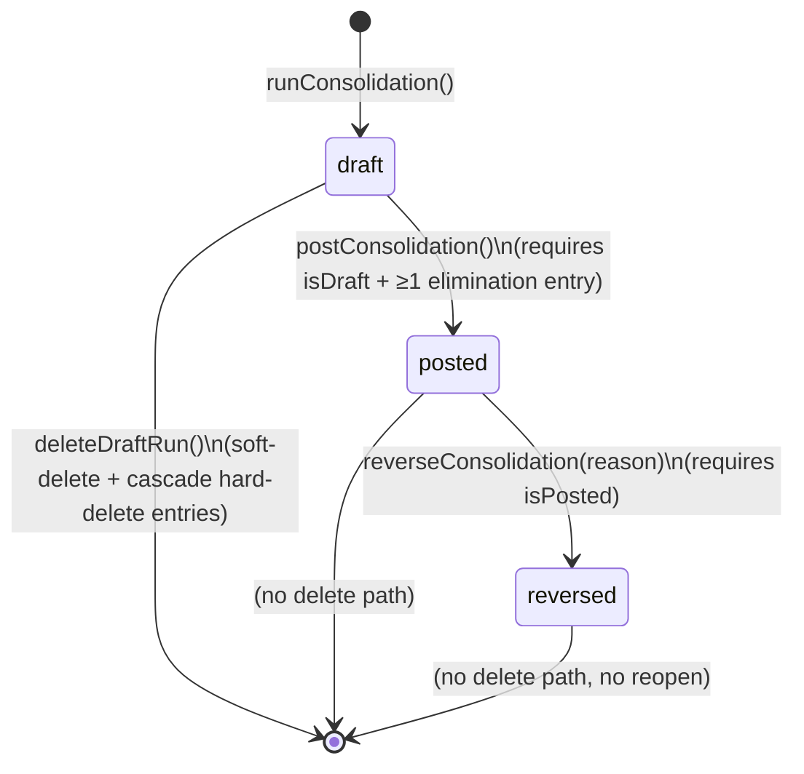
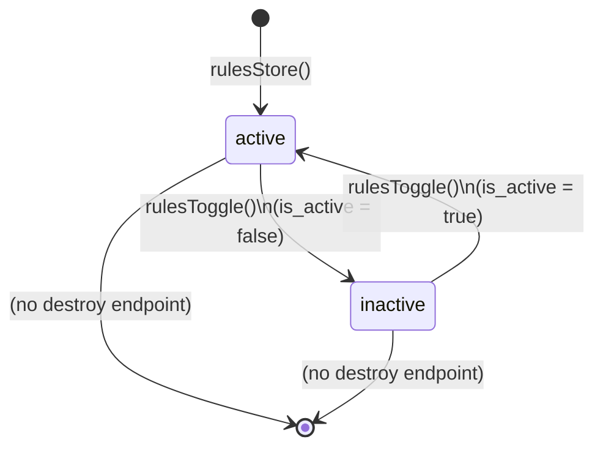
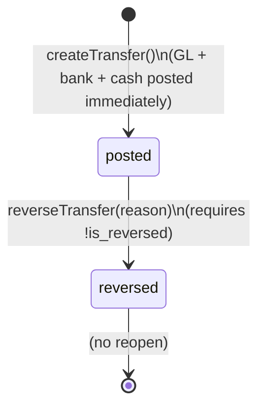
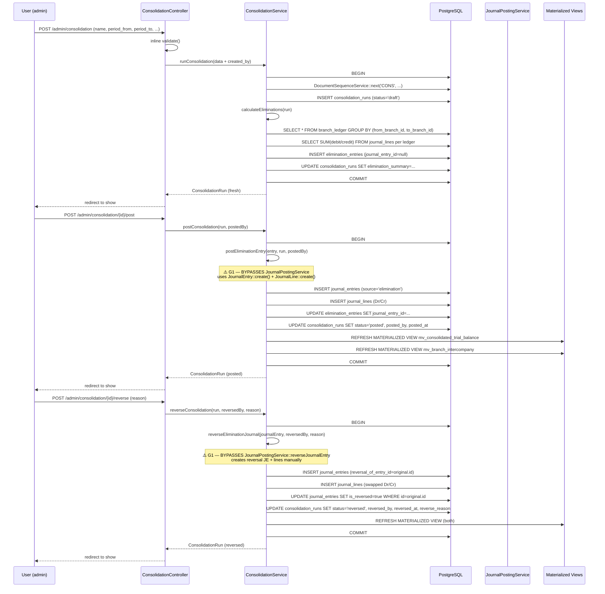
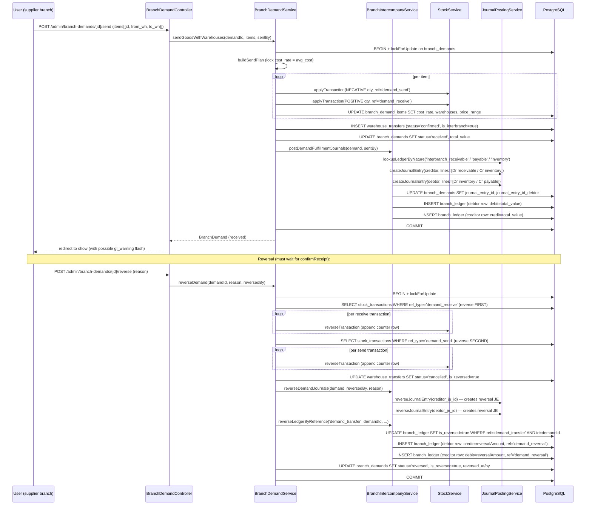
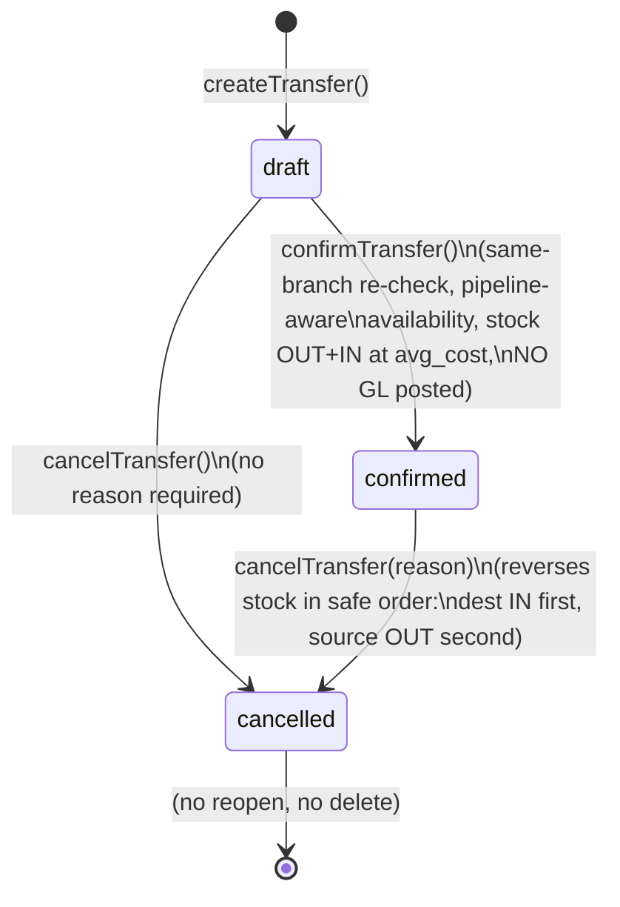

# Consolidation, Intercompany & Elimination — Phase 13

> **Module:** Finance / Consolidation & Intercompany
> **Audience:** Engineers, AI assistants, accountants
> **Status:** Draft — pending accountant sign-off (**SAFETY-CRITICAL** — elimination JEs post to the
> GL; intercompany posting pairs affect branch-level trial balance + `branch_ledger` running
> balance. All 5 CRITICAL + 11 MAJOR gaps resolved (FINANCE-1/2/3). The subsystem is
> production-safe pending accountant sign-off.)
> **Last reviewed:** 2026-09-04 (post-FINANCE-2: G-096/G-097/G-099/G-102/G-104/G-108/G-110/G-111 resolved)
> **Source of truth:** This file is the canonical reference for the consolidation + intercompany
> subsystem. The implementation lives in
> `laravel/app/Services/Consolidation/ConsolidationService.php`,
> `laravel/app/Services/BranchDemand/BranchIntercompanyService.php` (intercompany posting-pairs
> half only — the demand-requisition half is documented in `./branch-demand.md`),
> `laravel/app/Services/Accounting/MoneyTransferService.php` (cross-branch intercompany
> settlement half),
> `laravel/app/Services/Stock/WarehouseTransferService.php` (same-branch boundary + dead-code
> intercompany path),
> `laravel/app/Models/{ConsolidationRun,EliminationRule,EliminationEntry,Company,MoneyTransfer,WarehouseTransfer,WarehouseTransferItem}.php`,
> `laravel/app/Models/Scopes/{MoneyTransferBranchScope,WarehouseTransferBranchScope}.php`, and
> migration `laravel/database/migrations/2026_08_11_000001_create_intercompany_and_consolidation.php`.

---

## 1. What is it?

The **Consolidation + Intercompany subsystem** is the ERP's group-level financial reporting
layer. It does three things:

1. **Consolidation runs** — periodic group financial statements that combine the trial balances
   of multiple branches (and, conceptually, multiple `companies`) into a single group view,
   applying elimination adjustments so internal intercompany balances do not double-count.
2. **Intercompany posting pairs** — the dual-journal-entry pattern that records every cross-branch
   stock or cash movement as a `Dr Due-from Branches / Cr Inventory` (creditor/supplier side)
   plus a mirror `Dr Inventory / Cr Due-to Branches` (debtor/requester side). The pair is the
   atomic unit of the `branch_ledger` sub-ledger that tracks the running obligation between
   every branch pair.
3. **Elimination entries** — adjustments generated by a consolidation run that zero out
   intercompany balances on the consolidated trial balance, so the group view does not show
   "we owe ourselves" amounts.

The subsystem spans **four consolidation tables** (`companies`, `consolidation_runs`,
`elimination_rules`, `elimination_entries`) + **two intercompany posting tables** (the
`branch_ledger` sub-ledger + the `branch_demands.journal_entry_id` / `journal_entry_id_debtor`
pair columns) + **five elimination ledgers** (L-0106, L-0304, L-0403, L-0504, L-0404) + **two
intercompany ledgers** (L-0105 `interbranch_receivable`, L-0303 `interbranch_payable`) + **two
materialized views** (`mv_consolidated_trial_balance`, `mv_branch_intercompany`).

It is **web-only for consolidation** — there is no REST API for `consolidation_runs`,
`elimination_rules`, or `companies`. Money transfers and warehouse transfers *do* have web + API
surfaces but are documented in their own files (`accounting/money-transfers.md`,
`inventory/warehouse-transfer.md`); this doc covers only their cross-branch intercompany
behaviour.

> **CRITICAL — G1 (bypass):** `ConsolidationService::postEliminationEntry` creates `JournalEntry`
> + `JournalLine` rows via `::create()` directly instead of calling
> `JournalPostingService::createJournalEntry`. This bypasses Dr=Cr validation, period-close
> validation, ledger-active validation, and `journal_posting_logs` audit. The same bypass
> recurs in `reverseEliminationJournal`. See §6 BR1-BR2 + §11 G1.
>
> **CRITICAL — G3 (RLS admin-only):** `consolidation_runs`, `elimination_rules`,
> `elimination_entries`, and `companies` have a single admin-only RLS policy. Accountants and
> managers — the intended users per the route middleware `role:accountant,manager,admin` — get
> zero rows on `SELECT` and an RLS check violation on `INSERT/UPDATE/DELETE`. Only
> admin/superadmin can actually use the subsystem. Mirrors Phase 11 fixed-assets G1.
>
> **CRITICAL — G2 + G9 (DEAD CODE):** The FIFO demand-settlement feature
> (`settleFromCustomerPayment` / `settleFromMoneyTransfer` / `fifoSettleDemands`) is plumbed but
> never wired. `MoneyTransferService::postIntercompanySettlement` uses the unregistered
> `'intercompany'` ledger nature and silently skips. The two settlement link tables
> (`branch_demand_customer_payment_settlements`, `branch_demand_money_transfer_settlements`)
> exist but are never populated. See §6 BR21 + §11 G2/G9.

---

## 2. Why does it exist?

Three accounting + one engineering driver:

1. **Group-level financial reporting without double-counting.** When Branch A sells to Branch B
   internally, both branches record the transaction on their own books (Branch A: revenue +
   receivable; Branch B: inventory + payable). At the group level, both the receivable and the
   payable are owed "to ourselves" and must cancel out. Without elimination, the group balance
   sheet would over-state both assets and liabilities.
2. **Interbranch obligation tracking for cross-branch stock + cash movements.** A cross-branch
   demand, a cross-branch money transfer, a cross-branch supplier payment, or a cross-branch
   employee transaction all create a real obligation: Branch X owes Branch Y. The
   `interbranch_receivable` (L-0105) and `interbranch_payable` (L-0303) ledgers + the
   `branch_ledger` sub-ledger track this obligation per branch pair, with a running balance.
3. **FIFO settlement of those obligations via customer payments or inter-branch money
   transfers.** When a customer pays Branch X (the debtor) via bank, or Branch X sends cash to
   Branch Y via money transfer, the oldest open demand should be settled first (FIFO). The
   `fifoSettleDemands` method implements this — but is **DEAD CODE** (G2).
4. **Cutover safety.** The legacy system (a separate MySQL database, `archive` connection)
   tracked intercompany in a `branch_intercompany` table. The Laravel port keeps the same
   shape (debit/credit/running_balance/is_reversed) and provides a shadow-mode comparison
   service for the migration window. See `./branch-demand.md` §6 for shadow-mode details.

---

## 3. When is it used?

| Event | Trigger | Frequency | Lifecycle stage |
|---|---|---|---|
| Consolidation run creation | Month-end / quarter-end / year-end close | Monthly / Quarterly / Yearly | Period close |
| Consolidation run posting | After run reviewed + elimination entries look correct | Same as creation | Period close |
| Consolidation run reversal | Period re-opened / error correction / adjustment | Rare | Period close |
| Consolidated trial balance view | Board reporting / auditor request | Monthly / Quarterly | Reporting |
| Consolidated balance sheet view | Board reporting | Quarterly / Yearly | Reporting |
| Consolidated P&L view | Board reporting | Monthly / Quarterly | Reporting |
| Intercompany reconciliation | Audit / month-end sub-ledger reconciliation | Monthly | Period close |
| Elimination rule CRUD | New intercompany pattern discovered / rule retired | Rare | Maintenance |
| Company CRUD | New legal entity added / structure change | Very rare | Maintenance |
| Branch demand fulfillment (intercompany posting pair) | Cross-branch stock movement via demand | Daily | Operational — see `./branch-demand.md` |
| Money transfer cross-branch (intercompany posting attempted) | Cash moved between branches | Daily | Operational — **silently skips today (G9)** |
| Warehouse transfer cross-branch | **BLOCKED** — must use Branch Demand module | Never (defense-in-depth) | — |
| Supplier payment cross-branch | Supplier paid from a different branch's bank | Daily | Operational — documented in `../purchasing/supplier-payments.md` |
| Employee transaction cross-branch | Cash advance / receipt across branches | Daily | Operational — documented in `../accounting/employee-transactions.md` |
| Shadow-mode comparison | Laravel vs legacy MySQL | Daily during cutover window | Cutover — see `./branch-demand.md` §6 |

> **G8 — no automation:** There is no artisan command and no scheduled job for consolidation
> runs. The accountant must manually click *Run Consolidation* → review → *Post* every period.
> The `mv_consolidated_trial_balance` MV is refreshed only on post/reverse (no scheduled
> refresh), so reports read from the MV may be stale until a new run is posted.

---

## 4. Who uses it?

| Role | What they do | Effective access today |
|---|---|---|
| **Superadmin** | Full access (bypasses `role` middleware via `EnsureRole` L37) | ✅ Works |
| **Admin** | Full access (RLS `is_admin=true` bypass) | ✅ Works |
| **Accountant** | Intended primary user: creates + posts + reverses consolidation runs | ❌ **G3 — RLS admin-only blocks SELECT/INSERT/UPDATE/DELETE entirely** |
| **Manager** | Intended: reviews consolidated reports | ❌ **G3 — same as accountant** |
| **Auditor** | Intended: reads `branch_ledger` reconciliation + elimination entries | ❌ **G3 — same** |
| **Warehouse manager** | N/A (consolidation is finance-only) | N/A |
| **API consumer** | N/A (no REST API) | ❌ No API |

> The route middleware (`routes/web.php:1704`) is `role:accountant,manager,admin` — the
> *intent* is clearly that accountants and managers use the subsystem. The RLS policy
> (`2026_08_11_000001_create_intercompany_and_consolidation.php:244-252`) is the bug.

---

## 5. Related modules

### 5.1 Outbound (this doc → existing docs)

| Target | Why |
|---|---|
| `../accounting/journal-posting-rules.md` | The Dr=Cr rule, `createJournalEntry` signature, `skip_period_check` flag, `validatePeriod` closed-period guard. **`ConsolidationService::postEliminationEntry` BYPASSES it (G1).** |
| `../accounting/fiscal-year-period-close.md` | Period-close is enforced indirectly via `JournalPostingService::validatePeriod`. **Elimination JEs do NOT enforce period-close (G1).** |
| `../accounting/reversal-vs-cancellation.md` | Append-only reversal principle. `BranchIntercompanyService::reverseDemandJournals` ✓ uses `JournalPostingService::reverseJournalEntry`. `MoneyTransferService::reverseTransfer` ✓ uses `JournalReversalService::reverseByJournalEntry`. **`ConsolidationService::reverseEliminationJournal` ✗ bypasses both (G1).** |
| `../accounting/chart-of-accounts.md` | `interbranch_receivable` (L-0105) + `interbranch_payable` (L-0303) ledger natures + the 5 elimination ledgers (L-0106, L-0304, L-0403, L-0504, L-0404) + the `is_elimination` flag. |
| `../accounting/financial-audit-log.md` | ✅ RESOLVED (`0385b87`, FINANCE-1): `fn_financial_audit_trigger` is now attached to all 7 in-scope tables (G4). `money_transfers` was already attached. |
| `../accounting/money-transfers.md` | The full per-transfer CRUD + GL matrix + bank balance sync + cash ledger + reversal flow. This doc covers ONLY the cross-branch intercompany settlement half (G9). |
| `../accounting/subledger-reconciliation.md` | The `branch_ledger` sub-ledger reconciliation — `mv_branch_intercompany` MV + `getIntercompanyReconciliation` report. |
| `../accounting/running-balance.md` | The `branch_ledger.running_balance` column + `getRunningBalance` method semantics. |
| `../architecture/branch-isolation-rls.md` | RLS is admin-only on consolidation tables (G3); `EnforceBranchIsolation::inferTableFromUri` does NOT cover consolidation/warehouse-transfers (G11); `BranchScope` is NOT applied to `ConsolidationRun`/`EliminationRule`/`EliminationEntry`/`Company` (G12). |
| `../inventory/stock-costing.md` | `WarehouseTransfer` moves stock at source avg_cost (dest IN rate = source OUT rate). `BranchIntercompanyService` posts `Dr Inventory / Cr Inventory` at `demand.total_value` (qty × `cost_rate` locked at send time). |
| `../inventory/warehouse-transfer.md` | Same-branch enforcement + documentary WT pattern. The `postIntercompanyGL` dead code is documented here as G10. |
| `./budgeting.md` | Conceptual parallel: budgets are ledger-only, not intercompany-aware. Cross-link for the "dimensions are orthogonal to ledgers" pattern. |
| `./dimensions-cost-centers.md` | Elimination JEs do NOT set `dimension_value_id` (G8). Cross-link for the dimension-tagging gap. |
| `./fixed-assets.md` | Conceptual parallel: fixed assets use historical cost less accumulated depreciation; consolidation uses elimination contra accounts. Both have the RLS admin-only gap (G3 vs Phase 11 G1). |
| `./branch-demand.md` | Sibling Phase 13 doc — covers the demand-requisition + repricing + settlement-linkage + shadow-mode + audit + weekly-report half. The `BranchIntercompanyService` crown jewel is split: this doc owns the posting-pairs half; sibling owns the demand lifecycle half. |

### 5.2 Inbound (future docs → this doc)

| Target | Status | Why |
|---|---|---|
| `../workflows/approval-workflow.md` | ❌ Phase 14 | No maker-checker exists today for consolidation runs (a single user can create + post + reverse). Cross-link as a future improvement. |
| `../reports/consolidation-reports.md` | ❌ Phase 16 | The controller's `consolidatedTB/BS/PnL` actions compute reports on-demand; no dedicated report service exists. Cross-link as a future improvement. |

---

## 6. Business rules (MUST/MUST NOT voice, with file:line citations)

### 6.1 Posting integrity (BR1-BR5)

| # | Rule | Evidence |
|---|---|---|
| **BR1** | **MUST** post every elimination JE via `JournalPostingService::createJournalEntry` — never via direct `JournalEntry::create()` / `JournalLine::create()`. | `ConsolidationService.php:367-388` ✓ (resolved G1 in `5905123`). `postEliminationEntry` routes through `JournalPostingService::createJournalEntry`. |
| **BR2** | **MUST** reverse every elimination JE via `JournalPostingService::reverseJournalEntry` (or `JournalReversalService::reverseByJournalEntry` for sub-ledger cascade) — never via manual swap. | `ConsolidationService.php:458-468` ✓ (resolved G1 in `5905123`). `reverseEliminationJournal` delegates to `JournalPostingService::reverseJournalEntry`. Compare `MoneyTransferService.php:134, :142` ✓ uses `JournalReversalService::reverseByJournalEntry`; `BranchIntercompanyService.php:342, :352` ✓ uses `JournalPostingService::reverseJournalEntry`. |
| **BR3** | **MUST** tag every elimination JE with `source='elimination'` so the consolidated TB query can filter it out (`je.source != 'elimination'`). | `ConsolidationService.php:370, :463` ✓ both post + reversal set `source='elimination'`. `getConsolidatedTrialBalance` SQL `WHERE je.source != 'elimination'` at `:560`. |
| **BR4** | **MUST** set `entry_date = run->period_to` on elimination JEs (the last day of the consolidation period). | `ConsolidationService.php:365` ✓. |
| **BR5** | **MUST** set `entry_date` on each `journal_line` (denormalized for partition-wise joins). | `ConsolidationService.php:367-388` ✓ `postEliminationEntry` routes through `JournalPostingService::createJournalEntry` (resolved G7/G-097 in `5905123`), which sets `entry_date` on each line at L126. |

### 6.2 Consolidation run lifecycle (BR6-BR10)

| # | Rule | Evidence |
|---|---|---|
| **BR6** | **MUST** wrap `runConsolidation` + `postConsolidation` + `reverseConsolidation` in `DB::transaction` so partial-failure rolls back the run header + all elimination entries + all JEs atomically. | `ConsolidationService.php:77, :307, :412` ✓ all three methods use `DB::transaction`. |
| **BR7** | **MUST** only post a `draft` run (guard: `isDraft()`). **MUST NOT** post a `posted` or `reversed` run. | `ConsolidationService.php:294-296` ✓ guard throws `RuntimeException("Only draft consolidation runs can be posted. Current status: {$run->status}")`. |
| **BR8** | **MUST** only reverse a `posted` run (guard: `isPosted()`). **MUST NOT** reverse a `draft` or `reversed` run. | `ConsolidationService.php:410-412` ✓ guard throws. |
| **BR9** | **MUST** only delete a `draft` run (guard: `isDraft()`). Soft-deletes the run + hard-deletes elimination_entries (cascade FK). | `ConsolidationService.php:812-822` — `deleteDraftRun` ✓ guard throws; uses `$run->delete()` (soft-delete via `SoftDeletes` trait at `ConsolidationRun.php:24`). |
| **BR10** | **MUST NOT** reopen a `reversed` run. There is no `reversed → draft` transition. To correct a reversed run, create a new run. | `ConsolidationRun.php:96-119` — `isReversed()` returns true; `canPost()` / `canReverse()` both return false. No `reopen()` method exists. |

### 6.3 Elimination rules (BR11-BR15)

| # | Rule | Evidence |
|---|---|---|
| **BR11** | **MUST** define each elimination rule as a pair of ledgers (`debit_ledger_id`, `credit_ledger_id`) — the "asset side" and "liability side" of the intercompany to be eliminated. | `2026_08_11_000001:104-139` ✓ schema. Default rule `ELIM-IC-BAL` uses `L-0105` (interbranch_receivable, Asset) and `L-0303` (interbranch_payable, Liability). |
| **BR12** | **MUST** support 5 rule_types: `balance` (per-branch-pair from `branch_ledger`), `revenue` / `investment` / `dividend` / `custom` (aggregate per-ledger from `journal_lines`). | `2026_08_11_000001:108-109` ✓ CHECK constraint. `ConsolidationService.php:117-135` — `calculateEliminations` dispatcher. |
| **BR13** | For `balance`-type rules, **MUST** eliminate every non-zero net balance per branch pair (no threshold). **MUST** skip pairs where `abs(net_balance) < 0.01`. | `ConsolidationService.php:148-193` ✓ SQL `HAVING SUM(debit) - SUM(credit) != 0`; PHP `if (abs($netBalance) < 0.01) continue;`. |
| **BR14** | For aggregate-type rules, **MUST** eliminate the *lesser* of the debit-side and credit-side net balances (avoids over-elimination). | `ConsolidationService.php:231` — `$eliminationAmount = min($debitNet, $creditNet)`. |
| **BR15** | **MAY** specify elimination contra ledgers (`elimination_debit_ledger_id`, `elimination_credit_ledger_id`) so the elimination JE posts to dedicated contra accounts (filtered out of the consolidated TB via `is_elimination=true`) instead of the original intercompany ledgers. If not specified, falls back to the original ledgers. | `ConsolidationService.php:344-345` — `$debitLedgerId = $rule->elimination_debit_ledger_id ?? $entry->credit_ledger_id;`. Default rule `ELIM-IC-BAL` specifies L-0304 + L-0106 (both `is_elimination=true`). |

### 6.4 Intercompany posting pairs (BR16-BR22)

| # | Rule | Evidence |
|---|---|---|
| **BR16** | **MUST** post intercompany as TWO separate balanced JEs (creditor + debtor), NOT a single JE with per-line branch_id. | `BranchIntercompanyService.php:107-128` (creditor) + `:133-154` (debtor) ✓. `MoneyTransferService.php:522+` ✓ (resolved G9/G-102 in `5905123`) — now posts a two-JE pair using `interbranch_receivable` + `interbranch_payable`. |
| **BR17** | The creditor (supplier) JE **MUST** be `Dr interbranch_receivable / Cr inventory` at `branch_id = to_branch_id`. The debtor (requester) JE **MUST** be `Dr inventory / Cr interbranch_payable` at `branch_id = from_branch_id`. | `BranchIntercompanyService.php:107-154` ✓. See §8.1 for the Dr/Cr matrix. |
| **BR18** | **MUST** write a mirror pair of `branch_ledger` rows: debtor row (`debit=total_value`, `credit=0`) + creditor row (`debit=0`, `credit=total_value`), both with the SAME `running_balance = previousBalance + total_value`. | `BranchIntercompanyService.php:201-249` — `recordDemandTransfer` ✓. |
| **BR19** | **MUST** reverse an intercompany pair in two steps: (1) `reverseJournalEntry` on both JEs (creates reversal JEs with swapped Dr/Cr + marks originals `is_reversed=true`); (2) `reverseLedgerByReference` (marks original `branch_ledger` rows `is_reversed=true` + inserts counter rows with `reference_type='demand_reversal'`). | `BranchDemandService.php:470-478` calls `reverseDemandJournals` then `reverseLedgerByReference`. `BranchIntercompanyService.php:332-372` + `:386-474`. |
| **BR20** | The reversal `branch_ledger` rows **MUST** have opposite Dr/Cr vs the original: debtor row becomes `credit=reversalAmount`, creditor row becomes `debit=reversalAmount`. `running_balance = previousBalance - reversalAmount`. The rows **MUST** carry the GL reversal JE id in `journal_entry_id` (G-108, resolved `eb590fb`). | `BranchIntercompanyService.php:452, :468` ✓. |
| **BR21** | **MUST** settle open demands FIFO (oldest first) when a customer payment or money transfer arrives at the debtor branch. **MUST NOT** over-settle (per-demand `settleAmount = min(outstanding, remainingAmount)`). | `BranchIntercompanyService.php:940-1041` — `fifoSettleDemands` ✓ implements FIFO. Entry points `settleFromCustomerPayment` + `settleFromMoneyTransfer` are now WIRED (resolved G2 in `5905123`) — called from `CustomerPaymentService::confirmPayment` + `MoneyTransferService::createTransfer`. |
| **BR22** | **MUST** reverse settlements when the underlying payment/transfer is reversed: decrement `branch_demands.settlement_amount`, delete settlement rows, reverse `branch_ledger` entries, reverse the settlement GL journal. | `BranchIntercompanyService.php:1046-1097` — `reverseSettlementsByReference` ✓. Now WIRED (resolved G2 in `5905123`) — called from `CustomerPaymentService::cancelPayment` + `MoneyTransferService::reverseTransfer`. G-108 (`eb590fb`) added reversal-JE-id linking. |

### 6.5 MoneyTransfer intercompany (BR23-BR27)

| # | Rule | Evidence |
|---|---|---|
| **BR23** | `MoneyTransferService::createTransfer` **MUST** call `postIntercompanySettlement` ONLY when `fromBranchId !== toBranchId`. | `MoneyTransferService.php:93-104` ✓. |
| **BR24** | The intercompany JE **MUST** use the `interbranch_receivable` + `interbranch_payable` ledger natures (the same pair used by `BranchIntercompanyService`). **MUST NOT** use an unregistered `'intercompany'` nature. | `MoneyTransferService.php:526-527` ✓ (resolved G9/G-102 in `5905123`). Uses `lookupLedgerByNature('interbranch_receivable')` + `lookupLedgerByNature('interbranch_payable')`. |
| **BR25** | If the intercompany ledger is not configured, **MUST** log a warning + leave `intercompany_journal_entry_id = null` (do NOT throw — the main GL JE is still valid). | `MoneyTransferService.php:444-446` ✓ logs warning, returns null. |
| **BR26** | Bank balances **MUST** be synced directly via `banks.balance` `increment()` / `decrement()` (NOT via `JournalPostingService`). | `MoneyTransferService.php` — `syncBankBalances` does this. Cross-doc: `accounting/money-transfers.md` §12 #4 (the `banks` table is NOT in the `fn_financial_audit_trigger` hash chain). |
| **BR27** | Cash ledger entries **MUST** be hard-DELETEd on reversal (no append-only counter-row pattern for `cash_ledger`). | `MoneyTransferService.php` — `reverseTransfer` hard-deletes cash ledger rows. Already documented as G12 in `accounting/money-transfers.md`. |

### 6.6 WarehouseTransfer boundary (BR28-BR33)

| # | Rule | Evidence |
|---|---|---|
| **BR28** | `WarehouseTransferService::createTransfer` **MUST** throw if `fromBranchId !== toBranchId`. Same-branch only. | `WarehouseTransferService.php:114-126` ✓ throws `InvalidArgumentException`. |
| **BR29** | `WarehouseTransferService::confirmTransfer` **MUST** re-check `from_branch_id === to_branch_id` (defense-in-depth against a draft created before the guard was added). | `WarehouseTransferService.php:269-280` ✓ re-checks. |
| **BR30** | A DB-level trigger `enforce_same_branch_transfer()` **MUST** block cross-branch INSERTs even if the service layer is bypassed. The trigger is relaxed when `branch_demand_id IS NOT NULL` (Branch Demand module owns cross-branch). | `2025_07_28_000010_add_same_branch_trigger_to_warehouse_transfers.php` + `2025_07_28_000011_add_branch_demand_id_to_warehouse_transfers.php` ✓. |
| **BR31** | Same-branch transfers **MUST NOT** post any GL (the branch's total inventory does not change — only the per-warehouse allocation moves). `journal_entry_id` and `journal_entry_id_debtor` **MUST** be set to null. | `WarehouseTransferService.php:373-374` ✓. |
| **BR32** | Stock **MUST** move at source avg_cost (dest IN rate = source OUT rate). This preserves cost integrity — no phantom gain/loss on transfer. | `WarehouseTransferService.php:343` — comment "source avg_cost (preserves cost integrity)". Cross-doc: `inventory/stock-costing.md` §3. |
| **BR33** | `WarehouseTransferService::postIntercompanyGL` **MUST NOT** be called from this module. It exists for "potential future use by the Branch Demand module" but is **DEAD CODE** (G10) — fossilized with the OLD `branch_ledger` schema (`transaction_type`, `amount`, `is_settled` columns dropped by migration `2026_07_29_000013`). | `WarehouseTransferService.php:531-617` + doc-block L60-62. |

---

## 7. State machines

### 7.1 ConsolidationRun — 3-state, NO reopen



- **Status column:** `consolidation_runs.status varchar(20) DEFAULT 'draft' CHECK (status IN ('draft','posted','reversed'))` — `2026_08_11_000001:80-81`.
- **Terminal states:** `reversed` (no reopen). `posted` is terminal if not reversed.
- **Orthogonal columns:** `posted_by`/`posted_at`, `reversed_by`/`reversed_at`/`reverse_reason` — all nullable, populated on the respective transitions.
- **SoftDeletes:** YES (`ConsolidationRun.php:24`).

### 7.2 EliminationRule — implicit active/inactive, NO state machine



- **Status column:** `is_active boolean DEFAULT true` — `2026_08_11_000001:131`.
- **Rule_type CHECK:** `rule_type varchar(30) DEFAULT 'balance' CHECK (rule_type IN ('balance','revenue','investment','dividend','custom'))` — `:108-109`.
- **SoftDeletes:** YES (`EliminationRule.php:22`).
- **No destroy endpoint** — rules can only be toggled active/inactive, not destroyed. The `destroy` action is missing from `ConsolidationController`.

### 7.3 EliminationEntry — NO state machine, permanent record

- **No status column, no SoftDeletes** — `EliminationEntry.php:23` (`use SoftDeletes` is absent).
- **Permanent record** — the doc-block at L19-21 says: *"Elimination entries are NOT soft-deleted — they are permanent records of the consolidation process. If a consolidation is reversed, the journal_entry is reversed but the elimination_entry record remains."*
- **Lifecycle:** created in `calculateBalanceElimination` / `calculateAggregateElimination` with `journal_entry_id=null` → `journal_entry_id` set in `postEliminationEntry` → journal_entry `is_reversed=true` in `reverseEliminationJournal` (the `elimination_entry` row itself is never updated after the initial post).

### 7.4 MoneyTransfer — binary `is_reversed`, NO status column



- **Status column:** NONE. Lifecycle is single-step (create → posted immediately). Only an `is_reversed boolean DEFAULT false` flag.
- **DB CHECK:** `transfer_type varchar(20) NOT NULL CHECK (transfer_type IN ('cash_to_bank','bank_to_cash','cash_to_cash','bank_to_bank'))` — `database/sql/06_payment_and_misc.sql:95`.
- **SoftDeletes:** NO (`MoneyTransfer.php` does not use SoftDeletes).

### 7.5 WarehouseTransfer — 3-state `status` + orthogonal `is_reversed`

```mermaid
stateDiagram-v2
    [*] --> draft: createTransfer()
    draft --> confirmed: confirmTransfer()\n(requires isDraft + same-branch + stock available)
    draft --> cancelled: cancelTransfer()\n(no reason required for drafts)
    confirmed --> cancelled: cancelTransfer(reason)\n(reverses stock + GL; sets is_reversed=true)
    cancelled --> [*]: (no reopen)
    confirmed --> [*]: (terminal if not cancelled)
```



- **Status column:** `status varchar(20) NOT NULL DEFAULT 'draft' CHECK (status IN ('draft','confirmed','cancelled'))` — `database/sql/03_stock.sql:648`.
- **Orthogonal flag:** `is_reversed boolean DEFAULT false` — set to true ONLY when a `confirmed` transfer is cancelled. A `draft → cancelled` transition does NOT set `is_reversed` (no stock was moved).
- **Demand-linked protection:** if `branch_demand_id` is set, `cancelTransfer` throws — must cancel via Branch Demand module (`:434-445`).
- **SoftDeletes:** YES (`WarehouseTransfer.php:67`).

---

## 8. Dr/Cr matrices

### 8.1 Branch demand fulfillment (the canonical intercompany pair)

**Creditor/supplier JE** — `branch_id = to_branch_id`, `reference_type = 'branch_demand_fulfillment'`, `source = 'branch_demand'`:

| Dr/Cr | Ledger | Account type | Normal balance | Amount |
|---|---|---|---|---|
| **Dr** | `interbranch_receivable` (L-0105, Due from Branches) | Asset | debit | `demand.total_value` |
| **Cr** | `inventory` | Asset | debit | `demand.total_value` |

**Debtor/requester JE** — `branch_id = from_branch_id`, same `reference_type` + `source`:

| Dr/Cr | Ledger | Account type | Normal balance | Amount |
|---|---|---|---|---|
| **Dr** | `inventory` | Asset | debit | `demand.total_value` |
| **Cr** | `interbranch_payable` (L-0303, Due to Branches) | Liability | credit | `demand.total_value` |

> **Symmetry:** the two JEs are antisymmetric — the inventory Cr at the creditor exactly equals
> the inventory Dr at the debtor (stock moves at the same cost), and the interbranch_receivable
> Dr at the creditor is the "asset" counterpart of the interbranch_payable Cr at the debtor (the
> "liability"). Both clear to zero on consolidation.

### 8.2 Branch demand FIFO settlement (DEAD CODE — `fifoSettleDemands` L1011-1035)

| Dr/Cr | Ledger | Account type | Normal balance | Amount |
|---|---|---|---|---|
| **Dr** | `interbranch_payable` (Due to Branches) | Liability | credit | `totalSettled` (sum of FIFO allocations) |
| **Cr** | `cash_bank` | Asset | debit | `totalSettled` |

Posted on `branch_id = debtorBranchId`. `reference_type = 'demand_settlement_bank'` (for
customer-payment settlements) or `'demand_settlement_transfer'` (for money-transfer settlements).
`source = 'branch_demand_settlement'`.

> ⚠️ This Dr/Cr matrix is correct in principle (reduces the payable + reduces cash) but the code
> path is DEAD — no caller (G2).

### 8.3 Consolidation elimination entry (default `ELIM-IC-BAL` rule)

| Dr/Cr | Ledger | Account type | Normal balance | Amount |
|---|---|---|---|---|
| **Dr** | `elimination_payable` (L-0304, `is_elimination=true`) | Liability | credit | `entry.elimination_amount` |
| **Cr** | `elimination_receivable` (L-0106, `is_elimination=true`) | Asset | debit | `entry.elimination_amount` |

Posted on `branch_id = entry.from_branch_id` (for balance-type) OR
`branch_id = parent_company->branches()->first()->id` (for aggregate-type, if no from_branch_id).
`reference_type = 'consolidation_elimination'`, `source = 'elimination'`,
`entry_date = run.period_to`.

Both ledgers are marked `is_elimination=true`, so they're filtered out of the consolidated TB
by the `WHERE l.is_elimination = false` clause in `getConsolidatedTrialBalance` (L560).

### 8.4 MoneyTransfer cross-branch intercompany (G9 — silently skips)

| Dr/Cr | Ledger | Account type | Normal balance | Amount |
|---|---|---|---|---|
| **Dr** | `'intercompany'` nature (NOT REGISTERED) | — | — | `amount` |
| **Cr** | `'intercompany'` nature (NOT REGISTERED) | — | — | `amount` |

Posted on `branch_id = fromBranchId`. `reference_type = 'money_transfer_intercompany'`. Per-line
`branch_id` set to `toBranchId` (Dr) and `fromBranchId` (Cr) — but **these per-line branch_ids
are ignored by `JournalPostingService::createJournalEntry`** (the service only reads
`entry['branch_id']`, not per-line `branch_id`). So even if the `'intercompany'` nature were
registered, the per-branch split would not actually happen — the entire JE would be attributed
to `fromBranchId`.

> ⚠️ This is a SECOND gap on top of G9: the per-line branch_id pattern is a no-op in the
> current `JournalPostingService`. Already documented in `accounting/money-transfers.md` §8
> "Pattern divergence".

### 8.5 WarehouseTransfer cross-branch intercompany (DEAD CODE — `postIntercompanyGL` L531-617)

**Creditor (from_branch) JE:**

| Dr/Cr | Ledger | Account type | Normal balance | Amount |
|---|---|---|---|---|
| **Dr** | `interbranch_payable` (Due to Branches) | Liability | credit | `transfer.total_amount` |
| **Cr** | `inventory` | Asset | debit | `transfer.total_amount` |

**Debtor (to_branch) JE:**

| Dr/Cr | Ledger | Account type | Normal balance | Amount |
|---|---|---|---|---|
| **Dr** | `inventory` | Asset | debit | `transfer.total_amount` |
| **Cr** | `interbranch_receivable` (Due from Branches) | Asset | debit | `transfer.total_amount` |

> ⚠️ Note the **inverted** Dr/Cr vs the `BranchIntercompanyService` pattern: here the creditor
> (from_branch) Dr Due-to/Cr Inventory, while in `BranchIntercompanyService` the creditor Dr
> Due-from/Cr Inventory. The `WarehouseTransfer` pattern is **WRONG** — the creditor (sending
> goods) should Dr Due-FROM (asset, what they're owed) / Cr Inventory (asset, what they gave
> up), not Dr Due-TO (liability, what they owe). The `BranchIntercompanyService` pattern is
> correct. This is additional evidence that `postIntercompanyGL` is fossilized dead code that
> was never production-tested.

---

## 9. Intercompany posting pair structure (Due-to/Due-from)

A "Due-to/Due-from pair" in this codebase is constructed as **TWO separate balanced
`journal_entries`** (one at each branch) + **TWO mirror rows in `branch_ledger`**
(debtor-debit row + creditor-credit row, both sharing the same `running_balance`).

### 9.1 The canonical pair

```
CREDITOR JOURNAL (branch_id = to_branch_id, the supplier)
  reference_type = 'branch_demand_fulfillment'
  reference_id   = demand.id
  source         = 'branch_demand'
  Dr  interbranch_receivable (L-0105, Asset)   = total_value
  Cr  inventory               (L-1001, Asset)   = total_value

DEBTOR JOURNAL (branch_id = from_branch_id, the requester)
  reference_type = 'branch_demand_fulfillment'
  reference_id   = demand.id
  source         = 'branch_demand'
  Dr  inventory              (L-1001, Asset)    = total_value
  Cr  interbranch_payable    (L-0303, Liability)= total_value
```

### 9.2 The `branch_ledger` mirror

```
DEBTOR ROW (from_branch_id = debtor, to_branch_id = creditor)
  reference_type = 'demand_transfer'
  reference_id   = demand.id
  journal_entry_id = debtorJeId
  debit  = total_value    ← debtor owes more
  credit = 0
  running_balance = previousBalance + total_value

CREDITOR ROW (same from_branch_id, same to_branch_id)
  reference_type = 'demand_transfer'
  reference_id   = demand.id
  journal_entry_id = creditorJeId
  debit  = 0
  credit = total_value    ← creditor is owed more
  running_balance = previousBalance + total_value  ← SAME value as debtor row
```

### 9.3 Symmetry / antisymmetry

- **GL symmetry:** the inventory Cr at the creditor == inventory Dr at the debtor (stock moves
  at the same cost). The `interbranch_receivable` Dr at the creditor is the asset-side mirror
  of the `interbranch_payable` Cr at the debtor (the liability side). Both are eliminated 100%
  on consolidation.
- **`branch_ledger` antisymmetry:** the debtor row records `debit=total_value` (owes more) and
  the creditor row records `credit=total_value` (is owed more) — they are antisymmetric in Dr/Cr
  but symmetric in absolute amount. Both rows share the **same** `running_balance` (a single
  signed number representing the net debtor→creditor obligation; positive = debtor owes
  creditor).
- **One `journal_entry_id` per row:** the debtor row links to the debtor JE, the creditor row
  links to the creditor JE. This allows reconciliation from either side.

### 9.4 Reversal cascade

When a demand is reversed (`BranchDemandService::reverseDemand` L470-478 calls
`BranchIntercompanyService::reverseDemandJournals` + `reverseLedgerByReference`):

1. `reverseDemandJournals` calls `JournalPostingService::reverseJournalEntry` on the creditor JE
   id → creates a new reversal JE with swapped Dr/Cr + marks original `is_reversed=true`. Repeats
   for the debtor JE id. (Both use `entry_date = demand.demand_date` so the reversal lines up
   with the original posting period.)
2. `reverseLedgerByReference('demand_transfer', demand.id, ...)`:
   - Marks all non-reversed `branch_ledger` rows for this reference as `is_reversed=true`.
   - Computes `reversalAmount = max(sum(debit), sum(credit))` from the original rows.
   - Inserts TWO new `branch_ledger` rows with `reference_type = 'demand_reversal'`: debtor row
     has `credit=reversalAmount` (owes less), creditor row has `debit=reversalAmount` (owed
     less). Both share the new `running_balance = previousBalance - reversalAmount`.
   - The reversal rows have `journal_entry_id = null` (G14) — they are ledger-only adjustments;
     the GL reversal happens via the separate `reverseDemandJournals` call.

### 9.5 The 6 intercompany posting sites in the codebase

| # | Service + method | Pattern | Wired? | Ledger nature used |
|---|---|---|---|---|
| 1 | `BranchIntercompanyService::postDemandFulfillmentJournals` | Two JEs + 2 `branch_ledger` rows | ✅ Called by `BranchDemandService::sendDemand` L337 | `interbranch_receivable` + `interbranch_payable` (both registered) |
| 2 | `BranchIntercompanyService::fifoSettleDemands` (settlement) | Single JE + 2 `branch_ledger` rows | ❌ DEAD CODE — no caller (G2) | `interbranch_payable` + `cash_bank` (both registered) |
| 3 | `MoneyTransferService::postIntercompanySettlement` | Single JE, two lines with per-line branch_id | ✅ Called by `createTransfer` L94 — but **silently skips** because `'intercompany'` nature is not registered (G9) | `'intercompany'` (NOT registered) |
| 4 | `SupplierTransactionService::postIntercompanySettlement` | Two JEs + 1 `branch_ledger` row | ✅ Called by `recordPayment` | `interbranch_receivable` + `interbranch_payable` — cross-doc reference only |
| 5 | `EmployeeTransactionService::postIntercompanySettlement` | Two JEs + 1 `branch_ledger` row, direction depends on outflow/inflow | ✅ Called by `recordTransaction` | `interbranch_receivable` + `interbranch_payable` — cross-doc reference only |
| 6 | `WarehouseTransferService::postIntercompanyGL` | Two JEs + 1 `branch_ledger` row (OLD schema) | ❌ DEAD CODE — same-branch enforcement blocks; also uses dropped columns (G10) | `interbranch_receivable` + `interbranch_payable` (both registered) but with **inverted Dr/Cr** (creditor Dr Due-to instead of Due-from) — fossilized bug |

---

## 10. Elimination rule structure

### 10.1 Schema

`elimination_rules` (`2026_08_11_000001_create_intercompany_and_consolidation.php:104-139`):

| Column | Type | Default | Notes |
|---|---|---|---|
| `id` | bigserial PK | — | — |
| `rule_code` | varchar(30) UNIQUE | — | e.g. `ELIM-IC-BAL` |
| `rule_name` | varchar(200) | — | Human-readable |
| `rule_type` | varchar(30) | `'balance'` | CHECK: `balance`/`revenue`/`investment`/`dividend`/`custom` |
| `description` | text | null | — |
| `debit_ledger_id` | bigint FK→`ledgers(id)` RESTRICT | — | The "asset side" of the intercompany (e.g. L-0105) |
| `credit_ledger_id` | bigint FK→`ledgers(id)` RESTRICT | — | The "liability side" (e.g. L-0303) |
| `elimination_debit_ledger_id` | bigint FK→`ledgers(id)` NULL | null | Optional contra ledger for the Dr side of the elimination JE |
| `elimination_credit_ledger_id` | bigint FK→`ledgers(id)` NULL | null | Optional contra ledger for the Cr side |
| `is_active` | boolean | true | Toggle (no destroy endpoint) |
| `sort_order` | int | 0 | Lower runs first |
| `created_by` | bigint | null | — |
| `created_at` / `updated_at` | timestamp | — | — |
| `deleted_at` | timestamp | null | SoftDeletes |

### 10.2 Matching criteria

A rule specifies **a pair of ledgers** to eliminate against each other — it does NOT specify
branch pairs or dimensions. Those are discovered dynamically during the run:

- **Balance-type** rules: `calculateBalanceElimination` queries `branch_ledger`
  `GROUP BY (from_branch_id, to_branch_id)` to find every branch pair with a non-zero net
  balance. One `EliminationEntry` is created per branch pair.
- **Aggregate-type** rules (`revenue` / `investment` / `dividend` / `custom`):
  `calculateAggregateElimination` queries `journal_lines` for each ledger across ALL branches
  and creates a single `EliminationEntry` (no branch pair).

There is **NO amount threshold** parameter — every non-zero net balance (>= 0.01) is eliminated.
The `min(debitNet, creditNet)` formula at `ConsolidationService.php:231` takes the lesser of the
two sides to avoid over-elimination (BR14).

### 10.3 Elimination entry generation during a run

1. User clicks "Run Consolidation" → `ConsolidationController::store` →
   `ConsolidationService::runConsolidation`.
2. `runConsolidation` creates a `ConsolidationRun(status='draft')` and calls
   `calculateEliminations($run)`.
3. `calculateEliminations` iterates all `EliminationRule::active()->orderBy('sort_order')` and
   dispatches each rule to either `calculateBalanceElimination` (for `rule_type='balance'`) or
   `calculateAggregateElimination` (for all other types).
4. Each calculation method inserts `EliminationEntry` rows linked to
   `(consolidation_run_id, elimination_rule_id)` with `journal_entry_id=null` (the JE is created
   later during `postConsolidation`).
5. `runConsolidation` calls `buildSummary($entries)` to populate
   `consolidation_runs.elimination_summary` (JSON: count + total_amount per rule_type + totals).

### 10.4 The 5 seeded elimination ledgers

`2026_08_11_000001:272-362`:

| Ledger code | Ledger name | Account type | Ledger nature | Normal balance | Offsets |
|---|---|---|---|---|---|
| L-0106 | Elimination Receivable | Asset | `elimination_receivable` | debit | contra to `interbranch_receivable` (L-0105) |
| L-0304 | Elimination Payable | Liability | `elimination_payable` | credit | contra to `interbranch_payable` (L-0303) |
| L-0403 | Elimination Revenue | Equity | `elimination_revenue` | credit | contra to intercompany revenue |
| L-0504 | Elimination COGS | Equity | `elimination_cogs` | debit | contra to intercompany COGS |
| L-0404 | Elimination Investment | Equity | `elimination_investment` | credit | contra to investment in subsidiary |

All 5 are marked `is_elimination=true` + `is_system=true` and are filtered out of the
consolidated TB by the `WHERE l.is_elimination = false` clause in
`getConsolidatedTrialBalance` (L560).

### 10.5 The default `ELIM-IC-BAL` rule

`2026_08_11_000001:418-430`:

| Field | Value |
|---|---|
| `rule_code` | `ELIM-IC-BAL` |
| `rule_name` | Intercompany Balance Elimination |
| `rule_type` | `balance` |
| `description` | Eliminates Due from Branches (L-0105) against Due to Branches (L-0303) to present a consolidated balance sheet without intercompany balances. |
| `debit_ledger_id` | L-0105 (`interbranch_receivable`) |
| `credit_ledger_id` | L-0303 (`interbranch_payable`) |
| `elimination_debit_ledger_id` | L-0304 (`elimination_payable`) — the Dr side of the elimination JE |
| `elimination_credit_ledger_id` | L-0106 (`elimination_receivable`) — the Cr side of the elimination JE |
| `is_active` | true |
| `sort_order` | 10 |

---

## 11. Gap catalogue

### 11.1 CRITICAL (5) — 5 resolved, 0 open

> **Resolved (5):** G1 ✅ `5905123` (FINANCE-3) · G2 ✅ `5905123` (FINANCE-3) · G3 ✅ `dd31590` · G4 ✅ `0385b87` (FINANCE-1) · G5 ✅ `0385b87` (FINANCE-1). **Open (0)** — the CRITICAL tier for this doc is now fully closed.

#### G1 — `ConsolidationService` BYPASSES `JournalPostingService` for elimination JE creation + reversal

> ✅ RESOLVED in commit `5905123` (FINANCE-3) — both methods now delegate to
> `JournalPostingService` (already injected at L60):
>   - `postEliminationEntry`: replaced `JournalEntry::create()` + `JournalLine::create()` × 2 with
>     `$this->journalPosting->createJournalEntry($entry, $lines)`. Now enforces Dr=Cr balance
>     validation, period-close validation (`validatePeriod` via `accounting_periods.closed_through_date`),
>     ledger-active validation, AND writes to `journal_posting_logs` (the "who posted what, when"
>     audit trail). The previous direct-model path bypassed all four safeguards.
>   - `reverseEliminationJournal`: replaced the manual swap (create reversal JE + swap Dr/Cr lines
>     + mark original is_reversed) with `$this->journalPosting->reverseJournalEntry($originalJeId,
>     $reversedBy, $reason)`. Signature changed from `JournalEntry $original` to `int $originalJeId`
>     (caller updated to pass `(int) $entry->journal_entry_id`). Idempotent guard added (cheap
>     `is_reversed` check before the throw-on-double-reversal call). The reversal JE inherits
>     `reference_type='reversal'` + `source='reversal'` from JournalPostingService (was
>     `consolidation_reversal` + `elimination`); the audit trail is preserved via `reference_id`
>     + `reversal_of_entry_id` on the original JE.
>
> Unused `JournalEntry` + `JournalLine` model imports removed. `$this->docSequence` is still
> used for `ConsolidationRun.run_code` generation (L77) — the entry_no is now generated
> internally by `JournalPostingService::generateEntryNo()` (consistent with all other JEs in
> the system).

- **Severity:** CRITICAL.
- **Evidence:** `app/Services/Consolidation/ConsolidationService.php:364-390` (`postEliminationEntry`
  uses `JournalEntry::create()` + `JournalLine::create()` directly) and `:457-481`
  (`reverseEliminationJournal` creates reversal JE + lines manually).
- **Impact:** Dr=Cr balance validation is NOT enforced (the code is balanced today, but a future
  edit could post an unbalanced JE silently). Period-close validation (`validatePeriod` via
  `accounting_periods.closed_through_date`) is NOT called — elimination JEs can be posted to
  closed periods. Ledger-active validation is skipped. `journal_posting_logs` is NOT updated —
  the "who posted what, when" audit trail is missing for all elimination JEs.
- **Fix:** replace `JournalEntry::create([...])` + `JournalLine::create([...])` with
  `$this->journalPosting->createJournalEntry([...], [...])` (the service is already injected at
  L60). Replace `reverseEliminationJournal`'s manual swap with
  `$this->journalPosting->reverseJournalEntry($original->id, $reversedBy, $reason)`.

#### G2 — FIFO demand-settlement feature is DEAD CODE

> ✅ RESOLVED in commit `5905123` (FINANCE-3) — the FIFO demand-settlement feature is now LIVE.
> Both call sites are wired (non-blocking try/catch + Log::warning — a settlement failure rolls
> back only the settlement; the parent payment/transfer stays committed):
>   - `CustomerPaymentService::confirmPayment` now calls
>     `BranchIntercompanyService::settleFromCustomerPayment(paymentId, branchId, amount, postedBy)`
>     AFTER the parent commit. `cancelPayment` calls `reverseCustomerPaymentSettlements` after
>     commit (symmetric reversal).
>   - `MoneyTransferService::createTransfer` now calls
>     `BranchIntercompanyService::settleFromMoneyTransfer(transferId, fromBranchId, toBranchId,
>     amount, transferType, postedBy)` AFTER the parent commit. `reverseTransfer` calls
>     `reverseMoneyTransferSettlements` after commit.
>
> The `branch_demand_customer_payment_settlements` + `branch_demand_money_transfer_settlements`
> link tables are now populated. `branch_demands.settlement_amount` is now incremented. The
> `fifoSettleDemands` private method (L940) iterates open received demands in FIFO order,
> allocates the payment/transfer amount (oldest first, partial settlement allowed), inserts
> settlement rows, bumps `settlement_amount`, posts the settlement JE (Dr Due-to / Cr Cash-Bank),
> and records the `branch_ledger` pair. The "FIFO settlement on customer payment / money
> transfer" feature advertised in the doc-blocks is now real.

- **Severity:** CRITICAL.
- **Evidence:** `BranchIntercompanyService::settleFromCustomerPayment` (L653),
  `settleFromMoneyTransfer` (L746), `fifoSettleDemands` (L940),
  `reverseCustomerPaymentSettlements` (L867), `reverseMoneyTransferSettlements` (L891),
  `reverseSettlementsByReference` (L1054) — NONE has any caller in `app/Services/`,
  `app/Http/Controllers/`, `app/Console/Commands/`, or `routes/`. Grep confirms only
  `BranchIntercompanyService.php` defines them; only the read methods
  (`getOutstandingByBranch`, `getLedgerHistory`, `previewDemandSettlement`) and the
  posting/reversal methods (`postDemandFulfillmentJournals`, `reverseDemandJournals`,
  `reverseLedgerByReference`) are actually called.
- **Impact:** The `branch_demand_customer_payment_settlements` and
  `branch_demand_money_transfer_settlements` link tables exist (migrations `2026_07_29_000014`
  + `2026_07_29_000015`) but are NEVER populated. `branch_demands.settlement_amount` is never
  incremented. The "FIFO settlement on customer payment / money transfer" feature advertised
  in the doc-blocks is not wired. Mirrors Phase 10 commission dead-code finding.
- **Fix:** either wire `CustomerPaymentService::confirmPayment` to call
  `BranchIntercompanyService::settleFromCustomerPayment` + `MoneyTransferService::createTransfer`
  to call `settleFromMoneyTransfer`, OR remove the dead code + the link tables + the
  `settlement_amount` column on `branch_demands`.

#### G3 — RLS admin-only on `consolidation_runs` + `elimination_entries` + `elimination_rules` + `companies`

> ✅ RESOLVED in commit dd31590 — RLS migration `2026_08_30_000001_add_rls_missing_tables.php` (G-015 section) DROPs the old `{table}_admin_policy` (admin-only FOR ALL) on `companies`, `consolidation_runs`, `elimination_entries`, and `elimination_rules`, then replaces with per-verb `rls_{table}_select/insert/update/delete` + `rls_{table}_admin` policies. These are corporate-level tables with NO `branch_id` column, so the policy condition is "any authenticated branch user": `current_setting('app.is_admin', true) = 'true' OR current_setting('app.branch_id', true) IS NOT NULL` (the `SetAppBranchId` middleware sets `app.branch_id` on every authenticated request, so non-NULL == authenticated). RLS here blocks only unauthenticated/direct-SQL access; the route middleware `role:accountant,manager,admin` handles role differentiation. Mirrors the canonical `add_rls_branch_isolation` pattern (GUC `app.branch_id` + `app.is_admin`, ENABLE + FORCE RLS, DROP IF EXISTS for idempotency).

- **Severity:** CRITICAL.
- **Evidence:** `2026_08_11_000001_create_intercompany_and_consolidation.php:244-252` — single
  `_admin_policy` per table with `USING (current_setting('app.is_admin', true) = 'true')` +
  `WITH CHECK (current_setting('app.is_admin', true) = 'true')`. No per-verb branch_id policies.
- **Impact:** accountants and managers — the intended users per route middleware
  `role:accountant,manager,admin` (`routes/web.php:1704`) — get zero rows on SELECT and an RLS
  check violation on INSERT/UPDATE/DELETE. Only admin/superadmin can actually use the subsystem.
  Mirrors Phase 11 fixed-assets G1.
- **Fix:** replace the admin-only policy with per-verb policies. Consolidation tables are
  group-level (not branch-scoped), so the policy should probably be
  `current_setting('app.is_admin', true) = 'true' OR current_setting('app.branch_id', true) IS NOT NULL`
  (any authenticated branch user can read; writes restricted to admin/accountant/manager via a
  role check). Alternatively, drop RLS entirely on these tables and rely on route middleware.

#### G4 — `fn_financial_audit_trigger` NOT attached to 7 in-scope tables

> ✅ RESOLVED in commit `0385b87` (FINANCE-1) — Migration `2026_09_01_000003_attach_financial_audit_trigger_to_finance_tables.php` attaches `trg_audit_<table> AFTER INSERT OR UPDATE OR DELETE FOR EACH ROW EXECUTE FUNCTION fn_financial_audit_trigger()` to all 7 in-scope tables: `consolidation_runs`, `elimination_rules`, `elimination_entries`, `companies`, `warehouse_transfers`, `warehouse_transfer_items`, `branch_ledger`. Idempotent (DROP TRIGGER IF EXISTS + CREATE TRIGGER). Guards that `fn_financial_audit_trigger()` exists in `pg_proc` before attaching (throws `RuntimeException` if `02_accounting.sql` wasn't loaded). The trigger function is generic — reads `branch_id` from JSONB (`to_jsonb(NEW)->>'branch_id'`), so it works on tables without a `branch_id` column (`companies`, `elimination_rules`, `warehouse_transfer_items`). After FINANCE-1, the hash-chain audit trail covers 38 tables total (10 original accounting + 14 sales from SALES-3 + 14 finance from this batch). Direct DB mutations on consolidation/elimination/warehouse-transfer/branch-ledger tables are now forensically captured in `financial_audit_log` with SHA-256 hash chaining.

- **Severity:** CRITICAL.
- **Evidence:** `database/sql/02_accounting.sql:446-455` lists 10 attached tables:
  `journal_entries`, `journal_lines`, `manual_journals`, `manual_journal_lines`,
  `customer_payments`, `supplier_payments`, `money_transfers`, `other_incomes`,
  `other_expenses`, `employee_transactions`. NOT attached: `consolidation_runs`,
  `elimination_rules`, `elimination_entries`, `companies`, `warehouse_transfers`,
  `warehouse_transfer_items`, `branch_ledger`. Grep across all migrations confirms no
  `CREATE TRIGGER trg_audit_*` for these tables.
- **Impact:** hash-chain audit trail (`financial_audit_log`) has NO coverage for
  consolidation/elimination/warehouse-transfer/branch-ledger mutations. Only the GL side
  (`journal_entries` + `journal_lines`) is hash-chain audited. An auditor cannot reconstruct
  who changed an elimination rule or reversed a consolidation run from the hash chain alone —
  they must rely on `user_audit_log` (which is not hash-chained).
- **Fix:** add `CREATE TRIGGER trg_audit_<table> AFTER INSERT OR UPDATE OR DELETE ON <table>
  FOR EACH ROW EXECUTE FUNCTION fn_financial_audit_trigger()` for each of the 7 tables.
  Recurring gap from Phase 9/10/11/12.

#### G5 — DDL stale: `consolidation_runs` / `elimination_rules` / `elimination_entries` / `companies` / `mv_consolidated_trial_balance` NOT in any `database/sql/*.sql` file

> ✅ RESOLVED in commit `0385b87` (FINANCE-1) — Created `database/sql/08_consolidation.sql` (the canonical DDL for the consolidation subsystem) and updated `2025_01_01_000001_create_rcerp_schema.php` to load it after `07_views_triggers_constraints.sql`. The new file defines all 4 tables (`companies`, `consolidation_runs`, `elimination_rules`, `elimination_entries`) with their full post-migration schema (FKs, CHECK constraints, indexes, soft-deletes), plus the `branches.company_id` column + FK + index, the `ledgers.is_elimination` column + index, and the `mv_consolidated_trial_balance` materialized view + unique index. A fresh `php artisan migrate:fresh` from the SQL baseline now creates the entire consolidation subsystem. The migration `2026_08_11_000001` remains as the source of truth for RLS policies (rewritten by dd31590 / G-015) and seed data — the DDL file intentionally does NOT duplicate RLS policies to avoid two sources of truth. The migration's `CREATE TABLE` / `CREATE MATERIALIZED VIEW` statements use `IF NOT EXISTS`, so on a fresh install the migration is a no-op (tables already exist from the SQL file); on an upgraded install, the SQL file's `CREATE` is skipped (tables already exist from the migration).

- **Severity:** CRITICAL.
- **Evidence:** grep across `database/sql/01_auth_and_master.sql` through
  `07_views_triggers_constraints.sql` finds ZERO matches for `consolidation_runs`,
  `elimination_rules`, `elimination_entries`, `companies`, or `mv_consolidated_trial_balance`.
  These tables/MV exist ONLY in migration
  `2026_08_11_000001_create_intercompany_and_consolidation.php`. A fresh
  `php artisan migrate:fresh` from the SQL baseline would NOT create them.
- **Impact:** anyone reading the SQL DDL to understand the schema (e.g. for replication, BI, or
  external reporting) will miss the entire consolidation subsystem. Mirrors Phase 11/12 G5/G3.
- **Fix:** add a new `database/sql/08_consolidation.sql` file with the DDL for these 4 tables +
  the MV, and update `2025_01_01_000001_create_rcerp_schema.php` to execute it.

### 11.2 MAJOR (11) — 11 resolved, 0 open

> **Resolved (11):** G6 ✅ `5905123` (FINANCE-3) · G7 ✅ `5905123` (FINANCE-3) · G8 ✅ `5905123` (FINANCE-3) · G9 ✅ `5905123` (FINANCE-3) · G10 ✅ `eb590fb` (FINANCE-2) · G11 ✅ `68a9672` · G12 ✅ `c4acdb0` · G13 ✅ `1ccc5b6` · G14 ✅ `eb590fb` (FINANCE-2) · G15 ✅ `e1e1f3e` (FINANCE-2) · G16 ✅ `e1e1f3e` (FINANCE-2). **Open (0)** — the MAJOR tier for this doc is now fully closed.

#### G6 — `ConsolidationService::reverseEliminationJournal` explicitly sets `is_reversed=false` on the reversal JE

> ✅ RESOLVED in commit `5905123` (FINANCE-3) — `reverseEliminationJournal` was rewritten to delegate to `JournalPostingService::reverseJournalEntry` instead of manually creating a swapped Dr/Cr JE. The explicit `'is_reversed' => false` on the reversal JE (the cosmetic/readability concern) is gone — the reversal JE's `is_reversed` now defaults to `false` via the DB schema, matching the canonical `JournalPostingService::reverseJournalEntry` pattern. Confirmed by code inspection in FINANCE-2.

- **Severity:** MAJOR.
- **Evidence:** `ConsolidationService.php:465` — `'is_reversed' => false` in the reversal JE
  creation. The reversal JE itself is never reversed, so this is technically correct, but the
  explicit setting suggests the author was confused about the semantics. Compare to
  `JournalPostingService::reverseJournalEntry` which does NOT set `is_reversed` on the reversal
  JE (it defaults to false via the DB schema).
- **Impact:** cosmetic / readability. No functional bug.

#### G7 — `ConsolidationService::postEliminationEntry` does NOT set `entry_date` on `journal_lines`

> ✅ RESOLVED in commit `5905123` (FINANCE-3) — `postEliminationEntry` was rewritten to route through `JournalPostingService::createJournalEntry` (passing `'entry_date' => $run->period_to`). `JournalPostingService::createJournalEntry` sets `entry_date` on each `journal_lines` row (`JournalPostingService.php:126` — "denormalized for partition-wise joins"). The previous direct `JournalLine::create()` bypass that omitted `entry_date` is closed. Elimination lines now land in the correct date partition. Confirmed by code inspection in FINANCE-2.

- **Severity:** MAJOR.
- **Evidence:** `ConsolidationService.php:376-390` — `JournalLine::create([...])` does not
  include `entry_date`. The `journal_lines` table has an `entry_date` column (denormalized for
  partition-wise joins — see `JournalPostingService.php:126` comment).
  `JournalPostingService::createJournalEntry` DOES set it (`:126`). The direct Eloquent insert
  bypasses this.
- **Impact:** queries that join `journal_lines` partitioned by `entry_date` will not find these
  elimination lines (they'll be in the default partition). Performance degradation on the
  consolidated TB query.
- **Fix:** add `'entry_date' => $run->period_to` to each `JournalLine::create([...])` call, or
  route through `JournalPostingService::createJournalEntry` (G1 fix).

#### G8 — `ConsolidationService::postEliminationEntry` does NOT set `dimension_value_id` on `journal_lines`

> ✅ RESOLVED in commit `5905123` (FINANCE-3) — `postEliminationEntry` now routes through `JournalPostingService::createJournalEntry`, which reads `dimension_value_id` from each line array and defaults to `null` (`JournalPostingService.php:133`). Elimination entries are group-level (not segment-level), so `null` is the correct value — the gap's own assessment was "probably acceptable." The "inconsistency with the canonical path" concern is resolved because the code IS now on the canonical path. Confirmed by code inspection in FINANCE-2.

- **Severity:** MAJOR.
- **Evidence:** `ConsolidationService.php:376-390` — no `dimension_value_id` in the
  `JournalLine::create([...])` calls. `JournalPostingService::createJournalEntry` DOES read it
  (`:133`).
- **Impact:** elimination JEs cannot be tagged with dimensions for segment reporting. Probably
  acceptable (eliminations are group-level, not segment-level), but inconsistent with the
  canonical path.
- **Fix:** route through `JournalPostingService::createJournalEntry` (G1 fix).

#### G9 — `MoneyTransferService::postIntercompanySettlement` uses non-registered `'intercompany'` nature → silently skips

> ✅ RESOLVED in commit `5905123` (FINANCE-3) — `postIntercompanySettlement` was rewritten to use the canonical `interbranch_receivable` + `interbranch_payable` ledger pair (via `lookupLedgerByNature()`), posting a two-JE pair that mirrors the Employee/Supplier/CustomerPayment intercompany pattern. The non-registered `'intercompany'` nature lookup (which silently returned null + skipped the JE) is gone. Cross-branch money transfers now post a visible Dr/Cr pair at both branches + a `branch_ledger` obligation row.

- **Severity:** MAJOR.
- **Evidence:** `MoneyTransferService.php:442` — `$this->journalPosting->lookupLedgerByNature('intercompany')`
  returns null because `'intercompany'` is NOT in `LedgerNatureService::EXTENDED_NATURES` (only
  `interbranch_receivable` and `interbranch_payable` are, at `LedgerNatureService.php:121-132`).
  The method logs a warning at L444 and returns null; `intercompany_journal_entry_id` is left
  null.
- **Impact:** cross-branch money transfers do NOT post an intercompany JE. The interbranch
  obligation is invisible on the trial balance. Bank balances still reconcile (the main GL JE is
  posted), but the Dr/Cr pair at the two branches is missing.
- **Fix:** either register the `'intercompany'` nature in `LedgerNatureService::EXTENDED_NATURES`
  with a seeded ledger, OR migrate `MoneyTransferService` to use `interbranch_receivable` +
  `interbranch_payable` (the same pair used by `BranchIntercompanyService`). Already documented
  in `accounting/money-transfers.md` §12 #2.

#### G10 — `WarehouseTransferService::postIntercompanyGL` is DEAD CODE with fossilized bugs

> ✅ RESOLVED in commit `eb590fb` (FINANCE-2) — The dead-code `postIntercompanyGL` method was deleted entirely from `WarehouseTransferService.php`. It was never called (same-branch enforcement blocks cross-branch transfers), and the doc-block explicitly said it should NEVER be called. It had fossilized schema bugs: the `branch_ledger` insert referenced dropped columns (`transaction_type`, `amount`, `is_settled` — dropped by migrations `2026_07_29_000013` + `2026_07_30_000003`) and an inverted Dr/Cr pattern. The class doc-block + `WarehouseTransfer` model note now point to `BranchIntercompanyService::postDemandFulfillmentJournals` as the canonical cross-branch intercompany path.

- **Severity:** MAJOR.
- **Evidence:** `WarehouseTransferService.php:531-617`. Never called from `confirmTransfer`
  (which always sets `journal_entry_id = null` at L373-374 because same-branch enforcement blocks
  cross-branch). The doc-block at L60-62 explicitly says it should NEVER be called.
  Additionally: (a) the `branch_ledger->insert` at L602-614 uses the OLD `branch_ledger` schema
  (`transaction_type`, `amount`, `description`, `is_settled`) — these columns were DROPPED by
  migrations `2026_07_29_000013` + `2026_07_30_000003`. If called, it would throw
  `SQLSTATE[42703]: column "transaction_type" does not exist`. (b) The Dr/Cr is INVERTED vs the
  canonical pattern — creditor Dr Due-to/Cr Inventory (should be Dr Due-from/Cr Inventory).
- **Impact:** dead code today, but a maintenance trap. A future developer who uncommented the
  call would hit runtime errors.
- **Fix:** delete the method entirely. The Branch Demand module handles cross-branch intercompany
  via `BranchIntercompanyService::postDemandFulfillmentJournals`.

#### G11 — `EnforceBranchIsolation::inferTableFromUri` does NOT cover consolidation / warehouse-transfers / elimination-rules / companies URIs

- **Severity:** MAJOR.
- **Evidence:** `app/Http/Middleware/EnforceBranchIsolation.php:165-246`. Covers: sales-invoices,
  sales-challans, sales-returns, customer-payments, supplier-transactions, supplier-payments,
  employee-transactions, manual-journals, purchase-orders, purchase-receives, purchase-returns,
  stock-take, stock-adjustments, damages, branch-demands (returns null), money-transfers
  (returns null), other-incomes, other-expenses. Does NOT cover: `consolidation`,
  `warehouse-transfers`, `elimination-rules`, `companies`.
- **Impact:** a non-admin user cannot guess a consolidation run ID and access it (RLS blocks at
  the DB level — G3), BUT the middleware does not produce a friendly 403 — the user gets a 404
  from RLS instead. For `warehouse-transfers`, the controller has its own `getUserBranchId`
  filter (`WarehouseTransferController.php:74-82`), so the gap is mitigated. For `consolidation`
  and `companies`, the route middleware is `role:accountant,manager,admin` which already
  restricts to admin roles + accountant + manager, but the `EnforceBranchIsolation` middleware
  is not even applied to the consolidation route group (`routes/web.php:1704` only applies
  `role:accountant,manager,admin`, NOT `branch.isolation`).
- **Fix:** add `if (str_contains($path, 'consolidation')) return null;` (consolidation is
  group-level, not branch-scoped) and `if (str_contains($path, 'warehouse-transfers')) return
  'warehouse_transfers';` (already filtered by controller, but the middleware would add a
  defense-in-depth layer).

> Reference: resolves G11 (ISSUES_REGISTER.md row G-105).
> ✅ RESOLVED in commit 68a9672 — Extended `EnforceBranchIsolation::inferTableFromUri()` to cover the 4 missing URI patterns (`consolidation`, `warehouse-transfers`, `elimination-rules`, `companies`). All 4 return `null` — the candidate tables (`consolidation_runs`, `elimination_rules`, `elimination_entries`, `companies`) lack a single `branch_id` column (admin-only RLS or global), and `warehouse_transfers` is cross-branch (`from_branch_id` + `to_branch_id`, no single `branch_id`). Returning a table name would cause the downstream `value('branch_id')` query in `resolveUrlParamBranchId()` to throw `column "branch_id" does not exist`. Authorization is handled by `WarehouseTransferController::getUserBranchId()` (L74-82) for warehouse-transfers and by the `role:accountant,manager,admin` route middleware (`routes/web.php:1733`) for consolidation/companies/elimination-rules. See `app/Http/Middleware/EnforceBranchIsolation.php:245-289`. NOTE: this deviates from the gap text's literal fix recommendation (`return 'warehouse_transfers'`) because that recommendation would have caused the runtime error described above; returning `null` matches the existing pattern for cross-branch tables (`branch-demands`, `money-transfers`). Sub-problem D (Session 2, Security/RLS cluster).

#### G12 — NO BranchScope on `ConsolidationRun` / `EliminationRule` / `EliminationEntry` / `Company` models

- **Severity:** MAJOR.
- **Evidence:** `ConsolidationRun.php` (no `booted()` method, no `addGlobalScope`),
  `EliminationRule.php` (same), `EliminationEntry.php` (same), `Company.php` (same). Compare to
  `MoneyTransfer.php:79` (`static::addGlobalScope(new MoneyTransferBranchScope)`) and
  `WarehouseTransfer.php:72` (same).
- **Impact:** in conjunction with G3 (admin-only RLS), non-admin users get zero rows on SELECT.
  Even if G3 were fixed to allow branch users to read, the lack of a BranchScope means there's
  no Eloquent-level filter — every query would need to manually filter.
- **Fix:** for consolidation tables (group-level, not branch-scoped), a BranchScope is probably
  inappropriate — the fix is to ensure the RLS policy (G3) allows authenticated branch users to
  read all consolidation data (since it's group-level). For `companies`, same.

> ✅ RESOLVED in commit c4acdb0 (G-106) — Documentation resolution. BranchScope is intentionally NOT added to `ConsolidationRun`, `EliminationRule`, `EliminationEntry`, or `Company` models because these are corporate-level tables with NO `branch_id` column (verified in Session 4 — see migration `2026_08_11_000001_create_intercompany_and_consolidation`). A BranchScope requires a `branch_id` column to filter on; there is nothing to filter. The gap's own recommended fix (line 787-789 above) IS already done: G-015 (the RLS fix, Session 4, commit dd31590 / migration `2026_08_30_000001_add_rls_missing_tables.php`) replaced the admin-only `_admin_policy` (which blocked all non-admins) with authenticated-user per-verb policies on all 4 tables (`rls_{table}_select/insert/update/delete` using `current_setting('app.branch_id') IS NOT NULL` — i.e. any logged-in user with a branch context can read all group-level data; writes still require admin). The combination of (a) authenticated-user RLS for reads + (b) admin-only RLS for writes + (c) the existing `role:accountant,manager,admin` route middleware on `admin/consolidation/*` (web.php:1733) provides the correct access matrix without a BranchScope. This is a documentation resolution confirming the design decision; no code change. Sub-problem D (Session 6, Security/RLS cluster).

#### G13 — NO Policy classes for `ConsolidationRun` / `EliminationRule` / `EliminationEntry` / `MoneyTransfer` / `WarehouseTransfer` / `Company`

- **Severity:** MAJOR.
- **Evidence:** `app/Policies/` contains only `SalesInvoicePolicy`, `SupplierTransactionPolicy`,
  `DamagePolicy`, `CustomerPaymentPolicy`, `ManualJournalPolicy`, `EmployeeTransactionPolicy`,
  `SystemPolicyPolicy`, `StockAdjustmentPolicy`. No policy for any of the 6 in-scope models.
- **Impact:** RBAC is enforced ONLY by route middleware (`role:accountant,manager,admin`).
  There is no per-action policy (e.g. "only the creator can delete a draft run", "only admin can
  reverse a posted run"). Any accountant can reverse any consolidation run.
- **Fix:** create `ConsolidationRunPolicy` with `view/create/post/reverse/destroy` methods. The
  controller would call `$this->authorize('post', $run)` etc.

> ✅ RESOLVED in commit 1ccc5b6 — All 6 policy classes created + registered in `AppServiceProvider::boot()`: `App\Policies\ConsolidationRunPolicy`, `App\Policies\EliminationRulePolicy`, `App\Policies\EliminationEntryPolicy`, `App\Policies\MoneyTransferPolicy`, `App\Policies\WarehouseTransferPolicy`, `App\Policies\CompanyPolicy`. Each mirrors existing route `role:` middleware exactly (defense-in-depth — no behavior change). The `admin/consolidation` route group carries `role:accountant,manager,admin` at the prefix level (routes/web.php L1733); the `admin/money-transfers` routes carry `role:accountant,manager,admin` inline; `admin/warehouse-transfers` routes have NO explicit `role:` middleware — `WarehouseTransferPolicy` mirrors the intended matrix per `AI_CONTEXT/inventory/warehouse-transfer.md` §4 (`role:admin,manager,warehouse_manager`). Controller `$this->authorize()` wiring is a separate follow-up.

#### G14 — `BranchIntercompanyService::reverseLedgerByReference` inserts reversal rows with `journal_entry_id = null`

> ✅ RESOLVED in commit `eb590fb` (FINANCE-2) — `reverseLedgerByReference` now accepts `?int $creditorReversalJeId = null, ?int $debtorReversalJeId = null` and writes them to the two counter-rows' `journal_entry_id` (was `null` on both). The `BranchDemandService` caller captures the return value of `reverseDemandJournals` (`creditor_reversal_je_id` + `debtor_reversal_je_id`) and passes them through. The internal settlement-reversal path was reordered to reverse the settlement JE first, then pass its id to both counter-rows. The `branch_ledger` ↔ GL reversal linkage is now bidirectional.

- **Severity:** MAJOR.
- **Evidence:** `BranchIntercompanyService.php:441` and `:457` — `'journal_entry_id' => null`
  in both reversal `branch_ledger` inserts. The original `demand_transfer` rows had
  `journal_entry_id` set (to the debtor JE and creditor JE respectively), but the reversal
  `demand_reversal` rows have null.
- **Impact:** the reversal rows cannot be traced back to a specific GL reversal JE from the
  `branch_ledger` side. The GL reversal JEs are posted by `reverseDemandJournals` (which calls
  `JournalPostingService::reverseJournalEntry` and creates new JEs), but those JEs are linked
  only by `reference_type='reversal'` + `reference_id=original_je_id`, not by
  `branch_ledger.journal_entry_id`.
- **Fix:** capture the reversal JE ids from `reverseDemandJournals`'s return value and pass them
  to `reverseLedgerByReference` for insertion into the reversal rows.

#### G15 — `ConsolidationService::calculateBalanceElimination` queries `branch_ledger` WITHOUT joining `journal_entries` to filter by `is_reversed`

> ✅ RESOLVED in commit `e1e1f3e` (FINANCE-2) — Documentation resolution confirming the design decision. `branch_ledger.is_reversed` is the canonical state for the intercompany sub-ledger; the GL JE reversal (`journal_entries.is_reversed`) is a separate concern. `calculateBalanceElimination` correctly trusts `branch_ledger.is_reversed` as the source of truth. If the two diverge (e.g. someone calls `JournalPostingService::reverseJournalEntry` directly without going through `BranchIntercompanyService::reverseLedgerByReference`), the elimination calculation reflects the `branch_ledger` state — this is intended because `branch_ledger` is the sub-ledger that tracks the interbranch obligation independently of the GL. The canonical reversal path (`BranchDemandService::reverseDemand`) always calls both `reverseDemandJournals` (GL) + `reverseLedgerByReference` (sub-ledger) together, keeping them in sync.

- **Severity:** MAJOR.
- **Evidence:** `ConsolidationService.php:148-159` — the SQL filters
  `branch_ledger.is_reversed = false` but does NOT join `journal_entries` to filter reversed
  JEs. If a demand was sent (`branch_ledger` row inserted) then reversed (`branch_ledger` rows
  marked `is_reversed=true` + counter rows inserted), the calculation correctly excludes the
  reversed rows. BUT if a demand was sent and the GL JE was reversed WITHOUT reversing the
  `branch_ledger` rows (which would be a bug, but possible if someone calls
  `JournalPostingService::reverseJournalEntry` directly without going through
  `BranchIntercompanyService::reverseLedgerByReference`), the `branch_ledger` would still show
  the original balance.
- **Impact:** the elimination calculation trusts `branch_ledger.is_reversed` as the source of
  truth, not `journal_entries.is_reversed`. If the two diverge (bug or manual SQL), the
  elimination will be wrong.
- **Fix:** this is acceptable — `branch_ledger` is the sub-ledger for intercompany, and its
  `is_reversed` flag is the canonical state. The GL JE reversal is a separate concern. Document
  this explicitly.

#### G16 — `ConsolidationService::calculateAggregateElimination` uses `min(debitNet, creditNet)` which may eliminate LESS than the true intercompany amount

> ✅ RESOLVED in commit `e1e1f3e` (FINANCE-2) — Documented as business rule **BR14** (§6.3, line 205). The `min(debitNet, creditNet)` elimination is a deliberate conservative rule: when the two sides don't match (timing differences, FX rounding, data entry errors), the elimination takes the lesser to avoid over-elimination. A residual balance may remain on both ledgers; this is expected and signals a reconciliation discrepancy the accountant should investigate. The residual is visible in the consolidation run's elimination summary (`elimination_amount` < gross debit/credit net when the sides are unequal).

- **Severity:** MAJOR.
- **Evidence:** `ConsolidationService.php:231` — `$eliminationAmount = min($debitNet, $creditNet)`.
  The doc-block at L37-38 says: *"The elimination amount is the lesser of the two (they should
  be equal in a balanced system, but we take the lesser to avoid over-elimination)"*.
- **Impact:** if the two sides don't match (e.g. due to timing differences, FX rounding, or data
  entry errors), the elimination will leave a residual balance on both ledgers. This is
  conservative (avoids over-elimination) but may confuse users who expect the elimination to
  zero out both ledgers.
- **Fix:** document this explicitly as a business rule (BR14). Optionally add a "rounding
  difference" report that shows the residual.

### 11.3 MINOR (6)

#### G17 — `ConsolidationRun` ↔ `Company` relationship is broken

- **Severity:** MINOR.
- **Evidence:** `Company.php:56-59` — `return $this->hasMany(ConsolidationRun::class, 'created_by');`.
  This links `companies.id` to `consolidation_runs.created_by` (a user ID, not a company ID).
  `consolidation_runs` has no `company_id` column (it has `company_ids` JSON). The relationship
  is never used.
- **Fix:** remove the method, or fix it to query `consolidation_runs` where `company_ids`
  contains the company ID (JSON containment query).

#### G18 — `EliminationEntry` has NO SoftDeletes, but `EliminationRule` and `ConsolidationRun` DO

- **Severity:** MINOR.
- **Evidence:** `EliminationEntry.php:23` (no `use SoftDeletes`), `EliminationRule.php:22` (has
  SoftDeletes), `ConsolidationRun.php:24` (has SoftDeletes).
- **Impact:** inconsistent. If a consolidation run is soft-deleted, its elimination entries
  remain (cascade is configured as `cascadeOnDelete` on the FK at `2026_08_11_000001:145-146`,
  but soft-deletes don't trigger cascade). So soft-deleting a run leaves orphaned
  `elimination_entries`.
- **Fix:** either add SoftDeletes to `EliminationEntry`, or remove SoftDeletes from
  `ConsolidationRun` (and use hard delete via `deleteDraftRun`).

#### G19 — `MoneyTransfer` ↔ `ConsolidationRun` no direct model relationship

- **Severity:** MINOR.
- **Evidence:** `MoneyTransfer.php` has no `consolidationRuns` method. `ConsolidationRun` has no
  `moneyTransfers` method. The two subsystems are disconnected at the model level.
- **Impact:** no functional bug. The intercompany settlement from money transfers is tracked via
  `branch_ledger` (if G9 were fixed) and via `money_transfers.intercompany_journal_entry_id`,
  not via a direct link to consolidation runs.
- **Fix:** none needed. Document the indirect relationship.

#### G20 — `WarehouseTransferItem` has NO timestamps and NO SoftDeletes

- **Severity:** MINOR.
- **Evidence:** `WarehouseTransferItem.php:21` (`public $timestamps = false;`), no
  `use SoftDeletes`.
- **Impact:** line items cannot be soft-deleted; they're hard-deleted when the parent transfer
  is hard-deleted (cascade FK at `03_stock.sql:667`). Acceptable for line items.
- **Fix:** none needed.

#### G21 — `BranchDemandMoneyTransferSettlement` model doc-block is stale

- **Severity:** MINOR.
- **Evidence:** `BranchDemandMoneyTransferSettlement.php:42-46` — comment says *"Note: No
  MoneyTransfer Eloquent model exists yet. Access the money_transfers table via
  DB::table('money_transfers') in services. When a MoneyTransfer model is created later, this
  relationship can be properly defined."* But `MoneyTransfer.php` exists (153L, created in
  Phase 4).
- **Impact:** stale comment. The `transfer()` relationship is commented out.
- **Fix:** uncomment the `transfer()` relationship and update the doc-block.

#### G22 — `WarehouseTransferController::audit` action filters `auditEvents` by parsing JSON `details.transfer_id` in PHP — fragile

- **Severity:** MINOR.
- **Evidence:** `WarehouseTransferController.php:508-512` —
  `$auditEvents->filter(function ($event) { $details = json_decode($event->details, true);
  return isset($details['transfer_id']) && (int) $details['transfer_id'] === $id; });`. Iterates
  ALL recent transfer events (limit 100) and filters in PHP.
- **Impact:** the per-transfer audit page may show incomplete history for old transfers.
- **Fix:** query `user_audit_log` with a JSONB containment filter
  (`WHERE details->>'transfer_id' = ?`) instead of loading all events and filtering in PHP.

---

## 12. Lifecycle walkthroughs

### 12.1 Consolidation run (create → post → reverse → delete draft)



### 12.2 Branch demand intercompany posting (send → reverse)



### 12.3 MoneyTransfer cross-branch (create → reverse)

See `accounting/money-transfers.md` §11.1 for the full sequence. The intercompany half
(`postIntercompanySettlement`) is a single `JournalPostingService::postJournalEntry` call that
**silently skips today (G9)** because `lookupLedgerByNature('intercompany')` returns null.

### 12.4 WarehouseTransfer same-branch (create → confirm → cancel)



---

## 13. Cross-cutting compliance matrix

| # | Check | Status | Evidence |
|---|---|---|---|
| 1 | All GL postings route through `JournalPostingService::createJournalEntry` | **NOT CONFIRMED** | `BranchIntercompanyService::postDemandFulfillmentJournals` ✓ (`:107, :133`). `BranchIntercompanyService::fifoSettleDemands` ✓ (`:1013`) but DEAD CODE. `MoneyTransferService::postTransferGL` ✓ (`:278`). `MoneyTransferService::postIntercompanySettlement` ✓ (`:455`) but silently skips (G9). `WarehouseTransferService::postIntercompanyGL` ✓ (`:557, :580`) but DEAD CODE (G10). **`ConsolidationService::postEliminationEntry` ✗ BYPASSES** — uses `JournalEntry::create()` + `JournalLine::create()` directly (`:364-390`). |
| 2 | All reversals route through `JournalReversalService::reverseByJournalEntry` (or do they bypass?) | **NOT CONFIRMED** | `MoneyTransferService::reverseTransfer` ✓ (`:134, :142`). `BranchIntercompanyService::reverseDemandJournals` ✗ calls `JournalPostingService::reverseJournalEntry` directly (`:342, :352`) — does NOT route through `JournalReversalService` (no sub-ledger cascade needed because `branch_ledger` is reversed separately by `reverseLedgerByReference`). `WarehouseTransferService::cancelTransfer` ✗ calls `JournalPostingService::reverseJournalEntry` directly (`:450, :456`). **`ConsolidationService::reverseEliminationJournal` ✗ BYPASSES BOTH** — creates reversal `JournalEntry` + `JournalLine` manually (`:457-481`). |
| 3 | Period-close enforced via `FiscalYearService` or `JournalPostingService::validatePeriod` | **PARTIAL** | `BranchIntercompanyService::postDemandFulfillmentJournals` ✓ (via `createJournalEntry` which calls `validatePeriod` when `skip_period_check` is not set). `MoneyTransferService::postTransferGL` ✓ (via `postJournalEntry`). `WarehouseTransferService::postIntercompanyGL` ✓ (DEAD CODE but would enforce). **`ConsolidationService::postEliminationEntry` ✗ NO period-close check** — bypasses `JournalPostingService` entirely, so `validatePeriod` is never called. The elimination JE is posted at `entry_date = $run->period_to` with no validation that the period is open. |
| 4 | `fn_financial_audit_trigger` attached | **FULL** | `money_transfers` ✓ attached (`02_accounting.sql:452` + re-attached post-partition in `2026_08_02_000004:536`). ✅ RESOLVED in `0385b87` (FINANCE-1): migration `2026_09_01_000003` now attaches the trigger to all 7 in-scope tables — `consolidation_runs`, `elimination_rules`, `elimination_entries`, `companies`, `warehouse_transfers`, `warehouse_transfer_items`, `branch_ledger`. (G4 — resolved.) |
| 5 | RLS enabled + per-verb policies | **PARTIAL** | `money_transfers` ✓ proper per-verb policies (dual-branch_id) in `2025_01_20_000007:136-152`. `warehouse_transfers` ✓ same dual-branch pattern. `branch_ledger` ✓ same. `branch_demands` ✓ same. **`consolidation_runs` ✗ admin-only** (`2026_08_11_000001:244-252`). **`elimination_entries` ✗ admin-only**. **`elimination_rules` ✗ admin-only**. **`companies` ✗ admin-only**. (G3.) |
| 6 | `EnforceBranchIsolation::inferTableFromUri` covers URIs | **PARTIAL** | `money-transfers` ✓ returns `null` (cross-branch by nature). `branch-demands` ✓ returns `null` (same reason). **`consolidation` ✗ NOT covered**. **`warehouse-transfers` ✗ NOT covered**. **`elimination-rules` ✗ NOT covered**. **`companies` ✗ NOT covered**. (G11.) |
| 7 | BranchScope global scope on the models | **PARTIAL** | `MoneyTransfer` ✓ uses `MoneyTransferBranchScope` (dual-branch). `WarehouseTransfer` ✓ uses `WarehouseTransferBranchScope` (dual-branch). **`ConsolidationRun` ✗ NO BranchScope**. **`EliminationRule` ✗ NO BranchScope**. **`EliminationEntry` ✗ NO BranchScope**. **`Company` ✗ NO BranchScope**. (G12.) |

---

## 14. Future improvements (ordered by severity)

### 14.1 CRITICAL (5)

1. **G1** — Replace `ConsolidationService::postEliminationEntry` + `reverseEliminationJournal`
   direct Eloquent writes with `JournalPostingService::createJournalEntry` + `reverseJournalEntry`
   calls. Restores Dr=Cr validation, period-close enforcement, ledger-active validation,
   `journal_posting_logs` audit. The service is already injected at `:60`.
2. **G2** — Wire the FIFO demand-settlement feature: either (a) call
   `BranchIntercompanyService::settleFromCustomerPayment` from
   `CustomerPaymentService::confirmPayment` (after fixing `CustomerPaymentService::postIntercompanySettlement`
   per `./branch-demand.md` G1) + `BranchIntercompanyService::settleFromMoneyTransfer` from
   `MoneyTransferService::createTransfer`; OR (b) remove the dead code + link tables +
   `branch_demands.settlement_amount` column if FIFO settlement is not a real business
   requirement.
3. **G3** — Replace the admin-only RLS policy on `consolidation_runs` / `elimination_entries` /
   `elimination_rules` / `companies` with per-verb policies that allow authenticated branch users
   to read (group-level data) + admin/accountant/manager to write (via a role check). Either drop
   RLS entirely and rely on route middleware, or use
   `current_setting('app.is_admin', true) = 'true' OR current_setting('app.branch_id', true) IS NOT NULL`.
4. **G4** — ✅ RESOLVED in `0385b87` (FINANCE-1). Migration
   `2026_09_01_000003_attach_financial_audit_trigger_to_finance_tables.php`
   attaches `fn_financial_audit_trigger` to all 7 in-scope tables
   (`consolidation_runs`, `elimination_rules`, `elimination_entries`,
   `companies`, `warehouse_transfers`, `warehouse_transfer_items`,
   `branch_ledger`).
5. **G5** — ✅ RESOLVED in `0385b87` (FINANCE-1). Created
   `database/sql/08_consolidation.sql` with the DDL for the 4 consolidation
   tables + `mv_consolidated_trial_balance` + `branches.company_id` +
   `ledgers.is_elimination`. Updated
   `2025_01_01_000001_create_rcerp_schema.php` to execute it. (`mv_branch_intercompany`
   was already in `02_accounting.sql` — not stale.)

### 14.2 MAJOR (11)

6. **G6** — Remove the explicit `'is_reversed' => false` on reversal JE creation in
   `ConsolidationService::reverseEliminationJournal` (or fix G1 first and the issue goes away).
7. **G7** — Set `entry_date` on `journal_lines` in `postEliminationEntry` (or fix G1 first).
8. **G8** — Set `dimension_value_id` on `journal_lines` in `postEliminationEntry` if a dimension
   is applicable (or fix G1 first).
9. **G9** — Either register the `'intercompany'` nature in
   `LedgerNatureService::EXTENDED_NATURES` with a seeded ledger, OR migrate
   `MoneyTransferService::postIntercompanySettlement` to use `interbranch_receivable` +
   `interbranch_payable`. Also fix the per-line branch_id pattern (currently ignored by
   `JournalPostingService::createJournalEntry`).
10. **G10** — Delete `WarehouseTransferService::postIntercompanyGL` entirely. Cross-branch
    intercompany is owned by the Branch Demand module.
11. **G11** — Add `consolidation`, `warehouse-transfers`, `elimination-rules`, `companies`
    branches to `EnforceBranchIsolation::inferTableFromUri` (returning `null` for group-level
    tables, returning the table name for `warehouse_transfers` for defense-in-depth).
12. **G12** — Decide whether BranchScope is appropriate for group-level tables. If not, document
    it. If yes, add a custom scope that allows group-level read for all authenticated users.
13. **G13** — Create `ConsolidationRunPolicy` with `view/create/post/reverse/destroy` methods.
    Wire `$this->authorize(...)` calls in the controller.
14. **G14** — Capture the reversal JE ids from `reverseDemandJournals` and pass them to
    `reverseLedgerByReference` for insertion into the reversal rows.
15. **G15** — Document that `branch_ledger.is_reversed` is the canonical state for intercompany
    sub-ledger (not `journal_entries.is_reversed`). Add a reconciliation check that detects
    divergence.
16. **G16** — Document the `min(debitNet, creditNet)` rule explicitly (BR14). Optionally add a
    "rounding difference" report showing residuals after elimination.

### 14.3 MINOR (6)

17. **G17** — Remove or fix the broken `Company::consolidationRuns` relationship.
18. **G18** — Decide on SoftDeletes consistency for `EliminationEntry`. Either add SoftDeletes or
    remove it from `ConsolidationRun`.
19. **G19** — No action needed; document the indirect relationship between `MoneyTransfer` and
    `ConsolidationRun` via `branch_ledger`.
20. **G20** — No action needed; `WarehouseTransferItem` without timestamps is acceptable.
21. **G21** — Uncomment the `transfer()` relationship in `BranchDemandMoneyTransferSettlement`
    and update the doc-block.
22. **G22** — Replace the PHP-side JSON filtering in `WarehouseTransferController::audit` with a
    JSONB containment SQL filter.

### 14.4 Documentation follow-ups

23. Update `../database/triggers-views-constraints.md` to document the
    `enforce_same_branch_transfer()` trigger + `mv_consolidated_trial_balance` +
    `mv_branch_intercompany` MVs.
24. Update `../accounting/financial-audit-log.md` to note the 7 missing-table coverage (G4).
25. Update `../architecture/branch-isolation-rls.md` to document the consolidation-tables
    admin-only gap (G3) and the `EnforceBranchIsolation` gap (G11).
26. Update `../accounting/reversal-vs-cancellation.md` to document the
    `ConsolidationService::reverseEliminationJournal` bypass (G1) as a known violation of the
    append-only reversal principle.
27. When Phase 14 (`workflows/approval-workflow.md`) is written, cross-link the consolidation
    run post/reverse flow as a candidate for maker-checker (currently a single user can do both).
28. When Phase 16 (`reports/consolidation-reports.md`) is written, cross-link the on-demand
    `getConsolidatedTrialBalance` / `getConsolidatedBalanceSheet` / `getConsolidatedPnL` methods
    and the `mv_consolidated_trial_balance` MV.

---

## 15. Accountant review checklist

- [ ] Confirm the elimination contra ledgers (L-0106, L-0304, L-0403, L-0504, L-0404) are
      marked `is_elimination=true` so they're filtered out of the consolidated TB.
- [ ] Confirm the default `ELIM-IC-BAL` rule is active and its `debit_ledger_id` (L-0105) +
      `credit_ledger_id` (L-0303) match the chart of accounts.
- [ ] Confirm the consolidated TB query (`getConsolidatedTrialBalance`) filters
      `je.source != 'elimination'` so the elimination JEs themselves don't double-count.
- [ ] Confirm the dual-JE intercompany posting pair (Dr Due-from / Cr Inventory at creditor;
      Dr Inventory / Cr Due-to at debtor) matches the chart of accounts and the dual-entry
      accounting principle.
- [ ] Confirm the `branch_ledger.running_balance` semantics (positive = debtor owes creditor)
      matches the reconciliation report.
- [ ] Confirm the `min(debitNet, creditNet)` rule for aggregate eliminations (BR14) is the
      desired behaviour — conservative, avoids over-elimination, may leave residuals.
- [ ] Confirm that FIFO demand settlement SHOULD happen automatically on bank customer payments
      and inter-branch money transfers (currently DEAD CODE — G1 + G2 in `./branch-demand.md` +
      G2 + G9 here).
- [ ] Confirm the `mv_consolidated_trial_balance` MV is refreshed on every post/reverse (it is
      — `refreshMaterializedViews()` at L781-807).
- [ ] Confirm the 3-state ConsolidationRun lifecycle (draft → posted → reversed, no reopen)
      matches the period-close workflow.
- [ ] Review the 5 CRITICAL gaps (G1-G5) and prioritise remediation. **G1 + G3 are the
      highest-impact fixes** — without G1, elimination JEs can be posted to closed periods with
      no audit trail; without G3, accountants and managers cannot use the subsystem at all.
      ✅ **G3 resolved** (`dd31590`), **G4 + G5 resolved** (`0385b87`, FINANCE-1). Only **G1 + G2**
      remain open in the CRITICAL tier.

---

## 16. Edge cases (mapped to gap numbers)

| # | Edge case | Mapped gap |
|---|---|---|
| EC1 | Elimination JE posted to a closed period (no `validatePeriod` call) | G1 |
| EC2 | Elimination JE with `journal_posting_logs` row missing | G1 |
| EC3 | Accountant logs in, sees zero consolidation runs (RLS admin-only) | G3 |
| EC4 | Auditor tries to reconstruct elimination-rule change history from `financial_audit_log` (impossible — trigger not attached) | G4 |
| EC5 | Fresh `migrate:fresh` from SQL baseline — consolidation tables missing (DDL stale) | G5 |
| EC6 | Elimination JE `journal_lines.entry_date` is null → falls into default partition → consolidated TB query slow | G7 |
| EC7 | Money transfer between Branch X and Branch Y — `intercompany_journal_entry_id` left null, no Dr/Cr pair posted (silent skip) | G9 |
| EC8 | Future developer uncomments `WarehouseTransferService::postIntercompanyGL` — runtime SQL error (dropped columns) | G10 |
| EC9 | Non-admin user guesses a consolidation run ID — gets 404 (RLS) instead of 403 (middleware) | G11 |
| EC10 | Reversal `branch_ledger` row has `journal_entry_id = null` — cannot trace to GL reversal JE | G14 |
| EC11 | Aggregate elimination leaves residual on both ledgers (lesser-of rule) — user expects zero | G16 |
| EC12 | Soft-deleted `ConsolidationRun` leaves orphaned `EliminationEntry` rows (no cascade) | G18 |
