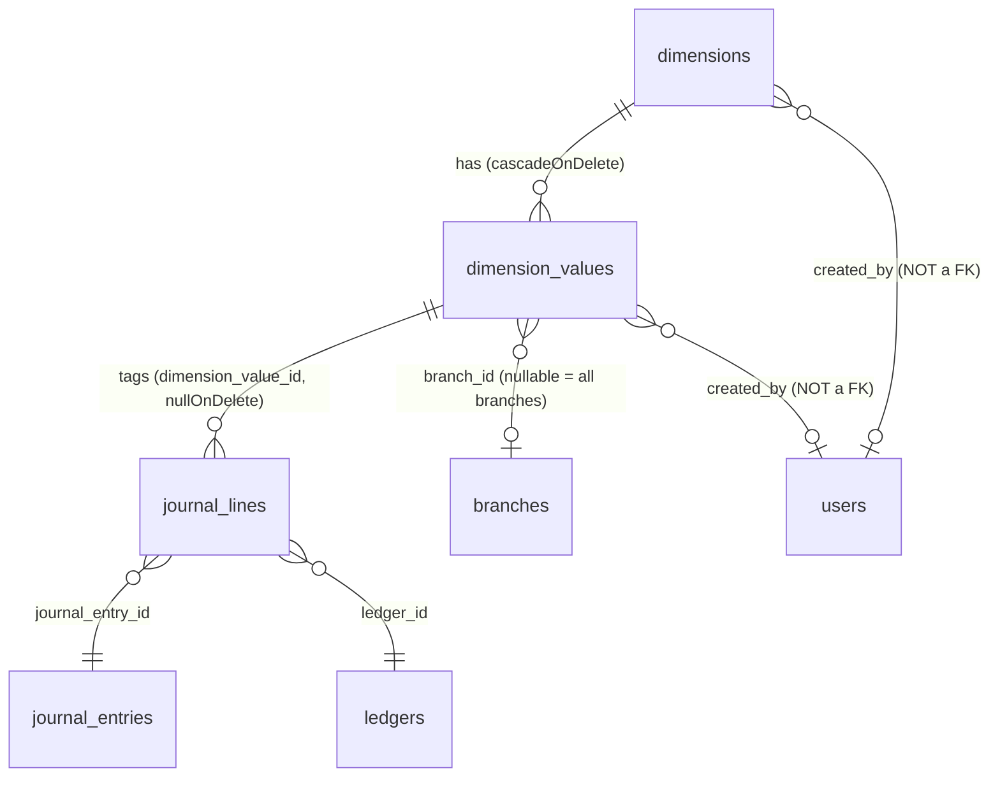
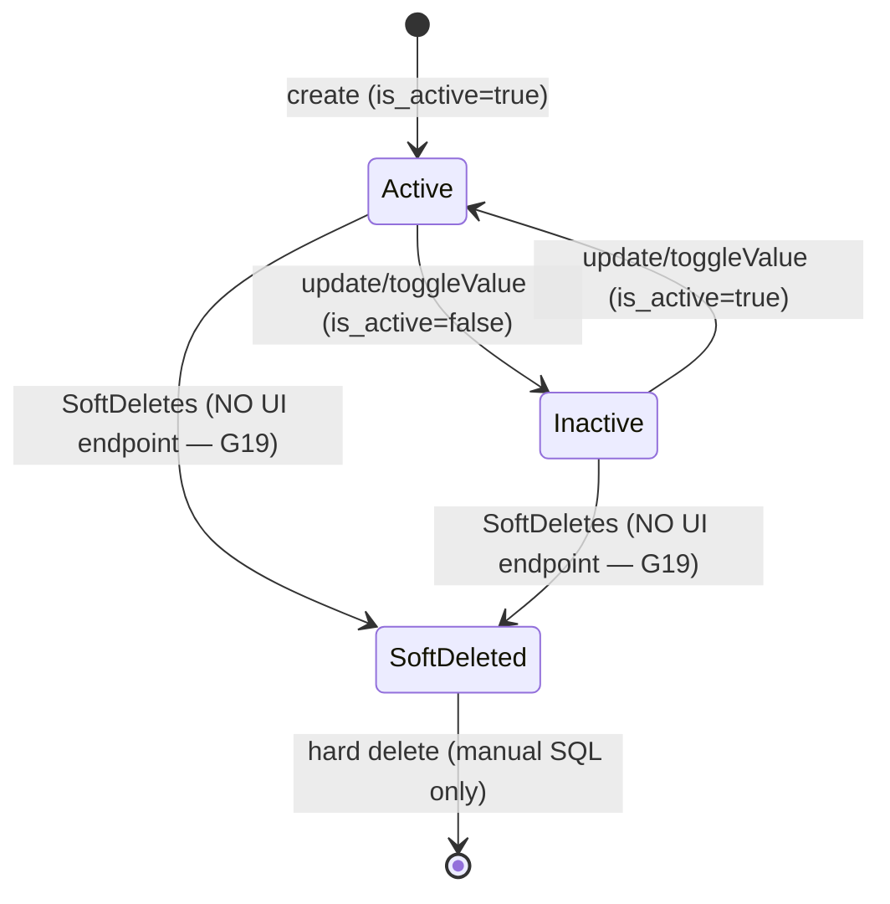
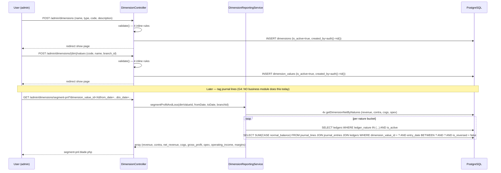

# Dimensions & Cost Centers — Phase 6/12

> **Module:** Finance / Analytical Accounting
> **Audience:** Engineers, AI assistants, accountants
> **Status:** Draft — pending accountant sign-off (NOT SAFETY-CRITICAL — read-only reporting + master-data CRUD; no GL posting)
> **Last reviewed:** Phase 12 (initial creation)
> **Source of truth:** This file is the canonical reference for the analytical-dimensions
> subsystem. The implementation lives in `laravel/app/Models/{Dimension,DimensionValue}.php`,
> `laravel/app/Services/Budgeting/DimensionReportingService.php`,
> `laravel/app/Http/Controllers/Admin/DimensionController.php`, and the migration
> `laravel/database/migrations/2026_08_10_000002_create_budgeting_and_cost_centers.php`.

---

## 1. What is it?

The **Dimensions & Cost Centers subsystem** (internally tagged *Phase 6* in the route file,
sharing a migration with the budgeting subsystem) is the ERP's analytical-accounting layer. It
enables **segment reporting** — slicing the general ledger by analytical axes such as
department, project, location, cost center, or profit center — so that management can answer
questions like "how much did the Sales department spend on rent?" rather than only "how much
did we spend on rent?".

**"Cost center" is a dimension TYPE** (one of 5: `cost_center`, `profit_center`, `department`,
`project`, `location`), NOT a separate table. The doc title "Dimensions & Cost Centers" is
historical — it reflects the menu structure (which uses "Cost Centers" as the parent menu label)
rather than the underlying data model. The `cost_center` type is the default (migration L66).

The subsystem spans **two tables** (`dimensions`, `dimension_values`) + one column on
`journal_lines` (`dimension_value_id`), **two Eloquent models**, **one service**
(`DimensionReportingService` — 261 LOC), **one controller** (`DimensionController` — 243 LOC,
9 actions), and **six Blade views**. It is **web-only** — there is no REST API. Dimensions are
**analytical-only**: they do NOT post to the GL. The only GL touch-point is the
`journal_lines.dimension_value_id` column, which optionally tags each journal line with a
dimension value for segment reporting.

> **CRITICAL — G4:** The `journal_lines.dimension_value_id` column EXISTS (added by migration
> L105-112, re-asserted in the partition migration L530/L558-565/L648) and
> `JournalPostingService::createJournalEntry` READS it (L133) — but **NO business module
> (sales, purchase, stock, manual-journal, expense, income) passes `dimension_value_id` when
> creating journal lines**. Every journal line in the system has `dimension_value_id = NULL`.
> Segment reports will return 0 for all segments. The "dimension tagging on postings" feature
> (explicit Phase 12 deliverable) is **plumbed but not wired**.

> **CRITICAL — G1:** `DimensionValue` applies `BranchScope` (model L36-39), which uses a hard
> `where('branch_id', '=', $sessionBranchId)` (BranchScope L62). This EXCLUDES rows where
> `branch_id IS NULL` — but all 5 seeded department values (ADMIN/SALES/ACCOUNTS/WAREHOUSE/HR)
> have `branch_id = NULL` (meaning "all branches"). **Non-admin users (accountants, managers)
> cannot see the seeded dimension values.** RLS correctly allows NULL-branch rows, but the
> Eloquent BranchScope is applied ON TOP and filters them out.

---

## 2. Why does it exist?

Three management-accounting drivers:

1. **Segment reporting.** The GL alone can only answer "how much did we spend on rent?".
   Dimensions enable "how much did the Sales department spend on rent?" — by tagging each
   journal line with a dimension value (e.g., "Sales Dept" within the Department dimension).
   `DimensionReportingService` then aggregates by dimension value.
2. **Cost allocation.** Tag operating expenses to cost centers for accountability. Without
   dimensions, cost allocation requires manual spreadsheet work outside the ERP.
3. **Analytical flexibility.** Dimensions are orthogonal to the chart of accounts — a single
   ledger (e.g., "Office Rent") can be tagged with any dimension value, and a single dimension
   value can be applied to any ledger. This is the same model used by SAP B1 (up to 5
   user-defined dimensions) and Tally Cost Categories.

---

## 3. When is it used?

| Event | Trigger | Frequency | Lifecycle stage |
|---|---|---|---|
| Create dimension | New analytical axis needed (e.g., add "Region" dimension) | Rare | Setup |
| Add dimension value | New department/project/location created | Occasional | Setup / ongoing |
| Toggle value active/inactive | Reorganise departments | Rare | Ongoing |
| Tag journal line with dimension | At posting time (manual journal, sales invoice, etc.) | Per posting | In-flight |
| Segment P&L report | Month-end / quarter-end close | Monthly/Quarterly | Reporting |
| Segment BS report | Period-end snapshot | Monthly/Quarterly | Reporting |
| Dimension comparison | Cross-segment P&L review | Monthly/Quarterly | Reporting |
| Usage summary | "Which dimensions have data?" audit | As needed | Reporting |

> **G4:** "Tag journal line with dimension" is currently NOT wired to any business module.
> The only way to populate `journal_lines.dimension_value_id` is via direct SQL. Segment
> reports will return 0 until tagging is wired.

---

## 4. Who uses it?

| Role | What they do | Effective access today |
|---|---|---|
| **Superadmin** | Full access (bypasses `role` middleware via `EnsureRole` L37) | ✅ Works |
| **Admin** | Full access (RLS `is_admin=true` bypass; BranchScope does NOT apply to admins) | ✅ Works |
| **Manager** | Intended: reviews segment reports, manages dimensions | ⚠️ **G1 — cannot see NULL-branch dimension values** (BranchScope excludes them); **G18 — can create/edit dimensions (should arguably be admin-only)** |
| **Accountant** | Intended: tags postings, runs segment reports | ⚠️ **G1 — cannot see NULL-branch dimension values**; cannot tag postings (G4 — no business module exposes the field) |
| **API consumer** | — | ❌ No REST API exists |

> **G7:** `EnforceBranchIsolation::inferTableFromUri` does NOT include `dimensions`. Cross-branch
> dimension value creation is NOT request-level guarded (a non-admin accountant in Branch A can
> POST `admin/dimensions/{id}/values` with `branch_id = Branch B`).

---

## 5. Related modules

| Direction | Target | Why |
|---|---|---|
| Outbound | [`../accounting/journal-posting-rules.md`](../accounting/journal-posting-rules.md) | `journal_lines.dimension_value_id` column; `createJournalEntry` reads it (L133); `reverseJournalEntry` does NOT propagate it (G14 — L193-202). |
| Outbound | [`../accounting/chart-of-accounts.md`](../accounting/chart-of-accounts.md) | Ledgers, `account_type` (Asset/Liability/Equity/Income/Expense), `normal_balance` (debit/credit), `ledger_nature`. Dimensions are orthogonal to ledgers (a journal line has BOTH `ledger_id` AND `dimension_value_id`). |
| Outbound | [`../accounting/financial-audit-log.md`](../accounting/financial-audit-log.md) | `fn_financial_audit_trigger` — gap: NOT attached to `dimensions`/`dimension_values` (G2). |
| Outbound | [`../accounting/fiscal-year-period-close.md`](../accounting/fiscal-year-period-close.md) | Period-close enforcement via `JournalPostingService::validatePeriod`. Dimensions are NOT period-scoped (no `fiscal_year_id` column; raw `entry_date` filter only). |
| Outbound | [`../accounting/reversal-vs-cancellation.md`](../accounting/reversal-vs-cancellation.md) | Append-only reversal semantics. G14 documents that reversal JEs lose the dimension tag → segment reports double-count reversed postings. |
| Outbound | [`../architecture/branch-isolation-rls.md`](../architecture/branch-isolation-rls.md) | `BranchScope` global scope + RLS policies. G1 documents the NULL-branch exclusion conflict on `DimensionValue`. |
| Outbound | [`../database/triggers-views-constraints.md`](../database/triggers-views-constraints.md) | `budget_vs_actual` view definition (currently only in migration — G3 stale DDL). |
| Sibling | [`./budgeting.md`](./budgeting.md) | The `budgets` + `budget_lines` tables created by the SAME migration; the `budget_vs_actual` view is ledger-only (NOT dimension-aware — BR18); budget lines have NO `dimension_value_id` column (G6 in sibling doc). |
| Inbound (future) | `../reports/reports-catalog.md` (Phase 16) | Segment P&L and Segment BS are reports; should be catalogued. |
| Inbound (future) | `../reports/materialized-views.md` (Phase 16) | G9 — no MV for segment reporting; future MV proposal. |
| Inbound (future) | `../workflows/approval-workflow.md` (Phase 14) | G11 — no approval workflow for dimension creation. |

---

## 6. Business rules

> Voice: **MUST** / **MUST NOT**. Every rule cites the code that enforces it.

### 6.1 Dimension master data

| # | Rule | Evidence |
|---|---|---|
| BR1 | A dimension's `type` MUST be one of `cost_center`, `profit_center`, `department`, `project`, `location`. | migration L66-67 CHECK constraint; controller L66, L127 `validate()` |
| BR2 | A dimension's `code` MUST be unique across ALL dimensions (including soft-deleted ones). ⚠️ **G13 — plain UNIQUE, not partial; soft-deleted codes can't be reused.** | migration L68 `$table->string('code', 20)->unique()` |
| BR3 | A dimension's `code` MUST NOT be editable after creation. | controller L125-130 `update` validate does not include `code`; edit.blade.php has no `code` field |
| BR4 | A dimension MUST NOT be hard-deleted via the UI (only soft-deactivated). ⚠️ **G19 — no `destroy` endpoint.** | controller has no `destroy` action |
| BR5 | Dimension types are NOT user-extensible (hardcoded enum in 3 places: migration CHECK, model `typeOptions()`, controller `validate()`). ⚠️ **G14.** | migration L67, model L64-73, controller L66/L127 |

### 6.2 Dimension values

| # | Rule | Evidence |
|---|---|---|
| BR6 | A dimension value's `code` MUST be unique within its dimension AMONG active (non-deleted) values. | migration L98-102 partial UNIQUE index `uq_dv_dim_code_active WHERE deleted_at IS NULL` |
| BR7 | A dimension value's `branch_id` MAY be NULL, meaning "applies to all branches". | migration L84 comment; RLS policy L182-188 |
| BR8 | A non-admin user MUST NOT toggle a dimension value belonging to another branch (route-model-binding + BranchScope returns 404). ⚠️ **G1 — also 404s on NULL-branch values.** | `DimensionValue.php:38` BranchScope; controller L165 route-model-bind |
| BR9 | `storeValue` MUST NOT accept a `branch_id` that doesn't exist in `branches`. | controller L146 `'branch_id' => 'nullable\|exists:branches,id'` |
| BR10 | RLS on `dimension_values` MUST allow `branch_id IS NULL` rows to be visible to all users. | migration L182-188 policy |
| BR11 | `BranchScope` on `DimensionValue` MUST NOT exclude `branch_id IS NULL` rows — **but it does (G1 BUG)**. | `BranchScope.php:62` hard equality conflicts with BR10 |

### 6.3 Journal line tagging

| # | Rule | Evidence |
|---|---|---|
| BR12 | A `journal_lines.dimension_value_id`, when set, MUST reference an existing `dimension_values.id`. | migration L107-109 FK `fk_jl_dim_value` |
| BR13 | Deleting a `dimension_values` row MUST NULL out referencing `journal_lines.dimension_value_id` (not cascade, not restrict). | migration L109 `nullOnDelete()`; partition migration L563 `ON DELETE SET NULL` |
| BR14 | `JournalPostingService::createJournalEntry` MUST accept an optional `dimension_value_id` on each line, defaulting to NULL. | `JournalPostingService.php:133` |
| BR15 | `JournalPostingService::reverseJournalEntry` MUST NOT propagate `dimension_value_id` to reversal lines. ⚠️ **G14 MAJOR — segment reports double-count reversed postings.** | `JournalPostingService.php:193-202` |
| BR16 | NO business module (sales, purchase, stock, manual-journal, expense, income) passes `dimension_value_id` when creating journal lines. ⚠️ **G4 CRITICAL — segment reports always return 0.** | Grep of `app/Services` for `dimension_value_id` returns only `JournalPostingService.php:133` (reader) + `DimensionReportingService.php` (queries) |

### 6.4 Segment reporting

| # | Rule | Evidence |
|---|---|---|
| BR17 | Segment P&L MUST only include non-reversed journal entries. | `DimensionReportingService.php:200` `where('journal_entries.is_reversed', false)` |
| BR18 | Segment BS MUST only include entries with `entry_date <= as_of_date`. | `DimensionReportingService.php:242` |
| BR19 | Segment reports MUST exclude soft-deleted ledgers. | `DimensionReportingService.php:201, 244` `whereNull('ledgers.deleted_at')` |
| BR20 | Segment P&L revenue MUST be net of contra-revenue (sales_return + sales_discount). | `DimensionReportingService.php:51` `$netRevenue = $revenue - $contra` |
| BR21 | Segment P&L gross margin MUST be `gross_profit / net_revenue * 100`, rounded to 1 decimal, and 0 when `net_revenue <= 0`. | `DimensionReportingService.php:53` |
| BR22 | `dimensionComparison` MUST skip inactive dimension values. | `DimensionReportingService.php:121-123` `if (!$dimValue->is_active) continue;` |
| BR23 | The `budget_vs_actual` view MUST NOT consider `dimension_value_id` (budget vs actual is ledger-only, not dimension-aware). | migration L145-159 LATERAL join has no `dimension_value_id` filter |

### 6.5 Security & isolation

| # | Rule | Evidence |
|---|---|---|
| BR24 | The `role:accountant,manager,admin` middleware MUST be applied to every dimension route. ⚠️ **G18 — no per-action differentiation.** | `web.php:1665, 1678` |
| BR25 | `fn_financial_audit_trigger` MUST NOT be attached to `dimensions` or `dimension_values`. ⚠️ **G2.** | `02_accounting.sql:446-455` (10 tables, no dim tables) |
| BR26 | The system MUST seed 3 default dimensions (Department, Project, Location) and 5 department values on migration. | migration L194-247 |
| BR27 | Dimensions are global (NOT branch-scoped) — `BranchScope` is NOT applied to the `Dimension` model. | `Dimension.php` (no `booted()` call) |
| BR28 | Dimension values MAY be branch-scoped (NULL = all branches) — `BranchScope` IS applied to `DimensionValue` (but buggy — G1). | `DimensionValue.php:36-39` |

---

## 7. Technical implementation

### 7.1 Models

#### `Dimension` (`app/Models/Dimension.php` — 79 LOC)

- `$table = 'dimensions'`, `use SoftDeletes;`. **No BranchScope** (global by design).
- `$fillable` (6 columns): `name, type, code, is_active, description, created_by`.
- `$casts`: `is_active → boolean`.
- **Types** (`typeOptions()`): `cost_center` (default), `profit_center`, `department`, `project`, `location`.
- **Relationships**: `values()` (hasMany DimensionValue), `creator()`.
- **Scopes**: `scopeActive`, `scopeOfType($type)`.
- **Helpers**: `typeLabel()`.
- **No `STATUS_*` constants** — `is_active` boolean only.

#### `DimensionValue` (`app/Models/DimensionValue.php` — 69 LOC)

- `$table = 'dimension_values'`, `use SoftDeletes;`, `BranchScope` global scope applied via `booted()` (L36-39 — **G1 BUG**).
- `$fillable` (6 columns): `dimension_id, code, name, branch_id, is_active, created_by`.
- `$casts`: `is_active → boolean`.
- **Relationships**: `dimension()`, `branch()`, `journalLines()` (hasMany JournalLine).
- **Scopes**: `scopeActive`, `scopeForDimension($dimensionId)`.
- **No constants.**

### 7.2 Service — `DimensionReportingService` (`app/Services/Budgeting/DimensionReportingService.php` — 261 LOC)

**Constructor:** none (no DI). All methods are read-only; no writes; no transactions; no audit logging. **Direct `DB::table('journal_lines')` queries — no MV, no service indirection (G9).**

**Public methods (4 crown jewels + 2 private helpers):**

1. `segmentProfitAndLoss(int $dimensionValueId, string $fromDate, string $toDate, ?int $branchId = null): array` (L33-71) — **THE CROWN JEWEL.** Computes Revenue − Contra-Revenue = Net Revenue; Net Revenue − COGS = Gross Profit; Gross Profit − OpEx = Operating Income.

```php
public function segmentProfitAndLoss(int $dimensionValueId, string $fromDate, string $toDate, ?int $branchId = null): array
{
    $dimValue = DimensionValue::with('dimension')->findOrFail($dimensionValueId);

    // Revenue natures (credit normal)
    $revenueNatures = ['sales_revenue', 'transport_revenue', 'other_income', 'inventory_surplus'];
    // Contra-revenue (debit normal, reduce revenue)
    $contraRevenueNatures = ['sales_return', 'sales_discount'];
    // COGS
    $cogsNatures = ['cogs'];
    // Operating expenses
    $opexNatures = ['operating_expense', 'salary_expense', 'finance_cost', 'inventory_shrinkage', 'damage_loss'];

    $revenue  = $this->getDimensionNetByNatures($dimensionValueId, $revenueNatures, $fromDate, $toDate, $branchId);
    $contra   = $this->getDimensionNetByNatures($dimensionValueId, $contraRevenueNatures, $fromDate, $toDate, $branchId);
    $cogs     = $this->getDimensionNetByNatures($dimensionValueId, $cogsNatures, $fromDate, $toDate, $branchId);
    $opex     = $this->getDimensionNetByNatures($dimensionValueId, $opexNatures, $fromDate, $toDate, $branchId);

    $netRevenue = $revenue - $contra;
    $grossProfit = $netRevenue - $cogs;
    $grossMargin = $netRevenue > 0 ? round(($grossProfit / $netRevenue) * 100, 1) : 0;
    $operatingIncome = $grossProfit - $opex;
    $netMargin = $netRevenue > 0 ? round(($operatingIncome / $netRevenue) * 100, 1) : 0;

    return [
        'dimension_value' => $dimValue,
        'dimension'       => $dimValue->dimension,
        'period'          => ['from' => $fromDate, 'to' => $toDate],
        'revenue'         => $revenue,
        'contra_revenue'  => $contra,
        'net_revenue'     => $netRevenue,
        'cogs'            => $cogs,
        'gross_profit'    => $grossProfit,
        'gross_margin'    => $grossMargin,
        'operating_expense' => $opex,
        'operating_income'  => $operatingIncome,
        'net_margin'      => $netMargin,
    ];
}
```

2. `segmentBalanceSheet(int $dimensionValueId, string $asOfDate, ?int $branchId = null): array` (L84-102) — point-in-time cumulative balance by `account_type` (Asset/Liability/Equity).

```php
public function segmentBalanceSheet(int $dimensionValueId, string $asOfDate, ?int $branchId = null): array
{
    $dimValue = DimensionValue::with('dimension')->findOrFail($dimensionValueId);

    $assets     = $this->getDimensionBalanceByType($dimensionValueId, 'Asset', $asOfDate, $branchId);
    $liabilities = $this->getDimensionBalanceByType($dimensionValueId, 'Liability', $asOfDate, $branchId);
    $equity     = $this->getDimensionBalanceByType($dimensionValueId, 'Equity', $asOfDate, $branchId);

    return [
        'dimension_value' => $dimValue,
        'dimension'       => $dimValue->dimension,
        'as_of_date'      => $asOfDate,
        'assets'          => $assets,
        'liabilities'     => $liabilities,
        'equity'          => $equity,
        'total_assets'    => $assets,
        'total_liabilities_equity' => $liabilities + $equity,
    ];
}
```

> **Caveat:** BS segmentation only works if journal lines are tagged. Since most balance-sheet
> postings (AR, AP, inventory, cash) are NOT currently tagged (G4), segment BS will return 0
> for assets/liabilities/equity for any segment.

3. `dimensionComparison(int $dimensionId, string $fromDate, string $toDate, ?int $branchId = null): array` (L115-132) — iterates `$dimension->values`, skips inactive, calls `segmentProfitAndLoss` per value. **N+1 query pattern (G17)** — for an N-value dimension, runs 4N `getDimensionNetByNatures` queries.

4. `getDimensionUsageSummary(int $dimensionId, string $fromDate, string $toDate): array` (L138-172) — per-value row count + total debit on `journal_lines`. **No `branch_id` filter** (G25).

5. `getDimensionNetByNatures(...)` (L182-217) — **PRIVATE, verbatim SQL:**

```php
private function getDimensionNetByNatures(int $dimensionValueId, array $natures, string $fromDate, string $toDate, ?int $branchId = null): float
{
    $ledgerIds = Ledger::whereIn('ledger_nature', $natures)
        ->where('is_active', true)
        ->whereNull('deleted_at')
        ->pluck('id')
        ->toArray();

    if (empty($ledgerIds)) {
        return 0;
    }

    $query = DB::table('journal_lines')
        ->join('journal_entries', 'journal_entries.id', '=', 'journal_lines.journal_entry_id')
        ->join('ledgers', 'ledgers.id', '=', 'journal_lines.ledger_id')
        ->whereIn('journal_lines.ledger_id', $ledgerIds)
        ->where('journal_lines.dimension_value_id', $dimensionValueId)
        ->whereBetween('journal_entries.entry_date', [$fromDate, $toDate])
        ->where('journal_entries.is_reversed', false)
        ->whereNull('ledgers.deleted_at');

    if ($branchId !== null) {
        $query->where('journal_entries.branch_id', $branchId);
    }

    $result = $query->selectRaw("
        SUM(
            CASE ledgers.normal_balance
                WHEN 'credit' THEN journal_lines.credit - journal_lines.debit
                WHEN 'debit'  THEN journal_lines.debit - journal_lines.credit
            END
        ) AS net_amount
    ")->first();

    return (float) ($result->net_amount ?? 0);
}
```

6. `getDimensionBalanceByType(...)` (L225-260) — **PRIVATE.** Same shape but filters `ledgers.account_type IN ('Asset'/'Liability'/'Equity')` and `entry_date <= asOfDate` instead of BETWEEN.

### 7.3 Controller — `DimensionController` (`app/Http/Controllers/Admin/DimensionController.php` — 243 LOC)

**Constructor DI:** `DimensionReportingService $reportingService` (L21-23).

| # | Route | Method | Service call | Validation | DB::transaction | Audit |
|---|---|---|---|---|---|---|
| 1 | GET `admin/dimensions` | `index` (L30-46) | none | inline `filled()` | No | No |
| 2 | GET `admin/dimensions/create` | `create` (L51-55) | none | none | No | No |
| 3 | POST `admin/dimensions` | `store` (L60-83) | none | inline `validate()` (4 rules) | No | No |
| 4 | GET `admin/dimensions/{dimension}` | `show` (L88-103) | `getDimensionUsageSummary()` | none | No | No |
| 5 | GET `admin/dimensions/{dimension}/edit` | `edit` (L108-113) | none | none | No | No |
| 6 | PUT `admin/dimensions/{dimension}` | `update` (L118-136) | none | inline `validate()` (4 rules) | No | No |
| 7 | POST `admin/dimensions/{dimension}/values` | `storeValue` (L141-160) | none | inline `validate()` (4 rules) | No | No |
| 8 | PATCH `admin/dimensions/{dimension}/values/{value}/toggle` | `toggleValue` (L165-171) | none | none | No | No |
| 9 | GET `admin/dimensions/segment-pnl` | `segmentPnl` (L176-205) | `segmentProfitAndLoss()` OR `dimensionComparison()` | none | No | No |
| 10 | GET `admin/dimensions/segment-bs` | `segmentBs` (L210-235) | `segmentBalanceSheet()` | none | No | No |

**Validation:** All inline `$request->validate()`. **No FormRequest classes** (G5). **No Policy** (G6). **No DB::transaction** (single-row CRUD, atomic by default). **No audit logging** (G2 + G15). **`store` catches `\Throwable` and flashes raw `$e->getMessage()` to the user** (G20 — information disclosure).

### 7.4 Migrations

#### `2026_08_10_000002_create_budgeting_and_cost_centers.php` (278 LOC)

Creates 4 tables (budgets, budget_lines, dimensions, dimension_values — the former two are the sibling doc's domain), adds `journal_lines.dimension_value_id`, creates `budget_vs_actual` VIEW, enables RLS on `budgets` + `dimension_values`, seeds 3 dimensions + 5 department values.

**`dimensions` table** (L63-76):
```php
Schema::create('dimensions', function (Blueprint $table) {
    $table->id();
    $table->string('name', 100);
    $table->string('type', 30)->default('cost_center')
          ->check("type IN ('cost_center','profit_center','department','project','location')");
    $table->string('code', 20)->unique();  // G13: plain UNIQUE, not partial
    $table->boolean('is_active')->default(true);
    $table->text('description')->nullable();
    $table->unsignedBigInteger('created_by');  // NOT a FK
    $table->timestamps();
    $table->softDeletes();
    $table->index(['type', 'is_active'], 'idx_dim_type_active');
});
```

**`dimension_values` table** (L79-102):
```php
Schema::create('dimension_values', function (Blueprint $table) {
    $table->id();
    $table->foreignId('dimension_id')->constrained()->cascadeOnDelete();
    $table->string('code', 30);
    $table->string('name', 150);
    $table->foreignId('branch_id')->nullable()->constrained(); // null = all branches
    $table->boolean('is_active')->default(true);
    $table->unsignedBigInteger('created_by');
    $table->timestamps();
    $table->softDeletes();
    $table->index(['dimension_id', 'is_active'], 'idx_dv_dim_active');
    $table->index('branch_id');
});
// Partial unique index (PostgreSQL-specific — solves NULL != NULL)
DB::statement("
    CREATE UNIQUE INDEX uq_dv_dim_code_active
    ON dimension_values (dimension_id, code)
    WHERE deleted_at IS NULL
");
```

**`journal_lines.dimension_value_id` column** (L105-112):
```php
Schema::table('journal_lines', function (Blueprint $table) {
    $table->unsignedBigInteger('dimension_value_id')->nullable()->after('memo');
    $table->foreign('dimension_value_id', 'fk_jl_dim_value')
          ->references('id')->on('dimension_values')
          ->nullOnDelete();
    $table->index('dimension_value_id', 'idx_jl_dim_value');
});
```

**`dimension_values` RLS policy** (L178-189):
```sql
ALTER TABLE dimension_values ENABLE ROW LEVEL SECURITY;
ALTER TABLE dimension_values FORCE ROW LEVEL SECURITY;
CREATE POLICY dimension_values_branch_policy ON dimension_values
USING (
    branch_id IS NULL
    OR branch_id = current_setting('app.branch_id', true)::int
    OR current_setting('app.is_admin', true) = 'true'
);
-- NO WITH CHECK clause (same gap as budgets G8)
```

> **G1 conflict:** RLS correctly allows `branch_id IS NULL` rows, but the Eloquent `BranchScope`
> on `DimensionValue` (model L36-39) uses hard `where('branch_id', '=', $sessionBranchId)`
> (BranchScope L62) which EXCLUDES NULL-branch rows. Non-admin users see an empty dimension-values
> list.

**Seeded data** (L194-247): 3 dimensions (Department/DEPT, Project/PROJ, Location/LOC) + 5 department values (ADMIN, SALES, ACCOUNTS, WAREHOUSE, HR) — all `branch_id = NULL`, `is_active = true`. **No seeded cost_center or profit_center dimensions** despite `cost_center` being the default type.

#### `2026_08_10_000003_add_budget_and_dimension_menus.php` (242 LOC)

Seeds 2 parent + 6 child menus under `Administration`:
- **Cost Centers** (parent, `fas fa-sitemap`) → Dimensions (`dimension.index`), Segment P&L (`dimension.segment_pnl`), Segment BS (`dimension.segment_bs`)
- **Budgets** (parent, `fas fa-wallet`) → Budget List (`budget.index`), Budget vs Actual (`budget.variance`)

Grants superadmin (`E0001`) `can_view=true, can_edit=true` on all 8 menus via `user_menu_permissions` upsert (idempotent `ON CONFLICT`).

### 7.5 Routes (`routes/web.php` L1664-1678)

```php
// Dimensions & Cost Centers
Route::prefix('admin/dimensions')->name('admin.dimensions.')->middleware('role:accountant,manager,admin')->group(function () {
    Route::get('segment-pnl', [DimensionController::class, 'segmentPnl'])->name('segment-pnl');
    Route::get('segment-bs', [DimensionController::class, 'segmentBs'])->name('segment-bs');
    Route::get('create', [DimensionController::class, 'create'])->name('create');
    Route::post('/', [DimensionController::class, 'store'])->name('store');
    Route::get('{dimension}', [DimensionController::class, 'show'])->name('show');
    Route::get('{dimension}/edit', [DimensionController::class, 'edit'])->name('edit');
    Route::put('{dimension}', [DimensionController::class, 'update'])->name('update');
    Route::post('{dimension}/values', [DimensionController::class, 'storeValue'])->name('store-value');
    Route::patch('{dimension}/values/{value}/toggle', [DimensionController::class, 'toggleValue'])->name('toggle-value');
});
Route::get('admin/dimensions', [DimensionController::class, 'index'])
    ->name('admin.dimensions.index')
    ->middleware('role:accountant,manager,admin');
```

**Middleware:** `role:accountant,manager,admin` on every route. **No per-action differentiation** (G18). **No `branch.isolation` middleware** (G7). **No API routes** (web-only).

### 7.6 Config / Triggers / Artisan

- **Config:** None (G16 — no `config/dimensions.php`; the 5 type options are hardcoded in 3 places).
- **Triggers:** None attached to dimension tables (G2 — `fn_financial_audit_trigger` NOT attached).
- **Artisan:** None. No command for segment reporting or dimension bulk import. No scheduled job.
- **FormRequests:** None (G5).
- **Policy:** None (G6).
- **Tests:** None (G26).

---

## 8. Important database tables

### 8.1 `dimensions`

| Column | Type | Default | Notes |
|---|---|---|---|
| `id` | bigint PK | auto | |
| `name` | varchar(100) | — | Display name |
| `type` | varchar(30) | `cost_center` | CHECK: one of 5 enum values |
| `code` | varchar(20) | — | **Plain UNIQUE** (G13 — not partial; soft-deleted codes can't be reused) |
| `is_active` | boolean | true | Soft-toggle |
| `description` | text | NULL | |
| `created_by` | bigint | — | NOT a FK (orphan risk) |
| `timestamps`, `deleted_at` | timestamp | — | Soft deletes enabled |

**Indexes:** `idx_dim_type_active (type, is_active)`, UNIQUE on `code`.

**FKs:** none (parent table). **Triggers:** none. **RLS:** NOT enabled (intentional — global table, no `branch_id`). **BranchScope:** NOT applied (intentional).

### 8.2 `dimension_values`

| Column | Type | Default | Notes |
|---|---|---|---|
| `id` | bigint PK | auto | |
| `dimension_id` | bigint FK→dimensions (CASCADE) | — | |
| `code` | varchar(30) | — | Partial UNIQUE `(dimension_id, code) WHERE deleted_at IS NULL` |
| `name` | varchar(150) | — | |
| `branch_id` | bigint FK→branches (RESTRICT) | NULL | NULL = "all branches" |
| `is_active` | boolean | true | |
| `created_by` | bigint | — | NOT a FK |
| `timestamps`, `deleted_at` | timestamp | — | Soft deletes enabled |

**Indexes:** `idx_dv_dim_active (dimension_id, is_active)`, `idx_dv_branch_id`, partial UNIQUE `uq_dv_dim_code_active`.

**FKs:** `dimension_id` → dimensions CASCADE, `branch_id` → branches RESTRICT. **Triggers:** none. **RLS:** Enabled + Forced (policy `dimension_values_branch_policy`, USING only — no WITH CHECK). **BranchScope:** Applied (L36-39 — **G1 BUG**).

### 8.3 `journal_lines.dimension_value_id` (THE CRITICAL COLUMN)

| Column | Type | Nullable | Default | Notes |
|---|---|---|---|---|
| `dimension_value_id` | integer | YES | NULL | FK → `dimension_values(id)` ON DELETE SET NULL DEFERRABLE INITIALLY DEFERRED |

**Index:** `idx_jl_dim_value` (B-tree on `dimension_value_id`). **FK constraint name:** `fk_jl_dim_value`.

> **G3 stale DDL:** The column EXISTS in migrated DBs (added by migration L105-112, re-asserted
> in partition migration L530/L558-565/L648) but is NOT in `database/sql/02_accounting.sql`
> L55-67 (the canonical DDL). A fresh `psql -f database/sql/*.sql` load will NOT have the column.

### 8.4 ER diagram



---

## 9. Related services

| Service | File | Role |
|---|---|---|
| `DimensionReportingService` | `app/Services/Budgeting/DimensionReportingService.php` (261L) | Owns segment P&L, segment BS, dimension comparison, usage summary. Direct-reads `journal_lines`. |
| `JournalPostingService` | `app/Services/Accounting/JournalPostingService.php` (480L) | Cross-ref — `createJournalEntry` reads `dimension_value_id` at L133 (optional key); `reverseJournalEntry` does NOT propagate it (G14 — L193-202). |
| `LedgerNatureService` | `app/Services/Accounting/LedgerNatureService.php` (389L) | Cross-ref — NO dimension-related natures (correct — dimensions are orthogonal to natures). `DimensionReportingService` queries `Ledger::whereIn('ledger_nature', $natures)` to bucket by revenue/contra/COGS/OpEx. |
| `BranchScope` | `app/Models/Scopes/BranchScope.php` (65L) | Applied to `DimensionValue` (L36-39 — **G1 BUG**). NOT applied to `Dimension`. |

---

## 10. Related models

| Model | File | Notes |
|---|---|---|
| `Dimension` | `app/Models/Dimension.php` (79L) | See §7.1. |
| `DimensionValue` | `app/Models/DimensionValue.php` (69L) | See §7.1. |
| `JournalLine` | `app/Models/Accounting/JournalLine.php` (44L) | Holds `dimension_value_id` in `$fillable` (L15) + `dimensionValue()` belongsTo (L35-38). |
| `Ledger` | `app/Models/Ledger.php` | `account_type`, `normal_balance`, `ledger_nature` used by `DimensionReportingService`. |
| `Branch` | `app/Models/Branch.php` | `dimension_values.branch_id` FK. **G22 — `Branch` model has no `dimensionValues()` hasMany.** |

---

## 11. Important workflows

### 11.1 Dimension lifecycle (state machine)



**No `STATUS_*` constants** — `is_active` boolean only. **No `destroy` endpoint** (G19 — soft-delete not exposed in UI). **No state-transition validation** (e.g., "cannot deactivate a dimension with active values").

### 11.2 Create dimension → add value → run segment P&L



### 11.3 Segment P&L aggregation table

**Bucket → ledger_nature → sign convention:**

| Bucket | Ledger Natures | Sign Convention (SUM CASE normal_balance) |
|---|---|---|
| Revenue | `sales_revenue`, `transport_revenue`, `other_income`, `inventory_surplus` | `credit − debit` (credit-normal accounts) |
| Contra-Revenue | `sales_return`, `sales_discount` | `debit − credit` (debit-normal, subtracted from revenue) |
| COGS | `cogs` | `debit − credit` (debit-normal) |
| OpEx | `operating_expense`, `salary_expense`, `finance_cost`, `inventory_shrinkage`, `damage_loss` | `debit − credit` (debit-normal) |

**P&L formula:**
- `net_revenue = revenue − contra_revenue`
- `gross_profit = net_revenue − cogs`
- `gross_margin = gross_profit / net_revenue × 100` (0 if `net_revenue ≤ 0`)
- `operating_income = gross_profit − opex`
- `net_margin = operating_income / net_revenue × 100` (0 if `net_revenue ≤ 0`)

> **Missing buckets:** `gain_on_disposal`, `loss_on_disposal`, `accumulated_depreciation`, `depreciation_expense` (fixed-asset depreciation/disposal will NOT appear in segment P&L — may be intentional). `elimination_*` natures, `interbranch_receivable/payable`, `investment_in_subsidiary` (consolidation — Phase 13).

### 11.4 Dr/Cr — N/A

Dimensions are analytical-only (no GL posting). No Dr/Cr matrix applies. The segment P&L aggregation table (§11.3) shows the sign convention for the `SUM CASE normal_balance` computation, which is a reporting-side aggregation, not a posting.

---

## 12. Known edge cases

| # | Edge case | Severity | Detail |
|---|---|---|---|
| EC1 | **Reversal JE loses dimension tag** | MAJOR (G14) | `JournalPostingService::reverseJournalEntry` (L193-202) does NOT copy `dimension_value_id` to reversal lines. Segment PnL counts the original tagged line but NOT the reversal → overstated segment revenue/expense. |
| EC2 | **NULL-branch dimension value invisible to non-admins** | CRITICAL (G1) | `BranchScope` on `DimensionValue` (L36-39) uses hard `where('branch_id', '=', $sessionBranchId)` — excludes NULL-branch rows. All 5 seeded department values (ADMIN/SALES/ACCOUNTS/WAREHOUSE/HR) have `branch_id = NULL`. Non-admin users see an empty dimension-values list. |
| EC3 | **Segment P&L returns 0 for all segments** | CRITICAL (G4) | NO business module passes `dimension_value_id` when creating journal lines. Every journal line has `dimension_value_id = NULL`. The only way to get a non-zero segment report is to manually UPDATE `journal_lines.dimension_value_id` via SQL. |
| EC4 | **Deactivated dimension value still appears in segment reports** | MINOR (G24) | `segmentProfitAndLoss` L35 `findOrFail($dimensionValueId)` does NOT check `is_active`. An accountant can run a segment report on a deactivated value (which may have historical journal lines tagged). Arguably correct (historical reporting), but should be documented. |
| EC5 | **Hard-delete of dimension_value SET NULLs journal_lines** | (BR13) | Deleting a `dimension_values` row silently NULLs `journal_lines.dimension_value_id`. The journal line remains but loses its tag. No warning, no audit trail (G2). |
| EC6 | **Code reuse blocked after soft-delete on `dimensions`** | MINOR (G13) | `dimensions.code` is plain UNIQUE (not partial). A soft-deleted dimension's code is permanently consumed. Inconsistent with `dimension_values` which uses a partial UNIQUE `WHERE deleted_at IS NULL`. |
| EC7 | **Cross-branch dimension value creation** | MAJOR (G7+G21) | `EnforceBranchIsolation::inferTableFromUri` does NOT include `dimensions`. `storeValue` validates `branch_id => 'exists:branches,id'` but not access. A non-admin accountant in Branch A can POST a value with `branch_id = Branch B`. |
| EC8 | **`dimensionComparison` runs N+1 queries** | MINOR (G17) | Iterates `$dimension->values`, calls `segmentProfitAndLoss` per value, each of which runs 4 `getDimensionNetByNatures` queries. For a 20-value dimension, 80+ `journal_lines` aggregation queries. |
| EC9 | **`budget_vs_actual` view ignores dimensions** | (BR23) | Budget variance cannot be sliced by dimension. Budget lines have no `dimension_value_id` (G6 in sibling doc). |
| EC10 | **Manual journal lines cannot store dimension_value_id** | MAJOR (G8) | `manual_journal_lines` table has NO `dimension_value_id` column. Even if the manual journal UI were extended to pick a dimension, the draft line couldn't store it. |
| EC11 | **`store` flashes raw exception messages to user** | MINOR (G20) | Controller L80-82 `catch (\Throwable $e) { return back()->with('error', $e->getMessage()); }` — leaks DB-level error messages (SQL constraint violation details) to the end user. Information disclosure. |
| EC12 | **`toggleValue` not logged** | MINOR (G15) | No `user_audit_log` insert. Combined with G2 (no audit trigger), the toggle is invisible. An accountant can silently deactivate a dimension value that has active journal lines tagged to it. |
| EC13 | **No MV for segment reporting** | MAJOR (G9) | Every report run re-scans `journal_lines`. On a multi-year DB with millions of journal lines, `segmentProfitAndLoss` will be slow. |

---

## 13. Future improvements

> Ordered by severity. The 4 CRITICAL gaps should be remediated before segment reports can be used in production.

### 13.1 CRITICAL remediations

1. **G1 — Fix `BranchScope` on `DimensionValue`.** Either (a) remove `BranchScope` from `DimensionValue` and rely solely on RLS (which correctly handles NULL), or (b) create a `DimensionValueBranchScope` that filters `WHERE branch_id IS NULL OR branch_id = ?` (mirrors the RLS policy), or (c) seed dimension values per-branch instead of NULL-branch.
2. **G2 — Attach `fn_financial_audit_trigger` to `dimensions` + `dimension_values`.** Add a migration: `CREATE TRIGGER trg_audit_dimensions AFTER INSERT OR UPDATE OR DELETE ON dimensions FOR EACH ROW EXECUTE FUNCTION fn_financial_audit_trigger();` and same for `dimension_values`.
3. **G3 — Update stale DDL.** Create `database/sql/08_budgeting_and_dimensions.sql` with the 4 CREATE TABLE statements, the partial UNIQUE index, the `ALTER TABLE journal_lines ADD COLUMN dimension_value_id`, the FK, the `budget_vs_actual` view, and the RLS policies.
4. **G4 — Wire dimension tagging into at least one business module.** Quickest win: add a `dimension_value_id` field to the manual journal line UI (`manual_journal_lines` table needs a new column — G8; `ManualJournalController::postJournal` needs to pass it through). Then extend to sales invoice finalize, sales challan issue, purchase receive, stock adjustment, expense/income entry. Or: add a post-posting "dimension tagging" UI that lets an accountant bulk-tag existing journal lines by date range + ledger + reference.

### 13.2 MAJOR remediations

5. **G5 — Create FormRequest classes.** `StoreDimensionRequest`, `UpdateDimensionRequest`, `StoreDimensionValueRequest`.
6. **G6 — Create `DimensionPolicy`.** Per-action authorization; restrict write actions to `manager`+`admin`.
7. **G7 — Add `dimensions` to `EnforceBranchIsolation::inferTableFromUri`.** Map to `dimension_values` (which has the `branch_id` column).
8. **G8 — Add `dimension_value_id` column to `manual_journal_lines`.** `ALTER TABLE manual_journal_lines ADD COLUMN dimension_value_id INTEGER REFERENCES dimension_values(id) ON DELETE SET NULL`. Update `ManualJournalLine` model `$fillable`. Update the manual journal line Blade form.
9. **G9 — Create MV for segment reporting.** `CREATE MATERIALIZED VIEW mv_segment_pnl AS SELECT dimension_value_id, ledger_nature, SUM(...) ...` indexed by `(dimension_value_id, ledger_nature)`. Refresh via the existing `refresh:report-views` command.
10. **G10 — Add CSV/Excel export for segment reports.** Add `?format=csv` query param handling in `segmentPnl`/`segmentBs` actions; return a `StreamedResponse` with CSV.
11. **G11 — Add approval workflow (Phase 14).** Add `is_approved`, `approved_by`, `approved_at` to `dimensions`. Require approval before dimensions become taggable in journal lines.
12. **G12 — Add dimension-value merge.** `POST admin/dimensions/{dimension}/values/{source}/merge` with `target_value_id`. Service: `UPDATE journal_lines SET dimension_value_id = $target WHERE dimension_value_id = $source;` then soft-delete `$source`.
13. **G13 — Change `dimensions.code` to partial UNIQUE.** Drop the plain UNIQUE, add `CREATE UNIQUE INDEX uq_dim_code_active ON dimensions (code) WHERE deleted_at IS NULL`.
14. **G14 — Propagate `dimension_value_id` to reversal lines.** Add `'dimension_value_id' => $line->dimension_value_id` to the reversal line array in `JournalPostingService::reverseJournalEntry` (after L200).
15. **G15 — Log `toggleValue`.** Add `user_audit_log` insert in `toggleValue`. Or fix G2 first (audit trigger would capture it).

### 13.3 MINOR remediations

16. **G16** — Create `config/dimensions.php` with `types` array; reference from model + controller.
17. **G17** — Rewrite `dimensionComparison` as a single `GROUP BY dimension_value_id` query with `CASE WHEN ledger_nature IN (...) THEN ... END` buckets.
18. **G18** — Split route middleware: read routes keep `role:accountant,manager,admin`; write routes use `role:manager,admin`.
19. **G19** — Add `destroy` action with a pre-check (refuse if any `journal_lines.dimension_value_id` references its values). Soft-delete the dimension + its values.
20. **G20** — Log the full exception in `store`; show a generic "Failed to create dimension" message.
21. **G21** — Add a `BranchAccessible` rule, or check `auth()->user()->isAdmin() || $branchId === session('branch_id')` in `storeValue`.
22. **G22** — Add `public function dimensionValues(): HasMany` to `Branch` model.
23. **G24** — Add a UI warning "This dimension value is inactive" on segment reports, but still allow the report.
24. **G25** — Add `?int $branchId = null` to `getDimensionUsageSummary` signature; pass from controller.
25. **G26** — Add `tests/Unit/Services/Budgeting/DimensionReportingServiceTest.php`.
26. **G27** — Update `architecture/branch-isolation-rls.md` to list `DimensionValue` in its "Applied to" set (with a note about the G1 NULL-branch bug).
27. **G28** — Update `JournalPostingService::createJournalEntry` docblock to include `dimension_value_id: int|null`.

### 13.4 Documentation follow-ups

- Update `../accounting/journal-posting-rules.md` to document the `dimension_value_id` key on `$lines` (currently only in code, not docblock — G28).
- Update `../accounting/financial-audit-log.md` §7.3 to note the trigger is NOT attached to dimension tables (will be re-noted when G2 is fixed).
- Update `../architecture/branch-isolation-rls.md` to document the `DimensionValue` BranchScope + RLS conflict (G1).

---

## Accountant review checklist

> Before this doc is promoted from **Draft** to **Canonical**, the accountant MUST review and
> sign off on the following.

- [ ] **Segment P&L bucket → nature mapping.** Confirm the 4 buckets (Revenue, Contra-Revenue, COGS, OpEx) map to the correct `ledger_nature` values (§11.3). Confirm the missing buckets (`gain_on_disposal`, `loss_on_disposal`, `depreciation_expense`, etc.) are intentionally excluded.
- [ ] **Seeded dimension values.** Confirm the 5 seeded department values (ADMIN/SALES/ACCOUNTS/WAREHOUSE/HR) are appropriate. Confirm whether `cost_center` / `profit_center` dimensions should be seeded by default.
- [ ] **BS segmentation meaningfulness.** Confirm whether BS segmentation is meaningful for this ERP (most BS accounts — AR, AP, inventory, cash — are NOT currently dimension-tagged and arguably shouldn't be).
- [ ] **Dimension tagging rollout priority.** Confirm which business module should get dimension tagging first (G4 — recommend: manual journals, then sales invoices, then purchase receives).
- [ ] **Approval workflow.** Confirm whether dimension creation/deletion requires maker-checker (G11 — Phase 14).
- [ ] **Inactive value reporting.** Confirm whether segment reports should include inactive dimension values (G24 — current behavior: yes, with no warning).
- [ ] **4 CRITICAL gaps.** Review G1 (BranchScope excludes NULL-branch), G2 (audit trigger not attached), G3 (DDL stale), G4 (no business module tags dimension_value_id) and prioritise remediation.

---

*This file is the single source of truth for the dimensions & cost centers subsystem. When code
changes, update this file in the same PR and prepend an entry to `changelog/CHANGELOG.md`. See
`IMPLEMENTATION_PLAN.md` §7 (AI Instructions) for the rules governing AI assistants working
on this ERP.*
