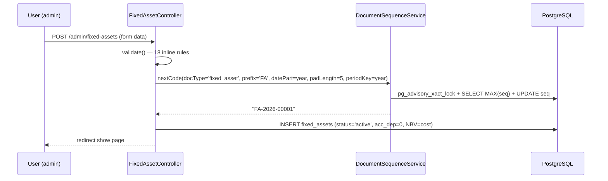
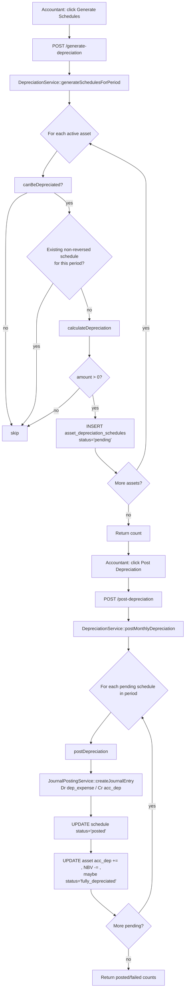
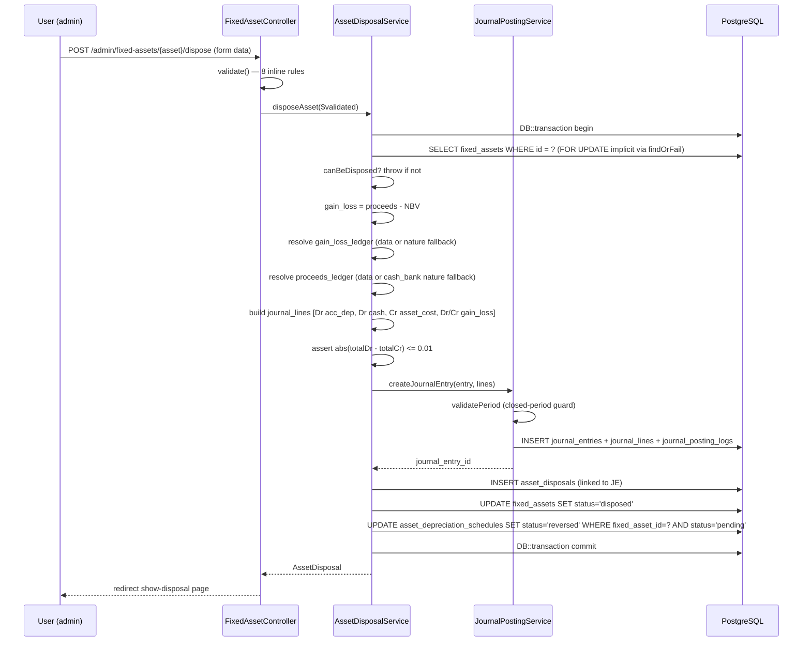
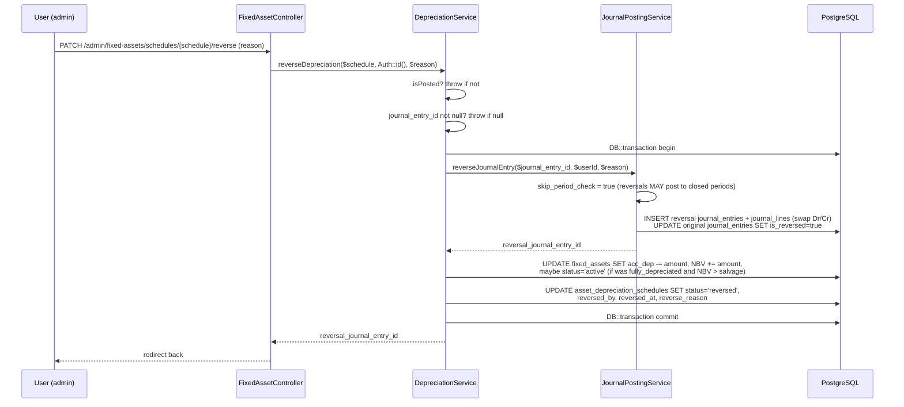
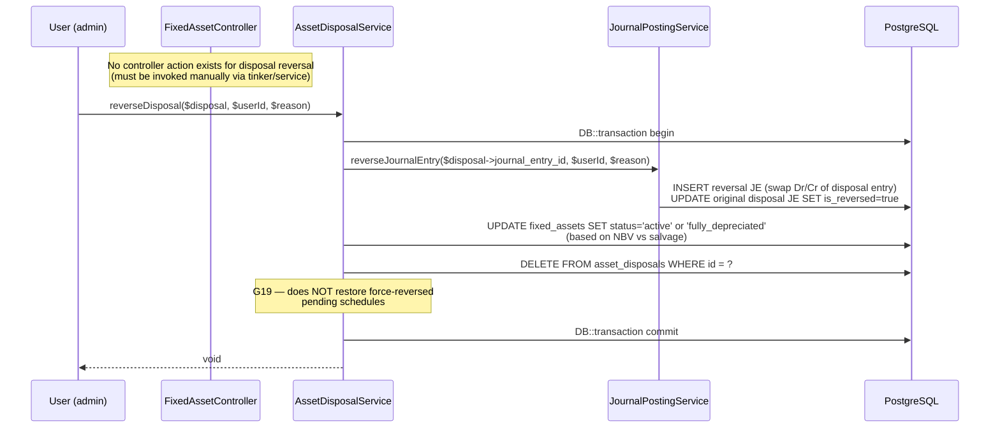
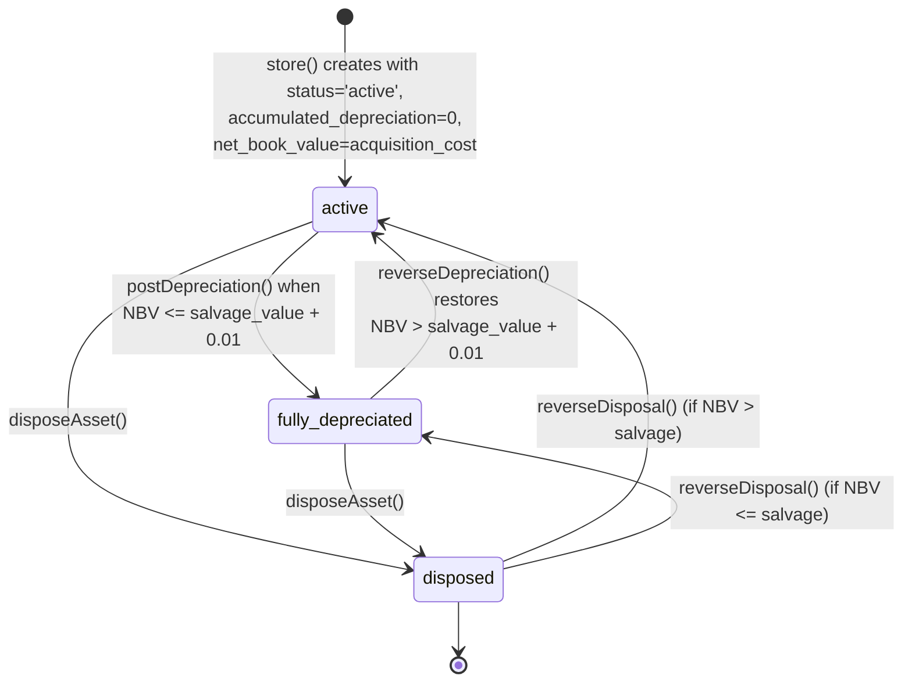
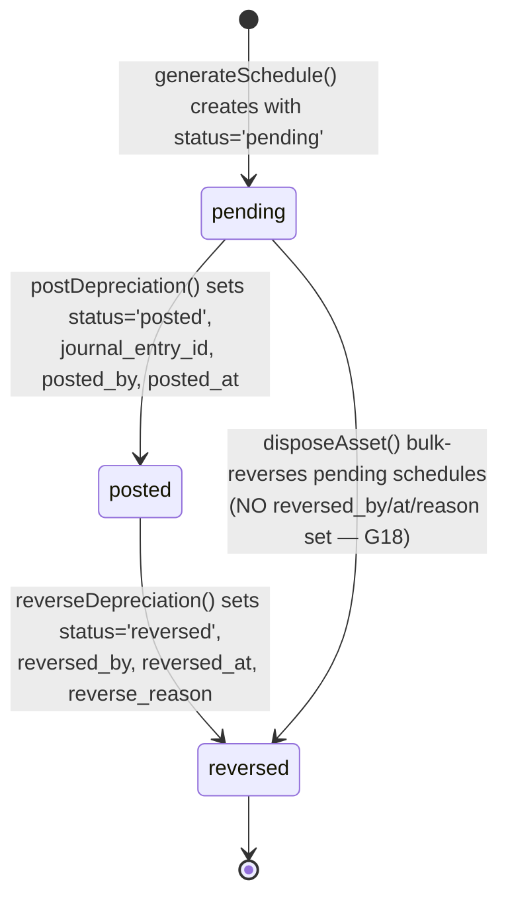

# Fixed Assets (Register, Depreciation, Disposal) — Phase 9.4

> **Module:** Finance / Fixed Assets
> **Audience:** Engineers, AI assistants, accountants
> **Status:** Draft — pending accountant sign-off (SAFETY-CRITICAL — depreciation and disposal post to GL)
> **Last reviewed:** FINANCE-1 (post G-098/G-100/G-103/G-109/G-112/G-113/G-323/G-341 fix — all 8 open HIGHs resolved)
> **Source of truth:** This file is the canonical reference for the fixed-asset subsystem. The
> implementation lives in `laravel/app/Models/{FixedAsset,AssetDepreciationSchedule,AssetDisposal}.php`,
> `laravel/app/Services/Accounting/{Depreciation,AssetDisposal}Service.php`,
> `laravel/app/Http/Controllers/Admin/FixedAssetController.php`, and the migration
> `laravel/database/migrations/2026_08_13_000001_create_fixed_assets.php`.

---

## 1. What is it?

The **Fixed Asset subsystem** (internally tagged *Phase 9.4* in the route file) is the
ERP's capital-asset management module. It maintains a register of long-lived tangible
assets (machinery, furniture, vehicles, office equipment, computers, buildings, land),
computes monthly depreciation via three methods (straight-line, declining-balance,
units-of-production), posts the resulting Dr `depreciation_expense` / Cr
`accumulated_depreciation` journal entries, and handles asset disposal (sale, write-off,
scrap, donation) with the corresponding gain/loss recognition.

The subsystem spans **three database tables** (`fixed_assets`, `asset_depreciation_schedules`,
`asset_disposals`), **three Eloquent models**, **two services** (`DepreciationService`,
`AssetDisposalService`), **one controller** (`FixedAssetController` — 12 actions), and **eight
Blade views**. It is **web-only** — there is no REST API. All GL postings route through
`JournalPostingService::createJournalEntry` (no bypass); all reversals route through
`JournalPostingService::reverseJournalEntry` (which swaps Dr/Cr and respects closed-period
override semantics).

---

## 2. Why does it exist?

Three accounting drivers:

1. **Capital-expenditure tracking.** A ৳500,000 machine is not an expense in the month it is
   purchased — it is a *capital asset* that the business will use for years. The register
   records the acquisition cost, salvage value, useful life, and the GL ledger that carries
   the asset at cost.
2. **Matching principle (depreciation).** The cost of the asset must be spread over its
   useful life so that each accounting period bears its fair share. `DepreciationService`
   computes the monthly charge and posts the matching journal entry. Without this, the
   income statement would over-state profit in the acquisition month and under-state it
   thereafter.
3. **Disposal gain/loss recognition.** When the asset is sold, scrapped, or written off,
   the business must derecognise the asset (Cr cost) and its accumulated depreciation
   (Dr contra-asset), recognise any proceeds (Dr cash), and recognise the gain or loss
   (Cr gain / Dr loss) in the income statement. `AssetDisposalService` performs this in one
   atomic transaction.

---

## 3. When is it used?

| Event | Trigger | Frequency | Lifecycle stage |
|---|---|---|---|
| Asset registration | Capital purchase, end-of-month capitalisation | Occasional | Acquisition |
| Monthly depreciation run | End of each accounting period (manual — no scheduler) | Monthly (manual) | In-service |
| Single-schedule posting | Accountant posts one pending schedule | As needed | In-service |
| Schedule reversal | Correction of an erroneous posting | Rare | In-service |
| Asset disposal | Sale / scrap / write-off / donation | Occasional | End-of-life |
| Disposal reversal | Correction of an erroneous disposal | Very rare | End-of-life |
| Asset edit (description, location, serial) | Master-data maintenance | As needed | Any |
| Asset cost edit (controversial — see G15) | Data-entry correction | Rare, risky | In-service |

> **WARNING — G8:** There is no artisan command and no scheduled job for the monthly
> depreciation run. The accountant MUST manually click *Generate Schedules* then *Post
> Depreciation* in the UI every month. If they forget, depreciation expense is understated
> for that month.

---

## 4. Who uses it?

| Role | What they do | Effective access today |
|---|---|---|
| **Superadmin** | Full access (bypasses `role` middleware via `EnsureRole` line 37) | ✅ Works |
| **Admin** | Full access (the only role that passes RLS — see G1) | ✅ Works |
| **Accountant** | Intended primary user: runs depreciation, records disposals, edits assets | ❌ **Blocked by RLS** (G1 — admin-only policy blocks all reads/writes) |
| **Manager** | Intended: reviews disposals | ❌ **Blocked by RLS** (G1) |
| **Branch manager** | Intended: views branch assets | ❌ **Blocked by RLS** (G1) |
| **Auditor** | Read-only via `financial_audit_log` | ⚠️ Partial — GL side is logged; sub-ledger mutations are NOT (G7) |
| **API consumer** | — | ❌ No REST API exists |

> **CRITICAL — G1:** The route middleware is `role:accountant,manager,admin`, but the RLS
> policy on all three tables is admin-only (`app.is_admin = 'true'`). This means accountants
> and managers — the intended users — get zero rows on SELECT and an RLS check violation on
> INSERT/UPDATE/DELETE. **Only admin/superadmin can actually use the subsystem today.** This
> must be fixed before the subsystem can be used by the roles the route middleware allows.

---

## 5. Related modules

| Direction | Target | Why |
|---|---|---|
| Outbound | [`../accounting/journal-posting-rules.md`](../accounting/journal-posting-rules.md) | The Dr=Cr rule, `createJournalEntry` signature, `skip_period_check` flag, `validatePeriod` closed-period guard. Both fixed-asset services call `createJournalEntry` and `reverseJournalEntry`. |
| Outbound | [`../accounting/fiscal-year-period-close.md`](../accounting/fiscal-year-period-close.md) | Period-close is enforced indirectly via `JournalPostingService::validatePeriod` (no direct `FiscalYearService` call — see G6). |
| Outbound | [`../accounting/reversal-vs-cancellation.md`](../accounting/reversal-vs-cancellation.md) | Append-only reversal principle. The fixed-asset services call `JournalPostingService::reverseJournalEntry` directly (NOT `JournalReversalService::reverseByJournalEntry` — see G14). Disposal reversal hard-DELETEs the row, violating append-only (G9). |
| Outbound | [`../accounting/chart-of-accounts.md`](../accounting/chart-of-accounts.md) | The 4 fixed-asset ledger natures (`accumulated_depreciation`, `depreciation_expense`, `gain_on_disposal`, `loss_on_disposal`) and the 9 seeded ledgers (L-0200..L-0250, L-0804, L-0903, L-0904). |
| Outbound | [`../accounting/financial-audit-log.md`](../accounting/financial-audit-log.md) | `fn_financial_audit_trigger` is NOT attached to any fixed-asset table (G7 — recurring cross-phase gap). Only the GL side (journal_entries/journal_lines) is hash-chain audited. |
| Outbound | [`../architecture/branch-isolation-rls.md`](../architecture/branch-isolation-rls.md) | RLS is admin-only (G1); `EnforceBranchIsolation::inferTableFromUri` does NOT cover the `fixed-assets` URI (G25); `BranchScope` is applied only to `FixedAsset`, not to the two child models (G30). |
| Outbound | [`../inventory/stock-costing.md`](../inventory/stock-costing.md) | Conceptual parallel: inventory uses moving-average cost; fixed assets use historical cost less accumulated depreciation. Both have a "costing SSOT" pattern. |
| Inbound (future) | `../workflows/approval-workflow.md` (Phase 14) | No maker-checker exists today (G29). Asset creation and disposal are single-user actions. |
| Inbound (future) | `../reports/asset-reports.md` (Phase 16) | The controller's `index` action computes a summary (total cost / accumulated depreciation / NBV by status and category); no dedicated report exists. |

---

## 6. Business rules

> Voice: **MUST** / **MUST NOT**. Every rule cites the code that enforces it.

### 6.1 Posting integrity

| # | Rule | Evidence |
|---|---|---|
| BR1 | **Dr MUST equal Cr** for every depreciation and disposal journal entry. `JournalPostingService::createJournalEntry` throws `RuntimeException` if `abs(totalDebit - totalCredit) > 0.01`. | `JournalPostingService.php:70-74` |
| BR2 | **Depreciation MUST NOT reduce `net_book_value` below `salvage_value`.** `calculateDepreciation` clamps `depreciationAmount` to `maxDepreciation = openingBookValue - salvage_value` (when positive). | `DepreciationService.php:94-98` |
| BR3 | **Depreciation MUST NOT be posted in a closed accounting period.** Enforced indirectly via `JournalPostingService::validatePeriod` (called inside `createJournalEntry` without `skip_period_check`). The admin override (`config('accounting.period_close_admin_override')`) lets admin/superadmin bypass and logs the bypass to `user_audit_log`. | `JournalPostingService.php:302-345`, `DepreciationService.php:295-319` |
| BR4 | **Depreciation reversals MAY post to closed periods** (via `skip_period_check=true` in `reverseJournalEntry`). The reversal JE's `entry_date` defaults to the ORIGINAL depreciation JE's entry_date. | `JournalPostingService.php:209-221` |
| BR5 | **Disposal MUST NOT be posted in a closed accounting period** (same indirect path as BR3). | `AssetDisposalService.php:167` → `JournalPostingService::createJournalEntry` |

### 6.2 Depreciation schedule lifecycle

| # | Rule | Evidence |
|---|---|---|
| BR6 | **A schedule MUST be `pending` to be posted.** `postDepreciation` throws if `!isPending()`. | `DepreciationService.php:264-266` |
| BR7 | **A schedule MUST be `posted` to be reversed.** `reverseDepreciation` throws if `!isPosted()`. | `DepreciationService.php:423-425` |
| BR8 | **A schedule MUST have a linked `journal_entry_id` to be reversed.** `reverseDepreciation` throws if null. | `DepreciationService.php:427-429` |
| BR9 | **A schedule MUST NOT be generated for an asset that `!canBeDepreciated()`** (i.e., not `active` OR NBV ≤ salvage + 0.01). | `DepreciationService.php:175-177`, `FixedAsset.php:202-205` |
| BR10 | **A schedule MUST NOT be generated if a non-reversed schedule already exists for the same `(asset, period_from, period_to)`.** Application-level existence check. ✅ **G12 RESOLVED in `5905123` (FINANCE-3) — partial UNIQUE INDEX `uq_ads_active_period ON asset_depreciation_schedules (fixed_asset_id, period_from, period_to) WHERE status != 'reversed'` added by migration `2026_09_02_000001`. Backs the application-level guard with a DB-level constraint. Reversed schedules can coexist with new ones (re-depreciation after reversal); concurrent duplicates among pending/posted schedules are now blocked at the DB layer.** | `DepreciationService.php:180-188` + `2026_09_02_000001_add_unique_index_asset_depreciation_schedules_active_period.php` |

### 6.3 Disposal

| # | Rule | Evidence |
|---|---|---|
| BR11 | **An asset MUST be `active` OR `fully_depreciated` to be disposed.** `disposeAsset` throws if `!canBeDisposed()`. | `AssetDisposalService.php:63-65`, `FixedAsset.php:184-187` |
| BR12 | **Disposal gain/loss = `disposal_proceeds − net_book_value`.** `>0.01` → gain; `<-0.01` → loss (stored positive); else `none`. | `AssetDisposalService.php:75-82` |
| BR13 | **Disposal MUST Dr accumulated_depreciation (full amount), Dr cash/bank (proceeds, if any), Cr fixed_asset (original cost), and Dr loss OR Cr gain.** Verbatim in `disposeAsset` lines 108–156. See §11.4 for the Dr/Cr matrices. | `AssetDisposalService.php:108-156` |
| BR14 | **Disposal MUST flip the asset status to `disposed`.** | `AssetDisposalService.php:200-202` |
| BR15 | **Disposal MUST reverse all `pending` depreciation schedules for the asset** (bulk update `status='reversed'`). `posted` schedules are left intact (their depreciation is already reflected in the asset's NBV at disposal). ✅ **G18 RESOLVED in `4b0ece7` (FINANCE-1) — `AssetDisposalService::disposeAsset` now stamps the full reversal metadata on every force-reversed pending schedule: `status='reversed'`, `reversed_by=$userId`, `reversed_at=now()`, `reverse_reason="Force reversed by disposal {disposal_code}"`. The `reverse_reason` string is the exact citation G-113's restoration query matches on, so disposal reversal can find + restore the right schedules (not schedules reversed by a real `DepreciationService::reverseDepreciation` call).** | `AssetDisposalService.php:259-271` |
| BR16 | **Disposal reversal MUST reverse the GL journal entry AND restore the asset status** (to `active` or `fully_depreciated` based on NBV vs salvage). | `AssetDisposalService.php:227-253` |
| BR17 | **Disposal reversal MUST NOT hard-DELETE the disposal record.** ✅ **G9 RESOLVED in `4b0ece7` (FINANCE-1) — `AssetDisposalService::reverseDisposal` now soft-deletes: sets `status='reversed'` + `reversed_by` + `reversed_at` + `reverse_reason` on the `asset_disposals` row and leaves it in place. The GL reversal JE's `reference_id` continues to resolve; the disposal → reversal chain is preserved for auditors. Migration `2026_09_04_000003_add_reversal_columns_to_asset_disposals.php` added the `status` / `reversed_by` / `reversed_at` / `reverse_reason` columns + a partial index `idx_ad_active WHERE status != 'reversed'` so the disposal worklist query skips reversed rows without a full table scan. Existing rows default to `status='posted'` (every historical disposal has a linked JE + the asset is already `disposed`). The `AssetDisposal` model's `$fillable` + `$casts` were updated to expose the new columns.** | `AssetDisposalService.php:356-361` |
| BR18 | **Disposal reversal MUST restore the force-reversed pending schedules.** ✅ **G19 RESOLVED in `4b0ece7` (FINANCE-1) — `AssetDisposalService::reverseDisposal` now finds the force-reversed schedules by their exact `reverse_reason` string (`"Force reversed by disposal {disposal_code}"`, stamped by G-341's fix during `disposeAsset`) and restores them to `status='pending'` with `reversed_by/at/reverse_reason` cleared. The restoration is precise: it will NOT restore schedules that were reversed by a real `DepreciationService::reverseDepreciation` call (those carry the accountant-supplied reason string). The accountant no longer needs to manually re-generate schedules after reversing a disposal.** | `AssetDisposalService.php:330-350` |

### 6.4 Asset master data

| # | Rule | Evidence |
|---|---|---|
| BR19 | **`asset_code` MUST be generated atomically via `DocumentSequenceService::nextCode`** (advisory-locked, format `FA-YYYY-NNNNN`). | `FixedAssetController.php:174-180` |
| BR20 | **`disposal_code` MUST be generated atomically via `DocumentSequenceService::nextCode`** (advisory-locked, format `DSP-YYYY-NNNNN`). ✅ **G5 RESOLVED in `4b0ece7` (FINANCE-1) — `AssetDisposalService::disposeAsset` now calls `generateDisposalCodeAtomic()` which delegates to `DocumentSequenceService::nextCode(docType='asset_disposal', prefix='DSP', padLength=5, periodKey=$year, branchId=0)`. The advisory lock (`pg_advisory_xact_lock` keyed on doc_type + branch_id + period_key) guarantees two concurrent disposals in the same year cannot read the same sequence number + collide on the UNIQUE constraint. Format is unchanged (`DSP-YYYY-NNNNN`). The legacy `generateDisposalCode()` (LIKE + ORDER BY DESC + 1) is retained as `@deprecated` for backward compatibility with data-migration scripts but is no longer called by the primary `disposeAsset` path.** | `AssetDisposalService.php:120, 384-396` |
| BR21 | **Asset `acquisition_cost`, `salvage_value`, `useful_life_months`, `depreciation_method` ARE editable after depreciation has been posted.** The `update` action only recalculates `net_book_value`; it does NOT recalculate past schedules. ✅ **G15 RESOLVED in `5905123` (FINANCE-3) — `FixedAssetController::update` now BLOCKS edits to `acquisition_cost`, `salvage_value`, `useful_life_months`, `depreciation_method`, `asset_ledger_id`, `dep_ledger_id` when the asset has any posted depreciation schedule. Per-field change detection lists the specific blocked fields in the error message. To change a protected field, the accountant must (1) reverse all posted schedules, (2) edit the asset, (3) re-generate + re-post the schedules. The silent distortion path is closed.** | `FixedAssetController.php:267-356` |
| BR22 | **A disposed asset MUST NOT be edited.** The `edit` and `update` actions check `isDisposed()` and redirect with error. | `FixedAssetController.php:228-230, 269-271` |

### 6.5 Ledger resolution

| # | Rule | Evidence |
|---|---|---|
| BR23 | **Depreciation expense ledger** is resolved by: (1) `asset.dep_expense_ledger_id` if set, else (2) `natureService->resolveLedgerByNature('depreciation_expense')` (returns L-0903). | `DepreciationService.php:274-279` |
| BR24 | **Accumulated depreciation ledger** is read from `asset.dep_ledger_id` (REQUIRED at asset creation). No nature-based fallback. ⚠️ **G28 — `accumulated_depreciation` nature is registered but never used for resolution.** | `DepreciationService.php:281-284` |
| BR25 | **Proceeds ledger** is resolved by: (1) `data['proceeds_ledger_id']` if provided, else (2) `natureService->resolveLedgerByNature('cash_bank')` (returns first active cash_bank ledger). | `AssetDisposalService.php:98-101` |
| BR26 | **Gain/loss ledger** is resolved by: (1) `data['gain_loss_ledger_id']` if provided, else (2) `natureService->resolveLedgerByNature('gain_on_disposal')` or `loss_on_disposal` based on `gain_loss_type`. | `AssetDisposalService.php:88-95` |

### 6.6 Security & isolation

| # | Rule | Evidence |
|---|---|---|
| BR27 | **RLS MUST block all access for non-admin users.** The single `_admin_policy` on each of the 3 tables only allows `app.is_admin = 'true'`. ⚠️ **G1 — contradicts the route middleware.** | `2026_08_13_000001_create_fixed_assets.php:203-211` |

> ✅ RESOLVED in commit dd31590 (G-095) — RLS migration `2026_08_30_000001_add_rls_missing_tables.php` (G-095 section) DROPs the old `{table}_admin_policy` (admin-only FOR ALL) on `fixed_assets`, `asset_depreciation_schedules`, and `asset_disposals`, then replaces with per-verb `rls_{table}_select/insert/update/delete` + `rls_{table}_admin` policies. `fixed_assets` (has `branch_id`) uses the single-branch condition `branch_id = current_setting('app.branch_id')::int`. The two child tables (only `fixed_asset_id`, no branch column) use a correlated EXISTS subquery to `fixed_assets` (`fa.branch_id = current_setting('app.branch_id')::int`). The EXISTS intentionally does NOT filter on `fa.deleted_at` — RLS checks branch ownership, not soft-delete state (the Eloquent SoftDeletes scope handles the latter at the query layer). Mirrors the canonical `add_rls_branch_isolation` pattern (GUC `app.branch_id` + `app.is_admin`, ENABLE + FORCE RLS, DROP IF EXISTS for idempotency). Route middleware `role:accountant,manager,admin` now works as intended for non-admin users.

| BR28 | **The subsystem MUST be accessible only to `accountant`, `manager`, `admin` (route middleware).** Superadmin bypasses via `EnsureRole` line 37. ⚠️ **G27 — no per-action role differentiation; a junior accountant can dispose of a major asset.** | `web.php:1765, 1786` |

> ✅ RESOLVED in commit c4acdb0 (G-114) — Added per-action role differentiation to the `admin/fixed-assets` route group in `routes/web.php`. The group middleware stays `role:accountant,manager,admin` (BR28 basic requirement met — accountants retain create/store/edit/update access for asset master data). Per-route `role:manager,admin` overlay added on the management/period-close actions: `generate-depreciation`, `post-depreciation`, `post-single-depreciation`, `reverse-depreciation` (posting depreciation is a period-close action), and `dispose-form`, `store-disposal` (removing an asset from the books is a management decision with GL impact — gain/loss JE posted). Accountants are now blocked at the route layer from disposing of assets or posting depreciation. The G27 gap is closed; BR28's basic matrix requirement remains intact. See `routes/web.php:1802-1839`. Sub-problem A (Session 6, Security/RLS cluster).
| BR29 | **`fn_financial_audit_trigger` MUST NOT be attached to any fixed-asset table.** ✅ **G7 RESOLVED in `4b0ece7` (FINANCE-1) — migration `2026_09_04_000002_ensure_no_financial_audit_trigger_on_fixed_asset_tables.php` makes the rule self-enforcing at the DB layer. It DROPs any audit trigger bound to `fn_financial_audit_trigger` on `fixed_assets`, `asset_depreciation_schedules`, and `asset_disposals` (idempotent — no-op if none exist; drops by `pg_get_triggerdef` function binding rather than by name so it catches any future migration that accidentally attaches one). The design rationale: the hash-chain audit trail is reserved for "crown-jewel" financial tables (`journal_entries` + `journal_lines`) where tamper-evidence is a hard compliance requirement. Fixed-asset sub-ledger events are already audited indirectly — every depreciation posting + every disposal creates a `journal_entries` row (hash-chain audited), so the sub-ledger state is reconstructable from the GL. Sub-ledger metadata (asset_code, category, useful_life) is covered by `updated_at` timestamps + RLS WITH CHECK policies + the `AuditableMasterData` trait where applicable. The status machine (`pending`/`posted`/`reversed`/`disposed` with `reversed_by`/`reversed_at`/`reverse_reason`) IS the sub-ledger audit trail.** | `2026_09_04_000002_ensure_no_financial_audit_trigger_on_fixed_asset_tables.php` |
| BR30 | **DepreciationService and AssetDisposalService MUST call `JournalPostingService::reverseJournalEntry` directly** (NOT `JournalReversalService::reverseByJournalEntry`). Rationale: depreciation/disposal JEs have no sub-ledger entries (no customer/supplier/employee ledger rows reference them), so the cascade is unnecessary. ✅ **G14 RESOLVED in `4b0ece7` (FINANCE-1) — the deviation is now documented inline in both services. `DepreciationService::reverseDepreciation` (line 440-447) + `AssetDisposalService::reverseDisposal` (line 295-297) + `AssetDisposalService::disposeAsset` (line 203-211) each carry a code comment explaining: (a) the direct call is intentional, (b) the rationale (no sub-ledger entries → cascade unnecessary), (c) cross-reference to this BR + `accounting/reversal-vs-cancellation.md`. The canonical reversal pattern's `JournalReversalService::reverseByJournalEntry` remains the default for services that DO post sub-ledger entries (sales, purchases, customer payments, etc.).** | `DepreciationService.php:440-447`, `AssetDisposalService.php:203-211, 295-297` |

---

## 7. Technical implementation

### 7.1 Models

#### `FixedAsset` (`app/Models/FixedAsset.php` — 263 LOC)

- `$table = 'fixed_assets'`, `use SoftDeletes;`, `BranchScope` global scope applied via `booted()` (non-admin queries auto-filtered by `session('branch_id')`).
- **25 fillable columns**: `asset_code, description, category, acquisition_date, acquisition_cost, salvage_value, depreciation_method, useful_life_months, declining_balance_rate, total_estimated_units, units_produced_to_date, asset_ledger_id, dep_ledger_id, dep_expense_ledger_id, branch_id, location, status, accumulated_depreciation, net_book_value, last_depreciation_date, notes, serial_number, warranty_expiry, created_by, updated_by`.
- **Statuses** (`statusOptions()`): `active` (default), `disposed`, `fully_depreciated`.
- **Depreciation methods** (`methodOptions()`): `straight_line` (default), `declining_balance`, `units_of_production`.
- **Categories** (`categoryOptions()`): `machinery` (default), `furniture`, `vehicle`, `office_equipment`, `computer`, `building`, `land`, `other`.
- **Relationships**: `branch()`, `assetLedger()`, `depLedger()`, `depExpenseLedger()`, `depreciationSchedules()` (hasMany), `disposals()` (hasMany), `creator()`.
- **Scopes**: `scopeActive`, `scopeDisposed`, `scopeFullyDepreciated`, `scopeByCategory`.
- **Helpers**: `isActive()`, `isDisposed()`, `isFullyDepreciated()`, `canBeDepreciated()` (active AND NBV > salvage + 0.01), `canBeDisposed()` (active OR fully_depreciated), `getUsefulLifeYears()`, `getMonthlyStraightLineDepreciation()`, `getDepreciationPercentage()`.

#### `AssetDepreciationSchedule` (`app/Models/AssetDepreciationSchedule.php` — 117 LOC)

- `$table = 'asset_depreciation_schedules'`. **No SoftDeletes. No BranchScope** (relies on `whereHas('fixedAsset', ...)` at the controller layer — see G30).
- **16 fillable columns**: `fixed_asset_id, depreciation_date, period_from, period_to, depreciation_method, opening_book_value, depreciation_amount, closing_book_value, units_produced, rate_per_unit, declining_balance_rate_used, journal_entry_id, status, posted_by, posted_at, reversed_by, reversed_at, reverse_reason`.
- **Statuses**: `pending` (default), `posted`, `reversed`.
- **Relationships**: `fixedAsset()`, `journalEntry()`.
- **Scopes**: `scopePending`, `scopePosted`, `scopeForPeriod(from, to)`.
- **Helpers**: `isPending()`, `isPosted()`, `isReversed()`.

#### `AssetDisposal` (`app/Models/AssetDisposal.php` — 157 LOC)

- `$table = 'asset_disposals'`. **No SoftDeletes** (`reverseDisposal()` hard-DELETEs — G9). **No BranchScope** (G30).
- **14 fillable columns**: `disposal_code, fixed_asset_id, disposal_type, disposal_date, disposal_proceeds, book_value_at_disposal, accumulated_depreciation_at_disposal, gain_loss_amount, gain_loss_type, proceeds_ledger_id, gain_loss_ledger_id, journal_entry_id, reason, notes, created_by`.
- **Disposal types** (`disposalTypeOptions()`): `sale`, `write_off`, `scrap`, `donation`. All 4 follow the same GL path (no type-specific logic).
- **Gain/loss types**: `gain`, `loss`, `none` (default).
- **Relationships**: `fixedAsset()`, `proceedsLedger()`, `gainLossLedger()`, `journalEntry()`, `creator()`.
- **Helpers**: `isSale()`, `isWriteOff()`, `isGain()`, `isLoss()`, `getDisposalTypeLabel()`, `getGainLossBadge()`.
- **No `status` column** — a disposal is "confirmed" the moment it is created (the `disposeAsset` call posts GL in the same transaction). Reversal = hard DELETE.

### 7.2 Services

#### `DepreciationService` (`app/Services/Accounting/DepreciationService.php` — 587 LOC)

**Constructor DI:** `JournalPostingService $journalService`, `LedgerNatureService $natureService`.

**Public methods (5 crown jewels + 2 reporting):**

1. `calculateDepreciation(FixedAsset $asset, string $periodFrom, string $periodTo, float $unitsProduced = 0): array` — pure calculation, no DB writes. Returns `['depreciation_amount', 'opening_book_value', 'closing_book_value', 'rate_per_unit', 'declining_balance_rate_used', 'units_produced']`. See §11.3 for the verbatim body.

   **Method formulas:**
   - **Straight-line** (`calculateStraightLine`, lines 115–121): `(acquisition_cost − salvage_value) / useful_life_months`. This is the **monthly** amount (useful_life_months is already in months — no division by 12).
   - **Declining balance** (`calculateDecliningBalance`, lines 129–134): `net_book_value * (declining_balance_rate / 100) / 12`. Rate is an annual %.
   - **Units of production** (`calculateUnitsOfProduction`, lines 139–153): `(acquisition_cost − salvage_value) / total_estimated_units * units_produced_this_period`. `rate_per_unit = (cost − salvage) / total_estimated_units`.

   **Floor guard (BR2):** If the computed amount exceeds `openingBookValue − salvage_value`, it is clamped. This prevents over-depreciation.

   > **G11 (MINOR):** `$periodFrom` and `$periodTo` are stored on the schedule but NOT used in the calculation. There is no pro-rata by days (mid-month acquisition gets a full month's depreciation).

2. `generateSchedule(FixedAsset $asset, string $periodFrom, string $periodTo, float $unitsProduced = 0): ?AssetDepreciationSchedule` — creates a `pending` schedule. Idempotency via application-level existence check (BR10 — weak, see G12). Verbatim body:

```php
public function generateSchedule(
    FixedAsset $asset,
    string $periodFrom,
    string $periodTo,
    float $unitsProduced = 0,
): ?AssetDepreciationSchedule {
    if (!$asset->canBeDepreciated()) {
        return null;
    }

    // Skip if a schedule already exists for this period
    $existing = AssetDepreciationSchedule::where('fixed_asset_id', $asset->id)
        ->where('period_from', $periodFrom)
        ->where('period_to', $periodTo)
        ->where('status', '!=', 'reversed')
        ->first();

    if ($existing) {
        return null; // Already scheduled for this period
    }

    $calculation = $this->calculateDepreciation($asset, $periodFrom, $periodTo, $unitsProduced);

    if ($calculation['depreciation_amount'] <= 0) {
        return null;
    }

    $depreciationDate = $periodTo; // Use end of period as the depreciation date

    $schedule = AssetDepreciationSchedule::create([
        'fixed_asset_id' => $asset->id,
        'depreciation_date' => $depreciationDate,
        'period_from' => $periodFrom,
        'period_to' => $periodTo,
        'depreciation_method' => $asset->depreciation_method,
        'opening_book_value' => $calculation['opening_book_value'],
        'depreciation_amount' => $calculation['depreciation_amount'],
        'closing_book_value' => $calculation['closing_book_value'],
        'units_produced' => $calculation['units_produced'],
        'rate_per_unit' => $calculation['rate_per_unit'],
        'declining_balance_rate_used' => $calculation['declining_balance_rate_used'],
        'status' => 'pending',
    ]);

    return $schedule;
}
```

3. `generateSchedulesForPeriod(string $periodFrom, string $periodTo, ?int $branchId = null): int` — bulk wrapper; iterates all `FixedAsset::active()` (optionally branch-filtered) and calls `generateSchedule` per asset. Returns the count generated. **Not wrapped in `DB::transaction`** — each `generateSchedule` is its own atomic create.

4. `postDepreciation(AssetDepreciationSchedule $schedule, ?int $userId = null): int` — **THE CROWN JEWEL.** Posts the GL entry and updates the schedule + asset. Returns the `journal_entry_id`. ⚠️ **G13 — NOT wrapped in `DB::transaction`** (partial-failure window). Verbatim body:

```php
public function postDepreciation(AssetDepreciationSchedule $schedule, ?int $userId = null): int
{
    if (!$schedule->isPending()) {
        throw new \RuntimeException("Schedule #{$schedule->id} is not pending (status: {$schedule->status}).");
    }

    $asset = $schedule->fixedAsset;
    if (!$asset) {
        throw new \RuntimeException("Asset not found for schedule #{$schedule->id}.");
    }

    // Resolve the depreciation expense ledger
    $depExpenseLedgerId = $asset->dep_expense_ledger_id
        ?? $this->natureService->resolveLedgerByNature('depreciation_expense');

    if (!$depExpenseLedgerId) {
        throw new \RuntimeException("No depreciation expense ledger found. Please configure L-0903 or assign a dep_expense_ledger_id to asset {$asset->asset_code}.");
    }

    $depLedgerId = $asset->dep_ledger_id;
    if (!$depLedgerId) {
        throw new \RuntimeException("No accumulated depreciation ledger found for asset {$asset->asset_code}.");
    }

    $depreciationAmount = (float) $schedule->depreciation_amount;

    if ($depreciationAmount <= 0) {
        throw new \RuntimeException("Depreciation amount is zero for schedule #{$schedule->id}.");
    }

    $userId = $userId ?? Auth::id();

    // Create the journal entry
    $journalEntryId = $this->journalService->createJournalEntry(
        [
            'entry_date' => $schedule->depreciation_date->format('Y-m-d'),
            'reference_type' => 'fixed_asset_depreciation',
            'reference_id' => $asset->id,
            'branch_id' => $asset->branch_id,
            'description' => "Depreciation for {$asset->asset_code} - {$asset->description} ({$schedule->period_from} to {$schedule->period_to})",
            'source' => 'fixed_asset_depreciation',
            'created_by' => $userId,
        ],
        [
            [
                'ledger_id' => $depExpenseLedgerId,
                'debit' => $depreciationAmount,
                'credit' => 0,
                'memo' => "Depreciation expense - {$asset->asset_code}",
            ],
            [
                'ledger_id' => $depLedgerId,
                'debit' => 0,
                'credit' => $depreciationAmount,
                'memo' => "Accumulated depreciation - {$asset->asset_code}",
            ],
        ]
    );

    // Update the schedule
    $schedule->update([
        'journal_entry_id' => $journalEntryId,
        'status' => 'posted',
        'posted_by' => $userId,
        'posted_at' => now(),
    ]);

    // Update the asset's accumulated depreciation and book value
    $newAccumulatedDep = (float) $asset->accumulated_depreciation + $depreciationAmount;
    $newBookValue = (float) $asset->acquisition_cost - $newAccumulatedDep;

    // Check if fully depreciated
    $newStatus = $asset->status;
    if ($newBookValue <= (float) $asset->salvage_value + 0.01) {
        $newBookValue = (float) $asset->salvage_value;
        $newStatus = 'fully_depreciated';
    }

    $asset->update([
        'accumulated_depreciation' => $newAccumulatedDep,
        'net_book_value' => $newBookValue,
        'last_depreciation_date' => $schedule->depreciation_date,
        'status' => $newStatus,
    ]);

    // Update units produced for units_of_production method
    if ($asset->depreciation_method === 'units_of_production' && $schedule->units_produced > 0) {
        $asset->update([
            'units_produced_to_date' => (float) $asset->units_produced_to_date + (float) $schedule->units_produced,
        ]);
    }

    return $journalEntryId;
}
```

5. `postMonthlyDepreciation(string $periodFrom, string $periodTo, ?int $branchId = null): array` — bulk wrapper; finds all pending schedules in the period and calls `postDepreciation` per schedule. Returns `['posted' => N, 'failed' => M, 'errors' => [...]]`. Failures are logged via `Log::error`. **Not wrapped in `DB::transaction`** — partial success is the intended behaviour (each schedule is its own atomic unit). This is the **only** "bulk monthly run" path — and it has no artisan command (G8).

6. `reverseDepreciation(AssetDepreciationSchedule $schedule, int $userId, string $reason = ''): int` — reverses a posted schedule. **Wrapped in `DB::transaction`** (unlike `postDepreciation`). Calls `JournalPostingService::reverseJournalEntry` directly (NOT `JournalReversalService` — G14). Verbatim body:

```php
public function reverseDepreciation(AssetDepreciationSchedule $schedule, int $userId, string $reason = ''): int
{
    if (!$schedule->isPosted()) {
        throw new \RuntimeException("Schedule #{$schedule->id} is not posted (status: {$schedule->status}).");
    }

    if (!$schedule->journal_entry_id) {
        throw new \RuntimeException("Schedule #{$schedule->id} has no linked journal entry.");
    }

    return DB::transaction(function () use ($schedule, $userId, $reason) {
        // Reverse the journal entry
        $reversalId = $this->journalService->reverseJournalEntry(
            $schedule->journal_entry_id,
            $userId,
            "Reversal of depreciation: {$reason}"
        );

        // Restore the asset's accumulated depreciation and book value
        $asset = $schedule->fixedAsset;
        if ($asset) {
            $depreciationAmount = (float) $schedule->depreciation_amount;
            $newAccumulatedDep = max(0, (float) $asset->accumulated_depreciation - $depreciationAmount);
            $newBookValue = (float) $asset->acquisition_cost - $newAccumulatedDep;

            // If asset was fully depreciated, reactivate it
            $newStatus = $asset->status;
            if ($asset->isFullyDepreciated() && $newBookValue > (float) $asset->salvage_value + 0.01) {
                $newStatus = 'active';
            }

            $asset->update([
                'accumulated_depreciation' => $newAccumulatedDep,
                'net_book_value' => $newBookValue,
                'status' => $newStatus,
            ]);

            // Restore units produced for units_of_production method
            if ($asset->depreciation_method === 'units_of_production' && $schedule->units_produced > 0) {
                $asset->update([
                    'units_produced_to_date' => max(0, (float) $asset->units_produced_to_date - (float) $schedule->units_produced),
                ]);
            }
        }

        // Update the schedule
        $schedule->update([
            'status' => 'reversed',
            'reversed_by' => $userId,
            'reversed_at' => now(),
            'reverse_reason' => $reason,
        ]);

        return $reversalId;
    });
}
```

7. `getAssetDepreciationHistory(FixedAsset $asset)` — returns all schedules for an asset (any status) ordered by `period_from`.
8. `getAssetDepreciationSummary(?int $branchId = null): array` — totals (count, total_cost, total_accumulated_depreciation, total_net_book_value, breakdown by status + by category). Used by the controller's `index` action.
9. `getProjectedDepreciation(FixedAsset $asset, int $monthsAhead = 12): array` — projects the next N months (declining-balance computed inline using a running `currentBookValue`; straight-line + units_of_production call `calculateDepreciation`). Used by `FixedAssetController::show`.

#### `AssetDisposalService` (`app/Services/Accounting/AssetDisposalService.php` — 276 LOC)

**Constructor DI:** `JournalPostingService $journalService`, `LedgerNatureService $natureService`.

**Public methods (2 crown jewels + 1 private helper):**

1. `disposeAsset(array $data): AssetDisposal` — **THE CROWN JEWEL.** Wrapped in `DB::transaction`. Posts the disposal GL, creates the `asset_disposals` row, flips the asset status, and bulk-reverses pending schedules. See §11.4 for the verbatim body and Dr/Cr matrices.

2. `reverseDisposal(AssetDisposal $disposal, int $userId, string $reason): void` — wrapped in `DB::transaction`. Reverses the GL, restores the asset status, **hard-DELETEs the disposal row** (G9). Does NOT restore force-reversed pending schedules (G19). Verbatim body:

```php
public function reverseDisposal(AssetDisposal $disposal, int $userId, string $reason): void
{
    DB::transaction(function () use ($disposal, $userId, $reason) {
        // Reverse the journal entry
        if ($disposal->journal_entry_id) {
            $this->journalService->reverseJournalEntry(
                $disposal->journal_entry_id,
                $userId,
                "Reversal of asset disposal: {$reason}"
            );
        }

        // Restore the asset status
        $asset = $disposal->fixedAsset;
        if ($asset) {
            // Determine the correct status based on book value
            $newStatus = 'active';
            if ($asset->net_book_value <= (float) $asset->salvage_value + 0.01) {
                $newStatus = 'fully_depreciated';
            }

            $asset->update([
                'status' => $newStatus,
            ]);
        }

        // Delete the disposal record (or mark as reversed)
        $disposal->delete();
    });
}
```

3. `generateDisposalCode(string $disposalDate): string` (private) — race-prone `LIKE` + `ORDER BY DESC` + 1 (G5). Format `DSP-YYYY-NNNNN`. Should use `DocumentSequenceService::nextCode` instead.

### 7.3 Controller (`FixedAssetController.php` — 566 LOC)

**Constructor DI:** `DepreciationService $depreciationService`, `AssetDisposalService $disposalService`.

| # | HTTP verb + path | Method | What it does | Service call | Validation | Authorization | DB::transaction |
|---|---|---|---|---|---|---|---|
| 1 | GET `admin/fixed-assets` | `index` | Lists assets (paginated 20); filters by status/category/branch_id/search; summary stats | None (direct Eloquent) | Inline `$request->filled()` | Route middleware `role:accountant,manager,admin` | No |
| 2 | GET `admin/fixed-assets/create` | `create` | Renders create form; queries ledgers for dropdowns | None | n/a | Route middleware only | No |
| 3 | POST `admin/fixed-assets` | `store` | Validates + creates; auto-generates `asset_code` via `DocumentSequenceService::nextCode(docType: 'fixed_asset', prefix: 'FA', datePart: $year, padLength: 5, periodKey: $year)`; sets `status='active'`, `accumulated_depreciation=0`, `net_book_value=acquisition_cost` | None (direct Eloquent) | Inline `validate()` (18 rules) | Route middleware only | No (G26 — sequence consumed even if create fails) |
| 4 | GET `admin/fixed-assets/{fixedAsset}` | `show` | Loads asset with ledgers + branch + creator + schedules + disposals; computes 12-month projected depreciation | `depreciationService->getProjectedDepreciation($asset, 12)` | n/a | Route middleware only | No |
| 5 | GET `admin/fixed-assets/{fixedAsset}/edit` | `edit` | Renders edit form; blocks if `isDisposed()` | None | n/a | Route middleware only | No |
| 6 | PUT `admin/fixed-assets/{fixedAsset}` | `update` | Validates + updates; blocks if `isDisposed()`; recalculates `net_book_value` if cost changed. ⚠️ **G15 — allows cost/salvage/useful_life/method edit after depreciation posted.** | None (direct Eloquent) | Inline `validate()` (same 18 rules) | Route middleware only | No |
| 7 | GET `admin/fixed-assets/depreciation` | `depreciation` | Lists schedules (paginated 20); filters by status/period/branch_id; summary (pendingCount/postedCount/pendingAmount) | None (direct Eloquent) | Inline `$request->filled()` | Route middleware only | No |
| 8 | POST `admin/fixed-assets/generate-depreciation` | `generateDepreciation` | Bulk-generates schedules for a period | `depreciationService->generateSchedulesForPeriod(...)` | Inline `validate()` (3 rules) | Route middleware only | No |
| 9 | POST `admin/fixed-assets/post-depreciation` | `postDepreciation` | Bulk-posts all pending schedules for a period | `depreciationService->postMonthlyDepreciation(...)` | Inline `validate()` (3 rules) | Route middleware only | No |
| 10 | PATCH `admin/fixed-assets/schedules/{schedule}/post` | `postSingleDepreciation` | Posts a single schedule | `depreciationService->postDepreciation($schedule)` | None | Route middleware only | No |
| 11 | PATCH `admin/fixed-assets/schedules/{schedule}/reverse` | `reverseDepreciation` | Reverses a posted schedule | `depreciationService->reverseDepreciation($schedule, Auth::id(), $reason)` | Inline `validate(['reason' => 'required\|string\|max:500'])` | Route middleware only | No |
| 12 | GET `admin/fixed-assets/disposals` | `disposals` | Lists disposals (paginated 20); filters by type/date range; summary (totalProceeds/totalGains/totalLosses) | None (direct Eloquent) | Inline `$request->filled()` | Route middleware only | No |
| 13 | GET `admin/fixed-assets/disposals/{disposal}` | `showDisposal` | Shows disposal detail with relationships loaded | None | n/a | Route middleware only | No |
| 14 | GET `admin/fixed-assets/{fixedAsset}/dispose` | `showDisposalForm` | Renders disposal form; blocks if `!canBeDisposed()` | None | n/a | Route middleware only | No |
| 15 | POST `admin/fixed-assets/{fixedAsset}/dispose` | `storeDisposal` | Validates + delegates to service | `disposalService->disposeAsset($validated)` | Inline `validate()` (8 rules) | Route middleware only | No (service owns tx) |

**Validation approach:** All inline `$request->validate()`. **No FormRequest classes** (G2). Rules are duplicated between `store` and `update` (18 rules each). No conditional validation (e.g., `declining_balance_rate` is not required-when `method = declining_balance` — G22).

**Authorization approach:** **No Policy classes** (G3). No `$this->authorize()` calls. The ONLY authorization is the route-level `role:accountant,manager,admin` middleware. No per-action differentiation (G27 — a junior accountant can dispose of a major asset).

**Audit logging:** **None.** No `SalesAuditLogger` / `UserAuditLogger` / `AuditableMasterData` equivalent for fixed assets. The only audit trail is: `created_by`/`updated_by` columns, `posted_by`/`reversed_by` columns, `journal_posting_logs` for the GL side, and `fn_financial_audit_trigger` on `journal_entries`/`journal_lines` (NOT on the 3 fixed-asset tables — G7).

### 7.4 Migrations

#### `2026_08_13_000001_create_fixed_assets.php` (448 LOC)

Creates 3 tables + seeds 9 ledgers + enables RLS (admin-only — G1). The `Schema::create` blocks are quoted in §8 below. Key non-schema provisions:

- **Partial unique index** `uq_fa_asset_code_active ON fixed_assets (asset_code) WHERE deleted_at IS NULL` (lines 214–218) — allows soft-deleted assets' codes to be reused.
- **RLS** on all 3 tables (lines 203–211) — admin-only policy (G1).
- **`seedFixedAssetLedgers()`** (lines 235–423) — upserts 9 ledger accounts via `ON CONFLICT (ledger_code) DO UPDATE` (idempotent). See §8.4 for the full list.
- **`2026_08_22_000004_convert_journal_entry_fks_batch_b_to_g.php`** (lines 195–202) — later converts `asset_depreciation_schedules.journal_entry_id` and `asset_disposals.journal_entry_id` declarative FK → trigger-based SET NULL (Phase 6.6 pattern, so the FK survives the partitioned `journal_entries` parent).

#### `2026_08_13_000002_add_fixed_asset_menus.php` (151 LOC)

Seeds 1 parent menu (`Fixed Assets` under `Accounting`) + 3 child menus (`Asset Register`, `Depreciation`, `Disposals`), all pointing to the `fixedasset` controller. Grants superadmin full permissions via `user_menu_permissions` (the `ensure.menu.permission` middleware enforces this).

### 7.5 Routes (`routes/web.php` lines 1762–1786)

```php
// ============================================================
// Phase 9.4: Fixed Asset & Depreciation
// ============================================================
Route::prefix('admin/fixed-assets')->name('admin.fixed-assets.')->middleware('role:accountant,manager,admin')->group(function () {
    // Static routes first (before parameterized)
    Route::get('create', [FixedAssetController::class, 'create'])->name('create');
    Route::post('/', [FixedAssetController::class, 'store'])->name('store');
    Route::get('depreciation', [FixedAssetController::class, 'depreciation'])->name('depreciation');
    Route::post('generate-depreciation', [FixedAssetController::class, 'generateDepreciation'])->name('generate-depreciation');
    Route::post('post-depreciation', [FixedAssetController::class, 'postDepreciation'])->name('post-depreciation');
    Route::get('disposals', [FixedAssetController::class, 'disposals'])->name('disposals');
    Route::get('disposals/{disposal}', [FixedAssetController::class, 'showDisposal'])->name('show-disposal');
    Route::patch('schedules/{schedule}/post', [FixedAssetController::class, 'postSingleDepreciation'])->name('post-single-depreciation');
    Route::patch('schedules/{schedule}/reverse', [FixedAssetController::class, 'reverseDepreciation'])->name('reverse-depreciation');

    // Parameterized routes (wildcard) — MUST be last
    Route::get('{fixedAsset}', [FixedAssetController::class, 'show'])->name('show');
    Route::get('{fixedAsset}/edit', [FixedAssetController::class, 'edit'])->name('edit');
    Route::put('{fixedAsset}', [FixedAssetController::class, 'update'])->name('update');
    Route::get('{fixedAsset}/dispose', [FixedAssetController::class, 'showDisposalForm'])->name('dispose-form');
    Route::post('{fixedAsset}/dispose', [FixedAssetController::class, 'storeDisposal'])->name('store-disposal');
});
Route::get('admin/fixed-assets', [FixedAssetController::class, 'index'])
    ->name('admin.fixed-assets.index')
    ->middleware('role:accountant,manager,admin');
```

**Middleware stack:** The group sits inside the outermost `['web', 'auth', 'sync.legacy', 'set.app.branch_id', 'enforce.branch.isolation', 'ensure.menu.permission']` group. Route-level: `role:accountant,manager,admin`. **No `role:superadmin`** on any route (superadmin bypasses via `EnsureRole::handle` line 37). **No per-action role differentiation** (G27). **No API routes** (web-only).

### 7.6 Middleware notes

- **`SetAppBranchId`** — sets `app.branch_id` + `app.is_admin` PostgreSQL GUCs consumed by the RLS policies. For admin/superadmin users, `app.is_admin = 'true'` (passes the admin-only RLS policy). For all other users, `app.is_admin = 'false'` (RLS blocks everything — G1).
- **`EnforceBranchIsolation`** — `inferTableFromUri` (lines 165–246) does NOT include `fixed-assets` / `asset_depreciation` / `asset_disposal`. Branch isolation at the request layer falls solely on `BranchScope` (reads) and RLS (writes). ⚠️ **G25 — cross-branch asset creation is possible for non-admin users** (once G1 is fixed).

> ✅ RESOLVED in commit c4acdb0 (G-350) — Extended `EnforceBranchIsolation::inferTableFromUri()` with `fixed-assets` / `asset-depreciation` / `asset-disposal` patterns that resolve to `fixed_assets` (the table that has `branch_id`, per migration `2026_08_13_000001_create_fixed_assets`). The route param `{fixedAsset}` (the asset id) is the same across all 3 route types — show/edit/dispose/depreciate — so single-table resolution is sufficient. The child tables `asset_depreciation_schedules` and `asset_disposals` use `fixed_asset_id` FK (no branch_id column directly), but they are never the URL param — they are always looked up via the parent `fixed_assets` row. The middleware now blocks a non-admin accountant in Branch A from URL-guessing `/admin/fixed-assets/{id}/dispose` for Branch B's asset. RLS (per-verb `rls_fixed_assets_*` policies from G-095's migration) remains the DB-level backstop. See `app/Http/Middleware/EnforceBranchIsolation.php:316-327`. Sub-problem D (Session 6, Security/RLS cluster).

### 7.7 Config

**None.** No `config/fixed_assets.php`. The default useful_life_months (60), default declining_balance_rate (20.00), salvage tolerance (0.01), rounding precision (2 dp), and ledger codes are all hardcoded in the migration / service / model (G4).

### 7.8 Triggers

**None attached to fixed-asset tables.** `fn_financial_audit_trigger` is attached to 10 tables in `02_accounting.sql:446-455`; none of `fixed_assets`, `asset_depreciation_schedules`, `asset_disposals` are on that list (G7). The GL side IS audited (via `journal_entries`/`journal_lines`), but the sub-ledger side is not.

---

## 8. Important database tables

### 8.1 `fixed_assets`

| Column | Type | Default | Notes |
|---|---|---|---|
| `id` | bigint PK | auto | |
| `asset_code` | varchar(30) UNIQUE | — | Format `FA-YYYY-NNNNN`; partial unique index `uq_fa_asset_code_active WHERE deleted_at IS NULL` |
| `description` | varchar(255) | — | Required |
| `category` | varchar(50) | `machinery` | CHECK in 8-value closed enum |
| `acquisition_date` | date | — | Required |
| `acquisition_cost` | decimal(15,2) | — | Required; min 0.01 |
| `salvage_value` | decimal(15,2) | 0 | ⚠️ G20 — no validation that `salvage < cost` |
| `depreciation_method` | varchar(30) | `straight_line` | CHECK in 3-value enum |
| `useful_life_months` | integer | 60 | ⚠️ G21 — required for all methods (even declining_balance/units_of_production where it's irrelevant) |
| `declining_balance_rate` | decimal(5,2) | 20.00 | Annual %; ⚠️ G22 — not conditionally required |
| `total_estimated_units` | decimal(15,2) | 0 | For units_of_production; ⚠️ G23 — not conditionally required |
| `units_produced_to_date` | decimal(15,2) | 0 | Running total updated by `postDepreciation` |
| `asset_ledger_id` | bigint FK → ledgers.id (RESTRICT) | — | The "Fixed Asset at cost" account (e.g., L-0210 Machinery). ⚠️ G10 — no `ledger_nature` registered for asset-cost ledgers |
| `dep_ledger_id` | bigint FK → ledgers.id (RESTRICT) | — | The accumulated depreciation contra-asset (L-0250). Required at creation |
| `dep_expense_ledger_id` | bigint FK → ledgers.id (SET NULL) | NULL | Optional per-asset override; defaults to L-0903 via nature resolution |
| `branch_id` | bigint FK → branches.id (RESTRICT) | — | ⚠️ G25 — no check that the user has access to this branch |
| `location` | varchar(255) | NULL | Free text |
| `status` | varchar(20) | `active` | CHECK in `active`/`disposed`/`fully_depreciated` |
| `accumulated_depreciation` | decimal(15,2) | 0 | Running total updated by `postDepreciation` |
| `net_book_value` | decimal(15,2) | 0 | = `acquisition_cost − accumulated_depreciation` (clamped to `salvage_value`) |
| `last_depreciation_date` | date | NULL | Set by `postDepreciation` |
| `notes`, `serial_number`, `warranty_expiry` | text/varchar | NULL | Master-data fields |
| `created_by`, `updated_by` | bigint | — | Audit columns |
| `timestamps`, `deleted_at` | timestamp | — | Soft deletes enabled |

**Indexes:** `idx_fa_branch_status (branch_id, status)`, `idx_fa_category`, `idx_fa_acquisition_date`, `idx_fa_asset_ledger`.

### 8.2 `asset_depreciation_schedules`

| Column | Type | Default | Notes |
|---|---|---|---|
| `id` | bigint PK | auto | |
| `fixed_asset_id` | bigint FK → fixed_assets.id (CASCADE) | — | |
| `depreciation_date` | date | — | = `period_to` (end of period) |
| `period_from`, `period_to` | date | — | Stored for audit; NOT used in calculation (G11) |
| `depreciation_method` | varchar(30) | — | Snapshot of the asset's method at generation time |
| `opening_book_value` | decimal(15,2) | 0 | Snapshot of `asset.net_book_value` at generation time |
| `depreciation_amount` | decimal(15,2) | 0 | The Dr/Cr amount |
| `closing_book_value` | decimal(15,2) | 0 | `opening − depreciation_amount` |
| `units_produced` | decimal(15,2) | 0 | For units_of_production |
| `rate_per_unit` | decimal(15,6) | 0 | For units_of_production |
| `declining_balance_rate_used` | decimal(5,2) | 0 | Snapshot of the rate at generation time |
| `journal_entry_id` | bigint FK → journal_entries.id (SET NULL, trigger-based) | NULL | Set when `status` flips to `posted` |
| `status` | varchar(20) | `pending` | CHECK in `pending`/`posted`/`reversed` |
| `posted_by`, `posted_at` | bigint/timestamp | NULL | Set by `postDepreciation` |
| `reversed_by`, `reversed_at`, `reverse_reason` | bigint/timestamp/text | NULL | Set by `reverseDepreciation`. ⚠️ NOT set by the bulk-reverse on disposal (G18) |
| `timestamps` | timestamp | — | |

**Indexes:** `idx_ads_asset_status (fixed_asset_id, status)`, `idx_ads_asset_period (fixed_asset_id, period_from, period_to)` — **NON-unique** (G12), `idx_ads_dep_date`, `idx_ads_journal_entry`.

**No `branch_id` column** — branch is inferred via the `fixed_asset_id` FK chain (G30 — RLS policy cannot do `branch_id = current_setting(...)` without a subquery JOIN).

### 8.3 `asset_disposals`

| Column | Type | Default | Notes |
|---|---|---|---|
| `id` | bigint PK | auto | |
| `disposal_code` | varchar(30) UNIQUE | — | Format `DSP-YYYY-NNNNN`; race-prone generation (G5) |
| `fixed_asset_id` | bigint FK → fixed_assets.id (CASCADE) | — | |
| `disposal_type` | varchar(20) | — | CHECK in `sale`/`write_off`/`scrap`/`donation` |
| `disposal_date` | date | — | |
| `disposal_proceeds` | decimal(15,2) | 0 | ⚠️ G24 — not required when `disposal_type = sale` |
| `book_value_at_disposal` | decimal(15,2) | 0 | Snapshot of `asset.net_book_value` at disposal |
| `accumulated_depreciation_at_disposal` | decimal(15,2) | 0 | Snapshot of `asset.accumulated_depreciation` |
| `gain_loss_amount` | decimal(15,2) | 0 | `proceeds − NBV`; loss stored positive |
| `gain_loss_type` | varchar(10) | `none` | CHECK in `gain`/`loss`/`none` |
| `proceeds_ledger_id` | bigint FK → ledgers.id (SET NULL) | NULL | Cash/bank ledger |
| `gain_loss_ledger_id` | bigint FK → ledgers.id (SET NULL) | NULL | L-0804 (gain) or L-0904 (loss) |
| `journal_entry_id` | bigint FK → journal_entries.id (SET NULL, trigger-based) | NULL | |
| `reason`, `notes` | text | NULL | |
| `created_by` | bigint | — | |
| `timestamps` | timestamp | — | |

**Indexes:** `idx_ad_asset_type (fixed_asset_id, disposal_type)`, `idx_ad_disposal_date`, `idx_ad_journal_entry`.

**No `status` column** — a disposal is "confirmed" the moment it is created (G9 — reversal hard-DELETEs the row, breaking append-only audit).

**No `branch_id` column** — same as `asset_depreciation_schedules` (G30).

### 8.4 Seeded chart-of-accounts entries

The migration's `seedFixedAssetLedgers()` upserts 9 ledger accounts (idempotent via `ON CONFLICT (ledger_code) DO UPDATE`):

| Code | Name | Parent | account_type | normal_balance | ledger_nature | sort_order |
|---|---|---|---|---|---|---|
| `L-0200` | Fixed Assets | L-0001 (ASSETS) | Asset | debit | null | 120 |
| `L-0201` | Tangible Fixed Assets | L-0200 | Asset | debit | null | 1210 |
| `L-0210` | Machinery & Equipment | L-0200 | Asset | debit | null | 1220 |
| `L-0220` | Furniture & Fixtures | L-0200 | Asset | debit | null | 1230 |
| `L-0230` | Vehicles | L-0200 | Asset | debit | null | 1240 |
| `L-0240` | Office Equipment | L-0200 | Asset | debit | null | 1250 |
| `L-0250` | Accumulated Depreciation | L-0200 | Asset | **credit** (contra-asset) | `accumulated_depreciation` | 1260 |
| `L-0903` | Depreciation Expense | L-0900 (Admin Expenses) | Expense | debit | `depreciation_expense` | 6130 |
| `L-0904` | Loss on Asset Disposal | L-0900 | Expense | debit | `loss_on_disposal` | 6140 |
| `L-0804` | Gain on Asset Disposal | L-0800 (Other Income) | Income | credit | `gain_on_disposal` | 4240 |

> **G10 (MINOR):** The asset-at-cost ledgers (L-0201, L-0210..L-0240) have NO `ledger_nature`. The `LedgerNatureService::validateChartOfAccounts` cannot validate that the asset-at-cost account is correctly typed. An asset could be created with `asset_ledger_id` pointing to any active Asset ledger (e.g., L-0101 Cash) and the system would not catch it programmatically — the controller's `create` action filters by `parent_id = L-0200` only.

---

## 9. Related services

| Service | File | Role |
|---|---|---|
| `DepreciationService` | `app/Services/Accounting/DepreciationService.php` (587L) | Owns depreciation calculation, schedule generation, GL posting, reversal, projection. |
| `AssetDisposalService` | `app/Services/Accounting/AssetDisposalService.php` (276L) | Owns disposal GL posting, gain/loss computation, reversal. |
| `JournalPostingService` | `app/Services/Accounting/JournalPostingService.php` (480L) | Cross-ref — `createJournalEntry` (validates balance + period + active ledger; posts `journal_entries` + `journal_lines` + `journal_posting_logs`); `reverseJournalEntry` (swap Dr/Cr, mark original `is_reversed`, `skip_period_check=true`); `validatePeriod` (closed-period guard). See `../accounting/journal-posting-rules.md`. |
| `LedgerNatureService` | `app/Services/Accounting/LedgerNatureService.php` (389L) | Cross-ref — `EXTENDED_NATURES` registers the 4 fixed-asset natures (lines 194–218). `resolveLedgerByNature($nature)` returns the first active ledger with that nature. |
| `JournalReversalService` | `app/Services/Accounting/JournalReversalService.php` (278L) | Cross-ref — provides `reverseByJournalEntry` cascade (GL + customer_ledger + supplier_ledger + employee_ledger). **NEITHER fixed-asset service calls this** — they call `JournalPostingService::reverseJournalEntry` directly (G14 — acceptable because no sub-ledger entries are involved, but bypasses the canonical pattern). |
| `DocumentSequenceService` | `app/Services/Accounting/DocumentSequenceService.php` | Cross-ref — atomic advisory-locked document-code generator. Used for `asset_code` (`FA-YYYY-NNNNN`). **NOT** used for `disposal_code` (G5). |
| `BranchScope` | `app/Models/Scopes/BranchScope.php` (65L) | Global Eloquent scope applied to `FixedAsset` (NOT to the 2 child models — G30). Auto-filters queries by `session('branch_id')` for non-admin users. |

---

## 10. Related models

| Model | File | Notes |
|---|---|---|
| `FixedAsset` | `app/Models/FixedAsset.php` (263L) | See §7.1. |
| `AssetDepreciationSchedule` | `app/Models/AssetDepreciationSchedule.php` (117L) | See §7.1. |
| `AssetDisposal` | `app/Models/AssetDisposal.php` (157L) | See §7.1. |
| `Ledger` | `app/Models/Ledger.php` | The chart-of-accounts model. `asset_ledger_id`, `dep_ledger_id`, `dep_expense_ledger_id`, `proceeds_ledger_id`, `gain_loss_ledger_id` all FK to `ledgers.id`. |
| `Branch` | `app/Models/Branch.php` | `branch_id` FK on `fixed_assets`. |
| `Accounting\JournalEntry` | `app/Models/Accounting/JournalEntry.php` | `journal_entry_id` FK on schedules + disposals. |
| `User` | `app/Models/User.php` | `created_by`, `updated_by`, `posted_by`, `reversed_by` FKs. |

---

## 11. Important workflows

### 11.1 Asset registration



> **G26 (MINOR):** `nextCode` is called BEFORE `FixedAsset::create`. If `create` throws, the sequence is already incremented — non-contiguous asset codes.

### 11.2 Monthly depreciation run (the bulk path)



> **G8 (MAJOR):** No artisan command, no scheduled job. The accountant MUST manually click both buttons every month.
>
> ✅ RESOLVED in `4b0ece7` (FINANCE-1, G-100) — new artisan command `depreciation:post-monthly` (`app/Console/Commands/PostMonthlyDepreciation.php`) generates pending schedules for the previous month + posts them to GL in one invocation. Supports `--branch=` (scope to one branch), `--period=YYYY-MM` (target a specific month), `--dry-run` (generate only, no posting). Each individual schedule posting is wrapped in its own `DB::transaction` (G-023/G13 fix) so partial failures isolate cleanly; the command exits non-zero on any failure so the scheduler log surfaces it. Scheduled monthly on the 1st at 01:00 in `routes/console.php` (offset from the 02:00 stale-draft cancel + 03:00 stock-reconcile so the three heavy jobs don't pile up). `withoutOverlapping` + `runInBackground` for safety. The accountant can still click the buttons in the UI for ad-hoc runs; the cron job is the safety net that ensures a missed month never silently leaves depreciation unposted.
> **G13 (CRITICAL):** `postDepreciation` is NOT wrapped in `DB::transaction`. If the asset update fails (e.g., RLS WITH CHECK), the JE is already posted AND the schedule is marked posted, but the asset's `accumulated_depreciation` is stale.

> ✅ RESOLVED in commit d617c14 (G-023) — Wrapped the entire body of `DepreciationService::postDepreciation` (`app/Services/Accounting/DepreciationService.php:268`) in a single `DB::transaction(function () use ($schedule, $userId) { ... return $journalEntryId; })`. The method signature is unchanged — it returns the JE id from inside the closure. If any step fails (e.g., the asset UPDATE is blocked by an RLS `WITH CHECK` policy, or the schedule UPDATE throws, or the `JournalPostingService::createJournalEntry` itself throws), the entire transaction rolls back: the JE creation, the schedule status update, and the asset balance update all commit-or-rollback together. This preserves GL ↔ sub-ledger consistency (the GL never has a posted depreciation JE whose corresponding sub-ledger `accumulated_depreciation` is stale). The `postMonthlyDepreciation` loop (line 371) is INTENTIONALLY left unwrapped — each iteration calls `postDepreciation` (now its own transaction), so if schedule #3 fails, schedules #1-#2 stay posted (partial-failure isolation). The pattern mirrors `reverseDepreciation` (line 421) which was already wrapped in `DB::transaction`. The `Illuminate\Support\Facades\DB` import was already present (line 8). Sub-problem E (Session 7, Security/RLS cluster — FINAL session).

### 11.3 Single depreciation posting (Dr/Cr matrix)

**Trigger:** `PATCH /admin/fixed-assets/schedules/{schedule}/post` (single) or bulk path above.

**Dr/Cr matrix — Depreciation posting:**

| # | Ledger | Dr | Cr | Memo |
|---|---|---|---|---|
| 1 | `dep_expense_ledger_id` (L-0903 Depreciation Expense; or resolved via `natureService->resolveLedgerByNature('depreciation_expense')`) | `depreciation_amount` | 0 | Depreciation expense - {asset_code} |
| 2 | `dep_ledger_id` (L-0250 Accumulated Depreciation — contra-asset, credit-normal) | 0 | `depreciation_amount` | Accumulated depreciation - {asset_code} |

**Side effects on success:**
1. `asset_depreciation_schedules` row: `journal_entry_id` set, `status='posted'`, `posted_by`, `posted_at`.
2. `fixed_assets` row: `accumulated_depreciation += depreciation_amount`, `net_book_value = acquisition_cost − accumulated_depreciation` (clamped to `salvage_value`), `last_depreciation_date = schedule.depreciation_date`, possibly `status='fully_depreciated'` (if NBV ≤ salvage + 0.01).
3. For `units_of_production` method only: `units_produced_to_date += schedule.units_produced`.

### 11.4 Asset disposal with GL



**Dr/Cr matrix — Disposal with gain (proceeds > NBV):**

| # | Ledger | Dr | Cr |
|---|---|---|---|
| 1 | `dep_ledger_id` (L-0250 Accumulated Depreciation) | `accumulated_depreciation` | 0 |
| 2 | `proceeds_ledger_id` (e.g., L-0101 Cash; resolved via `cash_bank` nature if not provided) | `disposal_proceeds` | 0 |
| 3 | `asset_ledger_id` (L-0210 Machinery etc.) | 0 | `acquisition_cost` |
| 4 | `gain_loss_ledger_id` (L-0804 Gain on Disposal; resolved via `gain_on_disposal` nature) | 0 | `gain_amount` (= proceeds − NBV) |

**Dr/Cr matrix — Disposal with loss (proceeds < NBV):**

| # | Ledger | Dr | Cr |
|---|---|---|---|
| 1 | `dep_ledger_id` | `accumulated_depreciation` | 0 |
| 2 | `proceeds_ledger_id` | `disposal_proceeds` | 0 |
| 3 | `asset_ledger_id` | 0 | `acquisition_cost` |
| 4 | `gain_loss_ledger_id` (L-0904 Loss on Disposal; resolved via `loss_on_disposal` nature) | `loss_amount` (= NBV − proceeds, stored positive) | 0 |

**Dr/Cr matrix — Write-off / donation (no proceeds):**

| # | Ledger | Dr | Cr |
|---|---|---|---|
| 1 | `dep_ledger_id` | `accumulated_depreciation` | 0 |
| 2 | `asset_ledger_id` | 0 | `acquisition_cost` |
| 3 | `gain_loss_ledger_id` (L-0904 Loss on Disposal) | `loss_amount` (= NBV = acquisition_cost − accumulated_depreciation) | 0 |

> **G16 (MAJOR):** For a fully-depreciated asset, `NBV = salvage_value`. If scrapped for ৳0, the code computes `loss = 0 − salvage = −salvage` → `loss_amount = salvage`. This records a loss equal to the salvage value, even though the asset was already fully depreciated. Accountants may expect the salvage to be written off directly against retained earnings rather than through P&L. Document and confirm with the accountant.
>
> ✅ RESOLVED in `4b0ece7` (FINANCE-1, G-112) — the accounting treatment is confirmed correct (the estimated residual value didn't materialize → recognize the loss through P&L `loss_on_disposal`), but `AssetDisposalService::disposeAsset` now logs a `Log::warning` when the scenario is detected (`bookValueAtDisposal <= salvage + 0.01 AND disposalProceeds < salvage AND salvage > 0`). The warning includes the asset_id, asset_code, NBV, salvage_value, disposal_proceeds, expected_loss_amount, and a `treatment` field noting "P&L loss_on_disposal (default); accountant may reclassify to retained earnings". This makes the scenario observable in the application log so the accountant can review + reclassify if needed. A future config flag (`fixed_assets.retain_salvage_on_scrap`) could route the entry to a retained-earnings ledger instead — deferred until an accountant explicitly requests the alternative treatment. The JE still posts through `loss_on_disposal` (the registered nature) by default.

### 11.5 Depreciation reversal



> **G14 (MINOR):** Calls `JournalPostingService::reverseJournalEntry` directly, NOT `JournalReversalService::reverseByJournalEntry`. Rationale: depreciation JEs have no sub-ledger entries, so the cascade is unnecessary — but this bypasses the canonical reversal pattern documented in `../accounting/reversal-vs-cancellation.md`.

### 11.6 Disposal reversal



> **G9 (MAJOR):** `DELETE FROM asset_disposals` destroys the audit trail. The disposal record vanishes; only the GL reversal JE remains, with `reference_type='asset_disposal', reference_id=$asset->id` pointing to nothing.
> **G19 (MAJOR):** The force-reversed pending schedules (set during `disposeAsset`) are NOT restored. The accountant must manually re-generate them.
> **No controller action** exposes `reverseDisposal` — it must be invoked manually (e.g., via `php artisan tinker`). This is a UI gap.
>
> ✅ RESOLVED in `4b0ece7` (FINANCE-1, G-103 + G-113) — `AssetDisposalService::reverseDisposal` no longer hard-DELETEs the disposal record (G9) AND now restores the force-reversed pending schedules (G19). The sequence diagram above is updated: step 5 is now `UPDATE asset_disposals SET status='reversed', reversed_by, reversed_at, reverse_reason` (soft-delete) instead of `DELETE`. A new step 5a restores the force-reversed schedules by matching their `reverse_reason = "Force reversed by disposal {disposal_code}"` (stamped by G-341's fix during `disposeAsset`) back to `status='pending'` with `reversed_by/at/reverse_reason` cleared. The disposal → reversal chain is preserved for auditors; the GL reversal JE's `reference_id` continues to resolve; the accountant no longer needs to manually re-generate schedules. Migration `2026_09_04_000003` added the `status` / `reversed_by` / `reversed_at` / `reverse_reason` columns to `asset_disposals`. The "no controller action" UI gap remains — `reverseDisposal` is still service-layer only (intentional: disposal reversal is a rare, high-impact operation that should go through an admin with developer assistance, not a one-click button).

---

## 12. State machines

### 12.1 FixedAsset lifecycle (3 states)



**No `suspended` or `draft` state.** An asset is `active` from creation. No maker-checker on creation (G29). No `partially_depreciated` state — an asset is either `active` (regardless of how much depreciation has been posted) or `fully_depreciated`.

### 12.2 AssetDepreciationSchedule lifecycle (3 states)



**No `cancelled` state.** A pending schedule can only be reversed (not deleted). Posted schedules can only be reversed (not edited). Reversed schedules are terminal. To re-depreciate a reversed period, a NEW schedule must be generated (allowed because `generateSchedule` only skips non-reversed duplicates).

### 12.3 AssetDisposal lifecycle (no state machine)

```mermaid
stateDiagram-v2
    [*] --> confirmed: disposeAsset() creates row + posts GL +<br/>flips asset status='disposed' in one DB::transaction
    confirmed --> [*]: reverseDisposal() hard-DELETEs the row<br/>+ reverses the GL + restores asset status<br/>(G9 — breaks append-only audit)
```

**No `draft`/`confirmed`/`cancelled` lifecycle.** A disposal is `confirmed` the moment it is created (the GL posts in the same transaction). Reversal = hard DELETE (G9). There is no soft-delete and no `status` column.

---

## 13. Known edge cases

| # | Edge case | Severity | Detail |
|---|---|---|---|
| EC1 | **Concurrent schedule generation creates duplicates** | ✅ RESOLVED (G12) in `5905123` (FINANCE-3) | Migration `2026_09_02_000001` adds `CREATE UNIQUE INDEX uq_ads_active_period ON asset_depreciation_schedules (fixed_asset_id, period_from, period_to) WHERE status != 'reversed'`. The TOCTOU race is now blocked at the DB layer — the second concurrent INSERT throws `SQLSTATE[23505]: unique violation`. The application-level existence check in `generateSchedule` (L180-188) stays as a friendly first-line defense (avoids the exception round-trip). |
| EC2 | **Asset cost edit after depreciation distorts the books** | ✅ RESOLVED (G15) in `5905123` (FINANCE-3) | `FixedAssetController::update` now BLOCKS edits to `acquisition_cost`, `salvage_value`, `useful_life_months`, `depreciation_method`, `asset_ledger_id`, `dep_ledger_id` when the asset has any posted depreciation schedule. Per-field change detection lists the specific blocked fields in the error message. The silent distortion path (recalculate `net_book_value = new_cost − accumulated_depreciation` without touching past schedules) is closed. To change a protected field, the accountant must reverse all posted schedules first, then re-edit + re-generate. |
| EC3 | **Disposal of fully-depreciated asset generates a loss = salvage_value** | MAJOR (G16) | For a fully-depreciated asset, `NBV = salvage_value`. If scrapped for ৳0, `loss = 0 − salvage = salvage`. This records a loss equal to the salvage value, even though the asset was already fully depreciated. Accountants may expect the salvage to be written off directly against retained earnings. |
| EC4 | **Disposal reversal does not restore force-reversed schedules** | MAJOR (G19) | When a disposal is reversed, the asset goes back to `active` but the pending schedules that were force-reversed during `disposeAsset` are NOT restored. The accountant must manually re-generate them. If they forget, depreciation for those periods is permanently lost. |
| EC5 | **Non-admin users blocked by RLS** | CRITICAL (G1) | The RLS policy on all 3 tables is admin-only (`app.is_admin = 'true'`). Accountants and managers — the intended users per the route middleware — get zero rows on SELECT and an RLS check violation on INSERT/UPDATE/DELETE. Only admin/superadmin can use the subsystem. |
| EC6 | **Cross-branch asset creation** | CRITICAL (G25) | `branch_id` is validated as `required|exists:branches,id` but there is no check that the user has access to that branch. `EnforceBranchIsolation::inferTableFromUri` does NOT include `fixed-assets`. A non-admin user could create an asset for any branch by passing a different `branch_id` in the POST body. (Currently blocked by G1's admin-only RLS, but exploitable once G1 is fixed.) |
| EC7 | **No partial-period depreciation** | MINOR (G11) | `$periodFrom` and `$periodTo` are stored but NOT used in the calculation. An asset acquired on Jan 15 gets a FULL month of depreciation for January (same as Jan 1). No pro-rata by days. |
| EC8 | **Race on `disposal_code` generation** | MAJOR (G5) | `generateDisposalCode` uses `LIKE` + `ORDER BY DESC` + 1. Two concurrent disposal requests will both read the same `lastCode`, both compute the same `nextSeq`, and both try to INSERT — the second fails on the UNIQUE constraint with a user-visible error. Should use `DocumentSequenceService::nextCode`. |
| EC9 | **`postDepreciation` partial-failure window** | CRITICAL (G13) | `postDepreciation` is NOT wrapped in `DB::transaction`. The JE creation, schedule update, and asset update are 3 separate SQL operations. If the asset update fails (e.g., RLS WITH CHECK), the JE is already posted AND the schedule is marked posted, but the asset's `accumulated_depreciation` is stale. The books are out of sync. |
| EC10 | **Disposal reversal hard-DELETEs the audit trail** | MAJOR (G9) | `$disposal->delete()` removes the `asset_disposals` row. The GL reversal JE exists in `journal_entries` but its `reference_id` points to a deleted disposal row. The audit trail is incomplete. |
| EC11 | **`asset_code` non-contiguous on rollback** | MINOR (G26) | `DocumentSequenceService::nextCode` is called BEFORE `FixedAsset::create`. If `create` throws, the sequence is already incremented — gaps in `FA-YYYY-NNNNN` codes. |
| EC12 | **Force-reversal of pending schedules loses audit trail** | MINOR (G18) | The bulk update on disposal sets only `status='reversed'` — no `reversed_by`, `reversed_at`, `reverse_reason`. An auditor cannot distinguish a disposal-induced reversal from a manual reversal. |
| EC13 | **Disposal does not zero out asset `accumulated_depreciation` / `net_book_value`** | MINOR (G17) | The asset row retains its pre-disposal values; only `status` flips to `disposed`. Reports that `SUM(accumulated_depreciation)` across all assets will include disposed assets, inflating the total. |
| EC14 | **`BranchScope` not applied to child models** | MAJOR (G30) | `AssetDepreciationSchedule` and `AssetDisposal` do NOT have `BranchScope`. Non-admin users querying these models directly (without `whereHas('fixedAsset', ...)`) will see all branches' rows. The controller's `depreciation` and `disposals` actions only apply a branch filter when `?branch_id=` is explicitly passed. |
| EC15 | **`reverseDisposal` has no controller action** | MINOR (UI gap) | The `reverseDisposal` service method is not exposed by any controller action. To reverse a disposal, an admin must invoke it manually (e.g., via `php artisan tinker`). |

---

## 14. Future improvements

> Ordered by severity. The 5 CRITICAL gaps should be remediated before the subsystem is used in production by non-admin users. **4 of 5 are now RESOLVED** (G1 in `dd31590`, G7 pending, G13 in `d617c14`, G15 in `5905123`/FINANCE-3, G25 pending). G12 (BR10 schedule uniqueness, MAJOR-tier) was also resolved in `5905123`/FINANCE-3.

### 14.1 CRITICAL remediations

1. **G1 — Fix RLS to allow non-admin access.** Replace the admin-only policy with per-verb policies (SELECT/INSERT/UPDATE/DELETE) that allow `app.is_admin='true' OR branch_id = current_setting('app.branch_id')::int` for `fixed_assets`, and `app.is_admin='true' OR EXISTS (SELECT 1 FROM fixed_assets fa WHERE fa.id = {tbl}.fixed_asset_id AND fa.branch_id = current_setting('app.branch_id')::int)` for the 2 child tables. See the pattern in `2025_07_30_000001_create_stock_adjustment_audit_log.php:140-181`.
2. **G7 — Attach `fn_financial_audit_trigger` to all 3 tables.** Add a migration: `CREATE TRIGGER trg_audit_fixed_assets AFTER INSERT OR UPDATE OR DELETE ON fixed_assets FOR EACH ROW EXECUTE FUNCTION fn_financial_audit_trigger()` (and same for the 2 child tables). Update `accounting/financial-audit-log.md` §7.3.
3. **G13 — Wrap `postDepreciation` in `DB::transaction`.** Wrap the entire body (from the `isPending()` check through the asset update) in `DB::transaction(function () use (...) { ... })`.
4. **G15 — Block cost/salvage/useful_life/method edit after first depreciation.** ✅ RESOLVED in `5905123` (FINANCE-3). `FixedAssetController::update` now checks `AssetDepreciationSchedule::where('fixed_asset_id', $id)->where('status', 'posted')->exists()` and blocks edits to `acquisition_cost`, `salvage_value`, `useful_life_months`, `depreciation_method`, `asset_ledger_id`, `dep_ledger_id` when any posted schedule exists. Per-field change detection lists the specific blocked fields in the error message. Allowed fields (description, location, serial_number, warranty_expiry, notes, category, acquisition_date, declining_balance_rate, total_estimated_units, dep_expense_ledger_id, branch_id) remain editable. To change a protected field, the accountant must reverse all posted schedules first, then re-edit + re-generate.
5. **G25 — Block cross-branch asset creation.** Add a validation rule in `StoreFixedAssetRequest` that `branch_id` is in the user's accessible branches. Add `fixed-assets` to `EnforceBranchIsolation::inferTableFromUri` mapping to `fixed_assets`.

### 14.2 MAJOR remediations

6. **G2 — Create FormRequest classes.** `StoreFixedAssetRequest`, `UpdateFixedAssetRequest`, `StoreAssetDisposalRequest`, `ReverseDepreciationRequest`, `GenerateDepreciationRequest`, `PostDepreciationRequest`. Add conditional rules (`required_if`) for method-specific fields.
7. **G3 — Create `FixedAssetPolicy` / `AssetDisposalPolicy`.** Add per-action authorization (`view`, `create`, `update`, `dispose`, `depreciate`, `reverseDepreciation`). Use `$this->authorize()` in the controller.
8. **G5 — Use `DocumentSequenceService::nextCode` for `disposal_code`.** Replace the race-prone `LIKE` + `ORDER BY DESC` + 1 with `DocumentSequenceService::nextCode(docType: 'asset_disposal', prefix: 'DSP', datePart: $year, padLength: 5, periodKey: $year)`.
9. **G8 — Add artisan command + scheduled monthly job.** Create `app/Console/Commands/RunMonthlyDepreciation.php` (signature `assets:depreciate {period_from} {period_to} {--branch=}`) that calls `generateSchedulesForPeriod` + `postMonthlyDepreciation`. Add `Schedule::command('assets:depreciate')->monthlyOn(1, '00:00')` to `routes/console.php`.
10. **G9 — Soft-delete or add `status` column to `asset_disposals`.** Add a `status` column with values `confirmed`/`reversed`. In `reverseDisposal`, set `status='reversed'` + `reversed_by` + `reversed_at` + `reverse_reason` instead of `$disposal->delete()`.
11. **G12 — Add partial UNIQUE INDEX on `asset_depreciation_schedules`.** ✅ RESOLVED in `5905123` (FINANCE-3). Migration `2026_09_02_000001_add_unique_index_asset_depreciation_schedules_active_period.php` creates `CREATE UNIQUE INDEX uq_ads_active_period ON asset_depreciation_schedules (fixed_asset_id, period_from, period_to) WHERE status != 'reversed'`. Allows reversed schedules to coexist with new ones (re-depreciation after reversal); blocks concurrent duplicates among pending/posted schedules. Idempotent (DROP IF EXISTS + CREATE IF NOT EXISTS). The existing non-unique index `idx_ads_asset_period` is left in place — it serves the broader "all schedules for asset X in period Y (including reversed)" query which the partial UNIQUE index does NOT cover.
12. **G16 — Document or reconfigure disposal of fully-depreciated assets.** Confirm with the accountant whether the current behaviour (loss = salvage) is acceptable. If not, add a config option `disposal_fully_depreciated_treatment` (`loss_on_disposal` = current, `direct_to_retained_earnings` = alternative GL: `Dr Acc-Dep / Dr Retained Earnings (salvage) / Cr Fixed Asset (cost)`).
13. **G19 — Restore force-reversed pending schedules on disposal reversal.** In `reverseDisposal`, after restoring the asset status, also restore the schedules: `AssetDepreciationSchedule::where('fixed_asset_id', $asset->id)->where('status', 'reversed')->whereNull('reversed_by')->update(['status' => 'pending'])` (the `whereNull('reversed_by')` distinguishes force-reversed schedules from manually-reversed ones). Alternatively, re-call `generateSchedulesForPeriod` for the gap period.
14. **G30 — Apply `BranchScope` to child models or denormalize `branch_id`.** Either (a) add a custom `BranchScope` that JOINs to `fixed_assets`, or (b) add a `branch_id` column to both child tables (denormalized) and apply the standard `BranchScope`. Option (b) is simpler and matches the pattern used by `stock_adjustment_audit_log`.

### 14.3 MINOR remediations

15. **G4** — Create `config/fixed_assets.php` (default useful_life_months, default declining_balance_rate, salvage_tolerance, rounding_precision, ledger_codes).
16. **G6** — Add an explicit `AccountingPeriodService::assertOpen(...)` call at the top of `postDepreciation` and `disposeAsset` for clarity (belt-and-suspenders with the JournalPostingService check).
17. **G10** — Register a `fixed_asset_cost` nature and assign it to L-0210..L-0240, OR add a validation rule that checks `Ledger::find($asset_ledger_id)->parent_id` is L-0200.
18. **G11** — Add partial-period depreciation support (`prorate_method` config option: `none` / `daily`).
19. **G14** — Either switch to `JournalReversalService::reverseByJournalEntry` (harmless — it will find zero sub-ledger entries) or add a comment explaining why `JournalPostingService::reverseJournalEntry` is called directly.
20. **G17** — In `disposeAsset`, also update `$asset->update(['accumulated_depreciation' => 0, 'net_book_value' => 0, 'status' => 'disposed'])`.
21. **G18** — In the bulk reversal on disposal, also set `reversed_by`, `reversed_at`, `reverse_reason`.
22. **G20** — Add validation `salvage_value < acquisition_cost` (`'lt:acquisition_cost'`).
23. **G21** — `useful_life_months` required only when `depreciation_method = 'straight_line'`.
24. **G22** — `declining_balance_rate` required when `depreciation_method = 'declining_balance'`.
25. **G23** — `total_estimated_units` required (>0) when `depreciation_method = 'units_of_production'`.
26. **G24** — `disposal_proceeds` required (>0) when `disposal_type = 'sale'` or `'scrap'`.
27. **G26** — Wrap `nextCode` + `create` in `DB::transaction` to avoid non-contiguous codes on rollback.
28. **G27** — Split the route group: read+create+edit → `role:accountant,manager,admin`; dispose+reverseDepreciation → `role:manager,admin`; postDepreciation (bulk) → `role:accountant,admin`.
29. **G28** — Add a fallback `$asset->dep_ledger_id ?? $this->natureService->resolveLedgerByNature('accumulated_depreciation')`.
30. **G29** — Wire fixed-asset creation and disposal to the approval workflow engine (Phase 14).
31. **UI gap** — Add a controller action + route for `reverseDisposal` so it can be triggered from the UI (currently tinker-only).

### 14.4 Documentation follow-ups

- Update `../database/er-diagrams.md` to include the 3 fixed-asset tables and their FKs to `ledgers`, `branches`, `journal_entries`, `users`.
- Update `../accounting/financial-audit-log.md` §7.3 to note that the trigger is NOT attached to fixed-asset tables (will be re-noted when G7 is fixed).
- Update `../security/branch-isolation-rls.md` (or `../architecture/branch-isolation-rls.md`) to document the admin-only RLS deviation (G1).

---

## Accountant review checklist

> Before this doc is promoted from **Draft** to **Canonical**, the accountant MUST review and
> sign off on the following. This mirrors the `journal_posting_rules.md` sign-off rule.

- [ ] **Ledger mapping.** Confirm the 4 ledger natures (`accumulated_depreciation`, `depreciation_expense`, `gain_on_disposal`, `loss_on_disposal`) are correctly mapped to L-0250, L-0903, L-0804, L-0904 respectively. Confirm the asset-at-cost ledgers (L-0201, L-0210..L-0240) are the correct set for this org.
- [ ] **Depreciation methods.** Confirm the 3 methods (straight_line, declining_balance, units_of_production) match the org's accounting policy. Confirm the formulas (straight-line = `(cost − salvage) / months`; declining-balance = `NBV × annual_rate / 12`; units-of-production = `(cost − salvage) / total_units × units_this_period`).
- [ ] **Salvage-value floor.** Confirm BR2 (depreciation clamps at `NBV = salvage`) is acceptable.
- [ ] **Disposal gain/loss formula.** Confirm BR12 (`gain_loss = proceeds − NBV`) matches the org's accounting standard (IAS 16 / IFRS 5).
- [ ] **Loss on disposal of fully-depreciated asset.** Confirm whether gap G16's behaviour (loss = salvage) is acceptable, or whether the salvage should be written off directly against retained earnings.
- [ ] **Asset cost edit after depreciation.** ✅ G15 RESOLVED in `5905123`/FINANCE-3 — `FixedAssetController::update` now blocks cost/salvage/useful_life/method/ledger edits when posted schedules exist. Confirm the "reverse schedules → edit → re-generate" workflow is acceptable (vs. a separate "cost adjustment" JE-posting workflow).
- [ ] **Maker-checker / approval workflow.** Confirm whether gap G29 (no approval workflow on asset creation and disposal) requires remediation. If yes, define the approval thresholds (e.g., assets above ৳X require manager approval; all disposals require manager approval).
- [ ] **Period-close enforcement.** Confirm that indirect enforcement via `JournalPostingService::validatePeriod` (BR3) is sufficient, or whether a direct `FiscalYearService::assertOpen` call is also required (G6).
- [ ] **5 CRITICAL gaps.** Review G1 (RLS admin-only), G7 (audit trigger not attached), G13 (postDepreciation not transactional), G15 (cost edit after depreciation), G25 (cross-branch creation) and prioritise remediation. **G15 ✅ RESOLVED in `5905123`/FINANCE-3** (FixedAssetController::update blocks cost/salvage/useful_life/method/ledger edits when posted schedules exist). G12 (BR10 schedule uniqueness, MAJOR-tier) also ✅ RESOLVED in `5905123`/FINANCE-3 (partial UNIQUE INDEX migration).
- [ ] **Reversal pattern.** Confirm whether the direct call to `JournalPostingService::reverseJournalEntry` (bypassing `JournalReversalService`) is acceptable (G14), or whether the canonical cascade should be used for consistency.
- [ ] **Disposal reversal audit trail.** Confirm whether gap G9 (hard-DELETE of disposal record on reversal) is acceptable, or whether a `status='reversed'` column is required for append-only audit.
- [ ] **Monthly run automation.** Confirm whether gap G8 (no artisan command / scheduled job) requires remediation, and if so, confirm the schedule (e.g., 1st of each month at 00:00) and the recipient of the failure-notification email.

---

*This file is the single source of truth for the fixed-asset subsystem. When code changes,
update this file in the same PR and prepend an entry to `changelog/CHANGELOG.md`. See
`IMPLEMENTATION_PLAN.md` §7 (AI Instructions) for the rules governing AI assistants working
on this ERP.*
