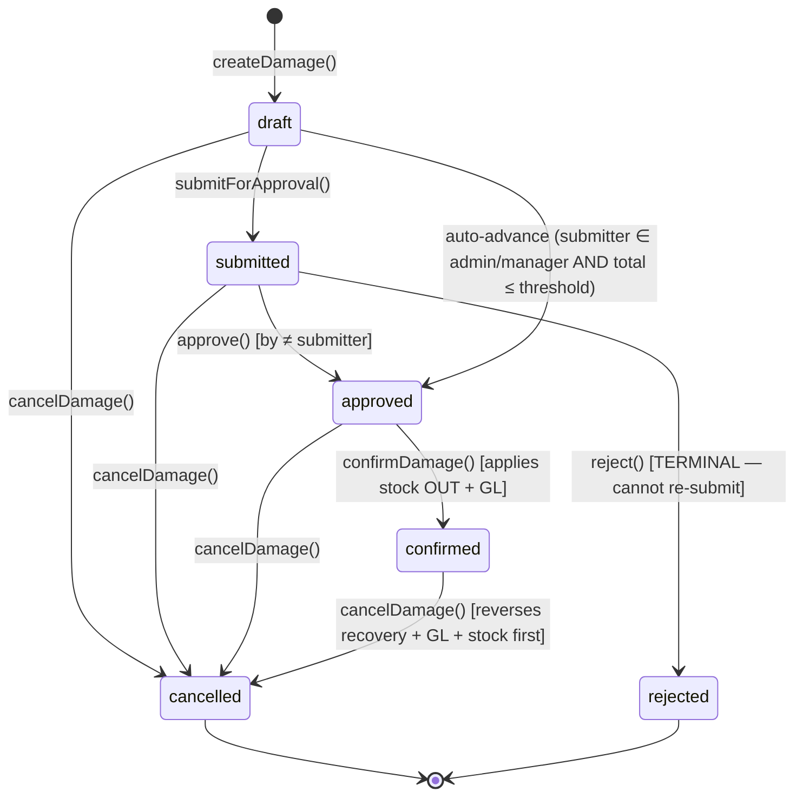

# Damage

> **Module:** Inventory (Phase 8)
> **Audience:** Engineers + AI assistants + **accountants** (must review before Canonical)
> **Status:** Draft — pending accountant sign-off
> **Last reviewed:** 2025-08-03
> **Source of truth:** this file + `laravel/app/Services/Stock/DamageService.php` (1262 lines) + `laravel/database/sql/03_stock.sql:657-696` (`damage_invoices` + `damage_invoice_items` DDL) + `laravel/config/damage.php` (photo + accountability + approval config)

## 1. What is it?

A **damage** record is the booking of a stock loss due to physical damage, spoilage, expiry,
theft, missing stock, quality rejection, or customer return. It is a **specific loss category**
with photo evidence, witness/accountable employees, an approval workflow, and an optional
employee-recovery (financial) flow.

6 damage types (Phase 5 migration `2026_01_01_000001`):

| Type | Description | Loss ledger |
|---|---|---|
| `real_damage` | physical breakage / spoilage / expiry / fire / water / transit | `damage_loss` (fallback `inventory_shrinkage`) |
| `missing` | not found in warehouse (core complaint) | `inventory_shrinkage` (fallback `damage_loss`) |
| `theft` | suspected/confirmed theft | `inventory_shrinkage` (fallback `damage_loss`) |
| `quality_reject` | failed QC | `damage_loss` (fallback `inventory_shrinkage`) |
| `customer_return` | auto-created from sales return | `damage_loss` (fallback `inventory_shrinkage`) |
| `other` | catch-all | `damage_loss` (fallback `inventory_shrinkage`) |

The module has a 6-state lifecycle (draft → submitted → approved → confirmed → cancelled +
rejected) with maker-checker approval + threshold escalation.

## 2. Why does it exist?

- Damage is an operationally frequent event on the warehouse floor. The warehouse staff need a
  fast, mobile-friendly way to book damage with photo evidence.
- The `damage_loss` vs `inventory_shrinkage` distinction lets the accountant separate "ordinary
  business damage" (real_damage, quality_reject, customer_return, other) from "shrinkage" (missing,
  theft) in the trial balance.
- The employee-recovery flow lets the business hold an employee financially accountable for
  damage (e.g. recover the cost from the employee who caused it).
- The `customer_return` type auto-creates damage when a sales return reveals the goods are
  unsellable — integrated with `SalesReturnService::createLinkedDamageWriteOffs`.

## 3. When is it used?

- **Real damage** — physical breakage, spoilage, expiry, fire, water, transit damage.
- **Missing** — stock not found during a pick or count.
- **Theft** — suspected or confirmed theft (requires witness employee).
- **Quality reject** — QC fails on received goods.
- **Customer return** — auto-created when a sales return is booked and the goods are damaged.
- **Other** — any other loss that doesn't fit the above.

## 4. Who uses it?

- **Warehouse managers / managers / admins** create, submit, confirm
  (`role:admin,manager,warehouse_manager`).
- **Managers / admins** approve, reject (`role:admin,manager` — must be ≠ submitter for approve).
- **Admins / managers** post employee recovery (`role:admin,manager`).
- The `DamagePolicy` (375 lines, registered in `AppServiceProvider.php:122`) gates per-action,
  including photo-evidence requirements + witness/accountable employee rules.

## 5. Related modules

- `stock-costing.md` — the avg_cost used to value the damage.
- `stock-ledger.md` — the `stock_transactions` row posted on confirm (qty negative).
- `warehouse-stock.md` — the `warehouse_stock` snapshot updated on confirm.
- `stock-adjustment.md` — the generic bookkeeping correction tool (vs damage's specific loss
  category).
- `../accounting/journal-posting-rules.md` §5 #11-12 — `postDamageGL` +
  `postEmployeeRecovery` Dr/Cr matrix (already documented in Phase 6).
- `../accounting/reversal-vs-cancellation.md` §7.5 — `cancelDamage` reversal cascade (already
  documented).
- `../accounting/chart-of-accounts.md` — `damage_loss` extended nature with
  `inventory_shrinkage` fallback (already documented).

## 6. Business rules (the Core Rule)

- **MUST** record a `damage_code` (unique, format `DM-YYYY-NNNNNN`) via `DocumentSequenceService`.
- **MUST** set `damage_type` to one of 6 values (DB CHECK enforced).
- **MUST** post the GL on `confirmDamage` (if `total_value >= 0.01`): Dr `<loss ledger>` / Cr
  `inventory`, where the loss ledger is `damage_loss` (for real_damage/quality_reject/
  customer_return/other) or `inventory_shrinkage` (for missing/theft), with fallback to the
  other nature if the primary is not configured.
- **MUST** post the stock ledger on `confirmDamage`: one `stock_transactions` row per item with
  negative `qty` (stock OUT) and `reference_type='damage'`.
- **MUST** value the damage at the **current avg_cost** (cost flows out at average, avg unchanged
  — see `stock-costing.md`).
- **MUST** enforce maker-checker: the approver MUST be a different user from the submitter.
- **MUST** enforce photo evidence at submit AND confirm for `real_damage`, `theft`,
  `quality_reject` (config-driven `require_photo_for_types`).
- **MUST** require witness employee for `theft` (config-driven).
- **MUST** require accountable employee for `missing` (config-driven).
- **MUST** support employee recovery: Dr `employee_payable` / Cr `<original loss ledger>` (a
  SEPARATE journal entry), plus an `employee_ledger` row via `SubLedgerService`. One-shot:
  `hasRecovery()` blocks re-running.
- **MUST** reverse (not edit) a confirmed damage via `cancelDamage` — reverses recovery (if any)
  FIRST, then reverses GL + stock ledger + marks `is_reversed=true` + `status='cancelled'`.
- **MUST NOT** allow re-submission of a rejected damage (`rejected` is terminal — must create a
  new damage).
- **MUST NOT** support "repair and put back" — once damaged, stock is OUT. Recovery is financial
  only (employee pays back), not stock-restoration.

## 7. Technical implementation

### 7.1 The `damage_invoices` table — `03_stock.sql:657-676` + Phase 5 migration

Base DDL plus Phase 5 migration `2026_01_05_000001` adds: `total_value`, `damage_type` (CHECK 6
values), `reason_code`, `reason_detail`, `sales_return_id`, `witness_employee_id`,
`accountable_employee_id`, `recovery_amount`, `employee_ledger_entry_id`,
`recovery_journal_entry_id`, `submitted_by/at`, `approved_by/at`, `approval_rejected_by/at`,
`approval_notes`, and expands the status CHECK to `('draft','submitted','approved','confirmed',
'cancelled','rejected')`.

| Column | Type | Notes |
|---|---|---|
| `id` | PK | |
| `damage_code` | `varchar(30) UNIQUE` | `DM-YYYY-NNNNNN` |
| `damage_date` | `date NOT NULL` | |
| `warehouse_id` | FK warehouses | |
| `branch_id` | FK branches | RLS key |
| `damage_type` | `varchar(20) CHECK IN (6 types)` | see §1 |
| `total_value` | `numeric(14,2)` | sum of item values (qty × rate) |
| `reason_code` | `varchar(50)` | FK to `damage_reasons.reason_code` (per-type taxonomy) |
| `reason_detail` | text | free-text explanation |
| `reason` | text | legacy free-text reason |
| `sales_return_id` | FK sales_returns | for `customer_return` type (auto-created) |
| `witness_employee_id` | FK employees | required for `theft` |
| `accountable_employee_id` | FK employees | required for `missing` |
| `recovery_amount` | `numeric(14,2)` | recovered from employee |
| `employee_ledger_entry_id` | FK employee_ledger | the sub-ledger row for recovery |
| `recovery_journal_entry_id` | FK journal_entries | the GL entry for recovery |
| `journal_entry_id` | FK journal_entries | the main write-off GL entry |
| `status` | `varchar(20) CHECK IN (6 states)` | see §9 |
| `is_reversed`, `reversed_at`, `reversed_by`, `reverse_reason` | | reversal marker |
| `submitted_by/at`, `approved_by/at`, `approval_rejected_by/at`, `approval_notes` | | maker-checker |
| `created_by`, timestamps | | |

RLS: `07_views_triggers_constraints.sql:714-720`. NO `fn_financial_audit_trigger` (relies on
`user_audit_log` via `AuditableMasterData` trait — which DOES work for DamageService because it
uses Eloquent `create()`/`update()`).

### 7.2 The GL posting — `postDamageGL()` `DamageService.php:841-905` (verbatim)

```php
private function postDamageGL(DamageInvoice $damage, int $createdBy): ?int
{
    $totalValue = (float) $damage->total_value;
    if ($totalValue < 0.01) {
        return null;   // No GL for zero-value damages (FK-safe: nullable journal_entry_id)
    }
    $inventoryLedgerId = $this->journalPosting->lookupLedgerByNature('inventory');
    $lossLedgerId = $this->resolveLossLedgerId($damage->damage_type);
    ...
    return $this->journalPosting->createJournalEntry([
        'entry_date' => $damage->damage_date->format('Y-m-d'),
        'reference_type' => 'damage',
        'reference_id' => $damage->id,
        'branch_id' => $damage->branch_id,
        'description' => "Damage Write-off {$damage->damage_code} ({$typeLabel})" . ...,
        'source' => 'damage',
        'created_by' => $createdBy,
    ], [
        [
            'ledger_id' => $lossLedgerId,
            'debit' => $totalValue, 'credit' => 0,
            'memo' => "Damage / write-off ({$typeLabel}) — {$damage->damage_code}",
        ],
        [
            'ledger_id' => $inventoryLedgerId,
            'debit' => 0, 'credit' => $totalValue,
            'memo' => 'Inventory reduction (damaged goods) — ' . $damage->damage_code,
        ],
    ]);
}
```

### 7.3 Type-aware loss ledger — `resolveLossLedgerId()` `DamageService.php:921-945` (verbatim)

```php
private function resolveLossLedgerId(string $damageType): int
{
    $shrinkageNatures = ['missing', 'theft'];
    $preferShrinkage  = in_array($damageType, $shrinkageNatures, true);
    $primary   = $preferShrinkage ? 'inventory_shrinkage' : 'damage_loss';
    $secondary = $preferShrinkage ? 'damage_loss' : 'inventory_shrinkage';
    $id = $this->journalPosting->lookupLedgerByNature($primary);
    if (!$id) {
        $id = $this->journalPosting->lookupLedgerByNature($secondary);
    }
    if (!$id) {
        throw new \RuntimeException(
            'Neither damage_loss nor inventory_shrinkage ledger is configured. ...'
        );
    }
    return $id;
}
```

- `real_damage`, `quality_reject`, `customer_return`, `other` → `damage_loss` (fallback:
  `inventory_shrinkage`)
- `missing`, `theft` → `inventory_shrinkage` (fallback: `damage_loss`)

### 7.4 The stock ledger entry on confirm — `DamageService.php:343-360` (verbatim)

```php
foreach ($damage->items as $item) {
    $this->stockService->applyTransaction([
        'warehouse_id' => $warehouseId,
        'product_id' => $item->product_id,
        'qty' => -(float) $item->qty,         // negative = OUT
        'rate' => (float) $item->rate,        // current avg_cost (cost flows out, avg unchanged)
        'reference_type' => 'damage',
        'reference_id' => $damage->id,
        'notes' => 'Damage #' . $damage->damage_code,
        'transaction_date' => $damageDate,
        'created_by' => $confirmedBy,
    ]);
}
```

### 7.5 Employee recovery flow — `postEmployeeRecovery()` `DamageService.php:1114-1244`

Posts a SEPARATE journal entry: Dr `employee_payable` / Cr `<original loss ledger>` (resolved
from the original damage JE's debit line via `resolveOriginalLossLedgerId()`). Also posts an
`employee_ledger` row via `SubLedgerService::postEmployeeLedgerEntry` (transaction_type=
`deduction`, configurable). The damage is stamped with `recovery_amount`,
`employee_ledger_entry_id`, `recovery_journal_entry_id`.

One-shot: `hasRecovery()` blocks re-running. `cancelDamage` reverses the recovery BEFORE
reversing the main write-off (order matters — see §11).

### 7.6 Approval — Maker-Checker + Threshold Escalation (Phase 5)

- `submit` (admin/manager/warehouse_manager) → `submitted`. Auto-advance to `approved` IF
  submitter ∈ `auto_approve_roles` (admin/manager) AND total ≤ `approval.threshold` (default
  5000 BDT). `warehouse_manager` submitters NEVER auto-approve.
- `approve` (admin/manager, must be ≠ submitter) → `approved`.
- `reject` (admin/manager, must be ≠ submitter) → `rejected` (TERMINAL — cannot re-submit; must
  create a new damage).
- `confirm` (admin/manager) → `confirmed`. Requires `status='approved'`.
  `$force_confirm=true` bypasses for system-originated damages (sales-return-linked auto-flow via
  `SalesReturnService::createLinkedDamageWriteOffs`).
- Photo evidence required at submit AND confirm for `real_damage`, `theft`, `quality_reject`
  (config-driven `require_photo_for_types`).
- Witness employee required for `theft`; accountable employee required for `missing`
  (config-driven `accountability` block).

## 8. Intercompany / cross-branch

Damage is an intra-branch, intra-warehouse operation. The `branch_id` is RLS-enforced. There is
NO intercompany posting — the damage posts Dr/Cr `<loss ledger>` / `inventory` all within the
same branch.

The employee recovery flow posts Dr `employee_payable` / Cr `<loss ledger>` within the same
branch. If the accountable employee is in a different branch, the interbranch obligation is NOT
tracked (gap — compare to EmployeeTransactionService's intercompany two-JE pattern).

## 9. Workflow / state machine



6 states: `draft`, `submitted`, `approved`, `confirmed`, `cancelled`, `rejected`.

Note: `rejected` is **terminal** (unlike Stock Adjustment where `rejected` returns to `draft`).
A rejected damage cannot be re-submitted — the user must create a new damage.

## 10. Validation & input rules

Web controller `DamageController@store` L236-263 (NO dedicated FormRequest):

```php
$validated = $request->validate([
    'warehouse_id' => 'required|integer|exists:warehouses,id',
    'damage_date' => 'required|date',
    'damage_type' => ['required', 'string', Rule::in(DamageInvoice::DAMAGE_TYPES)],
    'reason_code' => [
        'nullable', 'string', 'max:50',
        Rule::exists('damage_reasons', 'reason_code')->where(function ($q) use ($request) {
            $q->where('damage_type', $request->input('damage_type'))
              ->where('is_active', true);
        }),
    ],
    'reason_detail' => 'nullable|string|max:2000',
    'reason' => 'nullable|string|max:1000',
    'witness_employee_id' => 'nullable|integer|exists:employees,id',
    'accountable_employee_id' => 'nullable|integer|exists:employees,id',
    'items' => 'required|array|min:1',
    'items.*.product_id' => 'required|integer|exists:products,id',
    'items.*.qty' => 'required|numeric|min:0.001',
    'items.*.rate' => 'nullable|numeric|min:0',
]);
```

The `reason_code` validation uses a closure to enforce per-type taxonomy: the reason_code must
exist in `damage_reasons` for the given `damage_type` AND be active.

## 11. Reversal & correction flow

`cancelDamage` (not shown verbatim — see `DamageService.php:691-813` pattern). The full cascade:

1. `lockForUpdate()` the damage + items.
2. Require `cancel_reason` (non-empty).
3. If `wasConfirmed`:
   a. **Reverse recovery FIRST** (if `hasRecovery()`): reverse the recovery GL entry +
      employee_ledger row. Order matters — the recovery references the original loss ledger, so
      it must be reversed before the main write-off.
   b. Reverse the main GL journal entry (`reverseJournalEntry` with back-dated `$reversalDate`).
   c. For each item, `StockService::reverseTransaction` (the stock OUT becomes a stock IN at the
      original avg_cost — preserves cost integrity).
   d. Mark `is_reversed=true` + `reversed_at` + `reversed_by` + `reverse_reason`.
4. Set `status='cancelled'` + `cancel_reason`.
5. Audit log.

```mermaid
sequenceDiagram
    participant U as User (admin/manager)
    participant C as DamageController
    participant S as DamageService
    participant JR as JournalReversalService
    participant SS as StockService
    participant DB as PostgreSQL

    U->>C: POST /admin/damages/{id}/cancel {reason}
    C->>S: cancelDamage(id, userId, reason)
    S->>DB: BEGIN; SELECT ... FOR UPDATE
    S->>S: validate status, reason non-empty
    alt wasConfirmed AND hasRecovery()
        S->>JR: reverseJournalEntry(recovery_journal_entry_id)  // recovery FIRST
        S->>DB: UPDATE employee_ledger SET is_reversed=true
    end
    S->>JR: reverseJournalEntry(journal_entry_id)  // main write-off
    S->>SS: reverseTransaction(stockTxId) per item  // stock OUT → stock IN
    S->>DB: UPDATE damage_invoices SET is_reversed=true, status=cancelled, cancel_reason
    S->>DB: COMMIT
    S-->>C: DamageInvoice (cancelled)
    C-->>U: redirect with success
```

## 12. Open questions / known gaps

1. **No insurance_claim flow** — NO `claim_status` column. NO `insurance_recovery` GL posting.
   For businesses that insure high-value stock, this is a feature gap. **Recommended:** add an
   `insurance_claim` sub-module with `claim_status` (draft/filed/approved/rejected/received) +
   `insurance_recovery_amount` + a Dr bank / Cr `<loss ledger>` recovery posting.
2. **No "repair and put back" flow** — once damaged, stock is OUT. Recovery is financial only
   (employee pays back). For businesses that repair damaged goods (e.g. electronics), this is a
   feature gap. **Recommended:** add a `repair` flow that reverses the damage and posts a
   Dr inventory / Cr `<loss ledger>` at the repaired cost.
3. **No transit_damage dedicated type** — `real_damage` covers transit (per the type description
   "physical breakage/spoilage/expiry/fire/water/transit"). If granular transit reporting is
   needed, add a `transit_damage` type.
4. **Damage reason taxonomy is per-type but does NOT enforce a reason_code** (§10) — only
   validates IF supplied. **Recommended:** require `reason_code` for `theft` and `missing` types
   (where the reason is most important for audit).
5. **Sales-return-linked auto-flow** — `SalesReturnService::createLinkedDamageWriteOffs` creates +
   confirms damages in one shot via `$force_confirm=true`, stamping the audit note "Auto-approved:
   linked to sales return". This bypasses the maker-checker gate. **Accountant must confirm this
   is acceptable** for the customer_return type.
6. **Employee recovery intercompany gap** (§8) — if the accountable employee is in a different
   branch, the interbranch obligation is NOT tracked. **Recommended:** add intercompany two-JE
   pattern (mirroring EmployeeTransactionService) when `accountable_employee.branch_id !==
   damage.branch_id`.
7. **`damage_invoice_items` + `warehouse_transfer_items` have NO RLS** — parent-table RLS
   suffices for most queries, but raw DB access leaks items across branches (minor gap).
8. **No `damage_invoice_items.stock_transaction_id` composite FK** (compare to
   `stock_adjustment_items` Phase 6.2 G11 fix) — the damage reversal looks up the stock
   transaction by `(reference_type, reference_id, product_id)` which could match multiple rows
   if a damage has duplicate products (the `damage_invoice_items` table has no UNIQUE constraint
   on `(damage_invoice_id, product_id)`). **Recommended:** add the composite FK + UNIQUE
   constraint, mirroring the Stock Adjustment Phase 6.2 G11 fix.

## 13. Accountant review checklist

> **This is a SAFETY-CRITICAL document.** Before marking it Canonical, an accountant with
> production credentials MUST review and sign off on each item below.

- [ ] The 6-state state machine (§9) matches the actual approval + confirm + cancel workflow.
- [ ] The `rejected` terminal state (§9) — cannot re-submit, must create a new damage — is the
      desired behaviour. Compare to Stock Adjustment where `rejected` returns to `draft`.
- [ ] The GL Dr/Cr matrix (§7.2) — Dr `<loss ledger>` / Cr `inventory` — is correct.
- [ ] The type-aware loss ledger resolution (§7.3) — `damage_loss` for real_damage/quality_reject/
      customer_return/other, `inventory_shrinkage` for missing/theft — matches the actual
      treatment. Confirm the fallback chain is correct.
- [ ] The employee recovery flow (§7.5) — Dr `employee_payable` / Cr `<original loss ledger>` as a
      separate JE — is the desired treatment.
- [ ] The recovery reversal order (§11) — recovery reversed BEFORE main write-off — is correct.
- [ ] The photo evidence requirement (§7.6) — for `real_damage`, `theft`, `quality_reject` at
      submit AND confirm — is the desired policy.
- [ ] The witness employee requirement for `theft` + accountable employee for `missing` (§7.6) —
      is the desired policy.
- [ ] The threshold escalation (§7.6) — `warehouse_manager` submitters NEVER auto-approve — is
      the desired segregation.
- [ ] The sales-return-linked auto-flow (§12 #5) — `force_confirm=true` bypasses maker-checker —
      is acceptable for the `customer_return` type.
- [ ] The lack of insurance_claim flow (§12 #1) — is this a feature gap that should be addressed?
- [ ] The lack of "repair and put back" flow (§12 #2) — is this a feature gap?
- [ ] The employee recovery intercompany gap (§12 #6) — should the two-JE pattern be added for
      cross-branch accountable employees?
- [ ] The lack of `damage_invoice_items.stock_transaction_id` composite FK (§12 #8) — should the
      Phase 6.2 G11 fix be applied here too?
