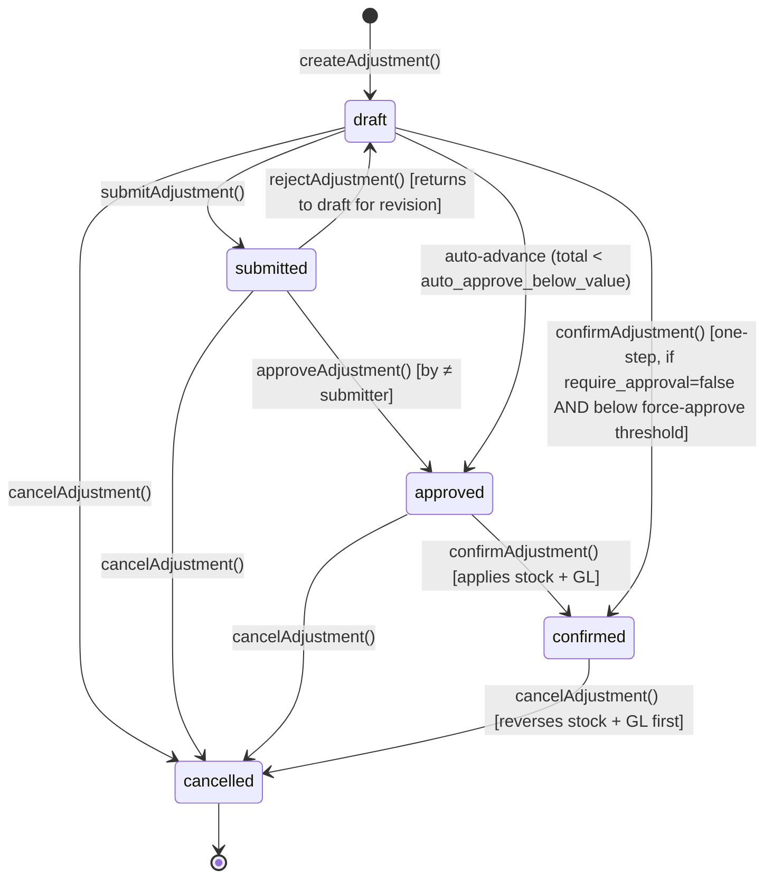

# Stock Adjustment

> **Module:** Inventory (Phase 8)
> **Audience:** Engineers + AI assistants + **accountants** (must review before Canonical)
> **Status:** Draft — pending accountant sign-off
> **Last reviewed:** 2025-08-03
> **Source of truth:** this file + `laravel/app/Services/Stock/StockAdjustmentService.php` (987 lines) + `laravel/app/Services/Stock/StockAdjustmentPolicyService.php` (config-file-driven) + `laravel/database/sql/03_stock.sql:99-211` (`stock_adjustments` + `stock_adjustment_items` DDL) + `laravel/config/stock_adjustment.php` (10 config knobs)

## 1. What is it?

A **stock adjustment** is a manual, one-off correction to stock quantities — increase (gain) or
decrease (loss) — with a reason and a category. It is the bookkeeping correction tool, distinct
from the systematic stock take (which is a full physical count) and from damage (which is a
specific loss category with photo evidence + employee recovery).

The module supports 7 categories: `opening_balance`, `data_migration`, `uom_correction`,
`post_conversion_fix`, `legacy_cleanup`, `reconciliation_variance`, `other`. Each adjustment has
a 6-state lifecycle (draft → submitted → approved → confirmed → cancelled + rejected) with
maker-checker approval.

## 2. Why does it exist?

- Stock take is a heavy, periodic operation (freeze + full count + approval + post). For a
  single-product correction discovered mid-shift, stock adjustment is the lightweight tool.
- The `opening_balance` category is used during initial onboarding to seed stock from the legacy
  system — it writes `reference_type='opening_balance'` (not `'stock_adjustment'`) to distinguish
  initial-onboarding stock from operational corrections.
- The `uom_correction` category handles cases where a product was received in the wrong UoM and
  the qty needs correction without a GL impact (rate = 0).
- The `reconciliation_variance` category handles the residual variance after a
  `StockAdjustmentReconcileService::computeDrift()` detects drift between `warehouse_stock` and
  the `stock_transactions` ledger.

## 3. When is it used?

- **Opening balance seeding** — initial stock load from legacy system (`opening_balance` category).
- **Data migration cleanup** — post-migration corrections (`data_migration`,
  `post_conversion_fix`, `legacy_cleanup` categories).
- **UoM correction** — fix a product received in the wrong UoM (`uom_correction` category).
- **Reconciliation variance** — book the residual drift after a recon (`reconciliation_variance`
  category).
- **Ad-hoc correction** — any other one-off correction (`other` category).

## 4. Who uses it?

- **Accountants** create, submit, confirm (`role:admin,accountant`).
- **Managers / admins** approve, reject (`role:admin,manager` — must be ≠ submitter for approve).
- **Admins only** can force-confirm (bypass pipeline availability check) and rebuild the snapshot
  (`StockAdjustmentReconcileService::rebuildSnapshot`).
- The `StockAdjustmentPolicy` (208 lines, registered in `AppServiceProvider.php:113`) gates
  per-action.

## 5. Related modules

- `stock-costing.md` — the avg_cost used to value the adjustment.
- `stock-ledger.md` — the `stock_transactions` rows posted on confirm.
- `warehouse-stock.md` — the `warehouse_stock` snapshot updated on confirm.
- `stock-take.md` — the systematic count tool (vs adjustment's one-off correction).
- `damage.md` — the specific loss category (with photo evidence + employee recovery).
- `stock-verification.md` — the drift-detection + rebuild-snapshot mechanisms.
- `../accounting/journal-posting-rules.md` §5 #9 — `postAdjustmentGL` Dr/Cr matrix (already
  documented in Phase 6).
- `../accounting/reversal-vs-cancellation.md` §7.5 — `cancelAdjustment` reversal cascade (already
  documented).
- `../accounting/financial-audit-log.md` §12 — `stock_adjustments` NOT in
  `fn_financial_audit_trigger`; relies on dedicated `stock_adjustment_audit_log`.

## 6. Business rules (the Core Rule)

- **MUST** record an `adjustment_code` (unique, format `SA-YYYY-NNNNNN`) via
  `DocumentSequenceService`.
- **MUST** set `adjustment_type` to `increase` or `decrease` (DB CHECK enforced).
- **MUST** set `adjustment_category` to one of 7 values (DB CHECK enforced):
  `opening_balance`, `data_migration`, `uom_correction`, `post_conversion_fix`,
  `legacy_cleanup`, `reconciliation_variance`, `other`.
- **MUST** post the GL on `confirmAdjustment` (if `total_amount >= 0.01`): Dr `inventory` / Cr
  `inventory_surplus` (increase), Dr `inventory_shrinkage` / Cr `inventory` (decrease).
- **MUST** post the stock ledger on `confirmAdjustment`: one `stock_transactions` row per item
  with signed `qty` (positive for increase, negative for decrease) and `reference_type` =
  `opening_balance` (for opening_balance category) or `stock_adjustment` (otherwise).
- **MUST** persist the exact `stock_transaction_id` + `stock_transaction_date` on each
  `stock_adjustment_items` row (composite FK into the partitioned ledger — Phase 6.2 G11 fix for
  exact-row reversal).
- **MUST** enforce maker-checker: the approver MUST be a different user from the submitter.
- **MUST** enforce pipeline-aware availability check on confirm (decrease) — cannot decrease below
  `StockAvailabilityService::getBranchAvailableQty`. Admin-only force-confirm bypasses with
  `$forceReason`.
- **MUST** reverse (not edit) a confirmed adjustment via `cancelAdjustment` — reverses GL + stock
  ledger + marks `is_reversed=true` + `status='cancelled'`.
- **MUST** use the adjustment's `adjustment_date` as the reversal date (Phase 6.3 G10 fix) —
  back-dated reversals line up with the original posting.
- **MUST NOT** allow duplicate `product_id` within the same adjustment (Phase 6.4 G11 dedup guard
  — throws `InvalidArgumentException` BEFORE any DB write; DB UNIQUE constraint is the backstop).
- **MUST NOT** allow multi-warehouse adjustment — one adjustment = one warehouse.

## 7. Technical implementation

### 7.1 The `stock_adjustments` table — `03_stock.sql:99-156`

| Column | Type | Notes |
|---|---|---|
| `id` | PK | |
| `adjustment_code` | `varchar(30) UNIQUE` | `SA-YYYY-NNNNNN` |
| `adjustment_date` | `date NOT NULL` | |
| `warehouse_id` | FK warehouses | |
| `branch_id` | FK branches | RLS key |
| `adjustment_type` | `varchar(20) CHECK IN (increase,decrease)` | |
| `adjustment_category` | `varchar(40) CHECK IN (7 categories)` | see §6 |
| `total_amount` | `numeric(14,2)` | sum of item values |
| `reason` | text | |
| `status` | `varchar(20) CHECK IN (6 states)` | see §9 |
| `journal_entry_id` | FK journal_entries | null until confirmed |
| `is_reversed`, `reversed_at`, `reversed_by`, `reverse_reason` | | reversal marker |
| `cancel_reason` | text | always populated on cancel (G15) |
| `submitted_by/at`, `approved_by/at`, `approval_comments` | | maker-checker |
| `confirmed_by/at`, `confirm_reason` | | confirm + force-confirm |
| `created_by`, timestamps | | |

RLS: `07_views_triggers_constraints.sql:633-639`. NO `fn_financial_audit_trigger` (relies on
dedicated `stock_adjustment_audit_log`).

### 7.2 The `stock_adjustment_items` table — `03_stock.sql:158-211`

- Composite FK `(stock_transaction_id, stock_transaction_date) REFERENCES stock_transactions(id,
  transaction_date)` for exact-row reversal (Phase 6.2 G11 fix).
- `UNIQUE(stock_adjustment_id, product_id)` — one product per adjustment (Phase 6.2 G11 backstop).
- Phase 5 UOM columns: `uom_id`, `qty_entered`, `qty_base`, `uom_factor` (all nullable for
  back-compat). `qty_base` (= `qty_entered × factor`) is what posts to stock. `uom_factor` is
  snapshotted at creation time (audit immutability).

### 7.3 The GL posting — `postAdjustmentGL()` `StockAdjustmentService.php:836-903` (verbatim)

```php
private function postAdjustmentGL(StockAdjustment $adjustment, int $createdBy): ?int
{
    $totalAmount = (float) $adjustment->total_amount;
    if ($totalAmount < 0.01) {
        return null;   // No GL for zero-amount adjustments (FK-safe: nullable journal_entry_id)
    }
    $inventoryLedgerId = $this->journalPosting->lookupLedgerByNature('inventory');
    $lines = [];
    if ($adjustment->isIncrease()) {
        // Increase: Dr Inventory / Cr Inventory Surplus
        $surplusLedgerId = $this->journalPosting->lookupLedgerByNature('inventory_surplus');
        $lines[] = ['ledger_id' => $inventoryLedgerId, 'debit' => $totalAmount, 'credit' => 0, 'memo' => '...'];
        $lines[] = ['ledger_id' => $surplusLedgerId, 'debit' => 0, 'credit' => $totalAmount, 'memo' => '...'];
    } else {
        // Decrease: Dr Inventory Shrinkage / Cr Inventory
        $shrinkageLedgerId = $this->journalPosting->lookupLedgerByNature('inventory_shrinkage');
        $lines[] = ['ledger_id' => $shrinkageLedgerId, 'debit' => $totalAmount, 'credit' => 0, 'memo' => '...'];
        $lines[] = ['ledger_id' => $inventoryLedgerId, 'debit' => 0, 'credit' => $totalAmount, 'memo' => '...'];
    }
    return $this->journalPosting->createJournalEntry([
        'entry_date' => $adjustment->adjustment_date->format('Y-m-d'),
        'reference_type' => 'stock_adjustment',
        'reference_id' => $adjustment->id,
        'branch_id' => $adjustment->branch_id,
        'description' => 'Stock Adjustment ' . $adjustment->adjustment_code . ...,
        'source' => 'stock_adjustment',
        'created_by' => $createdBy,
    ], $lines);
}
```

### 7.4 The stock ledger entry on confirm — `StockAdjustmentService.php:596-628` (verbatim)

```php
$referenceType = $adjustment->ledgerReferenceType();  // 'opening_balance' or 'stock_adjustment'
foreach ($adjustment->items as $item) {
    $qtyChange = $sign * $item->baseQty();   // +ve for increase, -ve for decrease
    $stockTx = $this->stockService->applyTransaction([
        'warehouse_id' => $warehouseId,
        'product_id' => $item->product_id,
        'qty' => $qtyChange,
        'rate' => (float) $item->rate,
        'reference_type' => $referenceType,
        'reference_id' => $adjustment->id,
        'notes' => 'Stock Adjustment #' . $adjustment->adjustment_code . ...,
        'transaction_date' => $adjustment->adjustment_date->format('Y-m-d'),
        'created_by' => $confirmedBy,
    ]);
    // Persist the exact stock_transaction id (composite FK for partitioned ledger)
    DB::table('stock_adjustment_items')->where('id', $item->id)->update([
        'stock_transaction_id'   => $stockTx->id,
        'stock_transaction_date' => $adjustment->adjustment_date->format('Y-m-d'),
    ]);
}
```

### 7.5 `ledgerReferenceType()` — `StockAdjustment.php:443-446`

```php
public function ledgerReferenceType(): string
{
    return $this->adjustment_category === 'opening_balance'
        ? 'opening_balance'
        : 'stock_adjustment';
}
```

The `opening_balance` category writes `reference_type='opening_balance'` to distinguish initial-
onboarding stock from operational corrections.

### 7.6 Reversal / cancellation flow — `cancelAdjustment()` `StockAdjustmentService.php:691-813` (verbatim excerpt)

```php
public function cancelAdjustment(int $adjustmentId, int $cancelledBy, string $reason = ''): StockAdjustment
{
    $reason = trim($reason);
    if ($reason === '') {
        throw new \RuntimeException('A cancel reason is required.');
    }
    return DB::transaction(function () use ($adjustmentId, $cancelledBy, $reason) {
        $adjustment = StockAdjustment::with('items')->lockForUpdate()->find($adjustmentId);
        $wasConfirmed = $adjustment->isConfirmed();
        if ($wasConfirmed) {
            // Phase 6.3 (G10 fix — back-dated reversal date): pass the
            // adjustment's adjustment_date into both the GL + stock reversals
            $reversalDate = $adjustment->adjustment_date->format('Y-m-d');
            // Reverse the GL journal entry.
            if ($adjustment->journal_entry_id) {
                $this->journalPosting->reverseJournalEntry(
                    $adjustment->journal_entry_id, $cancelledBy,
                    "Stock adjustment cancelled: {$reason}", $reversalDate
                );
            }
            // Reverse each stock movement by EXACT stock_transaction_id (Phase 6.2 G11 fix)
            foreach ($adjustment->items as $item) {
                $stockTxId = $item->stock_transaction_id ? (int) $item->stock_transaction_id : null;
                if ($stockTxId === null) {
                    // Legacy fallback for pre-Phase-6.2 rows.
                    $stockTx = DB::table('stock_transactions')
                        ->whereIn('reference_type', ['stock_adjustment', 'opening_balance'])
                        ->where('reference_id', $adjustment->id)
                        ->where('product_id', $item->product_id)
                        ->where('is_reversed', false)
                        ->first();
                    $stockTxId = $stockTx ? (int) $stockTx->id : null;
                }
                if ($stockTxId !== null) {
                    $this->stockService->reverseTransaction(
                        $stockTxId, $cancelledBy,
                        "Stock adjustment cancelled: {$reason}", $reversalDate
                    );
                }
            }
            DB::table('stock_adjustments')->where('id', $adjustmentId)->update([
                'is_reversed' => true, 'reversed_at' => now(),
                'reversed_by' => $cancelledBy, 'reverse_reason' => $reason,
            ]);
        }
        DB::table('stock_adjustments')->where('id', $adjustmentId)->update([
            'status' => 'cancelled',
            'cancel_reason' => $reason,    // G15 — always populated
            'updated_at' => now(),
        ]);
        ...
    });
}
```

### 7.7 Approval — Maker-Checker (Phase 3) + Force-confirm (Phase 6.1)

- `submit` (admin/accountant) → `submitted` (or auto-advance to `approved` if below
  `auto_approve_below_value`).
- `approve` (admin/manager, must be ≠ submitter) → `approved`.
- `reject` (admin/manager) → `draft` (returns to draft for revision).
- `confirm` (admin/accountant) → `confirmed`. Pipeline-aware availability re-check INSIDE
  `lockForUpdate`. `$force=true` + admin role + `$forceReason` mandatory → bypass pipeline check
  (logged as `force_confirm` audit action).

### 7.8 Config knobs — `config/stock_adjustment.php` (10 knobs)

| Knob | Default | Effect |
|---|---|---|
| `require_approval` | true | force maker-checker |
| `auto_approve_below_value` | 1000 | auto-advance submitted→approved if total < threshold |
| `max_value_without_secondary_approval` | 50000 | force-approve gate (blocks posting if total ≥ threshold even when require_approval=false) |
| `approver_roles` | ['admin','manager'] | who can approve |
| `submitter_roles` | ['admin','accountant'] | who can submit |
| `confirmer_roles` | ['admin','accountant'] | who can confirm |
| `force_confirmer_roles` | ['admin'] | who can force-confirm |
| `block_closed_period` | true | honour period-close guard |
| `stale_draft_days` | 7 | draft older than N days is flagged stale |
| `reconcile_tolerance` | 0.0001 | drift detection tolerance |
| `reconcile_drift_alert` | true | alert admins on drift |
| `reconcile_alert_roles` | ['admin','superadmin'] | who gets drift alerts |

## 8. Intercompany / cross-branch

Stock adjustment is an intra-branch, intra-warehouse operation. The `branch_id` is RLS-enforced.
There is NO intercompany posting — the adjustment posts Dr/Cr `inventory` / `inventory_surplus` /
`inventory_shrinkage` all within the same branch.

## 9. Workflow / state machine



6 states: `draft`, `submitted`, `approved`, `confirmed`, `cancelled`, `rejected`.

Note: `rejected` is a **transient flag** (returns to `draft` for revision) — NOT a terminal
state. The DB CHECK allows it as a status value, but the service transitions directly to `draft`
on reject (the `rejected` status is not persisted unless the controller short-circuits).

## 10. Validation & input rules

Web controller `StockAdjustmentController@store` L150-167 (NO dedicated FormRequest):

```php
$validated = $request->validate([
    'warehouse_id' => 'required|integer|exists:warehouses,id',
    'adjustment_type' => 'required|in:increase,decrease',
    'adjustment_category' => 'required|in:' . implode(',', StockAdjustment::ADJUSTMENT_CATEGORIES),
    'adjustment_date' => 'required|date',
    'reason' => 'nullable|string|max:1000',
    'items' => 'required|array|min:1',
    'items.*.product_id' => 'required|integer|exists:products,id',
    'items.*.qty' => 'required|numeric|min:0.001',
    'items.*.uom_id' => 'nullable|integer|exists:units_of_measure,id',     // Phase 5
    'items.*.rate' => 'nullable|numeric|min:0',
    'items.*.reason' => 'nullable|string|max:500',
]);
```

Plus service-layer dedup guard (Phase 6.4 G11): duplicate `product_id` within the same adjustment
payload throws `InvalidArgumentException` BEFORE any DB write. The DB UNIQUE constraint is the
backstop.

## 11. Reversal & correction flow

See §7.6 for `cancelAdjustment` verbatim. The full cascade:

1. `lockForUpdate()` the adjustment + items.
2. Require `cancel_reason` (non-empty).
3. If `wasConfirmed`:
   a. Reverse the GL journal entry (`reverseJournalEntry` with back-dated `$reversalDate`).
   b. For each item, look up the exact `stock_transaction_id` (composite FK — Phase 6.2 G11).
      Legacy fallback for pre-Phase-6.2 rows (lookup by `reference_type` + `reference_id` +
      `product_id`).
   c. `StockService::reverseTransaction(stockTxId, userId, reason, reversalDate)` for each.
   d. Mark `is_reversed=true` + `reversed_at` + `reversed_by` + `reverse_reason`.
4. Set `status='cancelled'` + `cancel_reason` (always populated — G15).
5. Audit log (`stock_adjustment_audit_log` action=`cancel`).

## 12. Open questions / known gaps

1. **No multi-warehouse adjustment** — one adjustment = one warehouse. To correct stock across
   multiple warehouses, the accountant must create N adjustments. **Recommended:** consider a
   multi-warehouse adjustment (would complicate the GL posting — one JE per warehouse, or one
   aggregated JE?).
2. **No threshold-based auto-categorization** — all categories are manually selected. The
   accountant must remember to pick `opening_balance` for initial seeding, `uom_correction` for
   UoM fixes, etc. **Recommended:** add UI hints or auto-suggest based on context.
3. **`rejected` status is transient** (§9) — the service transitions directly to `draft` on
   reject. The DB CHECK allows `rejected` as a status value, but it's never persisted. Consider
   removing `rejected` from the DB CHECK to match the actual behaviour, OR persisting it for
   audit visibility.
4. **`AuditableMasterData` trait is DEAD for StockAdjustmentService + StockTakeService** — both
   write via `DB::table()`, bypassing Eloquent events. The trait works for `DamageService` (which
   uses Eloquent `create()`/`update()`). See `StockAdjustment.php:54-62` comment. **Recommended:**
   either migrate the services to Eloquent, or remove the trait from these models.
5. **`stale_draft_days` default 7** (§7.8) — drafts older than 7 days are flagged stale. No
   automated cleanup. **Accountant must confirm the stale-draft policy.**
6. **Back-dated reversal closed-period fallback** (§7.6) — if the `adjustment_date` is in a
   closed period, the reversal falls back to today + warning log. The GL will show the reversal
   in today's period, not the original period. **Accountant must confirm this is acceptable.**

## 13. Accountant review checklist

> **This is a SAFETY-CRITICAL document.** Before marking it Canonical, an accountant with
> production credentials MUST review and sign off on each item below.

- [ ] The 6-state state machine (§9) matches the actual approval + confirm + cancel workflow.
- [ ] The GL Dr/Cr matrix (§7.3) — Dr inventory / Cr surplus (increase), Dr shrinkage / Cr
      inventory (decrease) — is correct.
- [ ] The `opening_balance` category routing (§7.5) — writes `reference_type='opening_balance'` to
      distinguish initial-onboarding stock — is the desired behaviour.
- [ ] The maker-checker segregation (approver ≠ submitter) is correctly enforced.
- [ ] The force-confirm escape hatch (§7.7) — admin-only, requires `$forceReason`, logged as
      `force_confirm` — is the desired behaviour.
- [ ] The `max_value_without_secondary_approval` force-approve gate (§7.8) — blocks posting even
      when `require_approval=false` if total ≥ threshold — is the desired behaviour.
- [ ] The back-dated reversal (§7.6, Phase 6.3 G10 fix) — reversal dated as the original
      `adjustment_date` — is correct. Confirm the closed-period fallback to today + warning is
      acceptable.
- [ ] The dedup guard (§10, Phase 6.4 G11) — duplicate `product_id` within the same adjustment
      throws before any DB write — is correct.
- [ ] The exact-row reversal via composite FK (§7.6, Phase 6.2 G11 fix) — `stock_transaction_id`
      + `stock_transaction_date` persisted on each item — is correct.
- [ ] The `rejected` transient status (§12 #3) — should it be persisted for audit visibility, or
      removed from the DB CHECK?
- [ ] The dead `AuditableMasterData` trait (§12 #4) — should the services migrate to Eloquent, or
      should the trait be removed?
- [ ] The `stale_draft_days` default of 7 (§12 #5) — is this the right stale-draft window?
- [ ] The lack of multi-warehouse adjustment (§12 #1) — is the one-warehouse-per-adjustment
      constraint acceptable?
