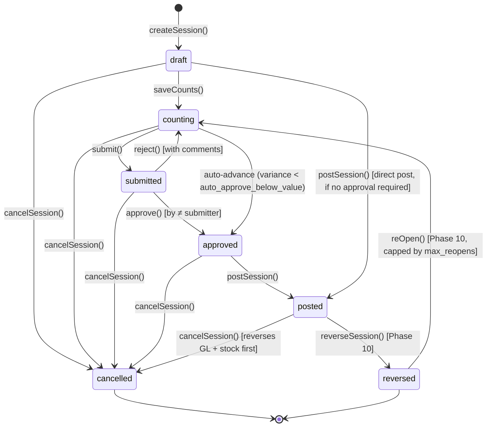

# Stock Take

> **Module:** Inventory (Phase 8)
> **Audience:** Engineers + AI assistants + **accountants** (must review before Canonical)
> **Status:** Draft — pending accountant sign-off
> **Last reviewed:** 2025-08-03
> **Source of truth:** this file + `laravel/app/Services/Stock/StockTakeService.php` (2919 lines — the largest inventory service) + `laravel/app/Services/Stock/StockTakePolicyService.php` (DB-backed policies) + `laravel/database/sql/03_stock.sql:213-404` (`stock_take_sessions` + `stock_take_warehouses` + `stock_take_items` + `stock_take_audit_log` + `stock_take_policies` DDL)

## 1. What is it?

A **stock take** (physical inventory count) is the periodic verification of physical stock
quantities against the system's recorded quantities. The accountant sets up a count session for
one or more warehouses, counters physically count the stock, the system computes variances
(gain/loss), a manager approves, and the variances are posted to the GL + stock ledger.

This is the most complex inventory module — 2919 lines of service code, a 7-state state machine,
per-warehouse sub-states, a freeze mechanism, maker-checker approval, Phase 9 cost-drift
revaluation, and Phase 10 re-open support.

## 2. Why does it exist?

- The `warehouse_stock` snapshot drifts from physical reality due to theft, damage, mis-counting,
  scanning errors, and unrecorded movements. Periodic stock takes correct this drift.
- The GL must reflect the inventory shrinkage (loss) or surplus (gain) — the stock take posts
  Dr/Cr `inventory` / `inventory_shrinkage` / `inventory_surplus` per Phase 6 chart-of-accounts.
- Regulatory and audit requirements mandate periodic physical counts.
- The freeze mechanism ensures the count is not corrupted by concurrent stock movements.

## 3. When is it used?

- **Monthly close** — the accountant sets up a full-scope count for each branch's warehouses.
- **ABC-cycle count** — high-value (A) items counted more frequently than (B) or (C), per the
  `mv_product_abc_classification` MV.
- **Negative-only / zero-only count** — targeted count of items showing negative or zero stock
  (suspected drift).
- **Ad-hoc count** — a specific product or category after a reported discrepancy.
- **Post-migration verification** — initial count after legacy data migration.

## 4. Who uses it?

- **Accountants / warehouse managers** create sessions, save counts, submit for approval
  (route middleware `role:admin,manager,warehouse_manager,accountant`).
- **Managers / admins** approve, reject, post, cancel, reverse, re-open
  (`role:admin,manager` only for the destructive operations).
- **Counters** (warehouse staff) enter physical quantities via the count UI or the API (mobile
  scanner).
- **NO `StockTakePolicy` class** — relies on route middleware + RLS + service-layer
  segregation-of-duties checks (approver ≠ submitter enforced in `StockTakeService::approve()`).

## 5. Related modules

- `stock-costing.md` — the avg_cost used to value variances.
- `stock-ledger.md` — the `stock_transactions` rows posted on `postSession`.
- `warehouse-stock.md` — the `warehouse_stock` snapshot updated on `postSession`; the freeze
  mechanism.
- `stock-adjustment.md` — the simpler one-off correction tool (vs stock take's systematic count).
- `stock-verification.md` — the drift-detection + replay-verify mechanisms.
- `../accounting/journal-posting-rules.md` §5 #10 — the `postStockTakeGL` Dr/Cr matrix (already
  documented in Phase 6).
- `../accounting/reversal-vs-cancellation.md` §7.5 — `cancelSession` (no GL reversal) +
  `reverseSession` (full GL+stock reversal) already documented.
- `../accounting/financial-audit-log.md` §12 — `stock_take_sessions` NOT in
  `fn_financial_audit_trigger` scope; relies on dedicated `stock_take_audit_log`.

## 6. Business rules (the Core Rule)

- **MUST** record a `session_code` (unique, format `ST-YYYY-NNNNNN`) via `DocumentSequenceService`.
- **MUST** support 7 count scopes: `full`, `category`, `abc`, `group`, `ad_hoc`,
  `negative_only`, `zero_only`.
- **MUST** snapshot `system_qty` + `system_rate` at SETUP time (before any counting). The
  `system_rate` is the avg_cost at setup; the `post_rate` is the live avg_cost re-fetched at POST
  time.
- **MUST** compute `difference = physical_qty - system_qty` as a PG GENERATED STORED column.
  Positive = gain, negative = loss.
- **MUST** enforce the freeze during counting — outbound movements are blocked on frozen
  warehouses (except the session's own variance application and reversals).
- **MUST** post the GL on `postSession`: Dr `inventory` / Cr `inventory_surplus` (gain), Dr
  `inventory_shrinkage` / Cr `inventory` (loss).
- **MUST** post the stock ledger on `postSession`: one `stock_transactions` row per item with
  signed `qty = variance` and `reference_type='stock_take'`.
- **MUST** post the Phase 9 cost-drift revaluation when `|post_rate - system_rate| >
  revaluation_epsilon` (default 0.01) — Dr/Cr `inventory` / `inventory_revaluation`.
- **MUST** enforce maker-checker: the approver MUST be a different user from the submitter
  (`StockTakeService::approve()` throws if `approver === submitter`).
- **MUST** reverse (not edit) a posted session via `reverseSession` — reverses GL + stock ledger
  + releases freeze. Cancellation (`cancelSession`) is for non-posted sessions only (no GL
  reversal).
- **MUST** cap re-opens at `max_reopens` (default 1) — a reversed session can be re-opened for
  re-count, but only a limited number of times.
- **MUST NOT** allow posting if `require_approval=true` AND variance ≥ `auto_approve_below_value`
  without explicit approval.
- **MUST NOT** allow posting if `require_approval=false` AND variance ≥
  `variance_threshold_block` (force-approve gate).

## 7. Technical implementation

### 7.1 The `stock_take_sessions` table — `03_stock.sql:213-287`

| Column | Type | Notes |
|---|---|---|
| `id` | PK | |
| `session_code` | `varchar(30) UNIQUE` | `ST-YYYY-NNNNNN` |
| `session_date` | `date NOT NULL` | |
| `branch_id` | FK branches | RLS key |
| `status` | `varchar(20) CHECK IN (7 states)` | see §9 |
| `journal_entry_id` | FK journal_entries | the GL entry (null until posted) |
| `is_reversed`, `reversed_at`, `reversed_by`, `reverse_reason` | | reversal marker |
| `reversal_of_entry_id` | FK journal_entries | audit chain (the original JE id after reversal) |
| `frozen_at`, `freeze_outbound` | | freeze mechanism |
| `count_snapshot` | jsonb | warehouse_stock snapshot at setup time |
| `submitted_by/at`, `approved_by/at`, `approval_comments` | | maker-checker |
| `count_scope` | `varchar(20) CHECK IN (7 scopes)` | full/category/abc/group/ad_hoc/negative_only/zero_only |
| `count_scope_payload` | jsonb | scope params (e.g. category ids, abc thresholds) |
| `re_open_count`, `last_reopened_at/by` | | Phase 10 re-open tracking |
| `notes`, `created_by`, timestamps | | |

RLS: `07_views_triggers_constraints.sql:641-647`. NO `fn_financial_audit_trigger` (relies on
dedicated `stock_take_audit_log`).

### 7.2 The `stock_take_warehouses` table — `03_stock.sql:289-326`

Per-warehouse sub-state. One session can cover multiple warehouses. Per-warehouse status enum:
`pending` → `counting` → `completed` (with `recounting` as a transient state between `completed`
and `counting` when `recountWarehouse()` is called). `freeze_outbound` snapshot +
`UNIQUE(session_id, warehouse_id)`.

### 7.3 The `stock_take_items` table — `03_stock.sql:328-375`

```sql
CREATE TABLE stock_take_items (
    id integer GENERATED ALWAYS AS IDENTITY PRIMARY KEY,
    stock_take_session_id integer NOT NULL REFERENCES stock_take_sessions(id) ON DELETE CASCADE,
    warehouse_id integer NOT NULL REFERENCES warehouses(id),
    product_id integer NOT NULL REFERENCES products(id),
    system_qty numeric(14,4) NOT NULL DEFAULT 0,
    physical_qty numeric(14,4) NOT NULL DEFAULT 0,
    difference numeric(14,4) GENERATED ALWAYS AS (physical_qty - system_qty) STORED,
    rate numeric(12,2) DEFAULT 0,
    reason text,
    is_applied boolean NOT NULL DEFAULT false,
    journal_line_id integer REFERENCES journal_lines(id) ON DELETE SET NULL,
    recounted_at timestamp(0), recounted_by integer REFERENCES users(id),
    branch_id integer NOT NULL REFERENCES branches(id),
    system_rate numeric(18,6), post_rate numeric(18,6),
    revaluation_amount numeric(18,6) NOT NULL DEFAULT 0,
    revaluation_line_id integer REFERENCES journal_lines(id) ON DELETE SET NULL,
    updated_at timestamp(0),
    CONSTRAINT uk_sti_session_wh_product UNIQUE (stock_take_session_id, warehouse_id, product_id)
);
```

- `difference` is GENERATED `physical_qty - system_qty` (positive = gain, negative = loss).
- `journal_line_id` — per-item GL traceability (the specific `journal_lines` row for this item's
  variance).
- `system_rate` (setup-time avg_cost) vs `post_rate` (live avg_cost at post time) — the Phase 9
  cost-drift detection.
- `revaluation_amount` + `revaluation_line_id` — the Phase 9 cost-drift revaluation GL line.

### 7.4 The `stock_take_policies` table — DB-backed config (NOT a config file)

jsonb key/value table. 7 seeded policies:

| Policy | Default | Effect |
|---|---|---|
| `stock_take.require_approval` | false | force maker-checker |
| `stock_take.auto_approve_below_value` | 0 | auto-advance submitted→approved if variance value < threshold |
| `stock_take.approver_roles` | ['admin','manager'] | who can approve |
| `stock_take.variance_threshold_block` | 0 | force-approve gate (blocks posting if variance ≥ threshold even when require_approval=false) |
| `stock_take.recount_reset_to_system` | false | whether recount resets physical_qty to system_qty |
| `stock_take.revaluation_epsilon` | 0.01 | Phase 9 cost-drift threshold |
| `stock_take.max_reopens` | 1 | Phase 10 re-open cap |

Cached 5 min by `StockTakePolicyService`.

### 7.5 The GL posting — `postStockTakeGL()` `StockTakeService.php:2483-2587` (verbatim)

```php
private function postStockTakeGL(
    StockTakeSession $session, float $totalGain, float $totalLoss,
    int $createdBy, float $totalRevaluation = 0.0
): int {
    $inventoryLedgerId = $this->journalPosting->lookupLedgerByNature('inventory');
    $lines = [];

    // Gain: Dr Inventory / Cr Surplus
    if ($totalGain >= 0.01) {
        $surplusLedgerId = $this->journalPosting->lookupLedgerByNature('inventory_surplus');
        $lines[] = ['ledger_id' => $inventoryLedgerId, 'debit' => $totalGain, 'credit' => 0,
                    'memo' => 'Stock take gain — ' . $session->session_code];
        $lines[] = ['ledger_id' => $surplusLedgerId, 'debit' => 0, 'credit' => $totalGain,
                    'memo' => 'Stock take surplus — ' . $session->session_code];
    }
    // Loss: Dr Shrinkage / Cr Inventory
    if ($totalLoss >= 0.01) {
        $shrinkageLedgerId = $this->journalPosting->lookupLedgerByNature('inventory_shrinkage');
        $lines[] = ['ledger_id' => $shrinkageLedgerId, 'debit' => $totalLoss, 'credit' => 0,
                    'memo' => 'Stock take loss — ' . $session->session_code];
        $lines[] = ['ledger_id' => $inventoryLedgerId, 'debit' => 0, 'credit' => $totalLoss,
                    'memo' => 'Stock take decrease — ' . $session->session_code];
    }
    // Phase 9: cost-drift revaluation (when post_rate - system_rate > epsilon)
    if (abs($totalRevaluation) >= 0.01) {
        $revaluationLedgerId = $this->journalPosting->lookupLedgerByNature('inventory_revaluation');
        // totalRevaluation > 0 (cost rose): Dr Inventory / Cr Revaluation Expense
        // totalRevaluation < 0 (cost fell): Dr Revaluation Expense / Cr Inventory
        ...
    }

    return $this->journalPosting->createJournalEntry([
        'entry_date' => $session->session_date->format('Y-m-d'),
        'reference_type' => 'stock_take',
        'reference_id' => $session->id,
        'branch_id' => $session->branch_id,
        'description' => 'Stock Take ' . $session->session_code . ...,
        'source' => 'stock_take',
        'created_by' => $createdBy,
    ], $lines);
}
```

### 7.6 The stock ledger entry on post — `StockTakeService.php:1767-1778` (verbatim)

```php
$this->stockService->applyTransaction([
    'warehouse_id' => $item->warehouse_id,
    'product_id' => $item->product_id,
    'qty' => $variance,                  // signed: +IN / -OUT
    'rate' => $rate,                     // post-time avg_cost
    'reference_type' => 'stock_take',
    'reference_id' => $sessionId,
    'notes' => 'Stock Take #' . $session->session_code . ...,
    'transaction_date' => $session->session_date->format('Y-m-d'),
    'created_by' => $postedBy,
]);
```

### 7.7 Phase 9 cost-drift revaluation

- `system_rate` is the snapshot of avg_cost at SETUP time.
- `post_rate` is the LIVE avg_cost re-fetched at POST time.
- If `|post_rate - system_rate| > revaluation_epsilon` (default 0.01), an additional Dr/Cr
  Inventory/Inventory Revaluation Expense line is posted for
  `(post_rate - system_rate) * physical_qty`.
- **GAP:** `inventory_revaluation` nature is referenced but NOT registered in
  `LedgerNatureService::EXTENDED_NATURES` (flagged in `../accounting/chart-of-accounts.md` L325).
  If the ledger doesn't exist, `postStockTakeGL` throws `'Inventory revaluation ledger not found'`.

### 7.8 Reversal flow — `reverseSession()` `StockTakeService.php:2193-2299` (verbatim excerpt)

```php
public function reverseSession(int $sessionId, int $reversedBy, string $reason = ''): StockTakeSession
{
    if (trim($reason) === '') {
        throw new \RuntimeException('A reversal reason is required.');
    }
    return DB::transaction(function () use ($sessionId, $reversedBy, $reason) {
        $session = StockTakeSession::lockForUpdate()->find($sessionId);
        if (!$session->isPosted()) {
            throw new \RuntimeException("Only posted sessions can be reversed...");
        }
        $priorJournalEntryId = $session->journal_entry_id;
        // Reverse GL.
        if ($priorJournalEntryId) {
            $reversalEntryId = $this->journalPosting->reverseJournalEntry(
                $priorJournalEntryId, $reversedBy, "Stock take reversed: {$reason}"
            );
        }
        // Reverse each stock movement.
        $stockTxs = DB::table('stock_transactions')
            ->where('reference_type', 'stock_take')
            ->where('reference_id', $sessionId)
            ->where('is_reversed', false)
            ->get();
        foreach ($stockTxs as $tx) {
            $this->stockService->reverseTransaction($tx->id, $reversedBy, "Stock take reversed: {$reason}");
        }
        DB::table('stock_take_sessions')->where('id', $sessionId)->update([
            'status' => 'reversed',
            'is_reversed' => true,
            'reversed_at' => now(),
            'reversed_by' => $reversedBy,
            'reverse_reason' => $reason,
            'reversal_of_entry_id' => $priorJournalEntryId,    // audit chain
            'updated_at' => now(),
        ]);
        $this->releaseSessionFreeze($sessionId);
        ...
    });
}
```

### 7.9 Advisory lock on post — `StockTakeService.php:1684-1689`

`pg_advisory_xact_lock(0x53544B50, warehouse_id)` serializes concurrent posts touching the same
warehouse across DIFFERENT sessions. The hex constant `0x53544B50` is the ASCII for "STKP"
(Stock Take Post) — a namespace for advisory locks.

## 8. Intercompany / cross-branch

Stock take is an intra-branch operation. The session's `branch_id` is RLS-enforced. Multi-
warehouse sessions are allowed, but all warehouses MUST belong to the same branch (enforced at
`createSession` — `StockTakeService.php` validates `warehouses.branch_id === session.branch_id`
for every warehouse in the count scope).

## 9. Workflow / state machine



7 states: `draft`, `counting`, `submitted`, `approved`, `posted`, `cancelled`, `reversed`.

Per-warehouse sub-state (`stock_take_warehouses.status`): `pending` → `counting` → `completed`
(with `recounting` as a transient state).

### Distinction: cancel vs reverse vs re-open

- **`cancelSession`** — for `draft/counting/submitted/approved` (no GL reversal needed). For
  `posted`, it first reverses GL + stock, then sets `cancelled`. Terminal state.
- **`reverseSession`** — for `posted` only. Full GL + stock reversal → `reversed` state. NOT
  terminal (can be re-opened).
- **`reOpen`** — for `reversed` only. Re-opens for re-count → `counting`. Capped by `max_reopens`
  (default 1). Phase 10 feature.

## 10. Validation & input rules

`StoreSessionRequest.php` (Api/V1/StockTake):

```php
return [
    'branch_id'              => 'required|integer|exists:branches,id',
    'session_date'           => 'required|date',
    'warehouse_ids'          => 'required|array|min:1',
    'warehouse_ids.*'        => 'integer|exists:warehouses,id',
    'notes'                  => 'nullable|string|max:1000',
    'freeze_outbound'        => 'sometimes|boolean',
    'count_scope'            => 'sometimes|string|in:full,category,abc,group,ad_hoc,negative_only,zero_only',
    'count_scope_payload'    => 'nullable|array',
];
```

`SaveCountsRequest`: `counts => required|array, counts.* => numeric, reasons => nullable|array,
reasons.* => nullable|string|max:500`.
`ApproveSessionRequest`: `approval_comments => nullable|string|max:2000`.

The web controller (`StockTakeController@store`) validates inline (no FormRequest). The API uses
FormRequests.

## 11. Reversal & correction flow

See §7.8 for `reverseSession` verbatim. The full cascade:

1. `lockForUpdate()` the session row.
2. Reject if `status !== 'posted'` (only posted sessions can be reversed).
3. Require `reverse_reason` (non-empty).
4. `JournalPostingService::reverseJournalEntry(journal_entry_id)` — reverses the GL (swap Dr/Cr,
   marks original `is_reversed=true`).
5. For each non-reversed `stock_transactions` row with `(reference_type='stock_take',
   reference_id=sessionId)`: `StockService::reverseTransaction()` — inserts opposite-sign ledger
   row + updates `warehouse_stock`.
6. Update `stock_take_sessions`: `status='reversed'`, `is_reversed=true`, `reversed_at`,
   `reversed_by`, `reverse_reason`, `reversal_of_entry_id` (audit chain to the original JE).
7. `releaseSessionFreeze(sessionId)` — clears `warehouses.is_frozen_for_count` if no other active
   freezing session covers the warehouse.
8. Audit log (`stock_take_audit_log` action=`reverse`).

## 12. Open questions / known gaps

1. **`inventory_revaluation` nature unregistered** (§7.7) — Phase 9 cost-drift revaluation would
   throw if no ledger with that nature exists. **Recommended:** register in
   `LedgerNatureService::EXTENDED_NATURES`, or remove the Phase 9 revaluation feature.
2. **No `StockTakePolicy` class** — relies on route middleware + service-layer checks. Compare to
   `StockAdjustmentPolicy` + `DamagePolicy` which both exist. **Recommended:** add a Policy class
   for per-action granularity.
3. **No `fn_financial_audit_trigger` on `stock_take_*` tables** — relies on dedicated
   `stock_take_audit_log` (partitioned + RLS-protected). NOT in the SHA-256 hash chain. See
   `../accounting/financial-audit-log.md` §12.
4. **Advisory lock namespace `0x53544B50`** (§7.9) — hardcoded magic number. Should be a named
   constant. Minor.
5. **`recount_reset_to_system` policy** (default false) — when true, recounting resets
   `physical_qty` to `system_qty`. This can mask counting errors. **Accountant must confirm the
   default is correct.**
6. **`max_reopens` default 1** (§9) — a reversed session can be re-opened once. **Accountant must
   confirm this is sufficient** (some businesses require unlimited re-opens with audit trail).
7. **`count_snapshot` jsonb** — the warehouse_stock snapshot at setup time. Used for
   `reconcileSnapshotWithLiveStock()` at post time (warns if stock moved between setup and post).
   The snapshot is NOT used for variance computation (`system_qty` on `stock_take_items` is the
   authoritative system quantity). **Confirm the snapshot's purpose is just drift warning.**

## 13. Accountant review checklist

> **This is a SAFETY-CRITICAL document.** Before marking it Canonical, an accountant with
> production credentials MUST review and sign off on each item below.

- [ ] The 7-state state machine (§9) matches the actual approval + posting + reversal workflow.
- [ ] The GL Dr/Cr matrix (§7.5) — Dr inventory / Cr surplus (gain), Dr shrinkage / Cr inventory
      (loss) — is correct.
- [ ] The Phase 9 cost-drift revaluation (§7.7) — when `|post_rate - system_rate| > epsilon`, post
      Dr/Cr inventory / inventory_revaluation — is the desired behaviour. Confirm the
      `inventory_revaluation` ledger should be registered.
- [ ] The freeze mechanism (§7.6, `warehouse-stock.md` §7.6) — outbound blocked, inbound allowed —
      is the correct behaviour during a count.
- [ ] The maker-checker segregation (approver ≠ submitter) is correctly enforced.
- [ ] The `variance_threshold_block` force-approve gate (§6) — blocks posting even when
      `require_approval=false` if variance ≥ threshold — is the desired behaviour.
- [ ] The cancel-vs-reverse-vs-reOpen distinction (§9) is clear and correct.
- [ ] The `max_reopens` default of 1 (§12 #6) — is this sufficient, or should it be higher?
- [ ] The `recount_reset_to_system` default of false (§12 #5) — confirm this is correct (true would
      mask counting errors).
- [ ] The advisory lock on post (§7.9) — confirm concurrent posts to the same warehouse are
      correctly serialized.
- [ ] The reversal cascade (§11) correctly reverses GL + stock ledger + freeze in the right order.
- [ ] The lack of `fn_financial_audit_trigger` (§12 #3) — is the dedicated `stock_take_audit_log`
      sufficient, or should the tables join the SHA-256 hash chain?
